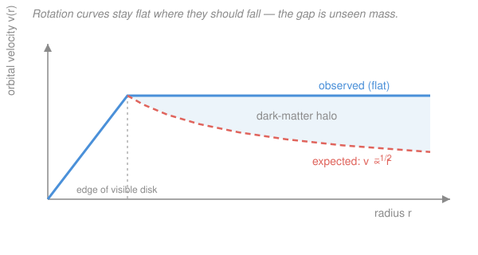

# Cosmology · Lesson 3.3: Dark matter — the evidence and the candidates

> ⏱ ~15 min · Module 3: The CMB and structure formation · Builds on: [3.2 Gravitational instability and linear growth](03-02-gravitational-instability-linear-growth.md) · Unlocks: [3.4 The matter power spectrum](03-04-matter-power-spectrum.md)

## Why this matters

In [3.2](03-02-gravitational-instability-linear-growth.md) we found that gravity grows density contrasts only slowly — perturbations that were $\delta \sim 10^{-5}$ at recombination could not have collapsed into galaxies by today using *ordinary matter alone*. Something with extra gravity, no light, and a head start on growth had to be there. That something is **dark matter**: five-sixths of all the matter in the universe, and the scaffolding every galaxy and cluster is built on. This lesson assembles the independent lines of evidence — no single one is airtight, but together they converge on the same conclusion — then asks *what it is*: cold not hot, and drawn from a short list of particle candidates you'll meet again in nuclear-particle physics.

## The idea

Weigh a galaxy two ways and you get two different answers. Count its stars and gas — the stuff that shines — and you get one mass. Watch how fast things *orbit* it, and gravity reports a much bigger mass. The orbits win: gravity doesn't lie about how much mass is pulling. The extra mass is dark — it neither emits nor absorbs light — but it is unmistakably *there*, because orbits, hot gas, and even bent starlight all feel it.

The cleanest tell is a **rotation curve**. In the Solar System, planets far from the Sun orbit slowly: almost all the mass is central, so speed falls off as $v \propto r^{-1/2}$ (Kepler). A spiral galaxy should do the same *once you pass the bright disk* — but it doesn't. The orbital speed stays flat, mile after mile, far beyond the last visible star. Flat speed at growing radius means the enclosed mass keeps *growing* — there is an invisible **halo** of matter extending well past the light.

And this isn't one weird galaxy. Clusters of galaxies move too fast to stay bound by their visible mass. Their hot gas is too hot to be held by starlight alone. Distant galaxies behind them are smeared into arcs by more gravity than the visible mass can supply. Four different rulers, one missing ingredient.

## The formal version

**Rotation curves.** A test object on a circular orbit of radius $r$ (meters) around enclosed mass $M(r)$ (kg) balances gravity against centripetal acceleration, $GM(r)/r^2 = v^2/r$, so

$$v(r) = \sqrt{\frac{GM(r)}{r}},$$

with $G = 6.674\times10^{-11}\ \mathrm{m^3\,kg^{-1}\,s^{-2}}$ and $v$ the circular speed. *In words: orbital speed is set by how much mass lies inside your orbit.* Outside the visible disk almost no new light appears, so if light traced mass, $M$ would level off and $v \propto r^{-1/2}$ would **fall** (Keplerian). Instead observed curves are **flat**, $v \approx \text{const}$, which by the formula forces

$$M(r) \propto r, \qquad \rho(r) = \frac{1}{4\pi r^2}\frac{dM}{dr} = \frac{v^2}{4\pi G r^2} \propto r^{-2}.$$

*In words: a flat curve demands mass piling up linearly with radius — an extended halo whose density falls off as $r^{-2}$, not the sharp cutoff of the stellar disk.* (Historically: Zwicky flagged missing cluster mass in 1933; Vera Rubin's 1970s spiral-galaxy rotation curves made it undeniable.)

**Cluster masses (the virial theorem).** For a self-gravitating swarm of galaxies in equilibrium, the virial theorem $2K + U = 0$ (see stat-mech's equipartition/virial arguments) relates the internal kinetic and potential energies. With line-of-sight velocity dispersion $\sigma$ (the spread in galaxy speeds) and size $R$, this gives an order-of-magnitude **dynamical mass**

$$M \sim \frac{\sigma^2 R}{G}$$

(the exact prefactor is a few, geometry-dependent). *In words: the faster the galaxies swarm, the more mass must be holding them.* For the Coma cluster this is roughly ten times the luminous mass. An independent check: the cluster's X-ray-emitting gas sits in **hydrostatic equilibrium**, its temperature fixed by the depth of the gravitational well — and it too requires far more mass than the galaxies and gas provide.

**Gravitational lensing.** Mass bends light (general relativity — see [`relativity`](../../relativity/syllabus.md)), deflecting rays from background galaxies into arcs (strong lensing) or coherent shape distortions (weak lensing). The bending measures **total mass directly**, with no assumption that the system is in equilibrium or that orbits are circular — a completely independent weighing. It agrees with the dynamical masses: most of the mass is dark.

**The Bullet Cluster** — the clincher. Two clusters have collided. Their **galaxies and dark matter are collisionless**, so they sailed through each other and are found out front. Their **hot gas is collisional** — it rammed, shocked, and lagged behind in the middle. Lensing maps where the *mass* is; X-rays map where the *gas* is. The two are spatially **offset**: the gravitating mass sits with the galaxies, not with the gas that dominates the ordinary (baryonic) matter. *In words: the mass and the visible baryons are in different places* — exactly what collisionless dark matter predicts, and very hard to fake by changing the law of gravity, which would put the extra pull *on the gas* where the baryons are.

**The cosmological clincher.** The CMB acoustic-peak heights ([3.6](03-06-reading-cmb-power-spectrum.md)) and the growth argument of [3.2](03-02-gravitational-instability-linear-growth.md) both demand matter that does **not** feel photon pressure — non-baryonic — so it can start collapsing *before* recombination. The budget comes out to cold dark matter $\Omega_c \approx 0.26$ versus baryons $\Omega_b \approx 0.05$ (density parameters from [1.5](01-05-cosmic-energy-budget-lambda-cdm.md)): about five times as much dark matter as ordinary matter.

**Cold vs hot.** The last question is the dark matter's *speed* when structure began to form.

- **Hot** dark matter is light and **relativistic** at freeze-out (e.g. light neutrinos). Moving near $c$, it **free-streams** across large distances, smearing out — erasing — any density lump smaller than its **free-streaming length**. Small-scale perturbations die, so the first things to form are huge; galaxies fragment out later. This **top-down** picture is ruled out — we see old galaxies and a rich hierarchy of small structure.
- **Cold** dark matter is **non-relativistic** early, with negligible thermal motion. Its free-streaming length is tiny, so perturbations survive on **all** scales. Small things collapse first and merge upward: **bottom-up** hierarchical formation. This matches the observed universe.

Hence the concordance model is **$\Lambda$CDM** — cold dark matter plus a cosmological constant.

## Picture

## Worked examples

**Example 1 (mechanical — weigh a galaxy).** The Milky Way's rotation curve is flat at $v \approx 220\ \mathrm{km/s}$. How much mass lies inside $r = 20\ \mathrm{kpc}$? Use $M = v^2 r/G$ with $v = 2.2\times10^5\ \mathrm{m/s}$ and $1\ \mathrm{kpc} = 3.086\times10^{19}\ \mathrm{m}$, so $r = 6.17\times10^{20}\ \mathrm{m}$:

$$M = \frac{(2.2\times10^5)^2\,(6.17\times10^{20})}{6.674\times10^{-11}} \approx 4.5\times10^{41}\ \mathrm{kg} \approx 2.3\times10^{11}\,M_\odot,$$

using $M_\odot = 1.99\times10^{30}\ \mathrm{kg}$. That is several times the mass of all the Galaxy's stars — and it keeps climbing as $r$ grows, the signature of the halo.

**Example 2 (why you'd care — the Bullet Cluster kills "it's just gravity").** Suppose there is no dark matter and gravity is simply stronger than Newton at large scales (a MOND-type idea). Then the extra pull must attach to the real mass — and in a cluster the real (baryonic) mass is dominated by the **hot gas**, not the galaxies. So the lensing signal, tracing where gravity is strongest, should peak **on the gas**. In the Bullet Cluster it peaks on the galaxies, hundreds of kiloparsecs *away* from the gas, at high statistical significance. A modified force tied to the visible baryons cannot put the gravity where the baryons aren't. Collisionless dark matter can, because it separated from the gas in the collision. This is why the Bullet Cluster is the single hardest observation for pure modified-gravity models.

## Watch out

- **You might think a flat rotation curve means constant mass.** The opposite — *constant speed* with $v^2 = GM(r)/r$ forces $M(r) \propto r$, mass growing without bound (until the halo eventually ends). It's the *Keplerian* falloff $v\propto r^{-1/2}$ that signals a finite central mass.
- **You might think dark matter is just dim ordinary matter** — faint stars, cold gas, black holes (MACHOs). Microlensing surveys ruled out enough compact baryonic objects to matter, and the CMB fixes $\Omega_b$ independently: there simply aren't enough baryons. Dark matter is non-baryonic.
- **You might think lensing and dynamics are the same evidence.** They're independent: dynamics assumes orbits and equilibrium; lensing (via [`relativity`](../../relativity/syllabus.md)) measures mass straight from light-bending with no such assumption. Their agreement is why the case is strong.
- **"Cold" doesn't mean low temperature today** — it means non-relativistic *when structure began forming*, so it clusters on small scales instead of free-streaming them away.

## One-liner

> Orbits, hot gas, and bent starlight all report far more mass than shines — an extended, collisionless, non-baryonic, *cold* halo whose separation from the gas in the Bullet Cluster shows it's real matter, not modified gravity.

## Problems

**P1 (🟢)** A galaxy has a perfectly flat rotation curve, $v(r) = v_0 = \text{const}$. (a) Show from $v^2 = GM(r)/r$ that the enclosed mass satisfies $M(r) \propto r$ and the halo density $\rho(r) \propto r^{-2}$. (b) For $v_0 = 220\ \mathrm{km/s}$, find the mass enclosed within $r = 20\ \mathrm{kpc}$ (use $1\ \mathrm{kpc} = 3.086\times10^{19}\ \mathrm{m}$).

**P2 (🟡)** A galaxy cluster has line-of-sight velocity dispersion $\sigma = 1000\ \mathrm{km/s}$ and radius $R = 1.5\ \mathrm{Mpc}$ ($1\ \mathrm{Mpc} = 3.086\times10^{22}\ \mathrm{m}$). Estimate its dynamical mass from $M \sim \sigma^2 R / G$ and compare to a luminous (stars + gas) mass of $\approx 3\times10^{13}\,M_\odot$. What is the dark-matter-to-luminous ratio? (Bridges to astrophysics — see [`astrophysics`](../../astrophysics/syllabus.md).)

**P3 (🔴)** (a) Explain, using the idea of a **free-streaming length**, why *hot* dark matter erases small-scale structure while *cold* dark matter does not — and which of top-down or bottom-up formation each predicts. (b) State precisely what the Bullet Cluster observation shows and why it rules out "the extra gravity is just modified gravity acting on the ordinary matter."

Solutions

**P1** (a) From $v^2 = GM(r)/r$, solve for the enclosed mass:
$$M(r) = \frac{v^2 r}{G} = \frac{v_0^2}{G}\,r \quad\Longrightarrow\quad M(r) \propto r,$$
since $v_0$ is constant. The density comes from the spherical mass relation $M(r) = \int_0^r 4\pi r'^2 \rho(r')\,dr'$, i.e. $dM/dr = 4\pi r^2 \rho$. But $dM/dr = v_0^2/G$ is constant, so
$$\rho(r) = \frac{1}{4\pi r^2}\frac{dM}{dr} = \frac{v_0^2}{4\pi G}\,\frac{1}{r^2} \propto r^{-2}. \checkmark$$

(b) With $v_0 = 2.2\times10^5\ \mathrm{m/s}$ and $r = 20 \times 3.086\times10^{19} = 6.17\times10^{20}\ \mathrm{m}$:
$$M = \frac{v_0^2 r}{G} = \frac{(2.2\times10^5)^2\,(6.17\times10^{20})}{6.674\times10^{-11}} = \frac{(4.84\times10^{10})(6.17\times10^{20})}{6.674\times10^{-11}} \approx 4.5\times10^{41}\ \mathrm{kg}.$$
Dividing by $M_\odot = 1.99\times10^{30}\ \mathrm{kg}$ gives $\approx 2.3\times10^{11}\,M_\odot$.

*Check.* Units of $v^2 r/G$: $(\mathrm{m^2\,s^{-2}})(\mathrm{m})/(\mathrm{m^3\,kg^{-1}\,s^{-2}}) = \mathrm{kg}$ ✓. The value is a few times the Milky Way's stellar mass ($\sim 5\times10^{10}\,M_\odot$), and it *grows* with $r$ — the halo signature.

**P2** With $\sigma = 10^6\ \mathrm{m/s}$ and $R = 1.5\times3.086\times10^{22} = 4.63\times10^{22}\ \mathrm{m}$:
$$M \sim \frac{\sigma^2 R}{G} = \frac{(10^6)^2\,(4.63\times10^{22})}{6.674\times10^{-11}} = \frac{4.63\times10^{34}}{6.674\times10^{-11}} \approx 6.9\times10^{44}\ \mathrm{kg} \approx 3.5\times10^{14}\,M_\odot.$$
Compared to the luminous $3\times10^{13}\,M_\odot$, the ratio is
$$\frac{3.5\times10^{14}}{3\times10^{13}} \approx 12.$$
So the cluster is roughly an order of magnitude more massive than its visible contents — about ten times as much dark matter as luminous matter. (The exact virial prefactor of a few would push the total higher still, only strengthening the conclusion.)

*Check.* Units of $\sigma^2 R/G$: $(\mathrm{m^2\,s^{-2}})(\mathrm{m})/(\mathrm{m^3\,kg^{-1}\,s^{-2}}) = \mathrm{kg}$ ✓. A cluster mass of $\sim 10^{14}$–$10^{15}\,M_\odot$ is the right ballpark. This is essentially Zwicky's 1933 argument for Coma.

**P3** (a) A dark-matter particle moving at speed $v_{\rm th}$ travels a comoving distance — its **free-streaming length** $\lambda_{\rm fs}$ — before it slows enough (redshifts to non-relativistic) to sit in and grow a density well. Any perturbation *smaller* than $\lambda_{\rm fs}$ gets smeared out, because particles stream out of overdense regions faster than gravity can pile them in. Hot dark matter (light, e.g. an $\sim\mathrm{eV}$ neutrino) is relativistic at freeze-out, so $v_{\rm th} \approx c$ for a long time and $\lambda_{\rm fs}$ is huge (tens of Mpc — galaxy-cluster scale). It therefore erases all galaxy- and cluster-scale seeds: only the largest structures survive to collapse first, then fragment — **top-down**. Cold dark matter is non-relativistic very early ($v_{\rm th} \ll c$), so $\lambda_{\rm fs}$ is negligibly small; perturbations survive on all scales, small ones collapse first and merge upward — **bottom-up hierarchical** formation, which is what we observe.

(b) In the Bullet Cluster, two clusters have passed through each other. The gravitational-lensing mass map (total mass) is spatially **offset** from the X-ray gas (which is most of the *baryonic* mass): the mass sits with the galaxies, which passed through, while the collisional gas shocked and lagged in the middle. Because the collisionless mass and the dominant baryons are in **different places**, a modified law of gravity — which sources the extra pull from the *existing* (mostly gaseous) baryonic mass — would predict the lensing to peak on the gas. It doesn't. Only genuine collisionless matter, separated from the gas during the collision, puts the gravity where the galaxies are. Hence the Bullet Cluster is direct evidence that dark matter is real, particulate, and collisionless — not an artifact of modified gravity.

## Flashback

**From Lesson 3.2 (Gravitational instability and linear growth):** During matter domination the density contrast grows as $\delta \propto a$, where $a$ is the scale factor (normalized to $a_0 = 1$ today). At recombination ($a \approx 1/1100$) the CMB tells us $\delta \sim 10^{-5}$. (a) If ordinary (baryonic) matter *only* began growing at recombination, estimate $\delta$ today, and explain why this rules out a baryon-only universe. (b) How does non-baryonic dark matter fix the problem?

Solution

(a) With $\delta \propto a$, growth from recombination to now is by the factor $a_0/a_{\rm rec} = 1/(1/1100) = 1100$:
$$\delta_{\rm today} \sim 10^{-5} \times 1100 \approx 10^{-2}.$$
That is still $\ll 1$ — the perturbation is nowhere near the $\delta \sim 1$ needed for gravitational collapse into a galaxy. A baryon-only universe growing from the observed $10^{-5}$ CMB seeds simply **runs out of time**: it would be nearly featureless today, with no galaxies. Yet galaxies exist and are old.

(b) Dark matter is non-baryonic, so it does **not** feel photon pressure and is not held smooth by coupling to the radiation. Its perturbations begin growing already at matter–radiation equality ($a_{\rm eq} \approx 1/3400$), *well before* recombination, and are not tied to the $10^{-5}$ photon-visible amplitude. By recombination the dark-matter wells are already substantially deeper. When the baryons finally decouple from the photons, they **fall into the pre-built dark-matter potential wells**, catching up rapidly rather than starting from scratch. The head start — available only to matter that ignores photon pressure — is exactly why structure formation demands non-baryonic dark matter.

*Check.* The factor-of-$1100$ shortfall is the crux: it is why "the CMB is too smooth for a baryon-only universe to have made galaxies" is one of the strongest structural arguments for dark matter, dovetailing with the dynamical and lensing evidence in this lesson.

## Connections

- **Backward:** this is the resolution of the growth shortfall from [3.2](03-02-gravitational-instability-linear-growth.md) — perturbations need a component that grows before recombination. The relic-abundance "miracle" that predicts a WIMP's density is the freeze-out calculation from [2.3](02-03-relics-neutrino-background.md); the same $\Gamma$-vs-$H$ competition sets whether a candidate is hot or cold.
- **Forward:** [3.4 The matter power spectrum](03-04-matter-power-spectrum.md) turns "cold vs hot" into a measurable curve — free-streaming imprints a cutoff at small scales, and the shape of the spectrum is a direct fingerprint of the dark matter's temperature. The CMB peak heights that pin $\Omega_c$ vs $\Omega_b$ arrive in [3.6](03-06-reading-cmb-power-spectrum.md).
- **Sideways (particle physics):** the candidate list — **WIMPs** (weak-scale, relic abundance from freeze-out), **axions** (very light, also solve the strong-CP problem of QCD), **sterile neutrinos**, and **primordial black holes** — is the subject of ongoing direct-detection, indirect-detection, and collider searches (all null so far). These live in nuclear and particle physics — see [`nuclear-particle-physics`](../../nuclear-particle-physics/syllabus.md). MACHOs (compact baryonic objects) are ruled out by microlensing, and the rotation-curve and cluster measurements themselves are bread-and-butter [`astrophysics`](../../astrophysics/syllabus.md).
