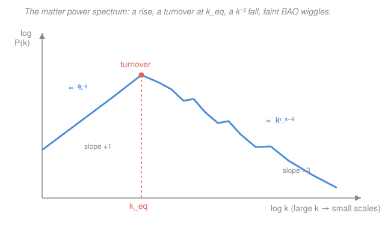

# Cosmology · Lesson 3.4: The matter power spectrum

> ⏱ ~15 min · Module 3: The CMB and structure formation · Builds on: [3.2 Gravitational instability and linear growth](03-02-gravitational-instability-linear-growth.md), [3.3 Dark matter: evidence and candidates](03-03-dark-matter-evidence-candidates.md) · Unlocks: [3.5 CMB anisotropies and acoustic oscillations](03-05-cmb-anisotropies-acoustic-oscillations.md)

## Why this matters

You can't write down the density of the universe at every point — the galaxy distribution is a *random* field, seeded by quantum noise in the early universe (Module 4). So you do what physics always does with randomness: you characterize it **statistically**. The single most important statistic is the **matter power spectrum** $P(k)$ — it tells you how much the universe clumps at each length scale, and its shape is a fossil record. Buried in it are the epoch of matter–radiation equality, the total matter density, and the sound waves that also ring in the CMB. Reading $P(k)$ is how galaxy surveys (SDSS, DESI) turn a map of a billion galaxies into a handful of cosmological numbers.

## The idea

Picture the density contrast $\delta(\mathbf x) = \big(\rho(\mathbf x) - \bar\rho\big)/\bar\rho$ from [3.2](03-02-gravitational-instability-linear-growth.md) — the fractional over- or under-density at each point. It's a hilly landscape with structure on many scales at once: giant superclusters, individual clusters, single galaxies. Trying to describe every bump is hopeless. Instead, **decompose the landscape into waves** — a Fourier transform — and ask a simpler question: *at each wavelength, how big are the ripples, on average?*

That average ripple-strength-per-scale is the power spectrum. A big $P(k)$ at some wavenumber $k$ means the universe has lots of clumping at that scale; a small $P(k)$ means it's smooth there. This is not a cosmology trick — it is **exactly the spectral-density idea from Fourier analysis**: a random signal has no meaningful value at each frequency, but it has a well-defined *power* at each frequency. Cosmologists just apply it to $\delta(\mathbf x)$ in 3D space instead of a voltage in time. (Bridge: [fourier-analysis](../../fourier-analysis/syllabus.md) — spectral density and the Wiener–Khinchin theorem.)

The punchline of the whole lesson is the **shape** of $P(k)$: it rises, bends over at one special scale, and falls. That bend is a photograph of the moment the universe switched from radiation-dominated to matter-dominated.

## The formal version

**Fourier expansion.** Write the density contrast as a sum of plane waves:

$$\delta(\mathbf x) = \int \frac{d^3k}{(2\pi)^3}\, \tilde\delta(\mathbf k)\, e^{i\mathbf k\cdot\mathbf x},$$

where $\mathbf k$ is the **wavevector** (units: inverse length; its magnitude $k=|\mathbf k|$ is the **wavenumber**, tied to physical scale by $\lambda = 2\pi/k$), and $\tilde\delta(\mathbf k)$ is the complex amplitude of the wave at that $\mathbf k$. *In words: any clumpy field is a superposition of ripples, and $\tilde\delta(\mathbf k)$ says how much of each ripple is present.* Large $k$ = short wavelength = **small scales**; small $k$ = **large scales**.

**The power spectrum.** Because $\delta$ is random, $\tilde\delta(\mathbf k)$ is random too — its phase is scrambled and its average is zero. What survives is its *variance*:

$$\big\langle \tilde\delta(\mathbf k)\, \tilde\delta^*(\mathbf k') \big\rangle = (2\pi)^3\, \delta_D(\mathbf k - \mathbf k')\, P(k).$$

Here $\langle\cdot\rangle$ is an average over realizations (or, in practice, over the sky), $\tilde\delta^*$ is the complex conjugate, and $\delta_D$ is the **Dirac delta** (not the density contrast — an unfortunate but universal clash of notation). *In words: different Fourier modes are uncorrelated (that's the $\delta_D$), and the strength of a single mode at scale $k$ is $P(k)$* — the variance of density fluctuations per Fourier mode. Homogeneity forces the dependence to be on $k=|\mathbf k|$ alone (no preferred direction), so $P(k)$ is a function of one number.

**Fourier pair with the correlation function.** $P(k)$ is the Fourier transform of the two-point correlation function $\xi(r) = \langle \delta(\mathbf x)\,\delta(\mathbf x + \mathbf r)\rangle$, which measures the excess probability of finding two galaxies a distance $r$ apart. That $P(k) \leftrightarrow \xi(r)$ relationship *is* the **Wiener–Khinchin theorem** from [fourier-analysis](../../fourier-analysis/syllabus.md): power spectrum and autocorrelation are a Fourier pair.

**Primordial spectrum.** Inflation predicts the initial spectrum is a near-perfect power law,

$$P_i(k) \propto k^{n_s},$$

with **spectral index** $n_s$. The value $n_s = 1$ is the **Harrison–Zel'dovich** spectrum — *scale-invariant*, meaning fluctuations enter the horizon with the same amplitude at every scale (the natural, featureless choice). Observation gives $n_s \approx 0.965$: a slight **red tilt** ($n_s < 1$, marginally more power on large scales), a signature we'll trace back to inflation in [4.3](04-03-primordial-perturbations-inflation.md).

**The transfer function and the turnover.** The primordial spectrum is not what we see — it gets *processed* by everything that happened between then and now. Encode that processing in the **transfer function** $T(k)$:

$$P(k) = P_i(k)\, T^2(k) \times (\text{growth}).$$

The key physics is from [3.2](03-02-gravitational-instability-linear-growth.md): during the **radiation era**, sub-horizon dark-matter perturbations barely grow (**Mészáros suppression** — the radiation pressure drives such fast expansion that gravity can't accumulate matter). Modes that entered the horizon *while radiation dominated* got their growth stalled; modes that entered *after* matter took over grew unimpeded. The dividing line is the scale that crossed the horizon exactly at **matter–radiation equality**, $k_\text{eq}$. This bends the spectrum:

$$P(k) \propto
\begin{cases}
k^{\,n_s} & k \ll k_\text{eq} \quad(\text{large scales, } T\to 1)\\[4pt]
k^{\,n_s-4} & k \gg k_\text{eq} \quad(\text{small scales, } T \propto k^{-2})
\end{cases}$$

*In words: on large scales $P(k)$ rises like the primordial $k^{n_s}$; past the turnover at $k_\text{eq}$ it falls like $k^{n_s-4}$, because small-scale modes each lost a factor $T\propto k^{-2}$ of amplitude to radiation-era stalling.* The turnover scale is a direct fingerprint of the horizon size at equality, hence of the redshift of equality $z_\text{eq}$ (from [1.5](01-05-cosmic-energy-budget-lambda-cdm.md)). Numerically $k_\text{eq} \approx 0.01\ h/\text{Mpc}$.

**Normalizing the amplitude: $\sigma_8$.** The shape is one thing; the overall *height* of $P(k)$ is another number, conventionally reported as $\sigma_8$ — the rms density contrast when the field is smoothed on spheres of radius $8\ h^{-1}\text{Mpc}$:

$$\sigma_R^2 = \int \frac{dk}{k}\, \frac{k^3 P(k)}{2\pi^2}\, W^2(kR),$$

with $W(kR)$ a **top-hat window** (the Fourier transform of a uniform sphere of radius $R$), and $\sigma_8 \equiv \sigma_{R=8\,h^{-1}\text{Mpc}}$. *In words: smear the density map on 8-Mpc-ish balls, and $\sigma_8$ is the typical fractional lumpiness that remains.* Observationally $\sigma_8 \approx 0.8$ — a number so standard that "the $\sigma_8$ tension" is a live research topic.

**Baryon acoustic oscillations (BAO).** Superimposed on the smooth $P(k)$ is a train of small **wiggles** — the imprint of sound waves in the pre-recombination photon–baryon fluid (the *same* waves that ring in the CMB, [3.5](03-05-cmb-anisotropies-acoustic-oscillations.md)). They set a standard ruler; full story in [3.5](03-05-cmb-anisotropies-acoustic-oscillations.md) and [4.5](04-05-cosmic-distance-ladder-observational.md).

## Picture

## Worked examples

**Example 1 (mechanical — read the slopes off the shape).** Take the scale-invariant case $n_s = 1$. On large scales $T \to 1$, so $P(k) \propto k^{1}$: the curve rises with slope $+1$ on a log-log plot. On small scales the transfer function suppresses each mode by $T \propto k^{-2}$, so $P(k) = P_i(k)\,T^2 \propto k^1 \cdot (k^{-2})^2 = k^{-3}$: the curve falls with slope $-3$. Between them sits the turnover at $k_\text{eq}$. So a single kink at $k_\text{eq}$ separates a $k^{+1}$ rise from a $k^{-3}$ fall — precisely the figure above.

**Example 2 (why you'd care — the turnover dates the universe).** Why is the bend *exactly* at $k_\text{eq}$? A mode with $k < k_\text{eq}$ has a wavelength larger than the horizon at equality — it only entered the horizon *after* matter domination began, so it never suffered Mészáros stalling and keeps its full primordial amplitude. A mode with $k > k_\text{eq}$ entered *during* the radiation era and sat frozen until equality, losing amplitude the whole time. The changeover scale is set by how big the horizon was at equality, which is set by *when* equality happened, i.e. by $z_\text{eq}$. Measuring the turnover location is therefore a way to *weigh the matter in the universe* — see Problem 3. That's the payoff: a feature in a statistics plot is really a clock reading from redshift $\sim 3400$.

## Watch out

- **You might think a large $k$ means a large scale.** Backwards: $k = 2\pi/\lambda$, so large $k$ = *short* wavelength = *small* physical scales (galaxies), and small $k$ = large scales (superclusters). The turnover at $k_\text{eq}\approx 0.01\ h/\text{Mpc}$ sits toward the *large-scale* (small-$k$) end.
- **You might read a rising $P(k)$ as "more clumping on large scales."** The plotted $P(k)$ rises toward small $k$ only up to the turnover, then falls — but even where it "falls," what matters for collapse is the *dimensionless* power $\Delta^2(k) = k^3 P(k)/2\pi^2$, which keeps rising to small scales. Small scales go nonlinear first; that's why galaxies formed before clusters.
- **Don't confuse the two $\delta$'s.** $\delta(\mathbf x)$ is the density contrast; $\delta_D$ is the Dirac delta enforcing that distinct Fourier modes are independent. Same letter, unrelated jobs.
- **$P(k)$ is a variance, not an amplitude.** A given realization's $\tilde\delta(\mathbf k)$ has random phase; only its *statistical* magnitude, averaged over modes, is predicted. You cannot ask theory where a specific cluster will be — only how clustered the map is.

## One-liner

> The matter power spectrum $P(k)$ is the variance of density ripples per scale; it rises as $k^{n_s}$, turns over at $k_\text{eq}$ — the horizon at matter–radiation equality — and falls as $k^{n_s-4}$, encoding $z_\text{eq}$ and hence $\Omega_m h^2$ in a single kink.

## Problems

**P1 (🟢)** Assume a scale-invariant primordial spectrum, $n_s = 1$. (a) Give the slope of $P(k)$ versus $k$ (on a log-log plot) on large scales and on small scales. (b) State physically what sets the turnover scale $k_\text{eq}$ that separates the two.

**P2 (🟡)** A Fourier scale $k$ encloses a mass roughly $M \sim \bar\rho\,(2\pi/k)^3$, where $\bar\rho$ is the mean matter density. Using the comoving mean matter density $\bar\rho_m = 2.775\times10^{11}\,\Omega_m\ M_\odot/(h^{-1}\text{Mpc})^3$ with $\Omega_m = 0.3$, and $k_\text{eq} = 0.01\ h/\text{Mpc}$, estimate the mass scale $M_\text{eq}$ that the turnover corresponds to. Compare it to a massive galaxy cluster ($\sim 10^{15}\,M_\odot$) and interpret.

**P3 (🔴)** Show that the turnover encodes $z_\text{eq}$ and hence $\Omega_m h^2$. Using $z_\text{eq} = \Omega_m/\Omega_r$ (from [1.5](01-05-cosmic-energy-budget-lambda-cdm.md)) and the fact that the radiation density today is fixed by the CMB temperature so that $\Omega_r h^2$ is a constant, argue that the comoving horizon wavenumber at equality satisfies $k_\text{eq} \propto \Omega_m h^2$. Why does this let a galaxy survey measure $\Omega_m h^2$ from the *location* of the bend alone?

Solutions

**P1** (a) With $n_s = 1$: on **large scales** ($k \ll k_\text{eq}$) the transfer function $T\to 1$, so $P(k)\propto k^{n_s} = k^{1}$ — slope $+1$. On **small scales** ($k \gg k_\text{eq}$) the transfer function suppresses each mode as $T\propto k^{-2}$, so $P(k)\propto k^{1}\,(k^{-2})^2 = k^{-3}$ — slope $-3$. (b) The turnover sits at the comoving scale that **entered the horizon at matter–radiation equality**. Modes larger than this ($k<k_\text{eq}$) crossed the horizon only after matter domination and grew unimpeded; modes smaller ($k>k_\text{eq}$) entered during radiation domination and were frozen by Mészáros suppression until equality, losing amplitude. So $k_\text{eq}$ is the horizon wavenumber at $z_\text{eq}$.

*Check.* The slope changes by exactly $\Delta = (n_s-4) - n_s = -4$ across the turnover, independent of $n_s$ — the transfer function alone bends it, as it should. ✓

**P2** The comoving wavelength at the turnover is
$$\lambda_\text{eq} = \frac{2\pi}{k_\text{eq}} = \frac{2\pi}{0.01\ h/\text{Mpc}} = 628\ h^{-1}\text{Mpc}.$$
The mean matter density is $\bar\rho_m = 2.775\times10^{11}\times 0.3 = 8.33\times10^{10}\ M_\odot/(h^{-1}\text{Mpc})^3$. Then
$$M_\text{eq} \sim \bar\rho_m\,\lambda_\text{eq}^3 = 8.33\times10^{10}\times(628)^3\ M_\odot = 8.33\times10^{10}\times 2.48\times10^{8}\ M_\odot \approx 2\times10^{19}\ M_\odot/h.$$
This is roughly **four orders of magnitude larger than the most massive galaxy clusters** ($\sim10^{15}\,M_\odot$). Interpretation: no virialized object anywhere near the turnover mass has ever collapsed — the turnover lives on scales bigger than *any* bound structure. Every galaxy and cluster we see formed from the **small-scale, large-$k$** side of $P(k)$, in the suppressed $k^{-3}$ regime. The turnover is a feature of the *linear* density field, not a mass at which halos pile up.

*Check.* Order of magnitude is sensitive to the $(2\pi)^3\approx 248$ prefactor; using $R = 1/k_\text{eq}$ instead of $\lambda=2\pi/k_\text{eq}$ gives $\sim10^{16}\,M_\odot/h$ — still far above cluster masses, so the conclusion is robust. ✓

**P3** The turnover wavenumber is the comoving Hubble scale at equality, $k_\text{eq} = a_\text{eq}H(a_\text{eq})$ (a mode enters the horizon when $k = aH$). From the Friedmann equation with matter and radiation, $H^2 = H_0^2(\Omega_m a^{-3} + \Omega_r a^{-4})$, and at equality the two terms are equal, so
$$H_\text{eq}^2 = 2H_0^2\,\Omega_m a_\text{eq}^{-3},\qquad a_\text{eq} = \frac{\Omega_r}{\Omega_m} = \frac{1}{1+z_\text{eq}}.$$
Therefore
$$k_\text{eq} = a_\text{eq}H_\text{eq} = a_\text{eq}\,H_0\sqrt{2\Omega_m a_\text{eq}^{-3}} = H_0\sqrt{2\Omega_m\,a_\text{eq}^{-1}} = H_0\sqrt{2\Omega_m\cdot\frac{\Omega_m}{\Omega_r}} = \sqrt{2}\,H_0\,\frac{\Omega_m}{\sqrt{\Omega_r}}.$$
Now use $H_0 \propto h$ and, crucially, $\Omega_r = (\Omega_r h^2)/h^2$ with $\Omega_r h^2 = \text{const}$ (radiation is fixed by the measured CMB temperature), so $\sqrt{\Omega_r}\propto 1/h$. Then
$$k_\text{eq} \propto h\cdot\frac{\Omega_m}{1/h} = \Omega_m h^2.$$
So the turnover scale is proportional to $\Omega_m h^2$. And $z_\text{eq} = \Omega_m/\Omega_r = (\Omega_m h^2)/(\Omega_r h^2) \propto \Omega_m h^2$ too — the *same* combination. A galaxy survey that locates the bend in $P(k)$ reads off $k_\text{eq}$ directly, and since $k_\text{eq}\propto\Omega_m h^2$, that *location* alone measures the physical matter density $\Omega_m h^2$ (equivalently $z_\text{eq}$) — no need to trust the overall amplitude or the tricky small-scale physics.

*Check.* Plugging numbers: $\Omega_m h^2 \approx 0.14$ gives $k_\text{eq}\approx 0.015\ h/\text{Mpc}$ from standard fitting formulas, consistent with the quoted $\sim 0.01\ h/\text{Mpc}$. And more matter (larger $\Omega_m h^2$) means equality happened *earlier* (higher $z_\text{eq}$), a smaller horizon then, hence a *larger* $k_\text{eq}$ — the bend moves to smaller scales, matching $k_\text{eq}\propto\Omega_m h^2$. ✓

## Flashback

**From Lesson 3.2 (Gravitational instability and linear growth):** In the matter-dominated era a linear density perturbation grows as $\delta \propto a$, where $a$ is the scale factor. A perturbation has $\delta = 1\times10^{-4}$ at matter–radiation equality, $z_\text{eq} \approx 3400$. Ignoring dark energy, estimate $\delta$ today ($z=0$). Is it still in the linear regime?

Solution

In matter domination $\delta \propto a = 1/(1+z)$, so the growth factor from equality to today is
$$\frac{\delta_0}{\delta_\text{eq}} = \frac{a_0}{a_\text{eq}} = 1 + z_\text{eq} \approx 3400.$$
Hence
$$\delta_0 \approx 10^{-4}\times 3400 = 0.34.$$
Since $\delta_0 < 1$, the perturbation is **still (marginally) linear** today — it has not yet collapsed. This is exactly why linear theory works well for the large-scale density field even at $z=0$: modes that entered near equality have grown by only $\sim 3000$ from their tiny primordial amplitude of $\sim10^{-4}$.

*Check.* The sense is right: earlier equality (larger $z_\text{eq}$) gives more growth, and starting amplitudes of $10^{-5}$–$10^{-4}$ are what the CMB measures — landing $\delta_0$ near unity, right at the linear/nonlinear boundary, as observed. Including dark energy would *slow* late-time growth slightly (structure growth freezes once $\Lambda$ dominates, [4.4](04-04-dark-energy-cosmic-acceleration.md)), lowering $\delta_0$ a bit. ✓

## Connections

- **Backward:** the entire *shape* of $P(k)$ is [3.2](03-02-gravitational-instability-linear-growth.md)'s growth physics written in Fourier space — Mészáros suppression during radiation domination is what bends $k^{n_s}$ into $k^{n_s-4}$, and the turnover marks matter–radiation equality from [1.5](01-05-cosmic-energy-budget-lambda-cdm.md). That the clustering is dominated by pressureless, freely-growing matter is exactly why dark matter ([3.3](03-03-dark-matter-evidence-candidates.md)) is needed: baryons alone couldn't have grown structure through the radiation era.
- **Forward:** [3.5](03-05-cmb-anisotropies-acoustic-oscillations.md) shows the CMB temperature spectrum is the *same* statistical idea projected onto the sky, and that the BAO wiggles on $P(k)$ are the photon–baryon acoustic peaks seen in matter; [4.3](04-03-primordial-perturbations-inflation.md) explains where the primordial $P_i(k)\propto k^{n_s}$ and its red tilt come from.
- **Sideways (Fourier analysis):** $P(k)$ *is* the spectral density of the random field $\delta(\mathbf x)$, and its Fourier-pair relationship with the correlation function $\xi(r)$ is the **Wiener–Khinchin theorem** — the cosmic density field is a stationary random process treated with the identical machinery you'd use for noise in a signal ([fourier-analysis](../../fourier-analysis/syllabus.md)).
