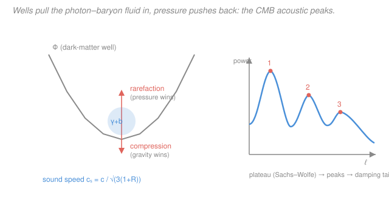

# Cosmology · Lesson 3.5: CMB anisotropies and acoustic oscillations

> ⏱ ~15 min · Module 3: The CMB and structure formation · Builds on: [3.1 Recombination and the origin of the CMB](03-01-recombination-origin-cmb.md), [3.4 The matter power spectrum](03-04-matter-power-spectrum.md) · Unlocks: 3.6 (reading the CMB power spectrum)

## Why this matters

The cosmic microwave background is the most perfect blackbody ever measured — a $2.725\ \mathrm{K}$ glow filling the sky from every direction. But it is not *quite* uniform: across the sky its temperature ripples by about one part in $100{,}000$. Those ripples are the single richest dataset in cosmology. Hidden in them is a snapshot of sound waves that were ringing through the infant universe at the instant it turned transparent — waves whose pitch and overtones encode how much baryonic matter, dark matter, and curvature the universe holds. This lesson explains what those ripples *are* and why they arrange themselves into a musical series of peaks. Lesson [3.6](03-06-reading-cmb-power-spectrum.md) then reads the specific numbers off.

## The idea

Rewind to [3.1](03-01-recombination-origin-cmb.md): before recombination, photons and free electrons were locked together by constant scattering, and the electrons dragged the protons along. So photons, electrons, and baryons behaved as **one fluid** — a hot, glowing plasma. Meanwhile the dark matter, which does not scatter light, had already been quietly clumping since matter–radiation equality (from [3.2](03-02-gravitational-instability-linear-growth.md)), building **potential wells** across the universe.

Now picture that photon–baryon fluid sitting near one of those wells. Gravity pulls the fluid *in* — it falls toward the well and compresses. But a compressed photon gas has enormous pressure, and that pressure shoves it back *out*. Out it goes, overshoots, rarefies, gravity catches it again... This is exactly a mass on a spring ([`mechanics-refresher` SHM](../../mechanics-refresher/syllabus.md)): a restoring push against an inertial overshoot. The result is a **standing sound wave** oscillating in the well — compress, rarefy, compress, rarefy — ringing at the speed of sound in the plasma.

Then, at recombination, the electrons get captured into atoms, the photons stop scattering, and the music stops *instantly and everywhere at once*. Whatever phase each wave was caught in — mid-compression, mid-rarefaction, or somewhere between — gets frozen into the temperature of the photons and streams to us as a hot or cold spot. The sky is a photograph of a sound wave at the moment the lights came on.

## The formal version

**The anisotropies.** The measured CMB temperature in direction $\hat{n}$ on the sky is

$$T(\hat{n}) = \bar{T}\left[\,1 + \frac{\Delta T}{T}(\hat{n})\,\right], \qquad \bar{T} = 2.725\ \mathrm{K}, \qquad \frac{\Delta T}{T} \sim 10^{-5}.$$

*In words: a uniform blackbody at $2.725\ \mathrm{K}$ plus tiny fractional wiggles of order $10^{-5}$.* Those wiggles trace the density perturbations at last scattering — **the same seeds** that gravitational instability grew into galaxies and the matter power spectrum of [3.4](03-04-matter-power-spectrum.md). The CMB shows the seeds young; the galaxy distribution shows them grown up.

**The photon–baryon fluid and its sound speed.** Treat the tightly coupled plasma as a single fluid. Its pressure comes almost entirely from the photons, $p \approx p_\gamma = \tfrac13\rho_\gamma c^2$, while its inertia comes from *both* photons and baryons. The speed of a pressure wave is $c_s = \sqrt{\partial p / \partial \rho}$, which works out to

$$\boxed{\,c_s = \frac{c}{\sqrt{3(1+R)}}\,}, \qquad R \equiv \frac{3\rho_b}{4\rho_\gamma}.$$

Here $c$ is the speed of light, $\rho_b$ and $\rho_\gamma$ are the baryon and photon energy densities, and $R$ is the **baryon loading** — the ratio of baryon inertia to photon inertia (up to the factor $3/4$ from photon thermodynamics). *In words: the sound speed is roughly $c/\sqrt3$, slowed down whenever baryons add extra dead weight the photon pressure has to push around.* With no baryons ($R=0$) the plasma is pure radiation and $c_s = c/\sqrt3 \approx 0.58c$; real baryons drag it below that.

**The sound horizon.** How far can such a wave travel before the music stops? Integrate the sound speed over conformal time up to last scattering:

$$r_s = \int_0^{t_\text{ls}} \frac{c_s\,dt}{a(t)} \approx 150\ \mathrm{Mpc}\ \text{(comoving)},$$

where $a(t)$ is the scale factor (from the FLRW metric — see [`relativity`](../../relativity/syllabus.md)) and $t_\text{ls}$ is the time of last scattering. *In words: $r_s$ is the comoving distance a sound wave could cross in the entire age of the universe up to recombination — the maximum reach of the oldest ripples.* This is cosmology's **standard ruler**: a length we know from physics, whose apparent angular size on the sky tells us the geometry and distance of the last-scattering surface ([3.6](03-06-reading-cmb-power-spectrum.md)).

**Harmonics become peaks.** Decompose the fluid into Fourier modes of comoving wavenumber $k$ (a spatial Fourier transform of the density field — the same decomposition behind the power spectrum, bridging to [`fourier-analysis`](../../fourier-analysis/syllabus.md)). Each mode oscillates as a cosine whose *phase at last scattering* is $k\,r_s$. A mode is caught at a **temperature extremum** — maximum compression *or* maximum rarefaction, both giving a large $|\Delta T|$ — whenever

$$k_n\, r_s = n\pi, \qquad n = 1, 2, 3, \dots$$

*In words: the modes that fit a whole number of half-oscillations into the sound horizon are the loudest, producing a harmonic series of peaks.* The **first peak** ($n=1$) is the mode that had just enough time to compress once, reaching maximum compression exactly at last scattering; its half-wavelength equals the sound horizon, so its wavelength is $\lambda_1 = 2\pi/k_1 = 2r_s$. Odd $n$ are compression peaks; even $n$ are rarefaction peaks.

**Odd vs even — the baryon fingerprint.** Baryon loading does not treat the two directions symmetrically. Extra baryon inertia lets the fluid fall *deeper* into the wells before pressure turns it around — like hanging a heavier mass on a spring in gravity, which sags to a lower equilibrium and swings farther *down* than *up*. So **compressions are enhanced and rarefactions suppressed**: the odd peaks (1st, 3rd, ...) are boosted relative to the even peaks (2nd, ...). The ratio of odd to even peak heights is a direct thermometer for $R \propto \Omega_b h^2$, the baryon density (cashed in fully in [3.6](03-06-reading-cmb-power-spectrum.md)).

**The largest scales: Sachs–Wolfe.** Modes larger than the horizon at last scattering never had time to oscillate — they were frozen. For these, the temperature we see is set purely by gravity: a photon climbing out of a potential well $\Phi$ is gravitationally redshifted, giving

$$\frac{\Delta T}{T} = \frac{1}{3}\Phi.$$

*In words: on the biggest scales the CMB shows the raw gravitational potential (redshifted by climbing out of wells), which is why the spectrum has a flat low-multipole plateau below the first peak.* A related **integrated Sachs–Wolfe** effect adds power at the largest scales from wells decaying at late times as dark energy $\Lambda$ takes over. At the *smallest* scales the opposite happens: photons random-walk out of overdensities before recombination completes (**Silk damping**, photon diffusion), smearing the ripples and cutting off the peaks in an exponential **damping tail** ([3.6](03-06-reading-cmb-power-spectrum.md)).

## Picture

## Worked examples

**Example 1 (mechanical — the sound speed).** Take a moment near recombination where baryons and photons carry comparable inertia, say $R = 0.6$. Then

$$c_s = \frac{c}{\sqrt{3(1+0.6)}} = \frac{c}{\sqrt{4.8}} = \frac{c}{2.19} \approx 0.46\,c.$$

Compare the baryon-free case $c_s = c/\sqrt3 \approx 0.58c$. Loading the fluid with baryons has slowed the sound by about 20%. Slower sound means a *shorter* sound horizon $r_s$, which pushes the peaks to smaller angular scales — one of several ways $\Omega_b$ leaves its mark.

**Example 2 (why you'd care — a ruler in the sky).** The first peak sits at wavelength $\lambda_1 = 2r_s \approx 300\ \mathrm{Mpc}$ (comoving). Because we *know* this length from physics, its measured angular size $\theta_1 \approx r_s / d_A$ — where $d_A$ is the angular-diameter distance to the last-scattering surface — becomes a geometry test. In a flat universe the first peak lands near multipole $\ell \approx 220$ (about $1^\circ$ on the sky); positive curvature would magnify it to larger angles (smaller $\ell$), negative curvature shrink it. Measuring where the first peak falls is how the CMB weighed the universe and found it flat. This is the payoff of having a standard ruler frozen into the sky.

## Watch out

- **You might think the ripples are sound we can somehow "hear."** They are frozen *imprints* of sound waves, photographed at one instant. Nothing is oscillating in the CMB today — recombination stopped the music 13.8 billion years ago, and we see the final still frame.
- **You might think higher peaks mean shorter *time*.** The peaks are a harmonic series in *wavenumber*, all caught at the *same* time (last scattering). The $n$-th peak is the mode that fit $n$ half-oscillations into the fixed sound horizon — more wiggles per horizon, not a later snapshot.
- **You might expect compressions and rarefactions to give equal peaks.** They would, with no baryons. It is precisely the baryon loading $R$ that breaks the symmetry (odd peaks up, even peaks down) — so the asymmetry is a *measurement*, not a nuisance.
- **You might conflate the low-$\ell$ plateau with the peaks.** The plateau (Sachs–Wolfe) is gravitational redshift on super-horizon scales that never oscillated; the peaks are the acoustic oscillations on sub-horizon scales. Different physics, adjacent on the spectrum.

## One-liner

> Dark-matter wells and photon pressure ring the primordial plasma like a struck bell; recombination freezes the note and its overtones into a harmonic series of CMB peaks at $k_n = n\pi/r_s$, with baryons tuning the odd peaks louder.

## Problems

**P1 (🟢)** Compute the plasma sound speed $c_s = c/\sqrt{3(1+R)}$ for (a) pure radiation, $R = 0$, and (b) $R = 0.6$. Express each as a fraction of $c$ and comment on what baryon loading does to the wave.

**P2 (🟡)** The first acoustic peak corresponds to the mode that reached maximum compression exactly at last scattering, with half-wavelength equal to the sound horizon $r_s$. (a) Write its wavelength $\lambda_1$ in terms of $r_s$. (b) Estimate the *proper* sound horizon at last scattering as an order of magnitude using $r_s^\text{prop} \sim c_s\, t_\text{ls}$, with $c_s \approx c/\sqrt3$ and $t_\text{ls} \approx 3.8\times10^{5}$ yr, then convert to comoving by multiplying by $(1+z_\text{ls})$ with $z_\text{ls} \approx 1090$. Compare with the quoted $\sim 150\ \mathrm{Mpc}$.

**P3 (🔴)** Explain, using the mass-on-a-spring-in-gravity picture, why baryon loading boosts the odd (compression) peaks relative to the even (rarefaction) peaks. What does measuring the first-to-second peak height ratio reveal, and which way does the ratio move if $\Omega_b$ is larger?

Solutions

**P1** (a) $R=0$: $c_s = c/\sqrt{3\cdot1} = c/\sqrt3 = 0.577\,c$. (b) $R=0.6$: $c_s = c/\sqrt{3(1.6)} = c/\sqrt{4.8} = c/2.191 = 0.456\,c$.

*Check.* $\sqrt{4.8} = 2.1909$, and $1/2.1909 = 0.4564$ ✓. Baryon loading (the $+R$ in the denominator) adds inertia without adding pressure, so the wave slows from $0.58c$ to $0.46c$ — about a 21% reduction. Slower sound covers less comoving distance before recombination, shrinking the sound horizon $r_s$ and shifting the peaks to smaller scales.

**P2** (a) "Half-wavelength equals the sound horizon" means $\lambda_1/2 = r_s$, so $\lambda_1 = 2r_s$. Equivalently $k_1 = \pi/r_s$ gives $\lambda_1 = 2\pi/k_1 = 2r_s$. With $r_s \approx 150\ \mathrm{Mpc}$, $\lambda_1 \approx 300\ \mathrm{Mpc}$.

(b) Distance light travels in $t_\text{ls}$: $c\,t_\text{ls} = 3.8\times10^{5}$ light-years. Convert with $1\ \mathrm{Mpc} = 3.26\times10^{6}$ ly:

$$c\,t_\text{ls} = \frac{3.8\times10^{5}}{3.26\times10^{6}}\ \mathrm{Mpc} = 0.117\ \mathrm{Mpc}.$$

Sound travels $c_s/c = 1/\sqrt3 = 0.577$ of that: $r_s^\text{prop} \approx 0.577 \times 0.117 \approx 0.067\ \mathrm{Mpc}$. Convert to comoving by $(1+z_\text{ls}) \approx 1091$:

$$r_s^\text{com} \approx 0.067 \times 1091 \approx 73\ \mathrm{Mpc}.$$

*Check.* This lands within a factor of $\sim 2$ of the quoted $150\ \mathrm{Mpc}$ — good for an order-of-magnitude estimate. The crude product $c_s t_\text{ls}$ underestimates because the true integral $\int c_s\,dt/a$ gets extra contribution from earlier times (when $a$ was smaller and the integrand larger) and because $c_s$ was higher before baryons loaded the fluid. The point stands: $r_s \sim 10^2\ \mathrm{Mpc}$, a scale you can derive from a stopwatch and a sound speed.

**P3** Model the fluid element as a mass on a spring hanging in a gravitational field. The spring is photon pressure (the restoring force); gravity is the pull into the dark-matter well. Adding baryons increases the *mass* on the spring without strengthening the spring. Two consequences: (i) the equilibrium point sags — the loaded mass hangs lower, i.e. the oscillation is displaced deeper into the well; and (ii) it swings farther *down* (toward compression, with gravity) than *up* (toward rarefaction, against gravity). Since odd peaks ($n=1,3,\dots$) are the compression extrema and even peaks ($n=2,\dots$) are rarefaction extrema, the odd peaks are amplified and the even ones damped.

Measuring the first-to-second peak height ratio therefore measures the baryon loading $R = 3\rho_b/4\rho_\gamma$, and since $\rho_\gamma$ is fixed by the CMB temperature, it measures the baryon density $\Omega_b h^2$. **Larger $\Omega_b$ means larger $R$, more asymmetry, and a higher first peak relative to the second.** (Observed: the first peak towers over the second, giving $\Omega_b h^2 \approx 0.022$, beautifully consistent with the independent BBN value from [2.4].)

## Flashback

**From Lesson 3.1 (Recombination and the origin of the CMB):** The CMB today is a blackbody at $T_0 = 2.725\ \mathrm{K}$, and photon temperature scales as $T \propto (1+z)$. Last scattering occurred at $z_\text{ls} \approx 1090$. (a) Find the photon temperature at last scattering. (b) Convert it to an energy scale $kT$ in eV and compare with hydrogen's ionization energy $13.6\ \mathrm{eV}$ — why does recombination happen at a temperature so far below $13.6\ \mathrm{eV}/k$? (Use Boltzmann's constant $k = 8.62\times10^{-5}\ \mathrm{eV/K}$.)

Solution

(a) $T_\text{ls} = T_0(1+z_\text{ls}) = 2.725 \times 1091 = 2973\ \mathrm{K} \approx 3000\ \mathrm{K}$.

(b) $kT_\text{ls} = 8.62\times10^{-5}\ \mathrm{eV/K} \times 2973\ \mathrm{K} = 0.256\ \mathrm{eV}$. This is about $50\times$ *smaller* than the $13.6\ \mathrm{eV}$ needed to ionize hydrogen. Naively you might expect neutral atoms to form when $kT \sim 13.6\ \mathrm{eV}$ ($T \sim 1.6\times10^{5}\ \mathrm{K}$), but recombination waits until $\sim 3000\ \mathrm{K}$.

*Why:* photons vastly outnumber baryons — the baryon-to-photon ratio is $\eta \sim 6\times10^{-10}$. Even when the *typical* photon energy has dropped well below $13.6\ \mathrm{eV}$, the exponential high-energy tail of the blackbody still contains enough ionizing photons (there are a billion photons per proton) to keep hydrogen ionized. Only once $T$ falls to $\sim 3000\ \mathrm{K}$ does even that tail thin out enough for neutral atoms to survive. The enormous photon-to-baryon ratio is exactly why last scattering is delayed to $kT \approx 0.26\ \mathrm{eV}$, and it is the same $\eta$ that sets the baryon loading $R$ in this lesson.

## Connections

- **Backward:** the oscillating fluid rings inside the dark-matter potential wells built by gravitational instability in [3.2](03-02-gravitational-instability-linear-growth.md), and the frozen ripples are the young form of the very same seeds that grow into the matter power spectrum of [3.4](03-04-matter-power-spectrum.md). Last scattering itself, and the photon-to-baryon ratio that sets $R$, come straight from [3.1](03-01-recombination-origin-cmb.md).
- **Forward:** [3.6](03-06-reading-cmb-power-spectrum.md) turns this physics into measurements — reading $\Omega_b$, $\Omega_m$, and curvature off the peak positions and heights, and using the damping tail and Silk scale.
- **Sideways:** the compression-vs-overshoot mechanism is [`mechanics-refresher`](../../mechanics-refresher/syllabus.md) simple harmonic motion with photon pressure as the spring; the Fourier decomposition into $k$-modes with harmonic peaks is the same spectral analysis that underlies [`fourier-analysis`](../../fourier-analysis/syllabus.md); and the blackbody plus its ionization balance draw on equilibrium thermodynamics from [`stat-mech`](../../stat-mech/syllabus.md).
