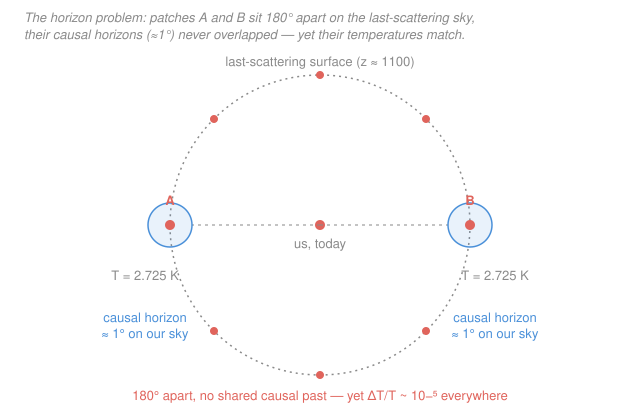

# Cosmology · Lesson 4.1: The horizon and flatness problems

> ⏱ ~15 min · Module 4: Inflation, dark energy, and observational cosmology · Builds on: [3.6 Reading the CMB power spectrum](03-06-reading-cmb-power-spectrum.md) · Unlocks: [4.2 The inflationary mechanism](04-02-inflationary-mechanism.md)

## Why this matters

The hot Big Bang of Modules 1–3 works spectacularly: it predicts the expansion, the light-element abundances, and the CMB spectrum to the decimal. But run it honestly and it breaks in a different way — not in its equations, but in the **initial data** those equations demand. To reproduce the universe we see, you must hand the Big Bang starting conditions of grotesque precision: a temperature identical across regions that could never have talked to each other, and a spatial curvature fine-tuned to sixty decimal places. These aren't errors; they're *unexplained coincidences*, and a theory that needs a miracle at $t=0$ is a theory that isn't finished. This lesson states the three coincidences — **horizon, flatness, monopoles** — precisely enough that the next lesson's fix (inflation) will feel inevitable rather than magical.

## The idea

Two regions of the universe can only have the same temperature if heat had time to flow between them — or if they started that way. Light sets the speed limit, so "had time to talk" means "close enough that a light signal could have crossed the gap since $t=0$." The maximum distance any signal could have travelled is the **particle horizon**: your bubble of causal contact, growing at light speed. Now look at the CMB. Points on opposite sides of the sky have *identical* temperatures — yet when we compute their horizons at the moment the CMB was released, those horizons were tiny, subtending barely a degree. The sky is tiled by roughly ten thousand patches that were causally sealed off from one another, all reading the same temperature to one part in $10^5$. Nothing in the hot Big Bang made them agree. That's the **horizon problem**.

The **flatness problem** is subtler and, once you see it, worse. Measure the universe's total density and you find it sits astonishingly close to the "flat" value — space is Euclidean to within a percent. You might shrug: maybe it just *is* flat. But the equations say flatness is an **unstable balance**, like a pencil on its tip. Any tiny deviation from exactly flat grows with time. For the universe to be within a percent of flat *today*, after 14 billion years of that deviation amplifying, it had to be flat to something like sixty decimal places at the earliest moments. A pencil found balanced after an hour was not balanced by luck.

## The formal version

**The particle horizon.** How far could light have travelled since the beginning? In the flat FLRW metric from [1.2](01-02-flrw-metric-comoving-coordinates.md), a light ray obeys $c\,dt = a(t)\,d\chi$ (null geodesic, from [1.3](01-03-redshift-cosmic-distances.md)), where $t$ is cosmic time, $a(t)$ the scale factor (with $a_0\equiv a(t_0)=1$ today), $\chi$ the comoving radial coordinate, and $c$ the speed of light. Summing the comoving steps since $t=0$ gives the **comoving particle horizon**

$$\chi_H(t) = \int_0^{t}\frac{c\,dt'}{a(t')}.$$

*In words: the largest comoving distance a signal could have crossed by time $t$ — the radius of everything that could possibly have influenced you.* Its physical (proper) size is $d_H(t)=a(t)\,\chi_H(t)$. The decisive fact: in a radiation- or matter-dominated universe this integral **converges**. Using $a\propto t^{1/2}$ (radiation) or $a\propto t^{2/3}$ (matter), $\int_0^t dt'/a'$ is finite, and the proper horizon comes out of order the **Hubble radius** $c/H$ (with $H\equiv\dot a/a$, $\dot a=da/dt$): explicitly $d_H=2c/H$ (radiation) or $3c/H$ (matter). *Regions separated by more than $\chi_H$ have never exchanged a single photon — they are causally disconnected.*

**The horizon problem, quantified.** The CMB was emitted at last scattering, redshift $z_{\rm ls}\approx1100$, scale factor $a_{\rm ls}=1/(1+z_{\rm ls})\approx 9\times10^{-4}$. The comoving horizon at that instant, $\chi_H(t_{\rm ls})$, was small; the comoving distance from us out to the last-scattering surface, $\chi_{\rm ls}$, was much larger. The horizon therefore subtends an angle on our sky of only

$$\theta_H \approx \frac{\chi_H(t_{\rm ls})}{\chi_{\rm ls}} \approx \frac{1}{\sqrt{1+z_{\rm ls}}} \approx \frac{1}{\sqrt{1100}} \approx 0.03\ \text{rad} \approx 1.7^\circ.$$

*In words: each causally connected patch of the CMB is about a degree or two across.* Yet the whole sky — $\sim(180^\circ)$ across, tiled by $\sim 10^4$ such patches — is uniform to $\Delta T/T\sim10^{-5}$. Ten thousand regions that never touched, all at the same temperature. The hot Big Bang offers no mechanism; it can only *assume* the agreement as an initial condition.

**The flatness problem.** From the Friedmann equation (Module 1, and [`relativity`](../../relativity/syllabus.md)), the total density parameter $\Omega\equiv\rho/\rho_{\rm crit}$ obeys

$$\Omega(a) - 1 = \frac{k c^2}{a^2 H^2},$$

where $k$ is the (fixed) spatial curvature constant. *In words: how far $\Omega$ sits from $1$ is governed entirely by the quantity $a^2H^2=\dot a^2$ in the denominator.* Now watch that denominator evolve. In the radiation era $H^2\propto\rho\propto a^{-4}$ (from [1.5](01-05-cosmic-energy-budget-lambda-cdm.md)), so

$$a^2H^2\propto a^2\cdot a^{-4}=a^{-2}\quad\Longrightarrow\quad \boxed{\,|\Omega-1|\propto a^{2}\,}\quad(\text{radiation era}).$$

In the matter era $H^2\propto a^{-3}$, giving $a^2H^2\propto a^{-1}$ and $|\Omega-1|\propto a$. Either way the denominator **shrinks** as the universe expands, so $|\Omega-1|$ **grows**: $\Omega=1$ is an *unstable* fixed point — the universe runs away from flatness, never toward it. Extrapolate the measured $|\Omega_0-1|\lesssim10^{-2}$ back to the Planck time (scale factor $a_{\rm Pl}\sim10^{-32}$) with $|\Omega-1|\propto a^2$:

$$|\Omega-1|_{\rm Pl}\sim 10^{-2}\times\left(\frac{a_{\rm Pl}}{a_0}\right)^2\sim 10^{-2}\times(10^{-32})^2\sim10^{-66},$$

i.e. $\Omega$ had to equal $1$ to some sixty-odd decimal places at the start (the canonical quoted figure, softened by the matter era, is $\sim10^{-60}$). That is not "roughly flat" — it is fine-tuning of a kind no physical theory should have to assume.

**The relic (monopole) problem.** Grand Unified Theories predict that as the universe cooled through the GUT scale ($T\sim10^{16}$ GeV) it underwent a symmetry-breaking phase transition, and such transitions generically spawn **topological defects** — most notably magnetic monopoles, each roughly a GUT-scale mass ($\sim10^{16}$ GeV). Causality forces at least one defect per horizon volume at formation, giving an enormous number density. Monopoles dilute like matter ($\rho\propto a^{-3}$) while radiation dilutes faster ($a^{-4}$), so they would swiftly dominate and **overclose** the universe by many orders of magnitude. We observe *none*. The hot Big Bang, plus reasonable high-energy physics, predicts a universe made of monopoles — flatly contradicting the sky.

**The common thread.** All three are **initial-condition problems**. The equations run fine forward; the trouble is that reproducing today's universe demands starting data that is either acausally coordinated (horizon), absurdly fine-tuned (flatness), or already swept clean of relics (monopoles). Notice the shared culprit in the first two: the comoving Hubble radius $1/(aH)=1/\dot a$. In decelerating expansion ($\ddot a<0$, true for radiation and matter) $\dot a$ *decreases*, so $1/(aH)$ *grows* — fresh regions keep entering the horizon, and $|\Omega-1|\propto 1/(aH)^2$ keeps growing. The escape, set up in [4.2](04-02-inflationary-mechanism.md), is to make $a^2H^2$ *increase* for a stretch — a phase of **accelerated** expansion ($\ddot a>0$) — which reverses all three pathologies at once.

## Picture

## Worked examples

**Example 1 (the horizon, in one line).** Why is the causal patch about a degree? The comoving particle horizon scales as $\chi_H(a)\propto a^{1/2}$ in the matter era (integrate $c\,da/(a^2H)$ with $H\propto a^{-3/2}$; see the Flashback), so at last scattering it is smaller than today's horizon by $\sim a_{\rm ls}^{1/2}$. Since the comoving distance out to the last-scattering surface is essentially today's horizon, the ratio — the angle subtended — is $\theta_H\sim a_{\rm ls}^{1/2}=(1+z_{\rm ls})^{-1/2}\approx1.7^\circ$. Everything within a degree-wide spot could have equilibrated; nothing wider could. The famous first acoustic peak at $\ell\approx220$ ([3.6](03-06-reading-cmb-power-spectrum.md)) sits at this same $\sim1^\circ$ scale — the largest scale physics could act on.

**Example 2 (flatness as a runaway).** Suppose at Big Bang nucleosynthesis ($T\sim1$ MeV, $a\sim10^{-9}$) the universe were flat to a "modest" one part in a thousand, $|\Omega-1|=10^{-3}$. Propagate forward with the radiation-era law $|\Omega-1|\propto a^2$ to today ($a=1$): the deviation grows by $(1/10^{-9})^2=10^{18}$, giving $|\Omega_0-1|\sim10^{-3}\times10^{18}=10^{15}$ — a wildly curved, long-since-recollapsed or emptied-out universe. To land at $|\Omega_0-1|\lesssim10^{-2}$ instead, the BBN-era value had to be $\sim10^{-2}/10^{18}=10^{-20}$, not $10^{-3}$. Push the start back to the Planck time and the required precision reaches $\sim10^{-60}$. The closer to $t=0$ you look, the more insane the tuning.

## Watch out

- **You might think "the universe is just flat, no puzzle."** But flatness is a *repeller*, not an attractor: $|\Omega-1|$ grows in every decelerating era. Finding $\Omega\approx1$ today is like finding a pencil still balanced on its tip after billions of years — the surprise is not the value but that it *stayed* there. Something must have set it, and set it insanely precisely.
- **You might conflate the particle horizon with the Hubble radius.** They're comparable in size (both $\sim c/H$) in a single-component universe, which is why we use them interchangeably for estimates — but they're different objects. The particle horizon is the *cumulative* distance light has come since $t=0$ (an integral over all past time); the Hubble radius $c/H$ is an *instantaneous* scale. And neither is an *event* horizon (the limit on where signals can ever reach) — don't mix the three.
- **You might think fast expansion causes the horizon problem.** It's the opposite framing that's cleaner: decelerating expansion means the horizon *grows faster than* the regions within it recede, so we keep *seeing* patches that were never in contact. The problem is that causality had too *little* reach early on, not too much.

## One-liner

> The hot Big Bang needs a universe that is uniform across un-connectable patches and flat to sixty decimals from birth — three unpaid initial-condition debts that a burst of accelerated expansion could settle at once.

## Problems

**P1 (🟢)** Estimate the angular size of the particle horizon on the CMB sky at last scattering ($z_{\rm ls}\approx1100$), and hence the number of causally independent patches tiling the full sky. Comment on why $\Delta T/T\sim10^{-5}$ across all of them is a puzzle.

**P2 (🟡)** Starting from $\Omega-1=kc^2/(a^2H^2)$ and the radiation-era relation $H^2\propto a^{-4}$, derive the scaling of $|\Omega-1|$ with $a$. Then, taking $|\Omega_0-1|\lesssim10^{-2}$ today, extrapolate back to the Planck scale factor $a_{\rm Pl}\sim10^{-32}$ and state the required initial precision.

**P3 (🔴)** Qualitatively, how does a phase of accelerated expansion ($\ddot a>0$, so that $aH=\dot a$ *grows*) fix both the horizon and flatness problems? Address (a) how regions once in causal contact can end up separated by more than the horizon, and (b) why $\Omega$ is driven toward $1$. One sentence on the monopoles.

Solutions

**P1** The comoving particle horizon in the matter era grows as $\chi_H\propto a^{1/2}$, while the comoving distance out to the last-scattering surface is essentially today's horizon. The horizon at emission therefore subtends

$$\theta_H\approx\frac{\chi_H(a_{\rm ls})}{\chi_{\rm ls}}\approx\frac{1}{\sqrt{1+z_{\rm ls}}}=\frac{1}{\sqrt{1100}}\approx0.030\ \text{rad}\approx1.7^\circ.$$

Number of patches: the full sky is $4\pi$ steradians; a patch of angular *radius* $\theta_H$ covers $\approx\pi\theta_H^2$ steradians, so

$$N\approx\frac{4\pi}{\pi\theta_H^2}=\frac{4}{\theta_H^2}=\frac{4}{(0.030)^2}\approx 4\times10^3.$$

(The cruder diameter estimate $N\sim(180^\circ/1.7^\circ)^2\approx10^4$ lands in the same ballpark; quote $N\sim10^4$.) The puzzle: these several thousand-to-$10^4$ patches were causally sealed from one another at last scattering, so no physical process could have equalized their temperatures — yet they agree to one part in $10^5$. In the pure hot Big Bang this uniformity is an unexplained initial condition.

*Check.* $\sqrt{1100}\approx33.2$, and $1/33.2=0.0301$ rad; $\times(180/\pi)=1.73^\circ$ ✓. Units: steradians cancel in $N$, leaving a pure number ✓.

**P2** With $k$, $c$ fixed and $H^2\propto a^{-4}$:

$$|\Omega-1|=\frac{kc^2}{a^2H^2}\propto\frac{1}{a^2\cdot a^{-4}}=\frac{1}{a^{-2}}=a^{2}.$$

So $|\Omega-1|\propto a^2$ in the radiation era — it *grows* as the universe expands, confirming $\Omega=1$ is unstable. Extrapolating today's bound back to $a_{\rm Pl}$:

$$|\Omega-1|_{\rm Pl}=|\Omega_0-1|\left(\frac{a_{\rm Pl}}{a_0}\right)^2\lesssim10^{-2}\times(10^{-32})^2=10^{-2}\times10^{-64}=10^{-66}.$$

So at the Planck time $\Omega$ had to equal $1$ to roughly sixty decimal places. (Because the late universe passes through matter- and $\Lambda$-dominated eras where the growth is milder, the standard quoted figure is a bit less extreme, $\sim10^{-60}$ — either way, absurd fine-tuning.)

*Check.* Exponent arithmetic: $(10^{-32})^2=10^{-64}$, times $10^{-2}$ gives $10^{-66}$ ✓. Sign of the effect: $a^2$ increases with $a$, so tracing backward ($a\to0$) drives $|\Omega-1|\to0$, i.e. it had to start tiny ✓.

**P3** During accelerated expansion $\dot a=aH$ *increases*, so the comoving Hubble radius $1/(aH)$ *shrinks*.

(a) **Horizon.** Before inflation a small, causally connected region reaches thermal equilibrium — one temperature everywhere. Inflation then stretches it by an enormous factor, so two points that were in contact are carried to a proper separation far exceeding the (barely growing) horizon. When we look at the CMB we are seeing many such regions that *share a common causal past* before inflation, even though they appear disconnected today. Uniformity is inherited, not coincidental.

(b) **Flatness.** Since $|\Omega-1|=kc^2/(aH)^2$ and $aH$ grows during inflation, the denominator balloons and $|\Omega-1|\to0$ exponentially. Whatever the pre-inflation curvature, inflation irons space flat, so $\Omega\to1$ is now an *attractor* for the duration — the pencil is glued upright. (This predicts $\Omega_0$ should equal $1$ to high precision, matching the CMB.)

Monopoles: the same colossal volume expansion dilutes any pre-existing relic density to utterly negligible levels — at most a few monopoles in the entire observable universe — so we see none.

## Flashback

**From Lesson 1.3 (Redshift and cosmic distances):** In a matter-only (Einstein–de Sitter) universe the Hubble rate is $H=H_0\,a^{-3/2}$ (with $a_0=1$). Using the comoving-distance integral $D_C=\int_{a_e}^{1}\dfrac{c\,da}{a^2H}$, compute $D_C$ to a source emitting at scale factor $a_e$. Then let $a_e\to0$ to find the particle horizon, and confirm it is finite.

Solution

Substitute $H=H_0a^{-3/2}$ so that $a^2H=H_0a^{1/2}$:

$$D_C=\int_{a_e}^{1}\frac{c\,da}{a^2H}=\frac{c}{H_0}\int_{a_e}^{1}\frac{da}{a^{1/2}}=\frac{c}{H_0}\Big[2a^{1/2}\Big]_{a_e}^{1}=\frac{2c}{H_0}\left(1-a_e^{1/2}\right).$$

The particle horizon is the comoving distance to the beginning, $a_e\to0$:

$$\chi_H=\lim_{a_e\to0}D_C=\frac{2c}{H_0},$$

which is **finite** — a matter-dominated universe has a bounded horizon, exactly the fact that makes the horizon problem sharp. Note also $D_C(a_e)=\frac{2c}{H_0}(1-a_e^{1/2})$, so the horizon *at emission* scales as $\chi_H(a_e)\propto a_e^{1/2}$ — the $a^{1/2}$ growth used in Example 1 and P1 to get $\theta_H\approx(1+z)^{-1/2}$.

*Check.* Dimensions: $c/H_0$ has units of length ($\text{[m/s]}/\text{[1/s]}=\text{m}$) ✓. As $a_e\to1$ (nearby source) $D_C\to0$ ✓. The integral converges at the lower limit because $a^{-1/2}$ is integrable near $0$ — the same convergence that keeps $\chi_H$ finite.

## Connections

- **Backward:** the two observables that make these problems concrete both came from earlier modules — the CMB's uniformity and its degree-scale first peak from [3.5](03-05-cmb-anisotropies-acoustic-oscillations.md)/[3.6](03-06-reading-cmb-power-spectrum.md), and the near-critical density $\Omega_0\approx1$ from [1.5](01-05-cosmic-energy-budget-lambda-cdm.md). The horizon integral and the $\chi_H\propto a^{1/2}$ scaling are the null-geodesic and comoving-distance machinery of [1.3](01-03-redshift-cosmic-distances.md); the $|\Omega-1|\propto a^2$ law is the Friedmann equation of [1.4](01-04-friedmann-fluid-acceleration-equations.md) read backward.
- **Forward:** [4.2 The inflationary mechanism](04-02-inflationary-mechanism.md) realizes the $\ddot a>0$ escape with a scalar field, showing how a shrinking comoving Hubble radius cures all three problems and — the bonus — seeds the very perturbations ([4.3](04-03-primordial-perturbations-inflation.md)) that grew into the structure of Module 3.
- **Sideways:** the particle horizon is a cosmological light cone — the same causal-boundary logic as light cones in special relativity and the FLRW/Friedmann framework of the [`relativity`](../../relativity/syllabus.md) course, where the scale factor and curvature term $k$ originate. The instability of $\Omega=1$ is a fixed-point/stability question of the kind studied in dynamical systems.
