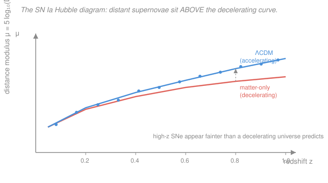

# Cosmology · Lesson 4.4: Dark energy and cosmic acceleration

> ⏱ ~15 min · Module 4: Inflation, dark energy, and observational cosmology · Builds on: [4.3 Primordial perturbations from inflation](04-03-primordial-perturbations-inflation.md), [1.4 The Friedmann, fluid, and acceleration equations](01-04-friedmann-fluid-acceleration-equations.md), [1.5 The cosmic energy budget and ΛCDM](01-05-cosmic-energy-budget-lambda-cdm.md) · Unlocks: [4.5 The cosmic distance ladder and observational cosmology](04-05-cosmic-distance-ladder-observational.md)

## Why this matters

In 1998 two teams pointed at exploding stars halfway across the observable universe expecting to measure how fast cosmic expansion was *slowing down* — gravity, after all, pulls. They found the opposite: the expansion is **speeding up**. That single result rewrote the energy budget, handed 69% of the universe to a substance nobody can identify, won the 2011 Nobel Prize, and left physics with its most embarrassing open problem — a theoretical prediction wrong by a factor of $10^{120}$. This lesson is where the abstract $w < -\tfrac13$ acceleration condition from [1.4](01-04-friedmann-fluid-acceleration-equations.md) meets the actual telescope data that forced dark energy into the standard model, and it sets up the distance measurements of [4.5](04-05-cosmic-distance-ladder-observational.md).

## The idea

Start with the tool. A **Type Ia supernova** is a white dwarf that has siphoned matter from a companion until it nears the **Chandrasekhar mass** ($\approx 1.4$ solar masses), the limit above which electron degeneracy pressure can no longer hold it up. It detonates — and because they all blow up at nearly the *same* mass, they all release nearly the *same* energy. That makes them **standardizable candles**: light bulbs of known wattage scattered across the universe. Measure how bright one *looks*, compare to how bright it *truly is*, and the dimming tells you the distance (brightness falls as $1/\text{distance}^2$).

Now the punchline. Cross-reference each supernova's distance against its redshift $z$ — how much the universe has expanded since the light left. In a universe decelerating under gravity, a supernova at a given $z$ should sit at some predicted distance. The 1998 data showed the high-$z$ supernovae (around $z \sim 0.5$) were **fainter than predicted** — meaning *farther away* than a decelerating universe allows. The only way light gets that stretched-out journey is if the expansion was slower in the past and has been *accelerating* since. Something is pushing space apart.

From [1.4](01-04-friedmann-fluid-acceleration-equations.md) you already know what can do that: a component with equation of state $w < -\tfrac13$, negative pressure whose gravity repels. The simplest candidate is a **cosmological constant** $\Lambda$ ($w = -1$), an energy density baked into space that never dilutes. And here's why it takes over *late*: matter thins as the universe grows ($\rho_m \propto a^{-3}$) while $\Lambda$ stays put ($\rho_\Lambda \propto a^0$). For most of cosmic history matter's gravity won and the expansion decelerated; only in the last few billion years has matter thinned enough for $\Lambda$ to seize control. Acceleration is a recent event.

## The formal version

**The distance modulus and the Hubble diagram.** Astronomers package "how far, from how dim" into the **distance modulus**

$$\mu \equiv m - M = 5\log_{10}\!\left(\frac{D_L}{10\ \text{pc}}\right),$$

where $m$ is the *apparent* magnitude (how bright it looks), $M$ the *absolute* magnitude (how bright it is up close — known, for a standard candle), and $D_L$ the **luminosity distance** (pc = parsec). *In words: $\mu$ is just distance expressed on a logarithmic brightness scale — bigger $\mu$ means fainter and farther.* Plotting $\mu$ against $z$ gives the **Hubble diagram**. The luminosity distance itself is set by the expansion history through the master equation $H(z)$ from [1.5](01-05-cosmic-energy-budget-lambda-cdm.md):

$$D_L(z) = (1+z)\,c\int_0^z \frac{dz'}{H(z')}, \qquad H(z) = H_0\sqrt{\Omega_m(1+z)^3 + \Omega_\Lambda + \dots}.$$

*In words: to reach a given redshift, a more slowly-expanding-then-accelerating universe makes light travel a longer path, so $D_L$ — and $\mu$ — come out larger.* A universe with $\Omega_\Lambda > 0$ predicts a **higher** curve on the Hubble diagram than a decelerating, matter-only one. The 1998 supernovae landed on the high curve.

**The acceleration condition.** Recall the acceleration equation from [1.4](01-04-friedmann-fluid-acceleration-equations.md):

$$\frac{\ddot a}{a} = -\frac{4\pi G}{3}\left(\rho + \frac{3p}{c^2}\right).$$

For a mix of pressureless matter and a component with equation of state $w = p/(\rho c^2)$, the universe accelerates ($\ddot a > 0$) when the total $\rho + 3p/c^2 < 0$, i.e. when the dark-energy component has $w < -\tfrac13$. *In words: enough negative pressure flips gravity from a brake to a throttle.*

**The transition redshift.** With matter ($p = 0$) plus a cosmological constant ($p_\Lambda = -\rho_\Lambda c^2$), the source term is $\rho_m + \rho_\Lambda + 3(-\rho_\Lambda) = \rho_m - 2\rho_\Lambda$. Acceleration switches on at $\ddot a = 0$, i.e. $\rho_m = 2\rho_\Lambda$. Since $\rho_m = \rho_{m,0}(1+z)^3$ and $\rho_\Lambda$ is constant:

$$\boxed{\;1 + z_\text{acc} = \left(\frac{2\Omega_\Lambda}{\Omega_m}\right)^{1/3}\;}$$

For $\Omega_m = 0.3,\ \Omega_\Lambda = 0.7$ this gives $z_\text{acc} \approx 0.67$ — the universe began accelerating only about 6 billion years ago. *In words: deceleration all the way down to $z \approx 0.67$, acceleration ever since.*

**The equation of state as the target.** Dark energy's density evolves by the general dilution law [1.4](01-04-friedmann-fluid-acceleration-equations.md):

$$\rho_\text{DE} \propto a^{-3(1+w)}.$$

$w = -1$ (constant density) is a cosmological constant; the whole observational program is to *measure* $w$ and test whether it equals $-1$ or drifts in time (parametrized as $w(a) = w_0 + w_a(1-a)$). Current data give $w = -1.0 \pm 0.05$ — indistinguishable from $\Lambda$. A **quintessence** model replaces $\Lambda$ with a dynamical scalar field slowly rolling down a potential, giving a mildly time-varying $w$ slightly greater than $-1$; it's the leading alternative, but no data yet require it over plain $\Lambda$.

**Concordance.** Dark energy isn't propped up by supernovae alone. The CMB ([3.6](03-06-reading-cmb-power-spectrum.md)) pins the geometry to *flat*, $\Omega_\text{total} = 1$. Independent measurements of clustered matter (galaxy surveys, [3.3](03-03-dark-matter-evidence-candidates.md)) give $\Omega_m \approx 0.3$. That leaves $\Omega_\Lambda \approx 0.7$ **missing** — and it's exactly the amount the supernovae demand. Baryon acoustic oscillations and the growth rate of structure independently agree. Three unrelated probes converging on the same $\Omega_\Lambda$ is why $\Lambda$CDM is called the **concordance model**.

## Picture

Two model predictions for how faint a standard candle should look at each redshift. The **coral** curve is a decelerating, matter-only universe; the **blue** curve adds dark energy. They agree nearby (small $z$) but split apart at high $z$, where the accelerating universe pushes sources farther away. The data (blue points) track the **upper** curve — the observation that broke the matter-only universe.

## Worked examples

**Example 1 (why fainter means accelerating).** Two universes both have today's Hubble rate $H_0$, but universe A is matter-only ($\Omega_m = 1$) and universe B has $\Omega_m = 0.3,\ \Omega_\Lambda = 0.7$. Which predicts a fainter supernova at $z = 0.5$? Universe B expanded *more slowly* in the past (less matter to have decelerated from) and has been accelerating recently, so light emitted at $z=0.5$ has been travelling through more expansion — a larger $D_L$. Larger $D_L$ means larger $\mu = 5\log_{10}(D_L/10\,\text{pc})$, i.e. **fainter**. Concretely the gap is about $\Delta\mu \approx 0.25$ mag at $z=0.5$ — a ~25% dimming, small but well above the ~0.15 mag scatter of standardized SNe Ia. That measurable excess faintness *is* the discovery.

**Example 2 (locating the switch-on).** When did our universe stop decelerating? Use the transition-redshift box with $\Omega_m = 0.3,\ \Omega_\Lambda = 0.7$:

$$1 + z_\text{acc} = \left(\frac{2 \times 0.7}{0.3}\right)^{1/3} = (4.667)^{1/3} \approx 1.67 \;\Longrightarrow\; z_\text{acc} \approx 0.67.$$

So every supernova at $z > 0.67$ was emitted while the universe was still slowing down; the acceleration all happened at $z < 0.67$. This is why the effect only shows up once surveys reach out to $z \sim 0.5$–$1$ — nearby supernovae ($z \ll 0.67$) can't see it, because they live entirely in the accelerating era and have nothing to contrast against. You need the lever arm of high redshift.

## Watch out

- **You might think acceleration means galaxies are being pushed apart by a force.** There's no force in the Newtonian sense and no "outside" to push against. What accelerates is the *scale factor* $a(t)$: the rate of expansion grows. Locally, gravitationally bound systems (galaxies, the Local Group) don't expand at all — dark energy only wins on scales where matter has thinned below $\rho_\Lambda$.
- **You might think dark energy has always dominated because it's 69% today.** It's a latecomer. At $z = 1$ matter already outweighs it, and at recombination ($z \approx 1100$) it's utterly negligible — the same snapshot-not-constant warning from [1.5](01-05-cosmic-energy-budget-lambda-cdm.md). "The universe is 69% dark energy" is a statement about *now*.
- **You might equate "cosmological constant" with "vacuum energy" and think the value is understood.** Quite the opposite — see below. Identifying $\Lambda$ *with* the quantum vacuum is exactly what produces the worst quantitative prediction in physics.

**The two deep puzzles.** If $\Lambda$ is the energy of the quantum vacuum — the zero-point energy of every field, a bridge to the vacuum fluctuations of quantum field theory — then summing those modes gives an estimate exceeding the observed $\rho_\Lambda$ by roughly $10^{120}$. This is the **cosmological-constant problem**, the largest mismatch between theory and observation ever. Layered on top is the **coincidence problem**: $\rho_\Lambda$ is constant and $\rho_m$ falls as $a^{-3}$, yet we happen to live in the brief cosmic moment when they're *comparable* ($\rho_\Lambda \sim \rho_m$). Why now? Both remain wide open.

## One-liner

> Distant Type Ia supernovae look too faint for a decelerating universe, so the expansion is accelerating — driven by a component with $w < -\tfrac13$ (a cosmological constant, $w=-1$, $\Omega_\Lambda \approx 0.69$) that dilutes slower than matter and so takes over only at $z \lesssim 0.67$.

## Problems

**P1 (🟢)** For a flat universe of matter plus a cosmological constant with $\Omega_m = 0.3,\ \Omega_\Lambda = 0.7$, find the redshift $z_\text{acc}$ at which cosmic acceleration begins, using $1 + z_\text{acc} = (2\Omega_\Lambda/\Omega_m)^{1/3}$. Interpret what happens before and after this redshift.

**P2 (🟡)** Dark-energy density evolves as $\rho_\text{DE} \propto a^{-3(1+w)}$. For $w = -1$, $w = -0.9$, and $w = -1.1$ (a "phantom" equation of state), state how $\rho_\text{DE}$ changes as the universe expands ($a$ increases). Which of the three comes to dominate in the far future ($a \to \infty$), and what does that imply?

**P3 (🔴)** Explain in one short paragraph why cosmic acceleration is a *recent* phenomenon rather than something that operated throughout cosmic history. Then, for $\Omega_m = 0.3,\ \Omega_\Lambda = 0.7$, estimate the redshift of matter–$\Lambda$ equality ($\rho_m = \rho_\Lambda$) and comment on how it relates to $z_\text{acc}$ from P1 — the "coincidence problem."

Solutions

**P1** Plug in directly:

$$1 + z_\text{acc} = \left(\frac{2 \times 0.7}{0.3}\right)^{1/3} = \left(\frac{1.4}{0.3}\right)^{1/3} = (4.667)^{1/3} \approx 1.67,$$

so $z_\text{acc} \approx 0.67$. For $z > 0.67$ (earlier than ~6 Gyr ago), matter's gravity dominated and the expansion was *decelerating*, $\ddot a < 0$. For $z < 0.67$, dark energy dominates the source term $\rho_m - 2\rho_\Lambda$ and the expansion *accelerates*, $\ddot a > 0$. We live well inside the accelerating era.

*Check.* $1.67^3 = 4.66$ ✓, and $z_\text{acc}$ sits above the matter–$\Lambda$ equality redshift (P3) — deceleration persists a bit *past* equality, because acceleration needs $\rho_m = 2\rho_\Lambda$, not merely $\rho_m = \rho_\Lambda$. ✓

**P2** Exponent is $-3(1+w)$:

- $w = -1$: exponent $-3(0) = 0$, so $\rho_\text{DE} \propto a^0 = \text{const}$ — a true cosmological constant, never dilutes.
- $w = -0.9$: exponent $-3(0.1) = -0.3$, so $\rho_\text{DE} \propto a^{-0.3}$ — *slowly decreases* as the universe expands (dilutes, but far slower than matter's $a^{-3}$).
- $w = -1.1$ (phantom): exponent $-3(-0.1) = +0.3$, so $\rho_\text{DE} \propto a^{+0.3}$ — *increases* as the universe expands.

In the far future ($a \to \infty$) the phantom case ($w = -1.1$) grows without bound while the other two hold steady or fade, so **phantom dark energy dominates**. Its ever-growing density drives an ever-faster expansion that would eventually overwhelm all bound structures — the "Big Rip." (Current data, $w = -1.0 \pm 0.05$, don't favor this, but it isn't ruled out.)

*Check.* All three have $w < -\tfrac13$, so all accelerate; the sign of $1+w$ just decides whether the density fades ($w>-1$), holds ($w=-1$), or grows ($w<-1$). ✓

**P3** *Why recent:* Matter dilutes as $\rho_m \propto a^{-3}$ while the cosmological constant's density $\rho_\Lambda$ stays fixed. In the early universe $a$ was small, so $\rho_m$ was enormous and swamped $\rho_\Lambda$ — gravity braked the expansion. Only after the universe expanded enough for $\rho_m$ to fall below $\rho_\Lambda$ did dark energy take over and acceleration begin. Because $\Lambda$'s dominance is *inevitable but late*, acceleration is a recent, once-in-cosmic-history handover, not a permanent feature.

*Equality redshift:* set $\rho_m = \rho_\Lambda$, i.e. $\rho_{m,0}(1+z)^3 = \rho_{\Lambda,0}$:

$$1 + z_{m\Lambda} = \left(\frac{\Omega_\Lambda}{\Omega_m}\right)^{1/3} = \left(\frac{0.7}{0.3}\right)^{1/3} = (2.333)^{1/3} \approx 1.33 \;\Longrightarrow\; z_{m\Lambda} \approx 0.33.$$

Using the $a(t)$ solution from [1.5](01-05-cosmic-energy-budget-lambda-cdm.md), this equality falls roughly 3–4 Gyr ago (versus today's age ~13.5 Gyr). *Coincidence problem:* both $z_{m\Lambda} \approx 0.33$ and $z_\text{acc} \approx 0.67$ are of order unity — the epochs of equality and acceleration onset are essentially *now* on a logarithmic cosmic timeline that spans $z$ from $\sim 10^{9}$ to $-1$. Since $\rho_m$ plummets by orders of magnitude each e-fold while $\rho_\Lambda$ is frozen, their near-equality today looks like a fine-tuned coincidence — why should we live in the one short window when $\rho_m \sim \rho_\Lambda$? No accepted answer exists.

*Check.* $z_{m\Lambda} < z_\text{acc}$: equality precedes... no — smaller $z$ is *later*, so equality ($z \approx 0.33$) happens *after* acceleration onset ($z \approx 0.67$)? Re-examine: acceleration needs $\rho_m = 2\rho_\Lambda$, which happens at *higher* density, hence *higher* $z$, hence *earlier*. So acceleration switched on ($z \approx 0.67$) slightly *before* the densities became equal ($z \approx 0.33$). Consistent — the factor of 2 in the acceleration condition puts $z_\text{acc}$ earlier. ✓

## Flashback

**From Lesson 1.5 (The cosmic energy budget and ΛCDM):** Consider a *different* flat universe with $\Omega_m = 0.25,\ \Omega_\Lambda = 0.75$ (ignore radiation). (a) At what redshift did matter and dark energy have equal density? (b) Use the master equation $H(z) = H_0\sqrt{\Omega_m(1+z)^3 + \Omega_\Lambda}$ to find $H/H_0$ *at that equality redshift*.

Solution

(a) Set $\Omega_m(1+z)^3 = \Omega_\Lambda$:

$$1 + z_{m\Lambda} = \left(\frac{\Omega_\Lambda}{\Omega_m}\right)^{1/3} = \left(\frac{0.75}{0.25}\right)^{1/3} = 3^{1/3} \approx 1.44 \;\Longrightarrow\; z_{m\Lambda} \approx 0.44.$$

(b) At that redshift $(1+z)^3 = 3$, so the matter term is $\Omega_m(1+z)^3 = 0.25 \times 3 = 0.75 = \Omega_\Lambda$ — the two terms are equal (that's the definition of equality). Then

$$\frac{H}{H_0} = \sqrt{0.75 + 0.75} = \sqrt{1.5} \approx 1.22.$$

*Check.* At equality the two contributions are equal by construction, so $H/H_0 = \sqrt{2\Omega_\Lambda} = \sqrt{1.5}$ — a clean shortcut. A higher $\Omega_\Lambda$ than the real universe (0.75 vs 0.69) pushes equality to slightly higher $z$ (0.44 vs 0.33), since more dark energy means it overtakes matter earlier. ✓

## Connections

- **Backward:** the entire quantitative spine is imported from Module 1 — the acceleration equation and the $w < -\tfrac13$ condition from [1.4](01-04-friedmann-fluid-acceleration-equations.md), and the density parameters, the dilution law $\rho \propto a^{-3(1+w)}$, and the matter–$\Lambda$ equality from [1.5](01-05-cosmic-energy-budget-lambda-cdm.md). The luminosity distance runs on the master equation $H(z)$ and the FLRW geometry of [relativity](../../relativity/syllabus.md).
- **Forward:** [4.5](04-05-cosmic-distance-ladder-observational.md) builds the *distance ladder* that calibrates the absolute magnitude $M$ of Type Ia supernovae (via Cepheids and parallax) — the step that turns a Hubble diagram into a measurement of $\Omega_\Lambda$ and $H_0$, and the source of today's "Hubble tension." The concordance argument here also leans on the flat geometry read off the CMB in [3.6](03-06-reading-cmb-power-spectrum.md).
- **Sideways:** Type Ia supernovae as standard candles are a stellar-death phenomenon — white-dwarf detonation at the Chandrasekhar mass — developed in the astrophysics track (stellar evolution and degenerate stars); the cosmological use here is one direction of that bridge. And the cosmological-constant problem connects directly to the zero-point vacuum energy of quantum fields, the deepest open link between cosmology and quantum field theory.
