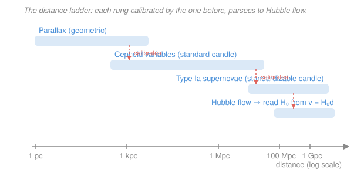

# Cosmology · Lesson 4.5: The cosmic distance ladder and observational cosmology

> ⏱ ~15 min · Module 4: Inflation, dark energy, and observational cosmology · Builds on: [4.4 Dark energy and cosmic acceleration](04-04-dark-energy-cosmic-acceleration.md), [3.6 Reading the CMB power spectrum](03-06-reading-cmb-power-spectrum.md), [1.1 The cosmological principle and Hubble's law](01-01-cosmological-principle-hubble-law.md) · Unlocks: course complete — the observational capstone, and the bridge to [astrophysics](../../astrophysics/syllabus.md)

## Why this matters

Every number in $\Lambda$CDM — the ages, the densities, the fate of the universe — hangs off one measurement: how fast is space expanding *right now*? Hubble's law $v = H_0 d$ ([1.1](01-01-cosmological-principle-hubble-law.md)) says just read off velocities and distances and take the ratio. Velocities are easy — redshift ([1.3](01-03-redshift-cosmic-distances.md)) hands them to you. **Distances are the entire problem.** No single method reaches from a nearby star to a galaxy deep in the smooth **Hubble flow** (far enough that expansion, not local gravity, sets its motion). So cosmologists build a *ladder*: a chain of methods, each one measuring the rung above it and passing its calibration up. And when you climb that ladder and get $H_0 \approx 73$, then measure the *same* $H_0$ a completely different way from the infant universe and get $67.4$, the two don't agree — the **Hubble tension**, the sharpest open problem in the field. This lesson is where all four modules cash out into measured numbers.

## The idea

Imagine a surveyor with a short tape measure trying to map a continent. The tape reaches across a room; to go farther she picks a landmark she *can* measure with the tape, then uses its known size to judge the distance to things beyond the tape's reach, then repeats. Each step trusts the one below it. That's the distance ladder, and it has three main rungs:

1. **Parallax** is the tape measure — pure geometry, no assumptions. As Earth orbits the Sun, a nearby star shifts against the background; the shift angle gives the distance by triangulation. Good to a few kiloparsecs.
2. **Cepheid variables** are the first landmark. These are pulsating stars whose brightness cycles with a period that depends *only* on their true luminosity — a bright one pulses slowly, a dim one quickly. So the period (which you just time) tells you the intrinsic brightness, and comparing to how bright it *looks* gives the distance. A **standard candle**: known wattage, so apparent dimness = distance. You calibrate the period–luminosity law using nearby Cepheids whose distances parallax already nailed. Reaches tens of megaparsecs.
3. **Type Ia supernovae** are the long-range beacon. A white dwarf detonating near a mass threshold ([4.4](04-04-dark-energy-cosmic-acceleration.md)) explodes with nearly the same peak brightness every time — bright enough to see across the observable universe. You calibrate *their* true brightness using Cepheids found in the same galaxies that hosted a Type Ia. Reaches gigaparsecs — right into the Hubble flow, where $v = H_0 d$ finally reads off $H_0$.

The whole trick is the overlaps: parallax and Cepheids both work at a kiloparsec, so parallax calibrates Cepheids there; Cepheids and Type Ia's both work at ~10 Mpc, so Cepheids calibrate the supernovae there. Break any rung and everything above it slides.

## The formal version

**Flux, luminosity, and distance.** A source of intrinsic **luminosity** $L$ (power emitted, watts) spreads its light over a sphere, so the **flux** $f$ we receive (power per area, W/m$^2$) falls as

$$f = \frac{L}{4\pi d^2}.$$

*In words: a standard candle of known $L$, measured flux $f$, betrays its distance $d = \sqrt{L/(4\pi f)}$ — dimmer means farther, as the inverse square.*

**Magnitudes and the distance modulus.** Astronomers package flux logarithmically. The **apparent magnitude** $m$ is how bright a source looks; the **absolute magnitude** $M$ is how bright it *would* look at a reference distance of $10$ pc. Their difference, the **distance modulus** $\mu$, encodes distance:

$$\mu \equiv m - M = 5\log_{10}\!\left(\frac{d}{10\ \text{pc}}\right), \qquad d = 10^{(\mu + 5)/5}\ \text{pc}.$$

*In words: how much fainter a thing looks than it would up close is a pure logarithmic stand-in for distance* (5 magnitudes = a factor of 10 in distance). A standard candle fixes $M$; you measure $m$; the gap $\mu$ gives $d$.

**Parallax** (the one geometric rung). A star at distance $d$ shifts by a half-angle $p$ (the parallax) as Earth moves one astronomical unit. By definition of the parsec,

$$d\,[\text{pc}] = \frac{1}{p\,[\text{arcsec}]}.$$

*In words: a star one parsec away wobbles by one arcsecond; twice as far, half the wobble.* The ESA **Gaia** mission measures parallaxes for over a billion stars, reaching to roughly a kiloparsec — enough to anchor the Cepheids.

**The Leavitt law** (Cepheids). Henrietta Leavitt found the period–luminosity relation: a Cepheid's absolute magnitude is a linear function of the logarithm of its pulsation period $P$,

$$M = a\,\log_{10}(P/\text{day}) + b,$$

with slope $a$ and zero-point $b$ fixed by parallax-calibrated Cepheids. *In words: time the pulse, get the true brightness for free* — then $\mu = m - M$ gives the distance to the Cepheid, hence to its host galaxy.

**Two roads to $H_0$, and the tension.** Climbing the ladder into the Hubble flow and taking $H_0 = v/d$ is the **local (late-time)** measurement; the **SH0ES** program finds

$$H_0^{\text{local}} \approx 73 \pm 1\ \text{km/s/Mpc}.$$

Entirely separately, **Planck** fits the CMB power spectrum ([3.6](03-06-reading-cmb-power-spectrum.md)) with the six-parameter $\Lambda$CDM model and *predicts* today's expansion rate — the **early (model-dependent)** measurement:

$$H_0^{\text{CMB}} \approx 67.4 \pm 0.5\ \text{km/s/Mpc}.$$

*In words: measure the expansion by ladder-and-ruler today, and infer it by evolving the baby universe forward through $\Lambda$CDM — and the two answers differ by about $8\%$, a ~$5\sigma$ gap.* That is the **Hubble tension**, and after years of cross-checks it has not gone away — either a subtle systematic hides in one road, or $\Lambda$CDM is missing physics (early dark energy, extra relativistic species, something at recombination).

**A second kind of yardstick: BAO as a standard ruler.** Candles give you a known *brightness*; a **standard ruler** gives you a known *length*. The baryon acoustic oscillations froze a preferred separation into matter — the **sound horizon** $r_s \approx 150$ Mpc, the distance sound waves traveled before recombination ([3.5](03-05-cmb-anisotropies-acoustic-oscillations.md)). Galaxies are very slightly more likely to sit $r_s$ apart, a bump in their correlation function. Seeing that known length subtend an angle at redshift $z$ measures the angular-diameter distance $D_A(z)$; seeing it along the line of sight measures $H(z)$. Surveys like BOSS, eBOSS, and **DESI** map millions of galaxies to read this ruler across cosmic time — no candle calibration required.

## Picture

## Worked examples

**Example 1 (mechanical — climb one rung).** A Cepheid is timed at period $P = 10$ days, and the calibrated Leavitt law (a $V$-band form) gives $M = -2.8\log_{10}(P/\text{day}) - 1.4$. So $M = -2.8(1) - 1.4 = -4.2$. Its measured apparent magnitude is $m = 20.8$. Then

$$\mu = m - M = 20.8 - (-4.2) = 25.0, \qquad d = 10^{(25.0 + 5)/5} = 10^{6}\ \text{pc} = 1\ \text{Mpc}.$$

The pulse period alone set the wattage; the rest is inverse-square bookkeeping.

**Example 2 (why you'd care — reading $H_0$).** A Type Ia supernova, calibrated against Cepheids to absolute magnitude $M = -19.3$, peaks at $m = 16.3$ in a galaxy whose spectrum shows recession velocity $v = 9800$ km/s. Its distance modulus is $\mu = 16.3 - (-19.3) = 35.6$, so

$$d = 10^{(35.6 + 5)/5} = 10^{8.12}\ \text{pc} \approx 1.3\times 10^{8}\ \text{pc} = 132\ \text{Mpc}.$$

That's deep in the Hubble flow, so $H_0 = v/d = 9800/132 \approx 74$ km/s/Mpc — one data point on the local road. Repeat over dozens of supernovae, average down the scatter, and you get $73 \pm 1$.

## Watch out

- **You might think Planck "measures" $H_0$ directly.** It doesn't — it measures the CMB at $z \approx 1100$ and *infers* today's $H_0$ by assuming $\Lambda$CDM all the way down. Change the model between then and now and the inferred number moves. The local ladder makes no such assumption; that's exactly why their disagreement is interesting rather than a mere calibration quibble.
- **You might conflate standard candles with standard rulers.** A candle has known *luminosity* and you use flux; a ruler (BAO) has known *length* and you use its angular size. They fail in different ways, which is the point — agreeing answers from independent methods is what makes the result trustworthy.
- **You might expect one broken rung to shift only nearby distances.** The ladder is serial: a $5\%$ error in the Cepheid zero-point propagates straight into the supernova calibration and thus into $H_0$ itself. Every rung's systematic is the whole ladder's systematic — which is why the tension hunt obsesses over Cepheid calibration.

## One-liner

> No single ruler spans the cosmos, so we chain them — parallax to Cepheids to Type Ia's — and the two independent roads to $H_0$ (ladder $\approx 73$, CMB $\approx 67.4$) refuse to meet: the Hubble tension.

## Problems

**P1 (🟢)** (a) A star has measured parallax $p = 0.01''$. How far away is it? (b) A Cepheid in a distant galaxy has absolute magnitude $M = -4.0$ (from its period via the Leavitt law) and measured apparent magnitude $m = 21.0$. Find its distance modulus $\mu$ and its distance $d$ in pc and in Mpc.

**P2 (🟡)** The local ladder gives $H_0 = 73 \pm 1$ km/s/Mpc; the CMB gives $H_0 = 67.4 \pm 0.5$ km/s/Mpc. Treating the errors as independent, compute (a) the discrepancy in units of $\sigma$ and (b) the fractional disagreement. Comment on whether this looks like a fluke.

**P3 (🔴)** Explain, in a few sentences each, (a) *why* the distance-ladder $H_0$ and the CMB $H_0$ are genuinely independent measurements rather than the same measurement done twice, and (b) what the two broad classes of resolution are — a systematic error versus new physics — and where each would have to live.

Solutions

**P1** (a) Parallax is pure geometry: $d = 1/p = 1/0.01 = 100$ pc.

(b) Distance modulus is the gap between how bright it looks and how bright it is:
$$\mu = m - M = 21.0 - (-4.0) = 25.0.$$
Invert the distance-modulus relation:
$$d = 10^{(\mu + 5)/5} = 10^{(25.0 + 5)/5} = 10^{6}\ \text{pc} = 1\times 10^{6}\ \text{pc} = 1\ \text{Mpc}.$$

*Check.* $\mu = 25$ should give $5\log_{10}(d/10\,\text{pc}) = 25 \Rightarrow \log_{10}(d/10\,\text{pc}) = 5 \Rightarrow d = 10\,\text{pc}\times 10^5 = 10^6$ pc ✓. That's a Cepheid at 1 Mpc — comfortably within Cepheid reach, well above where parallax gave out.

**P2** (a) The difference is $\Delta = 73 - 67.4 = 5.6$ km/s/Mpc. Independent errors add in quadrature:
$$\sigma_\Delta = \sqrt{1^2 + 0.5^2} = \sqrt{1.25} \approx 1.118\ \text{km/s/Mpc}, \qquad \frac{\Delta}{\sigma_\Delta} = \frac{5.6}{1.118} \approx 5.0\sigma.$$

(b) Fractional disagreement, relative to the CMB value: $5.6/67.4 \approx 0.083$, about $8\%$ (relative to $\sim 70$ it's the same $8\%$).

A $\sim 5\sigma$ separation corresponds to a chance probability below one in a million if both measurements are unbiased Gaussians — far past the $3\sigma$ that would normally be shrugged off. So no, it does not look like a statistical fluke: either an unmodeled systematic sits in one of the two roads, or the underlying model is wrong.

*Check.* $1.118 \times 5.0 \approx 5.6$ ✓; $0.083 \times 67.4 \approx 5.6$ ✓.

**P3** (a) They probe the expansion at opposite ends of cosmic history through unrelated physics. The ladder is a *direct, local, late-time* measurement: geometry (parallax) and calibrated brightnesses (Cepheids, Type Ia's) at $z \lesssim 0.1$, assuming essentially nothing about the cosmological model beyond $v = H_0 d$ in the Hubble flow. The CMB value is an *indirect, early-time, model-dependent inference*: Planck measures the acoustic pattern at $z \approx 1100$ and extrapolates to today by assuming $\Lambda$CDM throughout. Different epochs, different instruments, different physics, different failure modes — so their disagreement can't be dismissed as one method miscalibrating itself twice.

(b) *Systematics:* an unrecognized error in one pipeline — e.g. the Cepheid zero-point, crowding/blending in supernova host galaxies, or a Planck calibration/foreground subtlety — that shifts one number toward the other with no new physics. This lives in the *measurements*. *New physics:* $\Lambda$CDM is incomplete, so evolving the early universe forward gives the wrong $H_0$; the leading candidates act *before or around recombination* (early dark energy raising the pre-recombination expansion and shrinking the sound horizon $r_s$, or extra relativistic species $N_{\rm eff}$), because that reshuffles the CMB inference while leaving the local ladder untouched. This lives in the *model*. The crux is that late-time fixes tend to spoil other data (BAO, supernovae), which is why attention has turned to early-universe physics.

## Flashback

**From Lesson 1.1 (The cosmological principle and Hubble's law):** A galaxy is observed with recession velocity $v = 7300$ km/s. Using the local value $H_0 = 73$ km/s/Mpc, find its distance. Then compute the **Hubble time** $t_H = 1/H_0$ in years, and say in one line what it estimates. (Use $1\ \text{Mpc} = 3.086\times 10^{19}$ km and $1\ \text{yr} = 3.156\times 10^{7}$ s.)

Solution

Distance from Hubble's law:
$$d = \frac{v}{H_0} = \frac{7300}{73} = 100\ \text{Mpc}.$$

Hubble time is the inverse expansion rate. Convert $H_0$ to inverse seconds first:
$$H_0 = \frac{73\ \text{km/s}}{3.086\times 10^{19}\ \text{km}} = 2.366\times 10^{-18}\ \text{s}^{-1}, \qquad t_H = \frac{1}{H_0} = 4.227\times 10^{17}\ \text{s}.$$
In years:
$$t_H = \frac{4.227\times 10^{17}}{3.156\times 10^{7}} \approx 1.34\times 10^{10}\ \text{yr} \approx 13.4\ \text{Gyr}.$$

*In one line:* $t_H$ is the rough age the universe would have if it had always expanded at today's rate — a same-order estimate of the true age ($\approx 13.8$ Gyr), landing close because deceleration and later acceleration nearly cancel.

*Check.* $d = 100$ Mpc puts this galaxy right where Type Ia's read off $H_0$ ✓; and a larger $H_0$ (faster expansion) gives a *shorter* $t_H$, as it must.

## Connections

- **Backward:** this closes the loop opened in [1.1](01-01-cosmological-principle-hubble-law.md) — Hubble's law $v = H_0 d$ was the promise; the ladder is how $d$, the hard half, actually gets measured. The Type Ia rung is the same explosion whose dimming revealed cosmic acceleration in [4.4](04-04-dark-energy-cosmic-acceleration.md); the BAO ruler is the sound horizon $r_s$ from [3.5](03-05-cmb-anisotropies-acoustic-oscillations.md) reused as a yardstick; the CMB road runs through the power-spectrum fit of [3.6](03-06-reading-cmb-power-spectrum.md).
- **Sideways:** parallax, Cepheids, and standard candles are the observational bread-and-butter of stellar and extragalactic astronomy — picked up in depth in [astrophysics](../../astrophysics/syllabus.md). The magnitude/flux machinery here is the same photometry that field builds on.
- **Forward (the whole course, in one arc):** we began with the cosmological principle and the FLRW metric — a homogeneous, expanding spacetime governed by the Friedmann equations (Module 1, resting on the general-relativity foundations of [relativity](../../relativity/syllabus.md)). We wound the clock back into the hot, dense past and watched its fossils form: the light elements of nucleosynthesis and the relic neutrinos (Module 2), then the release of the CMB and the gravitational growth of structure it seeded (Module 3). We asked where the initial conditions came from — inflation — and what the expansion is doing now and next — dark energy (Module 4). This final lesson is where it all becomes *measurement*: the pillars of precision cosmology — BBN ([2.4](02-04-big-bang-nucleosynthesis.md)), the CMB ([3.6](03-06-reading-cmb-power-spectrum.md)), BAO, Type Ia supernovae ([4.4](04-04-dark-energy-cosmic-acceleration.md)), and large-scale structure ([3.4](03-04-matter-power-spectrum.md)) — all independently pin the *same* handful of $\Lambda$CDM numbers. That concordance is the triumph. And the cracks in it — the $5\sigma$ Hubble tension, the milder $\sigma_8$ clustering tension — are precisely where the next physics is most likely hiding. The universe has been measured end to end; the tensions are the map's edge, marked *here be dragons*.
