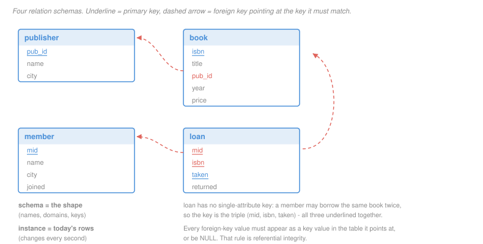

# Database Systems · Lesson 1.1: The relational model

> ⏱ ~15 min · Module 1: The relational model & SQL · Builds on: [`programming-foundations` 2.1 (abstract data types)](../../programming-foundations/lessons/02-01-abstract-data-types-and-interfaces.md) · Unlocks: [1.2 (relational algebra)](01-02-relational-algebra.md)

## Why this matters

Nearly every system you will ever read stores its state in tables, and nearly every bug in that state traces back to a schema that permitted something it should have forbidden. The relational model is worth an hour of care because it is a *small* idea — a table is a set of tuples — from which the entire apparatus of SQL, normalization, indexing and transactions is derived over the next twenty-four lessons.

The move that makes it powerful is the one Codd made in 1970: separate *what* the data is from *how* it is stored. You describe a relation; the system decides whether to scan it, index it, sort it or cache it. Everything in Module 3 is the system making that decision, and it can only do so because the model refuses to let you specify it.

## The idea

A **relation** is a table, and a table is a *set of rows*. Two consequences follow immediately and both matter more than they look.

**Sets have no order.** There is no "third row." If you want rows in an order you must ask for one; the database is free to hand them back however it finds them fastest. This is what licenses the optimizer to reorder work.

**Sets have no duplicates.** Two identical rows are one row. In the pure model, at least — real SQL relaxes this, and lesson 1.3 shows exactly where the relaxation bites.

Each column is an **attribute** with a name and a **domain** — the set of values it may hold. `year` draws from the integers, `title` from strings. A row, called a **tuple**, picks one value from each domain.

The critical distinction is between the *shape* and the *contents*. The **schema** is the shape: the attribute names, their domains, and the constraints. It changes when a developer deploys a migration, perhaps twice a year. The **instance** is the set of rows sitting there right now, and it changes thousands of times a second. When someone says "the database," ask which one they mean; almost every design question is about the schema and almost every performance question is about the instance.

## The formal version

A **relation schema** $R(A_1, A_2, \ldots, A_n)$ names $n$ attributes, each with a domain $\mathrm{dom}(A_i)$. A **relation instance** $r$ of $R$ is a finite subset

$$r \subseteq \mathrm{dom}(A_1) \times \mathrm{dom}(A_2) \times \cdots \times \mathrm{dom}(A_n).$$

In words: an instance is any finite set of tuples drawn from the product of the domains. The number of attributes $n$ is the relation's **arity**; the number of tuples $|r|$ is its **cardinality**. Both terms come back constantly in Module 3, where cardinality is the quantity the optimizer is trying to guess.

Now the constraints, which are where the model earns its keep.

> **Superkey.** A set of attributes $K \subseteq \{A_1, \ldots, A_n\}$ is a superkey of $R$ if no legal instance can contain two distinct tuples that agree on every attribute of $K$.

In words: knowing the values of $K$ pins down at most one row. Note "no *legal* instance" — this is a statement about the schema, a promise about every instance that will ever exist, not an observation about the rows you happen to have today.

> **Candidate key.** A superkey $K$ such that no proper subset of $K$ is a superkey.

In words: a superkey with nothing wasted in it. Drop any attribute and it stops identifying rows uniquely. A relation may have several candidate keys.

> **Primary key.** One candidate key, chosen by the designer, to be *the* identifier of the relation.

The choice is a design act, not a mathematical one — the model does not care which candidate key you pick, but the storage layer will, because in most systems the primary key determines the physical ordering of the file ([3.2](03-02-b-plus-tree-indexes.md)).

> **Foreign key.** A set of attributes $F$ in relation $R$ is a foreign key referencing relation $S$ if every non-null value of $F$ appearing in $R$ also appears as the primary-key value of some tuple in $S$.

In words: this column points at another table, and the thing it points at must exist. The guarantee is called **referential integrity**, and it is the only cross-table constraint the model gives you for free.

Finally, **NULL**: a marker meaning "no value here," used for both *unknown* (the price exists, we have not recorded it) and *inapplicable* (a loan not yet returned has no return date). Conflating those two readings is a genuine flaw in the model and the source of the traps in [1.3](01-03-sql-select-from-where.md).

## Picture

This library schema is the running example for all of Module 1. Four relations, three foreign keys, one composite primary key.

## Worked examples

**Example 1 — reading keys off an instance, carefully.**

Here is an instance of `member`:

| mid | name | city | joined |
|---|---|---|---|
| 1 | Ada | Leeds | 2021-03-04 |
| 2 | Bram | Bristol | 2022-09-12 |
| 3 | Cyd | Leeds | 2023-01-20 |
| 4 | Devi | NULL | 2023-06-02 |

Which sets of attributes are superkeys?

In *this instance*, `{name}` has four distinct values, so no two rows agree on it. So does `{joined}`. It is tempting to declare both superkeys. **That inference is invalid.** A superkey is a promise about every legal instance, and nothing in the domain stops two members being named Ada or two people joining on the same day. The instance can *refute* a key claim (two rows agreeing on $K$ proves $K$ is not a superkey) but it can never *establish* one. Only a statement about the world can do that.

What the world says here: `mid` is issued one per member, so `{mid}` is a superkey, and being a single attribute it is minimal — a candidate key. Any set containing it, such as `{mid, city}`, is also a superkey but not a candidate key, since dropping `city` still identifies rows.

**Example 2 — why `loan` needs three attributes in its key.**

The obvious guess is that `{mid, isbn}` identifies a loan: this member, this book. Check it against a plausible instance:

| mid | isbn | taken | returned |
|---|---|---|---|
| 1 | B1 | 2024-01-05 | 2024-01-19 |
| 1 | B3 | 2024-04-14 | 2024-04-28 |
| 1 | B1 | 2024-06-02 | NULL |

Rows 1 and 3 agree on `{mid, isbn}` and are different loans — Ada borrowed *Tidewater* in January, returned it, and borrowed it again in June. So `{mid, isbn}` is not a superkey, and the instance proves it.

Adding `taken` fixes it: a member cannot have two simultaneous loans of the same copy starting at the same instant. So `{mid, isbn, taken}` is a superkey. Is it minimal? Drop each attribute in turn and ask whether the rest still identifies:

- drop `mid`: two different members can borrow the same book on the same day. Not a superkey.
- drop `isbn`: one member can borrow two books on the same day. Not a superkey.
- drop `taken`: rows 1 and 3 above. Not a superkey.

All three proper subsets fail, so `{mid, isbn, taken}` is a **candidate key**, and with no alternative on offer it becomes the primary key. A key spanning several attributes like this is called a **composite key**, and it is the normal situation for a table recording *events* rather than *things*.

Notice what the three drop-tests actually were: three counterexamples. That pattern — to show minimality, exhibit for each attribute a pair of rows that collide without it — is the whole method, and it returns in [2.3](02-03-functional-dependencies-closure-and-keys.md) in mechanical form.

## Watch out

- **You might think a key is something you observe in the data.** It is something you *assert* about the domain. Reading distinct values off today's rows and concluding "that's a key" is the single most common schema bug, and it fails the first time reality supplies a duplicate — usually in production, usually at 2am.
- **You might think NULL is a value.** It is the absence of one. Two NULLs are not equal to each other, which is why Devi's NULL city does not match any other member's city, including another NULL. This breaks comparison, grouping and joining in ways that are individually reasonable and collectively surprising.
- **You might think a foreign key must point at a different table.** It often points at the same one. An `employee.manager_id` referencing `employee.emp_id` is a foreign key, and self-referencing structure like this is what self-joins in [1.4](01-04-sql-joins-and-set-operations.md) exist to query.

## One-liner

> A relation is a set of tuples; a key is a promise about every instance that will ever exist, not an observation about the one in front of you.

## Problems

**P1 (🟢)** Consider a relation `enrollment(student_id, course_id, term, grade)` recording that a student took a course in a given term and received a grade, where a student may retake the same course in a later term but not twice in one term.

(a) Is `{student_id, course_id}` a superkey? Answer yes or no and, if no, give a two-row instance that proves it.
(b) Name the candidate key.
(c) How many attributes are in the smallest superkey that *contains* `grade`?

**P2 (🟡)** A schema has `book(isbn, title, pub_id, year, price)` with `pub_id` a foreign key to `publisher(pub_id, name, city)`. Classify each of the following operations as **permitted** or **rejected by referential integrity**, and for each rejection name the single row that causes it.

(a) Insert `book('B9', 'Northwind', 'ZZZ', 2024, 20.0)` when `publisher` holds only RVN, HOL and KIN.
(b) Insert `book('B9', 'Northwind', NULL, 2024, 20.0)`.
(c) Delete the `publisher` row `KIN`, when no book has `pub_id = 'KIN'`.
(d) Delete the `publisher` row `RVN`, when three books have `pub_id = 'RVN'`.

**P3 (🔴, optional)** Relations on three attributes $R(A,B,C)$.

(a) Suppose $R$ has exactly two candidate keys, $\{A\}$ and $\{B,C\}$. How many superkeys does $R$ have in total? List them.

(b) Can $\{A,B\}$, $\{B,C\}$ and $\{A,C\}$ all be candidate keys of the same relation at once? Answer yes or no, and back it with the appropriate object: a concrete instance if yes, an argument if no. Then state the smallest number of tuples such an instance needs.

Solutions

**P1**

(a) **No.** The retake case breaks it. Two rows that agree on `{student_id, course_id}` and differ:

| student_id | course_id | term | grade |
|---|---|---|---|
| 7 | CS201 | 2023F | C |
| 7 | CS201 | 2024S | A |

Student 7 took CS201 twice. Since the rows are distinct and agree on the candidate set, it is not a superkey.

(b) **`{student_id, course_id, term}`.** It is a superkey by the stated rule ("not twice in one term"). Minimality by three drop-tests: without `term`, the instance above collides; without `course_id`, one student takes two courses in the same term; without `student_id`, two students take the same course in the same term. Every proper subset fails, so it is a candidate key.

(c) **Four.** Any superkey containing `grade` must also contain a superkey among the remaining attributes, and the only one available is the full candidate key `{student_id, course_id, term}`. So the smallest is all four attributes. (This is the general fact that a superkey is exactly a candidate key plus any extra attributes.)

**P2**

(a) **Rejected.** The new book row itself is the offender: its `pub_id` value `ZZZ` appears as no publisher's primary key, so the reference dangles.

(b) **Permitted.** The foreign-key rule constrains *non-null* values only. NULL here reads as "publisher not recorded," which the model allows. This is precisely the ambiguity flagged above — you cannot tell from the schema whether NULL means self-published or merely unentered.

(c) **Permitted.** Referential integrity constrains the *referencing* side. With no book pointing at KIN, removing it breaks nothing.

(d) **Rejected**, and the offending rows are the three books whose `pub_id` is `RVN` — each would be left pointing at a publisher that no longer exists. Real systems offer three responses declared in the schema: refuse the delete, cascade it (delete the three books too), or set the three `pub_id` values to NULL. All three keep the invariant; they differ in what they destroy.

**P3**

(a) **Five.** A superkey is exactly a candidate key plus any extra attributes, so enumerate the eight subsets of $\{A,B,C\}$ and keep those containing $\{A\}$ or containing $\{B,C\}$:

| set | contains a candidate key? |
|---|---|
| $\{\}$, $\{B\}$, $\{C\}$ | no |
| $\{A\}$ | yes, is one |
| $\{A,B\}$, $\{A,C\}$ | yes, contain $\{A\}$ |
| $\{B,C\}$ | yes, is one |
| $\{A,B,C\}$ | yes, contains both |

The superkeys are $\{A\}$, $\{A,B\}$, $\{A,C\}$, $\{B,C\}$, $\{A,B,C\}$.

(b) **Yes**, and three tuples are needed.

*Accept criterion for the instance:* any three-row table over three attributes in which no single column has three distinct values, and all three two-column projections have three distinct values. Domain values are arbitrary; the one below is the pattern up to renaming.

| | A | B | C |
|---|---|---|---|
| $t_1$ | 0 | 0 | 0 |
| $t_2$ | 0 | 1 | 1 |
| $t_3$ | 1 | 0 | 1 |

No single attribute is a superkey: $t_1, t_2$ agree on $A$; $t_1, t_3$ agree on $B$; $t_2, t_3$ agree on $C$. Every pair is: the projections onto $\{A,B\}$ give $(0,0), (0,1), (1,0)$; onto $\{A,C\}$ give $(0,0), (0,1), (1,1)$; onto $\{B,C\}$ give $(0,0), (1,1), (0,1)$. All three lists have three distinct entries, so each pair identifies uniquely, and each is minimal because neither of its attributes is a superkey alone. Three candidate keys, on three attributes.

*Why two tuples cannot do it.* For each single attribute to fail as a superkey, the two tuples must agree on that attribute. Failing on all three means agreeing on all three, which makes them the same tuple — and an instance with one tuple has every attribute set as a superkey. So the minimum is three, and three suffices.

The general shape is worth keeping: each attribute is "used up" by exactly one colliding pair, and with three attributes you need three pairs, which is $\binom{3}{2}$ — exactly the number of pairs three tuples provide.

## Connections

- **Backward:** a relation is an abstract data type in the sense of [`programming-foundations` 2.1](../../programming-foundations/lessons/02-01-abstract-data-types-and-interfaces.md) — an interface (set of tuples, with constraints) deliberately separated from any implementation. The whole of Module 3 is implementations of this one interface.
- **Forward:** [1.2](01-02-relational-algebra.md) gives the operations on relations, and every one of them is closed — takes relations, returns a relation — which is what lets queries compose. Keys return as the central object in [2.3](02-03-functional-dependencies-closure-and-keys.md), where "what determines what" becomes a calculus.
- **Sideways:** the model is set theory applied with restraint. Tuples, subsets of a Cartesian product, and the relations of [`discrete-mathematics` 2.2](../../discrete-mathematics/lessons/02-02-relations-equivalence-and-order.md) are literally the same objects; a database is that theory given an index and a crash recovery story.
