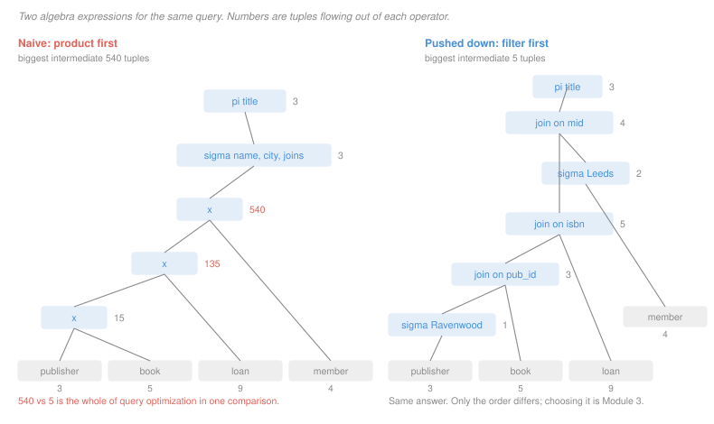

# Database Systems · Lesson 1.2: Relational algebra

> ⏱ ~15 min · Module 1: The relational model & SQL · Builds on: [1.1 (the relational model)](01-01-the-relational-model.md) · Unlocks: [1.3 (SQL I)](01-03-sql-select-from-where.md), [3.5 (join algorithms)](03-05-query-operators-and-join-algorithms.md)

## Why this matters

SQL is what you write; relational algebra is what the database *thinks*. Every query you submit is parsed into an algebra expression, rewritten using algebraic identities into a cheaper but equivalent expression, and only then executed. If you never learn the algebra, query optimization looks like magic and `EXPLAIN` output looks like noise.

The payoff is immediate and quantitative. The figure below shows two algebra expressions for one query. They return identical answers and the laws of the algebra guarantee it. One of them builds a 540-tuple intermediate result; the other never exceeds 5. That gap is the entire subject of Module 3, and it exists only because the algebra tells us the two expressions are interchangeable.

## The idea

The algebra has one governing property: **closure**. Every operator takes relations and returns a relation. Nothing else. So the output of any operator can be the input of the next, and a query becomes a *pipeline* — or, drawn properly, a tree with base tables at the leaves and the answer at the root.

Six operators are primitive; everything else is shorthand built from them.

Three of them are ordinary set operations, because a relation *is* a set: union, difference, and Cartesian product. Two are new and specific to tables: **selection** keeps some rows, **projection** keeps some columns. The sixth, **rename**, exists only so you can join a table to itself without ambiguity.

Two things to hold onto. First, the operators are unaware of each other — selection does not know a join is coming — which is exactly what lets the optimizer shuffle them. Second, the algebra is **procedural**: an expression says *how* to compute the answer, step by step. SQL, which you meet next lesson, is declarative and says only *what* the answer is. Translating between them is the skill this module is built around.

## The formal version

Let $r$ and $s$ be relation instances.

> **Selection.** $\sigma_\theta(r) = \{\, t \in r \mid \theta(t) \text{ is true} \,\}$, where $\theta$ is a predicate over the attributes.

In words: keep the rows satisfying the condition; the columns are untouched. The **schema is unchanged**, which is why selections can slide past each other freely: $\sigma_{\theta_1}(\sigma_{\theta_2}(r)) = \sigma_{\theta_2}(\sigma_{\theta_1}(r)) = \sigma_{\theta_1 \wedge \theta_2}(r)$.

> **Projection.** $\pi_{A_1, \ldots, A_k}(r) = \{\, t[A_1, \ldots, A_k] \mid t \in r \,\}$.

In words: keep the listed columns, discard the rest. Because the result is a *set*, **projection removes duplicates**. Projecting `city` from four members yields three cities, not four. This is the single largest divergence between the algebra and real SQL, and [1.3](01-03-sql-select-from-where.md) is where it bites.

> **Union, difference, intersection.** $r \cup s$, $r - s$, $r \cap s$, defined only when $r$ and $s$ are **union-compatible**: same arity, and corresponding attributes drawn from the same domains.

In words: you can only combine two tables set-wise if they have the same shape. Intersection is not primitive, since $r \cap s = r - (r - s)$.

> **Cartesian product.** $r \times s = \{\, t\,u \mid t \in r,\ u \in s \,\}$, every tuple of $r$ concatenated with every tuple of $s$.

The result has arity $\mathrm{arity}(r) + \mathrm{arity}(s)$ and cardinality $|r| \cdot |s|$. That multiplication is why the naive plan in the figure reaches 540 rows from four small tables.

> **Rename.** $\rho_{x(B_1, \ldots, B_n)}(r)$ returns $r$ under the name $x$ with its attributes renamed to $B_1, \ldots, B_n$.

Now the derived operators, which is where queries actually get written.

> **Theta join.** $r \bowtie_\theta s = \sigma_\theta(r \times s)$.

In words: a product immediately filtered by a condition. Defined as a product, but never *computed* as one — no system materializes 540 rows to keep 4. Lesson [3.5](03-05-query-operators-and-join-algorithms.md) is entirely about the algorithms that avoid it.

> **Natural join.** $r \bowtie s$: the theta join on equality of all attributes the two relations share by name, with the duplicate copy of each shared attribute projected away.

> **Division.** For $r$ over attribute set $R$ and $s$ over $S \subseteq R$, with $Q = R - S$:
> $$r \div s = \{\, t \text{ over } Q \mid \forall\, u \in s,\ (t\,u) \in r \,\}.$$

In words: the values in $r$ that are paired with **every** value in $s$. This is the operator for "every" questions — members who borrowed every Ravenwood book, suppliers stocking every part — and it is the only algebra operator with a universal quantifier hiding in it. That quantifier is why the SQL translation in [1.6](01-06-subqueries-exists-and-views.md) needs two nested negations.

## Picture

Both trees compute the titles of Ravenwood books borrowed by members from Leeds. Both return three titles. The left tree touches 540 intermediate tuples, the right at most 5.

## Worked examples

**Example 1 — building a query operator by operator.**

*Which books were published in 2019, and what are their titles?*

Start with the base relation and apply the two unary operators in the natural order:

$$\pi_{\text{title}}\bigl(\sigma_{\text{year} = 2019}(\text{book})\bigr)$$

Trace it against the instance from [1.1](01-01-the-relational-model.md). The selection scans all five books and keeps those with `year` equal to 2019: `B1` (*Tidewater*) and `B3` (*Saltmarsh*). The projection then discards every column but `title`, giving a two-tuple, one-column relation:

| title |
|---|
| Tidewater |
| Saltmarsh |

**Order matters here for a reason worth naming.** The reverse expression, $\sigma_{\text{year}=2019}(\pi_{\text{title}}(\text{book}))$, is not merely slower — it is *ill-formed*. The projection has already thrown `year` away, so the selection has no attribute to test. This is the general rule: a selection can be pushed below a projection only if the projection retains every attribute the predicate mentions.

**Example 2 — the pushdown that saves 535 tuples.**

*Titles of Ravenwood books borrowed by members from Leeds.*

The literal translation joins everything, then filters:

$$\pi_{\text{title}}\Bigl(\sigma_{\text{name}=\text{'Ravenwood'} \,\wedge\, \text{city}=\text{'Leeds'}}\bigl(\text{publisher} \bowtie \text{book} \bowtie \text{loan} \bowtie \text{member}\bigr)\Bigr)$$

Written with products rather than natural joins — which is what the definition unfolds to — the intermediate sizes are $3 \times 5 = 15$, then $15 \times 9 = 135$, then $135 \times 4 = 540$. The selection then throws away 537 of those 540 rows.

Now apply two identities. The first is **selection pushdown**: if $\theta$ mentions only attributes of $r$, then

$$\sigma_\theta(r \bowtie s) = \sigma_\theta(r) \bowtie s.$$

The predicate `name = 'Ravenwood'` mentions only `publisher`, and `city = 'Leeds'` only `member`, so both slide all the way down to their own leaves. The second identity is that selections split: $\sigma_{\theta_1 \wedge \theta_2} = \sigma_{\theta_1}(\sigma_{\theta_2}(\cdot))$, which is what lets them travel to *different* leaves.

$$\pi_{\text{title}}\Bigl(\bigl(\sigma_{\text{name}=\text{'Ravenwood'}}(\text{publisher}) \bowtie \text{book} \bowtie \text{loan}\bigr) \bowtie \sigma_{\text{city}=\text{'Leeds'}}(\text{member})\Bigr)$$

Now the sizes, reading up the right-hand tree in the figure: the publisher selection yields 1 row; joining `book` on `pub_id` gives 3 (Ravenwood's three titles); joining `loan` on `isbn` gives 5 loans of those titles; the member selection yields 2 Leeds members, and the final join keeps 4 loans. Projecting `title` and dropping duplicates gives 3 titles: *Tidewater*, *Nine Gates*, *Ember*.

**The largest intermediate fell from 540 to 5, and the answer did not change** — because every step was an identity, not an approximation. That guarantee is what makes an optimizer possible at all. Without it, rewriting a query would be a gamble.

## Watch out

- **You might think projection just drops columns.** It also drops duplicate rows, because the result is a set. $\pi_{\text{city}}(\text{member})$ over four members returns three cities. Forget this and your row counts will be wrong every time you project away a key.
- **You might think a natural join is always what you want.** It joins on *every* shared attribute name, so if two tables both happen to have a `name` column, the natural join silently requires those to be equal too. The bug is invisible in the expression and produces an empty result. Explicit theta joins are safer for exactly this reason.
- **You might think $r \bowtie_\theta s$ costs a Cartesian product.** That is its *definition*, not its implementation. Every real system computes joins without materializing the product, and the algorithms that do so are the subject of [3.5](03-05-query-operators-and-join-algorithms.md).

## One-liner

> Every operator takes relations and returns a relation, so queries compose into trees — and because the rewrite laws are identities, the optimizer can reshape the tree without changing the answer.

## Problems

**P1 (🟢)** Using the library schema — `publisher(pub_id, name, city)`, `book(isbn, title, pub_id, year, price)`, `member(mid, name, city, joined)`, `loan(mid, isbn, taken, returned)` — write an algebra expression for each. Assume no NULLs.

(a) The ISBNs of all books priced below 20.
(b) The names of publishers based in Leeds.
(c) The titles of books published by a Leeds-based publisher.

**P2 (🟡)** Consider $\pi_{\text{title}}\bigl(\sigma_{\text{price} < 20 \,\wedge\, \text{city} = \text{'Leeds'}}(\text{book} \bowtie \text{publisher})\bigr)$ with $|\text{book}| = 5$ and $|\text{publisher}| = 3$.

(a) Give the sizes of the intermediates when the expression is evaluated exactly as written, unfolding the natural join into a product followed by a selection.
(b) Rewrite the expression with both selections pushed as far down as they will go, and give the new intermediate sizes using the instance from this lesson (two Leeds publishers, RVN and KIN; RVN has three books, KIN none; the books priced under 20 are B1 at 14 and B3 at 18).
(c) One of the two selections can be pushed below the join and one requires care. Say which is which and why.

**P3 (🔴, optional)** The `loan` relation records which member borrowed which book. Let $\text{RVN} = \pi_{\text{isbn}}(\sigma_{\text{pub\_id} = \text{'RVN'}}(\text{book}))$, the three Ravenwood ISBNs `{B1, B2, B5}`.

(a) Evaluate $\pi_{\text{mid}, \text{isbn}}(\text{loan}) \div \text{RVN}$ against this loan instance, showing your work:

| mid | isbn |
|---|---|
| 1 | B1 |
| 1 | B2 |
| 1 | B5 |
| 1 | B3 |
| 2 | B1 |
| 2 | B3 |
| 3 | B2 |
| 3 | B3 |
| 3 | B4 |

(b) Division is not primitive. Show it can be built from the six primitives by completing this identity and explaining what each half computes:

$$r \div s = \pi_Q(r) - \pi_Q\bigl(\;\underline{\phantom{XXXXXXXX}}\; - \; r \;\bigr)$$

(c) A member borrows no books at all. Does she appear in $r \div s$? Answer for the case $s$ non-empty and for the case $s$ empty, and reconcile the two.

Solutions

**P1**

(a) $\pi_{\text{isbn}}\bigl(\sigma_{\text{price} < 20}(\text{book})\bigr)$

(b) $\pi_{\text{name}}\bigl(\sigma_{\text{city} = \text{'Leeds'}}(\text{publisher})\bigr)$

(c) $\pi_{\text{title}}\bigl(\text{book} \bowtie \sigma_{\text{city} = \text{'Leeds'}}(\text{publisher})\bigr)$

Two notes on (c). The natural join is on `pub_id`, the only attribute the two relations share by name — *provided* the schema is as given. If `book` also had a `city` column, the natural join would silently require the book's city to equal the publisher's, which is not the question asked; a theta join $\bowtie_{\text{book.pub\_id} = \text{publisher.pub\_id}}$ says what you mean. Also, the selection is written already pushed down, which is the habit worth forming: `city` mentions only `publisher`, so there is no reason to carry non-Leeds publishers into the join.

**P2**

(a) Unfolding $\text{book} \bowtie \text{publisher}$ into $\sigma_{\text{pub\_id}=\text{pub\_id}}(\text{book} \times \text{publisher})$:

| step | size |
|---|---|
| $\text{book} \times \text{publisher}$ | $5 \times 3 = 15$ |
| join condition on `pub_id` | 5 |
| $\sigma_{\text{price}<20 \wedge \text{city}=\text{'Leeds'}}$ | 1 |
| $\pi_{\text{title}}$ | 1 |

The join condition keeps 5 because every book has exactly one publisher, so the join is many-to-one and returns one row per book. The selection then keeps only *Tidewater*: the other book under 20, *Saltmarsh* at 18, is published by Holloway in Bristol.

(b) Pushed down:

$$\pi_{\text{title}}\Bigl(\sigma_{\text{price}<20}(\text{book}) \bowtie \sigma_{\text{city}=\text{'Leeds'}}(\text{publisher})\Bigr)$$

| step | size |
|---|---|
| $\sigma_{\text{price}<20}(\text{book})$ | 2 (B1, B3) |
| $\sigma_{\text{city}=\text{'Leeds'}}(\text{publisher})$ | 2 (RVN, KIN) |
| product | $2 \times 2 = 4$ |
| join condition | 1 |
| $\pi_{\text{title}}$ | 1 |

Only B1 survives: B3 is published by HOL, which is in Bristol. The largest intermediate falls from 15 to 4.

(c) Both push cleanly, and the reason is that each predicate mentions attributes of one input only — `price` belongs to `book`, `city` to `publisher`. The care needed is elsewhere: a predicate mentioning attributes from *both* inputs, such as `book.year > publisher.founded`, cannot be pushed below the join at all, because neither input alone can evaluate it. That is the general test, and it is what an optimizer checks before applying the rule.

**P3**

(a) **Only mid 1.**

The method: for each candidate value of $Q = \{\text{mid}\}$, check whether it is paired with *every* value in $s = \{B1, B2, B5\}$.

| mid | isbns borrowed | contains all of B1, B2, B5? |
|---|---|---|
| 1 | B1, B2, B5, B3 | yes |
| 2 | B1, B3 | no — missing B2 and B5 |
| 3 | B2, B3, B4 | no — missing B1 and B5 |

So $\pi_{\text{mid},\text{isbn}}(\text{loan}) \div \text{RVN} = \{(1)\}$. Note that mid 1's extra loan of B3 is harmless: division asks for *at least* every value in $s$, not exactly those.

(b) The completed identity:

$$r \div s = \pi_Q(r) - \pi_Q\bigl( (\pi_Q(r) \times s) - r \bigr)$$

Read it right to left. $\pi_Q(r) \times s$ builds every pairing that *would* have to be present for a candidate to qualify — here, all $3 \times 3 = 9$ (mid, isbn) combinations of the three members with the three Ravenwood ISBNs. Subtracting $r$ leaves exactly the pairings that are **missing**: (2, B2), (2, B5), (3, B1), (3, B5). Projecting onto $Q$ gives the *disqualified* candidates, mids 2 and 3. Subtracting those from all candidates $\pi_Q(r) = \{1, 2, 3\}$ leaves mid 1.

The structure is a double negation — "candidates for which no required pairing is missing" — and that is precisely why the SQL version in [1.6](01-06-subqueries-exists-and-views.md) reads `NOT EXISTS (... AND NOT EXISTS (...))`. The two nestings are these two subtractions.

(c) With $s$ **non-empty**: she does not appear. She contributes no tuples to $r$, so she is not in $\pi_Q(r)$ at all, and the first term of the identity never offers her as a candidate. Intuitively, "borrowed every Ravenwood book" is false for someone who borrowed nothing.

With $s$ **empty**: the condition "$\forall u \in s$, $(t\,u) \in r$" is vacuously true for every $t$, so $r \div s = \pi_Q(r)$ — every candidate qualifies. But she is *still* absent, for the same reason as before: she is not in $\pi_Q(r)$.

Reconciling the two: division quantifies over $s$, but it only ever ranges over candidates that appear in $r$. Someone with no rows in $r$ is invisible to the operator in both cases. This is a real modelling limitation rather than a quirk — if you want members with no loans to be considered, they have to enter the expression from the `member` relation via an outer join ([1.4](01-04-sql-joins-and-set-operations.md)), not from `loan`.

## Connections

- **Backward:** the union, difference and product of [1.1](01-01-the-relational-model.md)'s relations are the set operations of [`discrete-mathematics` 2.1](../../discrete-mathematics/lessons/02-01-sets-and-set-operations.md), unchanged. What the algebra adds is selection and projection, the two operations that need a *tuple* rather than a bare set.
- **Forward:** [1.3](01-03-sql-select-from-where.md) starts the translation into SQL, and `SELECT–FROM–WHERE` is literally $\pi(\sigma(\times))$. The rewrite laws demonstrated here reappear as the optimizer's logical-rewrite phase in [3.7](03-07-query-optimization-and-join-ordering.md), and the join cost the pushdown avoids is quantified in [3.5](03-05-query-operators-and-join-algorithms.md).
- **Sideways:** closure — every operation returns something you can operate on again — is the same design property that makes function composition work and makes a well-chosen abstract data type usable, as in [`programming-foundations` 2.1](../../programming-foundations/lessons/02-01-abstract-data-types-and-interfaces.md). An algebra whose operators returned scalars would not compose, and there would be no query trees to optimize.
