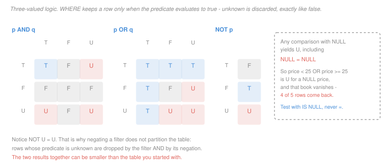

# Database Systems · Lesson 1.3: SQL I — querying single tables

> ⏱ ~15 min · Module 1: The relational model & SQL · Builds on: [1.2 (relational algebra)](01-02-relational-algebra.md) · Unlocks: [1.4 (joins)](01-04-sql-joins-and-set-operations.md)

## Why this matters

SQL has outlived every language it was designed alongside, and the reason is that it is *declarative*: you state the answer's properties and the system chooses the procedure. That separation is what lets a query written in 1995 get faster in 2025 without being touched.

But SQL is not the algebra of [1.2](01-02-relational-algebra.md) with different syntax. It differs in two ways that account for most real query bugs: it works on **multisets**, so duplicates survive, and it evaluates predicates in **three-valued logic**, so a row can be neither kept nor rejected. This lesson is those two departures, because everything else about `SELECT` you can look up.

## The idea

The core query form is three clauses, and it maps exactly onto three algebra operators:

```
SELECT   columns        -- projection  (pi)
FROM     tables         -- product     (x)
WHERE    condition      -- selection   (sigma)
```

The mapping is $\pi_{\text{columns}}(\sigma_{\text{condition}}(\text{tables}))$, and it is worth reading the clauses in *evaluation* order rather than written order: `FROM` first (what am I looking at), then `WHERE` (which rows survive), then `SELECT` (which columns come back). Written order is `SELECT`-first purely because it reads better in English.

Two departures from the algebra.

**SQL keeps duplicates.** `SELECT city FROM member` over four members returns four rows, two of them "Leeds." The algebra's projection would return three. SQL made this choice deliberately — removing duplicates means sorting or hashing the whole result, which is expensive, and often you do not care. `DISTINCT` asks for the algebra's behaviour and you pay for it then.

**SQL predicates return one of three values.** Every comparison involving NULL evaluates to **unknown**, not true and not false. `WHERE` keeps a row only when the predicate is *true*, so unknown behaves like false at the filter — but unlike false under negation, since `NOT unknown` is still unknown. That asymmetry is where the traps live.

## The formal version

> **The `SELECT–FROM–WHERE` block.** For a single table, `SELECT` $A_1, \ldots, A_k$ `FROM` $r$ `WHERE` $\theta$ evaluates to the multiset $\{\!\{\, t[A_1,\ldots,A_k] \mid t \in r,\ \theta(t) = \text{true} \,\}\!\}$.

The doubled braces mark a multiset. Note the condition is $\theta(t) = \text{true}$, not $\theta(t) \neq \text{false}$ — that is the whole content of the NULL behaviour, written once.

> **Three-valued logic.** The truth values are true, false and unknown. Any comparison ($=$, $<$, $\neq$, …) with a NULL operand yields unknown. The connectives extend as in the figure below, and `NULL = NULL` is unknown, not true.

In words: NULL does not mean "a value I have not told you," it means "no value," and two absences are not the same absence. Testing for it needs a dedicated operator: `IS NULL` and `IS NOT NULL` return true or false, never unknown.

The other clauses, briefly, since they are notation rather than ideas:

| clause | does | note |
|---|---|---|
| `DISTINCT` | removes duplicate result rows | two NULLs count as duplicates here, unlike in `=` |
| `ORDER BY` $A$ `ASC`/`DESC` | sorts the result | the *only* way to get an order; without it, none is promised |
| `LIKE 'pat'` | pattern match; `%` is any run of characters, `_` is exactly one | |
| $A$ `BETWEEN` $x$ `AND` $y$ | shorthand for $A \geq x$ `AND` $A \leq y$ | **inclusive at both ends** |
| $A$ `IN` $(v_1, \ldots, v_n)$ | shorthand for $A = v_1$ `OR` $\cdots$ `OR` $A = v_n$ | inherits three-valued logic, with consequences below |

## Picture



Read the `NOT` column first: `NOT unknown` is unknown. Everything surprising about NULL follows from that one cell.

## Worked examples

**Example 1 — the filter that loses a row it never mentioned.**

Take the five books, one of which (*Ember*) has a NULL price. Consider a predicate that is obviously a tautology:

```sql
SELECT title, price FROM book
WHERE  price < 25 OR price >= 25;
```

Every number is either below 25 or not below 25, so this should return all five books. It returns **four**:

| title | price |
|---|---|
| Tidewater | 14 |
| Nine Gates | 22 |
| Saltmarsh | 18 |
| The Long Field | 31 |

*Ember* is gone. Trace it: `NULL < 25` is unknown, `NULL >= 25` is unknown, and `unknown OR unknown` is unknown by the middle table in the figure. `WHERE` keeps only true, so the row is dropped.

The consequence generalizes and is worth stating as a rule. **A filter and its negation do not partition a table.** Running `WHERE price < 25` gives 3 rows and `WHERE NOT (price < 25)` gives 1 row — four in total, out of five. The missing row is in neither result, and if you are reconciling two reports built this way, the difference will not be where you look for it.

The fix is to say what you mean about the absent value:

```sql
SELECT title, price FROM book
WHERE  price < 25 OR price IS NULL;
```

**Example 2 — how one NULL empties a `NOT IN`.**

`IN` and `NOT IN` are shorthands for chains of `OR`, and they inherit three-valued logic with an effect that is genuinely startling.

```sql
SELECT name, city FROM publisher WHERE city NOT IN ('Bristol');
```

returns the two Leeds publishers, Ravenwood and Kingsley. Now add a NULL to the list — which in practice happens when the list is a subquery over a nullable column:

```sql
SELECT name, city FROM publisher WHERE city NOT IN ('Bristol', NULL);
```

returns **nothing**. Zero rows.

Unfold the shorthand for Ravenwood, whose city is Leeds:

$$\text{NOT}\bigl(\text{'Leeds'} = \text{'Bristol'} \;\text{OR}\; \text{'Leeds'} = \text{NULL}\bigr) = \text{NOT}(\text{false OR unknown}) = \text{NOT}(\text{unknown}) = \text{unknown}$$

Unknown, so the row is dropped. The same happens for every row, so the result is empty. The database is being perfectly consistent: it cannot rule out that the NULL *is* Leeds, so it cannot assert Leeds is absent from the list.

Now the asymmetry. The positive form is unaffected:

```sql
SELECT name, city FROM publisher WHERE city IN ('Leeds', NULL);
```

returns both Leeds publishers, because `'Leeds' = 'Leeds'` is true and `true OR unknown` is true. **`IN` tolerates a NULL in the list; `NOT IN` is destroyed by one.** That single fact accounts for a large share of "the query returned nothing and I don't know why" incidents, and it is the reason experienced practitioners write `NOT EXISTS` instead — which behaves the way you expect and is covered in [1.6](01-06-subqueries-exists-and-views.md).

## Watch out

- **You might think `WHERE x = NULL` finds the rows with no value.** It finds nothing, ever, because the predicate is unknown for every row including the NULL ones. `IS NULL` is a distinct operator for exactly this reason.
- **You might think `SELECT` returns a set.** It returns a multiset. Two members from Leeds give you "Leeds" twice, and any count you compute off that column is counting rows, not distinct cities. `DISTINCT` is the fix and it is not free — it forces a sort or a hash.
- **You might think rows come back in insertion order, or in key order.** Nothing is promised without `ORDER BY`. A query that appears ordered today will silently reorder when the optimizer picks a different access path in [3.3](03-03-hashing-and-choosing-an-access-path.md), which is a spectacular way to break a report months after writing it.
- **You might think `BETWEEN` is exclusive at the top.** It is inclusive at both ends. `price BETWEEN 14 AND 22` includes both the 14 and the 22.

## One-liner

> `WHERE` keeps a row only when the predicate is *true*, so unknown is discarded like false — but `NOT unknown` is still unknown, and a filter plus its negation can return fewer rows than the table holds.

## Problems

**P1 (🟢)** Using `book(isbn, title, pub_id, year, price)` with the five rows below, give the exact result of each query, including row count.

| isbn | title | pub_id | year | price |
|---|---|---|---|---|
| B1 | Tidewater | RVN | 2019 | 14 |
| B2 | Nine Gates | RVN | 2021 | 22 |
| B3 | Saltmarsh | HOL | 2019 | 18 |
| B4 | The Long Field | HOL | 2023 | 31 |
| B5 | Ember | RVN | 2023 | NULL |

(a) `SELECT year FROM book;`
(b) `SELECT DISTINCT year FROM book;`
(c) `SELECT title FROM book WHERE price BETWEEN 14 AND 22;`
(d) `SELECT title FROM book WHERE title LIKE '%a%';`

**P2 (🟡)** A colleague reports that these two queries return 3 rows and 1 row respectively against the table above, and concludes the table has 4 rows.

```sql
SELECT title FROM book WHERE price < 25;
SELECT title FROM book WHERE price >= 25;
```

(a) Confirm the two row counts.
(b) Name the row that appears in neither result, and give the truth value of each predicate for it.
(c) Rewrite the *first* query so that the two results do partition the table, and state the new row counts.
(d) A different colleague proposes `WHERE NOT (price >= 25)` as the fix for the first query. Give its row count and say whether it works.

**P3 (🔴, optional)** The `member` table has `city` values Leeds, Bristol, Leeds, NULL for members 1 to 4.

(a) Give the row count of `SELECT name FROM member WHERE city NOT IN ('Bristol');` and name the members returned.
(b) Give the row count of `SELECT name FROM member WHERE city NOT IN (SELECT city FROM member WHERE mid = 2);` and explain the difference from (a), if any.
(c) Now consider `SELECT name FROM member WHERE city NOT IN (SELECT city FROM member WHERE mid IN (2, 4));`. Give the row count and explain it by unfolding the shorthand for member 1.
(d) State a general rule of the form "`NOT IN` returns a row only when …" that covers all three cases.

<details>
<summary>Solutions</summary>

**P1**

(a) **5 rows**, one per book, duplicates kept: 2019, 2021, 2019, 2023, 2023. SQL projects without deduplicating, so 2019 and 2023 each appear twice.

(b) **3 rows**: 2019, 2021, 2023.

(c) **3 rows**: Tidewater (14), Saltmarsh (18), Nine Gates (22). `BETWEEN` is inclusive, so both endpoint values 14 and 22 are in. *Ember* is out — `NULL BETWEEN 14 AND 22` unfolds to `NULL >= 14 AND NULL <= 22`, which is `unknown AND unknown` equals unknown.

(d) **3 rows**: Tidewater, Nine Gates, Saltmarsh. `%a%` matches a lowercase `a` anywhere. *The Long Field* has no lowercase `a`; *Ember* has none either. Note that the pattern is case-sensitive in most systems, so a title beginning with a capital A would not match.

**P2**

(a) Confirmed. `price < 25` gives **3** rows (Tidewater 14, Nine Gates 22, Saltmarsh 18); `price >= 25` gives **1** row (The Long Field 31).

(b) **Ember**, whose price is NULL. Both predicates evaluate to **unknown** for it: `NULL < 25` is unknown and `NULL >= 25` is unknown. `WHERE` requires true, so the row fails both filters. The table has 5 rows, not 4 — the colleague's arithmetic is right and the inference is wrong.

(c) Add the NULL case explicitly to one side:

```sql
SELECT title FROM book WHERE price < 25 OR price IS NULL;
```

This gives **4** rows, and with the unchanged second query's **1** row the two now partition the 5-row table. Which side the unpriced book belongs on is a modelling decision, not a SQL one — "under 25" and "unknown price" are different categories, and putting them together is only right if the report's reader understands that.

(d) **1 row**, and it does not work. Unfolding for *Ember*: `price >= 25` is unknown, and `NOT unknown` is unknown, so the row is dropped exactly as before. The result is `WHERE NOT (price >= 25)` returning the same 3 rows as `WHERE price < 25`, still missing *Ember*.

This is the practical form of the rule from the figure: negating a predicate never rescues a row that evaluates to unknown, because negation maps unknown to unknown. Only `IS NULL` reaches those rows.

**P3**

(a) **2 rows: Ada and Cyd.** Both have city Leeds, so `'Leeds' NOT IN ('Bristol')` is true. Bram is Bristol, so his predicate is false. Devi's city is NULL, so `NULL NOT IN ('Bristol')` unfolds to `NOT(NULL = 'Bristol')`, which is `NOT(unknown)`, which is unknown — she is dropped even though the list holds no NULL. The list does not have to contain a NULL to lose rows; a NULL in the *column* is enough.

(b) **2 rows**, the same: Ada and Cyd. The subquery `SELECT city FROM member WHERE mid = 2` returns the single value 'Bristol', so this is identical to (a). The lesson is that the subquery form is not intrinsically dangerous — what matters is whether the values it returns include a NULL.

(c) **0 rows.** The subquery now returns two values, 'Bristol' and NULL, because member 4 has a NULL city. Unfolding for member 1, whose city is Leeds:

$$\text{NOT}\bigl(\text{'Leeds'} = \text{'Bristol'} \;\text{OR}\; \text{'Leeds'} = \text{NULL}\bigr) = \text{NOT}(\text{false OR unknown}) = \text{NOT}(\text{unknown}) = \text{unknown}$$

Unknown, so member 1 is dropped, and the same computation drops every other member. The query returns nothing.

The dangerous part is that (b) and (c) differ only in which rows the *subquery* happens to select. A `NOT IN` that works correctly for a year can start returning nothing the day someone inserts a row with a NULL in that column, with no error and no warning.

(d) **`NOT IN` returns a row only when the row's value differs from every element of the list *and* no element of the list is NULL.** Equivalently: one NULL anywhere in the list makes the entire `NOT IN` predicate incapable of ever being true, so the result is empty regardless of the data.

The practical rule that follows: if the column inside a `NOT IN` subquery is nullable, either add `WHERE col IS NOT NULL` to the subquery or use `NOT EXISTS`, which is immune ([1.6](01-06-subqueries-exists-and-views.md)).

</details>

## Flashback

**From Lesson 1.1 (the relational model):** A relation `shipment(truck_id, depot, day, weight)` records that a truck visited a depot on a day carrying a weight. A truck visits at most one depot per day, and several trucks may visit the same depot on the same day.

Name the candidate key, and justify minimality by giving, for each attribute you include, a pair of rows that would collide if it were dropped.

<details>
<summary>Solution</summary>

**Candidate key: `{truck_id, day}`.**

It is a superkey: the stated rule "a truck visits at most one depot per day" says that fixing the truck and the day fixes the row.

Minimality, by one colliding pair per attribute:

- **drop `truck_id`**, leaving `{day}`: two trucks both operate on 2024-03-01, so `(T1, Ashby, 2024-03-01, 900)` and `(T2, Ashby, 2024-03-01, 400)` agree on `day` and differ. Not a superkey.
- **drop `day`**, leaving `{truck_id}`: one truck operates on many days, so `(T1, Ashby, 2024-03-01, 900)` and `(T1, Byfleet, 2024-03-02, 700)` agree on `truck_id` and differ. Not a superkey.

Both proper subsets fail, so the superkey is minimal.

**The trap avoided:** `depot` looks like it belongs in the key, since a row is "about" a truck at a depot. It does not — `{truck_id, day}` already determines it. Adding `depot` would give the superkey `{truck_id, day, depot}`, which identifies rows perfectly well but is not *minimal*, and so is not a candidate key. The question to ask of every attribute is not "is it part of the row's identity?" but "does removing it let two rows collide?"

</details>

## Connections

- **Backward:** `SELECT–FROM–WHERE` is $\pi(\sigma(\times))$ from [1.2](01-02-relational-algebra.md), with two amendments — multisets instead of sets, and three-valued instead of two-valued logic. Both amendments are performance or modelling compromises, and both cost you something in correctness.
- **Forward:** [1.4](01-04-sql-joins-and-set-operations.md) puts more than one table in the `FROM` clause, at which point NULL stops being something you store and starts being something joins *manufacture*. The duplicate-retention choice becomes a cost question in [3.5](03-05-query-operators-and-join-algorithms.md), where `DISTINCT` is priced as a sort.
- **Sideways:** three-valued logic is a genuine departure from the classical propositional logic of [`discrete-mathematics` 1.1](../../discrete-mathematics/lessons/01-01-propositional-logic-boolean-algebra.md), where every proposition is true or false and the law of excluded middle guarantees $p \vee \neg p$. Here that law fails — $p \vee \neg p$ is unknown when $p$ is — which is exactly why Example 1's tautology lost a row.
