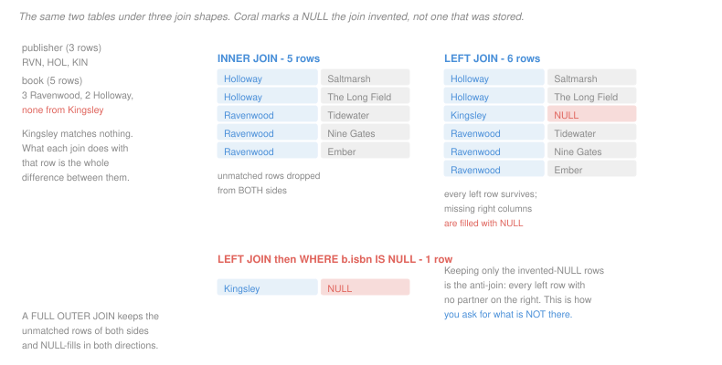

# Database Systems · Lesson 1.4: SQL II — joins & set operations

> ⏱ ~15 min · Module 1: The relational model & SQL · Builds on: [1.3 (SQL I)](01-03-sql-select-from-where.md), [1.2 (relational algebra)](01-02-relational-algebra.md) · Unlocks: [1.5 (aggregation)](01-05-sql-aggregation-and-grouping.md)

## Why this matters

A normalized schema scatters one fact across several tables on purpose — that is what Module 2 will argue for. Joins are how you put it back together, which makes them the most-written and most-misunderstood construct in SQL.

The specific thing worth learning carefully is the **outer** join, because it is the only way to ask a question about what is *absent*. "Which publishers have no books," "which customers never ordered," "which servers reported no heartbeat" — every one of those is an outer join followed by a test for the NULL the join manufactured. Getting that pattern into your hands is most of the value of this lesson.

## The idea

Put two tables in the `FROM` clause and SQL forms their Cartesian product; the `ON` or `WHERE` condition then filters it. That is the theta join of [1.2](01-02-relational-algebra.md), unchanged.

The interesting question is what happens to a row with **no partner**. An inner join drops it. Sometimes that is a silent bug: a report of publishers and their book counts that quietly omits publishers with zero books, so the number that most needs attention is the one that does not appear.

Outer joins fix this by promising to preserve rows from one side or both:

- **`LEFT JOIN`** keeps every row of the left table. Where there is no match, the right table's columns come back NULL.
- **`RIGHT JOIN`** does the same for the right table. It is `LEFT JOIN` with the operands swapped and is rarely used, because reordering is easier to read than remembering which side is preserved.
- **`FULL OUTER JOIN`** keeps unmatched rows from both sides, NULL-filling in both directions.

The critical observation, and the one to carry forward: **the NULLs an outer join produces were never stored anywhere.** They are the join's way of saying "no partner." Testing for them is how you find the unmatched rows, and that is the anti-join pattern.

## The formal version

> **Inner join.** `r JOIN s ON` $\theta$ is $\sigma_\theta(r \times s)$, exactly the theta join.

> **Left outer join.** `r LEFT JOIN s ON` $\theta$ equals
> $$(r \bowtie_\theta s) \;\cup\; \bigl\{\, t \cdot \omega \mid t \in r,\ \nexists\, u \in s \text{ with } \theta(t,u) \,\bigr\}$$
> where $\omega$ is a tuple of NULLs with the arity of $s$.

In words: the ordinary join, plus one NULL-padded row for each left row that matched nothing. The count follows immediately: a left join returns at least $|r|$ rows, and exactly $|r|$ when the match is at most one-to-one.

> **Anti-join.** The rows of $r$ with no partner in $s$, written in SQL as a left join filtered on a NULL in a **non-nullable** column of $s$:
> ```sql
> SELECT r.* FROM r LEFT JOIN s ON r.k = s.k WHERE s.k IS NULL;
> ```

The words "non-nullable" are load-bearing. If the tested column can itself contain NULL, the filter cannot distinguish "no partner" from "partner found, value absent," and the query silently over-reports. Test the primary key of $s$, which by definition is never NULL.

> **Self-join.** A join of a table to itself, requiring `AS` aliases to disambiguate — the algebra's rename operator $\rho$ made syntactic.

Finally the three set operations, which behave like the algebra's and take one twist:

| SQL | algebra | duplicates |
|---|---|---|
| `UNION` | $r \cup s$ | removed |
| `UNION ALL` | — | kept |
| `INTERSECT` | $r \cap s$ | removed |
| `EXCEPT` | $r - s$ | removed |

All require union-compatible inputs. **And all of them treat NULL as equal to NULL**, which is the opposite of what `=` does in a `WHERE` clause. That inconsistency is real, is in the standard, and Example 2 makes it concrete.

## Picture



Kingsley publishes nothing. The inner join forgets it exists; the left join reports it with a NULL; the anti-join returns it and nothing else.

## Worked examples

**Example 1 — the report that hides its own worst row.**

*List every publisher with the titles they publish.* The obvious query:

```sql
SELECT p.name, b.title
FROM   publisher p JOIN book b ON p.pub_id = b.pub_id;
```

returns **5 rows**: Holloway twice, Ravenwood three times. Kingsley is absent. Not flagged, not zero-filled — absent, because it has no `book` row to pair with, and the inner join's product contains no tuple for it.

If the question was "which publishers should we drop from the catalogue," this query has removed the answer from the report. Preserve the left side:

```sql
SELECT p.name, b.title
FROM   publisher p LEFT JOIN book b ON p.pub_id = b.pub_id;
```

**6 rows**, and the sixth is `(Kingsley, NULL)`. Now filter for exactly that row:

```sql
SELECT p.name
FROM   publisher p LEFT JOIN book b ON p.pub_id = b.pub_id
WHERE  b.isbn IS NULL;
```

**1 row: Kingsley.** Note the test is on `b.isbn`, the book's primary key. Testing `b.price` would be wrong — *Ember* has a NULL price, so a Ravenwood row would satisfy the filter and Ravenwood would be falsely reported as publishing nothing.

**One trap worth seeing in place.** Moving a condition on the right table from `ON` to `WHERE` silently converts an outer join into an inner one:

```sql
-- intended: every publisher, with their 2023 titles if any
SELECT p.name, b.title
FROM   publisher p LEFT JOIN book b ON p.pub_id = b.pub_id
WHERE  b.year = 2023;          -- WRONG
```

Kingsley's padded row has `b.year` NULL, so `NULL = 2023` is unknown and the row is filtered away — along with Holloway's *Saltmarsh* row, which is fine, but Kingsley disappears entirely and the left join has bought nothing. The condition belongs in the `ON` clause, where it restricts *which rows may match* rather than which survive:

```sql
FROM publisher p LEFT JOIN book b
       ON p.pub_id = b.pub_id AND b.year = 2023
```

**`ON` filters the match; `WHERE` filters the result.** For an inner join the distinction does not matter. For an outer join it is the difference between a correct query and an inner join in disguise.

**Example 2 — `INTERSECT` and `JOIN` disagree about NULL.**

Members live in Leeds, Bristol, Leeds, and one member's city is NULL. Ask two versions of "is this city shared with itself":

```sql
SELECT city FROM member
INTERSECT
SELECT city FROM member WHERE mid = 4;      -- returns 1 row: NULL
```

```sql
SELECT a.name, b.name FROM member a JOIN member b ON a.city = b.city
WHERE a.mid = 4 AND b.mid = 4;              -- returns 0 rows
```

The same NULL, compared with itself, matches under `INTERSECT` and fails under `ON a.city = b.city`. Both behaviours are specified. Set operations use *duplicate* semantics, under which two NULLs are the same value; comparison predicates use three-valued logic, under which `NULL = NULL` is unknown ([1.3](01-03-sql-select-from-where.md)).

The practical upshot: **`EXCEPT` is not a safe rewrite of a `NOT IN`, and neither is a safe rewrite of the other, when NULLs are in play.** Deciding between them means deciding what you want a missing value to mean, and the two constructs have already decided differently.

**A self-join, for contrast.** Pairs of members in the same city:

```sql
SELECT a.name, b.name, a.city
FROM   member a JOIN member b ON a.city = b.city AND a.mid < b.mid;
```

**1 row: (Ada, Cyd, Leeds).** The `a.mid < b.mid` condition does two jobs at once — it stops each member pairing with herself, and it stops each pair appearing twice in both orders. Without it the query returns 5 rows instead of 1. The NULL-city member is excluded here, consistent with the join semantics above.

## Watch out

- **You might think a `WHERE` condition on the right table is harmless in an outer join.** It converts the outer join to an inner one, because the padded rows have NULL there and fail every comparison. Conditions restricting the match go in `ON`.
- **You might think you can test any right-hand column for the anti-join.** Test a column that cannot be NULL in the source data — the primary key. Testing a nullable column conflates "no matching row" with "matching row, no value."
- **You might think `UNION` and `UNION ALL` differ only in tidiness.** `UNION` must deduplicate, which means sorting or hashing the entire result. When you know the inputs are disjoint, `UNION ALL` is free and `UNION` is not.
- **You might think a self-join needs no ordering condition.** Without one, every row pairs with itself and every pair appears twice. The `<` comparison on the key is the standard fix and it is doing two separate jobs.

## One-liner

> An inner join answers "what matches"; an outer join plus a test for the NULL it invented answers "what doesn't" — and only the second question can find the row that isn't there.

## Problems

**P1 (🟢)** Using `publisher(pub_id, name, city)` with three rows RVN, HOL, KIN and `book(isbn, title, pub_id, year, price)` with five rows — three with `pub_id` RVN, two with HOL, none with KIN — give the exact row count of each query.

(a) `SELECT * FROM publisher p JOIN book b ON p.pub_id = b.pub_id;`
(b) `SELECT * FROM publisher p LEFT JOIN book b ON p.pub_id = b.pub_id;`
(c) `SELECT * FROM book b LEFT JOIN publisher p ON p.pub_id = b.pub_id;`
(d) `SELECT * FROM publisher p, book b;`

**P2 (🟡)** A team runs this query to find members who have never borrowed anything, against `member` (4 rows: Ada, Bram, Cyd, Devi) and `loan(mid, isbn, taken, returned)` (9 rows; Devi appears in none; the `returned` column is NULL for three loans that are still out).

```sql
SELECT m.name
FROM   member m LEFT JOIN loan l ON m.mid = l.mid
WHERE  l.returned IS NULL;
```

Three loans are still out: one held by Ada and two held by Cyd.

(a) Give the exact row count and the names returned, in the order the join produces them.
(b) State the intended answer.
(c) Name the defect in one sentence, and give the corrected query.
(d) The team's next attempt uses `WHERE l.mid IS NULL`. Does it work? Answer yes or no with the reason.

**P3 (🔴, optional)** You have `staff(sid, name, manager_sid)` where `manager_sid` is a foreign key to `staff.sid` and is NULL for the one person with no manager.

| sid | name | manager_sid |
|---|---|---|
| 1 | Rao | NULL |
| 2 | Silva | 1 |
| 3 | Tan | 1 |
| 4 | Umar | 2 |

(a) Write a query listing every employee's name beside their manager's name, including the employee who has none, and give its exact output.
(b) Give the row count if `JOIN` is used instead of `LEFT JOIN`, and name the missing row.
(c) Write a query returning the names of employees who manage nobody, and give its output. State which of the two patterns from this lesson you used and why the other one does not apply.
(d) Someone proposes finding the top of the hierarchy with `SELECT name FROM staff WHERE manager_sid = NULL`. Give its row count and the one-word fix.

<details>
<summary>Solutions</summary>

**P1**

(a) **5.** Each book matches exactly one publisher, so the inner join returns one row per book. Kingsley contributes nothing.

(b) **6.** All 5 matched rows, plus one NULL-padded row for Kingsley. The general rule: a left join returns at least $|r|$ rows, and here it returns the 5 matches plus 1 unmatched left row.

(c) **5.** The preserved side is now `book`, and every book has a publisher, so there are no unmatched left rows to pad. Swapping the operands of a left join changes the answer whenever the unmatched rows are on the other side — which is precisely why `RIGHT JOIN` is redundant and confusing.

(d) **15.** A comma in the `FROM` clause with no join condition is a Cartesian product: $3 \times 5$.

**P2**

(a) **4 rows: Ada, Cyd, Cyd, Devi.** Trace it. The left join produces 10 rows — 9 loans, plus one NULL-padded row for Devi. The filter `l.returned IS NULL` keeps the three outstanding loans, one of Ada's and both of Cyd's, plus Devi's padded row, whose `returned` is NULL because the entire right side is NULL. Cyd appears twice because she holds two outstanding loans.

(b) **1 row: Devi.** She is the only member with no loan at all.

(c) **The defect:** the query tests a *nullable* column, so it cannot distinguish "no matching loan" from "matching loan that has not been returned yet," and it reports both. Corrected by testing the right side's key instead:

```sql
SELECT m.name
FROM   member m LEFT JOIN loan l ON m.mid = l.mid
WHERE  l.isbn IS NULL;
```

Returns **1 row: Devi**. Any column of `loan` that is part of its primary key — `mid`, `isbn` or `taken` — works, since none can be NULL in a stored row.

(d) **Yes, it works.** `l.mid` is part of `loan`'s primary key and therefore never NULL in a stored row, so a NULL there can only have come from the join's padding. It returns Devi. The reason (c) failed and this succeeds is not about which table the column belongs to but about whether the column is nullable at the source.

**P3**

(a)

```sql
SELECT e.name AS employee, m.name AS manager
FROM   staff e LEFT JOIN staff m ON e.manager_sid = m.sid;
```

| employee | manager |
|---|---|
| Rao | NULL |
| Silva | Rao |
| Tan | Rao |
| Umar | Silva |

**4 rows.** Two aliases are required because the same table appears twice; without them `sid` is ambiguous. Rao's row survives with a NULL manager — and note this NULL is *both* stored (her `manager_sid` is NULL) and manufactured (no `m` row matched). Either way the left join preserves her.

(b) **3 rows**, and the missing one is **Rao**. Her `manager_sid` is NULL, so `NULL = m.sid` is unknown for every candidate `m`, and she matches nobody. This is the inner join dropping exactly the row the question was most interested in.

(c) Employees who manage nobody:

```sql
SELECT m.name
FROM   staff m LEFT JOIN staff e ON e.manager_sid = m.sid
WHERE  e.sid IS NULL;
```

| name |
|---|
| Tan |
| Umar |

**2 rows.** This is the **anti-join**: preserve every potential manager, then keep only those the join failed to match. The aliasing is reversed from (a) — here the preserved side is the *manager* role.

Why the other pattern does not apply: a plain inner join answers "who manages somebody" (Rao and Silva), and there is no way to get from that to its complement without a second pass over `staff`. The anti-join does it in one, and the test on `e.sid` is safe because `sid` is the primary key.

The `NOT IN` alternative is available but hazardous here:

```sql
SELECT name FROM staff WHERE sid NOT IN (SELECT manager_sid FROM staff);
```

returns **0 rows**, because `manager_sid` contains a NULL for Rao and one NULL empties a `NOT IN` entirely ([1.3](01-03-sql-select-from-where.md)). Adding `WHERE manager_sid IS NOT NULL` to the subquery repairs it. The anti-join needs no such repair, which is the practical argument for preferring it.

(d) **0 rows.** `manager_sid = NULL` is unknown for every row, including Rao's. The one-word fix is **`IS`**: `WHERE manager_sid IS NULL`, which returns Rao.

</details>

## Flashback

**From Lesson 1.2 (relational algebra):** A query is written as

$$\pi_{\text{title}}\Bigl(\sigma_{\text{price} > 20 \,\wedge\, \text{city} = \text{'Bristol'}}\bigl(\text{book} \bowtie \text{publisher}\bigr)\Bigr)$$

with $|\text{book}| = 40$ and $|\text{publisher}| = 8$. Each book has exactly one publisher. Two publishers are in Bristol; 12 books cost more than 20.

(a) Give the size of each intermediate when the expression is evaluated as written, unfolding the natural join into a product followed by a selection.
(b) Rewrite it with both selections pushed to their leaves, and give the new intermediate sizes.
(c) Give the ratio of the largest intermediate in (a) to the largest in (b).

<details>
<summary>Solution</summary>

(a) As written:

| step | size |
|---|---|
| $\text{book} \times \text{publisher}$ | $40 \times 8 = 320$ |
| join condition on `pub_id` | 40 |
| $\sigma_{\text{price}>20 \wedge \text{city}=\text{'Bristol'}}$ | at most 12 |
| $\pi_{\text{title}}$ | at most 12 |

The join keeps 40 because the relationship is many-to-one: every book has exactly one publisher, so the join emits one row per book and never more.

(b) Pushed down:

$$\pi_{\text{title}}\Bigl(\sigma_{\text{price}>20}(\text{book}) \bowtie \sigma_{\text{city}=\text{'Bristol'}}(\text{publisher})\Bigr)$$

| step | size |
|---|---|
| $\sigma_{\text{price}>20}(\text{book})$ | 12 |
| $\sigma_{\text{city}=\text{'Bristol'}}(\text{publisher})$ | 2 |
| product | $12 \times 2 = 24$ |
| join condition | at most 12 |
| $\pi_{\text{title}}$ | at most 12 |

(c) Largest intermediate is **320** as written and **24** pushed down, a ratio of $320/24 \approx 13.3$.

**Why the pushdown is legal:** `price` mentions only `book`, `city` mentions only `publisher`, so each predicate can be evaluated by one input alone. A predicate mentioning both — say `book.year > publisher.founded` — could not be pushed below the join at all.

**Why the final counts say "at most":** the number of books over 20 published in Bristol is not determined by the numbers given. Both counts are upper bounds, and they are the same bound, which is the point — the rewrite changed the work, not the answer.

</details>

## Connections

- **Backward:** every join here is $\sigma_\theta(r \times s)$ from [1.2](01-02-relational-algebra.md), and the aliases in a self-join are the rename operator $\rho$ made syntactic. The outer joins have no algebra counterpart among the six primitives — they exist because SQL needs to talk about absence, and the pure algebra has no vocabulary for it.
- **Forward:** [1.5](01-05-sql-aggregation-and-grouping.md) counts rows per group, and the outer-join-plus-`COUNT` combination has a trap that follows directly from this lesson's NULL padding. [1.6](01-06-subqueries-exists-and-views.md) gives `NOT EXISTS`, the safer spelling of the anti-join. The cost of each join shape is derived in [3.5](03-05-query-operators-and-join-algorithms.md).
- **Sideways:** the anti-join is set difference with a guard, and the reason `NOT IN` and `EXCEPT` disagree is that they inherit different NULL conventions from the same standard. Watching one construct reason classically while its neighbour reasons in three values is a useful reminder that "the logic" of a system is a choice its designers made, not a fact about the domain.
