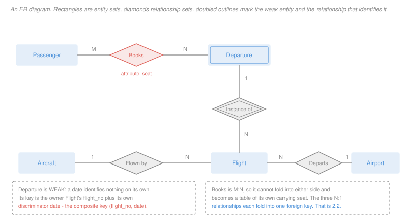

# Database Systems · Lesson 2.1: Entity–relationship modeling

> ⏱ ~15 min · Module 2: Database design & normalization · Builds on: [1.1 (the relational model)](01-01-the-relational-model.md) · Unlocks: [2.2 (ER to schema)](02-02-from-er-to-relational-schema.md)

## Why this matters

Module 1 assumed a schema and queried it. Where did the schema come from? Somebody read a description of a business and decided what the tables were — and that decision determines which questions are cheap, which are expensive, and which are impossible to ask without a migration.

ER modeling is the discipline for making that decision deliberately. Its real value is not the diagram. It is that the modeling vocabulary forces you to answer questions the prose left vague: can a flight have two aircraft, must every booking name a passenger, is a *date* enough to identify a departure. Those answers become constraints, and constraints are what a database can actually enforce.

## The idea

Three constructs, and one distinction that carries most of the weight.

An **entity** is a thing with independent existence and an identity of its own: a passenger, an aircraft, an airport. An **entity set** is all the entities of one kind — the box in the diagram is the set, not the thing.

A **relationship** is an association among entities: this passenger booked that departure. A **relationship set** is all such associations.

The distinction that matters: **an entity is something you would want to talk about even if nothing were related to it.** An airport exists whether or not any flight uses it. A booking does not — a booking with no passenger and no flight is not a thing. So airports are entities and bookings are relationships. Getting this wrong is the most common modeling error, and it shows up later as a table whose primary key is meaningless.

The other idea is **weak entities**. Some things have identity only relative to something else. A "departure" — flight BA117 on the 4th of March — is a real thing you want rows about, but the date alone identifies nothing; there is a departure on the 4th of March for hundreds of flights. Its identity borrows from its owner. That borrowing is what produces the composite keys you have been meeting since [1.1](01-01-the-relational-model.md).

## The formal version

> **Entity set** $E$: a set of entities sharing a set of attributes. **Relationship set** $R \subseteq E_1 \times E_2 \times \cdots \times E_n$: a set of tuples of entities, possibly with attributes of its own.

Note that a relationship set is literally a relation over entities, which is why the translation in [2.2](02-02-from-er-to-relational-schema.md) is mechanical rather than creative.

Attributes come in kinds worth naming, because each translates differently:

| kind | means | example |
|---|---|---|
| simple | one atomic value | `year` |
| composite | decomposes into parts | `address` into street, city, postcode |
| multivalued | several values per entity | `phone` |
| derived | computable from others | `age` from `date_of_birth` |

Only simple attributes survive translation unchanged. Composite ones are flattened into their parts, multivalued ones become a table of their own, and derived ones are usually not stored at all.

> **Cardinality.** For a binary relationship between $E_1$ and $E_2$, the cardinality states how many entities of one side an entity of the other may relate to: **1:1**, **1:N**, or **M:N**.

In words: read it as a promise about the worst case. "A flight uses one aircraft" is 1 on the aircraft side; "an aircraft flies many flights" is N on the flight side, so the relationship is N:1 from flight to aircraft.

> **Participation.** **Total** participation means every entity of that set must appear in at least one relationship; **partial** means it may appear in none.

Cardinality bounds the count from above, participation from below. Together they give the range $(\min, \max)$, and they translate into different things: cardinality decides *where the foreign key goes*, participation decides whether that column is `NOT NULL`.

> **Weak entity set.** An entity set with no key of its own. It has an **identifying owner** and an **identifying relationship** (drawn doubled), and its key is the owner's key plus its own **discriminator** — the attributes that distinguish it among the entities sharing an owner.

A weak entity always has total participation in its identifying relationship. It could not exist otherwise; without an owner it has no identity.

## Picture



Trace the two annotated claims: `Books` is M:N so it cannot fold into either side, and `Departure` is weak so its key is `(flight_no, date)`.

## Worked examples

**Example 1 — turning prose into constraints.**

> "Each flight is operated by exactly one aircraft, though an aircraft flies many flights. Every aircraft in the fleet is assigned to at least one flight. A flight departs from one airport; an airport serves many flights, and some small airports currently serve none."

Four sentences, four modeling decisions:

| phrase | construct | value |
|---|---|---|
| "exactly one aircraft" | cardinality, aircraft side | 1 |
| "an aircraft flies many flights" | cardinality, flight side | N |
| "every aircraft ... at least one flight" | participation of Aircraft | **total** |
| "some airports currently serve none" | participation of Airport | **partial** |

So `Flown by` is N:1 from Flight to Aircraft with total participation on the Aircraft side, and `Departs` is N:1 from Flight to Airport with partial participation on the Airport side.

**The word "currently" is the interesting one.** It reports today's data, and participation is a claim about every legal instance ([1.1](01-01-the-relational-model.md)). If the business rule is that an airport must be served to remain in the table, participation is total no matter what today's rows say. If an airport can be listed before service begins, it is partial. The prose does not settle it and the modeler must ask — and this is the characteristic value of the exercise: the diagram makes the unanswered question visible.

**Example 2 — why `Departure` must be weak.**

The temptation is to give departures a surrogate key: `departure_id`, an integer, done. It works, and it hides a constraint.

Suppose the real rule is that a flight number has at most one departure per date. With a surrogate key, nothing stops two rows for BA117 on the 4th of March; the database will happily hold both, and the duplicate will be discovered by a passenger at a gate. Modeling `Departure` as weak, with key `(flight_no, date)`, makes the rule a primary-key constraint the system enforces.

Check the definition against the case:

- **No key of its own.** `date` is not a key: many departures share the 4th of March. Correct.
- **Identifying owner.** `Flight`, whose `flight_no` supplies the missing identity.
- **Discriminator.** `date`, which separates departures *within* one flight. It need only be unique among siblings, not globally.
- **Total participation.** A departure with no flight is not a thing.

Key: owner's key plus discriminator, so `(flight_no, date)`. This is exactly the composite key the normalization example uses in [2.3](02-03-functional-dependencies-closure-and-keys.md), and it arrived here from a modeling decision rather than from arithmetic.

**When a surrogate key is right anyway.** If departures were genuinely independent — say the business buys and sells departure slots as objects — then a surrogate is honest and the weak-entity constraint would be wrong. The test is not "is a composite key available" but "does identity depend on the owner." Adding a surrogate to a weak entity as a *convenience* is fine and common, provided the composite is still declared unique; what is not fine is adding one *instead* of the composite, which discards the constraint.

## Watch out

- **You might think anything with attributes is an entity.** Relationships have attributes too — `seat` belongs to `Books`, not to `Passenger` or `Departure`, because it is meaningless until you say which passenger on which departure. Attributes attach where they are determined.
- **You might think cardinality and participation are the same knob.** Cardinality is the upper bound (at most how many), participation the lower (at least one, or zero). They translate into different things: where the foreign key goes, versus whether it may be NULL.
- **You might think a many-to-many relationship can be stored as a column.** It cannot. One column holds one value, so an M:N relationship needs a table of its own; this is [2.2](02-02-from-er-to-relational-schema.md)'s first hard rule, and the comma-separated-list workaround violates the atomicity that [2.4](02-04-anomalies-and-the-normal-forms.md) calls 1NF.
- **You might think a weak entity is just one with a composite key.** The composite is the symptom. The definition is that identity is *borrowed* — which is why deleting the owner must delete the weak entities, a cascade that an entity with a merely composite key does not require.

## One-liner

> An entity is what you would still want a row about if it related to nothing; everything else is a relationship, and a weak entity is the case where identity itself has to be borrowed.

## Problems

**P1 (🟢)** A hospital records that each patient is assigned to exactly one ward; a ward holds many patients and may currently be empty. Each ward is in exactly one building, and every building contains at least one ward.

For each of the following, give the requested value.

(a) The cardinality of the Patient–Ward relationship, written as a ratio from Patient to Ward.
(b) The participation of Ward in the Patient–Ward relationship: total or partial.
(c) The participation of Building in the Ward–Building relationship: total or partial.
(d) The number of relationship sets in this model.

**P2 (🟡)** Classify each of the following as **entity set**, **relationship set**, **attribute**, or **weak entity set**, and give the one-sentence reason. Where you answer weak entity set, also name its owner and discriminator.

(a) `Employee`, in a payroll system.
(b) `Assignment`, recording that an employee worked on a project at a stated percentage of their time.
(c) `Dependent`, recording an employee's children by first name for benefits purposes, where two employees may each have a child named Sam.
(d) `percentage_of_time`, from (b).
(e) `Skill`, a list of the skills the company recognizes, maintained whether or not anyone currently holds them.

**P3 (🔴, optional)** A university models `Section` as a weak entity: a section is a particular offering of a course in a term, identified by the course plus a section number, so its key is `(course_id, term, section_no)`.

(a) State the owner, the discriminator, and why `section_no` alone cannot be the key.
(b) `Section` has a relationship `Taught by` to `Instructor`, N:1, with total participation on the Section side. Give the resulting key of any table recording which instructor teaches which section, and state whether that table is needed at all.
(c) The registrar proposes replacing the composite key with a surrogate `section_id`, keeping everything else. Name one constraint that is lost and give a concrete two-row instance that the surrogate design permits and the weak-entity design forbids.
(d) A `Meeting` entity records that a section meets in a room at a time, identified within its section by day and start time. State whether `Meeting` is weak, and give its full key.

<details>
<summary>Solutions</summary>

**P1**

(a) **N:1** from Patient to Ward. Each patient has exactly one ward (1 on the ward side); each ward holds many patients (N on the patient side).

(b) **Partial.** "May currently be empty" means a ward can participate in no Patient–Ward relationship. As in Example 1, the word "currently" leaves room for doubt — if the rule were that an empty ward is closed and removed, participation would be total — but as stated, partial.

(c) **Total.** "Every building contains at least one ward" is exactly the lower-bound-of-one claim that total participation makes.

(d) **Two**: Patient–Ward and Ward–Building. Patient and Building are related only transitively, through Ward, and a transitive path is not a relationship set. Adding a direct Patient–Building relationship would be redundant and would create the possibility of contradicting the path through Ward.

**P2**

(a) **Entity set.** An employee has independent existence and an identity of her own — a payroll number — and remains a thing worth a row when related to nothing.

(b) **Relationship set.** An assignment is meaningless without both an employee and a project; it has no existence of its own. It associates two entity sets and carries an attribute, which relationships are allowed to do.

(c) **Weak entity set.** A dependent is a thing you want rows about, but the first name does not identify one: two employees may each have a child named Sam. **Owner:** `Employee`. **Discriminator:** the child's first name, which need only be unique among one employee's dependents. Key: employee number plus first name.

(d) **Attribute**, of the relationship set in (b). It is determined by the pair — how much of *her* time on *that* project — and belongs to neither entity alone. Putting it on `Employee` would allow only one project per employee; putting it on `Project` would give every worker the same share.

(e) **Entity set.** The qualifier "maintained whether or not anyone currently holds them" is doing the work: the catalogue of recognized skills exists independently of who has them. Note the contrast with (b) — "employee holds skill" would be a relationship set, but the skill itself is an entity.

**P3**

(a) **Owner:** `Course`. **Discriminator:** `(term, section_no)` — the pair, since section 1 recurs every term. `section_no` alone cannot be the key because every course has a section 1, in every term; the number is unique only among the sections of one course in one term, which is precisely what "discriminator" means.

(b) The table would have key **`(course_id, term, section_no)`** — the section's own key, and nothing more, because the relationship is N:1 and a section has exactly one instructor.

**And the table is not needed.** An N:1 relationship with total participation on the many side folds into a `NOT NULL` foreign key column on the `Section` table itself. A separate table would have exactly the same key as `Section`, one row per section, which is a table split for no reason. This is the general rule made concrete in [2.2](02-02-from-er-to-relational-schema.md): a separate table is required only when the relationship is M:N, or when partial participation makes a nullable column awkward.

(c) **Lost constraint:** that a course has at most one section with a given number in a given term. With a surrogate key, the uniqueness of `(course_id, term, section_no)` is no longer implied by the primary key, and unless it is separately declared as a unique constraint the database will accept duplicates.

An instance the surrogate design permits:

| section_id | course_id | term | section_no |
|---|---|---|---|
| 4471 | CS201 | 2024S | 1 |
| 4472 | CS201 | 2024S | 1 |

Two distinct sections, both "CS201 section 1, Spring 2024." Every foreign key still resolves, referential integrity is satisfied, and the registrar's enrollment system now has two places to put a student who was told to attend section 1. Under the weak-entity design these two rows have identical primary keys and the second insert fails.

(d) **Yes, `Meeting` is weak**, and its owner is `Section` — which is itself weak. Identity is borrowed transitively: the full key is the owner's *full* key plus the discriminator,

$$(\text{course\_id},\ \text{term},\ \text{section\_no},\ \text{day},\ \text{start\_time})$$

Five attributes. This is the standard consequence of chained weak entities, and it is the honest reflection of the fact that "Tuesday at 10" means nothing until you say which section of which course in which term. It is also the point at which most designers introduce a surrogate for convenience — which is fine, provided the five-attribute combination is still declared unique, for exactly the reason (c) gives.

</details>

## Flashback

**From Lesson 1.5 (SQL III — aggregation & grouping):** A `ward` table has 12 rows and a `patient` table has 200 rows, each with a `ward_id` foreign key. Four wards currently hold no patients.

```sql
SELECT   w.ward_id, COUNT(*) AS n_patients
FROM     ward w LEFT JOIN patient p ON w.ward_id = p.ward_id
GROUP BY w.ward_id;
```

(a) Give the number of output rows.
(b) Give the value of `n_patients` for an empty ward, and say why.
(c) Give the sum of the `n_patients` column as reported, and the true total number of patients.
(d) Give the one-token correction and the corrected sum.

<details>
<summary>Solution</summary>

(a) **12 rows**, one per ward. The left join preserves every ward, so every ward becomes a group.

(b) **1.** The left join emitted one NULL-padded row for each ward with no patients, so an empty ward's group contains exactly one row, and `COUNT(*)` counts rows regardless of whether their right-hand columns are padding.

(c) As reported, the sum is $200 + 4 = 204$: the 200 real patient rows plus one phantom for each of the four empty wards. The true total is **200**.

(d) Replace `COUNT(*)` with `COUNT(p.patient_id)` — or any non-nullable column of `patient`. The corrected sum is **200**, and the four empty wards now report 0.

The reason the correction works is that `COUNT(col)` skips NULLs, and `patient_id` is NULL in exactly the rows the join invented. Choosing a *nullable* column of `patient` would reintroduce the error in a subtler form, under-counting wards whose patients happen to have a missing value there.

</details>

## Connections

- **Backward:** the composite key of a weak entity is the composite key of [1.1](01-01-the-relational-model.md), arrived at by modeling rather than by testing subsets. Participation constraints become the `NOT NULL` and referential-action choices from that lesson's P2.
- **Forward:** [2.2](02-02-from-er-to-relational-schema.md) turns this diagram into tables by a fixed procedure, and the cardinality and participation answers above are exactly its inputs. The schema it produces is usually already in 3NF, which is why [2.4](02-04-anomalies-and-the-normal-forms.md) reads as a check on the modeling rather than a repair of it.
- **Sideways:** an ER diagram is a labelled graph, and the questions asked of it — is it connected, are there cycles among the relationships, does a path exist between two entity sets — are the graph questions of [`discrete-mathematics` 5.2](../../discrete-mathematics/lessons/05-02-graphs-paths-connectivity-euler-hamilton.md). A cycle in the diagram is worth a second look, since it usually means one relationship is derivable from the others and can contradict them.
