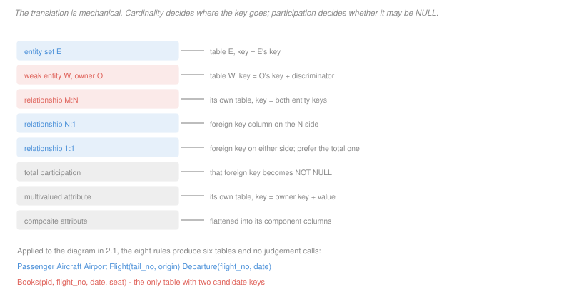

# Database Systems · Lesson 2.2: From ER to relational schema

> ⏱ ~15 min · Module 2: Database design & normalization · Builds on: [2.1 (ER modeling)](02-01-entity-relationship-modeling.md) · Unlocks: [2.3 (functional dependencies)](02-03-functional-dependencies-closure-and-keys.md)

## Why this matters

The translation from diagram to tables is **mechanical**. That is the point worth appreciating: all the judgement went into the modeling, and once cardinality and participation are settled, the schema follows by rule. If you find yourself making a design decision during translation, it means the diagram left something unsaid — and the right response is to go back and answer it, not to improvise a table.

The payoff is that a faithfully translated schema is usually already in third normal form. Module 2's later lessons will look like a repair kit; they are better understood as a *check*, and a schema that needs heavy repair almost always came from a diagram that was wrong.

## The idea

Every entity set becomes a table. Every relationship set becomes either a table or a foreign-key column, and **cardinality decides which**.

The reason is a counting argument. A column holds one value per row. So if a flight relates to exactly one aircraft, the aircraft's key fits in a column of `Flight`. If a passenger relates to many departures and a departure to many passengers, no single column on either side can hold the association — it needs a table whose rows *are* the pairs.

That gives the central rule in one line: **M:N needs its own table; N:1 folds into a column on the N side.** Everything else is detail.

The second knob is participation, and it controls nullability rather than placement. If every flight must have an aircraft, the foreign key is `NOT NULL`. If a flight may be scheduled before an aircraft is assigned, it is nullable — and that nullable column is where the NULL traps of [1.3](01-03-sql-select-from-where.md) enter a schema, by design decision rather than by accident.

## The formal version

The eight rules, which are the whole procedure:

> **R1 (entity set).** Entity set $E$ with attributes $A_1, \ldots, A_n$ and key $K$ becomes table $E(A_1, \ldots, A_n)$ with primary key $K$.

> **R2 (weak entity set).** Weak entity $W$ with owner $O$ and discriminator $D$ becomes table $W$ whose attributes include $O$'s key, with primary key $(\text{key}(O), D)$ and $\text{key}(O)$ a foreign key to $O$, declared to cascade on delete.

The cascade is not optional. A weak entity has no identity without its owner, so an orphan is not merely untidy — it is a row whose primary key is meaningless.

> **R3 (M:N relationship).** Relationship $R$ between $E_1$ and $E_2$ with attributes $B_1, \ldots, B_m$ becomes table $R(\text{key}(E_1), \text{key}(E_2), B_1, \ldots, B_m)$ with primary key $(\text{key}(E_1), \text{key}(E_2))$ and a foreign key to each side.

> **R4 (N:1 relationship).** No table. Add $\text{key}(E_2)$ as a foreign-key column on $E_1$'s table, together with any attributes of $R$.

Attributes of an N:1 relationship move to the N side for the same counting reason: there is exactly one relationship per row there, so there is room for its attributes.

> **R5 (1:1 relationship).** Add the foreign key on either side. Prefer the side with **total** participation, so the column can be `NOT NULL`.

> **R6 (participation).** Total participation on the side carrying the foreign key makes that column `NOT NULL`. Partial participation leaves it nullable.

> **R7 (multivalued attribute).** Attribute $M$ of entity $E$ becomes table $E\_M(\text{key}(E), M)$ with both columns in the key.

> **R8 (composite attribute).** Replace with one column per component. The composite name survives only as a naming convention.

Rules R7 and R8 are the reason the resulting schema satisfies **first normal form** automatically: every column holds one atomic value, because the two constructs that could have violated it were translated away.

## Picture



Read the left column as a checklist. Every construct in the diagram matches exactly one row, which is what makes the procedure mechanical.

## Worked examples

**Example 1 — translating the diagram from 2.1.**

Applying the rules in order to the flights model:

**R1** gives three tables from the ordinary entity sets:

```
Passenger(pid, name, passport)
Aircraft(tail_no, model, capacity)
Airport(code, city)
```

**R1 again, then R4 twice**, for `Flight`. It is an entity set, so it gets a table; it sits on the N side of two N:1 relationships, so both fold in as columns:

```
Flight(flight_no, tail_no, origin)
    tail_no  REFERENCES Aircraft  NOT NULL     -- total participation
    origin   REFERENCES Airport   NOT NULL
```

**R2** for the weak entity:

```
Departure(flight_no, date)
    PRIMARY KEY (flight_no, date)
    flight_no REFERENCES Flight ON DELETE CASCADE
```

The key is the owner's key plus the discriminator, exactly as [2.1](02-01-entity-relationship-modeling.md) derived it.

**R3** for the M:N relationship, whose attribute `seat` comes along:

```
Books(pid, flight_no, date, seat)
    PRIMARY KEY (pid, flight_no, date)
    (flight_no, date) REFERENCES Departure
    pid REFERENCES Passenger
```

Six tables, no judgement calls. Notice what the foreign key on `Books` looks like: it is the *pair* `(flight_no, date)`, because that is `Departure`'s key. A weak entity's owner key propagates into every table that references it, which is the practical cost of the design and the reason surrogate keys are tempting.

**Example 2 — the second candidate key the translation produced.**

`Books` has primary key `(pid, flight_no, date)`: a passenger holds one seat on a departure. But the business also guarantees that a seat holds one passenger. Written as dependencies over $P$ (pid), $F$ (flight_no), $D$ (date), $S$ (seat):

$$PFD \to S \qquad\text{and}\qquad FDS \to P$$

Compute the candidate keys and there are **two**: $\{P, F, D\}$ and $\{F, D, S\}$. Each determines the fourth attribute, and neither has a proper subset that does.

Two things follow.

**The second constraint is not enforced by the primary key** and must be declared separately, as `UNIQUE (flight_no, date, seat)`. Without it, the schema permits two passengers in seat 14A. The translation rules produce *a* key; they do not discover every key, because they only see what the diagram said. A relationship attribute that is itself unique within the relationship — a seat, a jersey number, a parking bay — is exactly the case that needs a second look.

**Two overlapping candidate keys is the situation Module 2 is built around.** Whether a table with two overlapping keys is well-designed is not obvious by inspection, and answering it is what the closure algorithm of [2.3](02-03-functional-dependencies-closure-and-keys.md) and the normal-form tests of [2.4](02-04-anomalies-and-the-normal-forms.md) are for. For the record, `Books` is fine — it is in BCNF, because the left side of each of its dependencies is a key.

**A note on what the translation cannot do.** No rule here would have found the second key, and no rule detects that `Flight` might also record a `tail_no`-dependent `capacity` that belongs on `Aircraft`. The procedure is faithful to the diagram, and faithfully reproduces its omissions. That is the honest reason the rest of Module 2 exists.

## Watch out

- **You might think an M:N relationship can fold in if one side is "usually" one.** "Usually" is not a constraint. If two rows are ever possible, a column cannot hold them, and the schema that assumed otherwise fails at insert time in production rather than at design time on paper.
- **You might think the foreign key for a 1:1 relationship can go anywhere.** It can, but putting it on the partial side forces the column to be nullable, and every query then has to handle a NULL that the other placement would have made impossible.
- **You might think a weak entity's table needs only its discriminator.** It needs the owner's key too, as part of its own primary key — and that composite propagates into every referencing table, which is a real cost worth noticing before you commit.
- **You might think translation guarantees a good schema.** It guarantees a *faithful* one. If the diagram missed a dependency, the tables miss it too, and Module 2's remaining lessons are how you find out.

## One-liner

> Cardinality decides whether a relationship becomes a column or a table, participation decides whether that column may be NULL, and everything else in the translation follows by rule.

## Problems

**P1 (🟢)** A model has entity sets `Author(aid, name)` and `Book(isbn, title)`, and these relationships. For each, state whether it becomes **its own table** or **a foreign-key column**, and where.

(a) `Wrote`, M:N between Author and Book.
(b) `Published_by`, N:1 from Book to `Publisher(pub_id, name)`, total on the Book side.
(c) `Favourite`, 1:1 between Author and Book, partial on both sides.
(d) `email`, a multivalued attribute of Author.

**P2 (🟡)** A gym models `Member`, `Class` (a scheduled session), and `Booking`, an M:N relationship between them carrying a `mat_number` attribute. Each class has a fixed set of numbered mats, and a mat holds one member per class.

(a) Give the table produced by translating `Booking`, with its primary key.
(b) Give the second candidate key, and write the SQL constraint that enforces it.
(c) A developer stores bookings instead as a `mat_numbers` text column on `Member`, holding a comma-separated list. Name the two distinct defects, one of which is a normal-form violation you can name.
(d) The gym adds a rule that a member may book at most one class per day. State whether this can be enforced by a key on the `Booking` table as designed, and if not, what the schema would need.

**P3 (🔴, optional)** A conference system models `Paper(paper_id, title)`, `Reviewer(rid, name)`, and a `Review` relationship recording a score and comments. A paper gets several reviews; a reviewer reviews several papers.

(a) Give the translated schema for all three, with keys and foreign keys.
(b) The chair adds: "a reviewer submits at most one review per paper, and each review is submitted in one of three rounds." Give the revised key of the `Review` table under each of two readings — that the one-review rule holds overall, and that it holds per round — and say which reading the phrase most likely intends.
(c) The system must also record, for each paper, the single reviewer designated as its discussion lead, who must be one of its reviewers. Give the schema change, and state precisely what stops a paper's lead from being someone who never reviewed it.
(d) A `Rebuttal` records the authors' response to one review, at most one per review. State whether `Rebuttal` is a weak entity, give its key, and give the cardinality and participation of its relationship to `Review`.

<details>
<summary>Solutions</summary>

**P1**

(a) **Its own table.** `Wrote(aid, isbn)` with primary key `(aid, isbn)` and a foreign key to each side. M:N admits no column placement: an author has many books and a book many authors.

(b) **A foreign-key column**, `pub_id` on the `Book` table, declared `NOT NULL` because participation is total on the Book side. No `Published_by` table exists.

(c) **A foreign-key column**, on either `Author` or `Book`, and **nullable** because participation is partial on both sides. There is no total side to prefer, so the choice is made on query convenience. Whichever side carries it should also declare the column `UNIQUE` — otherwise two authors could name the same favourite book, and the relationship would be N:1 rather than 1:1.

(d) **Its own table**, `Author_email(aid, email)` with both columns in the primary key. A column cannot hold several addresses, and this is R7.

**P2**

(a)

```sql
CREATE TABLE Booking (
  member_id  INT  REFERENCES Member,
  class_id   INT  REFERENCES Class,
  mat_number INT  NOT NULL,
  PRIMARY KEY (member_id, class_id)
);
```

The primary key is the pair of entity keys, per R3, and the relationship attribute `mat_number` comes along.

(b) The second candidate key is **`(class_id, mat_number)`**, from the rule that a mat holds one member per class:

```sql
ALTER TABLE Booking ADD CONSTRAINT one_member_per_mat
  UNIQUE (class_id, mat_number);
```

Structurally this is the `Books` table of Example 2: two overlapping candidate keys, the shared attribute being the class or departure.

(c) **Defect 1 — the column is not atomic**, which is a violation of **first normal form**. Every query about a single booking must parse the string, no index can help, and a mat number cannot be typed as an integer. R7 exists precisely to prevent this.

**Defect 2 — no referential integrity.** A mat number in a text list references nothing, so nothing stops a booking for a class that does not exist or a mat the class does not have. The database cannot enforce a constraint over a substring, and the check moves into application code, where it holds only as long as every writer remembers it.

A third consequence worth noting: the design also cannot record which *class* each mat number belongs to, so it does not even express the relationship it was meant to store.

(d) **No.** A key can only constrain what is in the table's columns, and the day of a class lives on `Class`, not on `Booking`. Declaring anything over `(member_id, class_id, mat_number)` cannot see it.

What the schema would need is one of:

- **Denormalize the day onto `Booking`** as a `class_day` column, then declare `UNIQUE (member_id, class_day)`. This works and introduces a redundancy — the day is now stored twice and can disagree with `Class` — which is exactly the situation [2.4](02-04-anomalies-and-the-normal-forms.md) is about. A foreign key on `(class_id, class_day)` to a `UNIQUE (class_id, day)` on `Class` repairs the disagreement, at the cost of a wider key.
- **A trigger or a check constraint over a subquery**, which some systems support and which moves the rule out of the key system entirely.

The honest summary is that keys enforce constraints *within one row of one table*, and this rule spans two. Recognizing which constraints keys can carry is most of what schema design is.

**P3**

(a)

```sql
CREATE TABLE Paper   (paper_id INT PRIMARY KEY, title TEXT);
CREATE TABLE Reviewer(rid      INT PRIMARY KEY, name  TEXT);
CREATE TABLE Review (
  paper_id INT REFERENCES Paper,
  rid      INT REFERENCES Reviewer,
  score    INT,
  comments TEXT,
  PRIMARY KEY (paper_id, rid)
);
```

`Review` is M:N, so it becomes a table by R3, carrying both relationship attributes.

(b)

- **One review per paper overall:** the key stays `(paper_id, rid)`, and `round` is an ordinary attribute. The existing primary key already enforces the rule.
- **One review per paper per round:** the key becomes `(paper_id, rid, round)`, since the same reviewer may now appear twice for one paper in different rounds.

**The first reading is the likely intent.** "A reviewer submits at most one review per paper" is stated without reference to rounds, and the round clause reads as a description of when a review happens rather than a licence to review twice. But the two readings give different keys and different data, so this is a question for the chair rather than an inference — the same situation as the word "currently" in [2.1](02-01-entity-relationship-modeling.md).

(c) Add a `lead_rid` column to `Paper`, nullable if a lead need not be designated immediately:

```sql
ALTER TABLE Paper ADD COLUMN lead_rid INT;
ALTER TABLE Paper ADD CONSTRAINT lead_must_review
  FOREIGN KEY (paper_id, lead_rid) REFERENCES Review (paper_id, rid);
```

**What stops an unrelated lead is the composite foreign key.** A plain `lead_rid REFERENCES Reviewer` would only require that the person exists, permitting a lead who never reviewed the paper. Pointing the foreign key at `Review`'s two-column key instead requires that the *pair* `(this paper, this reviewer)` be a real review, which is exactly the rule.

This is the general technique for "must be one of the related ones": reference the relationship table, not the entity table, and include the shared attribute in the reference.

(d) **Yes, `Rebuttal` is weak.** A rebuttal has no identity apart from the review it answers; there is no natural attribute of a rebuttal that identifies one. Its owner is `Review`, and since at most one rebuttal exists per review, **it needs no discriminator at all** — the owner's key alone identifies it.

Key: **`(paper_id, rid)`**, the full key of `Review`.

The relationship to `Review` is **1:1** — one rebuttal per review, one review per rebuttal — with **total** participation on the Rebuttal side, since a rebuttal cannot exist without its review, and **partial** on the Review side, since a review may go unanswered.

This is the degenerate case of R2, and it is worth recognizing: a weak entity with an empty discriminator is a table whose primary key is also a foreign key to its owner, which is the standard shape for an optional extension of a row.

</details>

## Flashback

**From Lesson 2.1 (entity–relationship modeling):** A logistics firm records that each shipment is carried on exactly one voyage; a voyage carries many shipments, and a voyage may be scheduled with no shipments yet booked. A `Leg` records one segment of a voyage, identified within its voyage by a sequence number.

(a) Give the cardinality of the Shipment–Voyage relationship, from Shipment to Voyage.
(b) Give the participation of Voyage in that relationship.
(c) State whether `Leg` is a weak entity, and give its owner, discriminator and full key.
(d) Name one thing the phrase "may be scheduled with no shipments yet booked" does *not* settle.

<details>
<summary>Solution</summary>

(a) **N:1.** Many shipments to one voyage.

(b) **Partial.** A voyage may participate in no Shipment–Voyage relationship, which is the lower-bound-of-zero claim.

(c) **Yes, `Leg` is weak.** A sequence number identifies nothing on its own — every voyage has a leg 1.

- **Owner:** `Voyage`
- **Discriminator:** the sequence number
- **Full key:** `(voyage_id, seq_no)`

(d) **Whether the participation of Shipment is total** — that is, whether a shipment may exist before it is assigned to a voyage. The phrase constrains only the Voyage side.

The distinction has a concrete consequence in the next lesson's translation: by R4 the relationship folds into a `voyage_id` column on `Shipment`, and by R6 that column is `NOT NULL` if Shipment's participation is total and nullable otherwise. So an unanswered question in the diagram becomes an unanswered question about a column's nullability, and a nullable column that should not have been is how NULLs enter a schema that has no use for them.

</details>

## Connections

- **Backward:** every rule here consumes an answer from [2.1](02-01-entity-relationship-modeling.md) — cardinality for R3 to R5, participation for R6, the weak-entity apparatus for R2. The foreign keys and referential actions it emits are those of [1.1](01-01-the-relational-model.md), and the `Books` table it produces is queried by exactly the joins of [1.4](01-04-sql-joins-and-set-operations.md).
- **Forward:** [2.3](02-03-functional-dependencies-closure-and-keys.md) gives the algorithm that would have *found* the second candidate key of `Books` rather than noticing it, and [2.4](02-04-anomalies-and-the-normal-forms.md) supplies the test for whether a translated schema is actually good. R7 and R8 are why the result is automatically in first normal form.
- **Sideways:** the counting argument behind "M:N needs a table" is the same one that forces an adjacency list or matrix rather than a single field when representing a general graph, as in [`programming-foundations` 4.2](../../programming-foundations/lessons/04-02-graphs-representations-and-traversal.md). A relationship table *is* an edge list, and an N:1 relationship is the special case — a forest — where each node stores one parent pointer.
