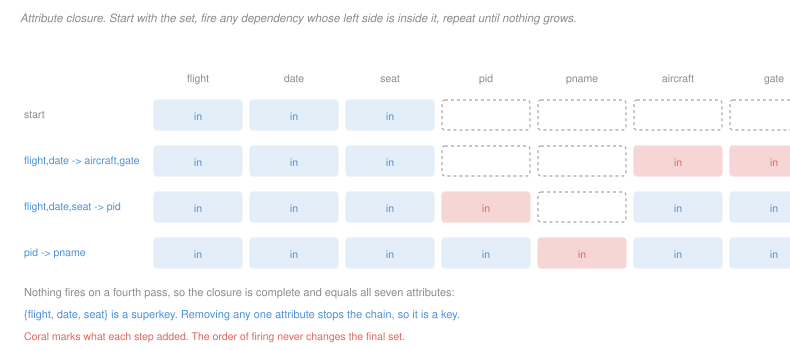

# Database Systems · Lesson 2.3: Functional dependencies, closure & keys

> ⏱ ~15 min · Module 2: Database design & normalization · Builds on: [2.2 (ER to schema)](02-02-from-er-to-relational-schema.md), [1.1 (the relational model)](01-01-the-relational-model.md) · Unlocks: [2.4 (normal forms)](02-04-anomalies-and-the-normal-forms.md)

## Why this matters

[1.1](01-01-the-relational-model.md) defined a key and then found one by hand, testing subsets and hunting counterexamples. That works for four attributes and is hopeless for twenty. This lesson replaces the hunt with an algorithm.

The algorithm — **attribute closure** — takes about three lines and answers essentially every question Module 2 asks. Is this set a key? Does this dependency follow from those? Is this table in BCNF? Is this decomposition lossless? All of them reduce to computing $X^+$, which makes it the single highest-leverage procedure in the course. It is worth being able to run it on paper without thinking.

## The idea

A **functional dependency** $X \to Y$ says: any two rows agreeing on $X$ agree on $Y$. Knowing $X$ pins down $Y$.

This generalizes the key. A key is the case where $X$ determines *everything*; a functional dependency is the case where it determines *something*. Once you have the general notion, "find the keys" becomes a computation over dependencies rather than an act of judgement about the domain.

Where dependencies come from is worth being clear about. They are **assertions about the world**, exactly as keys are ([1.1](01-01-the-relational-model.md)) — "each passenger has one name," "each flight on a date uses one aircraft." You cannot read them off an instance. An instance can *refute* one, by exhibiting two rows that agree on $X$ and differ on $Y$; it can never establish one.

The closure algorithm is then a fixpoint computation. Start with the attributes you know. Repeatedly, if you know everything on some dependency's left side, add its right side. Stop when nothing grows. What you end up holding is everything those attributes determine.

## The formal version

> **Functional dependency.** For $X, Y \subseteq R$, the dependency $X \to Y$ holds if for every legal instance $r$ and every pair $t_1, t_2 \in r$:
> $$t_1[X] = t_2[X] \implies t_1[Y] = t_2[Y].$$

A dependency is **trivial** when $Y \subseteq X$, which holds for any relation and carries no information.

> **Armstrong's axioms.** These three rules are sound and complete — everything they derive holds, and everything that holds they derive.
>
> - **Reflexivity:** if $Y \subseteq X$ then $X \to Y$.
> - **Augmentation:** if $X \to Y$ then $XZ \to YZ$ for any $Z$.
> - **Transitivity:** if $X \to Y$ and $Y \to Z$ then $X \to Z$.

Three convenient consequences follow and are what you actually use: **union** ($X \to Y$ and $X \to Z$ give $X \to YZ$), **decomposition** ($X \to YZ$ gives $X \to Y$), and **pseudotransitivity** ($X \to Y$ and $WY \to Z$ give $WX \to Z$).

Completeness is the reason closure is trustworthy: if a dependency does not turn up in the closure, it genuinely does not follow.

> **Attribute closure.** Given a set of dependencies $F$ and attributes $X$, the closure $X^+$ is the largest set with $X \to X^+$ derivable from $F$:
>
> ```
> X+ := X
> repeat until no change:
>     for each (V -> W) in F:
>         if V is a subset of X+:  X+ := X+ union W
> ```

In words: keep everything you can reach. Two facts make it usable:

$$X \to Y \text{ follows from } F \iff Y \subseteq X^+ \qquad\text{and}\qquad X \text{ is a superkey} \iff X^+ = R.$$

The first turns "does this dependency hold" into a set-containment check. The second turns "is this a key" into the same.

> **Finding candidate keys.** $X$ is a candidate key if $X^+ = R$ and $(X - \{A\})^+ \neq R$ for every $A \in X$.

Brute force over all subsets is $2^{|R|}$, but two observations usually collapse it:

| an attribute appearing… | must be… |
|---|---|
| only on left sides, or in no dependency at all | in **every** candidate key |
| only on right sides | in **no** candidate key |
| on both sides | decided case by case |

Compute the closure of the must-be-in set first. **If it already equals $R$, it is the unique candidate key and you are done** — no search at all.

## Picture



Each row fires one dependency. The order does not matter — the fixpoint is unique — but the trace is easier to check when you fire them one at a time.

## Worked examples

**Example 1 — the flight table, computed rather than guessed.**

A denormalized booking table records everything about a seat on a departure:

$$R(\text{flight},\ \text{date},\ \text{seat},\ \text{pid},\ \text{pname},\ \text{aircraft},\ \text{gate})$$

with three dependencies asserted by the business:

$$F_1: \text{flight}, \text{date} \to \text{aircraft}, \text{gate} \qquad F_2: \text{flight}, \text{date}, \text{seat} \to \text{pid} \qquad F_3: \text{pid} \to \text{pname}$$

In words: a flight on a date has one aircraft and one gate; a seat on that departure holds one passenger; a passenger has one name.

**Find the candidate keys using the shortcut.** Which attributes appear only on left sides? `flight`, `date` and `seat` — none of them is ever determined by anything. So all three are in every candidate key. Which appear only on right sides? `aircraft`, `gate`, `pname`, so none of them is in any key. `pid` appears on both and is undecided.

Compute the closure of the must-have set, following the figure:

| step | fires | $X^+$ |
|---|---|---|
| start | — | flight, date, seat |
| 1 | $F_1$ | + aircraft, gate |
| 2 | $F_2$ | + pid |
| 3 | $F_3$ | + pname |

All seven. So $\{\text{flight}, \text{date}, \text{seat}\}$ is a superkey, and since every one of its attributes must be in every candidate key, it is **the unique candidate key**. The undecided attribute `pid` never needed deciding.

Minimality comes free here, but it is worth seeing why: drop `seat` and $F_2$ cannot fire, so `pid` and `pname` are unreachable; drop `flight` or `date` and nothing fires at all.

**Example 2 — a relation with four candidate keys.**

$$R(A, B, C, D, E) \qquad A \to BC, \quad CD \to E, \quad B \to D, \quad E \to A$$

Here the shortcut does not help: every attribute appears on both sides, so nothing is forced in or out and the search is real.

Compute closures of the singletons first, since a single-attribute key is the best case:

| $X$ | $X^+$ | key? |
|---|---|---|
| $A$ | $A \to BC$ gives $ABC$; $B \to D$ gives $ABCD$; $CD \to E$ gives all | **yes** |
| $B$ | $B \to D$ gives $BD$, then nothing fires | no |
| $C$ | $C$ | no |
| $D$ | $D$ | no |
| $E$ | $E \to A$ gives $AE$, then $A$'s chain gives all | **yes** |

So $\{A\}$ and $\{E\}$ are candidate keys. Now pairs, and only those not containing $A$ or $E$ — any set containing a key is a superkey but not minimal, so those are already excluded. The candidates are $BC$, $BD$, $CD$:

| $X$ | $X^+$ | key? |
|---|---|---|
| $BC$ | $B \to D$ gives $BCD$; $CD \to E$ gives $BCDE$; $E \to A$ gives all | **yes** |
| $BD$ | $BD$, nothing new | no |
| $CD$ | $CD \to E$ gives $CDE$; $E \to A$ gives $ACDE$; $A \to BC$ gives all | **yes** |

Triples need not be checked: any triple over $\{B,C,D\}$ is $BCD$, which contains $BC$ and so is not minimal.

**Four candidate keys: $\{A\}$, $\{E\}$, $\{BC\}$, $\{CD\}$.**

Notice what this makes true. The union of the keys is $\{A, B, C, D, E\}$ — **every attribute is prime**. That fact alone settles the normal-form question in [2.4](02-04-anomalies-and-the-normal-forms.md) before any test is run, since third normal form's escape clause is that the right side is prime, and here it always is. The relation is in 3NF and, because $B \to D$ has a left side that is not a superkey, not in BCNF.

## Watch out

- **You might think a dependency can be read off the data.** It cannot, for the same reason a key cannot ([1.1](01-01-the-relational-model.md)). Two rows agreeing on $X$ and differing on $Y$ *refute* $X \to Y$; a million rows that happen to agree establish nothing.
- **You might think closure depends on the order you fire the dependencies.** It does not — the result is a unique fixpoint, because adding attributes can only enable more dependencies, never disable one. Firing in a different order changes the trace and not the answer.
- **You might think $X \to Y$ and $X \to Z$ let you conclude $Y \to Z$.** They do not. Both a flight's gate and its aircraft are determined by the flight and date, and neither determines the other — two 737s sit at different gates and one gate sees many aircraft.
- **You might think a relation has one candidate key.** Four is not unusual, and overlapping keys are exactly the case that makes the normal-form definitions in [2.4](02-04-anomalies-and-the-normal-forms.md) subtle rather than obvious.

## One-liner

> Attribute closure answers "is this a key," "does this dependency follow," and "is this decomposition lossless" with the same three-line loop — learn to run it on paper and the rest of Module 2 is bookkeeping.

## Problems

**P1 (🟢)** For $R(A,B,C,D)$ with $F = \{A \to B,\ B \to C,\ C \to D\}$, give each closure as an explicit set.

(a) $\{A\}^+$
(b) $\{B\}^+$
(c) $\{C, A\}^+$
(d) Name the unique candidate key, and state the shortcut that identifies it without any search.

**P2 (🟡)** A hospital table is $R(\text{patient}, \text{ward}, \text{bed}, \text{consultant}, \text{specialty})$ with

$$G_1: \text{ward}, \text{bed} \to \text{patient} \qquad G_2: \text{patient} \to \text{ward}, \text{bed} \qquad G_3: \text{patient} \to \text{consultant} \qquad G_4: \text{consultant} \to \text{specialty}$$

(a) Compute $\{\text{patient}\}^+$, showing which dependency fires at each step.
(b) Compute $\{\text{ward}, \text{bed}\}^+$.
(c) Give every candidate key, and justify that your list is complete.
(d) State whether $\text{ward}, \text{bed} \to \text{specialty}$ follows from $G$, and give the reason in terms of a closure.

**P3 (🔴, optional)** $R(A,B,C,D,E,H)$ with $F = \{A \to BC,\ CD \to E,\ E \to C,\ D \to AEH,\ ABH \to BD,\ DH \to BC\}$.

(a) Compute $\{D\}^+$ and state whether $\{D\}$ is a candidate key.
(b) Compute $\{E\}^+$ and $\{A, D\}^+$.
(c) Give every candidate key of $R$. State the shortcut you used to bound the search, and how many subsets you actually had to test.
(d) State whether $A \to D$ follows from $F$. If it does, give the derivation; if not, describe a two-row instance satisfying every dependency in $F$ and violating $A \to D$.

<details>
<summary>Solutions</summary>

**P1**

(a) $\{A\}^+ = \{A, B, C, D\}$. Chain: $A \to B$ adds $B$, then $B \to C$ adds $C$, then $C \to D$ adds $D$.

(b) $\{B\}^+ = \{B, C, D\}$. $A$ is never added — nothing determines it.

(c) $\{C, A\}^+ = \{A, B, C, D\}$. Adding $C$ to $A$ changes nothing, since $A$ already reached everything.

(d) **$\{A\}$**, and the shortcut is the appearance test: $A$ appears only on left sides, so it must be in every candidate key. $\{A\}^+ = R$ from (a), so $\{A\}$ is already a superkey, and a superkey every one of whose attributes is forced is the unique candidate key. Zero subsets tested beyond the one closure.

**P2**

(a) $\{\text{patient}\}^+$:

| step | fires | set |
|---|---|---|
| start | — | patient |
| 1 | $G_2$ | + ward, bed |
| 2 | $G_3$ | + consultant |
| 3 | $G_4$ | + specialty |

$\{\text{patient}\}^+ = R$, all five attributes.

(b) $\{\text{ward}, \text{bed}\}^+$: $G_1$ adds `patient`, and from there the chain of (a) runs to completion. $\{\text{ward}, \text{bed}\}^+ = R$.

(c) **Two candidate keys: $\{\text{patient}\}$ and $\{\text{ward}, \text{bed}\}$.**

Completeness argument. `consultant` and `specialty` appear only on right sides, so neither is in any candidate key — that removes every subset containing them. What remains are subsets of $\{\text{patient}, \text{ward}, \text{bed}\}$. Of the singletons, `patient` is a key by (a), while $\{\text{ward}\}^+ = \{\text{ward}\}$ and $\{\text{bed}\}^+ = \{\text{bed}\}$, since no dependency has a left side inside either. Of the pairs, $\{\text{ward}, \text{bed}\}$ is a key by (b), and the other two pairs contain `patient` and so are supersets of a key, hence not minimal. The one triple likewise contains `patient`. Every subset is accounted for.

This is the two-overlapping-keys shape from [2.2](02-02-from-er-to-relational-schema.md), here in its cleanest form: the two keys are disjoint, because a bed and a patient identify each other.

(d) **Yes, it follows.** By (b), $\{\text{ward}, \text{bed}\}^+ = R$, and `specialty` $\in R$, so the containment test $Y \subseteq X^+$ is satisfied. Concretely the derivation is $G_1$, then $G_3$, then $G_4$ by transitivity: the bed gives the patient, the patient gives the consultant, the consultant gives the specialty.

Note this is *derived*, not asserted. The business never said a bed determines a specialty, and it is true only as a consequence of three separate rules — which means it stops being true the moment any one of them is relaxed, for instance by letting a patient have two consultants.

**P3**

(a) $\{D\}^+$:

| step | fires | set |
|---|---|---|
| start | — | $D$ |
| 1 | $D \to AEH$ | $+A, E, H$ |
| 2 | $A \to BC$ | $+B, C$ |

$\{D\}^+ = \{A,B,C,D,E,H\} = R$, so **$\{D\}$ is a candidate key** — a superkey, and minimal because it is a single attribute.

(b) $\{E\}^+ = \{E, C\}$. Only $E \to C$ fires, and $C$ alone enables nothing ($CD \to E$ needs $D$).

$\{A, D\}^+ = R$, since $\{D\}^+$ is already $R$. It is a superkey but **not** a candidate key, since the proper subset $\{D\}$ is one.

(c) **Two candidate keys: $\{D\}$ and $\{A, H\}$.**

The shortcut first, honestly applied: every one of the six attributes appears on both a left and a right side somewhere in $F$, so nothing is forced into or out of the keys and the appearance test buys nothing here. The search is real.

What does bound it is (a). Since $\{D\}$ is already a candidate key, no set containing $D$ can be another one, so every remaining candidate is a subset of $\{A, B, C, E, H\}$. From (b), $\{E\}^+ = \{C, E\}$; the other singletons close to $\{A\}^+ = \{A,B,C\}$, $\{B\}^+ = \{B\}$, $\{C\}^+ = \{C\}$, $\{H\}^+ = \{H\}$. None reaches $R$.

Among the pairs, the only dependency that can produce $D$ is $ABH \to BD$, so a key must be able to reach $A$, $B$ and $H$. Starting from $\{A, H\}$: $A \to BC$ supplies $B$ and $C$, so $ABH$ is in hand, $ABH \to BD$ fires and adds $D$, and $D \to AEH$ then completes the set. $\{A, H\}^+ = R$.

Minimality: $\{A\}^+ = \{A,B,C\}$ and $\{H\}^+ = \{H\}$, neither of which is $R$, so both attributes are needed.

Every other pair fails — $\{B,H\}^+ = \{B,H\}$, $\{A,B\}^+ = \{A,B,C\}$ — and any larger subset of $\{A,B,C,E,H\}$ contains $\{A,H\}$ and so is not minimal.

Subsets tested: six singletons and a handful of pairs, roughly a dozen closures against $2^6 = 64$ for brute force.

Worth noting that $\{A, B, H\}$ is a superkey and *not* a candidate key: $A$ already determines $B$, so including $B$ is waste. Reaching for the literal left side of a dependency is the standard way to overshoot a key by one attribute.

(d) **No, $A \to D$ does not follow.**

$\{A\}^+ = \{A, B, C\}$: $A \to BC$ fires and then nothing else can. $CD \to E$ needs $D$; $E \to C$ needs $E$; $D \to AEH$ needs $D$; $ABH \to BD$ needs $H$; $DH \to BC$ needs both. Since $D \notin \{A\}^+$, the containment test fails, and by the **completeness** of Armstrong's axioms a dependency absent from the closure is genuinely underivable — so a witnessing instance must exist.

Here is one:

| A | B | C | D | E | H |
|---|---|---|---|---|---|
| 1 | 1 | 1 | 1 | 1 | 1 |
| 1 | 1 | 1 | 2 | 2 | 2 |

The rows agree on $A$ and differ on $D$, violating $A \to D$. Every dependency in $F$ survives: $A \to BC$ holds because the rows agree on $B$ and $C$; each of $CD \to E$, $E \to C$, $D \to AEH$, $ABH \to BD$ and $DH \to BC$ holds vacuously, because the two rows differ somewhere in its left side.

**The general recipe for such a witness:** make the two rows agree on exactly $X^+$ and differ everywhere else. Any dependency whose left side lies inside $X^+$ has its right side inside $X^+$ too — that is what closure means — so both rows agree there and it is satisfied. Any other dependency has a left side reaching outside $X^+$, where the rows differ, so it is satisfied vacuously. The construction works for any $X$ and any $F$, which is the constructive half of the completeness theorem.

</details>

## Flashback

**From Lesson 1.6 (SQL IV — subqueries, `EXISTS` & views):** A `certification(engineer_id, standard)` table records which standards each engineer is certified against, and `mandatory(standard)` lists the three standards a site requires.

(a) Write the query returning the engineers certified against every mandatory standard.
(b) An engineer holds all three mandatory standards plus two others. State whether she is returned, and why.
(c) Someone rewrites the query using `NOT IN` on `mandatory.standard`, and it returns nothing even though the data is unchanged. Give the most likely cause.

<details>
<summary>Solution</summary>

(a)

```sql
SELECT DISTINCT c.engineer_id
FROM   certification c
WHERE  NOT EXISTS (
         SELECT 1 FROM mandatory m
         WHERE  NOT EXISTS (
                  SELECT 1 FROM certification c2
                  WHERE  c2.engineer_id = c.engineer_id
                    AND  c2.standard = m.standard
                )
       );
```

The outer `NOT EXISTS` is "there is no", the middle query ranges over the mandatory standards, and the inner `NOT EXISTS` is "that she lacks."

(b) **Yes, she is returned.** The middle query ranges only over the three mandatory standards; her two extra certifications are never examined. Division asks for *at least* the required set, not exactly it.

(c) **A NULL in the `mandatory.standard` column.** One NULL anywhere in a `NOT IN` list makes the predicate unknown for every row, so the query returns nothing regardless of the data — and it does so silently, with no error and no empty-table symptom to point at.

The diagnosis is quick: `SELECT COUNT(*) FROM mandatory WHERE standard IS NULL`. The repair is either to add `WHERE standard IS NOT NULL` to the subquery or to use the `NOT EXISTS` form above, which is immune because a NULL row simply fails the equality rather than contaminating the whole predicate.

</details>

## Connections

- **Backward:** a candidate key from [1.1](01-01-the-relational-model.md) is the special case $X^+ = R$, and the drop-tests done by hand there are now the minimality check. The second key of `Books` in [2.2](02-02-from-er-to-relational-schema.md), noticed by inspection, is what Example 2's procedure would have found mechanically.
- **Forward:** [2.4](02-04-anomalies-and-the-normal-forms.md) defines every normal form in terms of "is the left side a superkey" and "is the right side prime," both of which are closure computations. [2.5](02-05-decomposition-lossless-join-and-dependency-preservation.md) tests losslessness with one more closure, and [2.6](02-06-minimal-cover-and-3nf-synthesis.md) uses closure to strip redundancy from the dependency set itself.
- **Sideways:** the closure loop is a least-fixpoint computation, the same shape as reachability in a graph — treat each dependency as an edge from its left side to its right and $X^+$ is the set reachable from $X$. Armstrong's axioms are a proof system with soundness and completeness in the sense of [`discrete-mathematics` 1.3](../../discrete-mathematics/lessons/01-03-proof-techniques.md), and completeness is exactly what licenses the counterexample construction in P3(d).
