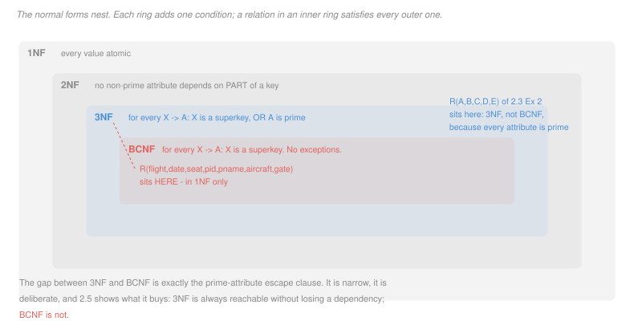

# Database Systems · Lesson 2.4: Anomalies and the normal forms

> ⏱ ~15 min · Module 2: Database design & normalization · Builds on: [2.3 (functional dependencies)](02-03-functional-dependencies-closure-and-keys.md) · Unlocks: [2.5 (decomposition)](02-05-decomposition-lossless-join-and-dependency-preservation.md)

## Why this matters

"Good schema design" sounds like taste. Normal forms make it a **decidable property** of a relation and its dependencies, checkable by an algorithm you already have.

The underlying claim is worth stating plainly, because everything else is machinery serving it: **storing the same fact twice is a bug waiting to happen.** Two copies can disagree, and a database that holds contradictory facts is worse than one missing them. Normal forms are the precise statement of "no fact is stored twice," and the anomalies are the failure modes that redundancy makes possible.

## The idea

Take the denormalized booking table from [2.3](02-03-functional-dependencies-closure-and-keys.md), holding a row per seat on a departure:

| flight | date | seat | pid | pname | aircraft | gate |
|---|---|---|---|---|---|---|
| BA117 | 2024-03-04 | 12A | P7 | Okonjo | G-EUPT | 23 |
| BA117 | 2024-03-04 | 12B | P9 | Reyes | G-EUPT | 23 |
| BA117 | 2024-03-05 | 12A | P7 | Okonjo | G-EUPT | 11 |
| BA204 | 2024-03-04 | 3C | P7 | Okonjo | G-ZBKA | 5 |

The gate for BA117 on the 4th is stored twice. Passenger P7's name is stored three times. Neither repetition carries information — the second copy is fully determined by the first — and each one is a chance to disagree. Three named failure modes follow:

**Update anomaly.** The gate for BA117 on the 4th changes to 25. Two rows must change. Change one and the database now asserts two different gates for one departure, and no constraint catches it.

**Insertion anomaly.** BA117 on the 6th is assigned aircraft G-EUPT at gate 9. You cannot record it. `seat` is part of the primary key, so it cannot be NULL, and no seat has been booked — the fact has nowhere to live until a passenger appears.

**Deletion anomaly.** The single booking on BA117 for the 5th is cancelled. Deleting that row also deletes the fact that the departure used gate 11. Two independent facts were sharing a row, so removing one removed both.

Every anomaly has the same cause: **a fact about one thing is stored in a row keyed by another thing.** The gate is a fact about a departure, stored in a row keyed by a seat. The normal forms are the systematic detection of that mismatch.

## The formal version

An attribute is **prime** if it belongs to *some* candidate key, and **non-prime** otherwise. All four definitions below use that word, and computing it means finding every candidate key first ([2.3](02-03-functional-dependencies-closure-and-keys.md)).

> **First normal form (1NF).** Every attribute value is atomic — no lists, no repeating groups, no nested tables.

A faithful ER translation gives this for free ([2.2](02-02-from-er-to-relational-schema.md)), since rules R7 and R8 translate away the two constructs that could violate it.

> **Second normal form (2NF).** In 1NF, and no non-prime attribute is functionally dependent on a *proper subset* of a candidate key.

In words: nothing that is not part of a key may be determined by part of a key. Such a dependency is called **partial**. Note that 2NF is vacuous when every candidate key is a single attribute — a single attribute has no proper non-empty subsets — which is why it is often skipped in practice.

> **Third normal form (3NF).** In 1NF, and for every non-trivial dependency $X \to A$ with $A$ a single attribute, **either** $X$ is a superkey **or** $A$ is prime.

The second clause is the **escape hatch**, and the whole difference between 3NF and BCNF lives in it. Its purpose is revealed in [2.5](02-05-decomposition-lossless-join-and-dependency-preservation.md): without it, some relations cannot be decomposed without losing a dependency.

> **Boyce–Codd normal form (BCNF).** For every non-trivial dependency $X \to Y$, $X$ is a superkey.

In words: the only thing allowed to determine anything is a key. No exceptions, no escape hatch. This is the form that actually says "every fact is stored where it belongs," and it is the one to aim for.

The forms nest: $\text{BCNF} \subset \text{3NF} \subset \text{2NF} \subset \text{1NF}$. Each inclusion is strict, so being in BCNF implies being in all the others, and finding the highest form a relation satisfies means testing downward until one passes.

**The procedure**, which is entirely closure computations:

1. Find all candidate keys; take their union to get the prime attributes.
2. For each dependency $X \to A$, check whether $X^+ = R$ (is $X$ a superkey?).
3. If every one passes, the relation is in BCNF.
4. Otherwise, for each failing dependency, check whether $A$ is prime. If all failures escape that way, the relation is in 3NF.
5. Otherwise, check whether any failing $X$ is a proper subset of a candidate key with $A$ non-prime. If so, 2NF fails and the relation is in 1NF only.

## Picture

The rings nest, so a relation's "normal form" is the innermost ring it reaches. The annotation on each ring is the entire test.

## Worked examples

**Example 1 — classifying the booking table.**

$$R(\text{flight}, \text{date}, \text{seat}, \text{pid}, \text{pname}, \text{aircraft}, \text{gate})$$
$$F_1: \text{flight}, \text{date} \to \text{aircraft}, \text{gate} \qquad F_2: \text{flight}, \text{date}, \text{seat} \to \text{pid} \qquad F_3: \text{pid} \to \text{pname}$$

**Step 1.** [2.3](02-03-functional-dependencies-closure-and-keys.md) established the unique candidate key $\{\text{flight}, \text{date}, \text{seat}\}$, so those three attributes are prime and `pid`, `pname`, `aircraft`, `gate` are non-prime.

**Step 2 — BCNF.** Test each left side:

| dependency | $X^+$ | superkey? |
|---|---|---|
| $F_1$: flight, date | flight, date, aircraft, gate | **no** |
| $F_2$: flight, date, seat | everything | yes |
| $F_3$: pid | pid, pname | **no** |

Two violations, so not in BCNF.

**Step 3 — 3NF.** Both violations must escape via a prime right side. $F_1$ determines `aircraft` and `gate`, both non-prime. No escape. **Not in 3NF.**

**Step 4 — 2NF.** Is any failing left side a proper subset of a candidate key, with a non-prime right side? $\{\text{flight}, \text{date}\}$ is a proper subset of the key $\{\text{flight}, \text{date}, \text{seat}\}$, and `gate` is non-prime. That is a **partial dependency**. **Not in 2NF.**

**The booking table is in 1NF only** — every value is atomic, and nothing more.

Now read the anomalies off the violations, which is the payoff of doing the classification at all:

- $F_1$ is the **partial** dependency, and it produces the gate anomalies. The gate depends on part of the key, so it is repeated once per seat on the departure.
- $F_3$ is a **transitive** dependency — the key determines `pid`, which determines `pname` — and it produces the name anomalies. The name is repeated once per booking the passenger holds.

Each violation names a fact stored in the wrong place, and [2.5](02-05-decomposition-lossless-join-and-dependency-preservation.md) moves each to a table keyed by what it actually depends on.

**Example 2 — 3NF but not BCNF, and why the gap exists.**

$$R(A,B,C,D,E) \qquad A \to BC, \quad CD \to E, \quad B \to D, \quad E \to A$$

From [2.3](02-03-functional-dependencies-closure-and-keys.md), the candidate keys are $\{A\}$, $\{E\}$, $\{BC\}$, $\{CD\}$. Their union is all five attributes, so **every attribute is prime**.

**BCNF test.** $\{B\}^+ = \{B, D\} \neq R$, so $B \to D$ has a non-superkey left side. Not in BCNF.

**3NF test.** The right side is $D$, which is prime — it is in the candidate key $\{CD\}$. The escape hatch applies. Checking the other dependencies the same way: $A$ and $E$ are superkeys, and $CD$ is a superkey, so $B \to D$ is the only failure and it escapes. **In 3NF.**

**Is there redundancy?** Yes, a little. $B \to D$ means every row with a given $B$ repeats the same $D$, so that pair is stored once per occurrence. The 3NF escape hatch does not deny the redundancy; it tolerates it, for a reason [2.5](02-05-decomposition-lossless-join-and-dependency-preservation.md) makes precise. Decomposing to remove it would put $B$ and $D$ in a table of their own, and the dependency $CD \to E$ — whose left side spans the split — could then no longer be checked on any single table.

**So 3NF is a bargain, not an ideal.** It accepts bounded redundancy in exchange for keeping every dependency locally enforceable. BCNF refuses the redundancy and sometimes pays with a dependency it can no longer check. Knowing which you are buying is the point of the distinction, and it is the whole subject of the next two lessons.

## Watch out

- **You might think "prime" means "in the primary key."** It means "in *some* candidate key." A relation with four candidate keys can have every attribute prime, as Example 2 does, which makes its 3NF test pass automatically.
- **You might think 2NF is worth testing separately.** It is vacuous whenever every candidate key is a single attribute, since a single attribute has no proper non-empty subset. It is a historical stepping stone; in practice you test BCNF, then 3NF, and mention 2NF only to name the partial dependency.
- **You might think higher normal form is always better.** It is not free. BCNF can cost you a dependency the database could otherwise enforce, and a heavily decomposed schema needs more joins to answer the same question. Deliberate denormalization is a real technique with real users.
- **You might think an instance can show a relation is in BCNF.** It can only refute — the same asymmetry as keys and dependencies. Normal form is a property of the schema plus its asserted dependencies, and no amount of data establishes it.

## One-liner

> Every anomaly is one fact stored in a row keyed by a different thing, and the normal forms are the systematic test for that mismatch — with 3NF's prime-attribute escape hatch the one deliberate exception.

## Problems

**P1 (🟢)** $R(\text{sid}, \text{course}, \text{grade}, \text{instructor})$ with $\{\text{sid}, \text{course}\} \to \text{grade}$ and $\text{course} \to \text{instructor}$.

(a) Give the candidate key.
(b) List the prime and the non-prime attributes.
(c) Name the highest normal form $R$ satisfies, and give the dependency that blocks the next one.
(d) Give a concrete insertion anomaly, in one sentence naming the fact that cannot be recorded.

**P2 (🟡)** $R(\text{isbn}, \text{title}, \text{author}, \text{author\_dob}, \text{publisher}, \text{pub\_city})$, where a book has one author, an author one date of birth, a book one publisher, and a publisher one city.

(a) Write the dependency set.
(b) Give the candidate key, and state which shortcut from [2.3](02-03-functional-dependencies-closure-and-keys.md) finds it with no search.
(c) Name the highest normal form, and classify each violating dependency as **partial** or **transitive**.
(d) Give a two-row instance exhibiting an update anomaly, state which single-cell edit creates a contradiction, and name the fact the database then asserts twice with different values.

**P3 (🔴, optional)** $R(A, B, C, D)$ with $F = \{AB \to C,\ C \to D,\ D \to A\}$.

(a) Give every candidate key.
(b) List the prime and non-prime attributes.
(c) Determine the highest normal form, testing BCNF then 3NF then 2NF in that order and showing each test.
(d) The escape clause is doing real work in (c). State precisely which dependency uses it, and construct a four-row instance of $R$ satisfying all of $F$ in which the redundancy that 3NF tolerates is visible — pointing at the two cells that store the same fact twice.

Solutions

**P1**

(a) **$\{\text{sid}, \text{course}\}$.** Its closure adds `grade` by the first dependency and `instructor` by the second, reaching all four. Neither attribute alone works: $\{\text{sid}\}^+ = \{\text{sid}\}$, and $\{\text{course}\}^+ = \{\text{course}, \text{instructor}\}$.

(b) **Prime:** `sid`, `course`. **Non-prime:** `grade`, `instructor`.

(c) **2NF is violated**, so the highest form is **1NF**. The blocking dependency is $\text{course} \to \text{instructor}$: its left side is a proper subset of the candidate key and `instructor` is non-prime, which is the definition of a partial dependency.

(d) **The fact that a course has a given instructor cannot be recorded until at least one student enrols in it.** `sid` is part of the primary key and so cannot be NULL, and no student has enrolled — so a newly staffed course has nowhere to store its instructor.

**P2**

(a)

$$\text{isbn} \to \text{title}, \text{author}, \text{publisher} \qquad \text{author} \to \text{author\_dob} \qquad \text{publisher} \to \text{pub\_city}$$

(b) **$\{\text{isbn}\}$.** The shortcut: `isbn` appears only on left sides and never on a right side, so it must be in every candidate key; its closure is all six attributes, so it is already a superkey, and a superkey all of whose attributes are forced is the unique candidate key. One closure, no search.

(c) **2NF.** Every candidate key is a single attribute, so 2NF holds vacuously — there are no proper non-empty subsets of the key for a partial dependency to hang on. The failure is at 3NF.

| dependency | left side a superkey? | right side prime? | classification |
|---|---|---|---|
| $\text{isbn} \to \ldots$ | yes | — | fine |
| $\text{author} \to \text{author\_dob}$ | no, $\{\text{author}\}^+ = \{\text{author}, \text{author\_dob}\}$ | no | **transitive** |
| $\text{publisher} \to \text{pub\_city}$ | no | no | **transitive** |

Both violations are transitive: the key determines `author`, which determines `author_dob`; likewise for the publisher chain. Neither is partial, since the key has no proper subset to be partial on.

(d)

| isbn | title | author | author_dob | publisher | pub_city |
|---|---|---|---|---|---|
| 978-1 | Tidewater | Okonjo | 1971-04-02 | Ravenwood | Leeds |
| 978-2 | Nine Gates | Okonjo | 1971-04-02 | Holloway | Bristol |

**The edit:** change `author_dob` in row 1 to `1971-04-03`, correcting what looked like a typo, and leave row 2 alone.

**The fact asserted twice with different values:** Okonjo's date of birth. The database now says it is both the 2nd and the 3rd of April 1971. Nothing in the schema can detect this — no key is violated, no foreign key dangles, and both rows are individually plausible. The contradiction is discoverable only by a query that groups by author and looks for more than one distinct date, which is a check nobody runs until something has already gone wrong.

That is the general character of an update anomaly: it produces not an error but a lie.

**P3**

(a) Compute the singleton closures: $\{A\}^+ = \{A\}$, $\{B\}^+ = \{B\}$, $\{C\}^+ = \{C, D, A\}$, $\{D\}^+ = \{D, A\}$. None reaches $R$, since $B$ appears on no right side and so can only be in the closure of a set that already contains it.

That last observation is the shortcut: **$B$ appears only on left sides, so it is in every candidate key.** Test the pairs containing $B$:

| $X$ | $X^+$ | key? |
|---|---|---|
| $AB$ | $AB \to C$ gives $ABC$; $C \to D$ gives all | **yes** |
| $BC$ | $C \to D$ gives $BCD$; $D \to A$ gives all | **yes** |
| $BD$ | $D \to A$ gives $ABD$; $AB \to C$ gives all | **yes** |

**Three candidate keys: $\{A,B\}$, $\{B,C\}$, $\{B,D\}$.** No triple can be minimal, since each contains one of these.

(b) The union of the keys is $\{A, B, C, D\}$, so **every attribute is prime** and there are **no non-prime attributes**.

(c)

**BCNF.** Test each left side against $X^+ = R$:

| dependency | $X^+$ | superkey? |
|---|---|---|
| $AB \to C$ | $R$ | yes |
| $C \to D$ | $\{A, C, D\}$ | **no** |
| $D \to A$ | $\{A, D\}$ | **no** |

Two violations, so **not in BCNF**.

**3NF.** Each violation needs a prime right side. $C \to D$: is $D$ prime? Yes, it is in $\{B,D\}$. $D \to A$: is $A$ prime? Yes, it is in $\{A,B\}$. Both escape. **In 3NF.**

**2NF** is implied by 3NF and holds; it is also vacuous in the relevant sense, since there are no non-prime attributes for a partial dependency to act on.

**Highest normal form: 3NF.**

(d) **Both** $C \to D$ and $D \to A$ use the escape clause — each has a non-superkey left side and survives only because its right side is prime. Since every attribute is prime here, the clause is doing all the work; without it the relation would be in 1NF only.

A four-row instance satisfying $F$:

| | A | B | C | D |
|---|---|---|---|---|
| $t_1$ | a1 | b1 | c1 | d1 |
| $t_2$ | a1 | b2 | c1 | d1 |
| $t_3$ | a1 | b3 | c1 | d1 |
| $t_4$ | a2 | b1 | c2 | d2 |

Check $F$ holds: $AB \to C$ — the four $AB$ pairs are (a1,b1), (a1,b2), (a1,b3), (a2,b1), all distinct, so it is satisfied. $C \to D$ — every row with $c1$ has $d1$, and $c2$ has $d2$. $D \to A$ — every row with $d1$ has $a1$, and $d2$ has $a2$.

**The redundancy:** rows $t_1$, $t_2$ and $t_3$ all store the pair $(c1, d1)$. The fact "$c1$ determines $d1$" is recorded three times. Point at the $D$ cells of $t_2$ and $t_3$: both are fully determined by their row's $C$ value and carry no information the schema does not already imply.

The consequence is the update anomaly in miniature. Correcting $c1$'s partner from $d1$ to $d3$ requires editing three cells, and editing two of them leaves the relation asserting that $c1$ determines both $d1$ and $d3$ — a violation of a dependency the schema declared and the database cannot enforce, because enforcing it would mean checking a constraint across rows rather than within one.

**And this is exactly the redundancy BCNF would remove and 3NF deliberately keeps.** Splitting off a $(C, D)$ table would eliminate it — at the cost of $AB \to C$, whose left side would then span two tables and become uncheckable. The trade is quantified in [2.5](02-05-decomposition-lossless-join-and-dependency-preservation.md).

## Flashback

**From Lesson 2.3 (functional dependencies, closure & keys):** $R(P, Q, S, T)$ with $F = \{P \to Q,\ QS \to T,\ T \to P\}$.

(a) Compute $\{P\}^+$ and $\{T, S\}^+$.
(b) Give every candidate key.
(c) State whether $S \to T$ follows from $F$, with the closure that settles it.

Solution

(a) $\{P\}^+ = \{P, Q\}$. Only $P \to Q$ fires; $QS \to T$ needs $S$, and $T \to P$ needs $T$.

$\{T, S\}^+$: $T \to P$ adds $P$, giving $\{P, S, T\}$; $P \to Q$ adds $Q$, giving $\{P, Q, S, T\} = R$.

(b) $S$ appears only on left sides — it is never determined by anything — so **$S$ is in every candidate key**. Test the pairs containing $S$:

| $X$ | $X^+$ | key? |
|---|---|---|
| $PS$ | $P \to Q$ gives $PQS$; $QS \to T$ gives all | **yes** |
| $QS$ | $QS \to T$ gives $QST$; $T \to P$ gives all | **yes** |
| $ST$ | all, by (a) | **yes** |

$\{S\}$ alone closes to $\{S\}$, so it is not a key. Every triple contains one of the three pairs and so is not minimal.

**Three candidate keys: $\{P,S\}$, $\{Q,S\}$, $\{S,T\}$.**

(c) **No.** $\{S\}^+ = \{S\}$ — no dependency has a left side contained in $\{S\}$, so the closure never grows. Since $T \notin \{S\}^+$, the dependency does not follow.

The two-row witness, built by the recipe of agreeing on exactly $X^+$: put the rows equal on $S$ and different everywhere else.

| P | Q | S | T |
|---|---|---|---|
| p1 | q1 | s1 | t1 |
| p2 | q2 | s1 | t2 |

They agree on $S$ and differ on $T$, refuting $S \to T$; and each of $P \to Q$, $QS \to T$, $T \to P$ is satisfied because the two rows differ somewhere in its left side.

## Connections

- **Backward:** every test here is a closure from [2.3](02-03-functional-dependencies-closure-and-keys.md) — "is $X$ a superkey" is $X^+ = R$, and "is $A$ prime" needs all the candidate keys. 1NF is what the translation rules R7 and R8 of [2.2](02-02-from-er-to-relational-schema.md) guarantee, which is why a faithful diagram rarely produces a 1NF-only schema.
- **Forward:** [2.5](02-05-decomposition-lossless-join-and-dependency-preservation.md) takes each violation found here and splits it away, then checks that nothing was lost. [2.6](02-06-minimal-cover-and-3nf-synthesis.md) explains why 3NF's escape hatch exists by exhibiting the algorithm that needs it.
- **Sideways:** an update anomaly is a consistency failure that no single-row constraint can catch, which is the same shape as the invariant violations of [`operating-systems` 2.1](../../operating-systems/lessons/02-01-race-conditions-and-critical-sections.md) — two writers, one shared fact, and a window where the copies disagree. Normalization removes the second copy; a transaction ([4.1](04-01-transactions-and-the-acid-properties.md)) protects the window when a second copy is unavoidable.
