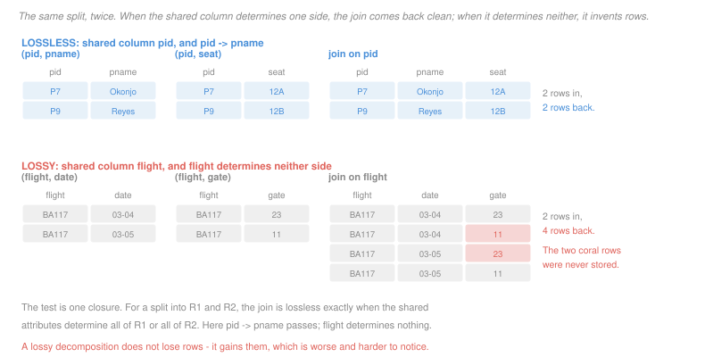

# Database Systems · Lesson 2.5: Decomposition — lossless join & dependency preservation

> ⏱ ~15 min · Module 2: Database design & normalization · Builds on: [2.4 (normal forms)](02-04-anomalies-and-the-normal-forms.md), [2.3 (functional dependencies)](02-03-functional-dependencies-closure-and-keys.md) · Unlocks: [2.6 (3NF synthesis)](02-06-minimal-cover-and-3nf-synthesis.md)

## Why this matters

[2.4](02-04-anomalies-and-the-normal-forms.md) found the violations. This lesson repairs them, and the repair is always the same move: split the offending dependency into a table of its own, so that its left side becomes that table's key.

Splitting is not automatically safe. A careless decomposition can make the original table unrecoverable — and it fails in the direction nobody expects. **A lossy decomposition does not lose rows; it gains them.** Joining the pieces back produces tuples that were never stored, so the damage shows up as plausible false data rather than as missing data or an error. That is why the losslessness test is not optional bookkeeping.

## The idea

Decomposing $R$ into $R_1$ and $R_2$ means each becomes a projection of $R$, and the intent is that $R_1 \bowtie R_2$ gives $R$ back. Whether it does depends entirely on **what the shared columns determine**.

Look at the figure. Both halves split a three-column table on a single shared column. In the top half the shared column is `pid`, and `pid` determines `pname`, so each pid appears once in the left table and the join is one-to-one: two rows in, two rows back. In the bottom half the shared column is `flight`, which determines neither the date nor the gate, so `BA117` appears twice on each side and the join produces $2 \times 2 = 4$ rows. Two of them are inventions.

That is the whole intuition, and the theorem is just its statement: **the join is lossless exactly when the shared attributes are a key of at least one of the two pieces.**

The second property is different in kind. A decomposition is **dependency-preserving** if every asserted dependency can still be checked on a single table. When one is not preserved, the database can no longer enforce it — checking would need a join, and no ordinary constraint spans tables. The dependency does not become false; it becomes *unenforceable*, which means violations enter silently.

## The formal version

> **Lossless-join decomposition.** $\{R_1, R_2\}$ decomposes $R$ losslessly with respect to $F$ if for every legal instance $r$ of $R$,
> $$\pi_{R_1}(r) \bowtie \pi_{R_2}(r) = r.$$

> **The binary test.** The decomposition of $R$ into $R_1$ and $R_2$ is lossless if and only if
> $$(R_1 \cap R_2) \to R_1 \quad\text{or}\quad (R_1 \cap R_2) \to R_2$$
> follows from $F$ — equivalently, $(R_1 \cap R_2)^+ \supseteq R_1$ or $(R_1 \cap R_2)^+ \supseteq R_2$.

In words: the shared columns must be a superkey of one of the pieces. One closure computation settles it. Note that $\pi_{R_1}(r) \bowtie \pi_{R_2}(r) \supseteq r$ always holds — every original row survives — so losslessness is entirely about the *extra* rows.

For a decomposition into more than two pieces the binary test does not directly apply, but the standard practice does: decompose one violation at a time, checking each binary split as you go. Losslessness composes, so a chain of lossless binary splits is lossless overall.

> **Dependency preservation.** Let $F_i$ be the dependencies of $F^+$ involving only attributes of $R_i$. The decomposition preserves $F$ if
> $$\left(\bigcup_i F_i\right)^+ = F^+.$$

In words: the pieces' local dependencies must together imply everything the original asserted. A dependency whose left and right sides end up in different tables is the danger case — though it may still be *implied* by others, so a split dependency is a reason to check, not a verdict.

> **The BCNF decomposition algorithm.**
>
> ```
> while some R_i has a violating X -> Y  (X not a superkey of R_i):
>     replace R_i with  (X union Y)  and  (R_i minus (Y minus X))
> ```

Each step is a binary split whose shared attributes are exactly $X$, and $X$ is a key of the piece $X \cup Y$ by construction — so **every step is lossless automatically**, and no separate check is needed. The algorithm always terminates and always reaches BCNF.

What it cannot promise is dependency preservation, and that is not a defect of the algorithm. Some relations have **no** BCNF decomposition that preserves every dependency, which is the theorem Example 2 demonstrates and the reason 3NF exists at all.

## Picture



The two coral rows in the lower join say that BA117 departed from gate 11 on the 4th and gate 23 on the 5th. Neither was ever stored.

## Worked examples

**Example 1 — decomposing the booking table to BCNF.**

$$R(\text{flight}, \text{date}, \text{seat}, \text{pid}, \text{pname}, \text{aircraft}, \text{gate})$$
$$F_1: \text{flight}, \text{date} \to \text{aircraft}, \text{gate} \qquad F_2: \text{flight}, \text{date}, \text{seat} \to \text{pid} \qquad F_3: \text{pid} \to \text{pname}$$

[2.4](02-04-anomalies-and-the-normal-forms.md) found two violations, $F_1$ and $F_3$. Take them one at a time.

**Split on $F_3$ ($\text{pid} \to \text{pname}$).** The rule gives $X \cup Y = \{\text{pid}, \text{pname}\}$ and $R$ minus $(Y - X) = R$ minus `pname`:

$$R_a(\text{pid}, \text{pname}) \qquad R_b(\text{flight}, \text{date}, \text{seat}, \text{pid}, \text{aircraft}, \text{gate})$$

Shared attributes: $\{\text{pid}\}$, whose closure is $\{\text{pid}, \text{pname}\} = R_a$. Lossless, as the construction guarantees.

**Split $R_b$ on $F_1$.** Now $X \cup Y = \{\text{flight}, \text{date}, \text{aircraft}, \text{gate}\}$ and the remainder is $R_b$ minus $\{\text{aircraft}, \text{gate}\}$:

$$R_c(\text{flight}, \text{date}, \text{aircraft}, \text{gate}) \qquad R_d(\text{flight}, \text{date}, \text{seat}, \text{pid})$$

Shared: $\{\text{flight}, \text{date}\}$, whose closure contains all of $R_c$. Lossless.

**The result, three tables:**

| table | key | holds |
|---|---|---|
| $R_a(\text{pid}, \text{pname})$ | pid | one row per passenger |
| $R_c(\text{flight}, \text{date}, \text{aircraft}, \text{gate})$ | flight, date | one row per departure |
| $R_d(\text{flight}, \text{date}, \text{seat}, \text{pid})$ | flight, date, seat | one row per booking |

Each is in BCNF: the only non-trivial dependency in each has the table's own key on its left. And every anomaly from [2.4](02-04-anomalies-and-the-normal-forms.md) is gone — the gate is stored once per departure, the name once per passenger, a departure can be recorded before anyone books it, and cancelling the last booking leaves $R_c$ untouched.

**Dependency preservation:** $F_1$ lives entirely in $R_c$, $F_2$ in $R_d$, $F_3$ in $R_a$. All three preserved. This decomposition is lossless *and* dependency-preserving, which is the good case — and, notice, it is exactly the schema the ER translation of [2.2](02-02-from-er-to-relational-schema.md) would have produced from a correct diagram. Normalization confirmed the modeling rather than rescuing it.

**Example 2 — the relation with no good BCNF decomposition.**

A university records that a student is advised on a subject by an advisor. The rules: each advisor specializes in exactly one subject, and a student has one advisor per subject.

$$R(\text{student}, \text{advisor}, \text{subject}) \qquad G_1: \text{student}, \text{subject} \to \text{advisor} \qquad G_2: \text{advisor} \to \text{subject}$$

**Candidate keys:** $\{\text{student}, \text{subject}\}$ and $\{\text{student}, \text{advisor}\}$. Every attribute is prime.

**Normal form:** $G_2$'s left side `advisor` is not a superkey — $\{\text{advisor}\}^+ = \{\text{advisor}, \text{subject}\}$ — so not BCNF. But its right side `subject` is prime, so the escape hatch applies: **in 3NF**.

**Run the BCNF algorithm on $G_2$:**

$$R_1(\text{advisor}, \text{subject}) \qquad R_2(\text{student}, \text{advisor})$$

Shared: $\{\text{advisor}\}$, which is a key of $R_1$. **Lossless.** Both pieces are in BCNF.

**Now check preservation.** $G_2$ lives in $R_1$. Where is $G_1$? Its left side is $\{\text{student}, \text{subject}\}$ — `student` is in $R_2$, `subject` in $R_1$. **No single table contains both**, so $G_1$ cannot be checked locally, and it is not implied by anything the pieces do assert.

The concrete cost. Suppose the schema holds:

| $R_1$: advisor | subject |
|---|---|
| Dr. Vance | Physics |
| Dr. Ruiz | Physics |

| $R_2$: student | advisor |
|---|---|
| Iyer | Dr. Vance |
| Iyer | Dr. Ruiz |

Every constraint on both tables is satisfied. Both keys hold. But joining them back gives Iyer two Physics advisors, violating $G_1$ — the rule the university actually asserted. **The database cannot see it**, because detecting it needs a join, and no key or check constraint spans two tables.

**And no other BCNF decomposition does better.** The only violating dependency is $G_2$, so the only split available is the one taken; putting `student`, `advisor` and `subject` in one table means being back at $R$, which is not in BCNF. So the choice is forced:

- **Keep $R$**: 3NF, one dependency's worth of redundancy — an advisor's subject is repeated once per student they advise — but both rules enforceable.
- **Decompose**: BCNF, no redundancy, and $G_1$ is now on the honour system.

This is why 3NF's escape hatch exists. It is not a weaker standard settled for out of laziness; it marks exactly the relations where insisting on BCNF costs an enforceable constraint. And there is a theorem behind it: **a dependency-preserving lossless decomposition into 3NF always exists**, which [2.6](02-06-minimal-cover-and-3nf-synthesis.md) proves by exhibiting the algorithm.

## Watch out

- **You might think a lossy decomposition loses information.** It gains rows. $\pi_{R_1}(r) \bowtie \pi_{R_2}(r) \supseteq r$ always, so the failure is spurious tuples that look like real data — no error, no gap, just facts that were never asserted.
- **You might think the binary test needs the shared columns to be a key of both pieces.** One is enough, and either one. Requiring both would reject many correct decompositions, including every split of a one-to-many relationship.
- **You might think a dependency split across two tables is automatically lost.** Check before concluding. It may be implied by the union of the pieces' local dependencies, which is what the formal definition tests. Only if it is not implied is it genuinely lost.
- **You might think the BCNF algorithm can fail to terminate or to reach BCNF.** It always does both. What it cannot always do is preserve dependencies, and that limit is a property of the relation, not of the algorithm.

## One-liner

> A split is lossless when the shared columns key one of the pieces, and dependency-preserving when every rule still fits inside one table — BCNF guarantees the first and sometimes cannot deliver the second.

## Problems

**P1 (🟢)** $R(A, B, C)$ with $F = \{A \to B\}$. For each decomposition, state **lossless** or **lossy**, and give the closure that decides it.

(a) $\{AB, AC\}$
(b) $\{AB, BC\}$
(c) $\{AC, BC\}$
(d) $\{ABC, AB\}$

**P2 (🟡)** $R(\text{emp}, \text{dept}, \text{manager}, \text{budget})$ with

$$H_1: \text{emp} \to \text{dept} \qquad H_2: \text{dept} \to \text{manager}, \text{budget}$$

(a) Give the candidate key and the highest normal form.
(b) Run the BCNF algorithm and give the resulting tables with their keys.
(c) State whether the decomposition is lossless, with the test.
(d) State whether it is dependency-preserving, naming where each of $H_1$ and $H_2$ ends up.

**P3 (🔴, optional)** $R(A, B, C, D)$ with $F = \{AB \to C,\ C \to D,\ D \to B\}$.

(a) Give every candidate key and the highest normal form.
(b) Run the BCNF algorithm starting from the violation $C \to D$, and give the resulting tables.
(c) Determine whether your decomposition is lossless and whether it is dependency-preserving. If a dependency is lost, name it and give two small table instances that individually satisfy every local constraint while jointly violating it.
(d) Now start the algorithm from $D \to B$ instead. Give that decomposition and state whether it preserves more, fewer, or the same dependencies — then say what this shows about the algorithm.

<details>
<summary>Solutions</summary>

**P1**

(a) **Lossless.** $R_1 \cap R_2 = \{A\}$, and $\{A\}^+ = \{A, B\} \supseteq AB = R_1$. The shared column keys the first piece.

(b) **Lossy.** $R_1 \cap R_2 = \{B\}$, and $\{B\}^+ = \{B\}$, which contains neither $AB$ nor $BC$. Nothing determines $A$ or $C$ from $B$, so joining on $B$ multiplies rows exactly as the figure's lower half does.

(c) **Lossy.** $R_1 \cap R_2 = \{C\}$, and $\{C\}^+ = \{C\}$. Same reason.

(d) **Lossless.** $R_1 \cap R_2 = \{A, B\}$, and $\{A,B\}^+ = \{A,B\}$, which contains $AB = R_2$. The test passes on the second piece. Note this decomposition is useless — $R_1$ is the whole relation — but the test correctly calls it lossless, since a redundant piece cannot invent rows.

**P2**

(a) **Candidate key: $\{\text{emp}\}$.** It appears only on a left side, and its closure reaches all four attributes via $H_1$ then $H_2$.

**Highest normal form: 2NF.** The key is a single attribute so 2NF holds vacuously. $H_2$ fails the BCNF test — $\{\text{dept}\}^+ = \{\text{dept}, \text{manager}, \text{budget}\} \neq R$ — and its right side is non-prime, so 3NF fails too. It is a transitive dependency: the key determines the department, which determines the manager and budget.

(b) Split on $H_2$. Take $X \cup Y = \{\text{dept}, \text{manager}, \text{budget}\}$ and $R$ minus $\{\text{manager}, \text{budget}\}$:

| table | key |
|---|---|
| $R_1(\text{dept}, \text{manager}, \text{budget})$ | dept |
| $R_2(\text{emp}, \text{dept})$ | emp |

Both are in BCNF: the only dependency in each has that table's key on the left.

(c) **Lossless.** $R_1 \cap R_2 = \{\text{dept}\}$, and $\{\text{dept}\}^+ = \{\text{dept}, \text{manager}, \text{budget}\} = R_1$. The shared column is a key of the first piece.

(d) **Yes, dependency-preserving.** $H_1$ ($\text{emp} \to \text{dept}$) lies entirely within $R_2$; $H_2$ ($\text{dept} \to \text{manager}, \text{budget}$) lies entirely within $R_1$. Neither is split, so both remain enforceable as ordinary key constraints.

This is the ordinary, happy case: a transitive dependency splits cleanly, because the chain $\text{key} \to \text{middle} \to \text{rest}$ cuts at the middle and both halves stay whole. The trouble in Example 2 came from an *overlapping* pair of candidate keys, not from a transitive chain.

**P3**

(a) Compute closures. $A$ appears on no right side, so it is in every candidate key.

| $X$ | $X^+$ | key? |
|---|---|---|
| $A$ | $A$ | no |
| $AB$ | $AB \to C$ gives $ABC$; $C \to D$ gives all | **yes** |
| $AC$ | $C \to D$ gives $ACD$; $D \to B$ gives all | **yes** |
| $AD$ | $D \to B$ gives $ABD$; $AB \to C$ gives all | **yes** |

**Three candidate keys: $\{A,B\}$, $\{A,C\}$, $\{A,D\}$.** Prime attributes: $A$, $B$, $C$, $D$ — all of them.

**BCNF test:** $\{C\}^+ = \{C, D, B\} \neq R$ and $\{D\}^+ = \{D, B\} \neq R$, so $C \to D$ and $D \to B$ both violate. **Not in BCNF.**

**3NF test:** $D$ is prime and $B$ is prime, so both violations escape. **In 3NF**, and that is the highest form.

(b) Split on $C \to D$: take $\{C, D\}$ and $R$ minus $\{D\}$:

$$R_1(C, D) \qquad R_2(A, B, C)$$

$R_1$ is in BCNF, with key $C$. **$R_2$ is not**, and the reason is easy to miss: the dependency $C \to B$ *holds* on $R_2$, derived from $C \to D$ and $D \to B$ by transitivity, even though it is not written in $F$. Since $\{C\}^+ \cap R_2 = \{B, C\} \subsetneq R_2$, $C$ is not a superkey of $R_2$, and the algorithm continues.

Split $R_2$ on $C \to B$:

$$R_3(B, C) \qquad R_4(A, C)$$

**Final decomposition: $\{C,D\}$, $\{B,C\}$, $\{A,C\}$**, all in BCNF with keys $C$, $C$ and $\{A,C\}$.

The lesson in that extra step is worth keeping: **the BCNF test on a piece must use every dependency that holds on it, including derived ones.** Checking only the dependencies as originally written would have declared $R_2$ finished and left a table with redundancy in it.

(c) **Lossless.** Both splits were binary and each shared exactly the left side of the dependency it split on — $\{C\}$ in both cases, which keys $\{C,D\}$ and $\{B,C\}$ respectively.

**Not dependency-preserving, and it loses two.**

- $D \to B$: $D$ appears only in $\{C,D\}$, $B$ only in $\{B,C\}$. No table holds both.
- $AB \to C$: $A$ appears only in $\{A,C\}$, $B$ only in $\{B,C\}$. Its left side is split.

Instances that are individually valid and jointly violate $D \to B$:

| $\{C,D\}$: C | D |
|---|---|
| c1 | d1 |
| c2 | d1 |

Valid: $C$ is the key and the two $C$ values differ.

| $\{B,C\}$: B | C |
|---|---|
| b1 | c1 |
| b2 | c2 |

Valid: $C$ is the key here too, and again the $C$ values differ.

Joining on $C$ gives $(b1, c1, d1)$ and $(b2, c2, d1)$ — two rows with $D = d1$ and different $B$. $D \to B$ is violated, and **no constraint on either table can see it**, because the check requires the join.

(d) Split on $D \to B$ instead: take $\{B, D\}$ and $R$ minus $\{B\}$:

$$R_1'(B, D) \qquad R_2'(A, C, D)$$

$R_2'$ is not yet in BCNF — $C \to D$ holds there and $\{C\}^+ \cap R_2' = \{C, D\} \subsetneq R_2'$ — so it splits again into $\{C,D\}$ and $\{A,C\}$.

**Final: $\{B,D\}$, $\{C,D\}$, $\{A,C\}$.** Lossless, and it loses only **$AB \to C$**; both $C \to D$ and $D \to B$ sit whole inside a table.

**So this route preserves more: two of three, against the first route's one of three.**

What that shows is sharper than "the algorithm is non-deterministic." The BCNF algorithm's result depends on which violation you happen to pick first, and different choices preserve *different numbers* of dependencies. It optimizes for nothing but reaching BCNF, offers no guidance on the order, and gives you no warning that a better order existed.

And no order rescues $AB \to C$ here. The three candidate keys overlap on $A$ while $B$, $C$ and $D$ chain around a cycle, and every BCNF decomposition separates $A$ from $B$. That is the situation Example 2 described in the small.

For contrast, and as the advertisement for the next lesson: the 3NF synthesis algorithm of [2.6](02-06-minimal-cover-and-3nf-synthesis.md) applied to this same relation produces

$$\{A,B,C\} \qquad \{C,D\} \qquad \{B,D\}$$

which is lossless and preserves **all three** dependencies. The price is that $\{A,B,C\}$ is only in 3NF, not BCNF — it carries the derived $C \to B$ that the first route was splitting away. That is the trade, made explicit.

</details>

## Flashback

**From Lesson 2.2 (from ER to relational schema):** A model has `Course` and `Room` as entity sets and a `Scheduled_in` relationship recording that a course meets in a room at a stated hour. A course meets in many rooms across the week; a room hosts many courses.

(a) State whether `Scheduled_in` becomes a table or a foreign-key column, and give the reason in one clause.
(b) Give the table's attributes and primary key, assuming a room hosts one course at a time.
(c) The registrar adds that a course meets at most once per hour across all rooms. State whether the key from (b) enforces it, and if not give the additional constraint.

<details>
<summary>Solution</summary>

(a) **A table**, because the relationship is M:N — a column on either side could hold only one value, and both sides have many.

(b) Attributes `(course_id, room_id, hour)`. Given that a room hosts one course at a time, the **primary key is $\{\text{room\_id}, \text{hour}\}$**: those two determine the course.

Note the relationship attribute `hour` is in the key, which is the usual outcome when an M:N relationship is really a three-way association — a course, a room and a time.

(c) **No.** The key $\{\text{room\_id}, \text{hour}\}$ says a room hosts one course per hour. It says nothing about a course appearing in two rooms in the same hour, and the rows `(CS201, R1, 09:00)` and `(CS201, R2, 09:00)` satisfy it.

The additional constraint:

```sql
ALTER TABLE Scheduled_in ADD CONSTRAINT one_room_per_hour
  UNIQUE (course_id, hour);
```

So the table has **two candidate keys**, $\{\text{room\_id}, \text{hour}\}$ and $\{\text{course\_id}, \text{hour}\}$, overlapping on `hour`. That is the same overlapping-key shape as the advising example in this lesson's Example 2, and it is worth recognizing: whenever two independent uniqueness rules share an attribute, the normal-form question stops being obvious.

</details>

## Connections

- **Backward:** every test here is one closure from [2.3](02-03-functional-dependencies-closure-and-keys.md), and the violations being repaired are those found by [2.4](02-04-anomalies-and-the-normal-forms.md). The three tables of Example 1 are precisely what a correct ER diagram would have produced through [2.2](02-02-from-er-to-relational-schema.md)'s rules, which is the useful confirmation that normalization and modeling are two routes to one place.
- **Forward:** [2.6](02-06-minimal-cover-and-3nf-synthesis.md) gives the algorithm that always preserves dependencies, by aiming at 3NF instead of BCNF. Decomposition also has a cost paid at query time: more tables means more joins, and [3.5](03-05-query-operators-and-join-algorithms.md) prices them.
- **Sideways:** the spurious tuples of a lossy join are the same phenomenon as an unconstrained Cartesian product in [1.2](01-02-relational-algebra.md) — a join with too weak a condition multiplies rows. The difference is that here the multiplication is silent, because the extra rows have the right shape and are indistinguishable from data.
