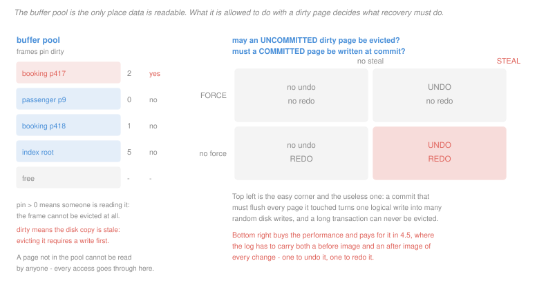

# Database Systems · Lesson 3.1: Storage, pages & the buffer manager

> ⏱ ~15 min · Module 3: Storage, indexing & query processing · Builds on: [2.6 (3NF synthesis)](02-06-minimal-cover-and-3nf-synthesis.md), [`programming-foundations` 1.4 (Big-O)](../../programming-foundations/lessons/01-04-big-o-counting-operations.md) · Unlocks: [3.2 (B⁺-tree indexes)](03-02-b-plus-tree-indexes.md)

## Why this matters

Modules 1 and 2 never mentioned a disk. That was deliberate — the relational model exists precisely so you can specify *what* you want without saying how to fetch it. Module 3 is the how, and it starts with the one fact that governs everything downstream: **a database's cost model counts disk pages, not instructions.**

That single change of unit reorganizes the whole subject. It is why an index is a tree of fan-out 200 rather than 2, why sorting a large file is an entirely different algorithm from sorting an array, and why a query optimizer spends milliseconds of CPU to save a page read. Everything in the next six lessons is downstream of this lesson's unit change.

## The idea

Reading a byte from memory takes roughly 100 nanoseconds. Reading a page from an SSD takes roughly 100 microseconds — a thousand times longer. From a spinning disk, roughly 10 milliseconds, a hundred thousand times longer.

Scale it up so the numbers mean something. If a memory access took **one second**, then an SSD read would take about **17 minutes** and a disk read about **28 hours**. At that ratio, counting CPU instructions while ignoring page reads is like planning a journey by counting your footsteps to the car and ignoring the drive.

So the cost model is: **count the pages you touch, and ignore everything else.** It is a deliberate simplification and a good one, because it is right about the thing that dominates.

Two consequences follow immediately.

**Data moves in pages, not rows.** The unit of transfer is a fixed-size block, typically 4 or 8 kilobytes, holding many rows. Reading one row costs a whole page, so a table's cost is measured by its page count, not its row count — and packing more rows per page makes everything cheaper in proportion.

**Nothing is readable until it is in memory.** The **buffer pool** is a fixed set of memory frames holding copies of pages. Every read and every write goes through it. It is the database's own cache of its own disk, managed by the database rather than by the operating system — and the reasons the database insists on managing it are the subject of this lesson's second half.

## The formal version

> **Page (block).** The fixed-size unit of transfer between disk and memory. A table stored in $N$ pages costs $N$ I/Os to scan.

With page size $P$ and row size $r$, the rows per page and page count are

$$\text{rows per page} = \left\lfloor \frac{P}{r} \right\rfloor, \qquad N = \left\lceil \frac{\text{rows}}{\text{rows per page}} \right\rceil.$$

The floor and the ceiling both matter: a row cannot span pages in most layouts, so the leftover bytes at the end of each page are wasted, and the last page is usually partly empty.

> **File organizations.**
>
> - **Heap file:** rows in no particular order, appended wherever there is room. Insert is cheap, one page. Any search is a full scan, $N$ pages.
> - **Sorted file:** rows kept in order on some key. Binary search costs $\lceil \log_2 N \rceil$ pages; insertion in the middle is catastrophic, since it shifts everything after it.

The sorted file is the motivation for the B⁺-tree of [3.2](03-02-b-plus-tree-indexes.md), which keeps the search cost of sorted order without the insertion cost.

> **Buffer pool.** An array of $B$ frames. Each frame carries:
>
> - the **page id** it holds,
> - a **pin count** — the number of operators currently using it; a frame with pin count above zero cannot be evicted,
> - a **dirty bit** — set when the page has been modified in memory, meaning eviction requires writing it back first.

The replacement policy chooses which unpinned frame to evict. The classic policies — LRU, Clock, and the fact that FIFO can exhibit Belady's anomaly — are established in [`operating-systems` 3.4](../../operating-systems/lessons/03-04-page-replacement-and-thrashing.md) and are not re-derived here. What *is* database-specific is that **LRU is the wrong policy for the most common database access pattern**, which Example 2 quantifies.

Then the two policy questions that decide what recovery has to do:

> **Steal.** May a dirty page belonging to an **uncommitted** transaction be evicted to disk?
> **Force.** Must every page a transaction modified be written to disk **at commit**?

Steal buys buffer flexibility and creates the possibility that the disk holds uncommitted changes, so recovery needs **undo**. No-force buys commit speed and creates the possibility that the disk lacks committed changes, so recovery needs **redo**. Real systems choose **steal and no-force**, and pay for both — which is the design [4.5](04-05-recovery-write-ahead-logging-and-aries.md) is built around.

## Picture

The left half is a snapshot of memory. The right half is a design decision made once, at the top of the system, whose whole cost is paid four lessons later.

## Worked examples

**Example 1 — sizing two tables, and why the row width matters more than it looks.**

Take a 4096-byte page. A `booking` table has 2,000,000 rows of 100 bytes; a `passenger` table has 50,000 rows of 200 bytes.

$$\left\lfloor \frac{4096}{100} \right\rfloor = 40 \text{ rows/page} \quad\Rightarrow\quad \left\lceil \frac{2{,}000{,}000}{40} \right\rceil = 50{,}000 \text{ pages}$$

$$\left\lfloor \frac{4096}{200} \right\rfloor = 20 \text{ rows/page} \quad\Rightarrow\quad \left\lceil \frac{50{,}000}{20} \right\rceil = 2{,}500 \text{ pages}$$

So scanning `booking` costs 50,000 I/Os and scanning `passenger` costs 2,500. These two numbers are the running figures for the whole module, and every plan in [3.7](03-07-query-optimization-and-join-ordering.md) is priced against them.

Now the part worth noticing. Each 100-byte row leaves $4096 - 40 \times 100 = 96$ bytes unusable at the end of its page — about 2.3 percent, tolerable. But widen the row to 150 bytes and you get $\lfloor 4096/150 \rfloor = 27$ rows per page, wasting $4096 - 4050 = 46$ bytes; widen it to 137 and you get 29 rows per page with 123 bytes wasted, 3 percent. The waste is not the interesting part.

The interesting part is the **step function**. Going from 100 to 137 bytes per row — a 37 percent increase — takes rows per page from 40 to 29 and page count from 50,000 to 68,966, a 38 percent increase in the cost of every scan. Adding one column to a wide table can push it over a boundary and make every query on it measurably slower, with nothing in the query changing. This is why practitioners care about column widths in a way that looks obsessive until you count pages.

**Example 2 — the pattern that defeats LRU.**

A query repeatedly scans a 10-page table — the inner relation of a nested-loop join, say ([3.5](03-05-query-operators-and-join-algorithms.md)). The buffer pool has **9** frames available. One page short.

Trace LRU over five passes, 50 page requests in all:

Pass 1 loads pages 1 through 9, then page 10 arrives and the pool is full. LRU evicts the least recently used, which is **page 1**. Pass 2 begins by asking for page 1 — just evicted. Loading it evicts page 2. Pass 2 then asks for page 2. And so on.

**Every one of the 50 requests is a miss. The hit rate is exactly zero**, with a buffer holding 90 percent of the table.

This is **sequential flooding**, and it is not an exotic case — repeated sequential scans are the dominant access pattern in a database. LRU's assumption is that recent use predicts future use, and under a cyclic scan the opposite is true: the most recently used page is precisely the one that will be needed *last*.

The fix is to evict the **most** recently used page instead. Under MRU the pool retains pages 1 through 8 permanently and thrashes only the final frame, giving **14 misses out of 50** rather than 50.

**The general lesson is why the database manages its own buffer pool at all.** The operating system's page cache uses a general-purpose policy and knows nothing about what is being accessed. The database knows it is executing a nested-loop join over a 10-page relation, knows the access will be cyclic, and can choose MRU for that operator alone. It also knows which pages an operator still needs — the **pin count** — so it can forbid eviction outright rather than merely discourage it, and it knows exactly when a page must reach disk, which is what the steal and force policies encode. None of that information is available to the operating system, and all of it is decisive.

## Watch out

- **You might think the buffer pool is a cache you can reason about like a CPU cache.** It is a cache the database controls deliberately. It pins pages, chooses a different replacement policy per operator, and prefetches based on the plan it is executing — none of which a hardware cache or an operating-system page cache can do.
- **You might think LRU is a safe default.** For repeated sequential scans it is the worst possible policy, delivering a zero hit rate when it is one frame short of fitting. Real systems detect scans and switch policy, or use LRU-K to distinguish a page used twice in a scan from one used twice by different queries.
- **You might think counting I/Os ignores too much.** It ignores CPU, which is right, and it also ignores the difference between sequential and random reads, which is a real simplification — a sequential run of pages is far cheaper per page than the same count scattered. [3.3](03-03-hashing-and-choosing-an-access-path.md) is where that omission starts to bite.
- **You might think a dirty page can simply be dropped.** It is the only current copy. Evicting it requires a write, and whether that write may happen before the transaction commits is the steal question — not a detail, but the decision that determines whether recovery needs undo.

## One-liner

> Count pages, not instructions — and let the database manage its own buffer pool, because it alone knows that the page it just read is the one it will need last.

## Problems

**P1 (🟢)** A page is 8192 bytes. A `reading` table has 12,000,000 rows of 48 bytes each.

(a) Give the rows per page and the page count.
(b) Give the bytes wasted per page.
(c) The schema adds a 16-byte column. Give the new rows per page and page count.
(d) Give the percentage increase in the cost of a full scan, and compare it with the percentage increase in row width.

**P2 (🟡)** A nested-loop join repeatedly scans an inner table of 6 pages. The buffer pool has 5 frames available for it.

(a) Give the number of misses over 4 complete passes under LRU, and the hit rate.
(b) Give the number of misses over the same 4 passes under MRU. Show the frame contents at the moment the first eviction differs between the two policies.
(c) The buffer is increased to 6 frames. Give the LRU miss count over 4 passes.
(d) State the general rule this suggests, in the form "LRU on a cyclic scan of $N$ pages with $B$ frames gives …", covering both the $B \geq N$ and $B < N$ cases.

**P3 (🔴, optional)** A system uses **steal** and **no-force**. Transaction $T$ updates page $p$ from value 10 to value 20 and is still running when the buffer manager evicts $p$ to disk. Transaction $U$ updates page $q$ from 5 to 7 and commits; $q$ is still dirty in memory when the machine loses power.

(a) State what the disk holds for $p$ and for $q$ immediately after the crash.
(b) For each page, say whether recovery must **undo**, **redo**, or do nothing, and why.
(c) Suppose instead the system used **no-steal** and **force**. State what the disk holds for each page and what recovery must do. Then give the specific performance cost of each of the two policy changes, in one clause each.
(d) A colleague proposes **no-steal with no-force** as a compromise: never evict uncommitted pages, and do not flush at commit. State which of undo and redo this requires, and give one workload on which the no-steal half of it fails badly.

Solutions

**P1**

(a) $\lfloor 8192/48 \rfloor = 170$ rows per page. Page count $\lceil 12{,}000{,}000/170 \rceil = 70{,}589$ pages.

(b) $8192 - 170 \times 48 = 8192 - 8160 = 32$ bytes wasted per page, about 0.4 percent. This layout packs unusually well.

(c) Row width becomes 64 bytes. $\lfloor 8192/64 \rfloor = 128$ rows per page, and $\lceil 12{,}000{,}000/128 \rceil = 93{,}750$ pages. Note 64 divides 8192 exactly, so zero bytes are wasted.

(d) Scan cost rises from 70,589 to 93,750 pages, an increase of

$$\frac{93{,}750 - 70{,}589}{70{,}589} \approx 32.8\%$$

Row width rose from 48 to 64 bytes, an increase of 33.3 percent.

The two are nearly equal, and that is the expected case: when both layouts pack tightly, page count scales almost exactly with row width. The step-function effect of Example 1 appears when a change pushes the rows-per-page floor across a boundary — going from 48 to 49 bytes, for instance, drops 170 rows per page to 167, a 1.8 percent cost increase for a 2.1 percent width increase, while going from 54 to 55 bytes drops 151 to 148, and the wasted tail swings from 38 bytes to 52.

**P2**

(a) **24 misses out of 24 requests, hit rate 0.** Four passes over 6 pages is 24 requests, and every one is a miss.

The trace: pass 1 loads pages 1 to 5, filling the pool; page 6 arrives and LRU evicts page 1. Pass 2 requests page 1, which was just evicted; loading it evicts page 2, which is requested next. The pattern locks in and never recovers.

(b) **9 misses out of 24**, a hit rate of 62 percent, distributed as 6 misses on pass 1 and exactly 1 on each pass after.

**Where the policies first diverge:** at the sixth request of pass 1, with the pool holding pages 1, 2, 3, 4, 5 and page 6 arriving.

| policy | evicts | pool becomes | next request (page 1) |
|---|---|---|---|
| LRU | page **1** | 2, 3, 4, 5, 6 | miss |
| MRU | page **5** | 1, 2, 3, 4, 6 | hit |

LRU evicts the page needed *next*; MRU evicts the page needed *last*. One choice guarantees a miss on the very next request, the other guarantees four hits.

After that, MRU keeps most of the working set pinned in place and thrashes only one frame — its pool after each pass is $\{1,2,3,4,6\}$, then $\{1,2,3,5,6\}$, then $\{1,2,4,5,6\}$, then $\{1,3,4,5,6\}$, costing one miss each time.

(c) **6 misses over 24 requests**, a hit rate of 75 percent. With $B \geq N$ the entire table fits, so every page is loaded once on pass 1 and never evicted. Every subsequent request is a hit, regardless of policy.

(d) **LRU on a cyclic scan of $N$ pages with $B$ frames gives every request a hit after the first pass when $B \geq N$, and a miss on every request when $B < N$** — however close $B$ is to $N$.

The discontinuity is the point. One frame short of fitting, LRU's hit rate collapses from nearly 100 percent to exactly 0 percent. There is no graceful degradation, because the policy's eviction choice is exactly wrong under a cyclic pattern rather than merely suboptimal.

**P3**

(a) The disk holds **20 for $p$** — the uncommitted new value, written when the buffer manager stole the frame — and **5 for $q$**, the old value, because the committed update never reached disk under no-force.

(b)

- **$p$ needs UNDO.** $T$ never committed, so its change must not survive. The disk carries a value that no committed transaction ever produced, and recovery must restore 10. This is what *steal* costs.
- **$q$ needs REDO.** $U$ committed, so durability requires its change to survive, and the disk does not have it. Recovery must reapply the update, setting $q$ to 7. This is what *no-force* costs.

Both operations need information the pages themselves do not carry: the **before image** (10) to undo, and the **after image** (7) to redo. Neither is recoverable from the crashed disk state, so both must have been written somewhere durable *before* the crash. That somewhere is the write-ahead log of [4.5](04-05-recovery-write-ahead-logging-and-aries.md), and this problem is the argument for its existence.

(c) Under **no-steal and force**: $p$ holds **10** on disk, because an uncommitted dirty page could never be evicted; $q$ holds **7**, because commit forced it out. Recovery does **nothing** — the disk is already exactly the committed state.

The costs:

- **No-steal** requires the buffer pool to retain every page an uncommitted transaction has touched, so a transaction modifying more pages than there are frames cannot run at all, and a long transaction squeezes every other query out of memory.
- **Force** turns each commit into a burst of random writes, one per page touched, so commit latency scales with how much the transaction changed and the same hot page is rewritten on every commit that touches it.

(d) **No-steal with no-force requires redo only.** No-steal means the disk never holds uncommitted data, so undo is unnecessary; no-force means the disk may lack committed data, so redo is required.

**Where the no-steal half fails badly: any long update transaction.** A bulk update touching more distinct pages than the buffer pool has frames simply cannot proceed — there is no legal page to evict, since every dirty page belongs to the still-running transaction. The system must either abort it or block. A nightly job rewriting a million rows is the standard instance, and it is common enough that no-steal is unusable in practice regardless of what it saves recovery.

That is the honest summary of the whole matrix: the two policies that make recovery easy are the two that make normal operation impossible, so every real system takes steal and no-force and moves the difficulty into the log.

## Flashback

**From Lesson 2.5 (decomposition — lossless join & dependency preservation):** $R(A, B, C, D)$ with $F = \{B \to C,\ C \to D\}$ is decomposed into $R_1(B, C)$ and $R_2(A, B, D)$.

(a) Give the shared attributes and state whether the decomposition is lossless, with the closure that decides it.
(b) State whether it is dependency-preserving, naming any lost dependency.
(c) If a dependency is lost, give a pair of table instances that are individually valid and jointly violate it.

Solution

(a) Shared attributes: $R_1 \cap R_2 = \{B\}$. Compute $\{B\}^+ = \{B, C, D\}$, which contains all of $R_1 = \{B, C\}$.

**Lossless.** The shared column is a superkey of the first piece, which is all the binary test requires.

(b) **Not dependency-preserving.** $C \to D$ is lost: $C$ appears only in $R_1$ and $D$ only in $R_2$, so no single table holds both. And it is not implied by the pieces' local dependencies — the only one available is $B \to C$ on $R_1$, and $\{C\}^+$ under $\{B \to C\}$ alone is just $\{C\}$.

(c)

| $R_1$: B | C |
|---|---|
| b1 | c1 |
| b2 | c1 |

Valid: $B \to C$ holds, since the two $B$ values differ.

| $R_2$: A | B | D |
|---|---|---|
| a1 | b1 | d1 |
| a1 | b2 | d2 |

Valid: no dependency of $F$ constrains $R_2$ at all, and the rows are distinct.

Joining on $B$ gives $(a1, b1, c1, d1)$ and $(a1, b2, c1, d2)$ — two rows with $C = c1$ and different $D$ values, violating $C \to D$. **Neither table can detect it**, because the check requires the join.

Note the contrast with losslessness: this decomposition invents no rows, so no data is fabricated. What it loses is the *ability to enforce a rule*, which is a silent failure rather than a visible one.

## Connections

- **Backward:** the schema this module queries is the one Module 2 built, and the cost of normalization appears here as page count — three tables scanned separately cost more than one, which is the counterweight to [2.6](02-06-minimal-cover-and-3nf-synthesis.md). The Big-O habit of [`programming-foundations` 1.4](../../programming-foundations/lessons/01-04-big-o-counting-operations.md) carries over intact; only the unit being counted changes.
- **Forward:** [3.2](03-02-b-plus-tree-indexes.md) builds the access path that beats a full scan, [3.4](03-04-external-sorting.md) sorts data larger than the buffer pool, and [3.5](03-05-query-operators-and-join-algorithms.md) is where the buffer size $B$ becomes the parameter every algorithm is tuned against. The steal and no-force decision made here is discharged in [4.5](04-05-recovery-write-ahead-logging-and-aries.md).
- **Sideways:** the buffer pool is a software-managed cache over a slower store, the same structure as the CPU cache of [`computer-architecture` 4.2](../../computer-architecture/lessons/04-02-associativity-misses-write-policy.md) and the page cache of [`operating-systems` 3.4](../../operating-systems/lessons/03-04-page-replacement-and-thrashing.md). What differs is knowledge: hardware caches guess from recency, and the database *knows the access pattern* because it wrote the plan — which is exactly why it can beat LRU when LRU fails.
