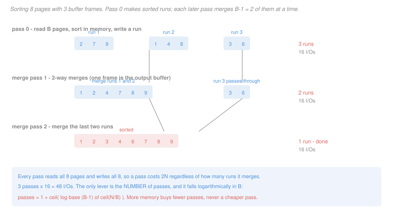

# Database Systems · Lesson 3.4: External sorting

> ⏱ ~15 min · Module 3: Storage, indexing & query processing · Builds on: [3.1 (storage & the buffer manager)](03-01-storage-pages-and-the-buffer-manager.md), [`algorithms` 1.4 (sorting)](../../algorithms/lessons/01-04-sorting-and-the-comparison-lower-bound.md) · Unlocks: [3.5 (join algorithms)](03-05-query-operators-and-join-algorithms.md)

## Why this matters

Sorting is the most-used operator in a database that nobody writes explicitly. `ORDER BY` needs it, `GROUP BY` usually gets it, `DISTINCT` is often implemented with it, sort-merge join depends on it, and building a B⁺-tree index starts with it. If sorting is slow, a great deal is slow.

The trouble is that the sorting you already know does not apply. [`algorithms` 1.4](../../algorithms/lessons/01-04-sorting-and-the-comparison-lower-bound.md) counts *comparisons* and proves an $n \log n$ lower bound; in this cost model comparisons are free and only page reads count. A table of 50,000 pages will not fit in a buffer pool of 200, so the array cannot be addressed at all — most of it is not in memory, and the algorithm has to decide what to bring in.

The answer restructures the problem entirely, and the payoff is a formula worth knowing by heart: **the cost is $2N$ per pass, and the number of passes is logarithmic in the buffer size.**

## The idea

Two phases.

**Phase one, run generation.** Read $B$ pages — as many as the buffer holds — sort them in memory by any method you like, and write them back as a **run**: a sorted stretch of $B$ pages. Repeat until the file is consumed. You now have $\lceil N/B \rceil$ sorted runs and no sorted file.

**Phase two, merging.** Devote one frame to each of $B-1$ input runs and the last frame to output. Repeatedly take the smallest key across the input frames and append it to the output; when an input frame empties, read the next page of that run. This merges $B-1$ runs into one, in a single sequential sweep, using memory proportional to the *number of runs* rather than their size. Repeat until one run remains.

Two things follow, and they are the whole lesson.

**Every pass costs exactly $2N$.** A pass reads every page once and writes every page once, no matter how many runs it is merging. Merging 2 runs and merging 500 runs cost the same.

**So the only lever is the number of passes**, and each merge pass divides the run count by $B-1$. That makes the pass count logarithmic in $B$, which is why buffer memory is the parameter that matters — and why the improvement it buys arrives in discrete steps rather than smoothly.

## The formal version

> **Two-phase multiway merge sort.** For a file of $N$ pages and $B$ buffer frames:
>
> - **Pass 0** produces $\lceil N/B \rceil$ sorted runs of $B$ pages each.
> - **Each merge pass** combines up to $B-1$ runs into one, dividing the run count by $B-1$.
>
> $$\text{passes} = 1 + \left\lceil \log_{B-1} \left\lceil \frac{N}{B} \right\rceil \right\rceil, \qquad \text{cost} = 2N \times \text{passes}.$$

The $B-1$ rather than $B$ is the output buffer, and it matters only when $B$ is tiny.

> **The two-pass condition.** Two passes suffice exactly when $\lceil N/B \rceil \leq B-1$, that is when
> $$N \lesssim B(B-1) \approx B^2.$$

In words: **if the buffer is about the square root of the file, one merge pass finishes the job.** This is the practically important case, because $B^2$ is enormous — a 1,000-frame buffer of 4-kilobyte pages sorts up to about 4 gigabytes in two passes, and most sorts a database performs are well inside that.

> **Replacement selection.** Instead of filling the buffer, sorting, and dumping it, maintain a heap of $B$ pages' worth of records and emit the smallest one that is still $\geq$ the last emitted value, refilling the vacated slot from the input. Runs grow to **$2B$ pages on average** rather than $B$.

This halves the initial run count. It changes the *cost* only when halving pushes the run count below $B-1$ and removes a whole pass — which is the point about discrete steps, made twice.

The heap here is the priority queue of [`programming-foundations` 3.3](../../programming-foundations/lessons/03-03-heaps-and-priority-queues.md), and the same structure serves the merge phase: choosing the smallest key across $B-1$ inputs is a $\log(B-1)$ heap operation rather than a linear scan.

## Picture

Notice that run 3 is simply copied during merge pass 1 and still costs its pages twice. A pass is $2N$ whether or not every run participates in a merge.

## Worked examples

**Example 1 — sorting the booking table, and the cliff.**

The `booking` table is $N = 50{,}000$ pages ([3.1](03-01-storage-pages-and-the-buffer-manager.md)). How much does sorting it cost?

| $B$ | initial runs | passes | I/Os |
|---|---|---|---|
| 50 | 1,000 | 3 | 300,000 |
| 100 | 500 | 3 | 300,000 |
| 200 | 250 | 3 | 300,000 |
| **224** | 224 | **3** | **300,000** |
| **225** | 223 | **2** | **200,000** |
| 502 | 100 | 2 | 200,000 |
| 5,000 | 10 | 2 | 200,000 |

Read the table's middle two rows again. **Going from 224 frames to 225 — one extra page of memory — cuts the sort cost by a third**, from 300,000 I/Os to 200,000. Going from 225 to 5,000, a twenty-two-fold increase in memory, saves nothing at all.

The two-pass condition explains it exactly. At $B = 225$, $B(B-1) = 50{,}400 \geq 50{,}000$, so the 223 initial runs fit inside a single 224-way merge. At $B = 224$, $B(B-1) = 49{,}952 < 50{,}000$, and the 224 runs need one more than the 223-way merge can take — so a second merge pass is required for one leftover run, and that pass costs the full 100,000 I/Os.

**This step-function behaviour is worth internalizing**, because it explains a common and otherwise baffling observation: raising a database's sort memory setting produces no improvement at all, then a large one, then nothing again. The tuning target is not "more memory" but **crossing the next $B^2$ boundary**, and knowing $N$ tells you where the boundary is.

**Example 2 — when replacement selection earns a pass, and when it does not.**

Same file, $N = 50{,}000$. Replacement selection makes runs of about $2B$ pages instead of $B$.

**At $B = 200$:** ordinary run generation gives $\lceil 50{,}000/200 \rceil = 250$ runs. A merge pass handles 199 at a time, so 250 runs need two merge passes — three passes overall, 300,000 I/Os.

With replacement selection the runs average 400 pages, giving $\lceil 50{,}000/400 \rceil = 125$ runs. Since $125 \leq 199$, **one merge pass finishes it**: two passes, 200,000 I/Os. **A third of the cost removed**, from a change to how the initial runs are built.

**At $B = 100$:** ordinary generation gives 500 runs; replacement selection gives 250. The merge fan-in is 99, and $250 > 99$, so **both still need two merge passes**. Three passes either way, 300,000 I/Os. **Replacement selection bought nothing.**

The rule is the same as Example 1's, applied one level up: halving the run count helps if and only if it crosses a boundary. Both examples say that in this algorithm, effort spent anywhere other than reducing the pass count is wasted — and the pass count is a step function of everything you can control.

*(Replacement selection is less used in practice than it once was, because its access pattern is random within the heap and modern systems prefer the cache-friendly sort-and-dump. The reasoning transfers regardless: the question is always whether a change removes a pass.)*

## Watch out

- **You might think a merge pass costs less when there are fewer runs to merge.** It costs $2N$ regardless. Every page is read once and written once, even a run that is merely copied through as run 3 is in the figure.
- **You might think doubling the buffer roughly halves the cost.** It reduces the pass count by one only when it crosses a boundary, and otherwise changes nothing. Between boundaries, extra memory buys exactly zero.
- **You might think the comparison lower bound of [`algorithms` 1.4](../../algorithms/lessons/01-04-sorting-and-the-comparison-lower-bound.md) is the binding constraint.** It bounds comparisons, which are free here. The binding constraint is I/O, and the relevant quantity is $2N \lceil \log_{B-1}(N/B) \rceil$ — a different function of a different variable.
- **You might think an already-sorted file is cheap to sort.** Pass 0 still reads and writes everything to discover that, unless the system checks for pre-sortedness or the plan can use an existing index's leaf chain instead — which is exactly why [3.7](03-07-query-optimization-and-join-ordering.md) tracks "interesting orders."

## One-liner

> Every pass costs $2N$ and each pass divides the run count by $B-1$, so the only thing worth tuning is the pass count — and it drops in steps at $N \approx B^2$, not smoothly.

## Problems

**P1 (🟢)** A file has $N = 108$ pages and the buffer has $B = 4$ frames.

(a) Give the number of runs produced by pass 0 and their length.
(b) Give the merge fan-in.
(c) Give the number of runs after each merge pass, until one remains.
(d) Give the total number of passes and the total I/O cost.

**P2 (🟡)** A `trip` table occupies 90,000 pages.

(a) Give the smallest $B$ for which the sort completes in two passes. Show the inequality you solved.
(b) Give the sort cost at that $B$ and at $B - 1$, and the percentage saved by the single extra frame.
(c) Give the smallest $B$ for which the sort completes in one pass, and say what that means physically.
(d) At $B = 150$, give the number of passes with ordinary run generation and with replacement selection, and state whether replacement selection saves a pass.

**P3 (🔴, optional)** A query is `SELECT DISTINCT carrier_id FROM shipment ORDER BY carrier_id`, over a `shipment` table of 200,000 pages with 25 rows per page. There are 400 distinct carriers. The buffer has $B = 300$ frames.

(a) Give the cost of answering it by sorting the whole table, and the number of passes.
(b) An unclustered B⁺-tree index on `carrier_id` exists, with 250 entries per index page and height 3. Give the cost of an index-only scan of its leaves, and say whether the result needs sorting afterwards.
(c) The optimizer instead considers hashing: read the table once, keep a hash table of distinct `carrier_id` values in memory, then sort the result. Give the total cost, and state the condition on the number of distinct values that makes this plan legal.
(d) Rank the three plans and state which single fact about the data makes the winner win. Then give a change to the data that would reverse the ranking of your top two.

Solutions

**P1**

(a) $\lceil 108/4 \rceil = \mathbf{27}$ runs, each **4 pages** long. (The last run is 4 pages here since $108 = 27 \times 4$ exactly.)

(b) $B - 1 = \mathbf{3}$ runs at a time. One frame is reserved for output.

(c) Each pass divides the run count by 3, rounding up:

| pass | runs before | runs after |
|---|---|---|
| merge 1 | 27 | 9 |
| merge 2 | 9 | 3 |
| merge 3 | 3 | 1 |

(d) **4 passes** in total — pass 0 plus three merge passes. Cost $2 \times 108 \times 4 = \mathbf{864}$ I/Os.

Check against the formula: $1 + \lceil \log_3 27 \rceil = 1 + 3 = 4$.

**P2**

(a) Two passes require $\lceil N/B \rceil \leq B - 1$, so approximately $B(B-1) \geq 90{,}000$. Solving $B^2 - B - 90{,}000 \geq 0$ gives $B \geq (1 + \sqrt{1 + 360{,}000})/2 \approx 300.5$, so try $B = 301$: $\lceil 90{,}000/301 \rceil = 300$ runs, and the fan-in is 300. Since $300 \leq 300$, **two passes**.

Check $B = 300$: $\lceil 90{,}000/300 \rceil = 300$ runs with a fan-in of 299. Since $300 > 299$, three passes.

**Smallest $B$ is 301.**

(b) At $B = 301$: $2 \times 90{,}000 \times 2 = \mathbf{360{,}000}$ I/Os.
At $B = 300$: $2 \times 90{,}000 \times 3 = \mathbf{540{,}000}$ I/Os.

Saving: $(540{,}000 - 360{,}000)/540{,}000 = \mathbf{33.3\%}$, from one additional 4-kilobyte frame. The margin at $B=300$ is a single run — 300 runs against a 299-way merge — and that one leftover run costs an entire pass over the file.

(c) One pass means pass 0 alone produces a single run, which requires $\lceil N/B \rceil = 1$, so $B \geq \mathbf{90{,}000}$.

Physically that means **the whole table fits in the buffer pool**, and "external" sorting has become internal sorting: read everything, sort in memory, write once. There is no merge phase because there is nothing to merge.

(d) $N = 90{,}000$, $B = 150$, fan-in 149.

**Ordinary:** $\lceil 90{,}000/150 \rceil = 600$ runs. Merge pass 1: $\lceil 600/149 \rceil = 5$ runs. Merge pass 2: 1 run. **3 passes**, 540,000 I/Os.

**Replacement selection:** runs average $2B = 300$ pages, giving $\lceil 90{,}000/300 \rceil = 300$ runs. Merge pass 1: $\lceil 300/149 \rceil = 3$ runs. Merge pass 2: 1. **3 passes**, 540,000 I/Os.

**No, it saves nothing.** Halving 600 runs to 300 still leaves more than the 149-way fan-in can absorb in one pass, so the pass count is unchanged and the I/O cost is identical. Contrast Example 2, where halving crossed the boundary and removed a pass.

The general test is a single comparison: replacement selection helps exactly when $\lceil N/B \rceil > B-1 \geq \lceil N/2B \rceil$. Here $600 > 149$ but $300 > 149$ too, so the condition fails on the right.

**P3**

(a) $\lceil 200{,}000/300 \rceil = 667$ runs; fan-in 299, so merge pass 1 gives $\lceil 667/299 \rceil = 3$ runs, merge pass 2 gives 1. **3 passes**, $2 \times 200{,}000 \times 3 = \mathbf{1{,}200{,}000}$ I/Os.

(b) The index holds one entry per row, so 5,000,000 entries at 250 per page is $\lceil 5{,}000{,}000/250 \rceil = 20{,}000$ leaf pages. An index-only scan costs $3 + 20{,}000 = \mathbf{20{,}003}$ I/Os.

**No sorting is needed afterwards.** The index leaves are already in `carrier_id` order, so the scan emits values in order, and duplicates are adjacent — the `DISTINCT` becomes a single comparison against the previous value, and the `ORDER BY` is satisfied for free.

(c) Read the table once: **200,000** I/Os. The 400 distinct values fit trivially in memory, and sorting 400 values costs nothing measurable in page terms.

**Total: 200,000 I/Os.**

**The legality condition:** the distinct values must fit in the buffer, that is the number of distinct values times the entry size must be at most $B$ pages. With 400 values that is a single page against 300 available, so it holds by an enormous margin. If it failed, the plan would degrade to a partitioned hash — spilling partitions to disk and processing them one at a time, at roughly the cost of a sort.

(d) **Ranking: (b) index-only scan at 20,003, then (c) hash at 200,000, then (a) sort at 1,200,000.**

**The fact that makes the winner win is that there are only 400 distinct carriers among 5,000,000 rows.** That is what lets an index over the column be *small* relative to the table — and note the index-only scan wins despite reading 20,000 pages of index, because the alternative is 200,000 pages of table. The index is a tenth the size of the data because it holds one column instead of a whole row, and reading a tenth of the bytes is the entire advantage.

**A change that reverses the top two:** make `carrier_id` nearly unique — say 4,000,000 distinct values among the 5,000,000 rows, as if it were a per-shipment identifier.

- The index-only scan still costs 20,003 I/Os and now returns 4,000,000 values in order, which is correct but is no longer a small result.
- The hash plan **becomes illegal**: 4,000,000 distinct values will not fit in 300 pages, so it must spill and degrade to something sort-like.

So the ranking between them does not merely swap — the hash plan stops being available. To swap them properly, keep the low distinct count but **drop the index**: without it, plan (b) is unavailable and the hash plan at 200,000 becomes the winner over the sort at 1,200,000.

**The general point behind all three:** `DISTINCT` and `ORDER BY` are not intrinsically sorting operations. They are satisfiable by any plan that produces the right values in the right order, and both an ordered index and an in-memory hash can do it far more cheaply than sorting. Recognizing that is most of what the optimizer in [3.7](03-07-query-optimization-and-join-ordering.md) does with these clauses.

## Flashback

**From Lesson 3.3 (hashing & choosing an access path):** An extendible hash index has global depth 4. A bucket at local depth 2 holds 2 keys and is full; buckets hold 2 keys.

(a) Give the number of directory entries pointing at that bucket.
(b) The bucket overflows. State whether the directory doubles, and give the local depths afterwards.
(c) A different bucket, at local depth 4, then overflows. Give the new global depth and directory size.
(d) Give the lookup cost in page reads before and after (c).

Solution

(a) $2^{d - d_b} = 2^{4-2} = \mathbf{4}$ directory entries.

(b) **No doubling.** Local depth 2 is below global depth 4, so spare entries exist to re-point. The bucket splits into two, both at **local depth 3**, and the four directory entries divide two and two between them.

Note the split raises the local depth by one, to 3, not up to the global depth of 4. Each of the two new buckets is still pointed at by two entries and can split again later without any doubling.

(c) That bucket's local depth equals the global depth, so no spare entry exists to re-point. **The directory doubles to global depth 5**, giving $2^5 = \mathbf{32}$ entries, and then the bucket splits into two at local depth 5.

(d) **2 page reads, before and after** — one directory probe and one bucket read. Directory size has no bearing on lookup cost, which is the property extendible hashing exists to preserve and the one static hashing cannot.

## Connections

- **Backward:** the $2N$-per-pass accounting is the page-counting cost model of [3.1](03-01-storage-pages-and-the-buffer-manager.md), and $B$ is that lesson's buffer pool appearing as an algorithm parameter for the first time. [`algorithms` 1.4](../../algorithms/lessons/01-04-sorting-and-the-comparison-lower-bound.md) supplies the in-memory sort used inside pass 0, and its lower bound applies there and nowhere else.
- **Forward:** [3.5](03-05-query-operators-and-join-algorithms.md) uses this directly — sort-merge join is two external sorts plus a merge, and hash join is the same partitioning idea with a hash function in place of the sort. The $\sqrt{N}$ memory rule reappears there as the condition for a hash join to avoid recursion, and [3.7](03-07-query-optimization-and-join-ordering.md)'s interesting orders exist to avoid paying for a sort twice.
- **Sideways:** the heap used for both run generation and the merge is the priority queue of [`programming-foundations` 3.3](../../programming-foundations/lessons/03-03-heaps-and-priority-queues.md). The structural move — do as much as fits in fast memory, write the partial results out, then combine — is the same one behind every out-of-core algorithm, and it is why the merge step of merge sort turned out to be the part worth keeping when the data outgrew memory.
