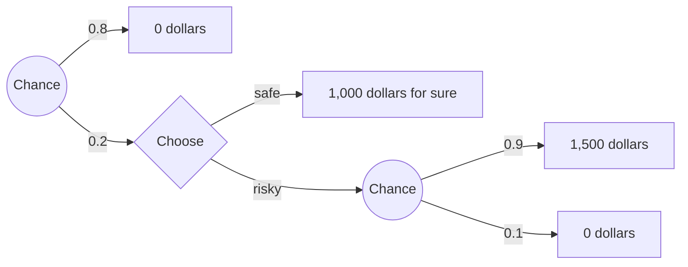

# Decision Theory · Lesson 1.4: What a representation theorem shows

> ⏱ ~15 min · Module 1: Expected utility and what it claims · Builds on: [1.2 From expected value to expected utility](01-02-from-expected-value-to-expected-utility.md), [1.3 The vNM theorem and how utility is built](01-03-the-vnm-theorem-and-how-utility-is-built.md) · Unlocks: [2.1 Savage's framework](02-01-savages-framework.md), [2.3 The Allais paradox and the sure-thing principle](02-03-the-allais-paradox-and-the-sure-thing-principle.md)

## Why this matters

[1.3](01-03-the-vnm-theorem-and-how-utility-is-built.md) proved that preferences obeying four axioms can be scored by expected utility. Economists then say "rational agents maximize expected utility" as if the theorem had shown it. It has not. The theorem is a biconditional between a list of axioms and a way of writing numbers down. Whether you *should* choose by expected utility depends on whether you should obey the axioms, and the theorem is silent on that. This lesson separates the three claims the theorem gets enlisted for (descriptive, normative, formal) and works the two best arguments that the axioms are norms: the money pump and the sequential-choice argument.

## The idea

A bathroom scale shows a number. Two people can agree on every reading and disagree about what it is a reading *of*. One says there is a quantity, your mass, and the scale detects it. The other says "weight" just means what the scale displays.

Utility has the same split ([realism and constructivism about utility](../reference.md#realism-and-constructivism-about-utility)). The **realist** says utility is a psychological quantity (how much you value an outcome, perhaps how good it feels), and you prefer one gamble to another *because* its expected utility is higher. The **constructivist** says utility is a summary of preferences: the numbers exist only because the preferences hang together, and "she prefers A because $U(A)>U(B)$" runs the explanation backwards. That warning has been repeated in economics since Luce and Raiffa's *Games and Decisions* (1957).

[`philosophy-of-economics` 2.1](../../philosophy-of-economics/lessons/02-01-preference-and-revealed-preference.md) runs this dispute for *preference* (Samuelson's choice pattern against Hausman's mental state); here it is one level up, for the numbers built from preference under risk. It matters because it decides what the theorem can do for a chooser. A realist could, in principle, consult her utilities and compute. A constructivist has no utilities until her preferences are already in order, so the theorem cannot tell her how to order them. For her, all the normative weight sits on the axioms themselves.

## The formal version

**A representation theorem**, schematically ([representation theorem](../reference.md#representation-theorem)): for a preference relation $\succeq$ on lotteries,

$$\succeq \text{ satisfies axioms } A_1,\dots,A_n \iff \exists\, u \text{ such that } L\succeq L' \Leftrightarrow \mathbb{E}_L[u]\ge \mathbb{E}_{L'}[u].$$

*In words:* the axioms hold exactly when some utility function makes "preferred" mean "higher expected utility". For vNM the axioms are completeness, transitivity, continuity and independence ([vNM axioms](../reference.md#vnm-axioms); stated in [`grad-game-theory` 1.5](../../grad-game-theory/lessons/01-05-expected-utility-vnm-axioms.md)).

The same theorem supports three readings:

- **Descriptive.** People's preferences satisfy the axioms, so they behave *as if* maximizing expected utility. Refuted in part by the data in [`philosophy-of-economics` 2.2](../../philosophy-of-economics/lessons/02-02-the-behavioural-challenge.md) and by Allais ([2.3](02-03-the-allais-paradox-and-the-sure-thing-principle.md)).
- **Normative.** Rational preferences satisfy the axioms, so a rational agent is representable as an expected-utility maximizer. Untouched by the data: an experiment shows what people do, not what they ought to do.
- **Interpretive.** The axioms are what it takes to attribute utilities (and, in [2.2](02-02-probability-from-preference.md), credences) to someone at all. An agent who violates them is not so much irrational as hard to read.

**The "only describes" critique.** (1) The theorem is a biconditional between the axioms and representability. (2) Being representable gives no one a reason to choose anything. So (3) expected-utility maximization is exactly as normative as the axioms. *In words:* the theorem moves the burden; it does not discharge it. Two arguments try to discharge it.

**The money pump (transitivity)** ([money pump](../reference.md#money-pump); Davidson, McKinsey and Suppes 1955; also [`micro-refresher` 1.1](../../micro-refresher/lessons/01-01-preferences-utility.md)). Suppose strictly cyclic preferences $Y\succ X$, $Z\succ Y$, $X\succ Z$, and suppose that whenever she strictly prefers one good to another she will pay some small fee $\varepsilon>0$ to swap. Starting with $X$, she trades $X\to Y\to Z\to X$, paying $3\varepsilon$ per cycle and ending where she began. After $k$ cycles she has paid

$$3k\varepsilon.$$

*In words:* cyclic preferences turn a fixed fee into an unbounded loss for nothing. The pump needs two premises beyond intransitivity: each strict preference is worth some money, and she evaluates each offer **myopically**, one trade at a time.

**The sequential-choice argument (independence)** ([sequential choice argument for independence](../reference.md#sequential-choice-argument-for-independence); Hammond 1988). Recall [independence](../reference.md#independence-axiom): $L\succeq L'$ iff $\alpha L+(1-\alpha)N\succeq \alpha L'+(1-\alpha)N$, for any lottery $N$ and $\alpha\in(0,1]$. Build a two-stage tree: a first chance move gives $N$ with probability $1-\alpha$, and with probability $\alpha$ brings you to a choice between $L$ and $L'$. Three premises:

1. **Reduction.** A plan is worth what its reduced (one-stage) lottery is worth, so choosing $L$ at the node is the plan $\alpha L+(1-\alpha)N$.
2. **Consequentialism.** At a node, choice depends only on what can still happen; the branch that did not occur is irrelevant. So at the node she chooses as if facing $L$ versus $L'$ outright.
3. **Dynamic consistency.** What she plans at the start is what she chooses at the node.

∴ Her ranking of $L$ against $L'$ (premise 2) equals her ranking of the two mixtures (premises 1, 3): independence. *In words:* a violator must plan one thing and do another, or let a branch that never happened steer her.

**[Myopic, sophisticated and resolute choice](../reference.md#myopic-sophisticated-and-resolute-choice).** The violator has three ways through the tree. *Myopic:* plan by the mixtures, then choose at the node as if the plan did not exist (inconsistent). *Sophisticated:* foresee the node choice and plan by backward induction (consistent, but she may end with a plan she ranks below one she could have had). *Resolute* (McClennen, *Rationality and Dynamic Choice*, 1990): carry out the plan, giving up consequentialism.

**Where the argument is weakest.** Both arguments rest on a premise the opponent can deny without absurdity. The pump needs myopia: an intransitive agent who looks ahead can refuse the trade that starts the cycle (P3 tests what that costs). The sequential argument needs consequentialism, and Machina (1989, *Journal of Economic Literature*) argues that this premise assumes what is in dispute. If risk attitudes are about the *whole* gamble, the branch that did not happen is part of what she was choosing between, so letting it matter at the node is not an error. The defender replies that the outcome on that branch is now impossible, and caring about it is caring about nothing. Neither argument is merely question-begging, and neither is decisive: each turns the question "is the axiom a norm?" into "is myopia, or consequentialism, a norm?"

## Picture

Example 2's tree. Circles are chance moves, the diamond is her choice. Planned at the start, "risky" is a 0.18 chance of 1,500; "safe" is a 0.2 chance of 1,000.

## Worked examples

**Example 1 (clean): a three-good pump.** Mara owns a bicycle. She strictly prefers a guitar to the bicycle, a camera to the guitar, and the bicycle to the camera, and will pay 2 dollars for any swap to something she prefers. A trader offers guitar for bicycle (she pays 2), camera for guitar (2), bicycle for camera (2). She holds a bicycle again, 6 dollars poorer. Ten cycles: $3\times10\times2=60$ dollars. No cycle ever ends with her better off, and each trade looked good when she made it.

Note what was assumed: that the trader can keep offering, and that Mara judges each offer alone. Remove either and the loss stops, but the cycle in her preferences does not.

**Example 2 (hard): an independence violator in a tree.** Prizes 0, 1,000 and 1,500 dollars. Let $L$ be 1,000 for sure and $L'$ a 0.9 chance of 1,500 (else 0). Nadia prefers $L$ to $L'$. She also prefers a 0.18 chance of 1,500 to a 0.2 chance of 1,000. A common pattern, and not an expected-utility one: set $u(0)=0$, $u(1500)=1$. Then

$$\begin{aligned} L\succ L' &\;\Rightarrow\; u(1000)>0.9,\\ 0.18 \text{ of } 1500 \succ 0.2 \text{ of } 1000 &\;\Rightarrow\; 0.18>0.2\,u(1000) \;\Rightarrow\; u(1000)<0.9. \end{aligned}$$

No $u$ does both. The second pair is the first mixed with "nothing", $\alpha=0.2$, $N=0$: a violation of independence.

Now the tree in the picture. At the start, by reduction, "safe" is $0.2$ of 1,000 and "risky" is $0.2\times0.9=0.18$ of 1,500, so she plans risky. At the diamond the 0.8 branch is gone and she faces $L$ against $L'$, so (by consequentialism) she picks safe. Myopic Nadia plans risky and does safe. Sophisticated Nadia foresees this and ends with the safe plan, 0.2 of 1,000, though at the start she ranked it below the risky plan. Were she offered a binding commitment to the risky branch for a small fee, she would pay, where an expected-utility agent, whose plan and node choice always agree, would see nothing to buy. Resolute Nadia takes risky at the diamond, and is consistent, but only by letting the vanished 0.8 branch decide.

Where it strains: Nadia's defender says her node preference for the sure 1,000 is itself a response to risk, and that at the diamond the relevant risk includes the 0.8 chance she already ran. The tree shows that she must give up one of reduction, consequentialism or dynamic consistency. It does not show which, and the expected-utility theorist and his critic choose differently.

## Watch out

- **You might think the theorem shows that rational agents maximize expected utility.** It shows that axiom-satisfiers are *representable* that way. The normative claim needs a separate argument that the axioms are requirements of rationality.
- **You might think a money pump proves the agent will actually be ruined.** It shows her preferences make her exploitable under myopic trading. Many defenders read it as a *symptom* that her preferences cannot all be satisfied together, not as a prediction about traders.
- **You might think the descriptive failures settle the normative question.** Allais and the reversals in [`philosophy-of-economics` 2.2](../../philosophy-of-economics/lessons/02-02-the-behavioural-challenge.md) refute the descriptive reading. A normative theory survives every violation; it just calls them mistakes, which is exactly what is contested.

## One-liner

> A representation theorem converts "these axioms hold" into "these preferences can be written as expected utility"; it adds no reason to obey the axioms, and the best reasons on offer (pumps, trees) trade one contested premise for another.

## Problems

**P1 (🟢) *(Formal (a)–(b) · Exegetical (c).)*** Theo owns a kayak and has 500 dollars. He strictly prefers a telescope to the kayak, a drone to the telescope, and the kayak to the drone. He accepts a swap to the preferred good for any fee not exceeding 7 dollars (kayak to telescope), 5 (telescope to drone) and 4 (drone to kayak). A trader offers the swaps in the order kayak → telescope → drone → kayak → … and stops when Theo cannot pay.

(a) The trader charges Theo's maximum on each swap. How much is extracted after $k$ full cycles? How many full cycles happen, and what does Theo hold, with how much money, when it stops?
(b) The trader instead charges one uniform fee on every swap. What is the largest uniform fee Theo accepts on all three swaps? At that fee, how does it end?
(c) Name the axiom the pump targets and the two further premises about Theo it relies on. Two sentences.

**P2 (🟡) *(Formal (a) · Exegetical (b).)*** A spinner gives nothing with probability 3/4; with probability 1/4 Iris reaches a choice between 400 dollars for sure and a 0.85 chance of 500 (else nothing). At the choice node she takes the sure 400. Asked at the start, she prefers the plan "take the gamble at the node" to the plan "take the sure 400".

(a) Reduce both plans to one-stage lotteries. Taking $u(0)=0$ and $u(500)=1$, show that no utility function makes both of her preferences expected-utility maximizing. If she is sophisticated, which plan does she end with, and how does she rank it against the other?
(b) A realist says Iris has real utilities and at least one of her choices misses them. A constructivist says the tree shows only that no utility function describes her. Name the crux between them, and say what each must supply to call Iris irrational. 100 words or fewer.

**P3 (🔴, optional) *(Formal (a) · Evaluative (b).)*** Take Theo from P1, with his money as $m$. Assume his preferences over goods-plus-money follow the fee limits exactly: for any amount $x$ and any $f$ (possibly negative), he strictly prefers the telescope with $x-f$ dollars to the kayak with $x$ dollars iff $f<7$, and likewise with 5 for drone over telescope and 4 for kayak over drone. More money with the same good is always better. The trader now announces the full sequence in advance: three swaps, kayak → telescope, telescope → drone, drone → kayak, 3 dollars each. Theo is sophisticated.

(a) Solve by backward induction. Which swaps does Theo accept, and what does he end with?
(b) Theo avoided the pump while keeping his cyclic preferences. Does that show intransitivity is rationally permissible? Any verdict passes; 150 words or fewer.

Solutions

**P1** *(Formal (a)–(b) · Exegetical (c).)*

(a) Each cycle costs $7+5+4=16$, so $k$ full cycles extract $16k$. After 31 cycles he has paid $16\times31=496$ and holds the kayak with 4 dollars. The next swap costs 7, which he cannot pay, so it stops there: 31 cycles, 496 extracted, kayak and 4 dollars.

(b) He accepts all three only if the fee is at most $\min(7,5,4)=4$. At 4 each cycle costs 12; after 41 cycles he has paid $492$ and holds the kayak with 8 dollars. Two more swaps (kayak → telescope, telescope → drone) take the last 8. He ends holding the drone with 0 dollars: all 500 extracted.

**Must hit, strict (a)–(b):** $16k$; 31 cycles, kayak, 4 dollars; uniform fee 4; 41 cycles plus two swaps, drone, 0 dollars.

**Must hit, strict (c):**

- The axiom is **transitivity** (his strict preferences form a cycle).
- The premises: each strict preference is worth a positive sum to him, and he evaluates each offer **myopically**, on its own, without regard to the offers he can foresee.

**Wrong turns:** in (a), letting the trader continue with cheaper swaps after Theo cannot pay 7; the order is fixed. In (b), choosing 7 or the average: a fee above 4 makes him refuse drone → kayak and breaks the cycle. In (c), naming independence: no risk is involved.

**Model answer:** (a) $16k$; 31 cycles, then he holds the kayak with 4 dollars. (b) 4; he ends with the drone and nothing. (c) Transitivity; the pump also assumes his strict preferences are worth money and that he judges each trade alone.

---

**P2** *(Formal (a) · Exegetical (b).)*

(a) Plan "sure": $\tfrac14$ chance of 400. Plan "gamble": $\tfrac14\times0.85=\tfrac{17}{80}=0.2125$ chance of 500.

$$\begin{aligned} 400 \succ 0.85 \text{ of } 500 &\;\Rightarrow\; u(400)>0.85,\\ 0.2125 \text{ of } 500 \succ 0.25 \text{ of } 400 &\;\Rightarrow\; 0.2125>0.25\,u(400) \;\Rightarrow\; u(400)<0.85. \end{aligned}$$

Contradiction, so no $u$ fits; this is an independence violation with $\alpha=\tfrac14$, $N$ = nothing. Sophisticated, she foresees taking the sure 400 at the node, so she ends with the plan "sure" (a quarter chance of 400), which she ranks *below* the plan "gamble".

**Must hit, strict (a):** both reductions (0.25 of 400; 0.2125 of 500); the two inequalities on $u(400)$ that cannot both hold; sophisticated outcome is the plan she ranks lower.

**Must hit, strict (b):**

- The crux: whether utility exists independently of (prior to) her preferences, as a psychological quantity they can track or miss, or is constructed from preferences that satisfy the axioms.
- The realist must say which choice misses her utilities and give evidence of the quantity apart from these choices.
- The constructivist cannot call her irrational from the representation's failure; he must argue directly that a premise of the tree (consequentialism, dynamic consistency) binds her.

**Wrong turns:** treating the crux as "whether Iris is rational": both can agree on that once the status of utility is fixed. Saying the constructivist must call her irrational because no $u$ exists; for him that is the starting fact, not a verdict.

**Model answer (b):** They split on what utility is: a quantity in Iris that choices can get wrong, or a summary that exists only when her choices cohere. The realist must locate the error, say, the sure 400 overweighted, and show a measure of her utilities independent of these choices. The constructivist gets no verdict from the missing $u$; to convict her he must argue that she ought to choose consequentially and stick to her plans.

---

**P3** *(Formal (a) · Evaluative (b).)*

(a) Third swap (holding drone with $m-6$): accept gives kayak with $m-9$. Kayak over drone at fee $3<4$, so he accepts. Second swap (holding telescope with $m-3$): accepting leads, by the third step, to kayak with $m-9$; declining keeps telescope with $m-3$. Compare telescope with $x-f$ against kayak with $x$, where $x=m-9$ and $x-f=m-3$, so $f=-6<7$: he prefers the telescope and **declines**. First swap (holding kayak with $m$): accepting leads to telescope with $m-3$; $f=3<7$, so he **accepts**. He makes one swap and ends with the telescope, 3 dollars poorer: no pump.

**Must hit, strict (a):** the backward order; accepts the last swap if reached; declines the second because it leads to kayak at $m-9$; accepts the first; ends with telescope at $m-3$.

**Must hit, any verdict (b):**

- State which premise of the pump foresight denies: myopia, not intransitivity.
- Name what he still pays for the cycle: at the second node he declines a swap he would accept on its own (fee 3 below his limit of 5), so his choices now depend on what comes after. Say whether that path-dependence is itself a defect or a sensible response.
- Say whether the reply generalizes: the same foresight defence is the sophisticated chooser of the lesson's tree, and if it saves intransitivity it may save independence violations too (or fail for both).

**Wrong turns:** reading (a) as "he refuses everything": he gains by the first swap. Concluding from (a) alone that intransitivity is fine; the result shows only that this argument against it needs myopia.

**Model answer (b), one of several:** Foresight disarms the pump, so the pump argument cannot be the whole case against intransitivity: it convicts myopia plus a cycle, not a cycle alone. But Theo's escape has a price. At the second node he refuses a trade he would accept in isolation, so whether he wants the drone depends on what offers follow. A defender of transitivity can say this is the cycle showing through: no choice from his three goods is unbeaten, so foresight only decides where he stops. A defender of Theo can reply that letting future options shape present choice is just planning. Either way, the same move rescues the sophisticated independence violator, so the verdict must be the same for both axioms.

## Flashback

**From Lesson [1.2](01-02-from-expected-value-to-expected-utility.md) (From expected value to expected utility):** *(Formal (a)–(b).)* A biased coin lands heads with probability $h$ and is tossed until the first head. If that comes on toss $n$, the game pays $2^n$ dollars. The agent has $u(x) = \sqrt{x}$.

(a) Take $h = 1/3$. Show that the expected value is infinite, then find the expected utility and the certainty equivalent exactly.
(b) For which $h$ is the expected value infinite but the square-root agent's expected utility finite?

Solution

(a) The first head comes on toss $n$ with probability $h(1-h)^{n-1} = \tfrac13\left(\tfrac23\right)^{n-1}$. Toss $n$ contributes $\tfrac13\left(\tfrac23\right)^{n-1} 2^n = \tfrac23\left(\tfrac43\right)^{n-1}$ to the expected value, a growing term, so the sum diverges. For the expected utility, $\sqrt{2^n} = 2^{n/2}$, so

$$\begin{aligned} \mathrm{EU} &= \sum_{n\ge1} \tfrac13\left(\tfrac23\right)^{n-1} 2^{n/2} = \frac{\sqrt2}{3}\sum_{n\ge1}\left(\frac{2\sqrt2}{3}\right)^{n-1} \\ &= \frac{\sqrt2/3}{1 - 2\sqrt2/3} = \frac{\sqrt2}{3 - 2\sqrt2} = \sqrt2\,(3 + 2\sqrt2) = 4 + 3\sqrt2 \approx 8.243. \end{aligned}$$

The ratio $2\sqrt2/3 \approx 0.943$ is below 1, so the series converges. The certainty equivalent solves $\sqrt{\mathrm{CE}} = 4 + 3\sqrt2$:

$$\mathrm{CE} = (4 + 3\sqrt2)^2 = 34 + 24\sqrt2 \approx 67.94 \text{ dollars}.$$

(b) Both sums are geometric. The expected value has ratio $2(1-h)$ and is infinite iff $2(1-h) \ge 1$, that is, $h \le \tfrac12$. The expected utility is $h\sqrt2\sum_{n\ge1}\big(\sqrt2(1-h)\big)^{n-1}$, which is infinite iff $\sqrt2(1-h) \ge 1$, that is, $h \le 1 - \tfrac{1}{\sqrt2} \approx 0.293$. So the expected value is infinite and the expected utility finite exactly when

$$1 - \tfrac{1}{\sqrt2} < h \le \tfrac12 .$$

For $h \le 1 - 1/\sqrt2$ the square root fails too: the coin is slow enough to come up heads that the tail outruns the concavity, which is Menger's point in miniature.

**Wrong turns:** using the fair-coin probabilities $2^{-n}$ for a coin that is not fair. Treating the boundary cases as finite: at $h = \tfrac12$ each expected-value term is 1, and at $h = 1 - 1/\sqrt2$ each expected-utility term is $h\sqrt2$, so both sums diverge. Reporting $4 + 3\sqrt2$ as the price instead of squaring it.

## Connections

- **Backward:** [1.3](01-03-the-vnm-theorem-and-how-utility-is-built.md) built the utility function this lesson asks about; [1.2](01-02-from-expected-value-to-expected-utility.md)'s reading of concave utility as risk aversion is a realist reading the constructivist need not share. The axioms are stated in [`grad-game-theory` 1.5](../../grad-game-theory/lessons/01-05-expected-utility-vnm-axioms.md), and the parallel dispute about preference is [`philosophy-of-economics` 2.1](../../philosophy-of-economics/lessons/02-01-preference-and-revealed-preference.md).
- **Forward:** [2.1](02-01-savages-framework.md) states Savage's theorem, which needs the same interpretation; [2.2](02-02-probability-from-preference.md) is the interpretive reading at work, reading credences off bets. [2.3](02-03-the-allais-paradox-and-the-sure-thing-principle.md) and [2.4](02-04-risk-beyond-curvature.md) weigh independence against the risk attitudes it rules out, and [3.2](03-02-models-of-ambiguity.md) meets dynamic inconsistency again for ambiguity-averse agents.
- **Sideways:** the preference-reversal money pump is [`philosophy-of-economics` 2.2](../../philosophy-of-economics/lessons/02-02-the-behavioural-challenge.md)'s; the belief-side cousin of the pump, the Dutch book, belongs to [`epistemology`](../../epistemology/syllabus.md) [5.2](../../epistemology/lessons/05-02-dutch-books-and-accuracy.md). P2(b) is [`philosophical-method` 4.3](../../philosophical-method/lessons/04-03-finding-the-crux.md) applied to utility. A sophisticated chooser paying for commitment is the same structure as the present-biased saver who pays for a savings account in that 2.2 lesson's P3.
