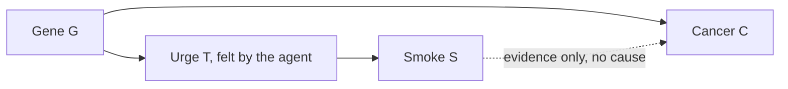

# Decision Theory · Lesson 4.2: Evidential decision theory

> ⏱ ~15 min · Module 4: Newcomb's problem and the causal-evidential split · Builds on: [4.1 Newcomb's problem](04-01-newcombs-problem.md), [1.1 Acts, states, outcomes](01-01-acts-states-outcomes.md), [`prob-stat-refresher` 1.2](../../prob-stat-refresher/lessons/01-02-conditional-probability-bayes.md) · Unlocks: [4.3 Causal decision theory](04-03-causal-decision-theory.md), [4.4 Hard cases for both](04-04-hard-cases-for-both.md)

## Why this matters

[4.1](04-01-newcombs-problem.md)'s one-boxer weighted each state by its probability *given the act*. This lesson turns that move into a theory, Richard Jeffrey's, and gives its best feature: it never asks you to find "the right" partition of states, which was [1.1](01-01-acts-states-outcomes.md)'s unsolved problem. Then it tests the theory on medical cases, where the same move seems to tell you to avoid a harmless pleasure because it is a symptom. The question is whether the defence that rescues it there also costs it Newcomb.

## The idea

Ask of each option: *how glad would I be to learn that I had done it?* That is the [evidential](../reference.md#evidential-decision-theory) question. Learning that you did something is news, and news changes what you expect about the world. Normally this is harmless: learning that you took the medicine is good news about your health because the medicine works.

Trouble comes when an act is a *symptom* rather than a cause. Suppose a gene makes people both enjoy smoking and get cancer, and smoking itself does nothing. Learning that you smoke is bad news: you probably have the gene. So the evidential question can say "don't smoke", even though not smoking cannot change your genes. This is the [smoking lesion](../reference.md#smoking-lesion). David Lewis (1981, "Causal Decision Theory") charged that such reasoning commends "managing the news": arranging to receive good tidings about things you cannot control.

The evidentialist's best reply, the [tickle defence](../reference.md#tickle-defence), is that a gene can move your choice only by first moving something you can feel: an urge, a desire. Once you know whether you feel it, your actual choice tells you nothing further about the gene, and the bad news evaporates. Whether that reply works, and what it costs, is the lesson's real question. Notice already that it changes nothing about the theory: it changes what the agent is taken to know when she conditions.

## The formal version

**Jeffrey's desirability.** Richard Jeffrey (*The Logic of Decision*, 1965; second edition 1983) treats acts, states and outcomes alike as propositions. For an act $A$, a partition of states $\{S_1,\dots,S_n\}$ (exactly one is true), a probability $P$ and a utility $u(A,S_i)$ of the outcome when $A$ and $S_i$ both hold, the **desirability** of $A$ is

$$V(A)=\sum_{i} P(S_i\mid A)\,u(A,S_i).$$

*In words: the utility you expect, given the news that you did $A$.* **Evidential decision theory** (EDT) says: choose the act with the highest $V$. It is [4.1](04-01-newcombs-problem.md)'s expected-utility principle made general, so in Newcomb it one-boxes exactly when $\Delta M>T$. Like Savage's theory, Jeffrey's has a representation theorem (due to Ethan Bolker), turning preferences over propositions into $P$ and $u$; [1.4](01-04-what-a-representation-theorem-shows.md)'s question about what such theorems show applies unchanged.

**Partition invariance.** Split any $S_i$ into finer cells $S_{ij}$. Jeffrey's theory requires a coarse cell's desirability to be the conditional average of its parts:

$$u(A,S_i)=\sum_j P(S_{ij}\mid A\wedge S_i)\,u(A,S_{ij}).$$

Substituting, $\sum_i P(S_i\mid A)\sum_j P(S_{ij}\mid A\wedge S_i)u(A,S_{ij})=\sum_{ij}P(S_{ij}\mid A)\,u(A,S_{ij})$. *In words: $V(A)$ is the conditional expectation of utility given $A$, and by total probability every partition returns the same number.* That is [partition invariance](../reference.md#partition-invariance).

The rival formula with *unconditional* weights, $\sum_i P(S_i)\,u(A,S_i)$, lacks it. With [act-dependent states](../reference.md#act-dependent-states), two partitions of one problem can give opposite verdicts, as Example 1 shows. Savage avoids this by assuming acts cannot influence states ([2.1](02-01-savages-framework.md)); Jeffrey needs no such assumption, because conditioning on the act absorbs the dependence. Lewis (1981) pressed this partition-dependence of the unconditional formula.

**The objection from the smoking lesion**, reconstructed:

1. A gene $G$ causes both a taste for smoking ($S$) and cancer ($C$); smoking causes nothing.
2. Smoking is evidence of $G$, so $P(C\mid S)>P(C\mid\neg S)$.
3. If that gap times the cost of cancer exceeds smoking's pleasure, EDT says abstain.
4. Abstaining to improve news about a state your act cannot affect is irrational.

∴ **C.** EDT is false.

**The tickle defence** (Ellery Eells, *Rational Decision and Causality*, 1982) attacks premise 2 *for the deliberating agent*. Suppose the gene moves choice only through an introspectible state $T$ (the "tickle": an urge, or more generally the agent's beliefs and desires), so $G\to T\to S$. Then $T$ **screens off** $S$ from $G$:

$$P(G\mid S\wedge T)=P(G\mid \neg S\wedge T)=P(G\mid T).$$

*In words: once you know whether you have the urge, whether you act on it is no further evidence about the gene.* An agent who knows her own $T$ conditions on it, $P(C\mid S\wedge T)=P(C\mid\neg S\wedge T)$, and $V$ then ranks acts exactly as [dominance](../reference.md#dominance) on the gene partition does. EDT smokes.

**Where the argument is weakest.** For the objection, premise 2: it uses population statistics an agent who knows her own mind need not condition on. For the defence, its assumption that the gene acts *only* through states she can introspect. Paul Horwich (1987) objected that she may know her beliefs and desires yet not know the mechanism by which they produce her choice, and then the choice is still news. Eells (1984) replied with a dynamic version, the "meta-tickle" defence, which lets the agent learn from her own deliberation as it unfolds. And the defence generalizes: the predictor in Newcomb reads the same beliefs and desires that cause your choice, so screening off makes your choice no evidence about the box, and EDT two-boxes (SEP, "Causal Decision Theory"). An evidentialist must choose: give up the tickle defence and abstain in the lesion, or keep it and give up one-boxing. Arif Ahmed (*Evidence, Decision and Causality*, 2014) is the leading recent defender of EDT against its causalist rivals.

## Picture

Solid arrows are causes; the dashed link is a correlation with no causal path. Without $T$ (Example 1), the arrow runs $G\to S$ directly and smoking is a symptom. With $T$ known (Example 2), every path from $S$ back to $G$ passes through something the agent already knows, so the dashed link carries no news.

## Worked examples

**Example 1 (clean): the lesion by the numbers.** Utilities: smoking $+10$, cancer $-100$, so smoke-and-cancer is $-90$. $P(G)=\tfrac14$; $P(S\mid G)=0.9$, $P(S\mid\neg G)=0.2$; $P(C\mid G)=0.6$, $P(C\mid\neg G)=0.1$.

*Condition on the act.* $P(S)=\tfrac14(0.9)+\tfrac34(0.2)=\tfrac38$, so by [Bayes](../../prob-stat-refresher/lessons/01-02-conditional-probability-bayes.md)

$$\begin{aligned}
P(G\mid S)&=\frac{0.225}{0.375}=0.6,\qquad P(G\mid \neg S)=\frac{0.025}{0.625}=0.04,\\
P(C\mid S)&=0.6(0.6)+0.4(0.1)=0.4,\\
P(C\mid \neg S)&=0.04(0.6)+0.96(0.1)=0.12.
\end{aligned}$$

$$\begin{aligned}
V(S)&=0.4(-90)+0.6(10)=-30,\\
V(\neg S)&=0.12(-100)=-12.
\end{aligned}$$

EDT abstains, by 18. It smokes only if the pleasure exceeds $100(0.4-0.12)=28$. On the gene partition smoking adds exactly 10 in each cell ($-50$ vs $-60$ with $G$; $0$ vs $-10$ without), so it dominates. Most readers, and many evidentialists, find abstaining wrong here; that reaction is premise 4.

*Partition check.* Cut the states instead as $R$, "my outcome matches my act" (smoke and cancer, or abstain and no cancer), and $\neg R$. Jeffrey: $P(R\mid S)=P(C\mid S)=0.4$ and $P(\neg R\mid\neg S)=P(C\mid\neg S)=0.12$, so $V(S)=-30$ and $V(\neg S)=-12$ again. Unconditional weights: on $\{C,\neg C\}$, $P(C)=\tfrac{9}{40}$ gives $-12.5$ for smoking against $-22.5$, so smoke; on $\{R,\neg R\}$, $P(R)=0.15+0.55=0.7$ gives $0.7(-90)+0.3(10)=-60$ against $0.3(-100)=-30$, so abstain. Same problem, opposite verdicts.

**Example 2 (hard): the tickle.** Same gene, cancer rates and utilities, but now $G$ causes an urge: $P(T\mid G)=0.9$, $P(T\mid\neg G)=0.2$. The urge alone drives choice: $P(S\mid T)=\tfrac34$, $P(S\mid\neg T)=\tfrac14$.

*Without looking inward.* $P(G\mid S)=0.4$ and $P(G\mid\neg S)=\tfrac{2}{15}$, so $P(C\mid S)=0.3$, $P(C\mid\neg S)=\tfrac16$, giving $V(S)=-20$ against $V(\neg S)=-\tfrac{50}{3}\approx-16.7$. Abstain.

*Feeling the urge.* $P(G\mid T)=0.6$ whatever she then does, so $P(C\mid S\wedge T)=P(C\mid \neg S\wedge T)=0.4$:

$$\begin{aligned}
V(S\mid T)&=0.4(-90)+0.6(10)=-30,\\
V(\neg S\mid T)&=0.4(-100)=-40.
\end{aligned}$$

Smoke, by exactly 10. Without the urge, $P(G\mid\neg T)=0.04$ and it is $-2$ against $-12$: smoke again. Where it strains: the margin is 10 only because, by stipulation, nothing but $T$ links gene to choice. Add even a small direct arrow $G\to S$ (the gene also tilts how urges become decisions) and smoking is news again even given $T$. Whether real deliberation ever has that shape is an empirical question about agents, which the defence answers by assumption.

## Watch out

- **You might think** EDT ignores causation. It uses whatever the agent believes about causes, through her probabilities. It diverges from causal reasoning only where an act is evidence for what it does not cause.
- **You might think** partition invariance shows EDT is right. It shows the formula is well defined without picking privileged states. Whether $P(S\mid A)$ is the right weight is the separate question Module 4 fights over.
- **You might think** the tickle defence is a reason to one-box. It does the opposite: applied to Newcomb, it screens off your choice from the prediction and EDT two-boxes.

## One-liner

> Evidential decision theory chooses the act that would be the best news, which makes it partition-invariant and makes it flinch at symptoms; the tickle defence cures the flinch only by making your choice no news at all, in the lesion and in Newcomb alike.

## Problems

**P1 (🟢)** *(Formal (a)–(b) · Exegetical (c).)* A heart variant $H$ causes both a taste for espresso and arrhythmia; espresso itself is harmless. Drinking espresso ($D$) is worth $+6$; arrhythmia is worth $-60$. $P(H)=\tfrac15$; $P(D\mid H)=\tfrac45$, $P(D\mid\neg H)=\tfrac14$; $P(\text{arrhythmia}\mid H)=\tfrac12$, $P(\text{arrhythmia}\mid\neg H)=\tfrac1{10}$.

(a) Compute $V(D)$ and $V(\neg D)$. What does EDT recommend?
(b) Find the smallest pleasure from espresso (replacing $+6$) above which EDT recommends drinking.
(c) Name the partition on which drinking dominates, and say in one sentence why EDT does not follow it.

**P2 (🟡)** *(Formal (a)–(b) · Exegetical (c).)* Same case as P1. Let $M$ be "arrhythmia if and only if I drink" (drink with arrhythmia, or abstain without it).

(a) Compute $V(D)$ and $V(\neg D)$ on the partition $\{M,\neg M\}$ and confirm they match P1(a).
(b) Compute $\sum_S P(S)\,u(\text{act},S)$ with *unconditional* weights on the partition {arrhythmia, none} and on $\{M,\neg M\}$, and give each verdict.
(c) In one or two sentences: which formula is partition-invariant, and why?

**P3 (🔴, optional)** *(Formal (a) · Evaluative (b).)* Same case, but $H$ now moves choice only through a felt craving $K$: $P(K\mid H)=\tfrac45$, $P(K\mid\neg H)=\tfrac14$, and whether she drinks depends only on $K$.

(a) She feels the craving. Find $P(H\mid D\wedge K)$ and $P(H\mid\neg D\wedge K)$, then $V(D\mid K)$ and $V(\neg D\mid K)$.
(b) Does the tickle defence vindicate EDT? State the defence's key assumption, the strongest objection to it, and what keeping the defence costs a one-boxer in Newcomb. 150 words or fewer; any verdict passes.

Solutions

**P1** *(Formal (a)–(b) · Exegetical (c))*

(a) $P(D)=\tfrac15\cdot\tfrac45+\tfrac45\cdot\tfrac14=0.16+0.2=0.36$. Then $P(H\mid D)=\tfrac{0.16}{0.36}=\tfrac49$ and $P(H\mid\neg D)=\tfrac{0.04}{0.64}=\tfrac1{16}$.

$$\begin{aligned}
P(\text{arr}\mid D)&=\tfrac49\cdot\tfrac12+\tfrac59\cdot\tfrac1{10}=\tfrac{5}{18},\\
P(\text{arr}\mid \neg D)&=\tfrac1{16}\cdot\tfrac12+\tfrac{15}{16}\cdot\tfrac1{10}=\tfrac18,\\
V(D)&=6-60\cdot\tfrac{5}{18}=-\tfrac{32}{3}\approx-10.67,\\
V(\neg D)&=-60\cdot\tfrac18=-7.5.
\end{aligned}$$

EDT abstains, by $\tfrac{19}{6}\approx3.17$.

(b) Drinking wins when $x>60\left(\tfrac5{18}-\tfrac18\right)=60\cdot\tfrac{11}{72}=\tfrac{55}{6}\approx9.17$.

(c) The partition $\{H,\neg H\}$: drinking gives $-24$ vs $-30$ with $H$ and $0$ vs $-6$ without, better by 6 in each cell. EDT does not follow it because those states are act-dependent in probability ($P(H\mid D)\neq P(H\mid\neg D)$), although causally independent of the act.

**Must hit, strict:** the Bayes step to $\tfrac49$ and $\tfrac1{16}$; both values and the verdict "abstain"; the threshold $\tfrac{55}{6}$; the variant partition named, with evidential but not causal dependence as the reason.

**Wrong turns:** using $P(\text{arr})=0.18$ for both acts, which is a causal, not evidential, calculation. In (b), solving for the pleasure at which $V(D)=0$ instead of $V(D)=V(\neg D)$.

---

**P2** *(Formal (a)–(b) · Exegetical (c))*

(a) $P(M\mid D)=P(\text{arr}\mid D)=\tfrac5{18}$ and $P(\neg M\mid\neg D)=P(\text{arr}\mid\neg D)=\tfrac18$:

$$\begin{aligned}
V(D)&=\tfrac5{18}(-54)+\tfrac{13}{18}(6)=-\tfrac{32}{3},\\
V(\neg D)&=\tfrac18(-60)=-7.5.
\end{aligned}$$

Same as P1(a).

(b) Unconditionally, $P(\text{arr})=\tfrac15\cdot\tfrac12+\tfrac45\cdot\tfrac1{10}=0.18$. On {arrhythmia, none}: $6-60(0.18)=-4.8$ against $-60(0.18)=-10.8$, so **drink**. For $M$: $P(D\wedge\text{arr})=0.36\cdot\tfrac5{18}=0.1$ and $P(\neg D\wedge\text{none})=0.64\cdot\tfrac78=0.56$, so $P(M)=0.66$. Then drinking scores $0.66(-54)+0.34(6)=-33.6$ and abstaining $0.34(-60)=-20.4$, so **abstain**.

(c) Jeffrey's $V$ is partition-invariant: it is the expectation of utility conditional on the act, and total probability gives the same value on any partition. The unconditional formula changes its verdict when the states, like $M$, are act-dependent.

**Must hit, strict:** $V$ unchanged across partitions; the two unconditional verdicts opposite, with the numbers; invariance traced to conditioning on the act.

**Wrong turns:** using $P(M)=0.66$ inside $V$; $V$ needs $P(M\mid\text{act})$. Concluding that partition invariance makes EDT's verdict *correct*; it makes it well defined.

---

**P3** *(Formal (a) · Evaluative (b))*

(a) $P(H\mid K)=\dfrac{\tfrac15\cdot\tfrac45}{\tfrac15\cdot\tfrac45+\tfrac45\cdot\tfrac14}=\dfrac{0.16}{0.36}=\tfrac49$. Drinking depends only on $K$, so $K$ screens off $D$ from $H$: $P(H\mid D\wedge K)=P(H\mid\neg D\wedge K)=\tfrac49$. Then $P(\text{arr}\mid K)=\tfrac5{18}$ for either act:

$$\begin{aligned}
V(D\mid K)&=6-60\cdot\tfrac5{18}=-\tfrac{32}{3},\\
V(\neg D\mid K)&=-60\cdot\tfrac5{18}=-\tfrac{50}{3}.
\end{aligned}$$

Drink, by exactly 6.

**Must hit, strict (a):** screening off stated and used; equal posteriors $\tfrac49$; the margin equal to the pleasure.

**Must hit, any verdict (b):**

- The assumption stated: the variant influences choice only through a state the agent can introspect, so conditioning on it screens off the act.
- The strongest objection stated: she may not know the mechanism from her mental states to her choice, or the variant may act on that mechanism directly (Horwich), so the act stays evidence; or the agent may be uncertain what she will decide (Eells's dynamic, meta-tickle reply).
- The Newcomb cost: the same screening off makes the choice no evidence about the prediction, so EDT two-boxes.
- A verdict that follows from which of these the answer accepts.

**Wrong turns:** treating (a) as showing EDT and CDT always agree; they agree only where screening off holds. Saying the defence supports one-boxing.

**Model answer (b), one of several:** The defence assumes the variant moves choice only through something I can feel, so once I condition on my craving, drinking is no news about my heart, and EDT drinks. The strongest objection is that this is stipulated, not shown: if the variant also shapes how cravings become decisions, a mechanism I cannot introspect, drinking stays evidence and EDT abstains again. Granting that, the defence still costs the one-boxer. The predictor reads the same beliefs and desires that drive my choice, so they screen off my choice from its prediction and EDT two-boxes. So the defence vindicates EDT only by making it agree with causal reasoning wherever the agent knows her own mind. An evidentialist who wants to keep one-boxing must deny that self-knowledge screens off in Newcomb, and then owes an account of why it does in the lesion.

## Flashback

**From Lesson [3.4](03-04-choosing-behind-the-veil-rawls-vs-harsanyi.md) (Choosing behind the veil: Rawls vs Harsanyi):** *(Formal (a)–(b) · Exegetical (c).)* An invented society has four equal quarters. Incomes (thousands of dollars a year), worst quarter first: P = (8, 20, 30, 62), Q = (14, 18, 22, 26), R = (12, 20, 28, 40). Take $u(x)=x$. A chooser behind the veil only partly trusts "equal chances". She considers every prior of the form $(1-\delta)\cdot\big(\tfrac14,\tfrac14,\tfrac14,\tfrac14\big)+\delta\cdot q$, where $q$ is any probability over the four positions and $\delta$ is fixed in $[0,1]$, and she ranks arrangements by their *minimum* expected income over that set.

(a) Show that an arrangement's value is $(1-\delta)\cdot\text{average}+\delta\cdot\text{minimum}$, and write it for P, Q and R.
(b) For which $\delta$ does she choose each arrangement? Which do Harsanyi and Rawls choose?
(c) Which premise of Harsanyi's reconstructed argument does $\delta>0$ weaken, and which of Rawls's three conditions does $\delta$ measure? Two sentences.

Solution

(a) Under such a prior, expected income is $(1-\delta)\cdot\text{average}+\delta\sum_i q_i x_i$. The second term is smallest when $q$ puts all its weight on the worst position, where it equals $\delta\cdot\text{minimum}$. Averages are 30, 20, 25 and minima 8, 14, 12:

$$\begin{aligned}
W(P)&=30-22\delta,\\
W(Q)&=20-6\delta,\\
W(R)&=25-13\delta.
\end{aligned}$$

(b) P beats R iff $30-22\delta>25-13\delta$, i.e. $\delta<5/9$. R beats Q iff $25-13\delta>20-6\delta$, i.e. $\delta<5/7$. (P and Q cross at $\delta=5/8$, inside R's interval, so that crossing never decides.) She chooses **P** for $\delta<5/9$, **R** for $5/9<\delta<5/7$, **Q** for $\delta>5/7$, with ties at the cut-offs; a grid over $\delta$ in steps of 0.0001 confirms both. Harsanyi is $\delta=0$: P, average 30. Rawls is $\delta=1$: Q, floor 14.

**Must hit, strict (c):** premise 2, equal probability for each person: $\delta$ is the weight withheld from it. Rawls's condition 1, no secure basis for probabilities: $\delta$ measures how insecure the chooser takes that basis to be, so the rule runs from Harsanyi ($\delta=0$) to Rawls ($\delta=1$) as maxmin expected utility over a widening set of priors.

**Wrong turns:** putting the extra weight $\delta$ on the *best* position, which computes the most optimistic prior, not the worst. Treating the P–Q crossing at $5/8$ as a switch point, which skips R. Naming condition 2 in (c): $\delta$ is about trust in probabilities, not about indifference to gains above the floor.

## Connections

- **Backward:** [4.1](04-01-newcombs-problem.md)'s expected-utility argument is EDT applied to two boxes; its $\Delta$ is the evidential gap here. [1.1](01-01-acts-states-outcomes.md) left the partition problem open, and Jeffrey's conditioning dissolves it. [2.1](02-01-savages-framework.md)'s act-independent states are what Jeffrey's framework does without. Conditioning and Bayes are [`prob-stat-refresher` 1.2](../../prob-stat-refresher/lessons/01-02-conditional-probability-bayes.md).
- **Forward:** [4.3](04-03-causal-decision-theory.md) builds the rival that weights states by what the act would cause, and smokes in the lesion without any tickle. [4.4](04-04-hard-cases-for-both.md) uses Jeffrey's later idea, ratifiability, on cases where conditioning on your own choice is unstable.
- **Sideways:** the lesion is the textbook confounder: a common cause makes two effects correlate, as in [`econometrics` 1.2](../../econometrics/lessons/01-02-best-linear-predictor.md)'s hospitals that seem to raise mortality. EDT treats your own act the way a naive regression treats a confounded regressor. Choosing which premise of the lesion argument to deny is [`philosophical-method` 4.3](../../philosophical-method/lessons/04-03-finding-the-crux.md)'s crux-finding.
