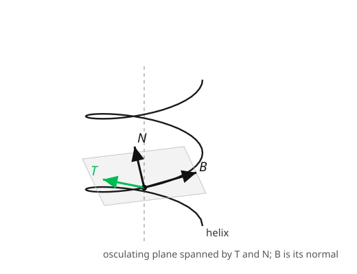

# Differential Geometry · Lesson 1.1: Curves, arc length, and the Frenet frame

> ⏱ ~15 min · Module 1: Curves and surfaces — the classical warm-up · Builds on: multivariable calculus (vector-valued functions) · Unlocks: [1.2 Surfaces and the first fundamental form](01-02-surfaces-first-fundamental-form.md)

## Why this matters

Before geometry goes abstract, do it where you can still point at it. A curve in space has exactly two pieces of local shape — how sharply it **bends** and how much it **twists** — and remarkably, those two numbers determine the curve completely, up to where you put it and how you rotate it. That "shape lives in a couple of scalar functions" idea is the whole subject in miniature: later, surfaces get *their* shape from a few functions (the fundamental forms), and curved spacetime gets its shape from the curvature tensor. Bending and twisting is where the intuition is born. It's also concrete physics: the frame you carry along a curve is exactly how you track the orientation of a gyroscope, a charged particle in a field, or a strand of DNA.

## The idea

Park a tiny observer on the curve and let them ride along at unit speed. At every instant they face straight ahead — that's the **tangent** direction $T$. As the curve bends, $T$ swings; the *rate* at which it swings is the **curvature** $\kappa$, and the direction it swings toward is the **normal** $N$ (it points to the inside of the turn). A straight line never makes $T$ swing, so $\kappa = 0$; a tight circle swings it fast, so $\kappa$ is large.

That handles bending inside a plane. But a space curve can also lift *out* of the plane it momentarily lives in. Complete the observer's frame with a third axis $B = T \times N$, the **binormal**, perpendicular to both. The rate at which the curve twists out of the $T$–$N$ plane is the **torsion** $\tau$. A flat (planar) curve has $\tau = 0$; a corkscrew has constant $\tau$. Two numbers — bend and twist — and you know the curve.

The key move that makes this clean is **arc-length parametrization**: instead of some arbitrary clock $t$, use the distance traveled $s$ as the parameter. Then the observer moves at unit speed, $|\gamma'(s)| = 1$, and every rate is measured "per unit length of curve" rather than per unit of an arbitrary clock — geometry, not bookkeeping.

## The formal version

Let $\gamma:I \to \mathbb{R}^3$ be a smooth curve. It is **parametrized by arc length** if $|\gamma'(s)| = 1$ for all $s$; then $s$ literally measures distance along the curve, since arc length is $\int |\gamma'(t)|\,dt$.

For a unit-speed curve define the **unit tangent** $T(s) = \gamma'(s)$. Because $T \cdot T = 1$ is constant, differentiating gives $T \cdot T' = 0$: the turning of $T$ is perpendicular to $T$. Define the **curvature** and **principal normal** by

$$\kappa(s) = |T'(s)|, \qquad N(s) = \frac{T'(s)}{\kappa(s)} \quad (\text{when } \kappa \neq 0).$$

*In words:* $\kappa$ is how fast the direction of travel rotates per unit length; $N$ is the direction it rotates toward. Complete the orthonormal frame with the **binormal** $B(s) = T(s) \times N(s)$. The triple $\{T, N, B\}$ is the **Frenet frame**, a right-handed set of axes riding along the curve.

Differentiating the three unit vectors and re-expressing in the frame gives the **Frenet–Serret formulas**:

$$T' = \kappa N, \qquad N' = -\kappa T + \tau B, \qquad B' = -\tau N.$$

*In words:* $T$ tips toward $N$ at rate $\kappa$; $B$ tips toward $-N$ at rate $\tau$ (this *defines* the **torsion** $\tau$); and $N$, wedged between them, feeds both back. The plane spanned by $T$ and $N$ is the **osculating plane** — the plane the curve momentarily lies in — and $\tau$ measures how fast the curve is escaping it.

## Picture

## Worked examples

**Example 1 (the benchmark — a circle).** Take the circle of radius $a$, parametrized by arc length: $\gamma(s) = \left(a\cos\frac{s}{a},\, a\sin\frac{s}{a}\right)$. Check unit speed: $\gamma'(s) = \left(-\sin\frac{s}{a},\, \cos\frac{s}{a}\right)$, and $|\gamma'| = 1$. ✓ Then

$$T'(s) = \left(-\tfrac{1}{a}\cos\tfrac{s}{a},\, -\tfrac{1}{a}\sin\tfrac{s}{a}\right), \qquad \kappa = |T'| = \frac{1}{a}.$$

So a big circle bends gently ($\kappa$ small), a tiny one bends sharply ($\kappa$ large) — curvature is **inverse radius**. In fact $1/\kappa$ is the radius of the circle that best hugs any curve at a point (the *osculating circle*). Being planar, $\tau = 0$.

**Example 2 (bend *and* twist — the helix).** Take $\gamma(t) = (a\cos t,\, a\sin t,\, bt)$ with $a>0$ — a corkscrew of radius $a$ climbing $2\pi b$ per turn. This isn't unit speed ($|\gamma'| = \sqrt{a^2+b^2}$), so use the parametrization-free formulas $\kappa = \dfrac{|\gamma' \times \gamma''|}{|\gamma'|^3}$ and $\tau = \dfrac{(\gamma' \times \gamma'') \cdot \gamma'''}{|\gamma' \times \gamma''|^2}$:

$$\gamma' = (-a\sin t,\, a\cos t,\, b), \quad \gamma'' = (-a\cos t,\, -a\sin t,\, 0), \quad \gamma''' = (a\sin t,\, -a\cos t,\, 0).$$

$$\gamma' \times \gamma'' = (ab\sin t,\, -ab\cos t,\, a^2), \qquad |\gamma' \times \gamma''| = a\sqrt{a^2+b^2}.$$

$$\kappa = \frac{a\sqrt{a^2+b^2}}{(a^2+b^2)^{3/2}} = \frac{a}{a^2+b^2}, \qquad \tau = \frac{(\gamma'\times\gamma'')\cdot\gamma'''}{|\gamma'\times\gamma''|^2} = \frac{a^2 b}{a^2(a^2+b^2)} = \frac{b}{a^2+b^2}.$$

Both **constant** — a helix bends and twists the same amount everywhere, which is exactly why it looks so uniform. Set $b=0$ and it collapses to a circle: $\kappa = 1/a$, $\tau = 0$, matching Example 1. The sign of $\tau$ (via $b$) is the handedness — right- vs left-handed screw.

## Watch out

- **You might think curvature needs unit speed to define.** The *clean* formulas $T' = \kappa N$ do, but $\kappa$ and $\tau$ are geometric — independent of parametrization. For any regular curve use the $\gamma' \times \gamma''$ formulas above; don't force an arc-length reparametrization you can't compute in closed form (most curves can't be).
- **You might think $N$ points "up" or "outward" by convention.** $N$ points wherever the curve is *turning* — the concave side. On a helix that's toward the central axis, not up. It's defined by $T'$, full stop.
- **You might read $\tau = 0$ as "no curvature."** Torsion zero means **planar**, not straight. A circle has $\tau = 0$ but plenty of curvature. Bending ($\kappa$) and twisting ($\tau$) are independent dials.

## One-liner

> A space curve carries a little moving frame, and its entire shape is just two numbers: how fast the frame turns ($\kappa$) and how fast it twists out of plane ($\tau$).

## Problems

**P1 (🟢)** For the circle of radius $3$, write down $\kappa$ and $\tau$. Then for a helix with $a = 3$, $b = 4$, compute $\kappa$ and $\tau$, and confirm the helix is "flatter" (smaller $\kappa$) than the circle of the same radius. Explain in one sentence why that makes sense.

**P2 (🟡)** Show that a smooth curve with $\kappa \equiv 0$ is a straight line. (Use the definition $\kappa = |T'|$ and the arc-length parametrization.)

**P3 (🔴, optional)** A curve has *constant* curvature $\kappa > 0$ and *constant* torsion $\tau \neq 0$. Without solving the Frenet system, argue it must be a helix by a counting/uniqueness heuristic: how many scalar functions determine a space curve up to rigid motion, and what does specifying both as constants pin down? (This is the *fundamental theorem of curves*, stated informally.)

Solutions

**P1** Circle of radius $3$: $\kappa = 1/3 \approx 0.333$, $\tau = 0$. Helix $a=3, b=4$: $a^2+b^2 = 25$, so $\kappa = 3/25 = 0.12$ and $\tau = 4/25 = 0.16$. Indeed $0.12 < 0.333$: the helix bends *less* than the circle of radius $3$ because part of its motion goes into climbing (the $b$-direction) rather than curving — the same total "speed" is split between turning and rising, so less is left for turning.

**P2** Unit speed gives $T = \gamma'$ and $\kappa = |T'| = |\gamma''|$. If $\kappa \equiv 0$ then $\gamma''(s) = 0$ for all $s$, so $\gamma'(s) = T_0$ is a constant unit vector, and integrating, $\gamma(s) = \gamma(0) + s\,T_0$ — a straight line traversed at unit speed. ∎

**P3** A space curve is determined up to a rigid motion (rotation + translation) by its curvature $\kappa(s)$ and torsion $\tau(s)$ as functions of arc length — that's two scalar functions, and that's *all* the freedom there is (the fundamental theorem of curves). Specifying $\kappa$ and $\tau$ as *particular constants* therefore pins the curve down to a single shape (up to rigid motion). We already exhibited a curve realizing any constant pair — the helix, with $\kappa = a/(a^2+b^2)$, $\tau = b/(a^2+b^2)$ (solve these two equations for $a, b$ given the target constants; a positive solution exists whenever $\kappa>0$). Since the shape is unique and the helix is one such shape, it is *the* shape. ∎

## Connections

- **Forward:** the "carry a frame along a path, differentiate it, read off the turning" move is the seed of **parallel transport** and the **covariant derivative** ([4.1](04-01-covariant-derivative-christoffel.md)–[4.2](04-02-parallel-transport.md)) — there the space itself is curved, and the analog of "how much the frame fails to stay put" *is* curvature.
- **Forward:** in [1.4](01-04-gaussian-curvature-theorema-egregium.md) curvature stops being a single number and becomes a pair of principal curvatures on a surface; the circle's $\kappa = 1/a$ is the template.
- **Sideways (physics):** the Frenet frame is the "intrinsic coordinate system" of a moving particle; the osculating circle's radius $1/\kappa$ sets the centripetal acceleration $v^2\kappa$ of anything following the path — the geometry of a racetrack turn.
