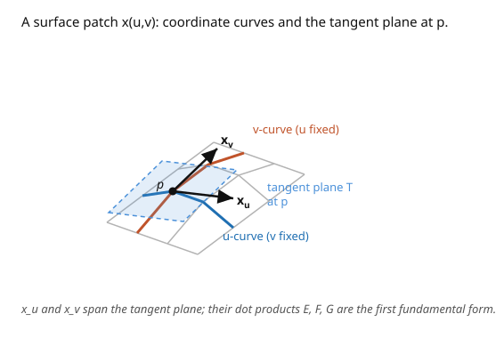

# Differential Geometry · Lesson 1.2: Surfaces and the first fundamental form

> ⏱ ~15 min · Module 1: Curves and surfaces — the classical warm-up · Builds on: [1.1 Curves, arc length, and the Frenet frame](01-01-curves-arclength-frenet.md) · Unlocks: [1.3 The Gauss map and the second fundamental form](01-03-gauss-map-second-fundamental-form.md)

## Why this matters

A curve had one intrinsic thing to measure — length. A surface has more: lengths of curves drawn on it, angles between them, and areas of regions. The astonishing fact of this lesson is that **all of that is captured by a single object**, the first fundamental form, three functions $E, F, G$ of the surface coordinates. Give me $E, F, G$ and I can do all the geometry *inside* the surface without ever looking at the space it sits in. That "surveying from inside" viewpoint — the induced metric — is the exact thing that becomes the **metric tensor** on an abstract manifold ([5.1](05-01-riemannian-lorentzian-metrics.md)) and the $g_{\mu\nu}$ of general relativity. This is the first honest appearance of a metric.

## The idea

Cover a patch of surface with coordinates $(u, v)$, like latitude and longitude — a **parametrization** $\mathbf{x}(u,v)$. Moving in the $u$-direction sweeps out a velocity $\mathbf{x}_u$; moving in $v$ sweeps $\mathbf{x}_v$. These two vectors span the **tangent plane** at each point: the flat plane that best approximates the surface there, the surface's local "ground."

Now, how long is a little step on the surface? If you nudge coordinates by $(du, dv)$, you move by $\mathbf{x}_u\,du + \mathbf{x}_v\,dv$ in space, and the squared length of that step is a dot product — which expands into three numbers: $\mathbf{x}_u\cdot\mathbf{x}_u$, $\mathbf{x}_u\cdot\mathbf{x}_v$, $\mathbf{x}_v\cdot\mathbf{x}_v$. Those three are $E, F, G$. They form a little "ruler" that converts coordinate steps into real distances. Because everything — arc length, angle, area — is built from lengths of steps, everything is built from $E, F, G$. That's the whole idea: **one ruler, all the intrinsic geometry.**

## The formal version

A **regular surface** $S \subset \mathbb{R}^3$ is one that locally looks like the image of a smooth map $\mathbf{x}: U \subset \mathbb{R}^2 \to \mathbb{R}^3$ whose partials $\mathbf{x}_u, \mathbf{x}_v$ are linearly independent (so the tangent plane is genuinely 2-dimensional). The **tangent plane** at $p$ is $T_pS = \operatorname{span}\{\mathbf{x}_u, \mathbf{x}_v\}$.

The **first fundamental form** is the restriction of the ambient dot product to $T_pS$, recorded in the basis $\{\mathbf{x}_u, \mathbf{x}_v\}$ by the coefficients

$$E = \mathbf{x}_u \cdot \mathbf{x}_u, \qquad F = \mathbf{x}_u \cdot \mathbf{x}_v, \qquad G = \mathbf{x}_v \cdot \mathbf{x}_v.$$

For a tangent step with coordinate increments $(du, dv)$, the squared length is

$$\mathrm{I} = ds^2 = E\,du^2 + 2F\,du\,dv + G\,dv^2.$$

*In words:* $\mathrm{I}$ is the machine that eats a coordinate displacement and returns its true squared length on the surface — the surface's built-in ruler. From it:

- **Arc length** of a curve $t \mapsto (u(t), v(t))$: $\displaystyle L = \int \sqrt{E\,\dot u^2 + 2F\,\dot u \dot v + G\,\dot v^2}\;dt.$
- **Angle** between coordinate curves: $\cos\theta = \dfrac{F}{\sqrt{EG}}$ (so $F = 0$ means the coordinate grid is orthogonal).
- **Area** of a region: $\displaystyle A = \iint \sqrt{EG - F^2}\;du\,dv$, since $|\mathbf{x}_u \times \mathbf{x}_v| = \sqrt{EG - F^2}$.

The crucial word is **intrinsic**: these formulas use only $E, F, G$, never the ambient $\mathbb{R}^3$. An ant confined to the surface can measure all of them.

## Picture

## Worked examples

**Example 1 (plane and cylinder — secretly the same ruler).** The plane $\mathbf{x}(u,v) = (u, v, 0)$ has $\mathbf{x}_u = (1,0,0)$, $\mathbf{x}_v = (0,1,0)$, so $E = 1,\ F = 0,\ G = 1$ and $\mathrm{I} = du^2 + dv^2$ — ordinary Pythagoras.

Now the cylinder of radius $a$, but parametrized so $u$ measures *arc length* around: $\mathbf{x}(u,v) = \left(a\cos\frac{u}{a},\, a\sin\frac{u}{a},\, v\right)$. Then $\mathbf{x}_u = \left(-\sin\frac{u}{a}, \cos\frac{u}{a}, 0\right)$, $\mathbf{x}_v = (0,0,1)$, giving $E = 1,\ F = 0,\ G = 1$ — **identical** to the plane. The cylinder's first fundamental form is the plane's. Intrinsically they are the same surface; you can roll a sheet of paper into a cylinder without stretching. Hold this thought: in [1.4](01-04-gaussian-curvature-theorema-egregium.md) it becomes the Theorema Egregium.

**Example 2 (the sphere — the metric you'll reuse all course).** For the sphere of radius $a$, $\mathbf{x}(\theta,\phi) = (a\sin\theta\cos\phi,\, a\sin\theta\sin\phi,\, a\cos\theta)$:

$$\mathbf{x}_\theta = (a\cos\theta\cos\phi,\, a\cos\theta\sin\phi,\, -a\sin\theta), \qquad \mathbf{x}_\phi = (-a\sin\theta\sin\phi,\, a\sin\theta\cos\phi,\, 0).$$

Compute: $E = \mathbf{x}_\theta\cdot\mathbf{x}_\theta = a^2$, $F = \mathbf{x}_\theta\cdot\mathbf{x}_\phi = 0$, $G = \mathbf{x}_\phi\cdot\mathbf{x}_\phi = a^2\sin^2\theta$. So

$$\boxed{\ \mathrm{I} = a^2\,d\theta^2 + a^2\sin^2\theta\,d\phi^2.\ }$$

The $\sin^2\theta$ is the whole story of the sphere: circles of latitude shrink toward the poles ($\theta \to 0, \pi$). Check the area: $\sqrt{EG-F^2} = a^2\sin\theta$, so $A = \int_0^{2\pi}\int_0^\pi a^2\sin\theta\,d\theta\,d\phi = 4\pi a^2$. ✓ **Memorize this metric** — it returns in [4.3](04-03-geodesics.md) (geodesics), [4.4](04-04-riemann-curvature-tensor.md) (curvature), and [5.2](05-02-levi-civita-connection.md) (its connection).

## Watch out

- **You might think $E, F, G$ are properties of the surface alone.** They depend on the *parametrization* too — the cylinder had $E=1$ only because we used the arc-length $u$; with $u$ as raw angle you'd get $E = a^2$. The *geometry* they encode (lengths, angles, areas) is parametrization-independent, but the coefficients themselves are coordinate bookkeeping.
- **You might forget the cross term.** The $2F\,du\,dv$ in $\mathrm{I}$ is easy to drop. It vanishes only when the coordinate grid is orthogonal ($F=0$). For a skew grid it's essential.
- **You might conflate "flat ruler" with "flat surface."** The cylinder has the plane's first fundamental form yet curves in space. $\mathrm{I}$ knows *intrinsic* geometry; it cannot by itself see the bending into $\mathbb{R}^3$ — that's what the **second** fundamental form ([1.3](01-03-gauss-map-second-fundamental-form.md)) is for.

## One-liner

> The first fundamental form is the surface's built-in ruler — three functions $E, F, G$ from which every length, angle, and area inside the surface follows, with no reference to the outside world.

## Problems

**P1 (🟢)** For the plane in polar coordinates $\mathbf{x}(r,\theta) = (r\cos\theta, r\sin\theta, 0)$, compute $E, F, G$ and write $\mathrm{I}$. Then use it to find the circumference of the circle $r = R$ (integrate arc length around $\theta \in [0, 2\pi]$).

**P2 (🟡)** On the sphere of radius $a$, use $\mathrm{I} = a^2\,d\theta^2 + a^2\sin^2\theta\,d\phi^2$ to compute the length of the circle of latitude $\theta = \theta_0$ (i.e. $\theta$ fixed, $\phi \in [0, 2\pi]$). Confirm it goes to $0$ at the poles and is maximal at the equator.

**P3 (🔴, optional)** A cone (minus its apex) can be cut and unrolled flat onto the plane without stretching. Predict what its first fundamental form should be *intrinsically equivalent to*, and sanity-check by parametrizing the cone $\mathbf{x}(r,\theta) = (r\sin\alpha\cos\theta,\, r\sin\alpha\sin\theta,\, r\cos\alpha)$ (half-angle $\alpha$ fixed) and computing $E, F, G$.

Solutions

**P1** $\mathbf{x}_r = (\cos\theta, \sin\theta, 0)$, $\mathbf{x}_\theta = (-r\sin\theta, r\cos\theta, 0)$. So $E = 1$, $F = 0$, $G = r^2$, and $\mathrm{I} = dr^2 + r^2\,d\theta^2$ — the familiar polar line element. On $r = R$: $\dot r = 0$, length $= \int_0^{2\pi}\sqrt{R^2}\;d\theta = 2\pi R$. ✓

**P2** On $\theta = \theta_0$: $d\theta = 0$, so $ds = \sqrt{G}\,d\phi = a\sin\theta_0\,d\phi$. Length $= \int_0^{2\pi} a\sin\theta_0\,d\phi = 2\pi a\sin\theta_0$. At the poles $\theta_0 = 0, \pi$: length $\to 0$ (a point). At the equator $\theta_0 = \pi/2$: length $= 2\pi a$, the full great circle — maximal. ✓

**P3** Since it unrolls without stretching, its first fundamental form must be *intrinsically* that of (a sector of) the flat plane — i.e. equivalent to $dr^2 + r^2 f(\theta)^2\,d\theta^2$ for some constant rescaling, matching a piece of $\mathbb{R}^2$. Compute: $\mathbf{x}_r = (\sin\alpha\cos\theta, \sin\alpha\sin\theta, \cos\alpha)$, so $E = \sin^2\alpha + \cos^2\alpha = 1$. $\mathbf{x}_\theta = (-r\sin\alpha\sin\theta, r\sin\alpha\cos\theta, 0)$, so $F = 0$ and $G = r^2\sin^2\alpha$. Thus $\mathrm{I} = dr^2 + r^2\sin^2\alpha\,d\theta^2$. Substituting $\psi = \theta\sin\alpha$ turns this into $dr^2 + r^2\,d\psi^2$ — exactly polar-coordinate flat plane (P1), over a reduced angular range $\psi \in [0, 2\pi\sin\alpha)$. That angular deficit is why the unrolled cone is a pie with a wedge missing. The cone is intrinsically flat. ∎

## Connections

- **Backward:** arc length here is [1.1](01-01-curves-arclength-frenet.md)'s $\int|\gamma'|$, now for curves living on a surface, with $|\gamma'|$ computed *through* $\mathrm{I}$ instead of the ambient dot product directly.
- **Forward:** $\mathrm{I}$ is the induced **metric**. On abstract manifolds this becomes the metric tensor $g_{\mu\nu}$ ([5.1](05-01-riemannian-lorentzian-metrics.md)); the sphere's $\mathrm{I}$ is the running example for the whole curvature story of Module 4.
- **Sideways (relativity):** "all geometry from a symmetric quadratic form in the coordinate differentials" is precisely the spacetime interval $ds^2 = g_{\mu\nu}\,dx^\mu dx^\nu$ — the first fundamental form is a warm, positive-definite rehearsal for it.
