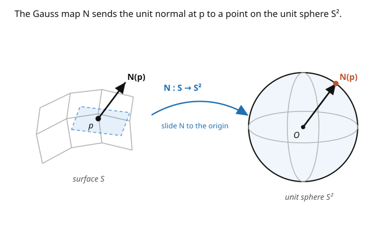

# Differential Geometry · Lesson 1.3: The Gauss map and the second fundamental form

> ⏱ ~15 min · Module 1: Curves and surfaces — the classical warm-up · Builds on: [1.2 Surfaces and the first fundamental form](01-02-surfaces-first-fundamental-form.md) · Unlocks: [1.4 Gaussian curvature and the Theorema Egregium](01-04-gaussian-curvature-theorema-egregium.md)

## Why this matters

The first fundamental form was the surface's *inside* view — lengths and areas an ant could measure. But a plane and a cylinder had the *same* first fundamental form, even though one is flat and one is rolled. Clearly the ruler misses something: how the surface **bends in space**. This lesson builds the instrument that sees the bending — the second fundamental form — by watching how the surface's normal vector tilts as you move around. That "watch the normal turn" idea is the direct ancestor of the shape operator, principal curvatures, and ultimately (next lesson) the single most important number in classical surface theory, the Gaussian curvature.

## The idea

At each point a surface has a **unit normal** $N$ — the arrow sticking straight out. On a plane, $N$ is the same everywhere; it never tilts, so the plane doesn't bend. On a sphere, $N$ points radially out and swings around as you move — the faster it swings, the more sharply the surface curves. So **curvature = the rate at which the normal turns**.

Package this as a map: send each point of the surface to its unit normal, viewed as a point on the unit sphere $S^2$. That's the **Gauss map** $N: S \to S^2$. Its derivative — how the normal's direction changes per unit motion on the surface — is a linear operator on each tangent plane, the **shape operator**. Feed it a direction and it tells you which way, and how fast, the normal tilts if you walk that way.

Different directions bend differently: walk along a cylinder's axis and it's flat (normal doesn't tilt); walk around its waist and it curves hard. The two extreme rates — sharpest and gentlest bending — are the **principal curvatures** $k_1, k_2$, and the directions achieving them are the principal directions. Everything about how a surface sits in space is in those two numbers.

## The formal version

Choose a smooth **unit normal field** $N = \dfrac{\mathbf{x}_u \times \mathbf{x}_v}{|\mathbf{x}_u \times \mathbf{x}_v|}$. The **Gauss map** is $N: S \to S^2$. Its differential $dN_p: T_pS \to T_{N(p)}S^2$; since $T_{N(p)}S^2$ is the plane orthogonal to $N$, which *is* $T_pS$, we may regard $dN_p$ as a linear map $T_pS \to T_pS$. Define the **shape operator** (Weingarten map)

$$S_p = -\,dN_p : T_pS \to T_pS.$$

*In words:* $S_p$ measures how the outward normal tilts as you move; the minus sign is a convention making a sphere come out positively curved. A key fact: $S_p$ is **self-adjoint** with respect to the first fundamental form, so it has real eigenvalues and orthogonal eigenvectors.

The **second fundamental form** is the quadratic form $\mathrm{II}(w) = \langle S_p w, w\rangle$, with coefficients in the coordinate basis

$$e = \mathbf{x}_{uu}\cdot N, \qquad f = \mathbf{x}_{uv}\cdot N, \qquad g = \mathbf{x}_{vv}\cdot N,$$

so $\mathrm{II} = e\,du^2 + 2f\,du\,dv + g\,dv^2$. *In words:* $\mathrm{II}$ records the component of the surface's acceleration along the normal — literally how much it pulls away from its tangent plane. The **normal curvature** in a unit tangent direction $w$ is $k_n(w) = \dfrac{\mathrm{II}(w)}{\mathrm{I}(w)}$, and the **principal curvatures** $k_1, k_2$ are its max and min — equivalently the **eigenvalues of the shape operator** $S_p$.

## Picture

## Worked examples

**Example 1 (the cylinder — one direction flat, one curved).** Cylinder of radius $a$, arc-length parametrized $\mathbf{x}(u,v) = (a\cos\frac{u}{a}, a\sin\frac{u}{a}, v)$. Here $\mathbf{x}_u = (-\sin\frac ua, \cos\frac ua, 0)$, $\mathbf{x}_v = (0,0,1)$, and $N = (\cos\frac ua, \sin\frac ua, 0)$ (radially outward). The second derivatives: $\mathbf{x}_{uu} = (-\frac1a\cos\frac ua, -\frac1a\sin\frac ua, 0)$, $\mathbf{x}_{uv} = \mathbf{x}_{vv} = 0$. So

$$e = \mathbf{x}_{uu}\cdot N = -\tfrac1a, \qquad f = 0, \qquad g = 0.$$

With $\mathrm{I} = du^2 + dv^2$ (identity), the shape operator is $S = \mathrm{I}^{-1}\mathrm{II} = \operatorname{diag}(-\tfrac1a, 0)$. **Principal curvatures $\tfrac1a$ and $0$** (magnitudes; the sign flips with the normal's orientation). Perfect match to intuition: around the waist it bends like a circle of radius $a$ ($\kappa = 1/a$, from [1.1](01-01-curves-arclength-frenet.md)), along the axis it's straight ($0$).

**Example 2 (the sphere — curves the same in every direction).** Sphere of radius $a$. Using the **inward** normal $N = -\frac1a\mathbf{x}$, one computes $\mathrm{II} = \frac1a\bigl(a^2\,d\theta^2 + a^2\sin^2\theta\,d\phi^2\bigr) = \frac1a\,\mathrm{I}$. Since $\mathrm{II} = \frac1a\mathrm{I}$ as forms, the shape operator is

$$S = \mathrm{I}^{-1}\mathrm{II} = \tfrac1a\,\mathrm{Id}.$$

Both **principal curvatures equal $\tfrac1a$**, in *every* direction — a sphere bends identically whichever way you walk (that's what makes it a sphere). Every direction is principal. Contrast the cylinder, whose two principal curvatures differed maximally ($\tfrac1a$ and $0$). Next lesson we multiply them: $K = k_1k_2$ gives $0$ for the cylinder, $1/a^2$ for the sphere — and that number turns out to be *intrinsic*.

## Watch out

- **You might think the sign of curvature is absolute.** It isn't — flip the normal ($N \to -N$) and every principal curvature flips sign. Only *products* and *ratios* that are even in $N$ (like Gaussian curvature $k_1k_2$) are orientation-independent. Fix a normal and stick with it.
- **You might expect $\mathrm{II}$ to be intrinsic like $\mathrm{I}$.** It is not. $\mathrm{II}$ is genuinely *extrinsic* — it needs the ambient $\mathbb{R}^3$ to define $N$. The plane and cylinder share $\mathrm{I}$ but have different $\mathrm{II}$; that difference is exactly the bending $\mathrm{I}$ couldn't see.
- **You might confuse normal curvature with the curve's own curvature.** A curve on the surface has its full curvature $\kappa$ (from [1.1](01-01-curves-arclength-frenet.md)); the *normal* curvature $k_n$ is only the part along $N$. The rest (along the tangent plane) is the *geodesic* curvature — and curves with zero geodesic curvature are the geodesics of Module 4.

## One-liner

> Curvature is the rate at which a surface's normal turns; the shape operator packages that turning, and its two eigenvalues — the principal curvatures — say how hard the surface bends in its sharpest and gentlest directions.

## Problems

**P1 (🟢)** For a plane, argue without computation that both principal curvatures are $0$, using the Gauss map. Then confirm by computing $N$ for $\mathbf{x}(u,v) = (u, v, 0)$ and noting $dN$.

**P2 (🟡)** A **surface of revolution** generated by rotating a curve about the $z$-axis has orthogonal coordinate curves (meridians and parallels) that are its principal directions. For the cylinder you found principal curvatures $\{1/a, 0\}$. Predict qualitatively (sign and which is bigger) the two principal curvatures at the outer equator of a **torus** (doughnut), and say why one of them is smaller than on the tube's circular cross-section.

**P3 (🔴, optional)** Show the shape operator is self-adjoint: $\langle S w_1, w_2\rangle = \langle w_1, S w_2\rangle$ for tangent vectors, equivalently that $\mathrm{II}$ is symmetric, i.e. $f = \mathbf{x}_{uv}\cdot N$ is well-defined and $\mathbf{x}_{uv} = \mathbf{x}_{vu}$. Why does self-adjointness guarantee the principal curvatures are *real*?

Solutions

**P1** On a plane the unit normal is a *constant* vector, so the Gauss map is a constant map $S \to S^2$; its differential $dN$ is identically $0$, hence $S = -dN = 0$ and both eigenvalues (principal curvatures) are $0$. Explicitly: $\mathbf{x}(u,v) = (u,v,0)$ gives $\mathbf{x}_u\times\mathbf{x}_v = (0,0,1) = N$, constant, so $N_u = N_v = 0$ and $dN = 0$. ✓

**P2** At the outer equator of a torus, the surface curves the *same way* (toward the inside of the solid) in both principal directions, so both principal curvatures have the **same sign** — the outer equator is a "dome-like" (positively curved) region, $K > 0$. The **tube direction** (around the small circular cross-section of radius $r$) contributes $\approx 1/r$. The **around-the-hole direction** curves more gently because that circle has a *larger* radius $R + r$ (distance from the axis), giving principal curvature $\approx 1/(R+r) < 1/r$. So the tube direction is the sharper of the two.

**P3** $\mathrm{II}$ is symmetric because mixed partials commute: $\mathbf{x}_{uv} = \mathbf{x}_{vu}$, so $f$ is unambiguous and $\mathrm{II}(w_1, w_2) = \mathrm{II}(w_2, w_1)$. Since $\mathrm{II}(w_1,w_2) = \langle S w_1, w_2\rangle$ and $\mathrm{II}$ is symmetric while $\mathrm{I} = \langle\cdot,\cdot\rangle$ is symmetric, $S$ is self-adjoint with respect to $\mathrm{I}$. A self-adjoint operator on a real inner-product space has only real eigenvalues (its eigenvalues are stationary values of the real quadratic form $k_n = \mathrm{II}/\mathrm{I}$, a continuous function on the circle of unit tangent directions, so its max and min are attained and real). Hence $k_1, k_2 \in \mathbb{R}$. ∎

## Flashback

**From Lesson 1.2 (Surfaces and the first fundamental form):** For a graph (Monge patch) $\mathbf{x}(u,v) = (u, v, h(u,v))$, compute the first fundamental form coefficients $E, F, G$ in terms of the partials $h_u, h_v$.

Solution

$\mathbf{x}_u = (1, 0, h_u)$ and $\mathbf{x}_v = (0, 1, h_v)$. Then

$$E = \mathbf{x}_u\cdot\mathbf{x}_u = 1 + h_u^2, \qquad F = \mathbf{x}_u\cdot\mathbf{x}_v = h_u h_v, \qquad G = \mathbf{x}_v\cdot\mathbf{x}_v = 1 + h_v^2.$$

So $\mathrm{I} = (1+h_u^2)\,du^2 + 2h_u h_v\,du\,dv + (1+h_v^2)\,dv^2$, and the area element is $\sqrt{EG-F^2} = \sqrt{1 + h_u^2 + h_v^2}\,du\,dv$ — the standard surface-area integrand from multivariable calculus, now recognized as $\sqrt{EG-F^2}$. ✓

## Connections

- **Backward:** the normal curvature $k_n$ of a curve on the surface is the [1.1](01-01-curves-arclength-frenet.md) curvature $\kappa$ projected onto $N$; principal curvatures are its extreme values.
- **Forward:** [1.4](01-04-gaussian-curvature-theorema-egregium.md) forms $K = k_1 k_2 = \det S$ and reveals it is intrinsic (Theorema Egregium) despite $\mathrm{II}$ being extrinsic — the punchline of Module 1.
- **Sideways (Module 4):** the shape operator "differentiate the normal, get a tensor on the tangent space" is a baby version of the **covariant derivative** and the **Weingarten/Gauss equations**, which reappear coordinate-free when we build curvature on abstract manifolds.
