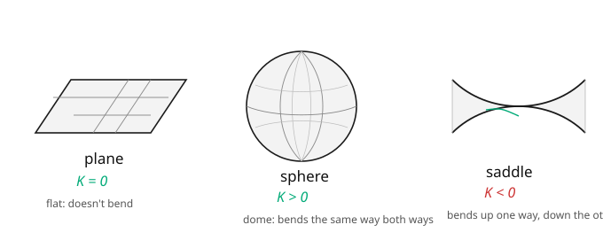

# Differential Geometry · Lesson 1.4: Gaussian curvature and the Theorema Egregium

> ⏱ ~15 min · Module 1: Curves and surfaces — the classical warm-up · Builds on: [1.3 The Gauss map and the second fundamental form](01-03-gauss-map-second-fundamental-form.md) · Unlocks: [2.1 Charts, atlases, and smooth manifolds](02-01-charts-atlases-smooth-manifolds.md)

## Why this matters

This is the summit of the classical theory and one of the great surprises in mathematics. We have two principal curvatures, defined *extrinsically* — they needed the ambient space and the normal vector. Multiply them and you get the **Gaussian curvature** $K$. Gauss's *Theorema Egregium* ("remarkable theorem") says: this product is **intrinsic** — it can be computed from the first fundamental form alone, from measurements made entirely inside the surface. The bending-into-space information mysteriously cancels in the product. This is *why* you cannot flatten a sphere onto a map without distortion (a cartographer's eternal headache), *why* a pizza slice stiffens when you fold it, and the conceptual seed of general relativity: gravity is intrinsic curvature of spacetime, detectable from inside, with no "outside" needed.

## The idea

Two principal curvatures, two natural ways to combine them:

- **Gaussian curvature** $K = k_1 k_2$ — the *product*. Sign tells you the local shape: both curvatures bending the same way ($K>0$) is dome-like (sphere); opposite ways ($K<0$) is saddle-like; one of them zero ($K=0$) is flat-in-a-direction (plane, cylinder, cone).
- **Mean curvature** $H = \tfrac12(k_1+k_2)$ — the *average*. It governs how a soap film minimizes area ($H=0$ surfaces are "minimal").

$K$ is the star. Here's the miracle. The principal curvatures individually are extrinsic — flatten the surface differently and they change. But the cylinder had $K = \frac1a\cdot 0 = 0$, exactly like the plane it unrolls to. That's not a coincidence: **any two surfaces that are intrinsically the same (isometric — same first fundamental form) have the same $K$ at corresponding points.** So $K$ can only depend on $\mathrm{I}$. The ant, armed with just its ruler, can compute $K$ — even though $K$ was *defined* using the outside normal it can't see. That's the Theorema Egregium.

## The formal version

The **Gaussian** and **mean** curvatures are

$$K = k_1 k_2 = \det S = \frac{eg - f^2}{EG - F^2}, \qquad H = \tfrac12(k_1 + k_2) = \tfrac12\operatorname{tr} S = \frac{eG - 2fF + gE}{2(EG - F^2)}.$$

*In words:* $K$ is the determinant of the shape operator, $H$ half its trace — the two rotation-invariants of a $2\times 2$ symmetric operator. The principal curvatures are recovered as $k_{1,2} = H \pm \sqrt{H^2 - K}$.

**Theorema Egregium (Gauss).** $K$ depends only on $E, F, G$ and their first and second derivatives — not on $e, f, g$. For **orthogonal** coordinates ($F = 0$) it is given by Gauss's formula

$$K = -\frac{1}{2\sqrt{EG}}\left[\frac{\partial}{\partial u}\!\left(\frac{G_u}{\sqrt{EG}}\right) + \frac{\partial}{\partial v}\!\left(\frac{E_v}{\sqrt{EG}}\right)\right].$$

*In words:* even though $K = \det S$ was built from the extrinsic second fundamental form, this formula recomputes the *same number* using only the intrinsic ruler. **Consequence (why it's "remarkable"):** isometric surfaces have equal $K$; hence no isometry (length-preserving map) can exist between surfaces of different $K$ — you cannot map a sphere ($K>0$) to a plane ($K=0$) without stretching.

## Picture

## Worked examples

**Example 1 (sphere, both ways — this is Boss Problem 1 in miniature).** *Extrinsically:* from [1.3](01-03-gauss-map-second-fundamental-form.md), the sphere of radius $a$ has $S = \frac1a\mathrm{Id}$, so $k_1 = k_2 = \frac1a$ and

$$K = k_1 k_2 = \frac{1}{a^2}.$$

*Intrinsically:* use only $\mathrm{I} = a^2\,d\theta^2 + a^2\sin^2\theta\,d\phi^2$, i.e. $E = a^2$, $F = 0$, $G = a^2\sin^2\theta$ (orthogonal, so Gauss's formula applies). Here $E_v = E_\phi = 0$ and $G_u = G_\theta = 2a^2\sin\theta\cos\theta$, with $\sqrt{EG} = a^2\sin\theta$. The second term dies; the first:

$$\frac{G_\theta}{\sqrt{EG}} = \frac{2a^2\sin\theta\cos\theta}{a^2\sin\theta} = 2\cos\theta, \qquad \frac{\partial}{\partial\theta}(2\cos\theta) = -2\sin\theta.$$

$$K = -\frac{1}{2a^2\sin\theta}\bigl(-2\sin\theta\bigr) = \frac{1}{a^2}.$$

**The two computations agree** — one used the normal vector in $\mathbb{R}^3$, the other used only distances measured on the sphere, and they land on the identical $1/a^2$. That equality *is* the Theorema Egregium.

**Example 2 (plane vs cylinder — equal $K$, unequal bending).** Plane: $k_1 = k_2 = 0$, so $K = 0$, $H = 0$. Cylinder radius $a$: $k_1 = \frac1a$, $k_2 = 0$, so

$$K = \tfrac1a\cdot 0 = 0, \qquad H = \tfrac12\!\left(\tfrac1a + 0\right) = \tfrac{1}{2a} \neq 0.$$

So the cylinder is **intrinsically flat** ($K = 0$, agreeing with the plane it unrolls to) yet **extrinsically curved** ($H \neq 0$, it visibly bends). $K$ is blind to the rolling; $H$ sees it. This is the cleanest illustration that $K$ lives *inside* the surface while $H$ does not.

## Watch out

- **You might think "curved in space" implies $K \neq 0$.** The cylinder and cone are curved in $\mathbb{R}^3$ but have $K = 0$ — they're intrinsically flat (an ant can't tell them from paper). Only *both* directions curving at once gives $K \neq 0$.
- **You might think $K$ needs the second fundamental form.** It was *defined* that way, but the Theorema Egregium says it's computable from $\mathrm{I}$ alone. When someone hands you only a metric (as in general relativity — there is no ambient space), you can still get its curvature.
- **You might swap the roles of $K$ and $H$.** $H = 0$ is the *minimal surface* condition (soap films), an extrinsic/variational notion. $K$ is the intrinsic one. Don't let "mean" and "Gaussian" blur — product vs average, intrinsic vs extrinsic.

## One-liner

> The product of the two principal curvatures, $K = k_1 k_2$, though defined from the outside, can be felt entirely from the inside — that's the Theorema Egregium, and it's why spheres refuse to become flat maps.

## Problems

**P1 (🟢)** For a sphere of radius $2$, state $k_1, k_2, K, H$. Then for a cylinder of radius $2$, do the same, and identify which quantity distinguishes them and which does not.

**P2 (🟡)** A surface of revolution has, at some point, principal curvatures $k_1 = 3$ (along the meridian) and $k_2 = -1$ (along the parallel). Compute $K$ and $H$, classify the point (dome/saddle/flat), and say what the opposite signs mean geometrically.

**P3 (🔴, optional)** Explain, using the Theorema Egregium, why a flat sheet of paper folded along a straight crease stays rigid in the direction across the crease (you can't bend a taco-folded slice downward at its tip). *Hint:* paper is inextensible, so any deformation is an isometry, so $K$ is preserved; what is $K$ for flat paper, and what would bending in a second direction do to it?

Solutions

**P1** Sphere radius $2$: $k_1 = k_2 = \frac12$, so $K = \frac14$, $H = \frac12$. Cylinder radius $2$: $k_1 = \frac12$, $k_2 = 0$, so $K = 0$, $H = \frac14$. The **Gaussian curvature $K$ distinguishes them** ($\frac14$ vs $0$) — and it's the intrinsic one, so a surface-dwelling ant *could* tell a sphere from a cylinder by internal measurement. Mean curvature happens to be nonzero for both and doesn't cleanly separate them.

**P2** $K = k_1 k_2 = (3)(-1) = -3 < 0$, $H = \frac12(3 + (-1)) = 1$. Since $K < 0$ the point is a **saddle**. Opposite signs mean the surface curves *toward* the normal along the meridian and *away* from it along the parallel — up one way, down the other, like a mountain pass or the inner throat of a torus.

**P3** Flat paper has $K = 0$ everywhere. Paper can't stretch, so any physical deformation is an isometry, and by the Theorema Egregium isometries preserve $K$ — the paper must keep $K = 0$ pointwise. But $K = k_1 k_2$, so at every point at least one principal curvature must stay $0$. Once you've folded (curved) the paper in one direction, giving that direction a nonzero principal curvature, the *other* principal direction is forced to $0$ — the paper becomes rigid (flat) across the fold. That's why a folded pizza slice or taco can't also droop at its tip: bending it there would make *both* principal curvatures nonzero, forcing $K \neq 0$, which the inextensible paper forbids. ∎

## Flashback

**From Lesson 1.3 (The Gauss map and the second fundamental form):** At a point, a surface has first fundamental form $\mathrm{I} = du^2 + dv^2$ and second fundamental form $\mathrm{II} = 2\,du^2 + dv^2$ (so $e = 2, f = 0, g = 1$). Find the principal curvatures and principal directions.

Solution

The shape operator is $S = \mathrm{I}^{-1}\mathrm{II}$. Since $\mathrm{I}$ is the identity matrix here, $S = \begin{pmatrix} 2 & 0 \\ 0 & 1\end{pmatrix}$. Its eigenvalues are the **principal curvatures** $k_1 = 2$, $k_2 = 1$, with principal directions the eigenvectors $\partial_u$ (for $k_1 = 2$) and $\partial_v$ (for $k_2 = 1$). As a check, $K = \det S = 2$ and $H = \frac12\operatorname{tr}S = \frac32$, consistent with $k_{1,2} = H \pm \sqrt{H^2 - K} = \frac32 \pm \frac12$. ✓

## Connections

- **Backward:** $K = \det S$, $H = \frac12\operatorname{tr}S$ package the shape operator of [1.3](01-03-gauss-map-second-fundamental-form.md); the sphere's $\mathrm{I}$ from [1.2](01-02-surfaces-first-fundamental-form.md) is what made the intrinsic computation possible.
- **Forward:** Module 2 abandons the ambient space entirely — surfaces become abstract **manifolds** ([2.1](02-01-charts-atlases-smooth-manifolds.md)) — and the Theorema Egregium is our license to do so: curvature survives without an outside. In [4.4](04-04-riemann-curvature-tensor.md) $K$ generalizes to the Riemann curvature tensor, and on a 2D surface it turns out $R = 2K$ (the scalar curvature is twice the Gaussian).
- **Sideways (relativity):** "curvature you detect from the inside, with no ambient space" is the entire conceptual basis of general relativity; spacetime's curvature is intrinsic, and Einstein's equations are a statement about it. Gauss's theorem is the first place this idea is provable.

*Module 1 capstone (Boss Problem 1): the sphere computation above — $K$ from the shape operator ($\det S$) versus $K$ from $\mathrm{I}$ alone (Gauss's formula), confirmed equal — is exactly the synthesis to reproduce for a torus or general surface of revolution.*
