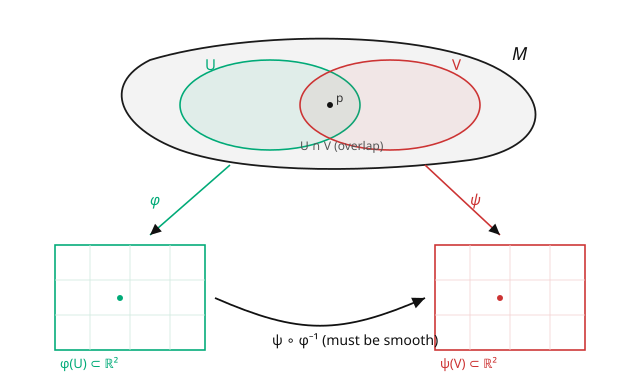

# Differential Geometry · Lesson 2.1: Charts, atlases, and smooth manifolds

> ⏱ ~15 min · Module 2: Smooth manifolds · Builds on: [1.4 Gaussian curvature and the Theorema Egregium](01-04-gaussian-curvature-theorema-egregium.md), [`topology`](../../topology/syllabus.md) (topological spaces) · Unlocks: [2.2 Smooth maps and diffeomorphisms](02-02-smooth-maps-diffeomorphisms.md)

## Why this matters

Module 1 lived inside $\mathbb{R}^3$: every surface was drawn in an ambient space. But the Theorema Egregium just told us curvature is *intrinsic* — it needs no outside. So why keep dragging one around? Spacetime in general relativity is not sitting inside a bigger space; the configuration space of a pendulum or a rigid body is a torus or a rotation group, not a subset of $\mathbb{R}^n$ in any natural way. This lesson makes the leap: define a curved space **from the inside**, using only coordinate patches and rules for how they overlap. This is the single most important definition in the subject — the **smooth manifold** — and everything after it (tangent vectors, tensors, curvature) is built on this scaffold.

## The idea

You already own an atlas: a book of flat map-pages covering the round Earth. No single flat page covers the whole globe without tearing, but overlapping pages do, and where two pages show the same city, you can translate between their grids. That translation is the only thing that has to be consistent.

A **manifold** is exactly this idea promoted to a definition. Take a space that, viewed up close, looks like ordinary $\mathbb{R}^n$ — locally flat, no exotic branching or thickness. Cover it with **charts**: patches equipped with coordinates, each a faithful flat map of a piece of the space. Where two charts overlap, the **transition map** re-expresses one chart's coordinates in the other's. Demand that every transition map be *smooth*, and you've defined a **smooth manifold**. The manifold is the real object; the charts are disposable bookkeeping; and — this is the crux — **smoothness is a property of the overlaps**, checked downstairs in $\mathbb{R}^n$ where "smooth" already means something.

The payoff: you never have to say what space the manifold "sits in." It carries its own geometry in the gluing.

## The formal version

Let $M$ be a topological space (Hausdorff and second-countable, to rule out pathologies). A **chart** is a pair $(U, \varphi)$ where $U \subseteq M$ is open and $\varphi: U \to \varphi(U) \subseteq \mathbb{R}^n$ is a homeomorphism onto an open set. Its component functions are **local coordinates**. Two charts $(U, \varphi)$, $(V, \psi)$ are **smoothly compatible** if the **transition map**

$$\psi \circ \varphi^{-1} : \varphi(U \cap V) \to \psi(U \cap V)$$

is a $C^\infty$ diffeomorphism between open subsets of $\mathbb{R}^n$ (vacuously true if $U \cap V = \varnothing$). *In words:* wherever two charts see the same points, translating from one coordinate grid to the other is infinitely differentiable — an ordinary calculus condition on maps $\mathbb{R}^n \to \mathbb{R}^n$.

A **smooth atlas** is a collection of pairwise-compatible charts covering $M$. A **smooth structure** is a maximal such atlas, and $M$ with one is a **smooth $n$-manifold**. *In words:* the dimension $n$ is how many coordinates each patch needs; smoothness is guaranteed everywhere because it holds on all overlaps.

The point of the definition is that it lets you *transport* calculus notions to $M$: a notion (like "smooth function," next lesson) is well-defined on $M$ if it holds in one chart and the smooth transition maps guarantee it holds in every other.

## Picture

## Worked examples

**Example 1 (the circle $S^1$ — two charts suffice).** No single coordinate covers $S^1$ (angle $\theta$ jumps by $2\pi$ somewhere). Use two. Chart $U = S^1 \setminus \{(-1,0)\}$ with angle $\varphi \in (-\pi, \pi)$; chart $V = S^1 \setminus \{(1,0)\}$ with angle $\psi \in (0, 2\pi)$. They overlap on the top and bottom arcs. On the top arc both agree ($\psi = \varphi$); on the bottom arc $\psi = \varphi + 2\pi$. Either way the transition map is $\psi = \varphi$ or $\psi = \varphi + 2\pi$ — a translation, certainly $C^\infty$. Two smoothly-compatible charts cover $S^1$: it's a smooth $1$-manifold. ✓

**Example 2 (the sphere $S^2$ — stereographic charts).** Project from the north pole onto the equatorial plane: $\varphi_N: S^2\setminus\{N\} \to \mathbb{R}^2$; and from the south pole: $\varphi_S: S^2\setminus\{S\} \to \mathbb{R}^2$. Two charts cover the sphere (every point misses at least one pole). Writing the plane as $\mathbb{C}$, the transition map on the overlap (the sphere minus both poles) works out to

$$\varphi_S \circ \varphi_N^{-1}(z) = \frac{z}{|z|^2} = \frac{1}{\bar z},$$

which is smooth on $\mathbb{C}\setminus\{0\}$ (as a real map $\mathbb{R}^2\setminus\{0\} \to \mathbb{R}^2\setminus\{0\}$). So $S^2$ is a smooth $2$-manifold — **without ever embedding it in $\mathbb{R}^3$**. The same sphere from [1.2](01-02-surfaces-first-fundamental-form.md), now defined purely by its charts and their overlap.

## Watch out

- **You might think a manifold "is" its coordinates.** Coordinates are chart-dependent scaffolding; the manifold is what survives changing them. Any statement you make about $M$ must be *chart-independent* (or provably the same in every chart) to be geometrically meaningful — that discipline is what the rest of the course enforces.
- **You might think you need one big coordinate system.** Most manifolds admit none — $S^1$, $S^2$, the torus all require at least two charts. That's not a defect; it's the reason the atlas idea exists. Insisting on a single global chart is what breaks.
- **You might forget the topological fine print.** "Locally looks like $\mathbb{R}^n$" plus Hausdorff plus second-countable. Drop Hausdorff and you get monsters like "the line with two origins." The topology (from [`topology`](../../topology/syllabus.md)) is doing quiet but real work underneath.

## One-liner

> A smooth manifold is a space stitched from flat coordinate patches whose overlaps glue together smoothly — geometry defined entirely from the inside, no ambient space required.

## Problems

**P1 (🟢)** The open interval $(0,1)$ and the real line $\mathbb{R}$ are both smooth $1$-manifolds coverable by a single chart. Give an explicit smooth chart identifying $(0,1)$ with $\mathbb{R}$ (hence a diffeomorphism). Why does this show "how big it looks" is not part of a manifold's smooth structure?

**P2 (🟡)** On $S^1$ with the two angle charts of Example 1, suppose a third person insists on the single "coordinate" $\theta \in [0, 2\pi)$ over the *whole* circle. Explain precisely why $(S^1, \theta)$ fails to be a chart, pinpointing the property in the definition that breaks.

**P3 (🔴, optional)** The torus $T^2$ can be built as $\mathbb{R}^2 / \mathbb{Z}^2$ (the plane with points differing by integer vectors identified). Describe an atlas: what do small charts look like, and why are the transition maps just translations by integer vectors (hence smooth)? How many charts do you need to cover $T^2$? (A rough argument for a small finite number suffices.)

Solutions

**P1** The map $\varphi(x) = \tan\!\left(\pi\left(x - \tfrac12\right)\right)$ sends $(0,1)$ bijectively and smoothly onto $\mathbb{R}$, with smooth inverse $\varphi^{-1}(y) = \frac12 + \frac1\pi\arctan y$. So $(0,1)$ and $\mathbb{R}$ are diffeomorphic — indistinguishable as smooth manifolds. This shows metric size (bounded vs infinite) is *not* smooth-structure data; a manifold's smooth structure knows about differentiability, not distances. (To talk about size you'd add a **metric** — Module 5.)

**P2** A chart must be a homeomorphism onto an *open* subset of $\mathbb{R}^n$. The map $S^1 \to [0, 2\pi)$ is a bijection, but $[0,2\pi)$ is **not open** in $\mathbb{R}$ (the endpoint $0$ has no room to its left), and worse, the map is not continuous as an inverse: points just before $2\pi$ and just after $0$ are neighbors on the circle but land at opposite ends of the interval. So it's not a homeomorphism onto an open set — it fails the very first requirement of being a chart. This is exactly why you need (at least) two overlapping charts.

**P3** A chart is any small open square in $\mathbb{R}^2$ of side $< 1$: within it no two points are identified, so it maps homeomorphically to a patch of $T^2$. If two such squares' patches overlap on $T^2$, their preimages in $\mathbb{R}^2$ differ by an integer vector $(m,n) \in \mathbb{Z}^2$, so the transition map is $x \mapsto x + (m,n)$ — a translation, which is $C^\infty$. You can cover $T^2$ with a handful of such squares; a clean minimal-ish cover uses a $2\times 2$ grid style arrangement, and in fact three charts suffice (though four is easier to picture). The transition maps being integer translations is what makes $T^2$ a smooth manifold. ∎

## Flashback

**From Lesson 1.2 (Surfaces and the first fundamental form):** For the sphere of radius $a$, write down the first fundamental form in $(\theta, \phi)$ coordinates, and use it to state the length of the equator.

Solution

$\mathrm{I} = a^2\,d\theta^2 + a^2\sin^2\theta\,d\phi^2$. The equator is $\theta = \pi/2$, so $d\theta = 0$ and $ds = a\sin(\pi/2)\,d\phi = a\,d\phi$; length $= \int_0^{2\pi} a\,d\phi = 2\pi a$. (Notice the parametrization $\mathbf{x}(\theta,\phi)$ is really a *chart* on $S^2$ — the language of Module 1 was the manifold language all along, just with an ambient embedding attached.) ✓

## Connections

- **Backward:** a Module 1 parametrization $\mathbf{x}: U \to \mathbb{R}^3$ was secretly a chart's *inverse*; we've now dropped the target $\mathbb{R}^3$ and kept only the coordinate domain. The Theorema Egregium ([1.4](01-04-gaussian-curvature-theorema-egregium.md)) is the license for doing so.
- **Forward:** [2.2](02-02-smooth-maps-diffeomorphisms.md) uses transition maps to define *smooth maps between manifolds*; [2.3](02-03-tangent-space.md) builds tangent vectors chart-independently — every construction from here leans on "check it in a chart, transition maps make it consistent."
- **Sideways (physics):** a system's configuration space is a manifold — a double pendulum lives on a torus $T^2$, a rigid body's orientations on the rotation group $SO(3)$. Charts are the "generalized coordinates" of [`analytical-mechanics`](../../analytical-mechanics/syllabus.md), and the freedom to change them is why Lagrangian mechanics is coordinate-agnostic.
