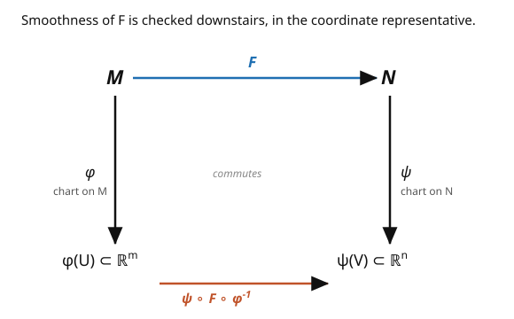

# Differential Geometry · Lesson 2.2: Smooth maps and diffeomorphisms

> ⏱ ~15 min · Module 2: Smooth manifolds · Builds on: [2.1 Charts, atlases, and smooth manifolds](02-01-charts-atlases-smooth-manifolds.md) · Unlocks: [2.3 The tangent space, done carefully](02-03-tangent-space.md)

## Why this matters

We have manifolds; now we need the maps between them, and the right notion of two manifolds being "the same." Without a notion of smooth map you can't say a rotation of the sphere is smooth, can't define a flow, can't even ask whether two spaces are equivalent. And the flip side — the **regular value theorem** — is a factory: it manufactures manifolds on demand ("the solution set of these smooth equations is a manifold"), which is how spheres, tori, and the classical matrix groups $SO(n)$, $SU(n)$ actually get built in practice. Nearly every manifold you meet in physics arrives as the level set of some smooth constraint.

## The idea

How do you check a map $F: M \to N$ between two curved spaces is smooth, when neither is $\mathbb{R}^n$? You can't differentiate on $M$ directly. So use the charts: read $M$'s points through a chart (get coordinates in $\mathbb{R}^m$), read $N$'s points through a chart (coordinates in $\mathbb{R}^n$), and look at the resulting map $\mathbb{R}^m \to \mathbb{R}^n$ — the **coordinate representative**. That's an ordinary map between Euclidean spaces, where "smooth" already means something. $F$ is smooth if its coordinate representative is. And crucially, because transition maps are smooth ([2.1](02-01-charts-atlases-smooth-manifolds.md)), the answer doesn't depend on which charts you picked — switch charts and you compose with smooth transitions, which can't wreck smoothness.

A **diffeomorphism** is a smooth map with a smooth inverse — the manifold version of "isomorphism." Diffeomorphic manifolds are literally the same smooth object wearing different clothes.

Then the productive question flips around: instead of "is this map smooth?", ask "what does a smooth map's *derivative* look like?" Its **rank** (how many independent directions survive) sorts maps into immersions, submersions, and embeddings — and when a map to $\mathbb{R}^k$ has full rank at a value, the preimage of that value is automatically a manifold. That last fact is the regular value theorem.

## The formal version

Let $M^m, N^n$ be smooth manifolds. A map $F: M \to N$ is **smooth** if for every $p \in M$ there are charts $(U, \varphi)$ around $p$ and $(V, \psi)$ around $F(p)$ with $F(U) \subseteq V$ such that the **coordinate representative**

$$\hat F = \psi \circ F \circ \varphi^{-1} : \varphi(U) \subseteq \mathbb{R}^m \to \psi(V) \subseteq \mathbb{R}^n$$

is $C^\infty$. *In words:* express $F$ in coordinates on both ends and it should be an ordinary smooth map of Euclidean spaces; smoothly-compatible charts make this independent of the choices.

$F$ is a **diffeomorphism** if it is a smooth bijection with smooth inverse; then $M$ and $N$ are **diffeomorphic**, indistinguishable as smooth manifolds.

The **rank** of $F$ at $p$ is the rank of the Jacobian of $\hat F$. Call $F$ an **immersion** if $\operatorname{rank} = m$ everywhere (nothing collapses), a **submersion** if $\operatorname{rank} = n$ everywhere (nothing is missed), and an **embedding** if it's an immersion that is also a homeomorphism onto its image. A **submanifold** is the image of an embedding.

**Regular value theorem.** Let $F: M^m \to N^n$ be smooth and let $c \in N$ be a **regular value** (meaning $F$ is a submersion at every point of $F^{-1}(c)$). Then $F^{-1}(c)$ is a smooth submanifold of $M$ of dimension $m - n$. *In words:* if a smooth constraint has a nondegenerate ("full-rank") derivative along its solution set, the solution set is a manifold, and each independent equation cuts the dimension by one.

## Picture

## Worked examples

**Example 1 (a smooth map into the circle).** Define $F: \mathbb{R} \to S^1$ by $F(t) = (\cos t, \sin t)$. Take the angle chart $\psi$ on $S^1$ around a point $F(t_0)$, where $\psi$ just returns the angle. The coordinate representative is $\psi \circ F(t) = t$ (mod the chart's branch) — the identity, certainly $C^\infty$. So $F$ is smooth. Its derivative never vanishes ($F'(t) = (-\sin t, \cos t) \neq 0$), so $F$ is an **immersion**; it is *not* injective ($t$ and $t + 2\pi$ collide), so not an embedding — it's the infinite covering of the circle by the line.

**Example 2 (the sphere as a level set — the regular value theorem in action).** Let $F: \mathbb{R}^3 \to \mathbb{R}$, $F(x, y, z) = x^2 + y^2 + z^2$. Its derivative is $DF = (2x, 2y, 2z)$, which has rank $1$ (is a submersion) except at the origin. The value $c = 1$ is a **regular value**: on $F^{-1}(1)$ we have $(x,y,z) \neq 0$, so $DF \neq 0$ there. By the theorem, $F^{-1}(1) = S^2$ is a smooth submanifold of $\mathbb{R}^3$ of dimension $3 - 1 = 2$. No charts needed by hand — one constraint with nonvanishing gradient delivers the manifold. (The same move builds $SO(n)$ from the constraint $A^\top A = I$, and $S^{n-1}$ from $\sum x_i^2 = 1$.)

## Watch out

- **You might worry the definition depends on the charts chosen.** It doesn't — that's the whole reason we required smooth transition maps. Change charts and $\hat F$ becomes $(\psi' \circ \psi^{-1}) \circ \hat F \circ (\varphi \circ \varphi'^{-1})$, a composition of smooth maps, still smooth. Chart-independence is a theorem, not an accident.
- **You might think "smooth bijection" is enough for diffeomorphism.** You need the *inverse* smooth too. Counterexample: $f(x) = x^3$ on $\mathbb{R}$ is a smooth bijection, but $f^{-1}(y) = y^{1/3}$ is not differentiable at $0$ — not a diffeomorphism.
- **You might apply the regular value theorem at a critical value.** If $c$ is *not* regular (the derivative drops rank somewhere on the preimage), the level set can fail to be a manifold — e.g. $F(x,y) = x^2 - y^2$ at $c = 0$ gives a crossing pair of lines (a corner at the origin, where $DF = 0$). Regularity is essential.

## One-liner

> A map between manifolds is smooth if it's smooth in charts (chart choice can't change the answer), and the regular value theorem turns any full-rank constraint into a manifold for free.

## Problems

**P1 (🟢)** Show the antipodal map $A: S^2 \to S^2$, $A(x) = -x$, is smooth, and argue it is a diffeomorphism. (You may work in stereographic charts, or argue via its restriction from the smooth map $x \mapsto -x$ on $\mathbb{R}^3$.)

**P2 (🟡)** Use the regular value theorem to show the torus of revolution, the set $\left(\sqrt{x^2+y^2} - R\right)^2 + z^2 = r^2$ in $\mathbb{R}^3$ (with $0 < r < R$), is a smooth $2$-manifold. Identify the function $F$, its regular value, and where you must check the gradient is nonzero.

**P3 (🔴, optional)** Show $SO(2) = \{A \in \mathbb{R}^{2\times 2} : A^\top A = I,\ \det A = 1\}$ is a $1$-dimensional manifold diffeomorphic to $S^1$. *Hint:* every such $A$ is a rotation matrix $\begin{pmatrix}\cos\theta & -\sin\theta \\ \sin\theta & \cos\theta\end{pmatrix}$; build an explicit smooth bijection to $S^1$ with smooth inverse.

Solutions

**P1** The map $\tilde A: \mathbb{R}^3 \to \mathbb{R}^3$, $\tilde A(x) = -x$, is linear hence smooth, and it maps $S^2$ to $S^2$ (preserves $|x| = 1$). Restriction of a smooth ambient map to a submanifold is smooth, so $A$ is smooth. It is its own inverse ($A \circ A = \mathrm{id}$), which is therefore also smooth, so $A$ is a diffeomorphism. ✓

**P2** Let $F(x,y,z) = \left(\sqrt{x^2+y^2} - R\right)^2 + z^2$, defined and smooth away from the $z$-axis (where $\sqrt{x^2+y^2}=0$; but the torus, needing $\sqrt{x^2+y^2} = R \pm(\text{something}) \geq R - r > 0$, stays away from the axis). The torus is $F^{-1}(r^2)$. Compute the gradient; with $\rho = \sqrt{x^2+y^2}$, $\partial_z F = 2z$ and the horizontal part has magnitude $2|\rho - R|$. On the torus, $(\rho - R)^2 + z^2 = r^2 > 0$, so $\rho - R$ and $z$ are never simultaneously zero, hence $\nabla F \neq 0$ on $F^{-1}(r^2)$. Thus $r^2$ is a regular value and the torus is a smooth $3 - 1 = 2$-manifold. ✓

**P3** Map $\Phi: S^1 \to SO(2)$ by $\Phi(\cos\theta, \sin\theta) = \begin{pmatrix}\cos\theta & -\sin\theta \\ \sin\theta & \cos\theta\end{pmatrix}$. Every element of $SO(2)$ has this form (orthonormal columns with determinant $+1$ force the rotation shape), so $\Phi$ is a bijection. In coordinates it's built from $\cos, \sin$ — smooth — and its inverse reads off $(\cos\theta, \sin\theta)$ from the first column, also smooth. So $\Phi$ is a diffeomorphism and $SO(2) \cong S^1$, a $1$-manifold. ∎

## Flashback

**From Lesson 2.1 (Charts, atlases, and smooth manifolds):** Put the two stereographic charts on the *circle* $S^1$ — project from the north pole $(0,1)$ via $\varphi_N(x,y) = \frac{x}{1-y}$ and from the south pole $(0,-1)$ via $\varphi_S(x,y) = \frac{x}{1+y}$. Compute the transition map $\varphi_S \circ \varphi_N^{-1}$ and confirm it is smooth on its domain.

Solution

Let $u = \varphi_N(x,y) = \frac{x}{1-y}$. Inverting on $S^1$ (using $x^2 + y^2 = 1$) gives $\varphi_N^{-1}(u) = \left(\frac{2u}{u^2+1}, \frac{u^2-1}{u^2+1}\right)$. Then

$$\varphi_S\bigl(\varphi_N^{-1}(u)\bigr) = \frac{x}{1+y} = \frac{2u/(u^2+1)}{1 + (u^2-1)/(u^2+1)} = \frac{2u/(u^2+1)}{2u^2/(u^2+1)} = \frac{1}{u}.$$

So the transition map is $u \mapsto 1/u$, which is $C^\infty$ on its domain $u \neq 0$ (the overlap excludes both poles). Two smoothly-compatible charts — $S^1$ is a smooth manifold, confirmed again. ✓

## Connections

- **Backward:** smoothness "checked in charts, independent of choice" is exactly the payoff of [2.1](02-01-charts-atlases-smooth-manifolds.md)'s smooth transition maps — this lesson cashes that in.
- **Forward:** the *derivative* of a smooth map, promoted to a linear map between tangent spaces, is the **pushforward** ([2.4](02-04-vector-fields-pushforward.md)); rank and the regular value theorem are its rank made global.
- **Sideways (physics):** symmetry groups arrive as regular level sets — $SO(3)$ (rigid-body orientations, [`analytical-mechanics`](../../analytical-mechanics/syllabus.md)) and $SU(2), SU(3)$ (gauge groups, [`qft`](../../qft/syllabus.md)) are all manifolds via $A^\dagger A = I$, and their smooth structure is what lets you differentiate along them.
