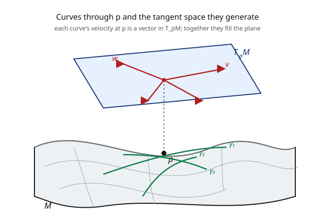

# Differential Geometry · Lesson 2.3: The tangent space, done carefully

> ⏱ ~15 min · Module 2: Smooth manifolds · Builds on: [2.2 Smooth maps and diffeomorphisms](02-02-smooth-maps-diffeomorphisms.md) · Unlocks: [2.4 Vector fields and the pushforward](02-04-vector-fields-pushforward.md)

## Why this matters

On a surface in $\mathbb{R}^3$ a tangent vector was easy: an arrow lying in the tangent plane, living in the ambient space. But an abstract manifold has *no ambient space* — there is no bigger room for an arrow to point into. So what *is* a tangent vector on a manifold defined only by charts? Getting this right is the linchpin of the whole subject: every later object — vector fields, the metric, curvature, the geodesic equation — is built on tangent vectors. The resolution is one of the most elegant re-framings in mathematics: **a tangent vector is not an arrow, it's a way of differentiating.** Once you internalize that, coordinate-free geometry stops feeling like a trick.

## The idea

You want to capture "a direction and speed at a point $p$" without an arrow. Two honest ways:

**(a) Velocities of curves.** Draw a curve through $p$ and take its velocity there. Two curves that agree to first order at $p$ (same position, same velocity in any chart) should count as the *same* tangent vector. So a tangent vector is an equivalence class of curves through $p$. Concrete, but clunky.

**(b) Directional derivatives.** Here's the clean idea. What does a tangent vector *do*? It differentiates functions in its direction. Give me a vector $v$ and a function $f$, and I can form the directional derivative $v(f)$ — the rate $f$ changes as you move along $v$. This operation is **linear** ($v(af + bg) = a\,v(f) + b\,v(g)$) and obeys the **Leibniz product rule** ($v(fg) = f(p)\,v(g) + g(p)\,v(f)$). Astonishingly, *any* operation with those two properties is a directional derivative — so we can simply **define** a tangent vector to be such an operation, called a **derivation**. No arrow, no ambient space, pure calculus.

The two definitions describe the same thing: a curve's velocity acts on functions by $\frac{d}{dt}f(\gamma(t))\big|_0$, which is a derivation; and every derivation comes from some curve. Either way you get an $n$-dimensional vector space $T_pM$, with the coordinate directions $\partial/\partial x^1, \dots, \partial/\partial x^n$ as a basis.

## The formal version

Fix $p$ in a smooth $n$-manifold $M$; let $C^\infty(M)$ be the smooth real-valued functions.

**Derivation definition.** A **tangent vector** at $p$ is a linear map $v: C^\infty(M) \to \mathbb{R}$ satisfying the **Leibniz rule**

$$v(fg) = f(p)\,v(g) + g(p)\,v(f).$$

*In words:* $v$ is a gadget that eats a function and returns a number — its rate of change at $p$ in $v$'s direction — behaving like a derivative. The set of all such $v$ is the **tangent space** $T_pM$, a real vector space (add derivations, scale them).

**Curve definition.** Equivalently, $v = [\gamma]$ is an equivalence class of smooth curves $\gamma$ with $\gamma(0) = p$, where $\gamma_1 \sim \gamma_2$ iff $(\varphi\circ\gamma_1)'(0) = (\varphi\circ\gamma_2)'(0)$ in some (hence any) chart $\varphi$. The class acts as a derivation by $v(f) = \frac{d}{dt}\big|_{0} f(\gamma(t))$.

**Coordinate basis.** In a chart $(U, \varphi)$ with coordinates $x^1, \dots, x^n$, the operators

$$\left.\frac{\partial}{\partial x^i}\right|_p f := \frac{\partial (f \circ \varphi^{-1})}{\partial x^i}\bigg|_{\varphi(p)}$$

are derivations, and they form a **basis** of $T_pM$. So every tangent vector is $v = v^i\,\dfrac{\partial}{\partial x^i}\big|_p$ (sum over $i$ — Einstein convention), and $\dim T_pM = n = \dim M$. *In words:* a tangent vector is fixed by its $n$ components $v^i$ along the coordinate directions, exactly as expected — but the "directions" are differentiation operators, not arrows.

## Picture

## Worked examples

**Example 1 (derivations on $\mathbb{R}^2$ are ordinary vectors).** On $M = \mathbb{R}^2$ with coordinates $(x, y)$, take $v = a\,\partial_x|_p + b\,\partial_y|_p$. Acting on $f$: $v(f) = a\,f_x(p) + b\,f_y(p)$ — precisely the directional derivative of $f$ in the direction $(a, b)$. Conversely, one proves every derivation at $p$ has this form (Taylor-expand $f$ around $p$ and apply Leibniz; constants get killed, the linear part survives). So $T_p\mathbb{R}^2 \cong \mathbb{R}^2$: the abstract definition recovers the arrows you already knew, and the components $(a,b)$ are the arrow. The reframing costs nothing in flat space — and buys everything in curved space.

**Example 2 (a curve's velocity as a derivation on the sphere).** On $S^2$, take the curve $\gamma(t) = (\sin t, 0, \cos t)$ — a great circle through the north pole $p = (0,0,1)$ at $t = 0$. Its velocity acts on a test function $f: S^2 \to \mathbb{R}$ by

$$v(f) = \frac{d}{dt}\Big|_0 f(\gamma(t)) = \nabla f(p) \cdot \gamma'(0), \qquad \gamma'(0) = (1, 0, 0).$$

So $v = [\gamma]$ differentiates functions in the $(1,0,0)$ direction along the sphere — a bona fide element of $T_pS^2$, with no reference to an arrow "sticking out" of the sphere. Two great circles with the same velocity at $p$ define the *same* $v$; that's the equivalence relation at work.

## Watch out

- **You might picture a tangent vector as an arrow in some surrounding space.** On an abstract manifold there is none. The honest picture is "a rate-of-change operator" (derivation) or "a class of curves." When a manifold *does* sit in $\mathbb{R}^N$, the two views agree — but the intrinsic one is the definition.
- **You might think $\partial/\partial x^i$ is basis-independent.** It depends on the *whole* chart, not just the $i$-th coordinate: changing the other coordinates changes what "hold them fixed, vary $x^i$" means. Under a change of coordinates the basis transforms by the Jacobian — the source of the vector transformation law ([2.5](02-05-covectors-cotangent-space.md), [3.1](03-01-tensors-multilinear-maps.md)).
- **You might expect the Leibniz rule to be automatic.** It's the *defining* restriction. Plenty of linear maps $C^\infty \to \mathbb{R}$ (e.g. $f \mapsto f(p)^2$, or a second derivative) are not derivations. Leibniz is exactly what forces "first-order," i.e. a genuine tangent direction.

## One-liner

> A tangent vector on a manifold isn't an arrow — it's a derivation, a way of taking directional derivatives — and the coordinate operators $\partial/\partial x^i$ are its basis, making $T_pM$ an $n$-dimensional vector space with no ambient space in sight.

## Problems

**P1 (🟢)** On $\mathbb{R}^3$ with coordinates $(x,y,z)$, let $v = 2\,\partial_x - \partial_y + 3\,\partial_z$ at the point $p = (1,1,1)$. Compute $v(f)$ for $f(x,y,z) = x^2 y + z$. Then verify the Leibniz rule for $v$ on the product $f g$ with $g = z$ (i.e. check $v(fg) = f(p)v(g) + g(p)v(f)$).

**P2 (🟡)** Show directly that any derivation $v$ at a point annihilates constants: $v(c) = 0$ for a constant function $c$. *Hint:* apply Leibniz to $1 = 1\cdot 1$, then use linearity.

**P3 (🔴, optional)** Two curves through $p = (0,0)$ in $\mathbb{R}^2$: $\gamma_1(t) = (t, t^2)$ and $\gamma_2(t) = (t, \sin t \cdot t)$... actually $\gamma_2(t) = (t, t + t^2)$. Do they define the same tangent vector at $p$? Compute each velocity at $t=0$, and state the tangent vector as a derivation $a\,\partial_x + b\,\partial_y$ for each. If they differ, say in which component and why the higher-order terms are irrelevant.

Solutions

**P1** $f_x = 2xy$, $f_y = x^2$, $f_z = 1$; at $p=(1,1,1)$ these are $2, 1, 1$. So $v(f) = 2(2) + (-1)(1) + 3(1) = 4 - 1 + 3 = 6$. Leibniz check with $g = z$: $g(p) = 1$, $v(g) = 3$ (only the $\partial_z$ term), $f(p) = 1^2\cdot 1 + 1 = 2$. Then $fg = (x^2y + z)z = x^2yz + z^2$; $(fg)_x = 2xyz$, $(fg)_y = x^2 z$, $(fg)_z = x^2 y + 2z$; at $p$: $2, 1, 3$. So $v(fg) = 2(2) + (-1)(1) + 3(3) = 4 - 1 + 9 = 12$. And $f(p)v(g) + g(p)v(f) = 2(3) + 1(6) = 12$. ✓

**P2** Let $\mathbf{1}$ be the constant function $1$. Leibniz on $\mathbf{1} = \mathbf{1}\cdot\mathbf{1}$: $v(\mathbf{1}) = \mathbf{1}(p)v(\mathbf{1}) + \mathbf{1}(p)v(\mathbf{1}) = 2v(\mathbf{1})$, so $v(\mathbf{1}) = 0$. For a general constant $c = c\cdot\mathbf{1}$, linearity gives $v(c) = c\,v(\mathbf{1}) = 0$. So derivations see only *changes*, not offsets — matching "directional derivative." ∎

**P3** $\gamma_1'(0) = \frac{d}{dt}(t, t^2)\big|_0 = (1, 0)$, giving the derivation $\partial_x$ (i.e. $a=1, b=0$). $\gamma_2'(0) = \frac{d}{dt}(t, t+t^2)\big|_0 = (1, 1)$, giving $\partial_x + \partial_y$ ($a=1, b=1$). They **differ** — in the $y$-component ($0$ vs $1$). The equivalence relation only sees the first-order data $(\varphi\circ\gamma)'(0)$; $\gamma_1$'s $t^2$ is second order and invisible, while $\gamma_2$'s genuine linear term $+t$ in $y$ registers. So $[\gamma_1] \neq [\gamma_2]$. ∎

## Flashback

**From Lesson 2.2 (Smooth maps and diffeomorphisms):** Show the "height function" $h: S^2 \to \mathbb{R}$, $h(x,y,z) = z$ (restricted from the ambient $\mathbb{R}^3$), is smooth. Then name the two points where its derivative vanishes.

Solution

$h$ is the restriction to $S^2$ of the linear (hence smooth) map $(x,y,z) \mapsto z$ on $\mathbb{R}^3$; the restriction of a smooth ambient map to a smooth submanifold is smooth, so $h$ is smooth. Its derivative along the sphere vanishes exactly where the ambient gradient $(0,0,1)$ is *normal* to $S^2$ — i.e. parallel to the radial direction — which happens at the two poles $(0,0,\pm 1)$. These are the critical points (max at the north pole, min at the south). ✓

## Connections

- **Backward:** the "velocity of a curve" definition is [1.1](01-01-curves-arclength-frenet.md)'s $\gamma'(s)$ stripped of its ambient arrow; smoothness of the curve and of test functions leans on [2.2](02-02-smooth-maps-diffeomorphisms.md).
- **Forward:** [2.4](02-04-vector-fields-pushforward.md) assembles a tangent vector at every point into a **vector field** and pushes vectors through maps; [2.5](02-05-covectors-cotangent-space.md) builds the dual space of covectors. The covariant derivative ([4.1](04-01-covariant-derivative-christoffel.md)) is ultimately about differentiating these.
- **Sideways (quantum mechanics):** "operators, not arrows" echoes the operator formalism — momentum *is* the derivation $-i\hbar\,\partial_x$. The Leibniz rule here is the same product rule that makes momentum a derivation on observables; the abstract-vector-as-operator instinct transfers directly.
