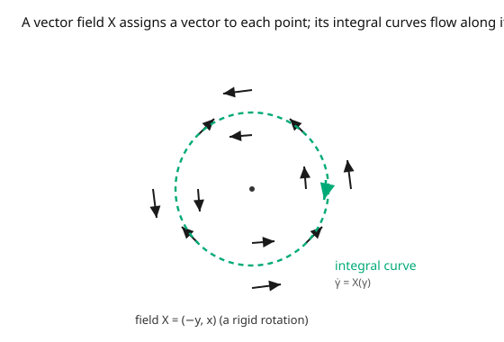

# Differential Geometry · Lesson 2.4: Vector fields and the pushforward

> ⏱ ~15 min · Module 2: Smooth manifolds · Builds on: [2.3 The tangent space, done carefully](02-03-tangent-space.md) · Unlocks: [2.5 Covectors and the cotangent space](02-05-covectors-cotangent-space.md)

## Why this matters

One tangent vector is a direction at a point. A **vector field** is a direction at *every* point — a wind blowing across the manifold — and that's what physics runs on: velocity fields of fluids, force fields, the generator of a flow or a symmetry. Two operations make fields dynamical. The **pushforward** carries vectors through a map (the coordinate-free chain rule — how a velocity transforms), and the **flow** integrates a field into actual motion. And the **Lie bracket** of two fields measures whether flowing along one then the other differs from doing it in the opposite order — the first genuinely noncommutative structure of the subject, and the seed of curvature and of conservation laws.

## The idea

A vector field $X$ picks a tangent vector $X_p \in T_pM$ smoothly at each $p$; in coordinates $X = X^i(x)\,\partial_i$, just $n$ ordinary functions (the components) times the basis derivations. Because each $X_p$ is a derivation, $X$ acts on a function $f$ to give a new function $X(f)$ — the derivative of $f$ along the wind.

**Pushforward.** A smooth map $F: M \to N$ should carry velocities forward: if you're moving with velocity $v$ at $p$, then $F$ carries you along, and your new velocity at $F(p)$ is the **pushforward** $dF_p(v)$. Concretely it's the Jacobian matrix of $F$ acting on components — the chain rule, said without coordinates. This is the derivative of $F$, promoted from "matrix of partials" to "linear map between tangent spaces."

**Flow.** A vector field is a differential equation waiting to be solved: the **integral curve** through $p$ is the path $\gamma$ with $\dot\gamma(t) = X_{\gamma(t)}$ — go where the arrow at your feet points, always. Collecting all integral curves gives the **flow**, a family of maps sliding the whole manifold along $X$.

**Lie bracket.** Flow along $X$ for a moment, then along $Y$; versus $Y$ then $X$. On a curved or twisted field these don't land in the same place, and the discrepancy is itself a vector field, the **Lie bracket** $[X, Y]$. As an operator it's just $XY - YX$ acting on functions — the second-order parts cancel, leaving a first-order derivation.

## The formal version

A **(smooth) vector field** is a smooth assignment $X: p \mapsto X_p \in T_pM$; in a chart $X = X^i\,\partial_i$ with smooth components $X^i$. It acts on $f \in C^\infty(M)$ by $(Xf)(p) = X_p(f) = X^i(p)\,\partial_i f(p)$.

**Pushforward (differential).** For smooth $F: M \to N$ and $v \in T_pM$, define $dF_p(v) \in T_{F(p)}N$ by how it differentiates functions on $N$:

$$\bigl(dF_p(v)\bigr)(g) = v(g \circ F), \qquad g \in C^\infty(N).$$

*In words:* the pushed-forward vector differentiates a function on $N$ by first pulling it back through $F$ and differentiating that on $M$. In coordinates, $dF_p$ is the **Jacobian matrix** $\left(\dfrac{\partial F^a}{\partial x^i}\right)$ acting on the component column $v^i$: $\ (dF(v))^a = \dfrac{\partial F^a}{\partial x^i} v^i$.

**Integral curves and flow.** An **integral curve** of $X$ is a curve $\gamma$ with $\dot\gamma(t) = X_{\gamma(t)}$, i.e. in coordinates $\dot\gamma^i = X^i(\gamma)$ — an ODE with a unique solution through each point (short-time). The **flow** $\theta_t$ sends $p$ to $\gamma(t)$ along its integral curve; each $\theta_t$ is a diffeomorphism and $\theta_s \circ \theta_t = \theta_{s+t}$.

**Lie bracket.** For vector fields $X, Y$, the **Lie bracket** $[X, Y]$ is the vector field acting by $[X,Y]f = X(Yf) - Y(Xf)$, with components

$$[X, Y]^k = X^i\,\partial_i Y^k - Y^i\,\partial_i X^k.$$

*In words:* $[X,Y]$ is the infinitesimal failure of the flows of $X$ and $Y$ to commute; $[X,Y] = 0$ iff you can flow along them in either order and land in the same place.

## Picture

## Worked examples

**Example 1 (pushforward is the Jacobian).** Let $F: \mathbb{R}^2 \to \mathbb{R}^2$, $F(x,y) = (x^2, xy)$. Its Jacobian is $\ \dfrac{\partial F}{\partial(x,y)} = \begin{pmatrix} 2x & 0 \\ y & x \end{pmatrix}$. At the point $p = (1, 2)$, push forward $v = 3\,\partial_x + 1\,\partial_y$ (components $(3,1)$):

$$dF_p(v) = \begin{pmatrix} 2 & 0 \\ 2 & 1 \end{pmatrix}\begin{pmatrix} 3 \\ 1 \end{pmatrix} = \begin{pmatrix} 6 \\ 7 \end{pmatrix} = 6\,\partial_u + 7\,\partial_v,$$

a tangent vector at $F(p) = (1, 2)$. That's the chain rule: a velocity $v$ through $p$ becomes velocity $dF(v)$ through $F(p)$. The pushforward is exactly the derivative of $F$, now understood as a linear map $T_p\mathbb{R}^2 \to T_{F(p)}\mathbb{R}^2$.

**Example 2 (a nonzero Lie bracket).** Take $X = \partial_x$ and $Y = x\,\partial_y$ on $\mathbb{R}^2$. Compute on a test function $f$:

$$X(Yf) = \partial_x(x\,f_y) = f_y + x\,f_{xy}, \qquad Y(Xf) = x\,\partial_y(f_x) = x\,f_{xy}.$$

$$[X,Y]f = X(Yf) - Y(Xf) = f_y \quad\Longrightarrow\quad [X, Y] = \partial_y \neq 0.$$

The second-order term $x f_{xy}$ cancelled (as it must — a bracket is first-order). Interpretation: flowing along $X$ (rightward) changes *where* you are in $x$, which changes how strong $Y = x\,\partial_y$ is, so the order matters — and the mismatch is a genuine $\partial_y$ push. Check via the component formula: $[X,Y]^y = X^x\partial_x(Y^y) - Y^i\partial_i(X^y) = 1\cdot\partial_x(x) - 0 = 1$, and $[X,Y]^x = 0$. ✓

## Watch out

- **You might try to push a whole vector *field* forward through a non-injective map.** The pushforward is defined pointwise on tangent *vectors*; turning a field on $M$ into a well-defined field on $N$ needs $F$ to be a diffeomorphism (otherwise two points of $M$ could map to one point of $N$ with conflicting vectors). For a single vector at a single point, no such worry.
- **You might expect $[X,Y]$ to be just "componentwise product" or to vanish always.** It's neither commutative-trivial nor a product; it's $XY - YX$, and it's generically nonzero. The coordinate fields *do* commute, $[\partial_i, \partial_j] = 0$ — that's special to coordinate bases.
- **You might confuse pushforward with pullback.** Vectors push *forward* (along $F$, covariant with the map); functions and, later, covectors and forms pull *back* (against $F$). Mixing the directions is the most common early error — track which way the arrows go.

## One-liner

> A vector field is a wind on the manifold; the pushforward is the chain rule carrying velocities through a map, the flow integrates the wind into motion, and the Lie bracket measures how much two winds fail to commute.

## Problems

**P1 (🟢)** For $F: \mathbb{R}^2 \to \mathbb{R}^3$, $F(x,y) = (x, y, x^2 + y^2)$ (a paraboloid parametrization), compute the pushforward of $\partial_x$ and $\partial_y$ at the point $(1, 0)$. (These span the tangent plane to the paraboloid there — the pushforward *is* how the parametrization builds the tangent plane, connecting back to [1.2](01-02-surfaces-first-fundamental-form.md).)

**P2 (🟡)** Compute the Lie bracket $[X, Y]$ for $X = \partial_x$ and $Y = \partial_\theta$ written in Cartesian coordinates as $Y = -y\,\partial_x + x\,\partial_y$ (the rotation field). Interpret the result: does translation commute with rotation?

**P3 (🔴, optional)** The integral curves of $Y = -y\,\partial_x + x\,\partial_y$ are circles about the origin. Verify by solving the ODE system $\dot x = -y,\ \dot y = x$ with initial condition $(x_0, y_0)$, and confirm the solution traces a circle at constant angular speed. What is the flow $\theta_t$ as a matrix?

Solutions

**P1** Jacobian of $F$ is $\begin{pmatrix} 1 & 0 \\ 0 & 1 \\ 2x & 2y \end{pmatrix}$; at $(1,0)$ it is $\begin{pmatrix} 1 & 0 \\ 0 & 1 \\ 2 & 0 \end{pmatrix}$. So $dF(\partial_x) = (1, 0, 2)$ and $dF(\partial_y) = (0, 1, 0)$. These are exactly $\mathbf{x}_x$ and $\mathbf{x}_y$ — the spanning vectors of the tangent plane in [1.2](01-02-surfaces-first-fundamental-form.md). ✓

**P2** $X = \partial_x$ has components $(1, 0)$; $Y$ has components $(-y, x)$. Using $[X,Y]^k = X^i\partial_i Y^k - Y^i\partial_i X^k$ and noting $X$'s components are constant (so the second term vanishes): $[X,Y]^x = X^x\partial_x(-y) = 0$, $[X,Y]^y = X^x\partial_x(x) = 1$. So $[X, Y] = \partial_y \neq 0$. Translation and rotation do **not** commute — translating then rotating differs from rotating then translating (rotate the whole plane and the "rightward" translation now points a different way). The bracket $\partial_y$ is the leading-order discrepancy.

**P3** The system $\dot x = -y$, $\dot y = x$ has solution $x(t) = x_0\cos t - y_0\sin t$, $y(t) = x_0\sin t + y_0\cos t$ (check: $\dot x = -x_0\sin t - y_0\cos t = -y$ ✓, $\dot y = x_0\cos t - y_0\sin t = x$ ✓). Then $x^2 + y^2 = x_0^2 + y_0^2$ is constant — a circle — traced at unit angular speed. As a matrix, the flow is the rotation $\theta_t = \begin{pmatrix} \cos t & -\sin t \\ \sin t & \cos t\end{pmatrix}$, and indeed $\theta_s\theta_t = \theta_{s+t}$. ∎

## Flashback

**From Lesson 2.3 (The tangent space, done carefully):** For the curve $\gamma(t) = (\cos t, \sin t)$ in $\mathbb{R}^2$, express its velocity as a derivation $a\,\partial_x + b\,\partial_y$ at $t = 0$ and at $t = \pi/2$.

Solution

$\gamma'(t) = (-\sin t, \cos t)$. At $t = 0$: $\gamma(0) = (1,0)$ and $\gamma'(0) = (0, 1)$, so the velocity is $\partial_y$ (i.e. $a=0, b=1$). At $t = \pi/2$: $\gamma(\pi/2) = (0,1)$ and $\gamma'(\pi/2) = (-1, 0)$, so the velocity is $-\partial_x$ ($a=-1, b=0$). The same curve gives different tangent vectors at different points — a foretaste of a vector *field* (here the rotation field $-y\,\partial_x + x\,\partial_y$, whose integral curve this is). ✓

## Connections

- **Backward:** each $X_p$ is a derivation from [2.3](02-03-tangent-space.md); the pushforward differentiates via $g \mapsto g\circ F$, which is the derivation definition applied to a composed function.
- **Forward:** the Lie bracket returns as the **Lie derivative** ([5.3](05-03-lie-derivative-killing-vectors.md), where $\mathcal{L}_X Y = [X,Y]$) and inside the **Riemann curvature tensor** ([4.4](04-04-riemann-curvature-tensor.md)), where commuting derivatives fail by an amount curvature measures. Covectors ([2.5](02-05-covectors-cotangent-space.md)) are the dual story.
- **Sideways (mechanics):** a vector field is the generator of a one-parameter flow; in [`analytical-mechanics`](../../analytical-mechanics/syllabus.md), Hamilton's equations *are* the integral-curve equations of a special vector field on phase space, and the Lie bracket becomes the Poisson bracket — noncommuting flows encode noncommuting observables.
