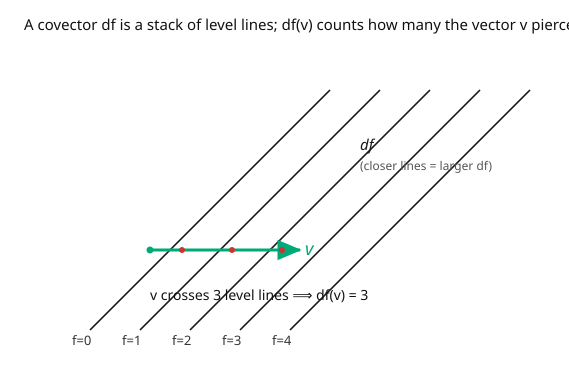

# Differential Geometry · Lesson 2.5: Covectors and the cotangent space

> ⏱ ~15 min · Module 2: Smooth manifolds · Builds on: [2.4 Vector fields and the pushforward](02-04-vector-fields-pushforward.md) · Unlocks: [3.1 Tensors as multilinear maps](03-01-tensors-multilinear-maps.md)

## Why this matters

For every vector, there's a shadow object that *measures* it. A tangent vector is a direction; a **covector** is a linear gauge that eats a direction and returns a number — "how much are you going *this* way?" The gradient of a function is the canonical example, and getting it right resolves a confusion that plagues physics: why some indices go up and some go down, why velocity and momentum transform oppositely, why $\nabla f$ isn't *really* a vector until you have a metric. Covectors (one-forms) are also the objects you integrate along paths and, generalized, the differential forms that unify all of vector calculus (Module 3). Vectors and covectors are the two primitive species; everything else (tensors, forms, the metric) is built from them.

## The idea

You have the tangent space $T_pM$ of directions. Take its **dual**: the space of all *linear functions* from $T_pM$ to $\mathbb{R}$. Each such function is a **covector**, and the space of them is the **cotangent space** $T_p^*M$. A covector doesn't point; it *reads*. Feed it a vector, get a number.

The prototype is the differential of a function. Given $f$, its differential $df_p$ is the covector that reads off how fast $f$ changes along any direction: $df_p(v) = v(f)$. Picture $f$'s level sets — the contour lines. $df$ is the *stack* of those contours: a vector's value $df(v)$ is how many contour lines the vector pierces. Steeper $f$ = tighter contours = "bigger" covector. This picture (a stack, not an arrow) is the honest image of a covector.

Now the punchline about indices. Change coordinates — say stretch them. A vector's *components* must grow to describe the same physical arrow in smaller coordinate units (they transform with the Jacobian: **contravariant**, upper index $v^i$). A covector's components must shrink to keep reading the same number off the same vector (they transform with the *inverse* Jacobian: **covariant**, lower index $\omega_i$). Upper and lower indices are exactly these two opposite behaviors — engineered so that the pairing $\omega_i v^i$ is a coordinate-independent number.

## The formal version

The **cotangent space** at $p$ is the dual vector space $T_p^*M = (T_pM)^*$ — the linear maps $\omega: T_pM \to \mathbb{R}$. Its elements are **covectors** (or **one-forms** at a point).

The **differential** of $f \in C^\infty(M)$ is the covector $df_p \in T_p^*M$ defined by

$$df_p(v) = v(f), \qquad v \in T_pM.$$

*In words:* $df_p$ sends a direction to the directional derivative of $f$ in it. In a chart, the coordinate functions $x^i$ have differentials $dx^i$, and

$$dx^i\!\left(\frac{\partial}{\partial x^j}\right) = \frac{\partial x^i}{\partial x^j} = \delta^i_j.$$

So $\{dx^i\}$ is the **dual basis** to $\{\partial/\partial x^j\}$ — it picks off the $i$-th component. Every covector is $\omega = \omega_i\,dx^i$ (lower index, summed), and in particular $df = \dfrac{\partial f}{\partial x^i}\,dx^i$ — the gradient, correctly typed as a covector. The **pairing** of $\omega = \omega_i\,dx^i$ with $v = v^j\,\partial_j$ is

$$\omega(v) = \omega_i v^j\,dx^i(\partial_j) = \omega_i v^i \in \mathbb{R}.$$

A **one-form** (covector field) assigns $\omega_p \in T_p^*M$ smoothly. **Transformation laws** under $x \to x'$: vectors transform contravariantly, covectors covariantly,

$$v'^i = \frac{\partial x'^i}{\partial x^j}\,v^j, \qquad \omega'_i = \frac{\partial x^j}{\partial x'^i}\,\omega_j,$$

the two Jacobians being inverse — which is exactly why $\omega_i v^i$ is invariant.

## Picture

## Worked examples

**Example 1 (a differential and its pairing).** On $\mathbb{R}^2$, let $f(x, y) = x^2 y$. Then

$$df = \frac{\partial f}{\partial x}\,dx + \frac{\partial f}{\partial y}\,dy = 2xy\,dx + x^2\,dy.$$

Pair it with the vector $v = a\,\partial_x + b\,\partial_y$: $df(v) = 2xy\cdot a + x^2\cdot b$ (using $dx(\partial_x) = 1$, $dx(\partial_y) = 0$, etc.). At $p = (1, 2)$ with $v = 3\,\partial_x + 1\,\partial_y$: $df(v) = 2(1)(2)(3) + (1)^2(1) = 12 + 1 = 13$ — the rate of change of $f$ along $v$, matching the derivation $v(f)$ from [2.3](02-03-tangent-space.md). The covector $df$ and the vector $v$ met and produced a number.

**Example 2 (up vs down under a coordinate change).** Rescale coordinates: $x' = 2x$ (so $x = x'/2$). Then the basis vector transforms as $\partial_{x'} = \frac{\partial x}{\partial x'}\,\partial_x = \tfrac12\,\partial_x$, and the dual basis covector as $dx' = 2\,dx$. Now take a *fixed* vector $v = \partial_x$ and a *fixed* covector $\omega = dx$:

$$v = \partial_x = 2\,\partial_{x'} \ \Rightarrow\ v^{x'} = 2 = 2 v^{x} \ (\text{components grew: contravariant}),$$
$$\omega = dx = \tfrac12\,dx' \ \Rightarrow\ \omega_{x'} = \tfrac12 = \tfrac12\,\omega_x \ (\text{components shrank: covariant}).$$

The pairing is unchanged: $\omega(v) = \omega_{x'}v^{x'} = \tfrac12\cdot 2 = 1 = \omega_x v^x$. The opposite scalings are precisely engineered to keep the number invariant — that's the whole reason for the up/down index bookkeeping.

## Watch out

- **You might think the gradient is a vector.** In $\mathbb{R}^n$ with the standard dot product you can *identify* $df$ with a vector, but intrinsically $df$ is a **covector** — it transforms covariantly. Turning it into an actual vector (the "gradient vector") requires a **metric** to raise the index ([5.1](05-01-riemannian-lorentzian-metrics.md)). Without one, $\nabla f$ has no direction, only level sets.
- **You might draw a covector as an arrow.** Draw it as a *stack of parallel planes* (level sets). The pairing with a vector counts pierced planes. This isn't pedantry — the stack picture is what makes the covariant transformation and the integral $\int \omega$ intuitive.
- **You might mix up which Jacobian goes where.** Vectors: new-over-old $\frac{\partial x'^i}{\partial x^j}$. Covectors: old-over-new $\frac{\partial x^j}{\partial x'^i}$. They're inverse matrices. If your pairing $\omega_i v^i$ doesn't come out invariant, you've swapped them.

## One-liner

> A covector is a machine that measures vectors, the differential $df$ is the stack of a function's level sets, and "index down, transforms covariantly" is exactly what keeps the pairing $\omega_i v^i$ the same in every coordinate system.

## Problems

**P1 (🟢)** For $f(x, y, z) = x y^2 + z^3$ on $\mathbb{R}^3$, write $df$, then evaluate $df(v)$ at $p = (1, 2, 1)$ for $v = \partial_x - \partial_y + 2\,\partial_z$.

**P2 (🟡)** In polar coordinates $x = r\cos\theta,\ y = r\sin\theta$, express the differential $dx$ in terms of $dr$ and $d\theta$. Then verify $dx(\partial_r) = \cos\theta$ by pairing directly, and interpret it (why should moving in the $r$-direction change $x$ at rate $\cos\theta$?).

**P3 (🔴, optional)** A covector field (one-form) $\omega = \omega_i\,dx^i$ is called **exact** if $\omega = df$ for some function $f$. Show that if $\omega = P\,dx + Q\,dy$ is exact and smooth, then $\partial_y P = \partial_x Q$. (This is the seed of "closed vs exact" in [3.3](03-03-exterior-derivative.md).) Give a one-form that fails this test, hence is not exact.

Solutions

**P1** $df = y^2\,dx + 2xy\,dy + 3z^2\,dz$. At $p = (1,2,1)$: coefficients $y^2 = 4$, $2xy = 4$, $3z^2 = 3$. Pairing with $v = (1, -1, 2)$: $df(v) = 4(1) + 4(-1) + 3(2) = 4 - 4 + 6 = 6$. ✓

**P2** With $x = r\cos\theta$, $dx = \frac{\partial x}{\partial r}\,dr + \frac{\partial x}{\partial\theta}\,d\theta = \cos\theta\,dr - r\sin\theta\,d\theta$. Pair with $\partial_r$: since $dr(\partial_r) = 1$ and $d\theta(\partial_r) = 0$, we get $dx(\partial_r) = \cos\theta$. Interpretation: $\partial_r$ points radially outward; its $x$-component is $\cos\theta$, so moving one unit radially increases $x$ by $\cos\theta$ — the projection of the radial direction onto the $x$-axis. ✓

**P3** If $\omega = df$ then $P = \partial_x f$ and $Q = \partial_y f$. Then $\partial_y P = \partial_y\partial_x f = \partial_x\partial_y f = \partial_x Q$ by equality of mixed partials (Clairaut, $f$ smooth). A one-form failing the test: $\omega = -y\,dx + x\,dy$ has $P = -y$, $Q = x$, so $\partial_y P = -1 \neq 1 = \partial_x Q$. Hence $\omega$ is not exact — there's no function whose differential it is. (It *is* the famous "angle form" $d\theta$, exact only locally, not globally on the punctured plane — a preview of the closed-but-not-exact distinction and of [`topology`](../../topology/syllabus.md)'s de Rham story.) ∎

## Flashback

**From Lesson 2.4 (Vector fields and the pushforward):** For $F: \mathbb{R}^2 \to \mathbb{R}^2$, $F(x, y) = (x + y,\ xy)$, compute the pushforward of $v = \partial_x + \partial_y$ at the point $p = (2, 3)$.

Solution

The Jacobian is $\begin{pmatrix} 1 & 1 \\ y & x \end{pmatrix}$; at $p = (2,3)$ it is $\begin{pmatrix} 1 & 1 \\ 3 & 2 \end{pmatrix}$. With $v = (1, 1)$,

$$dF_p(v) = \begin{pmatrix} 1 & 1 \\ 3 & 2 \end{pmatrix}\begin{pmatrix} 1 \\ 1 \end{pmatrix} = \begin{pmatrix} 2 \\ 5 \end{pmatrix} = 2\,\partial_u + 5\,\partial_v,$$

a tangent vector at $F(2,3) = (5, 6)$. ✓

## Connections

- **Backward:** $df(v) = v(f)$ closes the loop with [2.3](02-03-tangent-space.md)'s derivations — the covector $df$ is the "output slot" of the vector-as-derivation. Where vectors push forward ([2.4](02-04-vector-fields-pushforward.md)), covectors **pull back**.
- **Forward:** one-forms are the degree-1 case of **differential forms** ([3.2](03-02-differential-forms-wedge-product.md)); $df$ is the exterior derivative $d$ ([3.3](03-03-exterior-derivative.md)) applied to a function; the metric ([5.1](05-01-riemannian-lorentzian-metrics.md)) is what converts between $T_pM$ and $T_p^*M$ (raising/lowering indices).
- **Sideways (mechanics):** momentum is a covector, velocity a vector — that's why $p_i = \partial L/\partial \dot q^i$ carries a lower index and lives in the *cotangent* bundle (phase space) in [`analytical-mechanics`](../../analytical-mechanics/syllabus.md). The pairing $p_i \dot q^i$ (the thing in the Legendre transform) is the invariant $\omega(v)$ of this lesson.
