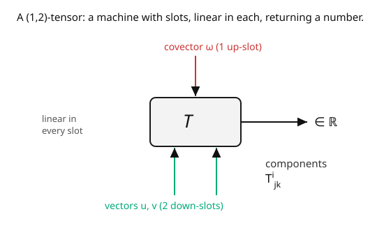

# Differential Geometry · Lesson 3.1: Tensors as multilinear maps

> ⏱ ~15 min · Module 3: Tensors and differential forms · Builds on: [2.5 Covectors and the cotangent space](02-05-covectors-cotangent-space.md) · Unlocks: [3.2 Differential forms and the wedge product](03-02-differential-forms-wedge-product.md)

## Why this matters

Physics is written in tensors: the metric, the stress-energy tensor, the electromagnetic field, the curvature of spacetime, the moment of inertia. There are two cultures for what a tensor "is" — the physicist's ("an object whose components transform by *this* rule") and the mathematician's ("a multilinear map") — and they are the *same thing* seen from two sides. Owning both is the point of this lesson: the transformation law is what makes tensor equations coordinate-independent (true in one frame ⟹ true in all), and the multilinear-map view is what makes them conceptually clean. Get this and index gymnastics stops being magic; it becomes bookkeeping for "a machine with slots."

## The idea

You have two primitive objects: vectors (from $T_pM$) and covectors (from $T_p^*M$), which pair to give numbers. A **tensor** generalizes the pairing: it's a machine with several slots, some that eat covectors and some that eat vectors, **linear in each slot**, returning a real number.

- A covector eats one vector → a $(0,1)$-tensor.
- A vector eats one covector (a vector *is* a machine on covectors, by double duality) → a $(1,0)$-tensor.
- The **metric** eats two vectors → a $(0,2)$-tensor: $g(u, v) = $ their inner product.
- A **linear operator** eats one covector and one vector → a $(1,1)$-tensor.

The number of covector-slots is the **contravariant rank** $k$ (upper indices), the number of vector-slots is the **covariant rank** $l$ (lower indices). That's the whole ontology: pick how many of each slot.

Now the two cultures meet. Because the machine is *linear in each slot*, it's determined by what it does to basis vectors and covectors — its **components** $T^{i\cdots}{}_{j\cdots}$. Change coordinates, and the components must transform so the machine gives the *same number* on the same inputs: each upper index picks up a Jacobian, each lower index its inverse. "Transforms by that rule" (physicist) $\iff$ "is a well-defined multilinear map" (mathematician). And **contraction** — summing an upper against a lower index — is just feeding the tensor's own output back into a slot, e.g. the trace of an operator.

## The formal version

A **$(k, l)$-tensor** at $p$ is a multilinear map

$$T: \underbrace{T_p^*M \times \cdots \times T_p^*M}_{k} \times \underbrace{T_pM \times \cdots \times T_pM}_{l} \to \mathbb{R},$$

linear in each of its $k + l$ arguments. Equivalently, an element of $\bigotimes^k T_pM \otimes \bigotimes^l T_p^*M$, built with the **tensor product** $\otimes$ (which just juxtaposes slots: $(S \otimes T)(\ldots) = S(\ldots)\,T(\ldots)$). Its **components** in a chart are its values on basis elements,

$$T^{i_1\cdots i_k}{}_{j_1\cdots j_l} = T\bigl(dx^{i_1}, \ldots, dx^{i_k},\ \partial_{j_1}, \ldots, \partial_{j_l}\bigr),$$

and $T = T^{i_1\cdots i_k}{}_{j_1\cdots j_l}\ \partial_{i_1}\otimes\cdots\otimes dx^{j_l}$ (sum over all). **Transformation law** under $x \to x'$:

$$T'^{\,i\cdots}{}_{j\cdots} = \frac{\partial x'^i}{\partial x^a}\cdots\,\frac{\partial x^b}{\partial x'^j}\cdots\ T^{a\cdots}{}_{b\cdots}$$

— one factor $\frac{\partial x'}{\partial x}$ per upper index, one factor $\frac{\partial x}{\partial x'}$ per lower index. *In words:* a tensor is exactly an indexed array that transforms this way; that's what guarantees $T = 0$ in one frame means $T = 0$ in all frames.

**Contraction** sums one upper against one lower index, producing a $(k-1, l-1)$-tensor: e.g. $A^i{}_i = \operatorname{tr}(A)$. It is coordinate-independent because the paired Jacobians cancel — a discrete echo of $\omega_i v^i$ being invariant.

## Picture

## Worked examples

**Example 1 (the metric and a linear operator).** The **metric** $g$ is a $(0,2)$-tensor: $g(u, v) = g_{ij}u^i v^j$, symmetric, giving lengths and angles. In flat $\mathbb{R}^n$ with Cartesian coordinates $g_{ij} = \delta_{ij}$ and $g(u,v)$ is the dot product. A **linear operator** $A: T_pM \to T_pM$ is a $(1,1)$-tensor $A^i{}_j$: feed it a vector $v^j$ and it returns the vector $A^i{}_j v^j$; feed it also a covector $\omega_i$ and it returns the number $\omega_i A^i{}_j v^j$. **Contracting** its two indices gives $A^i{}_i = \operatorname{tr}(A)$ — a single coordinate-independent number (the shape operator's trace was $2H$ in [1.3](01-03-gauss-map-second-fundamental-form.md), its determinant $K$; both are contraction-type invariants).

**Example 2 (why $\partial_i V^j$ is *not* a tensor).** Take a vector field $V^j$ and differentiate its components: does $\partial_i V^j$ form a $(1,1)$-tensor? Transform to $x'$: $V'^j = \frac{\partial x'^j}{\partial x^b}V^b$, so

$$\frac{\partial V'^j}{\partial x'^i} = \frac{\partial x^a}{\partial x'^i}\frac{\partial}{\partial x^a}\!\left(\frac{\partial x'^j}{\partial x^b}V^b\right) = \underbrace{\frac{\partial x^a}{\partial x'^i}\frac{\partial x'^j}{\partial x^b}\,\partial_a V^b}_{\text{tensorial part}} + \underbrace{\frac{\partial x^a}{\partial x'^i}\,\frac{\partial^2 x'^j}{\partial x^a\partial x^b}\,V^b}_{\text{extra second-derivative term}}.$$

The first term is the correct tensor transformation; the **second term ruins it** — it's nonzero whenever the coordinate change is nonlinear (curved coordinates). So plain partial differentiation of a vector field does *not* produce a tensor. Fixing this — adding a correction that cancels the extra term — is the entire job of the **covariant derivative** and the Christoffel symbols in [4.1](04-01-covariant-derivative-christoffel.md). This example is the bridge from Module 3 to Module 4.

## Watch out

- **You might think any indexed array is a tensor.** Only if it transforms by the tensor law. The Christoffel symbols $\Gamma^k_{ij}$ ([4.1](04-01-covariant-derivative-christoffel.md)) carry indices but are *not* a tensor (that stray second-derivative term again). Indices are necessary, not sufficient.
- **You might conflate the $(1,1)$-tensor with a matrix of numbers.** A matrix is the *components*; the tensor is the coordinate-free operator. Two different matrices in two charts can be the same $(1,1)$-tensor. The trace/determinant match; the entries need not.
- **You might contract two upper (or two lower) indices.** Contraction pairs *one up with one down*. Summing two indices of the same type (like $T^{ii}$) is **not** coordinate-independent — it needs a metric to first lower one of them. Watch the index heights.

## One-liner

> A tensor is a multilinear machine with $k$ covector-slots and $l$ vector-slots — equivalently, an indexed array transforming with one Jacobian per upper index and one inverse-Jacobian per lower — and that transformation law is precisely what makes tensor equations true in every coordinate system.

## Problems

**P1 (🟢)** Classify each as a $(k,l)$-tensor: (a) a covector $\omega_i$; (b) the metric $g_{ij}$; (c) a linear map $A^i{}_j$; (d) the Kronecker delta $\delta^i_j$. For (d), contract it ($\delta^i_i$) on an $n$-manifold and state the result.

**P2 (🟡)** Given a $(1,1)$-tensor $A^i{}_j$ and a vector $v^j$, the expression $A^i{}_j v^j$ has one free upper index $i$ — so it's a vector. Verify this "output is a vector" claim by checking $A^i{}_j v^j$ transforms contravariantly, using the transformation laws for $A$ and $v$. (Show the inner Jacobians cancel.)

**P3 (🔴, optional)** The **quotient theorem**: suppose $X_{ij}$ is an array such that $X_{ij}v^j$ is a covector for *every* vector $v^j$. Show $X_{ij}$ must be a $(0,2)$-tensor. *Hint:* write the covariance requirement for the output and peel off the arbitrary $v^j$.

Solutions

**P1** (a) $\omega_i$: $(0,1)$. (b) $g_{ij}$: $(0,2)$. (c) $A^i{}_j$: $(1,1)$. (d) $\delta^i_j$: $(1,1)$ (it's the identity operator, and indeed it's the *same* array in every chart — a genuinely invariant tensor). Contraction: $\delta^i_i = \sum_{i=1}^n 1 = n$, the dimension of the manifold.

**P2** Let $w^i = A^i{}_j v^j$. Under $x \to x'$: $A'^i{}_j = \frac{\partial x'^i}{\partial x^a}\frac{\partial x^b}{\partial x'^j}A^a{}_b$ and $v'^j = \frac{\partial x'^j}{\partial x^c}v^c$. Then

$$w'^i = A'^i{}_j v'^j = \frac{\partial x'^i}{\partial x^a}\frac{\partial x^b}{\partial x'^j}\frac{\partial x'^j}{\partial x^c}A^a{}_b v^c = \frac{\partial x'^i}{\partial x^a}\,\delta^b_c\,A^a{}_b v^c = \frac{\partial x'^i}{\partial x^a}\,A^a{}_b v^b = \frac{\partial x'^i}{\partial x^a}\,w^a,$$

using $\frac{\partial x^b}{\partial x'^j}\frac{\partial x'^j}{\partial x^c} = \delta^b_c$. So $w^i$ transforms contravariantly — it's a vector. ✓

**P3** Let $\omega_i = X_{ij}v^j$; by hypothesis $\omega$ is a covector for all $v$, so $\omega'_i = \frac{\partial x^a}{\partial x'^i}\omega_a$, i.e. $X'_{ij}v'^j = \frac{\partial x^a}{\partial x'^i}X_{aj}v^j$. Write $v'^j = \frac{\partial x'^j}{\partial x^b}v^b$ on the left: $X'_{ij}\frac{\partial x'^j}{\partial x^b}v^b = \frac{\partial x^a}{\partial x'^i}X_{ab}v^b$. Since this holds for *all* $v^b$, the coefficients match: $X'_{ij}\frac{\partial x'^j}{\partial x^b} = \frac{\partial x^a}{\partial x'^i}X_{ab}$. Multiply by $\frac{\partial x^b}{\partial x'^k}$ and sum: $X'_{ik} = \frac{\partial x^a}{\partial x'^i}\frac{\partial x^b}{\partial x'^k}X_{ab}$ — exactly the $(0,2)$-tensor law. ∎

## Flashback

**From Lesson 2.5 (Covectors and the cotangent space):** For $f(x,y) = x^2 y$, write the differential $df$ and pair it with $v = \partial_x + 2\,\partial_y$ at the point $(2, 1)$. State which $(k,l)$-type $df$ is.

Solution

$df = 2xy\,dx + x^2\,dy$. At $(2,1)$: coefficients $2xy = 4$, $x^2 = 4$. Pairing with $v = (1, 2)$: $df(v) = 4(1) + 4(2) = 12$. As a machine that eats one vector and returns a number, $df$ is a **$(0,1)$-tensor** (a covector) — the simplest nontrivial tensor, and the archetype the general definition generalizes. ✓

## Connections

- **Backward:** tensors are built from the vectors ([2.3](02-03-tangent-space.md)) and covectors ([2.5](02-05-covectors-cotangent-space.md)) of Module 2 via $\otimes$; the invariance of $\omega_i v^i$ scales up to the invariance of any full contraction.
- **Forward:** **differential forms** ([3.2](03-02-differential-forms-wedge-product.md)) are the totally *antisymmetric* $(0,p)$-tensors — a special, integrable subspecies; and the failure of $\partial_i V^j$ to be a tensor (Example 2) launches the **covariant derivative** ([4.1](04-01-covariant-derivative-christoffel.md)).
- **Sideways (relativity):** every object in Einstein's equations is a tensor for exactly the reason above — the laws must hold in all coordinate systems (general covariance). The metric $g_{\mu\nu}$, stress-energy $T_{\mu\nu}$, and curvature $R_{\mu\nu}$ are all instances of this lesson's definition.
