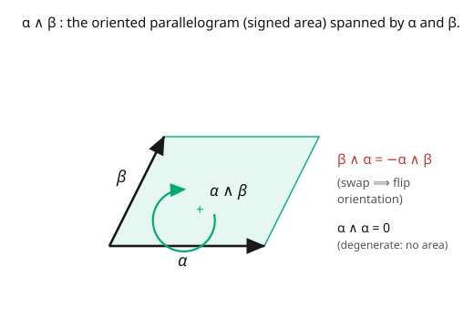

# Differential Geometry · Lesson 3.2: Differential forms and the wedge product

> ⏱ ~15 min · Module 3: Tensors and differential forms · Builds on: [3.1 Tensors as multilinear maps](03-01-tensors-multilinear-maps.md) · Unlocks: [3.3 The exterior derivative](03-03-exterior-derivative.md)

## Why this matters

Differential forms are the objects built to be **integrated** and **differentiated** in a way that works on any manifold, in any coordinates, with orientation baked in. They are the natural language of flux, circulation, work, and — in physics — the electromagnetic field is a 2-form, the action is an integral of a form, and phase-space volume is a form. The engine is the **wedge product**, whose defining move is *antisymmetry*: swapping two inputs flips the sign. That single rule encodes signed area and volume, makes the determinant appear for free, and is exactly the algebra that will collapse grad, curl, and div into one operator next lesson.

## The idea

A $p$-form is a tensor that measures **oriented $p$-dimensional volume**. Start with area. A parallelogram spanned by two vectors has an area — but a *signed* area if you care about orientation (did you sweep counterclockwise or clockwise?). Swap the two edge vectors and the orientation flips: signed area changes sign. So the machine that eats two vectors and returns their signed area must be **antisymmetric**: $\omega(u, v) = -\omega(v, u)$. That antisymmetry is the whole definition of a form.

Antisymmetry has an immediate, powerful consequence: feed a form two copies of the *same* vector and you get $\omega(v, v) = -\omega(v, v) = 0$ — a degenerate parallelogram has no area. More generally, a $p$-form vanishes on any linearly dependent set. So $p$-forms detect *independence*, i.e. genuine $p$-dimensional spread.

The **wedge product** $\wedge$ builds higher forms from lower ones by multiplying while enforcing antisymmetry. From the coordinate one-forms $dx^i$ you get $dx^i \wedge dx^j$ (an oriented area element in the $ij$-plane), then $dx^i \wedge dx^j \wedge dx^k$ (oriented volume), and so on. The graded-anticommutativity $dx^i \wedge dx^j = -\,dx^j \wedge dx^i$ is the source of every sign in the theory — and when you expand a wedge of one-forms, the coefficients that pop out are **determinants**. Orientation, area, volume, determinants: one algebra.

## The formal version

A **$p$-form** at a point is a totally antisymmetric $(0, p)$-tensor: a multilinear map $\omega: (T_pM)^p \to \mathbb{R}$ with $\omega(\ldots, v_a, \ldots, v_b, \ldots) = -\omega(\ldots, v_b, \ldots, v_a, \ldots)$ for any swap. The space of them is $\Lambda^p T_p^*M$; a **differential $p$-form** assigns one smoothly at each point. (0-forms are functions; 1-forms are covectors, [2.5](02-05-covectors-cotangent-space.md).)

The **wedge product** $\wedge: \Lambda^p \times \Lambda^q \to \Lambda^{p+q}$ is bilinear, associative, and **graded-anticommutative**:

$$\alpha \wedge \beta = (-1)^{pq}\,\beta \wedge \alpha \qquad (\alpha \text{ a } p\text{-form},\ \beta \text{ a } q\text{-form}).$$

*In words:* moving a $q$-form past a $p$-form costs a sign $(-1)^{pq}$; for two one-forms ($p=q=1$) this is the flip $dx^i \wedge dx^j = -dx^j\wedge dx^i$, and it forces $\alpha \wedge \alpha = 0$ for any odd-degree $\alpha$. A basis for $\Lambda^p$ on an $n$-manifold is

$$\{\,dx^{i_1}\wedge\cdots\wedge dx^{i_p} : i_1 < i_2 < \cdots < i_p\,\}, \qquad \dim\Lambda^p = \binom{n}{p}.$$

So a general $p$-form is $\omega = \sum_{i_1<\cdots<i_p}\omega_{i_1\cdots i_p}\,dx^{i_1}\wedge\cdots\wedge dx^{i_p}$. An **orientation** of the manifold is a choice of nowhere-vanishing top-form ($p = n$); there is a one-dimensional space of top-forms at each point ($\binom nn = 1$), and picking a sign for it orients the manifold. Evaluated on vectors, a wedge of one-forms is a determinant:

$$(\alpha^1 \wedge \cdots \wedge \alpha^p)(v_1, \ldots, v_p) = \det\bigl[\alpha^i(v_j)\bigr].$$

## Picture

## Worked examples

**Example 1 (the determinant falls out).** In $\mathbb{R}^2$, wedge two general one-forms $\alpha = a\,dx + b\,dy$ and $\beta = c\,dx + d\,dy$. Expand using bilinearity and $dx\wedge dx = dy\wedge dy = 0$, $dy\wedge dx = -dx\wedge dy$:

$$\alpha \wedge \beta = (a\,dx + b\,dy)\wedge(c\,dx + d\,dy) = ad\,(dx\wedge dy) + bc\,(dy\wedge dx) = (ad - bc)\,dx\wedge dy.$$

The coefficient is $\det\begin{pmatrix} a & b \\ c & d\end{pmatrix}$ — the signed area of the parallelogram spanned by $(a,b)$ and $(c,d)$. The wedge *is* the determinant/oriented-area machine. Swapping $\alpha \leftrightarrow \beta$ flips the sign, as antisymmetry demands.

**Example 2 (a wedge in $\mathbb{R}^3$, and $\omega\wedge\omega = 0$).** Let $\omega = dx + z\,dy$ (a one-form on $\mathbb{R}^3$) and $\eta = dy \wedge dz$ (a two-form). Then

$$\omega \wedge \eta = (dx + z\,dy)\wedge(dy\wedge dz) = dx\wedge dy\wedge dz + z\,(dy\wedge dy\wedge dz) = dx\wedge dy\wedge dz,$$

since $dy \wedge dy = 0$ kills the second term — a top-form on $\mathbb{R}^3$ (oriented volume). And any one-form wedged with itself vanishes: $\omega\wedge\omega = (dx + z\,dy)\wedge(dx + z\,dy) = z\,dx\wedge dy + z\,dy\wedge dx = z\,dx\wedge dy - z\,dx\wedge dy = 0$. ✓ (This is why odd-degree forms square to zero.)

## Watch out

- **You might think wedging is commutative like ordinary multiplication.** It's graded-anticommutative: one-forms *anticommute* ($\alpha\wedge\beta = -\beta\wedge\alpha$), while a form of even degree commutes past everything. Track the degrees; the sign $(-1)^{pq}$ is not optional.
- **You might keep "repeated" basis wedges.** Any term with a repeated $dx^i$ (like $dx\wedge dx$, or $dx\wedge dy\wedge dx$) is **zero**. After expanding, discard repeats and reorder each surviving term into increasing index order, tracking one sign per swap.
- **You might expect high-degree forms to keep existing.** On an $n$-manifold, $\Lambda^p = 0$ for $p > n$ (you can't have more than $n$ independent directions), and $\dim\Lambda^n = 1$. There is no such thing as an $(n+1)$-form — a fact that quietly powers "top-form = volume."

## One-liner

> A $p$-form measures oriented $p$-volume, antisymmetry (swap ⟹ flip sign) is its entire DNA, and the wedge product multiplies forms while spitting out the determinants that make area and volume coordinate-independent.

## Problems

**P1 (🟢)** In $\mathbb{R}^3$, compute $\alpha \wedge \beta$ for $\alpha = 2\,dx - dy$ and $\beta = dx + 3\,dz$. Write the answer in the ordered basis $\{dx\wedge dy,\ dx\wedge dz,\ dy\wedge dz\}$.

**P2 (🟡)** On an $n$-manifold, compute $\dim\Lambda^p$ for $p = 0, 1, 2, 3$ when $n = 3$, and confirm the pattern $\sum_p \dim\Lambda^p = 2^n$. Which degree(s) have dimension $1$, and what geometric objects are those (a function? a volume?)?

**P3 (🔴, optional)** Show that a set of one-forms $\{\alpha^1, \ldots, \alpha^p\}$ is linearly *dependent* iff $\alpha^1 \wedge \cdots \wedge \alpha^p = 0$. *Hint:* use the determinant formula for evaluation on vectors, and recall a determinant vanishes iff its rows are dependent.

Solutions

**P1** $\alpha\wedge\beta = (2\,dx - dy)\wedge(dx + 3\,dz)$. Expand: $2\,dx\wedge dx + 6\,dx\wedge dz - dy\wedge dx - 3\,dy\wedge dz$. Now $dx\wedge dx = 0$ and $dy\wedge dx = -dx\wedge dy$, so

$$\alpha\wedge\beta = 6\,dx\wedge dz + dx\wedge dy - 3\,dy\wedge dz = 1\,dx\wedge dy + 6\,dx\wedge dz - 3\,dy\wedge dz.$$

**P2** For $n = 3$: $\dim\Lambda^0 = \binom30 = 1$, $\dim\Lambda^1 = \binom31 = 3$, $\dim\Lambda^2 = \binom32 = 3$, $\dim\Lambda^3 = \binom33 = 1$. Sum $= 1+3+3+1 = 8 = 2^3$ (the binomial theorem, $\sum_p\binom np = 2^n$). The degree-$0$ part (dimension $1$) is **functions** (scalars); the degree-$3$ part (dimension $1$) is **top-forms** — oriented volume elements. That $\Lambda^0$ and $\Lambda^n$ are both $1$-dimensional is the duality underlying integration and Stokes.

**P3** Evaluate on any vectors $v_1, \ldots, v_p$: $(\alpha^1\wedge\cdots\wedge\alpha^p)(v_1,\ldots,v_p) = \det[\alpha^i(v_j)]$. If the $\alpha^i$ are dependent, say $\alpha^p = \sum_{k<p}c_k\alpha^k$, then the last row of the matrix $[\alpha^i(v_j)]$ is a combination of the others for *every* choice of $v_j$, so the determinant is identically $0$, hence the wedge is $0$. Conversely, if the $\alpha^i$ are independent, extend to a basis and pick $v_j$ dual to $\alpha^j$; then $[\alpha^i(v_j)] = I$ has determinant $1 \neq 0$, so the wedge is nonzero. ∎

## Flashback

**From Lesson 3.1 (Tensors as multilinear maps):** A $p$-form is a special kind of $(k,l)$-tensor. State which $(k,l)$ and what extra property singles forms out. Then: is the metric $g_{ij}$ a differential form? Why or why not?

Solution

A $p$-form is a $(0, p)$-tensor (all $p$ slots eat vectors, no covector slots) that is **totally antisymmetric** under swapping any two arguments. The metric $g_{ij}$ is a $(0,2)$-tensor but it is **symmetric** ($g_{ij} = g_{ji}$), the opposite of antisymmetric, so it is *not* a differential form. Forms and metrics are the two extreme symmetry types of a $(0,2)$-tensor: antisymmetric (area) vs symmetric (length). ✓

## Connections

- **Backward:** forms are the antisymmetric tensors of [3.1](03-01-tensors-multilinear-maps.md); a one-form is exactly a covector from [2.5](02-05-covectors-cotangent-space.md), now the degree-1 rung of a whole ladder.
- **Forward:** [3.3](03-03-exterior-derivative.md) differentiates forms with the operator $d$ (grad/curl/div unified); [3.4](03-04-integration-on-manifolds.md) integrates the top-form; orientation defined here is what integration needs.
- **Sideways (physics):** the electromagnetic field is the 2-form $F = \frac12 F_{\mu\nu}\,dx^\mu\wedge dx^\nu$, and the wedge's antisymmetry is the antisymmetry of $F_{\mu\nu}$ ([qft](../../qft/syllabus.md), [5.4](05-04-fiber-bundles-connections.md)); in [`analytical-mechanics`](../../analytical-mechanics/syllabus.md), phase space carries a symplectic 2-form $\omega = dp\wedge dq$, and Liouville's volume is $\omega^n$.
