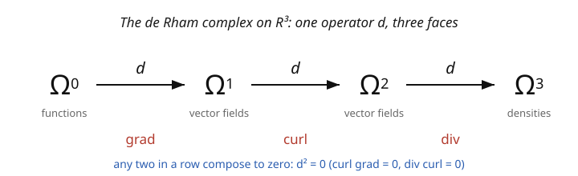

# Differential Geometry · Lesson 3.3: The exterior derivative

> ⏱ ~15 min · Module 3: Tensors and differential forms · Builds on: [3.2 Differential forms and the wedge product](03-02-differential-forms-wedge-product.md) · Unlocks: [3.4 Integration on manifolds](03-04-integration-on-manifolds.md)

## Why this matters

Vector calculus gave you three derivative operators — gradient, curl, divergence — plus two mysterious identities, $\operatorname{curl}\operatorname{grad} = 0$ and $\operatorname{div}\operatorname{curl} = 0$, that you memorized without quite knowing why. The **exterior derivative** $d$ is the single operator that *is* all three at once, and the mystery identities are both the one clean fact $d^2 = 0$. Beyond the tidiness, $d$ is coordinate-free and works on any manifold — no cross product (which only exists in 3D) required. It's the derivative half of the machine whose integral half is the generalized Stokes theorem ([3.5](03-05-generalized-stokes-theorem.md)), and the split between "closed" and "exact" forms it creates is where geometry starts detecting the *shape* (topology) of a space.

## The idea

You have forms of each degree ($0$-forms = functions, $1$-forms, $2$-forms, …). The exterior derivative $d$ takes a $p$-form and produces a $(p+1)$-form, raising the degree by one — differentiation that also climbs the ladder. On a function $f$ it's just the differential $df$ from [2.5](02-05-covectors-cotangent-space.md). On higher forms it's determined by two rules: differentiate the coefficient functions, and obey a signed product rule (graded Leibniz).

Three facts make $d$ remarkable:

1. **It unifies vector calculus.** In $\mathbb{R}^3$, apply $d$ to a $0$-form and you get the gradient; to a $1$-form, the curl; to a $2$-form, the divergence. One operator, three faces (the diagram).
2. **$d^2 = 0$.** Apply $d$ twice and you always get zero. This *is* $\operatorname{curl}\operatorname{grad} = 0$ (functions → curl of a gradient) and $\operatorname{div}\operatorname{curl} = 0$ (1-forms → div of a curl), unified. Deep reason: "the boundary of a boundary is empty," the geometric shadow of $d^2 = 0$.
3. **Closed vs exact.** A form with $d\omega = 0$ is **closed**; one that is $\omega = d\eta$ is **exact**. Since $d^2 = 0$, *every exact form is closed*. Whether the converse holds — is every closed form exact? — depends on the *shape* of the space (locally always, by the Poincaré lemma; globally, it detects holes).

## The formal version

The **exterior derivative** $d: \Omega^p(M) \to \Omega^{p+1}(M)$ is the unique operator with:

- On $0$-forms (functions): $df = \dfrac{\partial f}{\partial x^i}\,dx^i$ (the differential of [2.5](02-05-covectors-cotangent-space.md)).
- In coordinates, on $\omega = \omega_{I}\,dx^{I}$ (with $dx^I = dx^{i_1}\wedge\cdots\wedge dx^{i_p}$): $\ d\omega = d\omega_{I}\wedge dx^{I}$ — differentiate the coefficient, wedge on the front.
- **Graded Leibniz:** $d(\alpha\wedge\beta) = d\alpha\wedge\beta + (-1)^{p}\,\alpha\wedge d\beta$ for $\alpha$ a $p$-form.
- **Nilpotent:** $d(d\omega) = 0$, i.e. $\boxed{d^2 = 0}$.

*In words:* $d$ differentiates and raises degree; the sign in Leibniz tracks moving $d$ past a $p$-form; and applying it twice always annihilates. A form is **closed** if $d\omega = 0$, **exact** if $\omega = d\eta$ for some $\eta$; exact $\Rightarrow$ closed (since $d(d\eta) = 0$).

**Poincaré lemma (local).** On a region with no holes (a ball, or any contractible open set), every closed form is exact: $d\omega = 0 \Rightarrow \omega = d\eta$ locally. *In words:* locally, "closed" and "exact" coincide; only the global topology of $M$ can separate them — the business of de Rham cohomology in [`topology`](../../topology/syllabus.md).

## Picture

## Worked examples

**Example 1 ($d$ of a 1-form is the curl).** Take $\omega = P\,dx + Q\,dy + R\,dz$ on $\mathbb{R}^3$ (coefficients functions of $x,y,z$). Compute $d\omega = dP\wedge dx + dQ\wedge dy + dR\wedge dz$, expand each $dP = P_x\,dx + P_y\,dy + P_z\,dz$, and drop repeated wedges:

$$d\omega = (R_y - Q_z)\,dy\wedge dz + (P_z - R_x)\,dz\wedge dx + (Q_x - P_y)\,dx\wedge dy.$$

The three coefficients are exactly the components of $\operatorname{curl}(P, Q, R) = \nabla\times(P,Q,R)$. So $d$ on a 1-form *is* the curl — but written with wedges, it needs no cross product and generalizes to any dimension (where "curl" doesn't even make sense). Likewise $d$ on a function gives $\operatorname{grad}$, and $d$ on a 2-form gives $\operatorname{div}$.

**Example 2 ($d^2 = 0$ is $\operatorname{curl}\operatorname{grad} = 0$).** Start with a function $f$, so $df = f_x\,dx + f_y\,dy + f_z\,dz$ (this is $\operatorname{grad}f$). Now apply $d$ again, using Example 1's curl formula with $(P, Q, R) = (f_x, f_y, f_z)$:

$$d(df) = (f_{zy} - f_{yz})\,dy\wedge dz + (f_{xz} - f_{zx})\,dz\wedge dx + (f_{yx} - f_{xy})\,dx\wedge dy = 0,$$

every coefficient vanishing by equality of mixed partials ($f_{yx} = f_{xy}$, etc.). That's $\operatorname{curl}(\operatorname{grad}f) = 0$ — and it fell out of $d^2 = 0$, which holds for the *same reason* (mixed partials commute) in every degree and dimension. The two vector-calculus "coincidences" are one identity.

## Watch out

- **You might forget the sign in graded Leibniz.** $d(\alpha\wedge\beta) = d\alpha\wedge\beta + (-1)^{\deg\alpha}\alpha\wedge d\beta$. Forgetting the $(-1)^{\deg\alpha}$ gives wrong signs the moment $\alpha$ has odd degree. (E.g. $d(f\,dg) = df\wedge dg + f\,d(dg) = df\wedge dg$ — the second term dies by $d^2=0$.)
- **You might think closed implies exact.** Only *locally* (Poincaré). Globally it can fail: on the punctured plane, the angle form $d\theta = \frac{-y\,dx + x\,dy}{x^2+y^2}$ is closed but **not** exact (no globally-defined angle function) — the hole at the origin obstructs it. That failure is a topological invariant.
- **You might reach for the curl in higher dimensions.** "Curl" is a 3D accident (it needs the cross product, i.e. $\Lambda^2\mathbb{R}^3 \cong \mathbb{R}^3$). The exterior derivative is the honest object; it works in any dimension and on any manifold, and reduces to grad/curl/div only when $n = 3$ lets you disguise forms as vector fields.

## One-liner

> The exterior derivative $d$ is grad, curl, and div rolled into one degree-raising operator, and $d^2 = 0$ is the single identity behind $\operatorname{curl}\operatorname{grad} = 0$ and $\operatorname{div}\operatorname{curl} = 0$ — closed-versus-exact then quietly measures a space's holes.

## Problems

**P1 (🟢)** Compute $d\omega$ for the 1-form $\omega = xy\,dx + x^2\,dy$ on $\mathbb{R}^2$. Is $\omega$ closed? Is it exact (can you find $f$ with $df = \omega$)?

**P2 (🟡)** For $\omega = x\,dy \wedge dz + y\,dz\wedge dx + z\,dx\wedge dy$ on $\mathbb{R}^3$, compute $d\omega$ and identify which vector-calculus operation and which vector field you just applied it to. (This $\omega$ is the "flux of the radial field.")

**P3 (🔴, optional)** Verify $d^2 = 0$ on the general 1-form $\omega = P\,dx + Q\,dy$ in $\mathbb{R}^2$ by computing $d(d\omega)$ — but note $d\omega$ is a top-form here, so think about what $d$ of a top-form must be, and why that instantly forces $d^2\omega = 0$ for degree reasons.

Solutions

**P1** $d\omega = d(xy)\wedge dx + d(x^2)\wedge dy = (y\,dx + x\,dy)\wedge dx + (2x\,dx)\wedge dy$. Now $dx\wedge dx = 0$, $dy\wedge dx = -dx\wedge dy$: $d\omega = x\,dy\wedge dx + 2x\,dx\wedge dy = -x\,dx\wedge dy + 2x\,dx\wedge dy = x\,dx\wedge dy$. So $d\omega = x\,dx\wedge dy \neq 0$ — $\omega$ is **not closed**, hence **not exact**. (Consistent with the [2.5](02-05-covectors-cotangent-space.md) test: $\partial_y(xy) = x \neq 2x = \partial_x(x^2)$ unless $x=0$.)

**P2** $d\omega = d(x)\wedge dy\wedge dz + d(y)\wedge dz\wedge dx + d(z)\wedge dx\wedge dy = dx\wedge dy\wedge dz + dy\wedge dz\wedge dx + dz\wedge dx\wedge dy$. Each equals $dx\wedge dy\wedge dz$ (even cyclic permutations), so $d\omega = 3\,dx\wedge dy\wedge dz$. This is the **divergence** of the radial vector field $(x, y, z)$: indeed $\operatorname{div}(x,y,z) = 1 + 1 + 1 = 3$, and $d\omega = (\operatorname{div}\text{ field})\,dx\wedge dy\wedge dz$. ✓

**P3** $d\omega = (Q_x - P_y)\,dx\wedge dy$ is a top-form (degree $2$) on the $2$-manifold $\mathbb{R}^2$. Any $(n)$-form on an $n$-manifold has $d$ landing in $\Omega^{n+1} = 0$ (there are no $(n+1)$-forms — [3.2](03-02-differential-forms-wedge-product.md)). So $d(d\omega) = 0$ automatically, for pure degree reasons. (For a genuine check in higher dimensions, expand $d(d\omega)$ and watch mixed partials cancel, as in Example 2.) ∎

## Flashback

**From Lesson 3.2 (Differential forms and the wedge product):** Compute $\alpha \wedge \beta$ in $\mathbb{R}^3$ for $\alpha = dx + dy$ and $\beta = dy + dz$, in the ordered basis $\{dx\wedge dy, dx\wedge dz, dy\wedge dz\}$.

Solution

$\alpha\wedge\beta = (dx + dy)\wedge(dy + dz) = dx\wedge dy + dx\wedge dz + dy\wedge dy + dy\wedge dz$. The term $dy\wedge dy = 0$, leaving

$$\alpha\wedge\beta = dx\wedge dy + dx\wedge dz + dy\wedge dz.$$

All three basis 2-forms appear with coefficient $1$. ✓

## Connections

- **Backward:** $d$ on a function is the differential $df$ ([2.5](02-05-covectors-cotangent-space.md)); it acts on the forms of [3.2](03-02-differential-forms-wedge-product.md) and its Leibniz sign comes from the wedge's graded-anticommutativity.
- **Forward:** [3.5](03-05-generalized-stokes-theorem.md) pairs $d$ with integration in the one-line Stokes theorem $\int_M d\omega = \int_{\partial M}\omega$; the $d^2 = 0 \leftrightarrow \partial\partial = \varnothing$ duality is the heart of it. Closed/exact seeds de Rham cohomology ([`topology`](../../topology/syllabus.md)).
- **Sideways (electromagnetism/qft):** with $F$ the electromagnetic 2-form, $dF = 0$ *is* two of Maxwell's equations (no monopoles, Faraday), and it holds because $F = dA$ makes $F$ exact, so closed by $d^2 = 0$ — see [5.4](05-04-fiber-bundles-connections.md). The whole of Maxwell compresses to $dF = 0$, $d\star F = J$.
