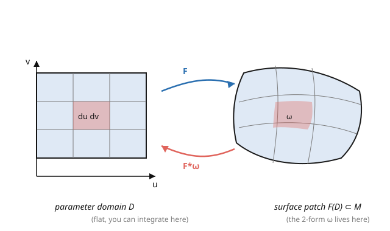

# Differential Geometry · Lesson 3.4: Integration on manifolds

> ⏱ ~15 min · Module 3: Tensors and differential forms · Builds on: [3.3 The exterior derivative](03-03-exterior-derivative.md) · Unlocks: [3.5 The generalized Stokes theorem](03-05-generalized-stokes-theorem.md)

## Why this matters

You can't integrate a plain function over a curved manifold and get a coordinate-independent answer — change coordinates and the naive integral changes by a Jacobian factor you'd have to insert by hand. **Differential forms are precisely the objects you *can* integrate**, because a top-degree form already carries that Jacobian factor inside it, automatically. This is the deep reason forms exist: they are integrands built to be reparametrization-proof. Once you can integrate a form, flux, circulation, total charge, probability, and phase-space volume all become the same operation — and the generalized Stokes theorem ([3.5](03-05-generalized-stokes-theorem.md)) becomes possible.

## The idea

Recall from multivariable calculus the change-of-variables formula: $\int f\,dx\,dy = \int (f\circ\Phi)\,|\det D\Phi|\,du\,dv$. That pesky $|\det D\Phi|$ is the bookkeeping that makes the integral independent of coordinates. Now look at how a top form transforms: an $n$-form's single component picks up exactly $\det D\Phi$ under a coordinate change (that's the wedge's determinant from [3.2](03-02-differential-forms-wedge-product.md)). So **the Jacobian is baked into the form** — integrate the form and the change-of-variables factor takes care of itself. No hand-inserted determinant, no coordinate dependence.

The mechanism is the **pullback**. To integrate a form $\omega$ living on the manifold, pull it back through a parametrization $\Phi$ to the flat parameter domain, where it becomes (coefficient)$\times du\wedge dv\cdots$, and integrate the coefficient by ordinary calculus. The pullback automatically supplies the $\det$ factor.

Two honesty notes. First, integration needs an **orientation** — a consistent choice of "positive" direction for the top-form — because forms are *signed* (flip orientation, flip the integral). Second, for a manifold that needs several charts, you stitch the local integrals together with a **partition of unity** (a smooth way to split the constant function $1$ into bumps, one per chart). We'll use that idea, not its machinery.

## The formal version

The **pullback** of a $p$-form $\omega$ on $N$ by a smooth map $\Phi: M \to N$ is the $p$-form $\Phi^*\omega$ on $M$ defined by $(\Phi^*\omega)(v_1, \ldots, v_p) = \omega(d\Phi\,v_1, \ldots, d\Phi\,v_p)$. In coordinates it just substitutes: $\Phi^*(dy^a) = \frac{\partial y^a}{\partial u^i}\,du^i$ and extends over wedges. Key facts: $\Phi^*(\alpha\wedge\beta) = \Phi^*\alpha\wedge\Phi^*\beta$ and $\Phi^*(d\omega) = d(\Phi^*\omega)$ ($d$ commutes with pullback).

For an **oriented** $n$-manifold $M$ and an $n$-form $\omega$ supported in one oriented chart $\Phi: U \subseteq \mathbb{R}^n \to M$, write $\Phi^*\omega = h(u)\,du^1\wedge\cdots\wedge du^n$; then

$$\int_M \omega := \int_{U} h(u)\,du^1\cdots du^n$$

(ordinary Riemann/Lebesgue integral of the coefficient). *In words:* pull the form back to flat coordinates and integrate its single coefficient. This is **well-defined** (independent of the oriented chart) precisely because an orientation-preserving change of variables multiplies $h$ by $\det D\Phi > 0$, which is exactly the change-of-variables factor — the two effects cancel.

For a form spread over several charts, choose a **partition of unity** $\{\rho_\alpha\}$ subordinate to the cover ($\sum_\alpha \rho_\alpha = 1$, each $\rho_\alpha$ supported in one chart) and set $\int_M \omega = \sum_\alpha \int_M \rho_\alpha\,\omega$, each piece a single-chart integral. *In words:* break the integrand into chart-sized bumps, integrate each locally, add up.

## Picture

## Worked examples

**Example 1 (the pullback supplies the Jacobian — area of a disk).** Integrate the area form $\omega = dx\wedge dy$ over the disk of radius $R$, using the polar parametrization $\Phi(r,\theta) = (r\cos\theta,\, r\sin\theta)$, $r \in [0, R]$, $\theta \in [0, 2\pi]$. Pull back: with $x = r\cos\theta$, $y = r\sin\theta$,

$$\Phi^*(dx\wedge dy) = (x_r\,dr + x_\theta\,d\theta)\wedge(y_r\,dr + y_\theta\,d\theta) = (x_r y_\theta - x_\theta y_r)\,dr\wedge d\theta = r\,dr\wedge d\theta,$$

since $x_r y_\theta - x_\theta y_r = \cos\theta(r\cos\theta) - (-r\sin\theta)\sin\theta = r$. The coefficient $r$ *is* the polar Jacobian — it appeared automatically from the wedge, not by decree. Then

$$\int_{\text{disk}} \omega = \int_0^{2\pi}\!\!\int_0^R r\,dr\,d\theta = 2\pi\cdot\frac{R^2}{2} = \pi R^2. \checkmark$$

**Example 2 (area of a sphere via its area form).** The round sphere of radius $a$ has area form $\omega = a^2\sin\theta\,d\theta\wedge d\phi$ (this is $\sqrt{EG-F^2}\,d\theta\,d\phi$ from [1.2](01-02-surfaces-first-fundamental-form.md), now packaged as a 2-form). Integrate over the standard $(\theta,\phi)$ chart:

$$\int_{S^2}\omega = \int_0^{2\pi}\!\!\int_0^\pi a^2\sin\theta\,d\theta\,d\phi = a^2\cdot 2\pi\cdot\bigl[-\cos\theta\bigr]_0^\pi = a^2\cdot 2\pi\cdot 2 = 4\pi a^2. \checkmark$$

The single $(\theta,\phi)$ chart misses only the poles and a meridian — a set of zero area — so no partition of unity is needed here; the missing set contributes nothing.

## Watch out

- **You might integrate a function instead of a form.** $\int_M f$ has no coordinate-independent meaning on a bare manifold; you must integrate an $n$-**form**. To integrate a *function*, you need a volume form (from a metric, [5.1](05-01-riemannian-lorentzian-metrics.md)) to convert $f \mapsto f\,\mathrm{dvol}$ first. Forms are the legitimate integrands.
- **You might ignore orientation.** Reverse the orientation and $\int_M\omega$ flips sign — an oriented integral is not an unsigned "how much stuff." A non-orientable manifold (Möbius band) has *no* consistent top-form and can't be integrated over this way at all.
- **You might think you always need many charts.** Often a single chart covers the manifold up to a measure-zero set (the sphere minus poles), and then one ordinary integral suffices. The partition of unity is the *guarantee* it always works, not a step you must always perform by hand.

## One-liner

> Forms are the integrands that carry their own Jacobian, so integrating an $n$-form over an oriented manifold is coordinate-proof by construction — pull back to flat coordinates, integrate the one coefficient, done.

## Problems

**P1 (🟢)** Integrate $\omega = dx\wedge dy$ over the rectangle $[0,2]\times[0,3]$ directly, then again via the linear reparametrization $\Phi(u,v) = (2u, 3v)$, $u,v \in [0,1]$ (pull back and integrate). Confirm both give the area $6$, and identify where the Jacobian $\det D\Phi = 6$ shows up in the pullback.

**P2 (🟡)** Compute $\int_{S^2}\omega$ for the sphere of radius $a$ but only over the northern hemisphere ($\theta \in [0, \pi/2]$), using $\omega = a^2\sin\theta\,d\theta\wedge d\phi$. Confirm it's half the total area.

**P3 (🔴, optional)** Let $\omega = \frac{-y\,dx + x\,dy}{x^2 + y^2}$ (the angle form) on the punctured plane, and integrate it around the unit circle parametrized by $\Phi(t) = (\cos t, \sin t)$, $t \in [0, 2\pi]$. You should get $2\pi$. Why does this *not* contradict $\int_{\partial M}\dots$ intuition that a closed form "should integrate to zero over a loop"? (Connect to closed-but-not-exact from [3.3](03-03-exterior-derivative.md).)

Solutions

**P1** Directly: $\int_0^2\int_0^3 dy\,dx = 2\cdot 3 = 6$. Via $\Phi$: $x = 2u$, $y = 3v$, so $\Phi^*(dx\wedge dy) = (2\,du)\wedge(3\,dv) = 6\,du\wedge dv$. Then $\int_0^1\int_0^1 6\,du\,dv = 6$. ✓ The Jacobian $\det D\Phi = \det\begin{pmatrix}2&0\\0&3\end{pmatrix} = 6$ shows up as the coefficient $6$ produced by the wedge $2\,du\wedge 3\,dv$ — pulled in automatically, not inserted.

**P2** $\int_0^{2\pi}\int_0^{\pi/2} a^2\sin\theta\,d\theta\,d\phi = a^2\cdot 2\pi\cdot[-\cos\theta]_0^{\pi/2} = a^2\cdot 2\pi\cdot(0 - (-1)) = 2\pi a^2$. That's exactly half of $4\pi a^2$. ✓

**P3** Pull back: $x = \cos t$, $y = \sin t$, $x^2 + y^2 = 1$, $dx = -\sin t\,dt$, $dy = \cos t\,dt$. So $\Phi^*\omega = \frac{-\sin t(-\sin t\,dt) + \cos t(\cos t\,dt)}{1} = (\sin^2 t + \cos^2 t)\,dt = dt$. Then $\int_0^{2\pi}dt = 2\pi$. No contradiction: the "closed form integrates to zero over a loop bounding a region" reasoning (Stokes, [3.5](03-05-generalized-stokes-theorem.md)) requires the loop to bound a region *on which $\omega$ is defined and exact*. Here $\omega$ is closed but **not exact** on the punctured plane, and the unit circle encircles the puncture — the disk it would bound contains the singularity at the origin, so Stokes doesn't apply. The nonzero $2\pi$ is detecting the hole (it's the winding number times $2\pi$). ∎

## Flashback

**From Lesson 3.3 (The exterior derivative):** Compute $d\omega$ for $\omega = x\,dy$ on $\mathbb{R}^2$, and state whether $\omega$ is closed.

Solution

$d\omega = dx\wedge dy$ (since $d(x)\wedge dy = dx\wedge dy$ and $x\,d(dy) = 0$). This is nonzero, so $\omega = x\,dy$ is **not closed**. (Note $\int_{\partial R}x\,dy = \int_R dx\wedge dy = \text{area}$ — the seed of Green's theorem, coming next in [3.5](03-05-generalized-stokes-theorem.md).) ✓

## Connections

- **Backward:** the coefficient of a pulled-back top-form is the wedge-determinant of [3.2](03-02-differential-forms-wedge-product.md); the sphere's area form is [1.2](01-02-surfaces-first-fundamental-form.md)'s $\sqrt{EG-F^2}$ promoted to a 2-form.
- **Forward:** [3.5](03-05-generalized-stokes-theorem.md) is $\int_M d\omega = \int_{\partial M}\omega$ — this lesson supplies the left- and right-hand integrals; a metric later gives a canonical **volume form** to integrate functions ([5.1](05-01-riemannian-lorentzian-metrics.md)).
- **Sideways (physics):** flux $\int_S \mathbf{B}\cdot d\mathbf{A}$ is the integral of a 2-form; the action $\int L\,dt$ and phase-space volume $\int \omega^n/n!$ (Liouville, [`analytical-mechanics`](../../analytical-mechanics/syllabus.md)) are form integrals; a quantum probability density integrated to $1$ is a top-form normalized over configuration space.
