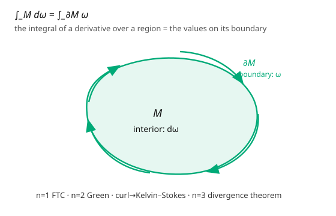

# Differential Geometry · Lesson 3.5: The generalized Stokes theorem

> ⏱ ~15 min · Module 3: Tensors and differential forms · Builds on: [3.4 Integration on manifolds](03-04-integration-on-manifolds.md) · Unlocks: [4.1 The covariant derivative and Christoffel symbols](04-01-covariant-derivative-christoffel.md)

## Why this matters

Every integral theorem you met in vector calculus — the fundamental theorem of calculus, Green's theorem, the Kelvin–Stokes (curl) theorem, the divergence theorem — is **one theorem**, written in one line:

$$\int_M d\omega = \int_{\partial M}\omega.$$

That's the payoff of the entire module. The exterior derivative ([3.3](03-03-exterior-derivative.md)) and integration ([3.4](03-04-integration-on-manifolds.md)) were built to fit together in exactly this statement, and it holds on *any* oriented manifold-with-boundary, in any dimension, with no cross products or coordinate-specific formulas. It also crystallizes a beautiful duality: $d$ (differentiation) is adjoint to $\partial$ (taking the boundary), and $d^2 = 0$ mirrors "the boundary of a boundary is empty."

## The idea

Read the equation aloud: **the integral of a derivative over a region equals the values of the original on the boundary.** That's the fundamental theorem of calculus, $\int_a^b f'\,dx = f(b) - f(a)$ — the "boundary" of the interval $[a,b]$ is its two endpoints $\{b\} - \{a\}$ (with signs = orientation), and $f'\,dx = d f$. Stokes says the *same sentence* works in every dimension: replace $f$ by a $(p{-}1)$-form $\omega$, $f'\,dx$ by $d\omega$, and the endpoints by the boundary manifold $\partial M$.

Why should it be true? Chop $M$ into tiny cells. On each cell, $\int_{\text{cell}}d\omega \approx \int_{\partial\text{cell}}\omega$ (a local, almost-definitional statement). When you add up neighboring cells, every *interior* wall is traversed twice with opposite orientations and **cancels** — only the outer boundary $\partial M$ survives. That telescoping cancellation, powered by consistent orientation, is the whole proof idea. The interior contributions ($d\omega$) reassemble into the boundary total ($\omega$ on $\partial M$).

The only subtlety is **orientation of the boundary**: $\partial M$ inherits a canonical orientation from $M$ (the "outward-normal-first" convention), and getting it right is what makes the signs of the classical theorems come out correctly.

## The formal version

Let $M$ be a smooth, oriented $n$-manifold **with boundary** $\partial M$ (an $(n-1)$-manifold), and let $\omega$ be a smooth, compactly supported $(n-1)$-form on $M$. Give $\partial M$ the **induced (boundary) orientation**. Then

$$\boxed{\ \int_M d\omega = \int_{\partial M}\omega.\ }$$

*In words:* integrating $d\omega$ over the whole region gives the same number as integrating $\omega$ over just the boundary. Special cases, all the *same equation* at different $n$ and degree:

| $n$ | $\omega$ | statement |
|---|---|---|
| $1$ | $0$-form $f$ on $[a,b]$ | $\int_a^b df = f(b) - f(a)$ — **FTC** |
| $2$ | $1$-form $P\,dx + Q\,dy$ | $\iint_M (Q_x - P_y)\,dA = \oint_{\partial M}P\,dx + Q\,dy$ — **Green** |
| $2$-surface in $\mathbb{R}^3$ | $1$-form | $\iint_S (\nabla\times\mathbf F)\cdot d\mathbf A = \oint_{\partial S}\mathbf F\cdot d\mathbf r$ — **Kelvin–Stokes** |
| $3$ | $2$-form | $\iiint_V (\nabla\cdot\mathbf F)\,dV = \oiint_{\partial V}\mathbf F\cdot d\mathbf A$ — **divergence theorem** |

The pairing "$d$ vs $\partial$" plus "$d^2 = 0$ vs $\partial\partial = \varnothing$" (a boundary has no boundary — a sphere is the boundary of a ball and itself has empty boundary) is the structural heart: differentiation and boundary-taking are adjoint.

## Picture

## Worked examples

**Example 1 (verify Stokes on the disk — this reproduces Green).** Let $M$ be the closed unit disk in $\mathbb{R}^2$ and $\omega = -y\,dx + x\,dy$. Compute both sides.

*Interior:* $d\omega = d(-y)\wedge dx + d(x)\wedge dy = -dy\wedge dx + dx\wedge dy = dx\wedge dy + dx\wedge dy = 2\,dx\wedge dy$. So $\int_M d\omega = \int_{\text{disk}} 2\,dA = 2\pi$ (twice the disk's area $\pi$).

*Boundary:* parametrize $\partial M$ (unit circle, counterclockwise) by $x = \cos t$, $y = \sin t$. Then $-y\,dx = -\sin t(-\sin t\,dt) = \sin^2 t\,dt$ and $x\,dy = \cos t\cos t\,dt = \cos^2 t\,dt$, so $\omega\big|_{\partial M} = (\sin^2 t + \cos^2 t)\,dt = dt$, and $\int_{\partial M}\omega = \int_0^{2\pi}dt = 2\pi$.

Both sides equal $2\pi$. ✓ This is Green's theorem, and as a bonus it shows the **area formula** $\text{Area} = \frac12\oint(x\,dy - y\,dx)$ (here $\frac12\cdot 2\pi = \pi$). Which classical theorem did we reproduce? Green's — the $n=2$ face of Stokes.

**Example 2 (the divergence theorem is the $n=3$ face).** Take $M$ the unit cube $[0,1]^3$ and $\omega = x\,dy\wedge dz$ (a 2-form). Then $d\omega = dx\wedge dy\wedge dz$, so $\int_M d\omega = \text{vol}(M) = 1$. On the boundary, $\omega = x\,dy\wedge dz$ integrates to zero on every face except the two faces $x = 0$ and $x = 1$ (elsewhere $dy\wedge dz$ or the value $x$ contributes nothing or the face is parametrized by other variables). On $x = 1$ (outward normal $+\hat x$) it gives $\int_{[0,1]^2}1\,dy\,dz = 1$; on $x = 0$ (outward normal $-\hat x$, opposite orientation) it gives $-\int 0\,dy\,dz = 0$. Total boundary integral $= 1 = \int_M d\omega$. ✓ This is $\iiint\operatorname{div}(x,0,0)\,dV = \oiint(x,0,0)\cdot d\mathbf A$ — the divergence theorem, since $\operatorname{div}(x,0,0) = 1$.

## Watch out

- **You might get the boundary orientation wrong.** The induced orientation ("outward-normal-first") is what makes signs come out right — reverse it and every classical theorem gains a spurious minus sign. For a planar region it's counterclockwise; for a solid it's the outward-pointing normal.
- **You might apply Stokes across a singularity or hole.** The theorem needs $\omega$ smooth on *all* of $M$. The angle form on the punctured plane ([3.4](03-04-integration-on-manifolds.md) P3) integrates to $2\pi$, not $0$, around a loop enclosing the puncture — not a violation, because the disk it bounds isn't inside the domain of $\omega$.
- **You might think $\partial M$ can have its own boundary.** It can't: $\partial(\partial M) = \varnothing$. A sphere bounds a ball but has no boundary itself. This "$\partial\partial = \varnothing$" is the geometric twin of $d^2 = 0$, and it's why iterating Stokes gives $0 = \int_{\partial\partial M}\omega$.

## One-liner

> $\int_M d\omega = \int_{\partial M}\omega$: the integral of a derivative over a region is the original evaluated on the boundary — one line that is the FTC, Green, curl-Stokes, and the divergence theorem all at once.

## Problems

**P1 (🟢)** Use $\int_M d\omega = \int_{\partial M}\omega$ with $\omega = x\,dy$ to compute the area of the unit disk as a boundary integral $\oint_{\partial M} x\,dy$. (First find $d\omega$, confirm it's the area form, then evaluate the loop integral.)

**P2 (🟡)** Verify the theorem for $\omega = xy\,dx$ on the unit square $M = [0,1]^2$: compute $\int_M d\omega$ directly, and $\int_{\partial M}\omega$ by summing over the four edges with correct (counterclockwise) orientation.

**P3 (🔴, optional)** Deduce the fundamental theorem of calculus as the $n = 1$ case: let $M = [a,b]$, $\omega = f$ a $0$-form. Identify $d\omega$, describe $\partial M$ *with its induced orientation* (why is $b$ counted with $+$ and $a$ with $-$?), and recover $\int_a^b f'\,dx = f(b) - f(a)$.

Solutions

**P1** $d(x\,dy) = dx\wedge dy$, the area form, so $\int_M dx\wedge dy = \text{Area}$. By Stokes it equals $\oint_{\partial M}x\,dy$. On the unit circle $x = \cos t$, $y = \sin t$: $x\,dy = \cos t\cos t\,dt = \cos^2 t\,dt$, so $\oint x\,dy = \int_0^{2\pi}\cos^2 t\,dt = \pi$. Hence the disk's area is $\pi$. ✓

**P2** Interior: $d\omega = d(xy)\wedge dx = (y\,dx + x\,dy)\wedge dx = x\,dy\wedge dx = -x\,dx\wedge dy$. So $\int_M d\omega = -\int_0^1\int_0^1 x\,dx\,dy = -\frac12$. Boundary (CCW): bottom $y=0$, $x: 0\to1$: $\omega = xy\,dx = 0$. Right $x=1$, $y:0\to1$: $dx = 0$, contributes $0$. Top $y=1$, $x:1\to0$: $\int_1^0 x\cdot 1\,dx = -\frac12$. Left $x=0$, $y:1\to0$: $dx=0$, contributes $0$. Sum $= -\frac12$. Both sides $-\frac12$. ✓

**P3** $\omega = f$ is a $0$-form, so $d\omega = df = f'(x)\,dx$, and $\int_M d\omega = \int_a^b f'(x)\,dx$. The boundary $\partial[a,b] = \{b\} - \{a\}$: the induced orientation assigns $+$ to the endpoint where the outward direction agrees with increasing $x$ (the right end $b$) and $-$ to the left end $a$ (outward points in the $-x$ direction). Integrating a $0$-form over an oriented point just evaluates it with that sign: $\int_{\partial M}f = f(b) - f(a)$. Equating gives $\int_a^b f'\,dx = f(b) - f(a)$ — the FTC. ∎

## Flashback

**From Lesson 3.4 (Integration on manifolds):** Integrate the area form $\omega = a^2\sin\theta\,d\theta\wedge d\phi$ over the full sphere of radius $a = 3$.

Solution

$\int_{S^2}\omega = \int_0^{2\pi}\int_0^\pi 9\sin\theta\,d\theta\,d\phi = 9\cdot 2\pi\cdot[-\cos\theta]_0^\pi = 9\cdot 2\pi\cdot 2 = 36\pi$. (Matches $4\pi a^2 = 4\pi\cdot 9 = 36\pi$.) ✓

## Connections

- **Backward:** the two integrals are [3.4](03-04-integration-on-manifolds.md)'s form integrals; $d\omega$ is [3.3](03-03-exterior-derivative.md)'s exterior derivative, and $d^2 = 0$ is mirrored by $\partial\partial = \varnothing$.
- **Forward:** Module 4 leaves the "linear" world of forms for the *metric/connection* world — but Stokes underlies integral conservation laws (Gauss's law, charge conservation $d\star F = J$) throughout physics. The de Rham theorem ([`topology`](../../topology/syllabus.md)) turns "closed mod exact" into a pairing with cycles via this very integral.
- **Sideways (physics):** Maxwell's equations are Stokes/Gauss theorems for the field 2-form $F$; the action principle equates a bulk integral to boundary data; and in [`analytical-mechanics`](../../analytical-mechanics/syllabus.md), the invariance of $\oint p\,dq$ (Poincaré–Cartan) is a Stokes statement about the symplectic form.

*Module 3 capstone (Boss Problem 3): take a specific 1-form, compute $d\omega$, and verify $\int_M d\omega = \int_{\partial M}\omega$ on a chosen region — then name which classical theorem you reproduced. Example 1 above is exactly that, yielding Green's theorem.*
