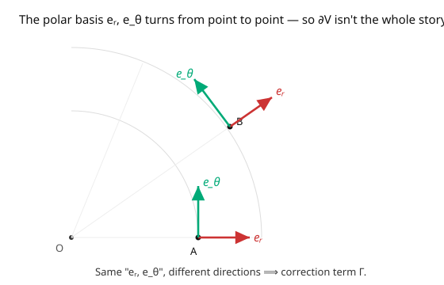

# Differential Geometry · Lesson 4.1: The covariant derivative and Christoffel symbols

> ⏱ ~15 min · Module 4: Connections, geodesics, and curvature · Builds on: [3.1 Tensors as multilinear maps](03-01-tensors-multilinear-maps.md), [2.4 Vector fields and the pushforward](02-04-vector-fields-pushforward.md) · Unlocks: [4.2 Parallel transport](04-02-parallel-transport.md)

## Why this matters

To do physics on a curved space you must differentiate vector fields — compute acceleration, write $\mathbf F = m\mathbf a$, form field equations. But we saw in [3.1](03-01-tensors-multilinear-maps.md) that the naive derivative $\partial_i V^j$ is **not a tensor**: it gives different answers in different coordinates, so it's geometrically meaningless. The fix is the **covariant derivative** $\nabla$, and it's the gateway to all of general relativity and gauge theory. Its bookkeeping — the **Christoffel symbols** $\Gamma^k_{ij}$ — is the "connection" that tells you how to compare vectors at neighboring points. Everything left in this course (parallel transport, geodesics, curvature, Einstein's equations) is built on $\nabla$.

## The idea

Here's the core problem. To differentiate a vector field, you compare $V$ at $p$ with $V$ at a nearby point $q$ and take the difference over the distance. But $V(p) \in T_pM$ and $V(q) \in T_qM$ live in **different vector spaces** — on a curved manifold there's no automatic way to subtract them. The naive $\partial_i V^j$ pretends the basis vectors $\partial_j$ don't change from point to point. On a curved space, or even in curved *coordinates*, they do.

Look at polar coordinates on the flat plane (the picture): the basis $\{e_r, e_\theta\}$ physically **rotates** as you move around. A field that "looks constant" in components — say $V = e_r$ everywhere — is actually turning. Its true rate of change has two parts: how the *components* change ($\partial_i V^j$) **plus** how the *basis vectors* themselves change. That second part is the correction the naive derivative forgot.

A **connection** $\nabla$ supplies exactly that correction. It records how each basis vector changes when you move in each direction, packaged as numbers $\Gamma^k_{ij}$ — "the $k$-component of how $\partial_j$ changes as you move in the $\partial_i$ direction." Add the correction and you get a genuine tensor: a coordinate-independent derivative. The magic is that $\Gamma$ is itself *not* a tensor — its non-tensorial transformation is precisely engineered to cancel the non-tensorial junk in $\partial_i V^j$, leaving a clean tensor behind.

## The formal version

An **affine connection** $\nabla$ assigns to vector fields $X, Y$ a vector field $\nabla_X Y$ (the derivative of $Y$ along $X$), $\mathbb{R}$-linear in $Y$, function-linear in $X$, and obeying the Leibniz rule $\nabla_X(fY) = (Xf)Y + f\nabla_X Y$. In a coordinate basis it is fixed by the **Christoffel symbols** $\Gamma^k_{ij}$ via

$$\nabla_{\partial_i}\partial_j = \Gamma^k_{ij}\,\partial_k.$$

*In words:* $\Gamma^k_{ij}$ is the $k$-th component of the change in the basis field $\partial_j$ as you move in the $\partial_i$ direction. For a general field $Y = Y^j\partial_j$ differentiated along $X = X^i\partial_i$, the Leibniz rule gives the **components of the covariant derivative**:

$$(\nabla_X Y)^k = X^i\Bigl(\partial_i Y^k + \Gamma^k_{ij}Y^j\Bigr).$$

The bracket $\nabla_i Y^k := \partial_i Y^k + \Gamma^k_{ij}Y^j$ is the covariant derivative's components — the naive $\partial_i Y^k$ **plus** the connection correction. Under a coordinate change the Christoffel symbols transform **inhomogeneously**,

$$\Gamma'^{\,k}_{ij} = \frac{\partial x'^k}{\partial x^c}\frac{\partial x^a}{\partial x'^i}\frac{\partial x^b}{\partial x'^j}\Gamma^c_{ab} \;+\; \frac{\partial x'^k}{\partial x^c}\frac{\partial^2 x^c}{\partial x'^i\partial x'^j},$$

the second term making $\Gamma$ **not a tensor** — and that extra piece is exactly what cancels the non-tensorial term in $\partial_i Y^k$ (from [3.1](03-01-tensors-multilinear-maps.md)), so that $\nabla_i Y^k$ *is* a tensor. *In words:* $\Gamma$ is deliberately not a tensor so that $\nabla$ can be one.

## Picture

## Worked examples

**Example 1 (Christoffel symbols of the flat plane in polar coordinates).** The coordinate basis vectors, in Cartesian components, are $\partial_r = (\cos\theta, \sin\theta)$ and $\partial_\theta = (-r\sin\theta, r\cos\theta)$. Differentiate them and re-express in the $\{\partial_r, \partial_\theta\}$ basis:

$$\partial_r\partial_r = 0, \quad \partial_\theta\partial_r = (-\sin\theta,\cos\theta) = \tfrac1r\partial_\theta, \quad \partial_r\partial_\theta = (-\sin\theta,\cos\theta) = \tfrac1r\partial_\theta, \quad \partial_\theta\partial_\theta = -r(\cos\theta,\sin\theta) = -r\,\partial_r.$$

Reading off $\nabla_{\partial_i}\partial_j = \Gamma^k_{ij}\partial_k$:

$$\Gamma^\theta_{r\theta} = \Gamma^\theta_{\theta r} = \frac1r, \qquad \Gamma^r_{\theta\theta} = -r, \qquad \text{all others } 0.$$

Crucially, **the plane is still flat** — these nonzero $\Gamma$'s come entirely from the *curved coordinates*, not from any curvature of the space. Nonzero Christoffel symbols do **not** mean a curved manifold (that's [4.4](04-04-riemann-curvature-tensor.md)'s job to detect).

**Example 2 (a "constant-looking" field that isn't).** Consider $V = \partial_r$ — a unit radial field, components $(V^r, V^\theta) = (1, 0)$, seemingly constant. Its covariant derivative in the $\theta$-direction:

$$(\nabla_{\partial_\theta}V)^k = \partial_\theta V^k + \Gamma^k_{\theta j}V^j = 0 + \Gamma^k_{\theta r}\cdot 1.$$

The nonzero piece is $k = \theta$: $(\nabla_{\partial_\theta}V)^\theta = \Gamma^\theta_{\theta r} = \frac1r$, so $\nabla_{\partial_\theta}V = \frac1r\partial_\theta \neq 0$. The naive derivative said "$\partial_\theta V = 0$, nothing changes"; the covariant derivative correctly reports that the radial direction *rotates* as $\theta$ increases. The correction term caught what the components hid.

## Watch out

- **You might think nonzero $\Gamma^k_{ij}$ means the space is curved.** No — flat $\mathbb{R}^2$ in polar coordinates has nonzero $\Gamma$'s (Example 1). Christoffel symbols detect *coordinate* twisting, not intrinsic curvature. Only the Riemann tensor ([4.4](04-04-riemann-curvature-tensor.md)), built from $\Gamma$ *and its derivatives*, sees real curvature.
- **You might treat $\Gamma^k_{ij}$ as a tensor.** It isn't — it transforms with an inhomogeneous second-derivative term. You cannot conclude "$\Gamma = 0$ in one frame $\Rightarrow \Gamma = 0$ in all." (In fact at any single point you can always choose coordinates making $\Gamma = 0$ there — normal coordinates.)
- **You might forget which index is the derivative direction.** In $\Gamma^k_{ij}$, the lower-left $i$ is the direction you're moving, $j$ is the vector being differentiated, $k$ the output component. For the Levi-Civita connection ([5.2](05-02-levi-civita-connection.md)) the two lower indices are symmetric, $\Gamma^k_{ij} = \Gamma^k_{ji}$, but in general they need not be.

## One-liner

> The covariant derivative $\nabla_i V^k = \partial_i V^k + \Gamma^k_{ij}V^j$ fixes the naive derivative by adding a correction $\Gamma$ for how the basis vectors themselves turn — and $\Gamma$ is deliberately not a tensor so that $\nabla$ is.

## Problems

**P1 (🟢)** Using the polar Christoffel symbols $\Gamma^\theta_{r\theta} = \Gamma^\theta_{\theta r} = \frac1r$, $\Gamma^r_{\theta\theta} = -r$, compute $\nabla_{\partial_r}V$ and $\nabla_{\partial_\theta}V$ for the field $V = \partial_\theta$ (components $(0,1)$).

**P2 (🟡)** In flat $\mathbb{R}^2$ with *Cartesian* coordinates, what are all the Christoffel symbols, and why? Use this to explain why $\nabla$ reduces to the ordinary $\partial$ in Cartesian coordinates, consistent with Example 1's polar $\Gamma$'s being a coordinate artifact.

**P3 (🔴, optional)** Show the difference of two connections, $\Gamma^k_{ij} - \tilde\Gamma^k_{ij}$, **is** a tensor, even though neither is. *Hint:* both have the same inhomogeneous term in their transformation law; subtract.

Solutions

**P1** For $V = \partial_\theta$, components $(V^r, V^\theta) = (0, 1)$.
$\nabla_{\partial_r}V$: $(\nabla_{\partial_r}V)^k = \partial_r V^k + \Gamma^k_{rj}V^j = 0 + \Gamma^k_{r\theta}\cdot 1$. Only $\Gamma^\theta_{r\theta} = \frac1r$ is nonzero, so $\nabla_{\partial_r}V = \frac1r\partial_\theta$.
$\nabla_{\partial_\theta}V$: $(\nabla_{\partial_\theta}V)^k = \partial_\theta V^k + \Gamma^k_{\theta j}V^j = 0 + \Gamma^k_{\theta\theta}\cdot 1$. Only $\Gamma^r_{\theta\theta} = -r$ is nonzero, so $\nabla_{\partial_\theta}V = -r\,\partial_r$. (This says the angular field $\partial_\theta$ has length $r$ and, transported around, points back toward the origin — exactly the centripetal term.)

**P2** In Cartesian coordinates the basis vectors $\partial_x, \partial_y$ are the *same constant vectors everywhere*, so $\partial_i\partial_j = 0$ and **all** $\Gamma^k_{ij} = 0$. Then $\nabla_i V^k = \partial_i V^k$ — the covariant derivative is just the partial derivative. The polar $\Gamma$'s were nonzero only because the polar basis rotates; changing to Cartesian removes them, confirming they encoded coordinates, not curvature. (No coordinate change can remove $\Gamma$ *everywhere at once* on a genuinely curved space — that's the invariant content of curvature.)

**P3** Under $x\to x'$, both transform as $\Gamma'^k_{ij} = (\text{tensor part with }\Gamma) + T^k_{ij}$ and $\tilde\Gamma'^k_{ij} = (\text{tensor part with }\tilde\Gamma) + T^k_{ij}$, where the inhomogeneous term $T^k_{ij} = \frac{\partial x'^k}{\partial x^c}\frac{\partial^2 x^c}{\partial x'^i\partial x'^j}$ is **identical** for both (it depends only on the coordinate change, not the connection). Subtracting, the $T$ terms cancel and $(\Gamma - \tilde\Gamma)'^k_{ij} = \frac{\partial x'^k}{\partial x^c}\frac{\partial x^a}{\partial x'^i}\frac{\partial x^b}{\partial x'^j}(\Gamma - \tilde\Gamma)^c_{ab}$ — the pure $(1,2)$-tensor law. So the difference is a tensor. ∎

## Flashback

**From Lesson 3.1 (Tensors as multilinear maps):** We saw $\partial_i V^j$ fails to be a tensor because of an extra second-derivative term. Show that under an **affine** (linear) coordinate change $x'^i = A^i{}_j x^j + b^i$ with constant $A$, the offending term vanishes, so $\partial_i V^j$ *does* transform tensorially. Which fact makes it work?

Solution

The non-tensorial term in the transformation of $\partial_i V^j$ was $\frac{\partial x^a}{\partial x'^i}\frac{\partial^2 x'^j}{\partial x^a\partial x^b}V^b$, proportional to the **second** derivatives of the coordinate change. For an affine map $x'^i = A^i{}_j x^j + b^i$ with constant $A^i{}_j$, we have $\frac{\partial x'^j}{\partial x^b} = A^j{}_b$ constant, so all second derivatives $\frac{\partial^2 x'^j}{\partial x^a\partial x^b} = 0$. The extra term vanishes and only the tensorial part survives. So $\partial_i V^j$ behaves like a tensor under linear/affine changes — it's exactly the *curved* (nonlinear) coordinate changes, with nonzero second derivatives, that break it and force the connection correction. ✓

## Connections

- **Backward:** this directly repairs [3.1](03-01-tensors-multilinear-maps.md)'s broken $\partial_i V^j$; the basis vectors being differentiated are the $\partial_i$ of [2.3](02-03-tangent-space.md), assembled into fields as in [2.4](02-04-vector-fields-pushforward.md).
- **Forward:** [4.2](04-02-parallel-transport.md) sets $\nabla = 0$ along a curve to transport vectors; [4.3](04-03-geodesics.md) does it for the tangent vector itself (geodesics); [4.4](04-04-riemann-curvature-tensor.md) builds curvature from $\Gamma$ and $\partial\Gamma$; [5.2](05-02-levi-civita-connection.md) pins $\Gamma$ down from a metric.
- **Sideways (gauge theory):** a connection is *exactly* a gauge field — $\Gamma$ plays the role of the gauge potential $A_\mu$, the covariant derivative $\nabla = \partial + \Gamma$ is the gauge-covariant derivative $D = \partial + A$, and its non-tensorial transformation is a gauge transformation. This is made explicit in [5.4](05-04-fiber-bundles-connections.md) and underlies [`qft`](../../qft/syllabus.md).
