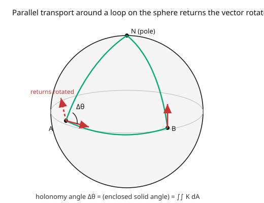

# Differential Geometry · Lesson 4.2: Parallel transport

> ⏱ ~15 min · Module 4: Connections, geodesics, and curvature · Builds on: [4.1 The covariant derivative and Christoffel symbols](04-01-covariant-derivative-christoffel.md) · Unlocks: [4.3 Geodesics](04-03-geodesics.md)

## Why this matters

Now that $\nabla$ lets us differentiate, we can ask the transport question: how do you move a vector from one point to another "without changing it"? On a flat plane you just slide it, keeping it parallel — obvious. On a curved surface there's no obvious answer, and the shocking discovery is that **the answer depends on the path you take**. Carry a vector around a closed loop on a sphere and it comes back *rotated*. That path-dependence — called **holonomy** — is not a bug; it *is* curvature, made visible and physical. It's the Foucault pendulum's precession, the geometric phase in quantum mechanics, the geodetic precession of a gyroscope orbiting Earth (measured by Gravity Probe B). Parallel transport is where curvature stops being a formula and becomes something you can watch.

## The idea

"Keep the vector unchanged as you move" should mean: its covariant derivative *along your path* is zero. The covariant derivative already knows how to subtract off the twisting of the coordinate basis ([4.1](04-01-covariant-derivative-christoffel.md)), so "$\nabla$ along the curve $= 0$" is the honest statement of "not turning, as far as the geometry is concerned." This is **parallel transport**, and it's an ordinary differential equation: given the vector at the start, it's uniquely determined all along the curve.

Here's the twist that makes it profound. On the flat plane, transport a vector from $A$ to $B$ and the result doesn't care which route you took — parallelism is absolute. On a curved space it does. Walk a vector from the north pole down to the equator, along the equator a quarter-turn, then back up to the pole (the picture): the vector you return with is **rotated** relative to the one you left with, by an angle equal to the area enclosed (times the curvature). Same start, closed loop, different vector. The rotation around a loop is the **holonomy**, and it measures exactly how curved the region inside is — the precise link is the Riemann tensor ([4.4](04-04-riemann-curvature-tensor.md)).

## The formal version

A vector field $V$ is **parallel-transported** along a curve $\gamma(t)$ if its covariant derivative along $\gamma$ vanishes:

$$\frac{DV}{dt} := \nabla_{\dot\gamma}V = 0, \qquad\text{i.e.}\qquad \frac{dV^k}{dt} + \Gamma^k_{ij}\,\dot\gamma^i\,V^j = 0.$$

*In words:* as you move along $\gamma$, the components $V^k$ change at exactly the rate needed to compensate for the turning basis — the vector stays "as constant as the geometry allows." This is a first-order linear ODE in the $V^k$; given an initial vector $V(0)$, it has a **unique solution** along the whole curve, the parallel transport of $V(0)$.

Key properties:

- **Linearity / isometry (for a metric connection).** Transport is a linear map $T_pM \to T_qM$; with the Levi-Civita connection ([5.2](05-02-levi-civita-connection.md)) it preserves lengths and angles (it's a rotation).
- **Path dependence & holonomy.** For a closed loop, the transport map $T_pM \to T_pM$ is generally a nontrivial rotation, the **holonomy** of the loop. On a surface, the holonomy angle around a small loop equals $\iint_{\text{enclosed}} K\,dA$ (Gaussian curvature integrated over the enclosed area).
- **Flat $\Leftrightarrow$ path-independent.** Transport is path-independent (holonomy trivial for all loops) iff the curvature vanishes.

## Picture

## Worked examples

**Example 1 (holonomy on the sphere — a right-angle triangle).** On the unit sphere, transport a vector around the geodesic triangle with vertices at the north pole $N$ and two equator points $A$, $B$ separated by longitude $\Delta\phi = \pi/2$ (a quarter turn). Starting at $N$ with a vector pointing toward $A$: transporting down the meridian $N\to A$ keeps it pointing "south along that meridian"; along the equator $A\to B$ it stays perpendicular to the equator (pointing north); up the meridian $B\to N$ it stays along that meridian. Back at $N$, the vector has rotated by $\Delta\phi = \pi/2$. Check against the curvature formula: the enclosed area is $\iint K\,dA = 1\cdot(\text{area of the triangle})$, and a sphere triangle with three right angles... here two base angles are right and the apex angle is $\Delta\phi = \pi/2$, giving spherical excess $(\frac\pi2+\frac\pi2+\frac\pi2) - \pi = \frac\pi2$, which equals the enclosed area on the unit sphere — matching the holonomy $\frac\pi2$. **The vector came back turned by $90°$**, and that angle *is* the enclosed curvature.

**Example 2 (flat space — transport is trivial).** On $\mathbb{R}^2$ in Cartesian coordinates all $\Gamma^k_{ij} = 0$, so the transport equation is $\frac{dV^k}{dt} = 0$: the components stay constant. A vector transported around *any* closed loop returns **unchanged** — zero holonomy, as expected for a flat space. (On a cylinder, also $K = 0$, transport around a contractible loop is trivial too — but around the waist it can look nontrivial in an embedding sense while the intrinsic holonomy is still zero. Intrinsic flatness $\Rightarrow$ trivial holonomy for all *contractible* loops.)

## Watch out

- **You might think "parallel" means constant components.** Only in Cartesian coordinates. In general the components $V^k$ *must* change (that's the $\Gamma^k_{ij}\dot\gamma^i V^j$ term) precisely to keep the vector geometrically unchanged. Constant components in curved coordinates would be a genuinely turning vector.
- **You might expect transport to be path-independent.** It is exactly when the space is flat. On any curved region, different paths between the same two points give different results — there's no global notion of "the same direction over there." This is *the* defining feature of curvature, not a technicality.
- **You might conflate holonomy with the vector "falling behind."** The transported vector doesn't lag or lose magnitude (metric transport preserves length); it comes back **rotated**. The rotation angle, not any stretching, carries the curvature information.

## One-liner

> Parallel transport moves a vector by demanding $\nabla$-along-the-path $= 0$; on a curved space the result depends on the path, and the rotation you pick up around a closed loop (holonomy) is exactly the curvature enclosed.

## Problems

**P1 (🟢)** Write the parallel transport equation $\dot V^k + \Gamma^k_{ij}\dot\gamma^i V^j = 0$ explicitly for transport along a *radial* line in the plane (polar coordinates, $\theta$ fixed, $r$ increasing), using $\Gamma^\theta_{r\theta} = \frac1r$, $\Gamma^r_{\theta\theta} = -r$ (others $0$). What does it say about $V^r$ and $V^\theta$?

**P2 (🟡)** Explain why parallel transport around a small loop on a flat cylinder (intrinsic $K = 0$) produces zero rotation, even though the cylinder is visibly curved in $\mathbb{R}^3$. Which kind of curvature does holonomy detect — intrinsic or extrinsic?

**P3 (🔴, optional)** A vector is parallel-transported around the boundary of a spherical "cap" (the region above latitude $\theta_0$) on the unit sphere. Using holonomy $= \iint_{\text{cap}} K\,dA$ with $K = 1$, compute the rotation angle. *Hint:* the cap's area is $\int_0^{2\pi}\int_0^{\theta_0}\sin\theta\,d\theta\,d\phi$. Check it goes to $0$ as $\theta_0\to 0$ (tiny cap) and to $2\pi$ as $\theta_0\to\pi$ (whole sphere).

Solutions

**P1** Along a radial line, $\dot\gamma = (\dot r, \dot\theta) = (1, 0)$ (moving in $r$ only). The equation $\dot V^k + \Gamma^k_{ij}\dot\gamma^i V^j = \dot V^k + \Gamma^k_{rj}V^j = 0$:
- $k = r$: $\dot V^r + \Gamma^r_{rj}V^j = \dot V^r + 0 = 0$, so $V^r$ is constant.
- $k = \theta$: $\dot V^\theta + \Gamma^\theta_{rj}V^j = \dot V^\theta + \Gamma^\theta_{r\theta}V^\theta = \dot V^\theta + \frac1r V^\theta = 0$, so $\frac{dV^\theta}{dr} = -\frac{V^\theta}{r}$, giving $V^\theta \propto \frac1r$.
Interpretation: the *component* $V^\theta$ scales as $1/r$ precisely so the physical vector stays pointing the same absolute direction as you move outward (since the basis vector $\partial_\theta$ has length $r$, growing with $r$). The transport is trivial in disguise — the plane is flat.

**P2** Holonomy detects **intrinsic** curvature ($K$), and the cylinder has $K = 0$ (it's intrinsically flat — [1.4](01-04-gaussian-curvature-theorema-egregium.md), it unrolls to a plane). The parallel transport equation uses only the *intrinsic* connection (Christoffels from the induced metric), which is identical to the plane's, so transport around a small loop returns the vector unchanged. The cylinder's visible bending is *extrinsic* (nonzero mean curvature $H$), and holonomy is blind to it. This is a clean demonstration that parallel transport measures the same thing the Theorema Egregium said was intrinsic.

**P3** Cap area $= \int_0^{2\pi}\int_0^{\theta_0}\sin\theta\,d\theta\,d\phi = 2\pi(1 - \cos\theta_0)$. With $K = 1$, the holonomy rotation is $\iint K\,dA = 2\pi(1 - \cos\theta_0)$. As $\theta_0\to 0$: $2\pi(1-1) = 0$ (tiny cap, no rotation). As $\theta_0\to\pi$: $2\pi(1-(-1)) = 4\pi$ — but a rotation is defined mod $2\pi$, and the whole sphere's boundary shrinks to a point, so effectively the enclosed hemisphere-and-beyond wraps around; the meaningful small-loop statement holds for $\theta_0$ up to $\pi/2$ (hemisphere), giving $2\pi(1-0) = 2\pi$. The formula's smooth growth with cap size is the point: bigger enclosed curvature, bigger holonomy. ∎

## Flashback

**From Lesson 4.1 (The covariant derivative and Christoffel symbols):** For flat $\mathbb{R}^2$ in polar coordinates, compute $\nabla_{\partial_\theta}(\partial_\theta)$ using $\Gamma^r_{\theta\theta} = -r$ (others with lower indices $\theta\theta$ zero). Interpret the sign.

Solution

$(\nabla_{\partial_\theta}\partial_\theta)^k = \Gamma^k_{\theta\theta}$. Only $\Gamma^r_{\theta\theta} = -r$ is nonzero, so $\nabla_{\partial_\theta}\partial_\theta = -r\,\partial_r$. The negative sign points **inward** (toward the origin): as you move in the $\theta$-direction, the angular basis vector $\partial_\theta$ curves back toward the center — this is precisely the centripetal acceleration of circular motion. (Set up the geodesic equation with this and you'll see straight lines through the origin, next lesson.) ✓

## Connections

- **Backward:** the transport ODE is $\nabla_{\dot\gamma}V = 0$ with the $\nabla$ of [4.1](04-01-covariant-derivative-christoffel.md); the "vector carried along a curve without turning" echoes the Frenet frame of [1.1](01-01-curves-arclength-frenet.md), now intrinsic.
- **Forward:** [4.3](04-03-geodesics.md) applies parallel transport to the tangent vector itself (a geodesic transports its own velocity); [4.4](04-04-riemann-curvature-tensor.md) makes "holonomy around an infinitesimal loop" precise as the Riemann tensor.
- **Sideways (physics):** a gyroscope free-falls with its spin axis parallel-transported — geodetic precession in general relativity ([`relativity`](../../relativity/syllabus.md)); the Berry phase in quantum mechanics is the holonomy of a connection on a bundle of states; the Foucault pendulum's daily rotation is holonomy on the sphere of the Earth.
