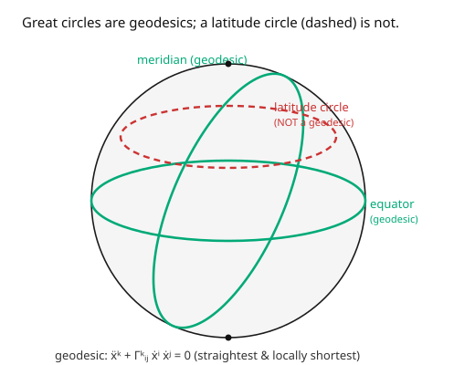

# Differential Geometry · Lesson 4.3: Geodesics

> ⏱ ~15 min · Module 4: Connections, geodesics, and curvature · Builds on: [4.2 Parallel transport](04-02-parallel-transport.md) · Unlocks: [4.4 The Riemann curvature tensor](04-04-riemann-curvature-tensor.md)

## Why this matters

A geodesic is the curved-space answer to "go straight." It's the path a free particle follows, the trajectory of a planet or a light ray in general relativity, the shortest air route between two cities. Geodesics unify two ideas that coincide on curved spaces: **straightest** (zero acceleration) and **locally shortest** (extremal length). In general relativity this is *the* physical principle — matter falls along geodesics of curved spacetime, and "gravity" is just geodesics looking curved because spacetime is. Solving the geodesic equation is how you actually compute orbits, light bending, and GPS corrections. It also connects straight back to [`analytical-mechanics`](../../analytical-mechanics/syllabus.md): geodesics are the Euler–Lagrange equations of the length (or energy) functional.

## The idea

Two ways to say "straight," both giving the same curves:

**Straightest (auto-parallel).** A straight line never turns — its velocity vector stays pointing the same way. In curved-space language: the velocity is **parallel-transported along the curve itself**. From [4.2](04-02-parallel-transport.md), that means $\nabla_{\dot\gamma}\dot\gamma = 0$: the curve carries its own tangent vector without turning. No steering; you just coast, and the geometry decides where you go.

**Shortest (extremal length).** A geodesic locally minimizes distance — it's the path of least length between nearby points (like a taut string on a surface). Making the length integral stationary is a calculus-of-variations problem, and its Euler–Lagrange equation is... the same geodesic equation. (Great circles are the shortest routes on a globe; that's why flights over the Atlantic arc north.)

That these two notions — no acceleration, and least length — produce identical curves is a small miracle, true for the metric-compatible Levi-Civita connection ([5.2](05-02-levi-civita-connection.md)). On a sphere both give **great circles**; a latitude circle (except the equator) is neither straightest nor shortest, so it's not a geodesic (the picture).

## The formal version

A curve $\gamma(t)$ is a **geodesic** if its tangent is parallel along it, $\nabla_{\dot\gamma}\dot\gamma = 0$, which in coordinates is the **geodesic equation**

$$\ddot x^k + \Gamma^k_{ij}\,\dot x^i\,\dot x^j = 0.$$

*In words:* the coordinate acceleration $\ddot x^k$ is exactly cancelled by the connection term, so there is zero *covariant* acceleration — the curve isn't turning as far as the geometry is concerned. This is a second-order ODE; given a starting point and starting velocity, there's a unique geodesic (short-time).

**Variational form.** Geodesics extremize the length $L[\gamma] = \int\sqrt{g_{ij}\dot x^i\dot x^j}\,dt$ (equivalently the energy $E[\gamma] = \frac12\int g_{ij}\dot x^i\dot x^j\,dt$); the Euler–Lagrange equations of $E$ *are* the geodesic equation, with $\Gamma$ the Levi-Civita symbols. *In words:* "straightest" and "locally shortest" give the same equation. A geodesic parametrized so $|\dot\gamma|$ is constant is **affinely parametrized** (arc length is one such choice).

**Exponential map.** Fix $p$ and a tangent vector $v \in T_pM$; shoot the geodesic starting at $p$ with velocity $v$ and follow it for unit parameter time. The endpoint is $\exp_p(v)$. *In words:* $\exp_p$ turns straight-line data in the tangent space into actual points on the manifold — the curved-space version of "walk distance $|v|$ in direction $v$."

## Picture

## Worked examples

**Example 1 (flat space — geodesics are straight lines).** In $\mathbb{R}^n$ with Cartesian coordinates all $\Gamma^k_{ij} = 0$, so the geodesic equation collapses to $\ddot x^k = 0$. Integrating: $x^k(t) = a^k t + b^k$ — a straight line traversed at constant velocity. Exactly what "straightest and shortest" should give in flat space, and a reassuring sanity check. (In polar coordinates the *same* straight lines satisfy the geodesic equation with the nonzero polar $\Gamma$'s — the curve is coordinate-independent even though the equation looks different.)

**Example 2 (the sphere — great circles).** The unit sphere has metric $d\theta^2 + \sin^2\theta\,d\phi^2$ and Christoffel symbols

$$\Gamma^\theta_{\phi\phi} = -\sin\theta\cos\theta, \qquad \Gamma^\phi_{\theta\phi} = \Gamma^\phi_{\phi\theta} = \cot\theta \quad(\text{others } 0).$$

Test the **equator** $\theta(t) = \tfrac\pi2$, $\phi(t) = t$. The $\theta$-equation: $\ddot\theta + \Gamma^\theta_{\phi\phi}\dot\phi^2 = 0 + (-\sin\tfrac\pi2\cos\tfrac\pi2)(1) = 0$ (since $\cos\tfrac\pi2 = 0$). ✓ The $\phi$-equation: $\ddot\phi + 2\Gamma^\phi_{\theta\phi}\dot\theta\dot\phi = 0 + 2\cot\theta\cdot 0\cdot 1 = 0$. ✓ So the equator is a geodesic. Likewise every **meridian** ($\phi$ fixed, $\theta = t$) satisfies it. Now test a non-equatorial **latitude circle** $\theta = \theta_0 \neq \tfrac\pi2$, $\phi = t$: the $\theta$-equation gives $\ddot\theta + \Gamma^\theta_{\phi\phi}\dot\phi^2 = -\sin\theta_0\cos\theta_0 \neq 0$ — **fails**. So latitude circles (other than the equator) are *not* geodesics: a plane flying due east along a parallel is constantly steering, which is why the shortest route bows toward the pole. Great circles win.

## Watch out

- **You might think geodesics are globally shortest.** Only *locally*. On a sphere, the two ways around a great circle both are geodesics but only the shorter arc minimizes distance; the long way is a geodesic that isn't shortest. Geodesic = *stationary* length, not guaranteed minimal.
- **You might change parametrization carelessly.** The clean equation $\ddot x^k + \Gamma^k_{ij}\dot x^i\dot x^j = 0$ assumes an **affine** parameter (constant speed). A non-affine reparametrization adds a $\lambda(t)\dot x^k$ term on the right. Use arc length or any constant-speed parameter to keep it clean.
- **You might expect a geodesic to look straight in your coordinates.** A great circle looks curved on a flat map; a light ray looks bent near the Sun. "Straight" means zero *covariant* acceleration, not zero coordinate acceleration — the whole point of Module 4.

## One-liner

> A geodesic is the curved-space straight line — it parallel-transports its own velocity ($\nabla_{\dot\gamma}\dot\gamma = 0$) and locally minimizes length — and on a sphere those are the great circles.

## Problems

**P1 (🟢)** Verify that a meridian of the unit sphere, $\phi = \phi_0$ (constant), $\theta(t) = t$, satisfies both components of the geodesic equation, using $\Gamma^\theta_{\phi\phi} = -\sin\theta\cos\theta$ and $\Gamma^\phi_{\theta\phi} = \cot\theta$.

**P2 (🟡)** Write the two geodesic equations for the sphere explicitly (the $\theta$- and $\phi$-equations with the given $\Gamma$'s). Then show the $\phi$-equation implies $\sin^2\theta\,\dot\phi = \text{const}$ (a conserved quantity — a preview of Killing vectors and angular momentum, [5.3](05-03-lie-derivative-killing-vectors.md)). *Hint:* multiply the $\phi$-equation by $\sin^2\theta$ and recognize a total derivative.

**P3 (🔴, optional)** Set up the geodesic problem variationally: for the sphere, write the energy $E = \frac12\int(\dot\theta^2 + \sin^2\theta\,\dot\phi^2)\,dt$ and derive the Euler–Lagrange equation for $\theta$. Confirm it matches the $\theta$-component of the geodesic equation. (This is the [`analytical-mechanics`](../../analytical-mechanics/syllabus.md) bridge — geodesics as a Lagrangian system.)

Solutions

**P1** Meridian: $\theta = t$ so $\dot\theta = 1$, $\ddot\theta = 0$; $\phi = \phi_0$ so $\dot\phi = 0$, $\ddot\phi = 0$.
$\theta$-equation: $\ddot\theta + \Gamma^\theta_{\phi\phi}\dot\phi^2 = 0 + (-\sin\theta\cos\theta)(0) = 0$. ✓
$\phi$-equation: $\ddot\phi + 2\Gamma^\phi_{\theta\phi}\dot\theta\dot\phi = 0 + 2\cot\theta(1)(0) = 0$. ✓
Both hold, so meridians are geodesics.

**P2** The equations:
$\theta$: $\ddot\theta - \sin\theta\cos\theta\,\dot\phi^2 = 0$.
$\phi$: $\ddot\phi + 2\cot\theta\,\dot\theta\dot\phi = 0$.
Multiply the $\phi$-equation by $\sin^2\theta$: $\sin^2\theta\,\ddot\phi + 2\sin\theta\cos\theta\,\dot\theta\,\dot\phi = 0$. The left side is $\frac{d}{dt}(\sin^2\theta\,\dot\phi)$ (product rule: $\frac{d}{dt}(\sin^2\theta) = 2\sin\theta\cos\theta\,\dot\theta$). So $\frac{d}{dt}(\sin^2\theta\,\dot\phi) = 0$, i.e. $\sin^2\theta\,\dot\phi = \text{const}$. This is conserved angular momentum about the axis — the geometric shadow of the sphere's rotational symmetry. ✓

**P3** Lagrangian $\mathcal L = \frac12(\dot\theta^2 + \sin^2\theta\,\dot\phi^2)$. Euler–Lagrange for $\theta$: $\frac{d}{dt}\frac{\partial\mathcal L}{\partial\dot\theta} - \frac{\partial\mathcal L}{\partial\theta} = 0$. Now $\frac{\partial\mathcal L}{\partial\dot\theta} = \dot\theta$, so $\frac{d}{dt}(\dot\theta) = \ddot\theta$; and $\frac{\partial\mathcal L}{\partial\theta} = \frac12\cdot 2\sin\theta\cos\theta\,\dot\phi^2 = \sin\theta\cos\theta\,\dot\phi^2$. Thus $\ddot\theta - \sin\theta\cos\theta\,\dot\phi^2 = 0$ — exactly the $\theta$-component of the geodesic equation, with the coefficient $-\sin\theta\cos\theta = \Gamma^\theta_{\phi\phi}$ reproduced. Variational "shortest" = "straightest." ∎

## Flashback

**From Lesson 4.2 (Parallel transport):** A vector is parallel-transported around the boundary of a spherical cap of colatitude $\theta_0 = \pi/3$ on the unit sphere. Compute the holonomy (rotation) angle using holonomy $= \iint_{\text{cap}}K\,dA$ with $K = 1$.

Solution

The cap's area is $\iint_{\text{cap}}dA = \int_0^{2\pi}\int_0^{\pi/3}\sin\theta\,d\theta\,d\phi = 2\pi(1 - \cos\tfrac\pi3) = 2\pi(1 - \tfrac12) = \pi$. With $K = 1$, the holonomy angle is $\iint K\,dA = \pi$ — a $180°$ rotation. (Bigger cap ⟹ more enclosed curvature ⟹ larger rotation, exactly as parallel transport predicts.) ✓

## Connections

- **Backward:** a geodesic parallel-transports its own tangent ([4.2](04-02-parallel-transport.md)), using the $\nabla$ and $\Gamma$ of [4.1](04-01-covariant-derivative-christoffel.md); the variational form is [1.1](01-01-curves-arclength-frenet.md)'s arc length made stationary.
- **Forward:** [4.4](04-04-riemann-curvature-tensor.md) measures how *nearby* geodesics diverge (curvature); [5.2](05-02-levi-civita-connection.md) supplies the metric $\Gamma$'s used here; [5.3](05-03-lie-derivative-killing-vectors.md) turns the conserved $\sin^2\theta\,\dot\phi$ into a Killing-vector conservation law.
- **Sideways (relativity):** the geodesic equation *is* the equation of motion in general relativity — freely falling bodies and light follow spacetime geodesics, and Newtonian gravity re-emerges as the $\Gamma$ term in the weak-field limit ([`relativity`](../../relativity/syllabus.md)). In [`analytical-mechanics`](../../analytical-mechanics/syllabus.md) it's the Euler–Lagrange equation of the energy functional.
