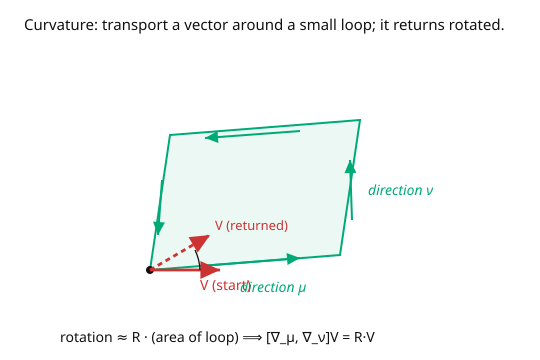

# Differential Geometry · Lesson 4.4: The Riemann curvature tensor

> ⏱ ~15 min · Module 4: Connections, geodesics, and curvature · Builds on: [4.3 Geodesics](04-03-geodesics.md) · Unlocks: [4.5 Ricci and scalar curvature](04-05-ricci-scalar-curvature.md)

## Why this matters

This is the object the whole course has been building toward: the **Riemann curvature tensor**, the complete, coordinate-independent measure of how curved a space is. Gaussian curvature ([1.4](01-04-gaussian-curvature-theorema-egregium.md)) was its 2D shadow; holonomy ([4.2](04-02-parallel-transport.md)) was its integral around a loop. Riemann packages *all* the curvature information into one tensor, and it's the raw material of Einstein's equations. It answers definitively: is this space flat, or genuinely curved — and can any coordinate change remove the curvature? The answer is invariant: $R = 0$ everywhere iff the space is locally flat. Nonzero $\Gamma$'s can be coordinate artifacts; a nonzero $R$ cannot.

## The idea

Curvature is the failure of parallel transport to be path-independent ([4.2](04-02-parallel-transport.md)). Sharpen that to an infinitesimal statement. Take a vector and transport it around a tiny loop with sides in the $\mu$- and $\nu$-directions: go $\mu$ then $\nu$, versus $\nu$ then $\mu$. On a flat space the two agree; on a curved space they differ, and the difference — the little rotation the vector picks up — is the Riemann tensor times the loop's area (the picture).

Equivalently, in derivative language: curvature is the failure of covariant derivatives to **commute**. On flat space $\nabla_\mu\nabla_\nu = \nabla_\nu\nabla_\mu$ (mixed partials commute). On a curved space they don't, and

$$[\nabla_\mu, \nabla_\nu]V^\rho = R^\rho{}_{\sigma\mu\nu}V^\sigma$$

*defines* the Riemann tensor as the commutator. This is the same fact — "transport around a loop rotates the vector" — because a commutator of derivatives *is* an infinitesimal loop ($\mu\nu$ minus $\nu\mu$).

The crucial payoff: unlike the Christoffel symbols, **$R$ is a genuine tensor**. If it's zero in one coordinate system it's zero in all — so "flat" is an honest, coordinate-independent property. The polar-coordinate $\Gamma$'s were nonzero but the plane's $R$ is zero; the sphere's $R$ is nonzero in every chart. $R$ finally separates real curvature from coordinate illusion.

## The formal version

The **Riemann curvature tensor** is defined by $[\nabla_\mu, \nabla_\nu]V^\rho = R^\rho{}_{\sigma\mu\nu}V^\sigma$ (for a torsion-free connection), and in coordinates

$$R^\rho{}_{\sigma\mu\nu} = \partial_\mu\Gamma^\rho_{\nu\sigma} - \partial_\nu\Gamma^\rho_{\mu\sigma} + \Gamma^\rho_{\mu\lambda}\Gamma^\lambda_{\nu\sigma} - \Gamma^\rho_{\nu\lambda}\Gamma^\lambda_{\mu\sigma}.$$

*In words:* curvature is built from the Christoffel symbols *and their derivatives* — the $\partial\Gamma$ terms capture how the connection changes, the $\Gamma\Gamma$ terms capture the connection acting on itself. It's a $(1,3)$-tensor.

**Symmetries** (lowering the first index with a metric, $R_{\rho\sigma\mu\nu} = g_{\rho\lambda}R^\lambda{}_{\sigma\mu\nu}$):

- antisymmetric in the last pair: $R_{\rho\sigma\mu\nu} = -R_{\rho\sigma\nu\mu}$;
- antisymmetric in the first pair: $R_{\rho\sigma\mu\nu} = -R_{\sigma\rho\mu\nu}$;
- symmetric under swapping the pairs: $R_{\rho\sigma\mu\nu} = R_{\mu\nu\rho\sigma}$;
- first Bianchi identity: $R_{\rho[\sigma\mu\nu]} = 0$ (cyclic sum on the last three vanishes).

These cut the number of independent components drastically: in **2D there is exactly one** ($R_{1212}$), which is essentially the Gaussian curvature.

**Flatness criterion.** $R^\rho{}_{\sigma\mu\nu} \equiv 0$ on a region **iff** the region is *locally flat* — coordinates exist in which $g_{\mu\nu}$ is constant (Euclidean/Minkowski) and all $\Gamma = 0$. *In words:* the tensor $R$ is the honest, coordinate-proof detector of curvature.

## Picture

## Worked examples

**Example 1 (flat plane in polar coordinates — $R = 0$, despite nonzero $\Gamma$).** Use the polar $\Gamma^r_{\theta\theta} = -r$, $\Gamma^\theta_{r\theta} = \Gamma^\theta_{\theta r} = \frac1r$. Compute the one independent component $R^r{}_{\theta r\theta}$:

$$R^r{}_{\theta r\theta} = \partial_r\Gamma^r_{\theta\theta} - \partial_\theta\Gamma^r_{r\theta} + \Gamma^r_{r\lambda}\Gamma^\lambda_{\theta\theta} - \Gamma^r_{\theta\lambda}\Gamma^\lambda_{r\theta}.$$

Term by term: $\partial_r(-r) = -1$; $\partial_\theta\Gamma^r_{r\theta} = 0$; the $\Gamma^r_{r\lambda}\Gamma^\lambda_{\theta\theta}$ term vanishes ($\Gamma^r_{rr} = \Gamma^r_{r\theta} = 0$); and $\Gamma^r_{\theta\lambda}\Gamma^\lambda_{r\theta} = \Gamma^r_{\theta\theta}\Gamma^\theta_{r\theta} = (-r)(\frac1r) = -1$, so $-\Gamma^r_{\theta\lambda}\Gamma^\lambda_{r\theta} = +1$. Sum: $-1 + 0 + 0 + 1 = 0$. The derivative term $(-1)$ **exactly cancels** the connection-squared term $(+1)$, giving $R = 0$: the plane is flat, as it must be, even though its polar $\Gamma$'s were nonzero. *This* is the computation that distinguishes coordinate curvature from real curvature.

**Example 2 (the unit sphere — genuinely curved).** Use $\Gamma^\theta_{\phi\phi} = -\sin\theta\cos\theta$, $\Gamma^\phi_{\theta\phi} = \Gamma^\phi_{\phi\theta} = \cot\theta$. Compute $R^\theta{}_{\phi\theta\phi}$:

$$R^\theta{}_{\phi\theta\phi} = \partial_\theta\Gamma^\theta_{\phi\phi} - \partial_\phi\Gamma^\theta_{\theta\phi} + \Gamma^\theta_{\theta\lambda}\Gamma^\lambda_{\phi\phi} - \Gamma^\theta_{\phi\lambda}\Gamma^\lambda_{\theta\phi}.$$

Now $\partial_\theta(-\sin\theta\cos\theta) = -(\cos^2\theta - \sin^2\theta) = \sin^2\theta - \cos^2\theta$; $\partial_\phi\Gamma^\theta_{\theta\phi} = 0$; the $\Gamma^\theta_{\theta\lambda}\Gamma^\lambda_{\phi\phi}$ term vanishes ($\Gamma^\theta_{\theta\theta} = \Gamma^\theta_{\theta\phi} = 0$); and $\Gamma^\theta_{\phi\lambda}\Gamma^\lambda_{\theta\phi} = \Gamma^\theta_{\phi\phi}\Gamma^\phi_{\theta\phi} = (-\sin\theta\cos\theta)(\cot\theta) = -\cos^2\theta$, so $-\Gamma^\theta_{\phi\lambda}\Gamma^\lambda_{\theta\phi} = +\cos^2\theta$. Sum:

$$R^\theta{}_{\phi\theta\phi} = (\sin^2\theta - \cos^2\theta) + \cos^2\theta = \sin^2\theta \neq 0.$$

Nonzero — the sphere is genuinely curved. Lowering the index, $R_{\theta\phi\theta\phi} = g_{\theta\theta}R^\theta{}_{\phi\theta\phi} = \sin^2\theta$, and the Gaussian curvature is $K = \frac{R_{\theta\phi\theta\phi}}{g_{\theta\theta}g_{\phi\phi}} = \frac{\sin^2\theta}{1\cdot\sin^2\theta} = 1$ — recovering [1.4](01-04-gaussian-curvature-theorema-egregium.md)'s $K = 1/a^2$ (here $a=1$) from the Riemann tensor. The 2D curvature really is one number.

## Watch out

- **You might read nonzero $\Gamma$ as curvature.** Example 1 is the antidote: nonzero Christoffels, zero Riemann, flat space. You must compute $R$ (with its $\partial\Gamma$ and $\Gamma\Gamma$ pieces) to know if a space is curved — the cancellation is the whole point.
- **You might mis-order the indices.** $R^\rho{}_{\sigma\mu\nu}$ conventions vary between textbooks (some swap signs or index order). Fix one convention (here Carroll/Wald-style) and check it against a known case (sphere $\Rightarrow K = +1$) to catch sign errors.
- **You might overcount components.** In $n$ dimensions Riemann has $\frac{n^2(n^2-1)}{12}$ independent components: $1$ in 2D, $6$ in 3D, $20$ in 4D. Don't try to track $n^4$ of them — the symmetries do enormous work (and in 4D spacetime, $20$ is exactly what general relativity needs).

## One-liner

> The Riemann tensor $R^\rho{}_{\sigma\mu\nu} = \partial\Gamma - \partial\Gamma + \Gamma\Gamma - \Gamma\Gamma$ is the commutator of covariant derivatives — the honest, coordinate-proof measure of curvature that vanishes exactly when a space is locally flat.

## Problems

**P1 (🟢)** In 2D, how many independent components does the Riemann tensor have? Given that the sphere's is $R_{\theta\phi\theta\phi} = \sin^2\theta$, use the antisymmetries to write $R_{\phi\theta\theta\phi}$ and $R_{\theta\phi\phi\theta}$.

**P2 (🟡)** Explain, using the flatness criterion, why a cylinder ($K = 0$) has $R \equiv 0$ even though it "looks curved." Then state what this implies about the existence of flat coordinates on the cylinder, and relate it to unrolling it onto the plane ([1.4](01-04-gaussian-curvature-theorema-egregium.md)).

**P3 (🔴, optional)** Show that in 2D the single curvature component and the Gaussian curvature are related by $R_{1212} = K\,(g_{11}g_{22} - g_{12}^2) = K\det g$. Verify for the unit sphere that this gives $K = 1$. *Hint:* use $R_{1212} = \sin^2\theta$, $g_{11} = 1$, $g_{22} = \sin^2\theta$, $g_{12} = 0$.

Solutions

**P1** In 2D there is exactly **one** independent component. Using antisymmetry in the last pair, $R_{\theta\phi\phi\theta} = -R_{\theta\phi\theta\phi} = -\sin^2\theta$; using antisymmetry in the first pair, $R_{\phi\theta\theta\phi} = -R_{\theta\phi\theta\phi} = -\sin^2\theta$. (And $R_{\phi\theta\phi\theta} = +R_{\theta\phi\theta\phi} = \sin^2\theta$ by applying both antisymmetries.)

**P2** The cylinder is intrinsically flat: it has $K = 0$ and its induced metric equals the plane's ($E = G = 1$, $F = 0$ in suitable coordinates, [1.2](01-02-surfaces-first-fundamental-form.md)), so all its Christoffel symbols vanish in those coordinates and $R \equiv 0$. By the flatness criterion, $R = 0$ guarantees flat coordinates exist — which are exactly the coordinates you get by **unrolling** the cylinder onto the plane (an isometry). Its extrinsic bending in $\mathbb{R}^3$ is real but invisible to $R$, which sees only intrinsic geometry — the Theorema Egregium again.

**P3** In 2D the Riemann tensor's single component determines everything, and the definition of Gaussian curvature gives $R_{1212} = K\det g$ (this is the intrinsic Gauss equation). For the unit sphere with coordinates $(\theta, \phi)$: $R_{1212} = R_{\theta\phi\theta\phi} = \sin^2\theta$, and $\det g = g_{11}g_{22} - g_{12}^2 = (1)(\sin^2\theta) - 0 = \sin^2\theta$. So $K = R_{1212}/\det g = \sin^2\theta/\sin^2\theta = 1$. ✓ The Riemann tensor and Gauss's $K$ agree, as they must in 2D. ∎

## Flashback

**From Lesson 4.3 (Geodesics):** Verify that the equator of the unit sphere, $\theta(t) = \pi/2$, $\phi(t) = t$, satisfies the geodesic equation, using $\Gamma^\theta_{\phi\phi} = -\sin\theta\cos\theta$ and $\Gamma^\phi_{\theta\phi} = \cot\theta$.

Solution

On the equator $\theta = \pi/2$ (so $\dot\theta = \ddot\theta = 0$) and $\phi = t$ (so $\dot\phi = 1$, $\ddot\phi = 0$).
$\theta$-equation: $\ddot\theta + \Gamma^\theta_{\phi\phi}\dot\phi^2 = 0 + (-\sin\tfrac\pi2\cos\tfrac\pi2)(1) = -(1)(0) = 0$. ✓
$\phi$-equation: $\ddot\phi + 2\Gamma^\phi_{\theta\phi}\dot\theta\dot\phi = 0 + 2\cot\tfrac\pi2\cdot 0\cdot 1 = 0$. ✓
Both hold, so the equator is a geodesic — a great circle, as expected. ✓

## Connections

- **Backward:** $R$ is built from the $\Gamma$'s of [4.1](04-01-covariant-derivative-christoffel.md); its meaning is the infinitesimal version of [4.2](04-02-parallel-transport.md)'s holonomy; in 2D it reproduces [1.4](01-04-gaussian-curvature-theorema-egregium.md)'s Gaussian curvature.
- **Forward:** [4.5](04-05-ricci-scalar-curvature.md) contracts $R$ to the Ricci and scalar curvatures Einstein's equations use; [5.2](05-02-levi-civita-connection.md) supplies the metric $\Gamma$'s; geodesic deviation ([4.5](04-05-ricci-scalar-curvature.md)) is $R$ acting on nearby geodesics.
- **Sideways (relativity):** the Riemann tensor *is* the tidal field of gravity — its components are the relative accelerations of nearby free-falling bodies, and the statement "$R = 0 \iff$ no gravity (flat spacetime)" is the mathematical form of the equivalence principle ([`relativity`](../../relativity/syllabus.md)).
