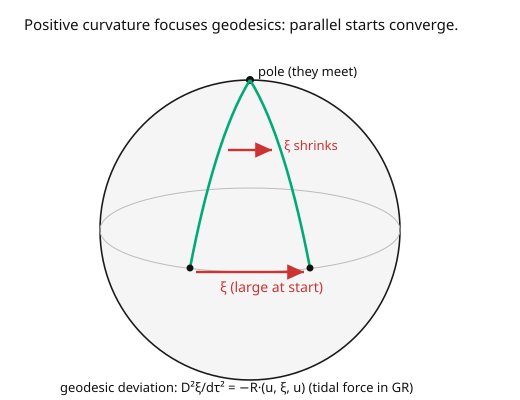

# Differential Geometry · Lesson 4.5: Ricci and scalar curvature

> ⏱ ~15 min · Module 4: Connections, geodesics, and curvature · Builds on: [4.4 The Riemann curvature tensor](04-04-riemann-curvature-tensor.md) · Unlocks: [5.1 Riemannian and Lorentzian metrics](05-01-riemannian-lorentzian-metrics.md)

## Why this matters

The full Riemann tensor has a lot of components ($20$ in 4D spacetime) — more than Einstein's equations directly constrain. Physics uses **contractions** of it: the **Ricci tensor** $R_{\mu\nu}$ and the **scalar curvature** $R$. These are the exact pieces that appear on the left side of Einstein's field equations, $G_{\mu\nu} = R_{\mu\nu} - \frac12 R\,g_{\mu\nu} = 8\pi G\,T_{\mu\nu}$ — curvature on the left, matter/energy on the right. Ricci curvature has a clean meaning (it says how the volume of a small ball of geodesics deviates from flat space), and via **geodesic deviation** it *is* the tidal force of gravity. This lesson closes Module 4 by extracting, from the full curvature, the summary that gravity actually listens to.

## The idea

The Riemann tensor $R^\rho{}_{\sigma\mu\nu}$ has four indices and holds all curvature information. To get simpler, more usable objects, **contract** (sum an upper against a lower index, [3.1](03-01-tensors-multilinear-maps.md)):

- **Ricci tensor** $R_{\mu\nu}$: contract the first and third indices of Riemann. Geometric meaning: it measures how a small ball of initially-parallel geodesics changes **volume** compared to flat space. Positive Ricci → geodesics converge → volumes shrink (like on a sphere); it's the "focusing power" of curvature.
- **Scalar curvature** $R$: contract Ricci once more (with the metric). A single number at each point summarizing the total curvature — for a 2D surface it's just twice the Gaussian curvature.

The physical face of all this is **geodesic deviation**. Two nearby particles, both in free fall (on geodesics), starting parallel — do they stay parallel? In flat space, yes. In curved space, the separation vector between them accelerates, and the acceleration is governed by the Riemann tensor. On a sphere, two meridians start parallel at the equator and are forced together at the pole (the picture): positive curvature *focuses*. This relative acceleration of free-falling bodies is precisely what we feel as **tidal gravity** — the Moon stretching Earth's oceans, an astronaut's feet pulled harder than their head near a black hole.

## The formal version

The **Ricci tensor** is the contraction of Riemann on its first and third indices:

$$R_{\mu\nu} = R^\lambda{}_{\mu\lambda\nu}.$$

It is symmetric ($R_{\mu\nu} = R_{\nu\mu}$) for the Levi-Civita connection. The **scalar curvature** contracts once more using the inverse metric:

$$R = g^{\mu\nu}R_{\mu\nu}.$$

*In words:* Ricci is the "trace" of Riemann over one pair of directions (average curvature in the $\mu\nu$ plane, summed over the transverse directions); the scalar is the full trace, one number per point. **Sectional curvature** generalizes Gauss's $K$: for a 2-plane spanned by $u, v$ it's $\frac{R_{\rho\sigma\mu\nu}u^\rho v^\sigma u^\mu v^\nu}{|u|^2|v|^2 - (u\cdot v)^2}$ — the Gaussian curvature of the surface swept by geodesics in that plane.

The **geodesic deviation equation** governs the separation $\xi^\mu$ between two neighboring geodesics with tangent $u^\mu$:

$$\frac{D^2\xi^\mu}{d\tau^2} = -R^\mu{}_{\nu\rho\sigma}\,u^\nu\,\xi^\rho\,u^\sigma.$$

*In words:* the relative (covariant) acceleration of nearby free-fallers is minus the Riemann tensor contracted with their velocity and separation — curvature literally pushes geodesics together or apart. This is tidal force in general relativity.

## Picture

## Worked examples

**Example 1 (Ricci and scalar curvature of the unit sphere).** From [4.4](04-04-riemann-curvature-tensor.md), the unit sphere has $R^\theta{}_{\phi\theta\phi} = \sin^2\theta$, equivalently $R_{\theta\phi\theta\phi} = \sin^2\theta$. Contract to get Ricci:

$$R_{\theta\theta} = R^\lambda{}_{\theta\lambda\theta} = R^\phi{}_{\theta\phi\theta} = g^{\phi\phi}R_{\phi\theta\phi\theta} = \frac{1}{\sin^2\theta}\cdot\sin^2\theta = 1 = g_{\theta\theta},$$
$$R_{\phi\phi} = R^\lambda{}_{\phi\lambda\phi} = R^\theta{}_{\phi\theta\phi} = \sin^2\theta = g_{\phi\phi}, \qquad R_{\theta\phi} = 0 = g_{\theta\phi}.$$

So $R_{\mu\nu} = g_{\mu\nu}$ — the sphere is an **Einstein manifold** (Ricci proportional to the metric). The scalar curvature:

$$R = g^{\mu\nu}R_{\mu\nu} = g^{\mu\nu}g_{\mu\nu} = \delta^\mu_\mu = 2.$$

For a sphere of radius $a$ the metric scales and one gets $R_{\mu\nu} = \frac{1}{a^2}g_{\mu\nu}$, $R = \frac{2}{a^2}$ — matching the 2D relation $R = 2K$ with $K = 1/a^2$. The single scalar $R$ recovers the Gaussian curvature we started the course with.

**Example 2 (geodesic deviation — meridians focusing).** On the unit sphere, take two meridians starting at the equator, separated by a small longitude $\xi$. Both are geodesics with "north-pointing" tangent $u$. The geodesic deviation equation, using $R^\theta{}_{\phi\theta\phi} = \sin^2\theta$ (so the relevant curvature is positive), gives $\frac{D^2\xi}{d\tau^2} \propto -R\,\xi < 0$: the separation *decelerates and reverses*, driving the meridians together until they meet at the pole (separation $\to 0$). This is exactly the picture: **positive curvature focuses geodesics**. On a saddle ($K < 0$) the sign flips and nearby geodesics *diverge*. In general relativity this focusing is why matter (positive energy) makes geodesics converge — the seed of gravitational attraction and the singularity theorems.

## Watch out

- **You might think Ricci contains all of Riemann.** Only in low dimensions. In 2D and 3D, Ricci (or the scalar) determines the full Riemann tensor; but in **4D and higher** there's leftover curvature Ricci misses — the **Weyl tensor** — which carries tidal/gravitational-wave information in vacuum. Einstein's equations constrain Ricci; Weyl propagates freely (that's how gravitational waves travel through empty space).
- **You might drop the metric when forming the scalar.** $R = g^{\mu\nu}R_{\mu\nu}$ *needs* the inverse metric to contract two lower indices — you cannot make a scalar from $R_{\mu\nu}$ by itself. This is the first place ([5.1](05-01-riemannian-lorentzian-metrics.md)) that curvature genuinely requires a metric, not just a connection.
- **You might mix up the contraction convention.** $R_{\mu\nu} = R^\lambda{}_{\mu\lambda\nu}$ (first and third). Contracting a different pair can give $0$ (antisymmetric pairs) or a sign flip. Check against the sphere: correct conventions give $R_{\mu\nu} = g_{\mu\nu}$ and $R = +2 > 0$ for the sphere.

## One-liner

> Contract the Riemann tensor once for the Ricci tensor (how a ball of geodesics changes volume) and again for the scalar curvature (one number per point) — and geodesic deviation makes curvature physical as the tidal force between free-falling bodies.

## Problems

**P1 (🟢)** For the unit sphere, you found $R_{\mu\nu} = g_{\mu\nu}$ and $R = 2$. What are $R_{\mu\nu}$ and $R$ for a sphere of radius $a = 5$? State the relation $R = 2K$ and check it.

**P2 (🟡)** The Einstein tensor is $G_{\mu\nu} = R_{\mu\nu} - \frac12 R\,g_{\mu\nu}$. Compute $G_{\mu\nu}$ for the unit sphere (2D). You should find it vanishes — explain why this is special to two dimensions. *Hint:* substitute $R_{\mu\nu} = g_{\mu\nu}$ and $R = 2$.

**P3 (🔴, optional)** Explain via geodesic deviation why positive Ricci curvature corresponds to gravitational *attraction* (focusing) and negative to *defocusing*. Then state, in one sentence, what the sign of $R_{\mu\nu}u^\mu u^\nu$ tells you about a bundle of geodesics with tangent $u$ (this quantity appears in the Raychaudhuri/focusing equation behind the singularity theorems).

Solutions

**P1** Curvature scales as (length)$^{-2}$. For radius $a = 5$: Gaussian curvature $K = 1/a^2 = 1/25$; scalar $R = 2K = 2/25 = 0.08$; and $R_{\mu\nu} = K g_{\mu\nu} = \frac{1}{25}g_{\mu\nu}$. Check $R = 2K$: $2\cdot\frac{1}{25} = \frac{2}{25}$ ✓. (The bigger the sphere, the flatter it is locally — curvature falls off as $1/a^2$.)

**P2** Substitute: $G_{\mu\nu} = R_{\mu\nu} - \frac12 R\,g_{\mu\nu} = g_{\mu\nu} - \frac12(2)g_{\mu\nu} = g_{\mu\nu} - g_{\mu\nu} = 0$. The Einstein tensor **vanishes identically in 2D** — for *any* 2D metric, not just the sphere. This is because in 2D the curvature has only one independent component, forcing $R_{\mu\nu} = \frac12 R\,g_{\mu\nu}$ always, so $G_{\mu\nu} \equiv 0$. Consequence: general relativity is trivial in 2D (the Einstein tensor carries no information); you need at least 4 dimensions for gravity to have dynamical content.

**P3** The geodesic deviation equation $\frac{D^2\xi}{d\tau^2} = -R(u,\xi,u)$ shows that where curvature is positive (in the relevant sectional sense), the separation $\xi$ between neighboring geodesics decelerates and shrinks — the geodesics **focus** (converge), which is attraction. Where it's negative they **defocus** (diverge). Contracting, $R_{\mu\nu}u^\mu u^\nu > 0$ means a bundle of geodesics with tangent $u$ is, on average, being focused (its cross-sectional volume is decelerating outward / tending to shrink) — the convergence condition that, via Raychaudhuri's equation, drives the formation of caustics and underlies the singularity theorems of general relativity. ∎

## Flashback

**From Lesson 4.4 (The Riemann curvature tensor):** A space has $R^\rho{}_{\sigma\mu\nu} = 0$ everywhere. What can you conclude about the space, and does it follow that all Christoffel symbols vanish?

Solution

$R \equiv 0$ means the space is **locally flat**: coordinates exist in which the metric is constant (Euclidean/Minkowski) and all $\Gamma = 0$. But it does **not** follow that $\Gamma = 0$ in *every* coordinate system — flat $\mathbb{R}^2$ in polar coordinates has nonzero $\Gamma$'s ($\Gamma^r_{\theta\theta} = -r$, etc.) yet $R = 0$. The vanishing of the *tensor* $R$ is coordinate-independent; the vanishing of the *non-tensor* $\Gamma$ is not. Flatness is "$\Gamma$ can be made to vanish everywhere by some coordinate choice," which $R = 0$ guarantees. ✓

## Connections

- **Backward:** Ricci and scalar are contractions ([3.1](03-01-tensors-multilinear-maps.md)) of the Riemann tensor ([4.4](04-04-riemann-curvature-tensor.md)); geodesic deviation acts on the geodesics of [4.3](04-03-geodesics.md); in 2D everything reduces to Gauss's $K$ ([1.4](01-04-gaussian-curvature-theorema-egregium.md)).
- **Forward:** Module 5 adds the metric that makes the scalar $R = g^{\mu\nu}R_{\mu\nu}$ well-defined ([5.1](05-01-riemannian-lorentzian-metrics.md)) and derives the Levi-Civita $\Gamma$'s ([5.2](05-02-levi-civita-connection.md)) that fed every curvature computation here.
- **Sideways (relativity):** $G_{\mu\nu} = R_{\mu\nu} - \frac12 R g_{\mu\nu} = 8\pi G\,T_{\mu\nu}$ is Einstein's field equation — Ricci and scalar curvature *are* the geometry side of gravity, geodesic deviation is tidal force, and the focusing of geodesics is why gravity attracts ([`relativity`](../../relativity/syllabus.md)).

*Module 4 capstone (Boss Problem 4): for the round 2-sphere, compute the Christoffels, the Riemann tensor, and Ricci/scalar curvature; verify great circles are geodesics; and read the nonzero curvature as the reason parallel transport around a loop rotates a vector. Examples across [4.1](04-01-covariant-derivative-christoffel.md)–[4.5](04-05-ricci-scalar-curvature.md) assemble exactly this.*
