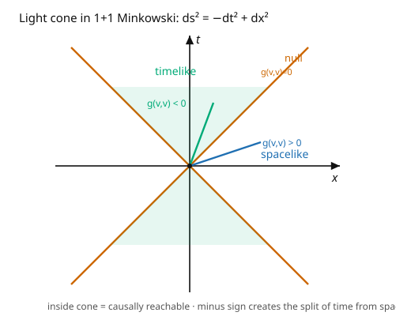

# Differential Geometry · Lesson 5.1: Riemannian and Lorentzian metrics

> ⏱ ~15 min · Module 5: Metrics and the bridge to physics · Builds on: [4.5 Ricci and scalar curvature](04-05-ricci-scalar-curvature.md), [3.1 Tensors as multilinear maps](03-01-tensors-multilinear-maps.md) · Unlocks: [5.2 The Levi-Civita connection](05-02-levi-civita-connection.md)

## Why this matters

Everything in Module 4 — geodesics, curvature, the scalar $R$ — quietly needed a **metric**, the object that measures lengths and angles. This lesson makes it explicit and then splits it in two. A **Riemannian** metric (all-positive) gives ordinary geometry: spheres, surfaces, distances. A **Lorentzian** metric (one minus sign) gives **spacetime**, where that single minus sign manufactures the entire causal structure of relativity — past, future, light cones, the speed limit $c$. The metric is also the machine that raises and lowers indices, finally letting us convert vectors to covectors freely. This is the bridge from pure geometry to physics: the metric tensor $g_{\mu\nu}$ is literally the gravitational field in general relativity.

## The idea

A **metric** promotes a bare manifold (which only knew smoothness) into one with **geometry**: it's an inner product on each tangent space, varying smoothly. Feed it two vectors and it returns a number — their "dot product" — from which lengths ($|v| = \sqrt{g(v,v)}$) and angles ($\cos\theta = g(u,v)/|u||v|$) follow. This is exactly the first fundamental form of [1.2](01-02-surfaces-first-fundamental-form.md), now intrinsic and abstract.

The **signature** — the pattern of plus and minus signs — is what splits geometry into two worlds:

- **Riemannian:** all plus signs ($+ + \cdots +$), positive-definite. $g(v,v) > 0$ for every nonzero $v$: all vectors have positive length². This is space — surfaces, spheres, the geometry of shapes.
- **Lorentzian:** one minus, rest plus ($- + + +$). Now $g(v,v)$ can be negative, positive, or zero, splitting vectors into three classes — **timelike** ($<0$), **spacelike** ($>0$), **null** ($=0$). This is **spacetime**: the minus sign is time, and the null vectors trace out **light cones** dividing what each event can causally influence (the picture). That one sign flip is the difference between geometry and relativity.

The metric also does bookkeeping: it and its inverse **raise and lower indices**, turning a vector $V^\mu$ into a covector $V_\mu = g_{\mu\nu}V^\nu$ and back. This is finally the tool that identifies $T_pM$ with $T_p^*M$ ([2.5](02-05-covectors-cotangent-space.md)) — the gradient becomes a genuine vector, "up" and "down" indices become interconvertible.

## The formal version

A **metric tensor** $g$ is a smooth, symmetric, **nondegenerate** $(0,2)$-tensor: $g(u,v) = g_{\mu\nu}u^\mu v^\nu$ with $g_{\mu\nu} = g_{\nu\mu}$, and $g_{\mu\nu}$ an invertible matrix at each point (nondegenerate: $g(v,\cdot) = 0 \Rightarrow v = 0$). By Sylvester's law the number of $+$ and $-$ eigenvalues (the **signature**) is a fixed invariant.

- **Riemannian:** signature $(+,\ldots,+)$, positive-definite — a genuine inner product.
- **Lorentzian:** signature $(-,+,\ldots,+)$ (or $(+,-,\ldots,-)$ by convention). The prototype is **Minkowski space** $\eta_{\mu\nu} = \operatorname{diag}(-1, 1, 1, 1)$.

With the $(-+++)$ convention, a vector $v$ is **timelike** if $g(v,v) < 0$, **spacelike** if $g(v,v) > 0$, **null (lightlike)** if $g(v,v) = 0$. *In words:* timelike vectors point inside the light cone (worldlines of massive particles), null along it (light), spacelike outside (no causal signal).

**Raising and lowering indices.** Write $g^{\mu\nu}$ for the inverse metric ($g^{\mu\lambda}g_{\lambda\nu} = \delta^\mu_\nu$). Then

$$V_\mu = g_{\mu\nu}V^\nu \quad(\text{lower}), \qquad V^\mu = g^{\mu\nu}V_\nu \quad(\text{raise}).$$

*In words:* the metric is the canonical isomorphism between vectors and covectors — it's what lets you turn the $(0,1)$-tensor $df$ (the differential) into the $(1,0)$ gradient vector $\nabla f$, and what makes the scalar curvature $R = g^{\mu\nu}R_{\mu\nu}$ ([4.5](04-05-ricci-scalar-curvature.md)) meaningful.

## Picture

## Worked examples

**Example 1 (raising and lowering with a metric).** Take the sphere metric $g_{\mu\nu} = \begin{pmatrix} 1 & 0 \\ 0 & \sin^2\theta\end{pmatrix}$ in $(\theta,\phi)$. Its inverse is $g^{\mu\nu} = \begin{pmatrix} 1 & 0 \\ 0 & 1/\sin^2\theta\end{pmatrix}$. Given a vector $V^\mu = (V^\theta, V^\phi) = (2, 3)$, lower the index:

$$V_\theta = g_{\theta\theta}V^\theta = 2, \qquad V_\phi = g_{\phi\phi}V^\phi = 3\sin^2\theta.$$

So $V_\mu = (2,\ 3\sin^2\theta)$ — the *covector* version differs from the vector by metric factors. Its squared length is $g(V,V) = g_{\mu\nu}V^\mu V^\nu = 1\cdot 4 + \sin^2\theta\cdot 9 = 4 + 9\sin^2\theta$, positive (Riemannian). Equivalently $V_\mu V^\mu = 2\cdot2 + 3\sin^2\theta\cdot 3 = 4 + 9\sin^2\theta$ — the same number, now as a contraction.

**Example 2 (classifying vectors in 2D Minkowski).** With $ds^2 = -dt^2 + dx^2$, so $g = \operatorname{diag}(-1, 1)$, compute $g(v,v) = -(v^t)^2 + (v^x)^2$ for several $v = (v^t, v^x)$:

- $v = (1, 0)$ (purely temporal): $g(v,v) = -1 < 0$ — **timelike** (a particle at rest, moving through time).
- $v = (0, 1)$ (purely spatial): $g(v,v) = +1 > 0$ — **spacelike** (a direction "now," no causal travel).
- $v = (1, 1)$ (45°): $g(v,v) = -1 + 1 = 0$ — **null** (a light ray; $|v^x/v^t| = 1$ means speed $c$).
- $v = (2, 1)$: $g(v,v) = -4 + 1 = -3 < 0$ — **timelike** (speed $\tfrac12 < c$).

The null vectors $(v^x = \pm v^t)$ form the **light cone**; timelike vectors sit inside it, spacelike outside. This threefold split — impossible for a positive-definite Riemannian metric — is the entire causal skeleton of special and general relativity.

## Watch out

- **You might assume every metric is positive-definite.** Lorentzian metrics are *indefinite*: nonzero vectors can have zero or negative "length²." "Distance" along a null curve is zero even though the curve isn't a point — proper time, not naive length, is the physical quantity in relativity.
- **You might forget the metric is needed to raise/lower.** Without a metric, $V^\mu$ and $V_\mu$ live in genuinely different spaces ($T_pM$ vs $T_p^*M$, [2.5](02-05-covectors-cotangent-space.md)) and there's no canonical conversion. Index gymnastics ($V_\mu = g_{\mu\nu}V^\nu$) is *entirely* the metric's doing — on a bare manifold "up = down" is meaningless.
- **You might drop the $\sin^2\theta$ (or any off-diagonal) factors.** Raising/lowering uses the *actual* metric components, not $\delta_{\mu\nu}$. Only in Cartesian coordinates on flat space is $g_{\mu\nu} = \delta_{\mu\nu}$ and does "up index = down index numerically." Elsewhere the metric factors are essential.

## One-liner

> A metric is an inner product on each tangent space; its signature splits geometry into Riemannian (all plus — space, lengths, spheres) and Lorentzian (one minus — spacetime, light cones, causality), and it's the machine that raises and lowers indices.

## Problems

**P1 (🟢)** For the flat plane in polar coordinates, $g_{\mu\nu} = \begin{pmatrix} 1 & 0 \\ 0 & r^2\end{pmatrix}$, write the inverse metric $g^{\mu\nu}$, then lower the index of $V^\mu = (V^r, V^\theta) = (1, 2)$ and compute $g(V,V)$.

**P2 (🟡)** In 2D Minkowski $ds^2 = -dt^2 + dx^2$, classify each vector as timelike/spacelike/null: $(3, 2)$, $(1, 4)$, $(5, 5)$, $(0, 2)$. For the timelike one(s), is it future- or past-directed if future means $v^t > 0$?

**P3 (🔴, optional)** Show that for a Lorentzian metric, the sum of two timelike vectors "pointing into the same cone" (both future-directed) is timelike. *Hint:* work in Minkowski, use the reversed Cauchy–Schwarz inequality $|u^t v^t| \geq |\vec u\cdot\vec v|$ for future timelike vectors, or argue geometrically from the convexity of the future cone.

Solutions

**P1** Inverse: $g^{\mu\nu} = \begin{pmatrix} 1 & 0 \\ 0 & 1/r^2\end{pmatrix}$. Lowering $V^\mu = (1, 2)$: $V_r = g_{rr}V^r = 1$, $V_\theta = g_{\theta\theta}V^\theta = 2r^2$, so $V_\mu = (1,\ 2r^2)$. Length: $g(V,V) = g_{\mu\nu}V^\mu V^\nu = 1\cdot 1 + r^2\cdot 4 = 1 + 4r^2 > 0$ (Riemannian, as expected for the plane).

**P2** Using $g(v,v) = -(v^t)^2 + (v^x)^2$:
- $(3,2)$: $-9 + 4 = -5 < 0$ — **timelike**, future-directed ($v^t = 3 > 0$).
- $(1,4)$: $-1 + 16 = 15 > 0$ — **spacelike**.
- $(5,5)$: $-25 + 25 = 0$ — **null**.
- $(0,2)$: $0 + 4 = 4 > 0$ — **spacelike**.
Only $(3,2)$ is timelike, and it's future-directed.

**P3** In Minkowski with $u = (u^t, \vec u)$, $v = (v^t, \vec v)$ both future timelike ($u^t, v^t > 0$ and $(u^t)^2 > |\vec u|^2$, similarly $v$). Compute $g(u+v, u+v) = g(u,u) + 2g(u,v) + g(v,v)$. The first and third are negative. For the cross term, $g(u,v) = -u^t v^t + \vec u\cdot\vec v$. Since $|\vec u\cdot\vec v| \leq |\vec u||\vec v| < u^t v^t$ (each spatial part is smaller than its time part for timelike vectors), we get $\vec u\cdot\vec v < u^t v^t$, so $g(u,v) = -u^t v^t + \vec u\cdot\vec v < 0$. All three terms are negative, hence $g(u+v,u+v) < 0$: the sum is timelike (and future-directed, since $u^t + v^t > 0$). Geometrically, the future light cone is convex, so it's closed under addition. ∎

## Flashback

**From Lesson 1.2 (Surfaces and the first fundamental form):** The first fundamental form was $\mathrm{I} = E\,du^2 + 2F\,du\,dv + G\,dv^2$. Recognize it as a Riemannian metric: write its matrix $g_{\mu\nu}$, and give it for the sphere of radius $a$.

Solution

The first fundamental form *is* the induced Riemannian metric, with matrix $g_{\mu\nu} = \begin{pmatrix} E & F \\ F & G\end{pmatrix}$ (symmetric, and positive-definite since $E > 0$ and $EG - F^2 > 0$ for a regular surface). For the sphere of radius $a$, $E = a^2$, $F = 0$, $G = a^2\sin^2\theta$, so

$$g_{\mu\nu} = \begin{pmatrix} a^2 & 0 \\ 0 & a^2\sin^2\theta\end{pmatrix}, \qquad ds^2 = a^2\,d\theta^2 + a^2\sin^2\theta\,d\phi^2.$$

Module 1's classical "measure lengths on a surface" and Module 5's abstract metric tensor are the same object — the whole course has been about $g_{\mu\nu}$. ✓

## Connections

- **Backward:** the metric is the intrinsic version of [1.2](01-02-surfaces-first-fundamental-form.md)'s first fundamental form; it's a symmetric $(0,2)$-tensor ([3.1](03-01-tensors-multilinear-maps.md)); raising/lowering finally links vectors ([2.3](02-03-tangent-space.md)) and covectors ([2.5](02-05-covectors-cotangent-space.md)).
- **Forward:** [5.2](05-02-levi-civita-connection.md) derives *the* connection from the metric (so all of Module 4's $\Gamma$'s and curvatures come from $g$); [5.3](05-03-lie-derivative-killing-vectors.md) finds metric symmetries (Killing vectors).
- **Sideways (relativity):** the Lorentzian metric $g_{\mu\nu}$ **is** the gravitational field — Einstein's equations are equations *for* $g_{\mu\nu}$, and the light cones drawn here are the causal structure of spacetime ([`relativity`](../../relativity/syllabus.md)). The signature $-+++$ is where "time" comes from.
