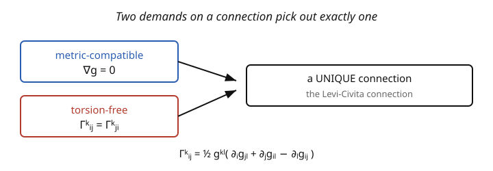

# Differential Geometry · Lesson 5.2: The Levi-Civita connection

> ⏱ ~15 min · Module 5: Metrics and the bridge to physics · Builds on: [5.1 Riemannian and Lorentzian metrics](05-01-riemannian-lorentzian-metrics.md), [4.1 The covariant derivative and Christoffel symbols](04-01-covariant-derivative-christoffel.md) · Unlocks: [5.3 The Lie derivative, Killing vectors, and symmetry](05-03-lie-derivative-killing-vectors.md)

## Why this matters

Back in [4.1](04-01-covariant-derivative-christoffel.md) the connection $\nabla$ was an *extra choice* — you had to specify the Christoffel symbols by hand. That's unsatisfying: which connection is the *right* one? This lesson answers it decisively. Once you have a metric ([5.1](05-01-riemannian-lorentzian-metrics.md)), there is a **unique** natural connection compatible with it — the **Levi-Civita connection** — and its Christoffel symbols are computed directly from the metric by an explicit formula. This is the *fundamental theorem of Riemannian geometry*, and it's why general relativity needs only one field, the metric $g_{\mu\nu}$: the connection, the geodesics, and all the curvature follow automatically. Every $\Gamma$ we used in Module 4 secretly came from here.

## The idea

A connection lets you differentiate and transport ([4.1](04-01-covariant-derivative-christoffel.md)–[4.2](04-02-parallel-transport.md)), but many connections exist. Two reasonable demands single out exactly one:

1. **Metric compatibility ($\nabla g = 0$):** parallel transport should preserve lengths and angles. If you carry two vectors along a curve keeping them "parallel," their dot product shouldn't drift. This ties the transport to the metric — transported vectors stay the same size.
2. **Torsion-free ($\Gamma^k_{ij} = \Gamma^k_{ji}$, symmetric lower indices):** the connection shouldn't have a built-in "twist." Concretely, infinitesimal parallelograms close up; the antisymmetric part of $\nabla$ (which would measure a twist independent of curvature) is zero.

The remarkable fact: these two conditions together determine $\nabla$ **uniquely** (the picture: two demands, one connection). And you can *solve* for the Christoffel symbols in closed form — they're a specific combination of first derivatives of the metric. So the entire apparatus of Module 4, which took $\Gamma$ as given, is now generated from $g$ alone. The "obviously right way to differentiate" on a space with a metric is the one that respects distances and doesn't twist.

## The formal version

**Fundamental theorem of Riemannian geometry.** On any (pseudo-)Riemannian manifold $(M, g)$ there exists a **unique** connection $\nabla$ that is

- **metric-compatible:** $\nabla g = 0$, equivalently $\partial_k g_{ij} = \Gamma^l_{ki}g_{lj} + \Gamma^l_{kj}g_{il}$ (transport preserves the inner product), and
- **torsion-free:** $\Gamma^k_{ij} = \Gamma^k_{ji}$.

It is the **Levi-Civita connection**, and its Christoffel symbols are given explicitly by

$$\boxed{\ \Gamma^k_{ij} = \tfrac12\,g^{kl}\bigl(\partial_i g_{jl} + \partial_j g_{il} - \partial_l g_{ij}\bigr).\ }$$

*In words:* the connection is built from first derivatives of the metric — how the metric changes from point to point is exactly what tells you how basis vectors twist. **Derivation sketch:** write metric compatibility three times, cyclically permuting $(i,j,k)$; add two and subtract the third; the symmetry ($\Gamma^k_{ij} = \Gamma^k_{ji}$) collapses the result and, contracting with $g^{kl}$, isolates $\Gamma$ — the standard "Koszul" manipulation. *In words:* the two conditions are exactly enough equations to solve for exactly the $\Gamma$'s.

## Picture

## Worked examples

**Example 1 (flat plane in polar coordinates — deriving what we asserted).** Metric $g_{rr} = 1$, $g_{\theta\theta} = r^2$, $g_{r\theta} = 0$; inverse $g^{rr} = 1$, $g^{\theta\theta} = 1/r^2$. Apply the formula:

$$\Gamma^r_{\theta\theta} = \tfrac12 g^{rr}\bigl(\partial_\theta g_{\theta r} + \partial_\theta g_{\theta r} - \partial_r g_{\theta\theta}\bigr) = \tfrac12(1)\bigl(0 + 0 - \partial_r(r^2)\bigr) = \tfrac12(-2r) = -r,$$

$$\Gamma^\theta_{r\theta} = \tfrac12 g^{\theta\theta}\bigl(\partial_r g_{\theta\theta} + \partial_\theta g_{r\theta} - \partial_\theta g_{r\theta}\bigr) = \tfrac12\Bigl(\tfrac1{r^2}\Bigr)\partial_r(r^2) = \tfrac12\cdot\tfrac{2r}{r^2} = \tfrac1r.$$

These are exactly the polar Christoffel symbols we simply *asserted* in [4.1](04-01-covariant-derivative-christoffel.md) — now **derived** from the metric. Everything downstream (parallel transport, the geodesics = straight lines, $R = 0$) followed from these.

**Example 2 (the 2-sphere — the source of Module 4's sphere computations).** Metric $g_{\theta\theta} = 1$, $g_{\phi\phi} = \sin^2\theta$, $g_{\theta\phi} = 0$; inverse $g^{\theta\theta} = 1$, $g^{\phi\phi} = 1/\sin^2\theta$.

$$\Gamma^\theta_{\phi\phi} = \tfrac12 g^{\theta\theta}\bigl(2\partial_\phi g_{\phi\theta} - \partial_\theta g_{\phi\phi}\bigr) = \tfrac12(1)\bigl(0 - \partial_\theta\sin^2\theta\bigr) = \tfrac12(-2\sin\theta\cos\theta) = -\sin\theta\cos\theta,$$

$$\Gamma^\phi_{\theta\phi} = \tfrac12 g^{\phi\phi}\,\partial_\theta g_{\phi\phi} = \tfrac12\Bigl(\tfrac1{\sin^2\theta}\Bigr)(2\sin\theta\cos\theta) = \frac{\cos\theta}{\sin\theta} = \cot\theta.$$

These are precisely the sphere Christoffel symbols that fed the geodesic equation ([4.3](04-03-geodesics.md)), the Riemann tensor $R^\theta{}_{\phi\theta\phi} = \sin^2\theta$ ([4.4](04-04-riemann-curvature-tensor.md)), and the Ricci/scalar curvatures ([4.5](04-05-ricci-scalar-curvature.md)). The entire curvature story of the sphere is generated by this one metric through this one formula. That's the power of the theorem: **hand it a metric, get all the geometry.**

## Watch out

- **You might think any metric-compatible connection works.** Metric compatibility *alone* leaves freedom (a torsion tensor). It's the *combination* with torsion-free that gives uniqueness. (Some theories — Einstein–Cartan gravity — deliberately keep torsion; standard GR does not.)
- **You might miscount which metric derivative goes where.** The formula is $\partial_i g_{jl} + \partial_j g_{il} - \partial_l g_{ij}$: the two "outer" indices $i,j$ (matching the lower Christoffel indices) get $+$, the "contracted" index $l$ gets $-$. Getting the minus sign on the wrong term flips your connection. Check against polar ($\Gamma^r_{\theta\theta} = -r$).
- **You might forget it applies to Lorentzian metrics too.** The theorem holds for any nondegenerate metric, signature and all — "pseudo-Riemannian" includes spacetime. The Levi-Civita connection of the Schwarzschild or FRW metric is what general relativity computes; the formula is identical.

## One-liner

> Given a metric, there is exactly one torsion-free, metric-compatible connection — the Levi-Civita connection — and $\Gamma^k_{ij} = \tfrac12 g^{kl}(\partial_i g_{jl} + \partial_j g_{il} - \partial_l g_{ij})$ generates all of a space's geometry from $g$ alone.

## Problems

**P1 (🟢)** For the flat plane in polar coordinates, use the Levi-Civita formula to confirm $\Gamma^r_{rr} = 0$ and $\Gamma^r_{r\theta} = 0$. (Only two Christoffels are nonzero for the plane in polar coordinates — you've now derived all of them.)

**P2 (🟡)** Compute the Christoffel symbols of the metric $ds^2 = dr^2 + f(r)^2\,d\theta^2$ (a general surface of revolution profile), in terms of $f$ and $f'$. Then specialize to $f(r) = r$ (plane) and $f(r) = \sin r$ (unit sphere with $r = \theta$) and check against Examples 1–2.

**P3 (🔴, optional)** Prove that metric compatibility $\nabla g = 0$ implies parallel transport preserves inner products: if $U, V$ are parallel-transported along a curve $\gamma$, then $g(U, V)$ is constant along $\gamma$. *Hint:* differentiate $g(U,V)$ along $\gamma$ using the product/Leibniz rule for $\nabla$ and use $\nabla_{\dot\gamma}U = \nabla_{\dot\gamma}V = 0$.

Solutions

**P1** $\Gamma^r_{rr} = \tfrac12 g^{rr}(\partial_r g_{rr} + \partial_r g_{rr} - \partial_r g_{rr}) = \tfrac12(1)\partial_r g_{rr} = \tfrac12\partial_r(1) = 0$. $\Gamma^r_{r\theta} = \tfrac12 g^{rr}(\partial_r g_{\theta r} + \partial_\theta g_{rr} - \partial_r g_{r\theta}) = \tfrac12(1)(0 + 0 - 0) = 0$. Both vanish. ✓ (Nonzero ones: $\Gamma^r_{\theta\theta} = -r$, $\Gamma^\theta_{r\theta} = \Gamma^\theta_{\theta r} = 1/r$.)

**P2** Metric $g_{rr} = 1$, $g_{\theta\theta} = f(r)^2$, $g_{r\theta} = 0$; inverse $g^{rr} = 1$, $g^{\theta\theta} = 1/f^2$. Nonzero Christoffels:
$\Gamma^r_{\theta\theta} = \tfrac12 g^{rr}(-\partial_r g_{\theta\theta}) = \tfrac12(-2ff') = -ff'$.
$\Gamma^\theta_{r\theta} = \Gamma^\theta_{\theta r} = \tfrac12 g^{\theta\theta}\partial_r g_{\theta\theta} = \tfrac12\cdot\frac{2ff'}{f^2} = \frac{f'}{f}$.
All others zero. Specialize: $f = r$ ($f' = 1$): $\Gamma^r_{\theta\theta} = -r$, $\Gamma^\theta_{r\theta} = 1/r$ — the plane (Example 1). ✓ $f = \sin r$ ($f' = \cos r$, with $r = \theta$): $\Gamma^\theta_{\phi\phi} = -\sin\theta\cos\theta$, $\Gamma^\phi_{\theta\phi} = \cos\theta/\sin\theta = \cot\theta$ — the sphere (Example 2). ✓

**P3** Along $\gamma$ with tangent $\dot\gamma$, use metric compatibility $\nabla g = 0$, which gives the Leibniz rule $\frac{d}{dt}g(U,V) = \nabla_{\dot\gamma}\bigl(g(U,V)\bigr) = g(\nabla_{\dot\gamma}U, V) + g(U, \nabla_{\dot\gamma}V)$. If $U, V$ are parallel-transported, $\nabla_{\dot\gamma}U = 0$ and $\nabla_{\dot\gamma}V = 0$, so both terms vanish and $\frac{d}{dt}g(U,V) = 0$: the inner product is constant along $\gamma$. In particular $|U|$ and the angle between $U$ and $V$ are preserved — parallel transport is a (Lorentz/orthogonal) rotation. ∎

## Flashback

**From Lesson 5.1 (Riemannian and Lorentzian metrics):** For 2D Minkowski $g = \operatorname{diag}(-1, 1)$, lower the index of $V^\mu = (1, 1)$ to get $V_\mu$, and compute $g(V, V)$. Classify $V$.

Solution

Lowering: $V_t = g_{tt}V^t = -1$, $V_x = g_{xx}V^x = 1$, so $V_\mu = (-1, 1)$ — note the sign flip on the time component from the $-1$ in the metric. Then $g(V,V) = V_\mu V^\mu = (-1)(1) + (1)(1) = 0$, so $V$ is **null** (it lies on the light cone — a light ray moving at speed $c$). ✓

## Connections

- **Backward:** this *derives* the Christoffel symbols [4.1](04-01-covariant-derivative-christoffel.md) took as given, using the metric of [5.1](05-01-riemannian-lorentzian-metrics.md); metric compatibility is why parallel transport ([4.2](04-02-parallel-transport.md)) preserved lengths.
- **Forward:** [5.3](05-03-lie-derivative-killing-vectors.md) uses $\nabla$ to write the Killing equation for symmetries; every metric's curvature (Module 4) is now computed via this $\Gamma$.
- **Sideways (relativity):** in general relativity the metric $g_{\mu\nu}$ is the *only* field, and the Levi-Civita connection makes everything else — geodesics (free fall), curvature (tidal gravity), Einstein's equations — a consequence of $g$. Hand Einstein a metric and this formula produces the physics ([`relativity`](../../relativity/syllabus.md)).
