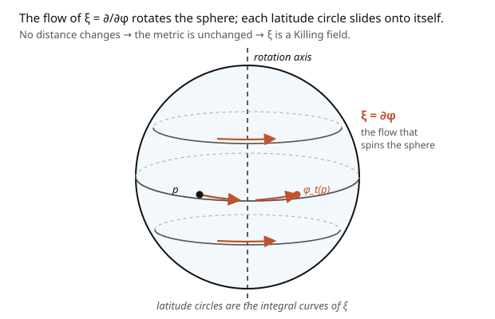

# Differential Geometry · Lesson 5.3: The Lie derivative, Killing vectors, and symmetry

> ⏱ ~15 min · Module 5: Metrics and the bridge to physics · Builds on: [5.2 The Levi-Civita connection](05-02-levi-civita-connection.md), [2.4 Vector fields and the pushforward](02-04-vector-fields-pushforward.md) · Unlocks: [5.4 Fiber bundles and connections — the gauge idea](05-04-fiber-bundles-connections.md)

## Why this matters

Symmetry is the deepest organizing principle in physics, and its geometric form is here. A **Killing vector** is a direction you can slide an entire space along without changing any distances — a symmetry of the metric. The sphere has rotational Killing vectors; flat space has translations and rotations; spacetime's symmetries give energy and momentum conservation. The punchline connects straight to mechanics: **every Killing vector yields a conserved quantity along geodesics** — the geometric origin of conservation laws, and the differential-geometry face of Noether's theorem ([`analytical-mechanics`](../../analytical-mechanics/syllabus.md)). The tool that detects symmetry is the **Lie derivative**, which measures how anything changes as you flow it along a vector field.

## The idea

The **Lie derivative** $\mathcal{L}_X$ answers: as I flow along the vector field $X$ (drift with its wind, [2.4](02-04-vector-fields-pushforward.md)), how fast does some object change? Drag a function, a vector field, or the metric along the flow for an instant and compare to where it started — that rate of change is $\mathcal{L}_X$. Unlike the covariant derivative, it needs **no connection**: it's purely about the flow, comparing an object to its dragged-along self.

Apply this to the **metric**. If flowing along $X$ leaves the metric unchanged — $\mathcal{L}_X g = 0$ — then the flow slides the whole space along itself preserving every distance and angle. That's a **symmetry**, and $X$ is a **Killing vector field**. The rotational field $\partial_\phi$ on the sphere is the archetype (the picture): its flow spins the sphere, each latitude circle sliding onto itself, no distance changed.

The payoff is conservation. If $\xi$ is a Killing vector and a particle moves along a geodesic with velocity $u$, then the quantity $\xi_\mu u^\mu$ (the component of momentum along the symmetry direction) is **constant** along the motion. Rotational symmetry $\Rightarrow$ conserved angular momentum; time-translation symmetry $\Rightarrow$ conserved energy. Symmetry of the geometry becomes a constant of motion — Noether, done geometrically.

## The formal version

The **Lie derivative** $\mathcal{L}_X$ along a vector field $X$:

- on a function: $\mathcal{L}_X f = X(f) = X^i\partial_i f$;
- on a vector field: $\mathcal{L}_X Y = [X, Y]$ (the Lie bracket, [2.4](02-04-vector-fields-pushforward.md));
- on the metric (a $(0,2)$-tensor), in coordinates:

$$(\mathcal{L}_X g)_{\mu\nu} = X^\lambda\partial_\lambda g_{\mu\nu} + g_{\lambda\nu}\partial_\mu X^\lambda + g_{\mu\lambda}\partial_\nu X^\lambda.$$

*In words:* the change in the metric under the flow of $X$ = (how the metric varies as you drift) + (how the flow stretches each index). A **Killing vector field** $\xi$ is one satisfying $\mathcal{L}_\xi g = 0$, equivalently (using the Levi-Civita $\nabla$, [5.2](05-02-levi-civita-connection.md)) the **Killing equation**

$$\nabla_\mu\xi_\nu + \nabla_\nu\xi_\mu = 0.$$

*In words:* the symmetric derivative of the (lowered) Killing covector vanishes — the flow is an infinitesimal isometry. **Conservation law:** if $\gamma$ is a geodesic with tangent $u^\mu$ and $\xi$ is Killing, then

$$\frac{d}{d\tau}\bigl(\xi_\mu u^\mu\bigr) = 0,$$

so $\xi_\mu u^\mu$ is conserved. *In words:* each continuous symmetry of the metric hands you one constant of motion along every geodesic.

## Picture

## Worked examples

**Example 1 (rotational symmetry of the sphere → conserved angular momentum).** On the unit sphere $g = \operatorname{diag}(1, \sin^2\theta)$, the metric components don't depend on $\phi$. Take $\xi = \partial_\phi$ (components $\xi^\mu = (0, 1)$). Then $\mathcal{L}_\xi g = 0$ immediately: every term in $(\mathcal{L}_\xi g)_{\mu\nu} = \xi^\lambda\partial_\lambda g_{\mu\nu} + \cdots$ involves either $\partial_\phi g_{\mu\nu} = 0$ or derivatives of the constant components of $\xi$, all zero. So $\partial_\phi$ is a **Killing vector** — the sphere's rotational symmetry.

The conserved quantity: lower the index, $\xi_\mu = g_{\mu\nu}\xi^\nu = (g_{\theta\phi}, g_{\phi\phi}) = (0, \sin^2\theta)$, so along a geodesic with velocity $u = (\dot\theta, \dot\phi)$,

$$\xi_\mu u^\mu = \sin^2\theta\,\dot\phi = \text{const}.$$

This is exactly the conserved quantity we found by hand from the geodesic equation in [4.3](04-03-geodesics.md) — now revealed as the shadow of rotational symmetry. It's the angular momentum about the sphere's axis.

**Example 2 (the symmetries of the flat plane).** On $\mathbb{R}^2$ with $g = \delta$, the Killing equation in Cartesian coordinates is $\partial_\mu\xi_\nu + \partial_\nu\xi_\mu = 0$ (since $\nabla = \partial$). Check the **rotation** field $\xi = -y\,\partial_x + x\,\partial_y$ (components $\xi_x = -y$, $\xi_y = x$):

$$\partial_x\xi_x = 0, \quad \partial_y\xi_y = 0, \quad \partial_x\xi_y + \partial_y\xi_x = \partial_x(x) + \partial_y(-y) = 1 - 1 = 0. \checkmark$$

So rotation is Killing. Likewise the two **translations** $\partial_x$ and $\partial_y$ are Killing (constant components ⟹ all derivatives vanish). The plane has three independent Killing vectors — two translations and one rotation — its full symmetry group (the Euclidean group). Each gives a conservation law: the translations give conserved linear momentum, the rotation conserved angular momentum. **Symmetry counts conservation laws.**

## Watch out

- **You might conflate the Lie derivative with the covariant derivative.** $\mathcal{L}_X$ needs no connection (it's flow-based, uses only $X$ and the object); $\nabla_X$ needs a connection. They agree on functions ($\mathcal{L}_X f = \nabla_X f = X(f)$) but differ on tensors — $\mathcal{L}_X Y = [X,Y]$ while $\nabla_X Y$ involves $\Gamma$.
- **You might expect Killing vectors to always exist.** A *generic* metric has **none** — no symmetry at all. Killing vectors are special; their number (0 to $\frac{n(n+1)}2$) measures how symmetric a space is. The sphere and flat space are maximally symmetric; a lumpy metric is rigid.
- **You might forget to lower the index in the conserved quantity.** The conserved thing is $\xi_\mu u^\mu$ with $\xi$ **lowered** ($\xi_\mu = g_{\mu\nu}\xi^\nu$). Using the upper-index $\xi^\mu u_\mu$ is the same number, but forgetting the metric factor (e.g. dropping the $\sin^2\theta$) gives the wrong conserved quantity.

## One-liner

> A Killing vector is a direction you can slide a space along without changing distances ($\mathcal{L}_\xi g = 0$), and each one gives a conserved quantity $\xi_\mu u^\mu$ along geodesics — the geometric origin of conservation laws.

## Problems

**P1 (🟢)** Verify that $\partial_x$ is a Killing vector of the flat plane using the Lie-derivative formula $(\mathcal{L}_X g)_{\mu\nu} = X^\lambda\partial_\lambda g_{\mu\nu} + g_{\lambda\nu}\partial_\mu X^\lambda + g_{\mu\lambda}\partial_\nu X^\lambda$ with $g = \delta$. What conserved quantity does it give along geodesics (straight lines)?

**P2 (🟡)** On the sphere, is $\partial_\theta$ a Killing vector? Compute $(\mathcal{L}_{\partial_\theta}g)_{\phi\phi}$ using the formula and the sphere metric, and interpret the result geometrically (does sliding in the $\theta$-direction preserve distances?).

**P3 (🔴, optional)** Prove the conservation law: for a Killing vector $\xi$ and a geodesic with tangent $u$ (so $\nabla_u u = 0$), show $\frac{d}{d\tau}(\xi_\mu u^\mu) = 0$. *Hint:* write $\frac{d}{d\tau}(\xi_\mu u^\mu) = u^\nu\nabla_\nu(\xi_\mu u^\mu)$, expand with Leibniz, use $\nabla_u u = 0$, and note $u^\mu u^\nu\nabla_\nu\xi_\mu$ symmetrizes over $\mu\nu$ — where the Killing equation kills it.

Solution

**P1** For $X = \partial_x$, components $X^\lambda = (1, 0)$, constant. The formula: $(\mathcal{L}_X g)_{\mu\nu} = X^\lambda\partial_\lambda g_{\mu\nu} + g_{\lambda\nu}\partial_\mu X^\lambda + g_{\mu\lambda}\partial_\nu X^\lambda$. Every term vanishes: $\partial_\lambda g_{\mu\nu} = 0$ (flat metric constant) and $\partial_\mu X^\lambda = 0$ (constant components). So $\mathcal{L}_{\partial_x}g = 0$ — $\partial_x$ is Killing. Conserved quantity: $\xi_\mu u^\mu = g_{x\mu}u^\mu = u^x$, the $x$-component of velocity — i.e. **linear momentum in the $x$-direction** is conserved along straight lines (Newton's first law, geometrically).

**P2** For $\partial_\theta$, components $X^\lambda = (1, 0)$. Compute $(\mathcal{L}_{\partial_\theta}g)_{\phi\phi} = X^\lambda\partial_\lambda g_{\phi\phi} + g_{\lambda\phi}\partial_\phi X^\lambda + g_{\phi\lambda}\partial_\phi X^\lambda = \partial_\theta(\sin^2\theta) + 0 + 0 = 2\sin\theta\cos\theta = \sin 2\theta$. This is **nonzero** (except at the equator $\theta = \pi/2$), so $\partial_\theta$ is **not** a Killing vector. Geometrically: sliding in the $\theta$-direction (moving latitude circles toward a pole) *does* change distances — latitude circles shrink as $\theta \to 0$ — so it's not an isometry. Only the $\phi$-rotation preserves the sphere's metric among these two.

**P3** $\frac{d}{d\tau}(\xi_\mu u^\mu) = u^\nu\nabla_\nu(\xi_\mu u^\mu) = u^\nu(\nabla_\nu\xi_\mu)u^\mu + \xi_\mu u^\nu\nabla_\nu u^\mu$. The second term is $\xi_\mu(\nabla_u u)^\mu = 0$ by the geodesic equation. The first term is $u^\mu u^\nu\nabla_\nu\xi_\mu$; since $u^\mu u^\nu$ is symmetric in $\mu\nu$, only the symmetric part of $\nabla_\nu\xi_\mu$ contributes: $u^\mu u^\nu\nabla_\nu\xi_\mu = \tfrac12 u^\mu u^\nu(\nabla_\nu\xi_\mu + \nabla_\mu\xi_\nu) = 0$ by the Killing equation. Both terms vanish, so $\xi_\mu u^\mu$ is conserved. ∎

## Flashback

**From Lesson 2.4 (Vector fields and the pushforward):** Compute the Lie bracket $[X, Y] = \mathcal{L}_X Y$ for $X = \partial_x$ and $Y = x\,\partial_x + y\,\partial_y$ (the dilation field) on $\mathbb{R}^2$.

Solution

Act on a test function $f$: $X(Yf) = \partial_x(x f_x + y f_y) = f_x + x f_{xx} + y f_{yx}$, and $Y(Xf) = (x\partial_x + y\partial_y)f_x = x f_{xx} + y f_{xy}$. Subtract: $[X,Y]f = f_x$, so $[X, Y] = \partial_x = X$. (The dilation field "stretches" $\partial_x$ back into itself — consistent with $\mathcal{L}_X Y = [X,Y]$ measuring how $Y$ changes along $X$'s flow.) ✓

## Connections

- **Backward:** $\mathcal{L}_X Y = [X,Y]$ is the Lie bracket of [2.4](02-04-vector-fields-pushforward.md); the Killing equation uses the Levi-Civita $\nabla$ of [5.2](05-02-levi-civita-connection.md); the conserved $\sin^2\theta\,\dot\phi$ is the one from the geodesic equation ([4.3](04-03-geodesics.md)).
- **Forward:** [5.4](05-04-fiber-bundles-connections.md) reframes symmetry as gauge freedom; in relativity, spacetime Killing vectors give conserved energy and momentum for orbits.
- **Sideways (mechanics/relativity):** this is **Noether's theorem** geometrized — continuous symmetry ⇒ conservation law ([`analytical-mechanics`](../../analytical-mechanics/syllabus.md)). In [`relativity`](../../relativity/syllabus.md), the time-translation Killing vector of a static spacetime gives conserved energy, and the axial one gives conserved angular momentum — exactly how you integrate orbits around a black hole.
