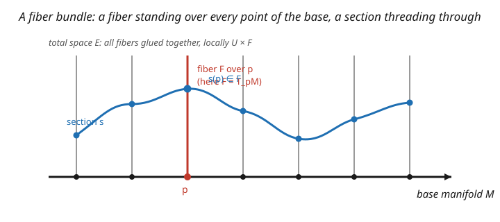

# Differential Geometry · Lesson 5.4: Fiber bundles and connections — the gauge idea

> ⏱ ~15 min · Module 5: Metrics and the bridge to physics · Builds on: [5.3 The Lie derivative, Killing vectors, and symmetry](05-03-lie-derivative-killing-vectors.md), [4.4 The Riemann curvature tensor](04-04-riemann-curvature-tensor.md) · Unlocks: general relativity ([`relativity`](../../relativity/syllabus.md)) and gauge theory ([`qft`](../../qft/syllabus.md))

## Why this matters

This is the capstone that reveals the whole course as the language of modern physics. A **fiber bundle** attaches a space (a fiber) to every point of a manifold, possibly twisted globally — and it turns out that a **connection on a bundle is a gauge field**, its **curvature is the field strength**, and a **choice of frame is a gauge**. The tangent bundle with the Levi-Civita connection is gravity (Module 4); a bundle with fiber a Lie group $U(1)$, $SU(2)$, $SU(3)$ is electromagnetism, the weak force, the strong force. Everything you built — covariant derivatives, parallel transport, curvature, the exterior derivative — reappears here as the unified geometry underneath both general relativity and the Standard Model. Same mathematics, two great theories.

## The idea

A **fiber bundle** is a manifold built by attaching a copy of some **fiber** $F$ to each point of a **base** manifold $M$ (the picture). Locally it looks like a product $U \times F$ — a fiber standing over each base point — but globally the fibers can be glued with a **twist**. A **section** picks one point of each fiber, smoothly: a choice, threading through the bundle.

You've already met the most important example: the **tangent bundle** $TM$, which attaches the tangent space $T_pM$ (the fiber) to each point $p$. A vector field is a section of $TM$. And a **connection** — which you know as $\nabla$ and the Christoffel symbols — is precisely a rule for **horizontal transport**: how to move between neighboring fibers, i.e. parallel transport ([4.2](04-02-parallel-transport.md)). Its **curvature** is the failure of that transport to close around a loop — the Riemann tensor ([4.4](04-04-riemann-curvature-tensor.md)), generalized.

Now the gauge dictionary. In physics, a **principal bundle** has a Lie group $G$ as its fiber (the "internal symmetry"). Then:

| geometry | gauge theory (physics) |
|---|---|
| choice of frame / section | a **gauge** |
| change of frame | a **gauge transformation** |
| connection ($\Gamma$, or $A$) | a **gauge field** (e.g. the EM potential $A_\mu$) |
| curvature of the connection | the **field strength** (e.g. $F_{\mu\nu}$) |

So a gauge field *is* a connection, and its field strength *is* curvature. The abstract "twist in how fibers glue" is, physically, a force field.

## The formal version

A **fiber bundle** is a smooth surjection $\pi: E \to M$ (total space $E$, base $M$) with fiber $F$, locally trivial: each $p \in M$ has a neighborhood $U$ with $\pi^{-1}(U) \cong U \times F$. A **section** is a smooth $s: M \to E$ with $\pi\circ s = \mathrm{id}$. The bundle is **trivial** if globally $E \cong M \times F$; otherwise it's twisted.

- **Vector bundle:** fiber a vector space (e.g. $TM$, fiber $T_pM$). Sections = vector fields.
- **Principal $G$-bundle:** fiber a Lie group $G$ acting freely; the arena of gauge theory.

A **connection** specifies, at each point of $E$, which directions are "horizontal" (the infinitesimal parallel-transport directions), splitting the tangent space of $E$ into horizontal + vertical. Locally it's encoded by a connection 1-form $A$ (Lie-algebra-valued for a principal bundle); parallel transport and the covariant derivative $\nabla = \partial + A$ come from it. The **curvature** is

$$F = dA + A\wedge A,$$

the failure of horizontal transport to close around an infinitesimal loop. *In words:* $F$ generalizes the Riemann tensor; for an abelian group like $U(1)$ (electromagnetism) the $A\wedge A$ term vanishes and $F = dA$. A **gauge transformation** is a change of local frame/section, under which $A$ shifts non-tensorially (like $\Gamma$, [4.1](04-01-covariant-derivative-christoffel.md)) while $F$ transforms covariantly.

## Picture

## Worked examples

**Example 1 (trivial vs twisted — cylinder vs Möbius band).** Both are line bundles over the circle $S^1$: attach a line (fiber $\mathbb{R}$, or an interval) to each point of a circle. Glue the ends without a flip and you get the **cylinder** $S^1 \times \mathbb{R}$ — a **trivial** bundle. Glue with a flip and you get the **Möbius band** — a **twisted** bundle. Same base, same fiber, different global gluing.

The observable difference: a **section** is a smooth choice of one point in each fiber (a curve going around). On the cylinder you can pick the "zero" of each line consistently — a nowhere-vanishing section exists. On the **Möbius band you cannot**: any continuous choice of a nonzero point in each fiber must, after going around once and hitting the flip, pass through zero somewhere (intermediate value theorem on the flipped identification). So the Möbius bundle has **no nonvanishing section** — the topological signature of a nontrivial bundle. (This is the baby version of "you can't comb a hairy sphere": $TS^2$ is nontrivial.)

**Example 2 (electromagnetism is a connection; two of Maxwell's equations are $d^2 = 0$).** Electromagnetism is a $U(1)$ gauge theory: the connection is the electromagnetic potential 1-form $A = A_\mu\,dx^\mu$, and its curvature is the field strength 2-form

$$F = dA \qquad (\text{the } A\wedge A \text{ term vanishes for abelian } U(1)),$$

whose components $F_{\mu\nu} = \partial_\mu A_\nu - \partial_\nu A_\mu$ are the electric and magnetic fields. Now apply the exterior derivative: since $F = dA$ is **exact**, it is **closed** by $d^2 = 0$ ([3.3](03-03-exterior-derivative.md)):

$$dF = d(dA) = 0.$$

This single equation $dF = 0$ *is* two of Maxwell's equations — the absence of magnetic monopoles ($\nabla\cdot\mathbf B = 0$) and Faraday's law ($\nabla\times\mathbf E = -\partial_t\mathbf B$). The other two, $d\star F = J$, bring in the metric (via the Hodge star $\star$) and the source current. So **all of Maxwell** is $dF = 0$, $d\star F = J$ — the electromagnetic field is the curvature of a $U(1)$ connection, and half of Maxwell is just "the curvature of a connection is closed." Yang–Mills theory ([`qft`](../../qft/syllabus.md)) is the same story with a nonabelian $G$, where $F = dA + A\wedge A$ and the extra term encodes the self-interaction of gluons and $W$/$Z$ bosons.

## Watch out

- **You might think all bundles are products.** Local triviality ($U \times F$) does *not* imply global triviality. The Möbius band, $TS^2$, and the magnetic monopole bundle are locally products but globally twisted — and that twist is physical (it's why monopole charge is quantized).
- **You might expect $F = dA$ always.** Only for **abelian** gauge groups ($U(1)$, electromagnetism). For nonabelian $G$ (the weak and strong forces), $F = dA + A\wedge A$ — the connection curves itself, which is why gluons carry color charge and interact with each other. Dropping $A\wedge A$ is an abelian-only shortcut.
- **You might separate gravity from gauge theory.** They're the same framework: gravity is the connection on the *tangent* bundle (Levi-Civita, [5.2](05-02-levi-civita-connection.md)), gauge forces are connections on *internal* bundles. The Riemann tensor and the Yang–Mills field strength are both "curvature of a connection." That unity is the whole point of this lesson.

## One-liner

> A connection on a fiber bundle is a gauge field and its curvature is the field strength — so gravity (tangent bundle) and the forces of the Standard Model (internal bundles) are the same geometry: parallel transport, curvature, and $d^2 = 0$.

## Problems

**P1 (🟢)** Explain why a vector field on $S^2$ (a section of $TS^2$) must vanish somewhere ("you can't comb a hairy sphere"), and contrast with $S^1$ or the torus, where nonvanishing vector fields exist. What does this say about whether $TS^2$ is a trivial bundle?

**P2 (🟡)** For the electromagnetic potential $A = -y\,dx + x\,dy$ (times a constant), compute the field strength $F = dA$ and identify the resulting magnetic field. Then confirm $dF = 0$.

**P3 (🔴, optional)** Sketch the analogy between the covariant derivative on the tangent bundle, $\nabla_\mu = \partial_\mu + \Gamma_\mu$, and the gauge-covariant derivative in electromagnetism, $D_\mu = \partial_\mu + iqA_\mu$. Which geometric object does $\Gamma$ correspond to, which does $A$, and what plays the role of curvature in each? Why are both "not tensors" individually while their curvatures are?

Solutions

**P1** By the Poincaré–Hopf theorem, the sum of indices of a vector field's zeros on a closed surface equals its Euler characteristic $\chi$. For $S^2$, $\chi = 2 \neq 0$, so any smooth vector field *must* have zeros (total index $2$) — you can't comb it flat without a cowlick. For $S^1$ ($\chi = 0$) and the torus $T^2$ ($\chi = 0$), nonvanishing fields exist (e.g. the constant "around" direction). A trivial bundle $M \times \mathbb{R}^n$ always admits nonvanishing sections (pick a constant nonzero vector); since $TS^2$ does **not**, $TS^2$ is a **nontrivial** (twisted) bundle — the sphere is not parallelizable.

**P2** $F = dA = d(-y\,dx) + d(x\,dy) = -dy\wedge dx + dx\wedge dy = dx\wedge dy + dx\wedge dy = 2\,dx\wedge dy$. As a field strength on the plane (embedded in 3D), $F = 2\,dx\wedge dy$ corresponds to a **uniform magnetic field** $B = 2$ pointing in the $z$-direction (the $dx\wedge dy$ component is $B_z$). Check $dF = d(2\,dx\wedge dy) = 0$ (the coefficient is constant, and $d$ of a form with constant coefficients on a top-or-lower form gives $0$; in 3D, $dF = \partial_z(2)\,dz\wedge dx\wedge dy = 0$). So $dF = 0$ ✓ — consistent with $\nabla\cdot\mathbf B = 0$.

**P3** On the tangent bundle, $\nabla_\mu = \partial_\mu + \Gamma_\mu$ where $\Gamma$ (the Christoffel symbols) is the **connection = gauge field**, and its curvature is the **Riemann tensor** $R \sim \partial\Gamma + \Gamma\Gamma$. In electromagnetism, $D_\mu = \partial_\mu + iqA_\mu$ where $A_\mu$ is the connection/gauge field, and its curvature is the **field strength** $F = dA$. The correspondence: $\Gamma \leftrightarrow A$ (both connections), Riemann $\leftrightarrow F$ (both curvatures). Both $\Gamma$ and $A$ are **not tensors/not gauge-invariant** — they shift by an inhomogeneous term under a change of frame/gauge ([4.1](04-01-covariant-derivative-christoffel.md)) — precisely so the covariant derivative transforms correctly. But their **curvatures** $R$ and $F$ *are* tensorial/gauge-covariant, because the inhomogeneous terms cancel when you antisymmetrize two covariant derivatives. Curvature is the physical, frame-independent content; the connection is the frame-dependent potential. ∎

## Flashback

**From Lesson 3.3 (The exterior derivative):** For the electromagnetic potential $A = \tfrac12 B(-y\,dx + x\,dy)$ (with $B$ a constant), compute the field strength $F = dA$, and verify $dF = 0$ using $d^2 = 0$.

Solution

$F = dA = \tfrac12 B\,d(-y\,dx + x\,dy) = \tfrac12 B(-dy\wedge dx + dx\wedge dy) = \tfrac12 B(dx\wedge dy + dx\wedge dy) = B\,dx\wedge dy$. So $F$ is a uniform magnetic field of strength $B$ in the $z$-direction. And $dF = d(dA) = 0$ automatically by $d^2 = 0$ (or directly: $dF = \partial_z(B)\,dz\wedge dx\wedge dy = 0$ since $B$ is constant). This is Gauss's law for magnetism, $\nabla\cdot\mathbf B = 0$, falling out of "$F$ is exact ⟹ $F$ is closed." ✓

## Connections

- **Backward:** the tangent bundle's connection is [4.1](04-01-covariant-derivative-christoffel.md)'s $\nabla$/$\Gamma$; its curvature is the Riemann tensor ([4.4](04-04-riemann-curvature-tensor.md)); $dF = 0$ is $d^2 = 0$ ([3.3](03-03-exterior-derivative.md)); sections generalize vector fields ([2.4](02-04-vector-fields-pushforward.md)).
- **Forward:** general relativity ([`relativity`](../../relativity/syllabus.md)) is the geometry of the tangent bundle's Levi-Civita connection; gauge theory and the Standard Model ([`qft`](../../qft/syllabus.md)) are connections on internal $U(1) \times SU(2) \times SU(3)$ bundles — this lesson is the shared foundation.
- **Sideways (electromagnetism/mechanics):** Maxwell's equations are $dF = 0$, $d\star F = J$; the Aharonov–Bohm effect is the holonomy ([4.2](04-02-parallel-transport.md)) of the $U(1)$ connection $A$ around a solenoid; and the symplectic structure of [`analytical-mechanics`](../../analytical-mechanics/syllabus.md) is another bundle-with-a-closed-2-form.

*Module 5 capstone (Boss Problem 5): for a symmetric metric (flat polar/spherical, or the sphere), derive the Levi-Civita connection, find a Killing vector via the Killing equation, and show it yields a quantity conserved along geodesics — the geometric origin of a conservation law. Lessons [5.2](05-02-levi-civita-connection.md)–[5.3](05-03-lie-derivative-killing-vectors.md) assemble exactly this, and this lesson reveals the connection itself as the gauge field of physics.*
