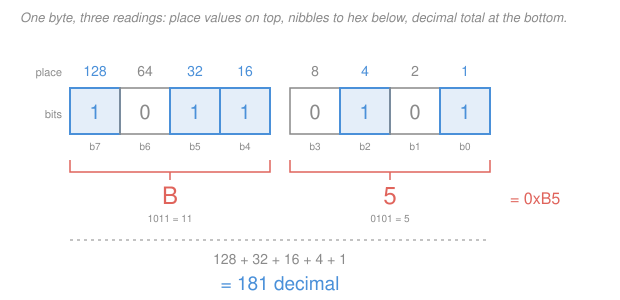

# Digital Logic Design · Lesson 1.1: Number systems and bases

> ⏱ ~15 min · Module 1: Binary and Boolean algebra · Builds on: [`electronics` 4.3 CMOS: the inverter & gates](../../electronics/lessons/04-03-cmos-inverter-gates.md) · Unlocks: [1.2 Signed numbers and two's-complement arithmetic](01-02-signed-numbers-twos-complement.md)

## Why this matters

A computer has no idea what a number is. It has switches, and each switch is either conducting or not. Everything else — integers, text, images, this sentence — is a convention layered on top of *on* and *off*. This lesson installs that convention, and it is the one piece of the course you will use in literally every later lesson: an adder in [2.3](02-03-arithmetic-circuits.md) adds binary, a K-map in [2.1](02-01-karnaugh-maps.md) is indexed by binary, a memory chip in [4.3](04-03-memory-and-programmable-logic.md) is sized by powers of two. Get fluent here and the rest of the course is about *circuits*, not about counting.

## The idea

**Why two states and not ten?** Hardware doesn't store symbols, it stores voltages, and voltages are noisy. A CMOS gate ([`electronics` 4.3](../../electronics/lessons/04-03-cmos-inverter-gates.md)) drives its output all the way to the supply rail or all the way to ground, and it reads anything in the bottom third as 0 and anything in the top third as 1. That leaves an enormous dead zone in the middle — over a volt of slop that noise, crosstalk, and a sagging power rail can eat into without the gate ever being confused. Two states are *cheap to tell apart*.

Now imagine a base-10 computer on a 1.2 V supply. Ten distinguishable levels means slicing that 1.2 V into ten bands roughly 120 mV apart, and a receiver must decide which band it is in. A 60 mV glitch — routine — flips a digit. You'd need enormous supply voltages, exotic analog receivers, and you'd still lose. So: **two states, because two states are the only ones you can guarantee.** Every design decision in this course descends from that sentence.

**Positional notation is base-agnostic.** You already know how to read a number in *some* base; you just never noticed the base was a parameter. "Two hundred forty-three" means two hundreds, four tens, three ones — digits multiplied by powers of ten. Swap ten for two, or for sixteen, and nothing else about the machinery changes. Binary is not a different *kind* of number. It is the same number written with a different-sized bundle.

**Hex is not a third idea.** Sixteen is $2^4$, so one hex digit is *exactly* four bits — no rounding, no leftover. Hex is a compression scheme for humans reading bits, and nothing more. `1011 0101` is eight characters your eye slides off; `0xB5` is two you can hold in your head.

## The formal version

**Positional notation.** A string of digits $d_{n-1}d_{n-2}\ldots d_1 d_0$ in **base** $b$ (an integer $b \ge 2$, using digits $0$ through $b-1$) denotes

$$\boxed{\;V = \sum_{i=0}^{n-1} d_i\, b^{\,i}\;}$$

where $d_i$ is the digit in position $i$, counting from the **right** starting at $0$, and $b^i$ is that position's **place value**. *In words: each digit is worth its face value times the base raised to how far left it sits.*

Decimal ($b = 10$), to make the machinery look familiar:

$$243 = 2\cdot 10^2 + 4\cdot 10^1 + 3\cdot 10^0 = 200 + 40 + 3.$$

Binary ($b = 2$, digits 0 and 1 only — each digit is a **bit**):

$$\texttt{10110101} = 1\cdot 2^7 + 0\cdot 2^6 + 1\cdot 2^5 + 1\cdot 2^4 + 0\cdot 2^3 + 1\cdot 2^2 + 0\cdot 2^1 + 1\cdot 2^0 = 128 + 32 + 16 + 4 + 1 = 181.$$

Hexadecimal ($b = 16$, digits `0`–`9` then `A`–`F` for ten through fifteen):

$$\texttt{B5} = 11\cdot 16^1 + 5\cdot 16^0 = 176 + 5 = 181.$$

Same number, three costumes. Notation: binary and hex literals go in backticks in this course (`1011`, `0xB5`), with the `0x` prefix marking hex the way most tools do; `0b` sometimes marks binary. Where the base is genuinely ambiguous, subscript it: $181_{10} = 10110101_2 = \mathrm{B5}_{16}$.

### Binary to decimal

Positional sum — add the place values wherever there is a 1. `1101` gives $8 + 4 + 1 = 13$. That is the whole method.

### Decimal to binary — two routes to the same place

**Route A: repeated division by 2** (bottom-up; mechanical, never requires you to know the powers of two). Divide by 2, write the remainder, repeat on the quotient until it hits 0, then read the remainders **bottom to top**. For 181:

| step | quotient | remainder |
|---|---|---|
| $181 \div 2$ | 90 | **1** |
| $90 \div 2$ | 45 | **0** |
| $45 \div 2$ | 22 | **1** |
| $22 \div 2$ | 11 | **0** |
| $11 \div 2$ | 5 | **1** |
| $5 \div 2$ | 2 | **1** |
| $2 \div 2$ | 1 | **0** |
| $1 \div 2$ | 0 | **1** |

Reading upward: `10110101`. (Each remainder is $V \bmod 2$ — the current least-significant bit — and the division shifts it away. Same division algorithm as [`discrete-mathematics` 4.3](../../discrete-mathematics/lessons/04-03-modular-arithmetic-and-congruences.md).)

**Route B: subtract the largest power of 2** (top-down; faster once the powers 1, 2, 4, 8, …, 128 are reflex). Take the biggest power of two that fits, write a 1 there, subtract, repeat; write 0 for every power that doesn't fit. For 181: $128$ fits (remainder 53), $64$ doesn't, $32$ fits (21), $16$ fits (5), $8$ doesn't, $4$ fits (1), $2$ doesn't, $1$ fits (0). Bits from the 128 place down: `1 0 1 1 0 1 0 1`.

Both routes give `10110101`. They must — one peels bits off the bottom, the other off the top.

### Binary to hex: group in fours **from the right**

Because $16 = 2^4$, four bits collapse into one hex digit with no interaction between groups. Split the bit string into groups of four **starting at the right end** and pad the *left* with zeros if the last group is short.

The full correspondence, the one table worth memorizing:

| bits | dec | hex | bits | dec | hex |
|---|---|---|---|---|---|
| `0000` | 0 | `0` | `1000` | 8 | `8` |
| `0001` | 1 | `1` | `1001` | 9 | `9` |
| `0010` | 2 | `2` | `1010` | 10 | `A` |
| `0011` | 3 | `3` | `1011` | 11 | `B` |
| `0100` | 4 | `4` | `1100` | 12 | `C` |
| `0101` | 5 | `5` | `1101` | 13 | `D` |
| `0110` | 6 | `6` | `1110` | 14 | `E` |
| `0111` | 7 | `7` | `1111` | 15 | `F` |

Example with an awkward length: `1101101` is 7 bits. Group from the right: `110` `1101`, pad the left: `0110` `1101` → `6D`. Check by positional sum: `1101101` $= 64+32+8+4+1 = 109$, and `0x6D` $= 6\cdot16 + 13 = 109$. ✓

Group from the *left* by mistake and you get `1101` `101`, padded on the right to `1101` `1010` → `DA` = 218. Wrong, and wrong *silently* — the pattern still looks like plausible hex. **Grouping from the right is the single most-failed step in this lesson.** The right end is where place value $2^0$ lives; that anchor can't move.

### Sizes, ranges, and vocabulary

With $n$ bits you have $n$ independent two-way choices, so

$$\text{number of distinct patterns} = 2^n, \qquad \text{unsigned range} = 0 \ \text{to}\ 2^n - 1.$$

*In words: $n$ bits give $2^n$ patterns, and because one of them is zero, the largest value is one less than $2^n$.*

| $n$ | patterns $2^n$ | unsigned range | name |
|---|---|---|---|
| 4 | 16 | 0 to 15 | **nibble** (one hex digit) |
| 8 | 256 | 0 to 255 | **byte** (two hex digits) |
| 16 | 65,536 | 0 to 65,535 | four hex digits |
| 32 | 4,294,967,296 | 0 to 4,294,967,295 | ≈ 4.29 billion |

- **bit** — one binary digit. **nibble** — 4 bits. **byte** — 8 bits, the universal unit of storage.
- **word** — the machine's natural chunk, and it is *context-dependent*: 16 bits on an old x86, 32 or 64 bits on a modern CPU, whatever the designer says on a custom chip. Always ask what a word is before assuming.

Worth burning in: $2^{10} = 1024 \approx$ 1K, $2^{20} = 1{,}048{,}576 \approx$ 1M, $2^{30} = 1{,}073{,}741{,}824 \approx$ 1G. These make sizing instant — a 12-bit address bus reaches $2^{12} = 2^2 \cdot 2^{10} = 4$K locations. Honest caveat: "K" means 1000 to a disk manufacturer and 1024 to a memory designer, and the two drift apart (7% at G, worse beyond). The units **KiB, MiB, GiB** were invented to mean the powers of two unambiguously; in this course K/M/G always mean the powers of two.

### Octal, in two sentences

Base 8 packs **three** bits per digit (since $8 = 2^3$), using digits 0–7, and it is mostly a fossil from machines with word sizes divisible by 3. It survives in Unix file permissions: `755` is `111 101 101`, i.e. read-write-execute for the owner and read-execute for everyone else.

### Bits after the point

Place values keep going right past the radix point as *negative* powers: $2^{-1} = 0.5$, $2^{-2} = 0.25$, $2^{-3} = 0.125$, and so on.

- Binary → decimal: `0.101` $= \tfrac12 + 0 + \tfrac18 = 0.625$.
- Decimal → binary: repeatedly multiply by 2 and harvest the integer part. $0.625 \times 2 = \mathbf{1}.25$; $0.25 \times 2 = \mathbf{0}.5$; $0.5 \times 2 = \mathbf{1}.0$, done → `0.101`. ✓

Now the sharp fact. Run that on $0.1$: $0.1 \to \mathbf{0}.2 \to \mathbf{0}.4 \to \mathbf{0}.8 \to \mathbf{1}.6 \to \mathbf{1}.2 \to \mathbf{0}.4$ — and $0.4$ has already appeared, so it cycles forever: `0.0001100110011...`. **Decimal 0.1 is not exactly representable in binary**, any more than $1/3$ is exactly representable in decimal. Every "why does 0.1 + 0.2 not equal 0.3" bug traces to this line. Managing that error is the business of the numerical-analysis course ([syllabus](../../numerical-analysis/syllabus.md)); here we just need to know it is a property of the *base*, not a bug in the hardware.

## Picture

## Worked examples

**Example 1 (mechanical — a full round trip).** Convert 205 to binary and hex, then convert back.

Route B: 128 fits (205 − 128 = 77), 64 fits (13), 32 no, 16 no, 8 fits (5), 4 fits (1), 2 no, 1 fits (0). Bits from 128 down: `11001101`.

Group from the right: `1100` `1101` → `C` `D` → `0xCD`.

*Check both directions.* Positional sum: $128+64+8+4+1 = 205$ ✓. Hex: $12\cdot16 + 13 = 192 + 13 = 205$ ✓. Cross-check with Route A: $205\to102\,r1,\ 102\to51\,r0,\ 51\to25\,r1,\ 25\to12\,r1,\ 12\to6\,r0,\ 6\to3\,r0,\ 3\to1\,r1,\ 1\to0\,r1$; bottom-to-top `11001101` ✓.

**Example 2 (why you'd care — reading a hex dump as bits).** A logic analyzer reports that a peripheral's 16-bit status register holds `0x4A7E`. Which bits are set?

Expand each hex digit into its four bits, left to right, no regrouping needed:

`4` → `0100`, `A` → `1010`, `7` → `0111`, `E` → `1110`, so the register is

`0100 1010 0111 1110`

Label the positions b15 (leftmost) down to b0 (rightmost). The 1s sit at b14, b11, b9, b6, b5, b4, b3, b2, b1. If the datasheet says "b9 = transmit buffer empty", you now read that off a four-character hex dump in about three seconds — that is the whole reason engineers publish register contents in hex.

*Check.* Positional sum: $16384 + 2048 + 512 + 64 + 32 + 16 + 8 + 4 + 2 = 19070$. And $\mathrm{0x4A7E} = 4\cdot4096 + 10\cdot256 + 7\cdot16 + 14 = 16384 + 2560 + 112 + 14 = 19070$ ✓.

## Watch out

- **You might group binary into hex nibbles from the left.** Only the right end is anchored — position $2^0$ is there and can't move. Group from the right and pad the *left* with zeros; `1101101` is `0110 1101` = `0x6D`, not `1101 1010` = `0xDA`.
- **You might read the division remainders top-down.** Repeated division peels off the **least** significant bit first, so the first remainder you write is the *rightmost* bit. Read the column bottom-to-top. (Sanity check that costs one second: an odd number must end in `1`.)
- **You might say 8 bits go up to 256.** They give 256 *patterns*, but the range is 0 to **255** — zero occupies one of them. The off-by-one between $2^n$ and $2^n - 1$ shows up again in [1.2](01-02-signed-numbers-twos-complement.md) and in every memory-sizing problem in [4.3](04-03-memory-and-programmable-logic.md).

## One-liner

> Every base is the same idea — digits times powers of the base — and binary wins only because a switch has exactly two states you can trust; hex is just binary bundled four bits at a time, grouped from the right.

## Problems

**P1 (🟢)** (a) Convert `11010110` to decimal and to hex. (b) Convert 200 to binary and to hex, using either route. (c) What decimal value is the binary fraction `0.011`?

**P2 (🟡)** A crash dump shows the 16-bit word `0xCAFE`. Expand it to its full 16-bit pattern, verify your expansion by a positional sum, and say how many bits are set to 1.

**P3 (🔴)** A 12-bit analog-to-digital converter ([`electronics` 4.4](../../electronics/lessons/04-04-adc-dac.md)) maps an input span of 0 to 3.3 V onto unsigned codes. (a) How many distinct codes, and what is the largest? (b) How many volts does one code step represent, taking the step as full scale divided by the largest code? (c) The converter reports code 2730 — give it in hex and in binary.

Solutions

**P1**

(a) Positional sum: `11010110` $= 128 + 64 + 16 + 4 + 2 = 214$. Hex by grouping from the right: `1101` `0110` → `D` `6` → `0xD6`.
*Check:* $13\cdot16 + 6 = 208 + 6 = 214$ ✓ (matches the decimal, so both conversions agree).

(b) Route B on 200: 128 fits (200 − 128 = 72), 64 fits (8), 32 no, 16 no, 8 fits (0), 4 no, 2 no, 1 no → `11001000`.
*Check by Route A:* $200\to100\,r0,\ 100\to50\,r0,\ 50\to25\,r0,\ 25\to12\,r1,\ 12\to6\,r0,\ 6\to3\,r0,\ 3\to1\,r1,\ 1\to0\,r1$; bottom-to-top `11001000` ✓ (and it ends in `0`, as an even number must).
Hex: `1100` `1000` → `0xC8`. *Check:* $12\cdot16 + 8 = 192 + 8 = 200$ ✓.

(c) `0.011` $= 0\cdot\tfrac12 + 1\cdot\tfrac14 + 1\cdot\tfrac18 = 0.25 + 0.125 = 0.375$.
*Check by going back:* $0.375\times2 = \mathbf{0}.75$; $0.75\times2 = \mathbf{1}.5$; $0.5\times2 = \mathbf{1}.0$ → `0.011` ✓.

**P2** Digit by digit: `C` → `1100`, `A` → `1010`, `F` → `1111`, `E` → `1110`. So

`1100 1010 1111 1110`

*Check by positional sum.* With b15 leftmost, the 1s are at b15, b14, b11, b9, b7, b6, b5, b4, b3, b2, b1:
$32768 + 16384 + 2048 + 512 + 128 + 64 + 32 + 16 + 8 + 4 + 2 = 51966$.
Directly from hex: $12\cdot4096 + 10\cdot256 + 15\cdot16 + 14 = 49152 + 2560 + 240 + 14 = 51966$ ✓.

Count of 1 bits: 2 (from `C`) + 2 (`A`) + 4 (`F`) + 3 (`E`) = **11**, which matches the eleven positions listed above ✓.

**P3**

(a) $2^{12} = 4096$ distinct codes, running 0 to $4096 - 1 = 4095$. (Using $2^{12} = 2^2\cdot2^{10} = 4\times1024$.)

(b) Step $= 3.3 / 4095 = 8.059\times10^{-4}$ V $\approx 0.806$ mV per code.
*Check:* $4095 \times 0.000806 \approx 3.30$ V ✓ — the steps span the full range, as they must.

(c) Repeatedly divide by 16 (the same algorithm as division by 2, one hex digit at a time): $2730 \div 16 = 170$ remainder $10 =$ `A`; $170 \div 16 = 10$ remainder $10 =$ `A`; $10 \div 16 = 0$ remainder $10 =$ `A`. Bottom-to-top: `0xAAA`.
*Check:* $10\cdot256 + 10\cdot16 + 10 = 2560 + 160 + 10 = 2730$ ✓.
Binary, one nibble per hex digit: `1010 1010 1010`. *Check by positional sum:* $2048 + 512 + 128 + 32 + 8 + 2 = 2730$ ✓. (An alternating pattern like this is a favourite ADC test code precisely because a stuck or shorted data line breaks it visibly.)

## Connections

- **Backward:** the two-state premise is not an assumption of this course, it is a *result* of [`electronics` 4.3](../../electronics/lessons/04-03-cmos-inverter-gates.md) — a CMOS gate restores its output to a rail, which is what makes a bit survive being copied through a thousand gates. And repeated division by 2 is the division algorithm and $V \bmod 2$ from [`discrete-mathematics` 4.3](../../discrete-mathematics/lessons/04-03-modular-arithmetic-and-congruences.md), applied one bit at a time.
- **Forward:** [1.2](01-02-signed-numbers-twos-complement.md) keeps these exact 8-bit patterns and changes only the *interpretation*, so that `10110101` can mean $-75$ instead of 181 — the pattern never changes, the reading does. The powers-of-two vocabulary reappears as address-bus width in [4.3](04-03-memory-and-programmable-logic.md), and grouping bits into nibbles is what makes a 4-bit ALU slice ([2.5](02-05-building-a-simple-alu.md)) the natural unit to replicate.
- **Sideways:** hex is the lingua franca of anything that hands you raw bytes — checksums and keys in the cryptography course ([syllabus](../../cryptography/syllabus.md)), and the bit-level codeword arithmetic in the information theory course ([syllabus](../../information-theory/syllabus.md)). The non-representability of decimal 0.1 is the seed of every floating-point surprise, which the numerical-analysis course ([syllabus](../../numerical-analysis/syllabus.md)) treats properly.
