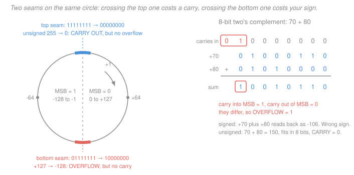

# Digital Logic Design · Lesson 1.2: Signed numbers and two's-complement arithmetic

> ⏱ ~15 min · Module 1: Binary and Boolean algebra · Builds on: [1.1 Number systems and bases](01-01-number-systems-and-bases.md) · Unlocks: 2.3 (arithmetic circuits), 2.5 (a simple ALU)

## Why this matters

Lesson 1.1 gave you unsigned binary — every byte a number from 0 to 255. But real machines subtract, and real quantities go negative. Hardware has no minus key: a register holds eight wires, each either low or high, and nothing else. So "negative" has to be **encoded inside the bit pattern itself**, and the choice of encoding is a *design decision* with a cost.

That decision was made once, universally, and it is the reason a CPU can subtract without owning a subtractor. Get two's complement into your fingers now and three later lessons become bookkeeping: the ripple-carry adder in [2.3](02-03-arithmetic-circuits.md), the ALU in [2.5](02-05-building-a-simple-alu.md), and every `signed`/`unsigned` bug you will ever chase in C.

## The idea

You have $n$ wires, so you have exactly $2^n$ patterns. There is no room for a sign *plus* a full range — you have to spend some of those $2^n$ patterns on negatives. The only question is **which patterns mean which numbers**, and the winner is decided by one criterion: *how much silicon does the arithmetic cost?*

Three candidates, each an honest attempt:

**1. Sign–magnitude.** Steal the top bit for the sign (`0` = plus, `1` = minus) and read the rest as an ordinary magnitude. Maximally intuitive — it is how you write numbers on paper. Two problems. First, `0000` and `1000` both mean zero: **two zeros**, so a hardware equality test needs a special case forever. Second, adding is a mess: to compute $5 + (-3)$ the circuit must *inspect both signs*, decide that this is really a subtraction, figure out which magnitude is larger, subtract the smaller from the larger, and attach the winner's sign. That's a comparator, a subtractor, and a pile of control logic bolted onto the adder.

**2. One's complement.** Negate by flipping every bit. Now $+5$ and $-5$ are bitwise opposites, which feels principled and makes negation nearly free. But `0000` and `1111` are still both zero — **two zeros again** — and addition needs an odd fix-up called the *end-around carry*: whenever a carry pops out the top, you must feed it back into the bottom and add again. An extra adder pass for every sum.

**3. Two's complement.** Flip every bit **and add 1**. This looks like an arbitrary tweak to one's complement, and the payoff is out of all proportion to the tweak. There is exactly **one zero**. And — the decisive property — **subtraction becomes addition**: $a - b$ is computed as $a + (\text{two's complement of } b)$, with the *same* adder, no sign inspection, no fix-up pass, no second circuit. One adder does both operations for every combination of signs.

That is the whole story. Two's complement won not because it is elegant but because it is *cheap*, and in 1960s silicon cheap was everything.

Here are all three side by side in 4 bits. Read it as: "to store this decimal value, which pattern?"

| decimal | sign–magnitude | one's complement | two's complement |
|---|---|---|---|
| $+7$ | `0111` | `0111` | `0111` |
| $+5$ | `0101` | `0101` | `0101` |
| $+2$ | `0010` | `0010` | `0010` |
| $0$ | `0000` | `0000` | `0000` |
| $-0$ | `1000` | `1111` | *(does not exist)* |
| $-2$ | `1010` | `1101` | `1110` |
| $-5$ | `1101` | `1010` | `1011` |
| $-7$ | `1111` | `1000` | `1001` |
| $-8$ | *(unrepresentable)* | *(unrepresentable)* | `1000` |

Look at the last three rows together. The pattern `1000` means $-0$ in sign–magnitude, $-7$ in one's complement, and $-8$ in two's complement — the same wires, three different numbers. A bit pattern has no meaning until you name the encoding.

## The formal version

**The real definition** is not "invert and add 1" — that's a procedure. It is a **weighted sum**, exactly like unsigned binary except that the top bit's weight is negative.

For an $n$-bit pattern $b_{n-1}b_{n-2}\ldots b_1b_0$ (here $b_{n-1}$ is the **most significant bit**, or MSB — the leftmost — and $b_0$ the least significant), the two's-complement value is

$$\boxed{\;V = -b_{n-1}\,2^{\,n-1} \;+\; \sum_{i=0}^{n-2} b_i\,2^{\,i}\;}$$

*In words: every bit carries its usual positional weight, except the top one, which carries the same magnitude with a minus sign.*

That single sign flip explains everything else. The MSB is a **sign bit** for free (if it's 1, you've committed to $-2^{n-1}$, which no combination of the smaller positive weights can climb back out of). And ordinary binary addition just works, because the whole system is arithmetic modulo $2^n$ — the same wrap-around you met with unsigned overflow in [1.1](01-01-number-systems-and-bases.md), and formally the ring $\mathbb{Z}/2^n\mathbb{Z}$ from [modular arithmetic](../../discrete-mathematics/lessons/04-03-modular-arithmetic-and-congruences.md).

Work one out. Take `10110011` with $n = 8$:

$$V = -128 + 0 + 32 + 16 + 0 + 0 + 2 + 1 = -128 + 51 = -77.$$

*(Check: the same pattern read as unsigned is $128+32+16+2+1 = 179$, and $179 - 256 = -77$. Whenever the MSB is 1, signed value = unsigned value $-\,2^n$. ✓)*

**Negation: invert and add 1.** To form $-x$, complement every bit of $x$ (write $\overline{x}$ for that; some books write $x'$) and add 1:

$$-x = \overline{x} + 1.$$

*In words: flip all the bits, then bump by one.* Why it works: for any $n$-bit $x$, the sum $x + \overline{x}$ is all ones, since each column has exactly one 1 — and all ones is $-1$ in two's complement. So $\overline{x} = -1 - x$, hence $\overline{x} + 1 = -x$. ✓

It is an **involution** — do it twice and you're home. Take $77 =$ `01001101` (check: $64+8+4+1 = 77$ ✓):

- invert → `10110010`, add 1 → `10110011`. Weighted reading: $-77$ ✓ (computed above).
- invert `10110011` → `01001100`, add 1 → `01001101` $= 77$ ✓.

**The shortcut worth memorizing.** Scanning from the right, **copy bits up to and including the first `1`, then invert everything to the left of it.** No carry propagation, no adding. On $77 =$ `01001101`: the first `1` from the right is the last bit, so copy `1`, then invert the remaining `0100110` to `1011001` — giving `10110011` ✓, matching invert-and-add-1 exactly. On $12 =$ `00001100`: copy the trailing `100`, invert the leading `00001` to `11110`, giving `11110100`. Verify by the long route: invert `00001100` → `11110011`, add 1 → `11110100` ✓. Verify by weight: $-128+64+32+16+4 = -12$ ✓.

**Range, and its asymmetry.** With $n$ bits the representable values run

$$-2^{\,n-1} \;\le\; V \;\le\; 2^{\,n-1}-1,$$

so for $n=8$: $-128$ to $+127$. Count them: 128 negatives, 127 positives, one zero — $256 = 2^8$ ✓. There is **one more negative than positive**, because the zero that sign–magnitude wasted on $-0$ got spent on a real number instead.

The price is a genuine edge case: $-128 =$ `10000000` **is its own negation**. Invert → `01111111`, add 1 → `10000000`, the same pattern. There is no $+128$ in 8 bits, so negating $-128$ overflows silently. This is not a curiosity — `abs(INT_MIN)` is negative in C, and it has produced real security bugs.

**Sign extension.** To widen a two's-complement number from $n$ bits to $n+1$, **replicate the MSB**. Value is preserved, and the proof is one line: the old MSB contributed $-2^{n-1}$; after duplication the top two bits contribute $-2^{n} + 2^{\,n-1} = -2^{\,n-1}$, the same amount. (If the MSB was 0, both contribute 0.) *In words: copying the sign bit leftward changes nothing, because the new negative weight exactly cancels the old one you just made positive.*

Check on 4 → 8 bits: `1011` $= -8+2+1 = -5$; sign-extended to `11111011` $= -128 + 123 = -5$ ✓. An **unsigned** number widens by padding with **zeros** instead: `1011` unsigned is 11, and `00001011` $= 11$ ✓. Applying the wrong one is a classic bug — zero-extending `1011` as if signed would turn $-5$ into $+11$.

**Carry versus overflow.** These are two different flags answering two different questions, and confusing them is the single most common error in this material.

- **Carry out** is the bit that falls off the top of the adder. It says the **unsigned** result didn't fit. It is meaningless for signed interpretation.
- **Overflow** says the **signed** result didn't fit — equivalently, *the result's sign is wrong*. It is meaningless for unsigned interpretation.

Two equivalent tests for overflow, both used in real hardware:

$$\text{(a)}\quad V = c_{n-1} \oplus c_n, \qquad\qquad \text{(b)}\quad V = 1 \iff \text{operands share a sign and the result does not.}$$

Here $c_{n-1}$ is the carry **into** the MSB column and $c_n$ is the carry **out** of it (the carry-out flag itself), and $\oplus$ is XOR — "differ." **(a)** *In words: overflow happened exactly when the carry going into the top column differs from the carry coming out of it.* **(b)** *In words: overflow happened exactly when you added two positives and got a negative, or two negatives and got a positive.* The two tests always agree; (a) is what the hardware wires up, because both carries are already sitting there.

**The key consequence: adding a positive and a negative can never overflow.** If $a \ge 0$ and $b < 0$, then $a + b \le a$ (you added something non-positive) and $a + b \ge b$ (you added something non-negative). So the sum is squeezed between two numbers that are already representable — it must be representable too. Nothing to check. This is why subtraction, once turned into "add the negation," is safe in far more cases than people expect.

All four combinations really occur. Every row below is 8-bit; I verified each by adding the columns and re-reading the sum by weight.

| operands (signed) | binary sum | carry into MSB | carry out | CARRY? | OVERFLOW? | signed result | unsigned reading |
|---|---|---|---|---|---|---|---|
| $45 + 20$ | `00101101` + `00010100` = `01000001` | 0 | 0 | no | no | $65$ ✓ | $65$ ✓ |
| $-1 + 1$ | `11111111` + `00000001` = `00000000` | 1 | 1 | **yes** | no | $0$ ✓ | $255+1$ wrapped |
| $70 + 80$ | `01000110` + `01010000` = `10010110` | 1 | 0 | no | **yes** | $-106$ ✗ | $150$ ✓ |
| $(-100) + (-100)$ | `10011100` + `10011100` = `00111000` | 0 | 1 | **yes** | **yes** | $+56$ ✗ | $156+156$ wrapped |

Row 2 is the clean case: the carry flag fires, but the signed answer $0$ is perfectly correct. Row 3 is its mirror: no carry at all, yet the signed answer is garbage. **The flags are independent.** A CPU computes both on every add and lets the program decide which one it cares about.

## Picture

The wheel is the picture worth keeping. All $2^8$ patterns sit around a circle and adding 1 moves you clockwise. There are two places where something breaks, and they are *different places*:

- At the **top seam**, `11111111` rolls to `00000000`. Unsigned, that's $255 \to 0$ — a carry. Signed, that's $-1 \to 0$ — completely fine.
- At the **bottom seam**, `01111111` rolls to `10000000`. Signed, that's $+127 \to -128$ — overflow. Unsigned, that's $127 \to 128$ — completely fine.

One circle, two seams, two flags.

## Worked examples

**Example 1 — reading a byte both ways (syllabus Boss problem 1a).** A register holds `0xB3`. Give its unsigned and signed values.

First expand the hex to bits, four bits per hex digit as in [1.1](01-01-number-systems-and-bases.md): `B` = `1011`, `3` = `0011`, so `0xB3` = `10110011`.

*Unsigned:* every weight positive.
$$128 + 0 + 32 + 16 + 0 + 0 + 2 + 1 = 179.$$

*Signed (two's complement):* the top weight goes negative.
$$-128 + 0 + 32 + 16 + 0 + 0 + 2 + 1 = -77.$$

**Two independent checks.** (i) $179 - 256 = -77$ ✓, the "subtract $2^n$ when the MSB is set" rule. (ii) Negate the pattern and see if $77$ falls out: invert `10110011` → `01001100`, add 1 → `01001101` $= 64+8+4+1 = 77$ ✓. Both agree, so $-77$ is right.

**Example 2 — subtraction as addition (syllabus Boss problem 1b).** Compute $45 - 77$ in 8-bit two's complement.

*Step 1: form $-77$.* $77 =$ `01001101`. Invert → `10110010`; add 1 → `10110011`. (Shortcut check: copy the trailing `1`, invert `0100110` to `1011001` — same answer ✓. And this is exactly the `0xB3` of Example 1, which we already confirmed reads as $-77$ ✓.)

*Step 2: add.* $45 =$ `00101101` (check: $32+8+4+1 = 45$ ✓). Column by column, right to left, writing each column as (bit of 45) + (bit of $-77$) + (carry in) = sum bit, carry out:

| position | 7 | 6 | 5 | 4 | 3 | 2 | 1 | 0 |
|---|---|---|---|---|---|---|---|---|
| carry in | 0 | 1 | 1 | 1 | 1 | 1 | 1 | 0 |
| `00101101` | 0 | 0 | 1 | 0 | 1 | 1 | 0 | 1 |
| `10110011` | 1 | 0 | 1 | 1 | 0 | 0 | 1 | 1 |
| sum bit | 1 | 1 | 1 | 0 | 0 | 0 | 0 | 0 |

Reading position 0 upward: $1+1+0 = 10_2$, so sum 0, carry 1. Position 1: $0+1+1 = 10_2$, sum 0, carry 1. Position 2: $1+0+1 = 10_2$, sum 0, carry 1. Position 3: $1+0+1 = 10_2$, sum 0, carry 1. Position 4: $0+1+1 = 10_2$, sum 0, carry 1. Position 5: $1+1+1 = 11_2$, sum 1, carry 1. Position 6: $0+0+1 = 1$, sum 1, carry 0. Position 7: $1+0+0 = 1$, sum 1, **carry out 0**.

Result: `11100000`.

*Step 3: read it.* By weight, $-128 + 64 + 32 = -32$. And $45 - 77 = -32$ ✓.

*Step 4: the flags.* Carry into the MSB is 0, carry out of the MSB is 0 — **equal, so overflow = 0**. Test (b) agrees: the operands had *opposite* signs ($+45$ and $-77$), and we proved that combination can never overflow. The **carry out is 0**, which is also meaningful: when a subtractor is built as $a + \overline{b} + 1$, a carry out of 1 means "no borrow" ($a \ge b$ unsigned) and a carry out of 0 means "borrow occurred." Here $45 < 77$, so a borrow is exactly what we should see ✓. Cross-check unsigned: $45 + 179 = 224 \le 255$, so nothing fell off the top ✓, and `11100000` unsigned is $128+64+32 = 224$ ✓.

**Where this lands in silicon.** Everything above is a *specification for a circuit*, and you will build it. In [2.3 Arithmetic circuits](02-03-arithmetic-circuits.md) you'll cascade full adders into a ripple-carry adder and then turn it into a subtractor by putting an inverter on each $b_i$ and forcing the bottom carry-in to 1 — that is literally $a + \overline{b} + 1$, invert-and-add-1 rendered in gates, with the "+1" costing a single wire tied high. In [2.5 Building a simple ALU](02-05-building-a-simple-alu.md) that same adder gets a mode select line, and the carry and overflow flags of this lesson become two of the four status outputs the ALU publishes. The arithmetic you just did by hand is the contract those circuits must satisfy.

## Watch out

- **You might think overflow means "the number was too big."** It means *the signed result's sign is wrong*. $(-100)+(-100)$ overflows into a **positive** 56 — nothing got "too big" in any everyday sense, the answer just fell off the wrong seam of the wheel. And $70+80 = 150$ overflows signed while fitting comfortably in 8 bits unsigned. The same trap has a sneaky special case: $-2^{n-1}$ has no negation (`10000000` inverts-and-adds-1 back to itself), so any code that negates a signed value needs a story for that one input.
- **You might think a carry out signals an error.** Only if you meant the operands as unsigned. $-1 + 1$ raises carry and the signed answer is perfectly correct. Hardware sets both flags unconditionally; *you* choose which one to branch on, and choosing wrong is the bug.
- **You might sign-extend when you should zero-extend.** Widening `1011` from 4 bits to 8 gives $-5$ (`11111011`) if you replicate the sign bit and $+11$ (`00001011`) if you pad zeros. Both are correct — for different types. In C this is exactly the `char` versus `unsigned char` trap, and the compiler will not warn you.

## One-liner

> Make the top bit's weight negative instead of positive, and subtraction collapses into addition — one adder, one zero, one asymmetric range, and two independent flags for the two ways a sum can lie to you.

## Problems

**P1 (🟢)** In 8-bit two's complement, add `01011010` and `00110111`. Give the resulting bit pattern, its signed decimal value, and state whether carry and/or overflow occurred — with the reason for each.

**P2 (🟡)** An 8-bit signed value `11101001` must be widened to 16 bits. (a) Give the correct 16-bit pattern and its hex form, and verify the value is unchanged. (b) A buggy routine zero-extends it instead. What value does the 16-bit result hold, and what is the relationship between the two answers?

**P3 (🔴)** Show that for any $n$-bit pattern $x$, inverting every bit computes $-x-1$ in two's complement. Then use that identity to explain precisely why $-2^{n-1}$ has no negation, without appealing to the bit pattern.

Solutions

**P1** Identify the operands first. `01011010` $= 64+16+8+2 = 90$; `00110111` $= 32+16+4+2+1 = 55$. Both have MSB 0, so both are positive, and $90+55 = 145$.

Add column by column (position, bits, carry in → sum bit, carry out):

| position | 7 | 6 | 5 | 4 | 3 | 2 | 1 | 0 |
|---|---|---|---|---|---|---|---|---|
| carry in | 1 | 1 | 1 | 1 | 1 | 1 | 1 | 0 |
| `01011010` | 0 | 1 | 0 | 1 | 1 | 0 | 1 | 0 |
| `00110111` | 0 | 0 | 1 | 1 | 0 | 1 | 1 | 1 |
| sum bit | 1 | 0 | 0 | 1 | 0 | 0 | 0 | 1 |

Position 0: $0+1+0 = 1$, carry 0. Position 1: $1+1+0 = 10_2$, sum 0, carry 1. Position 2: $0+1+1 = 10_2$, sum 0, carry 1. Position 3: $1+0+1 = 10_2$, sum 0, carry 1. Position 4: $1+1+1 = 11_2$, sum 1, carry 1. Position 5: $0+1+1 = 10_2$, sum 0, carry 1. Position 6: $1+0+1 = 10_2$, sum 0, carry 1. Position 7: $0+0+1 = 1$, sum 1, **carry out 0**.

Result: **`10010001`**.

*Signed value:* $-128 + 16 + 1 = \mathbf{-111}$.

*Carry:* carry out of the MSB is **0**. Correct — unsigned, $90+55 = 145 \le 255$, so nothing fell off the top.

*Overflow:* carry into the MSB is 1, carry out is 0. They **differ**, so **overflow = 1**. Test (b) agrees: two positive operands produced a negative result (MSB 1). The true answer $145$ exceeds the 8-bit maximum $+127$, so it cannot be represented.

*Check.* $145 - 256 = -111$ ✓, matching the weighted reading. And `10010001` read as unsigned is $128+16+1 = 145$ ✓ — the bits are the right answer, only the *signed interpretation* is wrong. That's what overflow means.

**P2** (a) `11101001` has MSB 1, so it is negative. By weight: $-128+64+32+8+1 = -128 + 105 = \mathbf{-23}$.

Sign-extend by replicating the MSB eight more times:

$$\texttt{1111 1111 1110 1001} \;=\; \texttt{0xFFE9}.$$

*Verify the value is unchanged.* In 16 bits the top weight is $-32768$. The remaining set bits are positions 14 down to 8 (all ones) plus positions 7, 6, 5, 3, 0:

$$16384+8192+4096+2048+1024+512+256 = 32512, \qquad 128+64+32+8+1 = 233,$$
$$V = -32768 + 32512 + 233 = -32768 + 32745 = -23 \;\checkmark.$$

(Faster check: for any negative 8-bit value, signed = unsigned $-256$; here unsigned is $233$, and $233-256 = -23$ ✓.)

(b) Zero-extending gives `0000 0000 1110 1001` = `0x00E9` $= 233$. Since the MSB is now 0, the 16-bit value is $+233$.

*Relationship:* $233 = -23 + 256$. The zero-extended result differs from the correct one by exactly $2^8$ — you kept the bits but discarded the negative weight the MSB was carrying, converting $-2^7$ into $+2^7$, a swing of $2^8 = 256$. Every negative byte suffers the same $+256$ shift under this bug, which is why it shows up as "my sensor reads 233 instead of $-23$."

**P3** Column-wise, $x$ and $\overline{x}$ have exactly one 1 in every bit position (if $x$ has a 0 there, $\overline{x}$ has a 1, and vice versa). So bitwise-adding them produces the all-ones pattern with no carries at all:

$$x + \overline{x} = \underbrace{\texttt{11}\cdots\texttt{1}}_{n} .$$

Read that all-ones pattern by weight: $-2^{n-1} + (2^{n-2} + \cdots + 2 + 1) = -2^{n-1} + (2^{n-1}-1) = -1$. Therefore

$$x + \overline{x} = -1 \quad\Longrightarrow\quad \boxed{\overline{x} = -x - 1}.$$

*(Consistency check with the negation rule: $\overline{x}+1 = (-x-1)+1 = -x$ ✓ — invert-and-add-1 really does negate, which is the algebraic proof of the procedure.)*

*Why $-2^{n-1}$ has no negation.* This needs no bit pattern at all. The representable range is $[-2^{n-1},\,2^{n-1}-1]$. If $x = -2^{n-1}$ then $-x = +2^{n-1}$, and $2^{n-1} > 2^{n-1}-1$, so $-x$ lies strictly above the maximum. It is not in the range, full stop. The circuit still produces *some* pattern — negation is a fixed sequence of gates and cannot decline — and modulo $2^n$ that pattern is $-2^{n-1}$ again, so $-x$ appears to equal $x$. The hardware flags this by raising overflow, and code that ignores the flag inherits the lie.

*Check on $n=8$:* $\overline{\texttt{01001101}}$ should be $-77-1 = -78$. Inverting gives `10110010`, whose weight is $-128+32+16+2 = -78$ ✓.

## Connections

- **Backward:** this is [1.1](01-01-number-systems-and-bases.md)'s positional weighting with one sign flipped — same machinery, one minus sign, and the $2^n$ wrap-around you saw as unsigned overflow is now doing productive work. The modulo-$2^n$ structure underneath is the ring arithmetic from [modular arithmetic](../../discrete-mathematics/lessons/04-03-modular-arithmetic-and-congruences.md).
- **Forward:** [2.3 Arithmetic circuits](02-03-arithmetic-circuits.md) builds the adder that executes all of this, and gets a subtractor for the price of $n$ inverters plus a carry-in tied high. [2.5 Building a simple ALU](02-05-building-a-simple-alu.md) turns the carry and overflow flags into architectural status bits, and [4.4 Datapaths and a simple CPU](04-04-datapaths-and-a-simple-cpu.md) uses them to make branches conditional — which is where "signed versus unsigned comparison" becomes a real instruction-set distinction, pursued further in [computer-architecture](../../computer-architecture/syllabus.md).
- **Sideways:** the same "invert the bits to negate" idea reappears in [1.3](01-03-boolean-algebra-logic-gates.md) as Boolean complementation and De Morgan's laws — but note the difference carefully. Complementing a Boolean *variable* is pure logic; complementing a *word* is arithmetic ($-x-1$), and the "+1" is precisely the bridge between the two worlds.
