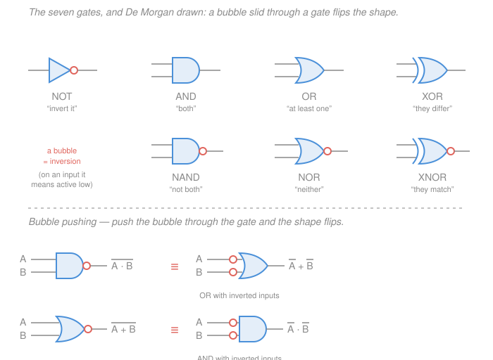

# Digital Logic Design · Lesson 1.3: Boolean algebra and logic gates

> ⏱ ~15 min · Module 1: Binary and Boolean algebra · Builds on: [1.2 Signed numbers and two's-complement arithmetic](01-02-signed-numbers-twos-complement.md), [`discrete-mathematics` 1.1](../../discrete-mathematics/lessons/01-01-propositional-logic-boolean-algebra.md) · Unlocks: 1.4 (truth tables and canonical forms), 2.1 (Karnaugh maps)

## Why this matters

Lessons [1.1](01-01-number-systems-and-bases.md) and [1.2](01-02-signed-numbers-twos-complement.md) gave you the nouns — bit patterns. This lesson gives you the **verbs**. A gate is a piece of silicon that computes one Boolean function of a few bits, and every circuit in this course is a pile of gates. But the same function can be built a dozen ways, and they cost wildly different amounts of silicon. Boolean algebra is the tool that turns "a circuit that works" into "the cheapest circuit that works" — and, just as often, the tool that proves your rewrite didn't secretly change the answer. Two Dangerous Checklist items live here: *simplify any Boolean expression*, and *prove two circuits equivalent*.

## The idea

**You have already learned this algebra.** In [`discrete-mathematics` 1.1](../../discrete-mathematics/lessons/01-01-propositional-logic-boolean-algebra.md) you worked with propositions, $\land$, $\lor$, $\lnot$, truth tables, and a table of laws — identity, domination, complement, distributive, absorption, De Morgan. Boolean algebra for hardware is *that structure, unchanged*. AND **is** $\land$. OR **is** $\lor$. NOT **is** $\lnot$. True is 1, false is 0. Every law you proved there is still a law here; nothing new needs proving from axioms, and this lesson will not re-derive them.

Two things do change. The first is **notation**: engineers borrowed arithmetic's symbols, writing $A \cdot B$ (or just $AB$) for AND, $A + B$ for OR, and an overbar $\overline{A}$ for NOT. A gift and a trap — a gift because $A(B+C) = AB + AC$ now looks familiar, a trap because $A + A = A$ and $1 + 1 = 1$ here, which is *not* how the binary addition of [1.1](01-01-number-systems-and-bases.md) behaves.

The second change is **purpose**, and it's the real point. In discrete math the question was *is this true?* Here the truth is handed to you: a specification, a truth table, a list of when the output must be 1. Rewriting the formula cannot change that. What rewriting buys is a **cheaper physical realization** — fewer transistors, fewer wires, less delay. You are no longer proving; you are shopping. Seeing one structure wearing two costumes is worth more than either alone: it means a De Morgan step and a bubble slid along a wire are literally the same move.

## The formal version

**Notation for this course.** Complement is written $\overline{A}$ (some books write $A'$; we will use the overbar throughout). AND is $A\cdot B$ or juxtaposition $AB$. OR is $A+B$. XOR is $A\oplus B$. A **literal** is a variable or its complement — $A$ and $\overline{A}$ are two literals. Where bit order matters, **$A$ is the most significant variable**.

### The gates

Seven symbols cover essentially all of combinational design. NOT takes one input:

| $A$ | $\overline{A}$ |
|:-:|:-:|
| 0 | 1 |
| 1 | 0 |

The rest take two (or more) — here is every two-input gate in one table:

| $A$ | $B$ | $A\cdot B$ (AND) | $A+B$ (OR) | $\overline{A\cdot B}$ (NAND) | $\overline{A+B}$ (NOR) | $A\oplus B$ (XOR) | $\overline{A\oplus B}$ (XNOR) |
|:-:|:-:|:-:|:-:|:-:|:-:|:-:|:-:|
| 0 | 0 | 0 | 0 | 1 | 1 | 0 | 1 |
| 0 | 1 | 0 | 1 | 1 | 0 | 1 | 0 |
| 1 | 0 | 0 | 1 | 1 | 0 | 1 | 0 |
| 1 | 1 | 1 | 1 | 0 | 0 | 0 | 1 |

Read each one in English and you never need to look the table up again:

- **AND** — "both."  **OR** — "at least one" (inclusive; both counts).  **NOT** — "invert."
- **NAND** — "**not** both." It is 0 in exactly one row.
- **NOR** — "**neither**." It is 1 in exactly one row.
- **XOR** — "the inputs **differ**." This is the one you'll use most after AND/OR: it is the sum bit of a binary addition, the "flip this bit" control, and the parity function.
- **XNOR** — "the inputs **match**." It is the 1-bit equality comparator, which is why [2.3](02-03-arithmetic-circuits.md) builds comparators out of it.

**Drawing conventions.** AND-family gates get the flat-backed **D-shape**; OR-family gates get the pointed **shield**; NOT gets a **triangle**. Inversion is *never* a shape — it is a small **bubble** on a lead. NAND is the AND D-shape with a bubble on its output; NOR is the OR shield with a bubble; XOR is the shield with an extra arc across its back; XNOR is XOR plus a bubble. A bubble on an **input** means that input is **active low**: the gate responds when that wire is 0, not 1. Active-low signals get an overbar in their name, e.g. an enable written $\overline{EN}$ is asserted by driving it to 0. (You'll meet real ones on the decoders of [2.4](02-04-decoders-encoders-multiplexers.md).)

### The laws

Each law comes as a **dual pair** — one form with $\cdot$, one with $+$. Learn one column and the other is free.

| Law | $\cdot$ (AND) form | $+$ (OR) form |
|---|---|---|
| Identity | $A\cdot 1 = A$ | $A + 0 = A$ |
| Null / dominance | $A\cdot 0 = 0$ | $A + 1 = 1$ |
| Idempotence | $A\cdot A = A$ | $A + A = A$ |
| Complement | $A\cdot\overline{A} = 0$ | $A + \overline{A} = 1$ |
| Involution | $\overline{\overline{A}} = A$ | (its own dual) |
| Commutative | $AB = BA$ | $A+B = B+A$ |
| Associative | $(AB)C = A(BC)$ | $(A+B)+C = A+(B+C)$ |
| Distributive | $A(B+C) = AB + AC$ | $A + BC = (A+B)(A+C)$ |
| Absorption | $A(A+B) = A$ | $A + AB = A$ |
| De Morgan | $\overline{A\cdot B} = \overline{A}+\overline{B}$ | $\overline{A+B} = \overline{A}\cdot\overline{B}$ |
| Consensus | $(A+B)(\overline{A}+C)(B+C) = (A+B)(\overline{A}+C)$ | $AB + \overline{A}C + BC = AB + \overline{A}C$ |

*In words for the two you'll actually reach for:* **absorption** says a term that already implies another is dead weight ($AB$ can only be 1 when $A$ is, so OR-ing it onto $A$ adds nothing). **Consensus** says the middle term $BC$ is redundant: if $B$ and $C$ are both 1, then either $A=1$ and $AB$ covers it, or $A=0$ and $\overline{A}C$ covers it — there is no case the consensus term catches by itself.

**The distributive law nobody believes.** $A(B+C) = AB+AC$ matches arithmetic, so it goes down easily. The OR form, $A + BC = (A+B)(A+C)$, has **no arithmetic analogue** — $2 + 3\cdot4 \ne (2+3)(2+4)$ — and this is the law students refuse. So verify it, all eight rows:

| $A$ | $B$ | $C$ | $BC$ | $A+BC$ | $A+B$ | $A+C$ | $(A+B)(A+C)$ |
|:-:|:-:|:-:|:-:|:-:|:-:|:-:|:-:|
| 0 | 0 | 0 | 0 | **0** | 0 | 0 | **0** |
| 0 | 0 | 1 | 0 | **0** | 0 | 1 | **0** |
| 0 | 1 | 0 | 0 | **0** | 1 | 0 | **0** |
| 0 | 1 | 1 | 1 | **1** | 1 | 1 | **1** |
| 1 | 0 | 0 | 0 | **1** | 1 | 1 | **1** |
| 1 | 0 | 1 | 0 | **1** | 1 | 1 | **1** |
| 1 | 1 | 0 | 0 | **1** | 1 | 1 | **1** |
| 1 | 1 | 1 | 1 | **1** | 1 | 1 | **1** |

The two bold columns read `00011111` and `00011111`. Identical, so the law holds. (Sanity check on the mechanism: when $A=1$ both sides are forced to 1 — the left by dominance, the right because both factors contain $A$. When $A=0$ both sides collapse to $BC$.)

### Duality

**Duality.** Take any true Boolean identity. Swap every $\cdot$ with $+$ and every $0$ with $1$, leaving the **variables untouched**. The result is also true. That is why the table above has two columns: they are the same fact twice. Check it on absorption — the dual of $A + AB = A$ swaps $+\leftrightarrow\cdot$ to give $A(A+B) = A$, the other entry in that row. It halves what you must memorize.

**Duality is not complementation** — this trips up nearly everyone. Complementing a *function* also complements its **variables**:

$$\text{dual of } (A + \overline{A}B) = A\,(\overline{A}+B), \qquad \overline{A + \overline{A}B} = \overline{A}\,(A + \overline{B}).$$

*In words: the dual swaps the operators only; the complement swaps the operators **and** flips every literal.* The dual of a true statement is a true statement; the complement of a function is a **different function**.

### De Morgan's laws

These are the workhorses. Both, proved by truth table:

$$\boxed{\;\overline{A+B} = \overline{A}\cdot\overline{B} \qquad\text{and}\qquad \overline{A\cdot B} = \overline{A}+\overline{B}\;}$$

| $A$ | $B$ | $A+B$ | $\overline{A+B}$ | $\overline{A}$ | $\overline{B}$ | $\overline{A}\cdot\overline{B}$ | $A\cdot B$ | $\overline{A\cdot B}$ | $\overline{A}+\overline{B}$ |
|:-:|:-:|:-:|:-:|:-:|:-:|:-:|:-:|:-:|:-:|
| 0 | 0 | 0 | **1** | 1 | 1 | **1** | 0 | **1** | **1** |
| 0 | 1 | 1 | **0** | 1 | 0 | **0** | 0 | **1** | **1** |
| 1 | 0 | 1 | **0** | 0 | 1 | **0** | 0 | **1** | **1** |
| 1 | 1 | 1 | **0** | 0 | 0 | **0** | 1 | **0** | **0** |

Reading top to bottom: the $\overline{A+B}$ and $\overline{A}\cdot\overline{B}$ columns both give `1000`, and the $\overline{A\cdot B}$ and $\overline{A}+\overline{B}$ columns both give `1110`. Every row agrees, so both laws hold. *In words: "not (either)" means "neither," and "not (both)" means "at least one is missing."*

**Bubble pushing** — the graphical form, and the version working engineers actually use. Since $\overline{A\cdot B} = \overline{A}+\overline{B}$, a **NAND** (D-shape, bubble on the output) is the *same gate* as an **OR shield with bubbles on both inputs**. Likewise $\overline{A+B} = \overline{A}\cdot\overline{B}$ makes a **NOR** identical to an **AND with bubbles on both inputs**. The rule to remember:

> **Push a bubble through a gate and the shape flips** — AND becomes OR, OR becomes AND — while a bubble appears on (or disappears from) every lead on the other side.

Two bubbles that meet on the same wire cancel (involution). That single move is how you convert a schematic to a cheaper gate family, how you match an active-low output to an active-low input without adding an inverter, and how you read a NAND-heavy datasheet as if it were AND-OR logic. The bottom half of the figure shows both symbol pairs side by side; keep it open while you practice.

### NAND and NOR are universal

Anything you can build with AND, OR, and NOT you can build with **NAND alone**. Three constructions, and all three follow from the laws above:

1. **NOT:** tie the inputs together. $\overline{A\cdot A} = \overline{A}$ by idempotence. (1 gate.)
2. **AND:** a NAND followed by that inverter. $\overline{\overline{A\cdot B}} = A\cdot B$ by involution. (2 gates.)
3. **OR:** invert both inputs, then NAND them. $\overline{\overline{A}\cdot\overline{B}} = \overline{\overline{A}} + \overline{\overline{B}} = A + B$ by De Morgan and involution. (3 gates: two inverters plus one NAND.)

NOR is universal too, by the dual argument: $\overline{A+A}=\overline{A}$, a NOR plus an inverter gives OR, and $\overline{\overline{A}+\overline{B}} = A\cdot B$ gives AND.

Why care? Because **CMOS builds inverting gates naturally**. A static CMOS gate's pull-up network is PMOS, which can only pull *up* when its gate is low, so every simple CMOS gate inverts — a NAND is four transistors, while an AND is a NAND *plus* an inverter, six. Real chips are therefore mostly NAND and NOR, and a design expressed in AND-OR-NOT gets mechanically bubble-pushed into NAND form before it is fabricated. The transistor-level story is [`electronics` 4.3](../../electronics/lessons/04-03-cmos-inverter-gates.md); take the costing fact from there and don't re-derive it here. Lesson [1.4](01-04-truth-tables-canonical-forms.md) formalizes what "universal" means — a *functionally complete* set — and shows that every function has a canonical form built from just AND, OR, and NOT, which is what makes the NAND construction sufficient.

## Picture



## Worked examples

**Example 1 (mechanical — simplify, naming every law).** Reduce

$$F = A\overline{B} + AB + \overline{A}BC + \overline{A}B\overline{C}.$$

Work in pairs that share a factor.

| Step | Result | Law used |
|---|---|---|
| 0 | $A\overline{B} + AB + \overline{A}BC + \overline{A}B\overline{C}$ | (given) |
| 1 | $A(\overline{B} + B) + \overline{A}B(C + \overline{C})$ | distributive ($\cdot$ form), factoring |
| 2 | $A\cdot 1 + \overline{A}B\cdot 1$ | complement |
| 3 | $A + \overline{A}B$ | identity |
| 4 | $(A + \overline{A})(A + B)$ | distributive (**$+$ form**) |
| 5 | $1\cdot(A+B)$ | complement |
| 6 | $\boxed{A + B}$ | identity |

Four product terms and ten literals became one two-input OR gate. Note step 4: that's the law nobody believes, earning its keep. (Shortcut worth memorizing: $A + \overline{A}B = A + B$, and dually $A(\overline{A}+B) = AB$.)

**Now verify — and this is the standing method for proving any two circuits equivalent: build both truth tables and compare rows.** Algebra can be misapplied; a matching column cannot lie.

| $A$ | $B$ | $C$ | $A\overline{B}$ | $AB$ | $\overline{A}BC$ | $\overline{A}B\overline{C}$ | $F$ | $A+B$ |
|:-:|:-:|:-:|:-:|:-:|:-:|:-:|:-:|:-:|
| 0 | 0 | 0 | 0 | 0 | 0 | 0 | **0** | **0** |
| 0 | 0 | 1 | 0 | 0 | 0 | 0 | **0** | **0** |
| 0 | 1 | 0 | 0 | 0 | 0 | 1 | **1** | **1** |
| 0 | 1 | 1 | 0 | 0 | 1 | 0 | **1** | **1** |
| 1 | 0 | 0 | 1 | 0 | 0 | 0 | **1** | **1** |
| 1 | 0 | 1 | 1 | 0 | 0 | 0 | **1** | **1** |
| 1 | 1 | 0 | 0 | 1 | 0 | 0 | **1** | **1** |
| 1 | 1 | 1 | 0 | 1 | 0 | 0 | **1** | **1** |

Both bold columns read `00111111`. Equivalent — and notice $C$ never affects the output, which the algebra told us when it cancelled.

**Example 2 (why you'd care — the all-NAND conversion, and what it costs).** You have designed $F = AB + CD$: two AND gates feeding an OR. That is the standard **two-level sum-of-products (SOP)** shape — AND gates on the bottom, one OR on top — and it's the shape [2.1](02-01-karnaugh-maps.md)'s Karnaugh maps are built to produce. But a fab would rather you hand it NANDs. Push bubbles:

$$AB + CD = \overline{\overline{AB + CD}} = \overline{\;\overline{AB}\cdot\overline{CD}\;}$$

using involution, then De Morgan on the inner complement. Read the right-hand side as a circuit: $\overline{AB}$ is a NAND, $\overline{CD}$ is a NAND, and the outer complement-of-a-product is a **third NAND**. So *any* two-level AND-OR network becomes the identical network with every gate replaced by a NAND — the added output bubbles and input bubbles cancel in pairs. Same shape, same depth, no inverters added.

**Cost, briefly.** How do we say one circuit is "cheaper"? Two crude but standard measures: the **literal count** (how many variable-appearances the expression has, which approximates transistor count and wiring) and the **gate count** (with gate *inputs* as a tiebreaker, since a 4-input gate costs more silicon than a 2-input one). Example 1 went from 10 literals and 5 gates to 2 literals and 1 gate — an enormous win, found by hand, by luck, and by pattern-spotting. That is not a method. Module 2 opens with [Karnaugh maps](02-01-karnaugh-maps.md), which find the minimal two-level form *systematically* instead of hoping you notice the right factoring.

## Watch out

- **You might think $\overline{A+B} = \overline{A}+\overline{B}$** — that the bar just distributes over everything like a minus sign. It does not: De Morgan *flips the operator* as the bar passes through. Counterexample in one row: at $A=1, B=0$, $\overline{A+B} = \overline{1} = 0$ but $\overline{A}+\overline{B} = 0+1 = 1$. Different. The bar over a whole expression is not the bar over its pieces.
- **You might confuse duality with complementation.** The dual of $A+AB=A$ is $A(A+B)=A$ — operators swapped, literals *untouched*, and it's still a true identity. The complement of the function $A+AB$ is $\overline{A}(\overline{A}+\overline{B})$ — operators swapped **and** every literal flipped — and it's a different function entirely (it equals $\overline{A}$, not $A$). Duality is a memory aid about laws; complementation is an operation on functions.
- **You might import arithmetic where it doesn't belong.** In Boolean algebra $A + A = A$ and $1 + 1 = 1$ — no carry, because $+$ means OR. That collides head-on with [1.1](01-01-number-systems-and-bases.md), where `1 + 1 = 10`; the symbol is simply overloaded. (The bridge is XOR: binary addition's *sum* bit is $A\oplus B$ and its *carry* bit is $AB$ — the half adder of [2.3](02-03-arithmetic-circuits.md).) There is also no subtraction and no division here, so you may never "cancel" a term from both sides.

## One-liner

> Boolean algebra is the propositional logic you already know, wearing $\cdot$, $+$, and an overbar, and pressed into a new job: not deciding what's true, but finding the cheapest gates that compute it — with De Morgan, drawn as a bubble sliding through a gate, as the move you'll make most.

## Problems

**P1 (🟢)** Simplify $F = \overline{A}\,\overline{B} + \overline{A}B + A\overline{B}$ to a minimal form, naming the law used at each step. Which single gate realizes it?

**P2 (🟡)** Prove or disprove, by building both truth tables and comparing rows: $\;\overline{A}B + A\overline{B} \;=\; (A+B)\cdot\overline{AB}$.

**P3 (🔴)** A network of four NAND gates is wired as follows. $X_1 = \overline{AB}$; then $X_2 = \overline{A\,X_1}$ and $X_3 = \overline{B\,X_1}$; finally $Y = \overline{X_2 X_3}$. Using De Morgan and the laws, show algebraically that $Y = A \oplus B$.

<details>
<summary>Solutions</summary>

**P1** Factor the two terms sharing $\overline{A}$:

| Step | Result | Law |
|---|---|---|
| 0 | $\overline{A}\,\overline{B} + \overline{A}B + A\overline{B}$ | (given) |
| 1 | $\overline{A}(\overline{B} + B) + A\overline{B}$ | distributive (factoring) |
| 2 | $\overline{A}\cdot 1 + A\overline{B}$ | complement |
| 3 | $\overline{A} + A\overline{B}$ | identity |
| 4 | $(\overline{A} + A)(\overline{A} + \overline{B})$ | distributive ($+$ form) |
| 5 | $1\cdot(\overline{A}+\overline{B})$ | complement |
| 6 | $\overline{A}+\overline{B} = \overline{AB}$ | identity, then De Morgan |

So $F = \overline{AB}$: **a single NAND gate**.

*Check (both tables, all four rows).* Original: $A=0,B=0 \Rightarrow \overline{A}\overline{B}=1 \Rightarrow F=1$. $A=0,B=1 \Rightarrow \overline{A}B=1 \Rightarrow F=1$. $A=1,B=0 \Rightarrow A\overline{B}=1 \Rightarrow F=1$. $A=1,B=1 \Rightarrow$ all three terms 0 $\Rightarrow F=0$. Column: `1110`. NAND's column from the gate table is also `1110`. ✓ Sanity: the expression listed every input combination *except* $AB$, so "not both" was the answer all along.

**P2** They are **equal** (both are XOR). Build the columns:

| $A$ | $B$ | $\overline{A}B$ | $A\overline{B}$ | $\overline{A}B + A\overline{B}$ | $A+B$ | $AB$ | $\overline{AB}$ | $(A+B)\overline{AB}$ |
|:-:|:-:|:-:|:-:|:-:|:-:|:-:|:-:|:-:|
| 0 | 0 | 0 | 0 | **0** | 0 | 0 | 1 | **0** |
| 0 | 1 | 1 | 0 | **1** | 1 | 0 | 1 | **1** |
| 1 | 0 | 0 | 1 | **1** | 1 | 0 | 1 | **1** |
| 1 | 1 | 0 | 0 | **0** | 1 | 1 | 0 | **0** |

Both bold columns read `0110`, matching in every row, so the expressions are equivalent. $\blacksquare$

Both are $A\oplus B$, and the two forms are the two English readings of XOR: the left is "*$A$ without $B$, or $B$ without $A$*" (the inputs differ); the right is "*at least one, but not both*." Worth keeping — the right-hand form is how you build an XOR from an OR, an AND, and an inverter.

**P3** Substitute inward, letting $N = X_1 = \overline{AB} = \overline{A}+\overline{B}$ (De Morgan).

$$Y = \overline{X_2 X_3} = \overline{X_2} + \overline{X_3} \quad\text{(De Morgan)}.$$

Now $\overline{X_2} = \overline{\overline{A N}} = AN$ and $\overline{X_3} = \overline{\overline{BN}} = BN$ (involution), so

$$Y = AN + BN = A(\overline{A}+\overline{B}) + B(\overline{A}+\overline{B}).$$

Distribute:

$$Y = A\overline{A} + A\overline{B} + \overline{A}B + B\overline{B} = 0 + A\overline{B} + \overline{A}B + 0 = A\overline{B} + \overline{A}B = A\oplus B,$$

using the complement law twice and then identity. $\blacksquare$

*Check (trace all four rows through the gates).*

| $A$ | $B$ | $X_1=\overline{AB}$ | $X_2=\overline{AX_1}$ | $X_3=\overline{BX_1}$ | $Y=\overline{X_2X_3}$ |
|:-:|:-:|:-:|:-:|:-:|:-:|
| 0 | 0 | 1 | $\overline{0\cdot1}=1$ | $\overline{0\cdot1}=1$ | $\overline{1\cdot1}=$ **0** |
| 0 | 1 | 1 | $\overline{0\cdot1}=1$ | $\overline{1\cdot1}=0$ | $\overline{1\cdot0}=$ **1** |
| 1 | 0 | 1 | $\overline{1\cdot1}=0$ | $\overline{0\cdot1}=1$ | $\overline{0\cdot1}=$ **1** |
| 1 | 1 | 0 | $\overline{1\cdot0}=1$ | $\overline{1\cdot0}=1$ | $\overline{1\cdot1}=$ **0** |

Output column `0110` = XOR. ✓ This is the standard 4-NAND XOR you'll find in real cell libraries — and a concrete payoff of NAND universality.

</details>

## Flashback

**From Lesson 1.2 (Signed numbers and two's-complement arithmetic):** Working in **8-bit two's complement**, compute $92 + 51$. Give the resulting 8-bit pattern, its value read as a signed number, the carry out of the most significant bit, and whether overflow occurred — with the reason.

<details>
<summary>Solution</summary>

Convert both operands. $92 = 64+16+8+4$, so `01011100`. $51 = 32+16+2+1$, so `00110011`. Both are positive, so no negation step is needed.

```
   01011100    (92)
 + 00110011    (51)
 -----------
   10001111
```

Column by column from the right: $0{+}1=1$; $0{+}1=1$; $1{+}0=1$; $1{+}0=1$; $1{+}1=0$ carry 1; $0{+}1{+}1=0$ carry 1; $1{+}0{+}1=0$ carry 1; $0{+}0{+}1=1$, no carry out.

- **Pattern:** `10001111`.
- **Signed value:** the sign bit is 1, so the value is negative: $143 - 256 = -113$. (Or invert-and-add-1: `01110000` + 1 = `01110001` = 113, so the pattern is $-113$.)
- **Carry out of the MSB:** **0**.
- **Overflow:** **yes**. Adding two positives produced a negative, which is impossible if the answer were representable — the true sum 143 exceeds the 8-bit signed maximum 127.

*Check.* This row is the reason **carry and overflow are different flags**: here carry-out is 0 while overflow is 1. The reliable rules are (i) signs of the operands agree but disagree with the result's sign, or equivalently (ii) the carry *into* the sign bit ($1$ here) differs from the carry *out* of it ($0$ here) — their XOR is the overflow flag, which is literally an XOR gate in [2.5](02-05-building-a-simple-alu.md)'s ALU. ✓

</details>

## Connections

- **Backward:** this is [`discrete-mathematics` 1.1](../../discrete-mathematics/lessons/01-01-propositional-logic-boolean-algebra.md) with new clothes — $\land,\lor,\lnot$ relabelled $\cdot,+,\overline{\phantom{A}}$, and the same law table, including the De Morgan pair proved there. The bit patterns being combined are the ones from [1.1](01-01-number-systems-and-bases.md), and the invert-and-add-1 negation of [1.2](01-02-signed-numbers-twos-complement.md) is a row of NOT gates plus an adder.
- **Forward:** [1.4](01-04-truth-tables-canonical-forms.md) turns any truth table into a canonical sum-of-minterms or product-of-maxterms and formalizes NAND/NOR **functional completeness**; [2.1](02-01-karnaugh-maps.md) replaces this lesson's ad-hoc factoring with a systematic minimizer; [2.3](02-03-arithmetic-circuits.md) builds the half adder from exactly one XOR (sum) and one AND (carry). Bubble pushing recurs every time an active-low enable meets an active-low input in [2.4](02-04-decoders-encoders-multiplexers.md).
- **Sideways (devices):** [`electronics` 4.3](../../electronics/lessons/04-03-cmos-inverter-gates.md) explains *why* NAND and NOR are the physical primitives — a static CMOS gate's PMOS pull-up network forces inversion — so this lesson's universality result is not a curiosity but the reason synthesis tools output NAND-heavy netlists. The AND-OR two-level shape here is also the AND-plane/OR-plane structure of the programmable logic in [4.3](04-03-memory-and-programmable-logic.md).
