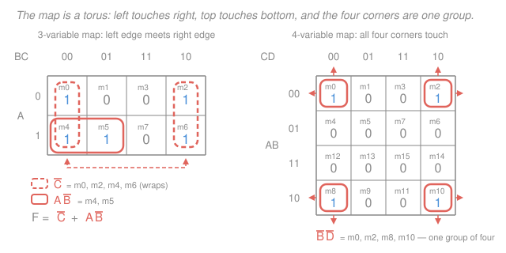

# Digital Logic Design · Lesson 2.1: Karnaugh maps

> ⏱ ~15 min · Module 2: Combinational logic design · Builds on: [1.3 Boolean algebra and logic gates](01-03-boolean-algebra-logic-gates.md), [1.4 Truth tables and canonical forms](01-04-truth-tables-canonical-forms.md) · Unlocks: [2.2 Don't-cares, POS maps, and Quine–McCluskey](02-02-dont-cares-pos-quine-mccluskey.md)

## Why this matters

[Lesson 1.4](01-04-truth-tables-canonical-forms.md) gave you a machine for turning any truth table into a *correct* circuit: OR together one AND gate per row where the function is 1. Correct, but ruinous. A 4-variable function that is 1 on ten rows becomes ten 4-input AND gates feeding a 10-input OR — roughly 100 transistors of nothing, when three 2-input ANDs and one 3-input OR would do the same job. Gates cost area, power, and delay (see [`electronics` 4.3](../../electronics/lessons/04-03-cmos-inverter-gates.md) for what one gate actually costs in silicon), so "cheapest correct circuit" is the real design target.

You can get there with Boolean algebra, but only if you *spot* the simplifying moves. The Karnaugh map removes the spotting: it redraws the truth table so that every legal simplification is a rectangle you can see.

## The idea

There is really only one algebraic move behind all of two-level minimization:

$$AB + A\overline{B} = A(B + \overline{B}) = A\cdot 1 = A.$$

*In words: two product terms that agree on everything except one variable, where they disagree, merge into one term with that variable deleted.* (Notation reminder from [1.3](01-03-boolean-algebra-logic-gates.md): $\overline{A}$ is NOT $A$ — some books write $A'$ — juxtaposition $AB$ is AND, and $+$ is OR.)

A truth table hides this move. Rows `010` and `011` differ in exactly one bit, but so do rows `001` and `011`, which sit two apart, and rows `011` and `111`, which sit four apart. The pairs you can merge are scattered.

A **Karnaugh map** is the same truth table, redrawn on a grid where *physically touching cells differ in exactly one variable*. Now the algebraic move becomes a geometric one: two adjacent 1s that you can draw a loop around are a pair you can merge. Circle four in a rectangle and you delete two variables. The whole method is: draw the map, circle the biggest rectangles of 1s you can, read off the surviving variables.

## The formal version

### Gray-code ordering is the whole trick

The row and column labels run

$$\texttt{00},\ \texttt{01},\ \texttt{11},\ \texttt{10}$$

— **not** `00, 01, 10, 11`. This is a 2-bit **Gray code**: each label differs from its neighbour in exactly one bit, and the sequence closes the loop (`10` back to `00` also differs in one bit). *In words: the ordering is chosen so that stepping one cell sideways flips exactly one variable* — which is precisely the condition the merge rule needs. Ordinary binary order fails: `01` to `10` flips two bits, so those cells are **not** mergeable, and circling them gives a wrong answer.

The same property is why Gray codes are used in rotary and linear position encoders: if only one bit changes per step, a read taken mid-transition is off by at most one position instead of jumping to a garbage value.

### The cell layouts

Throughout this course **$A$ is the most significant variable**, so the minterm index $i$ of a cell is just the binary number $ABC$ (3 variables) or $ABCD$ (4 variables) read with $A$ as the high bit. Check your own maps against these:

Three variables, rows labelled by $A$ and columns by $BC$:

| $A$ / $BC$ | `00` | `01` | `11` | `10` |
|---|---|---|---|---|
| `0` | $m_0$ | $m_1$ | $m_3$ | $m_2$ |
| `1` | $m_4$ | $m_5$ | $m_7$ | $m_6$ |

Four variables, rows labelled by $AB$ and columns by $CD$:

| $AB$ / $CD$ | `00` | `01` | `11` | `10` |
|---|---|---|---|---|
| `00` | $m_0$ | $m_1$ | $m_3$ | $m_2$ |
| `01` | $m_4$ | $m_5$ | $m_7$ | $m_6$ |
| `11` | $m_{12}$ | $m_{13}$ | $m_{15}$ | $m_{14}$ |
| `10` | $m_8$ | $m_9$ | $m_{11}$ | $m_{10}$ |

To fill a map from $F = \Sigma m(\ldots)$, write `1` in every listed cell and `0` everywhere else. Note the indices are *not* in reading order — $m_3$ sits before $m_2$ — which is exactly the Gray-code ordering doing its job.

### Grouping rules (the checklist)

For a minimal **sum of products** you group the 1s:

1. **Group only 1s**, never 0s. Every group is a rectangle whose side lengths are powers of two, so the group size is $1, 2, 4, 8$, or $16$.
2. **Bigger is better.** A group of $2^k$ cells eliminates $k$ variables, leaving $n - k$ literals in its term. Always enlarge a group as far as it will legally go.
3. **Groups may overlap**, and they must: the only requirement is that **every 1 is covered at least once**. Covering a 1 twice costs nothing (it is just $X + X = X$).
4. **The map wraps.** The left edge is adjacent to the right edge, the top edge to the bottom edge. On a 4-variable map this means the **four corner cells are mutually adjacent** and form a legal group of four. This is the rule people forget; the second panel of the figure below shows it.

### Reading a group's term

> **Rule.** For a group, keep every variable that is **constant** across all its cells (uncomplemented if it is constant at 1, complemented if constant at 0), and **drop** every variable that changes.

*In words: the group's term names exactly the conditions all its cells share.* For instance, on the 4-variable map the four cells $m_{10}, m_{11}, m_{14}, m_{15}$ have $A = 1$ and $C = 1$ in every one of them, while $B$ and $D$ each take both values — so the term is $AC$. Two of the four variables were eliminated, matching rule 2 with $k = 2$.

### Implicants, prime implicants, essential prime implicants

- An **implicant** of $F$ is any product term that is 1 only where $F$ is 1 — on the map, any legal group of 1s.
- A **prime implicant (PI)** is an implicant that **cannot be enlarged**: no legal doubling of the group exists. *In words: a loop you cannot grow.*
- A prime implicant is **essential** if it covers at least one 1 that **no other prime implicant covers**. That lone 1 is its *distinguishing* cell. *In words: without this loop, that 1 has no legal home, so any minimal answer must include it.*

**The systematic procedure.**

1. Circle **all** prime implicants (grow every group until it cannot grow).
2. Take every **essential** PI — find them by scanning for 1s that only one loop touches.
3. If 1s remain uncovered, cover them with the **fewest** remaining PIs.
4. OR the chosen terms together.

Step 3 is where choice enters, and the minimum is often **not unique**: two different sets of loops can tie. A tied answer is just as correct — grade yourself on the term count and literal count, not on matching someone else's letters.

## Picture

## Worked examples

**Example 1 (mechanical — a 3-variable map with a wrap).** Minimize $F(A,B,C) = \Sigma m(0,2,4,5,6)$.

Fill the map (left panel of the figure above): 1s at $m_0, m_2$ in the top row and $m_4, m_5, m_6$ in the bottom row.

- The **leftmost column** ($BC = $ `00`, cells $m_0, m_4$) and the **rightmost column** ($BC = $ `10`, cells $m_2, m_6$) are edge-adjacent, so together they form a legal group of four: $\{m_0, m_2, m_4, m_6\}$. Across it, $A$ changes, $B$ changes, and $C$ is `0` throughout. Term: $\overline{C}$. It cannot grow (a group of eight would need all 1s), so it is prime.
- That leaves $m_5$ uncovered. Its only 1-valued neighbour is $m_4$, giving the pair $\{m_4, m_5\}$: $A = 1$ and $B = 0$ throughout, $C$ changes. Term: $A\overline{B}$. It cannot grow either — doubling it to $\{m_4,m_5,m_6,m_7\}$ needs $m_7 = 1$, and doubling to $\{m_0,m_1,m_4,m_5\}$ needs $m_1 = 1$. Prime.

Both are essential ($m_0$ is touched only by $\overline{C}$, $m_5$ only by $A\overline{B}$), so

$$\boxed{F = \overline{C} + A\overline{B}}$$

*Verification by re-expansion.* $\overline{C}$ means $C = 0$ with $A, B$ free: $\{m_0, m_2, m_4, m_6\}$. $A\overline{B}$ means $A=1, B=0$ with $C$ free: $\{m_4, m_5\}$. Union $= \{0,2,4,5,6\}$, exactly the original list. ✓

**Example 2 (the boss problem — [2(a)](../syllabus.md)).** Minimize $F(A,B,C,D) = \Sigma m(0,1,2,3,4,5,10,11,14,15)$, with $A$ most significant.

Plotting the ten minterms into the 4-variable layout above gives:

| $AB$ / $CD$ | `00` | `01` | `11` | `10` |
|---|---|---|---|---|
| `00` | 1 | 1 | 1 | 1 |
| `01` | 1 | 1 | 0 | 0 |
| `11` | 0 | 0 | 1 | 1 |
| `10` | 0 | 0 | 1 | 1 |

(Read off: row `00` holds $m_0,m_1,m_3,m_2$ — all four listed. Row `01` holds $m_4,m_5,m_7,m_6$ — only $m_4,m_5$ listed. Row `11` holds $m_{12},m_{13},m_{15},m_{14}$ — only $m_{15},m_{14}$. Row `10` holds $m_8,m_9,m_{11},m_{10}$ — only $m_{11},m_{10}$.)

Now hunt for prime implicants. No single-literal group of eight works: $\overline{A}$ would need $m_6, m_7$; $C$ would need $m_6, m_7$; $\overline{B}$ would need $m_8, m_9$; and so on for every one of the eight. So the biggest loops are groups of four, and there are exactly four of them:

| Prime implicant | Cells | Where it sits |
|---|---|---|
| $\overline{A}\,\overline{C}$ | $m_0, m_1, m_4, m_5$ | top-left 2×2 block |
| $\overline{A}\,\overline{B}$ | $m_0, m_1, m_3, m_2$ | the whole top row |
| $\overline{B}C$ | $m_2, m_3, m_{10}, m_{11}$ | right half of top row **plus** right half of bottom row — a top-to-bottom wrap |
| $AC$ | $m_{10}, m_{11}, m_{14}, m_{15}$ | bottom-right 2×2 block |

Essential ones: $m_4$ and $m_5$ are touched only by $\overline{A}\,\overline{C}$, and $m_{14}$ and $m_{15}$ only by $AC$ — both essential. Taking them covers $\{0,1,4,5,10,11,14,15\}$, leaving $m_2$ and $m_3$ uncovered. Both are covered by $\overline{B}C$ and both by $\overline{A}\,\overline{B}$, so **either one finishes the job** in three terms:

$$\boxed{F = \overline{A}\,\overline{C} + \overline{B}C + AC} \qquad\text{or, equally minimal,}\qquad F = \overline{A}\,\overline{C} + \overline{A}\,\overline{B} + AC.$$

Three product terms, six literals, either way. This is the non-uniqueness from step 3, live.

*Verification by re-expansion* — the standing way to be sure a K-map answer is right. Expand each term back into minterms by letting the dropped variables run free:

- $\overline{A}\,\overline{C}$: $A=0, C=0$, with $B,D$ free → `0000`, `0001`, `0100`, `0101` $= \{0, 1, 4, 5\}$.
- $\overline{B}C$: $B=0, C=1$, with $A,D$ free → `0010`, `0011`, `1010`, `1011` $= \{2, 3, 10, 11\}$.
- $AC$: $A=1, C=1$, with $B,D$ free → `1010`, `1011`, `1110`, `1111` $= \{10, 11, 14, 15\}$.

Union: $\{0,1,2,3,4,5,10,11,14,15\}$ — exactly the ten given minterms, with nothing extra. ✓ (The alternative form checks too: $\{0,1,4,5\} \cup \{0,1,2,3\} \cup \{10,11,14,15\}$ is the same set.) Do this check every time; it catches a mis-plotted cell or an illegal loop instantly, and it is the only part of the method that cannot lie to you.

### Why stop at four or five variables

The adjacency that makes all of this work is a property of the *drawing*. Four variables fit a 4×4 grid where "one variable apart" and "touching" coincide. Five fit as two stacked 4-variable maps, where cells in the same position on the two layers count as adjacent — workable, but you are now tracking adjacency you cannot see. At six and beyond the picture stops helping entirely.

The escape is [2.2](02-02-dont-cares-pos-quine-mccluskey.md), which redoes exactly this procedure as a table (Quine–McCluskey) that needs no geometry and scales to any $n$ — and also adds don't-cares and POS grouping. Real tools go further still: synthesis software minimizes with heuristic algorithms (Espresso is the classic) because exact minimization is combinatorially brutal for realistic functions.

## Watch out

- **You might write the labels `00, 01, 10, 11`.** Then the second and third columns differ in *two* bits, adjacency is broken, and every loop you draw afterwards is meaningless — while still *looking* right. Gray order `00, 01, 11, 10` is not a style choice; it is the reason the method works. Write the labels first, before any 1s.
- **You might treat the map as a flat rectangle.** It is a torus. The four corners of a 4-variable map are one legal group; so is the leftmost column plus the rightmost column, or the top row plus the bottom row. Missing a wrap does not give a wrong answer, just a needlessly expensive one — which is the whole thing you were trying to avoid.
- **You might grab the biggest loop first and call it done.** Greedy loop-grabbing can miss the minimum. Take the *essential* PIs first (the ones with a 1 that nothing else reaches), then mop up. And do not assume your answer is wrong just because it differs from a printed one — check the term and literal counts, since ties are common.
- **You might trust a loop you did not verify.** Re-expand your SOP into minterms and compare sets. Extra minterms mean an illegal group; missing minterms mean an uncovered 1.

## One-liner

> A K-map is a truth table redrawn in Gray-code order so that $AB + A\overline{B} = A$ becomes "circle two touching cells" — then the minimal SOP is just the cheapest set of loops that covers every 1.

## Problems

**P1 (🟢)** Minimize $F(A,B,C) = \Sigma m(0,1,2,3,6)$ on a 3-variable map. Verify by re-expansion.

**P2 (🟡)** Minimize $F(A,B,C,D) = \Sigma m(0,2,5,7,8,10,13,15)$. You will need the four-corners rule. Verify by re-expansion, and say what familiar 2-input gate this function is.

**P3 (🔴)** For $F(A,B,C,D) = \Sigma m(0,1,4,5,6,7,8,9,14,15)$: list all prime implicants, identify which are essential, and give a minimal SOP. Is the minimum unique?

Solutions

**P1** Map (rows $A$, columns $BC$ in Gray order `00, 01, 11, 10`; cells $m_0,m_1,m_3,m_2$ / $m_4,m_5,m_7,m_6$):

| $A$ / $BC$ | `00` | `01` | `11` | `10` |
|---|---|---|---|---|
| `0` | 1 | 1 | 1 | 1 |
| `1` | 0 | 0 | 0 | 1 |

The entire top row is a group of four: $A = 0$ throughout, $B$ and $C$ both change, so the term is $\overline{A}$. It cannot grow to all eight cells (three 0s in the bottom row), so it is prime, and it is essential ($m_1$ and $m_3$ touch nothing else).

$m_6$ is left over. Its neighbours are $m_2$ (a 1, directly above), $m_7$ (a 0), and $m_4$ (a 0, via the left–right wrap). So the only pair is $\{m_2, m_6\}$: $B = 1$ and $C = 0$ throughout, $A$ changes → term $B\overline{C}$. It cannot grow ($\{m_2,m_3,m_6,m_7\}$ needs $m_7$; $\{m_0,m_2,m_4,m_6\}$ needs $m_4$), so it is prime and essential.

$$F = \overline{A} + B\overline{C}.$$

*Verification.* $\overline{A}$: $A=0$, $B,C$ free → $\{0,1,2,3\}$. $B\overline{C}$: $B=1,C=0$, $A$ free → `010`, `110` $= \{2, 6\}$. Union $=\{0,1,2,3,6\}$ ✓ — exactly the given list.

**P2** Map (rows $AB$, columns $CD$):

| $AB$ / $CD$ | `00` | `01` | `11` | `10` |
|---|---|---|---|---|
| `00` | 1 | 0 | 0 | 1 |
| `01` | 0 | 1 | 1 | 0 |
| `11` | 0 | 1 | 1 | 0 |
| `10` | 1 | 0 | 0 | 1 |

Two groups of four, and nothing bigger exists:

- **The four corners** $\{m_0, m_2, m_8, m_{10}\}$. All four have $B = 0$ and $D = 0$; $A$ and $C$ both change. Term: $\overline{B}\,\overline{D}$. It cannot grow — extending to $\overline{B}$ would need $m_1$, to $\overline{D}$ would need $m_4$.
- **The centre 2×2 block** $\{m_5, m_7, m_{13}, m_{15}\}$ (rows `01`,`11` × columns `01`,`11`). All four have $B = 1$ and $D = 1$. Term: $BD$. Cannot grow ($B$ would need $m_4$; $D$ would need $m_1$).

Every remaining cell is 0, and each of the eight 1s sits in exactly one of these loops, so both are prime and both essential:

$$F = \overline{B}\,\overline{D} + BD.$$

*Verification.* $\overline{B}\,\overline{D}$: $B=0,D=0$, $A,C$ free → `0000`, `0010`, `1000`, `1010` $=\{0,2,8,10\}$. $BD$: $B=1,D=1$, $A,C$ free → `0101`, `0111`, `1101`, `1111` $=\{5,7,13,15\}$. Union $=\{0,2,5,7,8,10,13,15\}$ ✓.

This is "$B$ and $D$ agree" — the **XNOR** of $B$ and $D$, i.e. $F = \overline{B \oplus D}$, with $A$ and $C$ irrelevant.

**P3** Map:

| $AB$ / $CD$ | `00` | `01` | `11` | `10` |
|---|---|---|---|---|
| `00` | 1 | 1 | 0 | 0 |
| `01` | 1 | 1 | 1 | 1 |
| `11` | 0 | 0 | 1 | 1 |
| `10` | 1 | 1 | 0 | 0 |

No group of eight exists (e.g. $\overline{C}$ would need $m_{12}, m_{13}$; $B$ would need $m_{12}, m_{13}$). The groups of four, all prime:

| PI | Cells |
|---|---|
| $\overline{A}\,\overline{C}$ | $m_0, m_1, m_4, m_5$ |
| $\overline{A}B$ | $m_4, m_5, m_7, m_6$ (the whole `01` row) |
| $\overline{B}\,\overline{C}$ | $m_0, m_1, m_8, m_9$ (top row's left half **wrapped** to the bottom row's left half) |
| $BC$ | $m_6, m_7, m_{14}, m_{15}$ |

**Essential:** $m_8$ and $m_9$ are covered only by $\overline{B}\,\overline{C}$, and $m_{14}$ and $m_{15}$ only by $BC$. So $\overline{B}\,\overline{C}$ and $BC$ are essential. ($\overline{A}\,\overline{C}$ and $\overline{A}B$ are not: each of their cells is reachable another way.)

Those two cover $\{0,1,8,9\} \cup \{6,7,14,15\}$, leaving $m_4$ and $m_5$. Both lie in $\overline{A}\,\overline{C}$ and both lie in $\overline{A}B$, so one more term suffices — either one:

$$F = \overline{B}\,\overline{C} + BC + \overline{A}\,\overline{C} \qquad\text{or}\qquad F = \overline{B}\,\overline{C} + BC + \overline{A}B.$$

**The minimum is not unique** — two distinct 3-term, 6-literal answers tie.

*Verification (first form).* $\overline{B}\,\overline{C} = \{0,1,8,9\}$; $BC = \{6,7,14,15\}$; $\overline{A}\,\overline{C} = \{0,1,4,5\}$. Union $=\{0,1,4,5,6,7,8,9,14,15\}$ ✓. *(Second form:* $\overline{A}B = \{4,5,6,7\}$, union $=\{0,1,4,5,6,7,8,9,14,15\}$ ✓.)

Aside: $\overline{B}\,\overline{C} + BC$ is again an XNOR, here of $B$ and $C$.

## Flashback

**From Lesson 1.4 (Truth tables and canonical forms):** A function is given in canonical product-of-maxterms form as $G(A,B,C) = \Pi M(1,4,6)$, with $A$ most significant. (a) Rewrite it in $\Sigma m$ form. (b) Write out its canonical sum-of-products expression.

Solution

**(a)** $\Pi M(\ldots)$ lists the rows where $G = 0$; every *other* row has $G = 1$. With three variables the row indices are $0$ through $7$, so removing $\{1,4,6\}$ leaves

$$G(A,B,C) = \Sigma m(0,2,3,5,7).$$

(Five 1-rows plus three 0-rows is eight rows total ✓ — the minterm and maxterm index sets always partition $\{0,\ldots,2^n-1\}$.)

**(b)** Minterm $m_i$ is the AND of all three variables, each complemented where that bit of $i$ is `0`:

| $i$ | $ABC$ | $m_i$ |
|---|---|---|
| 0 | `000` | $\overline{A}\,\overline{B}\,\overline{C}$ |
| 2 | `010` | $\overline{A}B\overline{C}$ |
| 3 | `011` | $\overline{A}BC$ |
| 5 | `101` | $A\overline{B}C$ |
| 7 | `111` | $ABC$ |

$$G = \overline{A}\,\overline{B}\,\overline{C} + \overline{A}B\overline{C} + \overline{A}BC + A\overline{B}C + ABC.$$

*Check.* Evaluate at $A B C = $ `100` (row 4, which should be 0): every term contains either $\overline{A}$ (false here) or the pattern $\overline{B}C$/$BC$ (both false, since $B = C = 0$), so $G = 0$ ✓. At `011` (row 3) the third term $\overline{A}BC = 1\cdot1\cdot1 = 1$, so $G = 1$ ✓.

That five-item $\Sigma m$ list is precisely what you would now plot on a K-map — five 1s on the 3-variable grid, which minimize to $\overline{A}\,\overline{C} + AC + \overline{A}B$ (or, tying it, $\overline{A}\,\overline{C} + AC + BC$). Canonical form is where minimization starts.

## Connections

- **Backward:** the map *is* [1.4](01-04-truth-tables-canonical-forms.md)'s truth table, permuted into Gray order, and each loop is one application of [1.3](01-03-boolean-algebra-logic-gates.md)'s combining law $XY + X\overline{Y} = X$. Nothing new is true here; it is only made visible.
- **Forward:** [2.2](02-02-dont-cares-pos-quine-mccluskey.md) generalizes the same procedure — don't-cares (cells you may treat as either value, which usually enlarge loops), grouping the 0s for a minimal POS, and Quine–McCluskey as the tabular version that outgrows the drawing. The minimized SOP you produce here is what actually gets built in [2.3](02-03-arithmetic-circuits.md) and [2.4](02-04-decoders-encoders-multiplexers.md).
- **Sideways:** step 3 of the procedure — "cover every 1 with the fewest remaining prime implicants" — is a **set cover** problem, one of the classic NP-hard problems you meet in [`algorithms`](../../algorithms/syllabus.md). That is exactly why industrial tools use heuristics like Espresso instead of searching for the true optimum, and why the hand method caps out around five variables.
