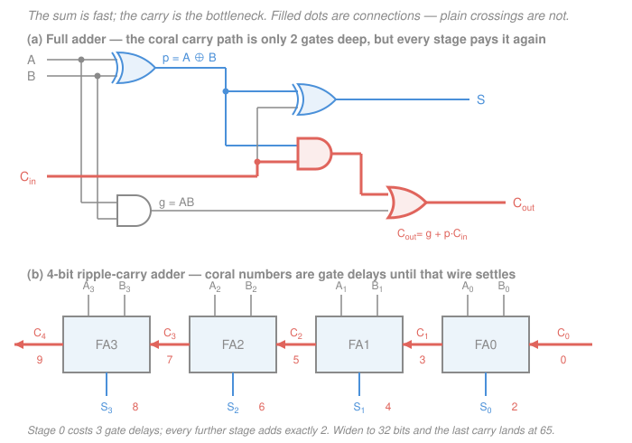
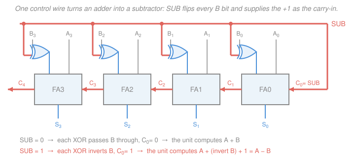

# Digital Logic Design · Lesson 2.3: Arithmetic circuits

> ⏱ ~15 min · Module 2: Combinational logic design · Builds on: [1.2 Signed numbers and two's-complement arithmetic](01-02-signed-numbers-twos-complement.md), [1.4 Truth tables and canonical forms](01-04-truth-tables-canonical-forms.md), [2.1 Karnaugh maps](02-01-karnaugh-maps.md) · Unlocks: [2.5 Building a simple ALU](02-05-building-a-simple-alu.md)

## Why this matters

Every number your computer has ever added went through the circuit on this page. Not an abstraction of it — *it*. And the adder is usually the slowest thing in the machine: the clock frequency printed on the box is, to a first approximation, "how long does it take a carry to walk across 64 bits." So this lesson does two jobs. First, build the thing. Second, learn to **cost** it in gate delays, because from here on "does it work?" stops being the only question and "how fast, how many gates?" starts.

There is also a payoff coming. In [1.2](01-02-signed-numbers-twos-complement.md) two's complement looked like an arbitrary convention that happened to make subtraction work. Today you'll see it was never a convention — it was a *hardware* argument, and it wins by one XOR gate per bit.

**Notation reminder:** $\overline{A}$ is NOT (some books write $A'$), juxtaposition $AB$ is AND, $+$ is OR, $\oplus$ is XOR. Bit $A_{n-1}$ is the most significant; $A_0$ is the least. Binary literals go in backticks, like `1011`.

## The idea

Add two decimal numbers by hand and watch what your fingers do. At each column you combine three things — the two digits and whatever you carried in — and produce two things: a digit to write down and a carry to pass left. That's it. That's the whole algorithm, and it is *identical* in binary, only easier, because each column has just eight possible input combinations instead of a thousand.

So the plan writes itself: build one circuit that handles one column, then chain $n$ copies of it. The column circuit is called a **full adder**. The chain is called a **ripple-carry adder**, and the name is a warning label — the carry has to *ripple*, one column at a time, exactly the way your pencil does. Column 7 cannot finish until column 6 tells it what carried in. That serial dependency is the entire performance story of computer arithmetic.

## The formal version

### Half adder — the column with no carry-in

Two inputs, two outputs. Truth table:

| $A$ | $B$ | $C_{out}$ | $S$ |
|---|---|---|---|
| 0 | 0 | 0 | 0 |
| 0 | 1 | 0 | 1 |
| 1 | 0 | 0 | 1 |
| 1 | 1 | 1 | 0 |

$S$ is 1 on exactly the odd-parity rows, and $C_{out}$ only on the last, so

$$S = A \oplus B, \qquad C_{out} = AB.$$

*In words: the sum bit is "exactly one of them is 1", and the carry is "both are 1".* Two gates. And immediately useless on its own: there is no $C_{in}$ input, so nothing upstream can feed it. A half adder can only ever be column 0.

### Full adder — the column that cascades

Three inputs, two outputs. Writing the rows in the order $A, B, C_{in}$ (so row index $m$ counts $A$ as the most significant variable):

| $m$ | $A$ | $B$ | $C_{in}$ | $C_{out}$ | $S$ |
|---|---|---|---|---|---|
| 0 | 0 | 0 | 0 | 0 | 0 |
| 1 | 0 | 0 | 1 | 0 | 1 |
| 2 | 0 | 1 | 0 | 0 | 1 |
| 3 | 0 | 1 | 1 | 1 | 0 |
| 4 | 1 | 0 | 0 | 0 | 1 |
| 5 | 1 | 0 | 1 | 1 | 0 |
| 6 | 1 | 1 | 0 | 1 | 0 |
| 7 | 1 | 1 | 1 | 1 | 1 |

Read each row as "add the three input bits, write the 2-bit answer as $C_{out}S$": row 3 is $0+1+1=2=$ `10`, row 7 is $1+1+1=3=$ `11`. So $S = \Sigma m(1,2,4,7)$ and $C_{out} = \Sigma m(3,5,6,7)$.

**The sum.** $S$ is 1 exactly when an *odd* number of inputs is 1 — rows 1, 2, 4 (one input) and row 7 (three). Odd-parity is what XOR computes, so

$$\boxed{\,S = A \oplus B \oplus C_{in}\,}$$

**The carry.** Put $C_{out} = \Sigma m(3,5,6,7)$ on a 3-variable K-map ([2.1](02-01-karnaugh-maps.md)), rows $A$, columns $BC_{in}$ in Gray order:

| $A \backslash BC_{in}$ | 00 | 01 | 11 | 10 |
|---|---|---|---|---|
| **0** | 0 | 0 | 1 (m3) | 0 |
| **1** | 0 | 1 (m5) | 1 (m7) | 1 (m6) |

Three pairs, each essential (each of $m_3, m_5, m_6$ has exactly one 1-neighbour, namely $m_7$):

$$C_{out} = AB + AC_{in} + BC_{in}$$

*In words: carry out if at least two of the three inputs are 1.* That is the **majority function** — the same $F = AB + BC + AC$ you minimized in the module 1 boss problem. A full adder's carry logic literally takes a vote.

But hardware prefers a different, equal form. Factor the $C_{in}$ terms: $AC_{in} + BC_{in} = C_{in}(A + B)$, and on the rows where $AB = 1$ the first term already covers it, so $A+B$ can be weakened to $A \oplus B$ for free:

$$\boxed{\,C_{out} = AB + C_{in}(A \oplus B)\,}$$

*In words: carry out if both addends are 1, or if exactly one is and a carry came in.*

**Verify the two forms are equal by minterms.** $AB$ covers $m_6, m_7$. $C_{in}(A\oplus B)$ needs $C_{in}=1$ and $A \ne B$, i.e. `011` and `101`, which are $m_3, m_5$. Union $= \{3,5,6,7\}$ — exactly the table. ✓

Why prefer it? Because $A \oplus B$ is *already being built* for the sum bit. Name the two shared signals

$$p = A \oplus B \ (\textbf{propagate}), \qquad g = AB \ (\textbf{generate}),$$

and the column becomes $S = p \oplus C_{in}$, $C_{out} = g + pC_{in}$. *In words: this column **generates** a carry on its own when both bits are 1, and **propagates** an incoming carry when exactly one is.*

### Ripple-carry adder

Chain $n$ full adders, wiring each $C_{out}$ into the next stage's $C_{in}$, with $C_0$ the external carry-in (`0` for plain addition). The result bits are $S_0 \ldots S_{n-1}$ and $C_n$ is the carry out.

## Picture

## Gate delay — the reason this lesson exists

**The accounting convention** (state it, then never drift from it): one **gate delay** is the time any single gate takes to respond, regardless of type or fan-in. XOR counts as one gate. Inverters on raw inputs are free, since they are generated once and shared. The delay of a circuit is the number of gates on its **longest input-to-output path**.

Now trace the ripple-carry adder with the $p/g$ full adder:

- $t = 0$: all $A_i$, $B_i$ and $C_0$ are present.
- $t = 1$: **every** $p_i$ and $g_i$ is ready — all stages compute these in parallel, because they depend only on the inputs.
- $C_1 = g_0 + p_0 C_0$: the AND settles at $t=2$, the OR at $t=3$.
- Each further stage adds an AND and an OR: $C_{i+1}$ settles at $2i + 3$.
- $S_i = p_i \oplus C_i$ settles one XOR after its carry-in: at $2i+2$.

So the last sum bit lands at $2n$ gate delays and the carry-out at $2n+1$:

| $n$ | last sum bit $S_{n-1}$ | carry out $C_n$ |
|---|---|---|
| 4 | 8 | 9 |
| 8 | 16 | 17 |
| 32 | 64 | 65 |

*In words: doubling the word width doubles the adder's delay.* Linear growth — $O(n)$ — and the constant isn't small. A 32-bit ripple-carry adder is 65 gates deep while everything else in a simple datapath is 2–5 gates deep, which is why **the adder is normally the critical path**: the clock period must be at least the slowest path in the machine, so the adder alone sets the processor's clock ceiling. (The physical picoseconds behind one "gate delay" are a transistor-level story — see [`electronics` 4.3](../../electronics/lessons/04-03-cmos-inverter-gates.md).)

### Carry-lookahead, in one idea

The ripple is serial because each $C_{i+1}$ waits on $C_i$. But the recurrence

$$C_{i+1} = g_i + p_i C_i$$

can just be **unrolled**, since every $g_i$ and $p_i$ is available at $t=1$:

$$C_1 = g_0 + p_0C_0$$
$$C_2 = g_1 + p_1g_0 + p_1p_0C_0$$
$$C_3 = g_2 + p_2g_1 + p_2p_1g_0 + p_2p_1p_0C_0$$

*In words: a carry reaches position $i$ if some earlier position generated one and every position in between propagated it.* Each line is now a two-level AND-OR expression in the *inputs only* — so all carries can be computed **at once**, in 2 gate delays after $p$ and $g$, no matter how wide the adder.

The catch is fan-in: $C_{32}$ flat would need a 33-input OR of 33-input ANDs, which no real gate provides. So designers build 4-bit lookahead blocks and lookahead *between the blocks*, recursively — a tree. Depth then grows like the height of the tree:

$$O(n) \longrightarrow O(\log n), \text{ paid for in gate count and wiring.}$$

That trade — more hardware for shallower logic — is the central move of the rest of digital design.

## Two's-complement subtraction, for one gate per bit

From [1.2](01-02-signed-numbers-twos-complement.md): $-B$ in two's complement is $\overline{B} + 1$ (invert every bit, add one). So

$$A - B = A + \overline{B} + 1.$$

Look at what an adder already has lying around: an unused carry-in on stage 0. Feed $\overline{B}$ into the B inputs and set $C_0 = 1$, and the adder subtracts. The "+1" costs **nothing** — it rides in on a wire that was there anyway.

Better: don't hard-wire it. Put an XOR on each $B_i$ with a shared control line $SUB$, and route $SUB$ to $C_0$ as well. Since $B_i \oplus 0 = B_i$ and $B_i \oplus 1 = \overline{B_i}$, the XOR is a **controllable inverter**:

$$B_i' = B_i \oplus SUB, \qquad C_0 = SUB$$

*In words: one control wire flips B and injects the +1 at the same instant.* $SUB=0$ adds; $SUB=1$ subtracts. **Same hardware, both operations.** This is the whole reason two's complement beat sign–magnitude: sign–magnitude needs a separate subtractor plus comparison logic to decide which operand is bigger, while two's complement needs $n$ XOR gates. This block drops straight into the ALU of [2.5](02-05-building-a-simple-alu.md).

One free bonus: after a subtraction, $C_n = 1$ means *no borrow occurred*, i.e. $A \ge B$ as unsigned numbers.

### Overflow detection — one gate

Signed overflow is not the same as carry-out ([1.2](01-02-signed-numbers-twos-complement.md)). The hardware test is

$$\boxed{\,V = C_n \oplus C_{n-1}\,}$$

the carry *out of* the sign column XOR the carry *into* it. *In words: overflow happened if the sign column got a carry it didn't pass on, or passed one on that it didn't get.* Check it against the 4-bit cases from 1.2:

| computation | result | $C_4$ | $C_3$ | $V$ | correct? |
|---|---|---|---|---|---|
| $5+3$: `0101`+`0011` | `1000` $=-8$ | 0 | 1 | 1 | yes — 8 exceeds $+7$ |
| $-5-6$: `1011`+`1010` | `0101` $=+5$ | 1 | 0 | 1 | yes — $-11$ is below $-8$ |
| $-3+5$: `1101`+`0101` | `0010` $=+2$ | 1 | 1 | 0 | yes — carry out, no overflow |
| $3+4$: `0011`+`0100` | `0111` $=+7$ | 0 | 0 | 0 | yes — fits |

Note rows 1 and 3: overflow with no carry-out, and carry-out with no overflow. They are genuinely independent flags.

## Magnitude comparator

Three outputs: $G$ ($A>B$), $E$ ($A=B$), $L$ ($A<B$), exactly one high. One bit first:

| $A$ | $B$ | $G$ | $E$ | $L$ |
|---|---|---|---|---|
| 0 | 0 | 0 | 1 | 0 |
| 0 | 1 | 0 | 0 | 1 |
| 1 | 0 | 1 | 0 | 0 |
| 1 | 1 | 0 | 1 | 0 |

$$G = A\overline{B}, \qquad L = \overline{A}B, \qquad E = \overline{A \oplus B} \ (\text{XNOR}).$$

**Equality** for $n$ bits is easy — every column must match:

$$E = e_{n-1}e_{n-2}\cdots e_0, \qquad e_i = \overline{A_i \oplus B_i}.$$

**Greater-than is not** a per-column vote; it is a **priority** argument. Scan from the most significant bit down; the *first column where the two words differ* decides, and every lower column is irrelevant. Formally, for 4 bits:

$$G = A_3\overline{B_3} + e_3A_2\overline{B_2} + e_3e_2A_1\overline{B_1} + e_3e_2e_1A_0\overline{B_0}$$

*In words: A wins at bit $i$ if all higher bits tied and A has the 1 there.* $L$ is the mirror image with $\overline{A_i}B_i$. Try $A=$ `1010` (10), $B=$ `1001` (9): $e_3=1$, $e_2=1$, and at bit 1 $A_1\overline{B_1}=1$, so the third term fires and $G=1$. ✓

That "highest-priority match wins, mask everything below" structure is worth remembering — it reappears verbatim as the **priority encoder** in [2.4](02-04-decoders-encoders-multiplexers.md).

## Worked examples

**Example 1 (mechanical — trace a 4-bit add, including its delay).** $A=$ `0101` (5), $B=$ `0011` (3), $C_0=0$. Work right to left, each stage computing $S_i = A_i \oplus B_i \oplus C_i$ and $C_{i+1} = $ majority:

| $i$ | $A_i$ | $B_i$ | $C_i$ | $S_i$ | $C_{i+1}$ | settles at |
|---|---|---|---|---|---|---|
| 0 | 1 | 1 | 0 | 0 | 1 | $S_0$: 2, $C_1$: 3 |
| 1 | 0 | 1 | 1 | 0 | 1 | $S_1$: 4, $C_2$: 5 |
| 2 | 1 | 0 | 1 | 0 | 1 | $S_2$: 6, $C_3$: 7 |
| 3 | 0 | 0 | 1 | 1 | 0 | $S_3$: 8, $C_4$: 9 |

$S=$ `1000`, $C_4 = 0$. Unsigned that reads 8 — correct, $5+3=8$. Signed it reads $-8$, and indeed $V = C_4 \oplus C_3 = 0 \oplus 1 = 1$: two positives gave a negative, the classic overflow tell. The full answer isn't trustworthy until $t=9$, even though $S_0$ was right at $t=2$ — the circuit spends most of its life showing garbage.

**Example 2 (why you'd care — the same box subtracts).** Compute $5-3$ on the adder–subtractor with $SUB=1$. Each XOR inverts $B$: `0011` $\to$ `1100`, and $C_0 = 1$.

| $i$ | $A_i$ | $B_i'$ | $C_i$ | $S_i$ | $C_{i+1}$ |
|---|---|---|---|---|---|
| 0 | 1 | 0 | 1 | 0 | 1 |
| 1 | 0 | 0 | 1 | 1 | 0 |
| 2 | 1 | 1 | 0 | 0 | 1 |
| 3 | 0 | 1 | 1 | 0 | 1 |

$S =$ `0010` $= 2$. ✓ And $C_4 = 1$ says "no borrow", i.e. $5 \ge 3$ — the comparator's $G$-or-$E$ answer, free, from the adder. $V = C_4 \oplus C_3 = 1 \oplus 1 = 0$: no overflow. Notice that nothing in the circuit ever "knew" it was subtracting; it added `0101` + `1100` + 1 and two's complement did the rest.

## Watch out

- **You might think carry-out means overflow.** It doesn't. Carry-out $C_n$ is the unsigned-range flag; $V = C_n \oplus C_{n-1}$ is the signed-range flag. Example 2 has $C_4=1$ with $V=0$; Example 1 has $C_4=0$ with $V=1$. The hardware computes both and lets the *instruction* decide which to look at.
- **You might compare two words bit-by-bit and count.** Take $A=$ `1000`, $B=$ `0111`: there are three columns where $B$ has the 1 and only one where $A$ does, yet $A > B$. Magnitude comparison is strictly a priority scan from the MSB — the first disagreement ends the argument.
- **You might quote gate delays without stating your convention.** "$2n$" assumes the $g + pC_{in}$ carry path and one delay per gate irrespective of fan-in. Build the carry as a flat two-level SOP straight off the K-map instead and the count shifts (still linear, different constant); count an XOR as three gates and it shifts again. A delay number is meaningless without the model it was counted in — always say yours.
- **You might reach for a half adder in the middle of a word.** It has no $C_{in}$ port at all, so it can only sit at bit 0 — and even there most designs use a full adder anyway, so that $C_0$ is available for subtraction.

## One-liner

> A full adder is a majority vote for the carry and a parity check for the sum; chain $n$ of them and you get an adder whose delay is $2n$ gate delays and whose subtractor is the same box with one XOR per bit.

## Problems

**P1 (🟢)** A 4-bit ripple-carry adder gets $A =$ `0110`, $B =$ `1011`, $C_0 = 0$. Give $C_1, C_2, C_3, C_4$ and the sum bits. Then read the result twice — once as unsigned, once as signed two's complement — and state the overflow flag $V$.

**P2 (🟡)** You are budgeting the clock for a 16-bit ripple-carry adder. Assume one gate delay is 80 ps and the $g + pC_{in}$ carry path from this lesson.
(a) At what gate-delay count is the carry-out $C_{16}$ valid?
(b) The adder's outputs must also pass through 3 gate delays of surrounding logic before the next clock edge. What is the maximum clock frequency?
(c) A carry-lookahead unit makes every carry valid 3 gate delays after the inputs (one level for $p,g$, two for the lookahead), so the last sum bit lands at 4. Redo (b) and give the speedup.

**P3 (🔴)** On the 4-bit adder–subtractor of the figure, set $SUB = 1$, $A =$ `0011`, $B =$ `1010`.
(a) Give $B'$, $C_0$, the sum bits, $C_3$ and $C_4$.
(b) Interpret the result as signed two's complement and use $V = C_4 \oplus C_3$ to say whether it is trustworthy. Explain the discrepancy.
(c) Using the priority expression for $G$, what does a 4-bit magnitude comparator report for these same two patterns read as *unsigned* numbers?

Solutions

**P1** Column by column, right to left ($S_i = A_i \oplus B_i \oplus C_i$; carry out when at least two of the three are 1):

| $i$ | $A_i$ | $B_i$ | $C_i$ | $S_i$ | $C_{i+1}$ |
|---|---|---|---|---|---|
| 0 | 0 | 1 | 0 | 1 | 0 |
| 1 | 1 | 1 | 0 | 0 | 1 |
| 2 | 1 | 0 | 1 | 0 | 1 |
| 3 | 0 | 1 | 1 | 0 | 1 |

So $C_1 = 0$, $C_2 = 1$, $C_3 = 1$, $C_4 = 1$, and $S =$ `0001`.

*Unsigned:* $6 + 11 = 17$, and 17 doesn't fit in 4 bits — the true answer is `10001`, whose low four bits are `0001` with $C_4 = 1$ holding the missing 16th. Carry-out is the unsigned "didn't fit" flag.

*Signed:* $A = +6$, $B =$ `1011` $= -5$, so the answer should be $+1$, and `0001` $= +1$. ✓ Overflow flag $V = C_4 \oplus C_3 = 1 \oplus 1 = 0$ — no overflow, correctly, since $+1$ is well inside $[-8, +7]$.

*Check.* Two operands of opposite sign can never overflow (the result lies between them in magnitude), and $V=0$ agrees. This row is the counterexample to "carry means overflow": $C_4 = 1$, $V = 0$.

**P2** (a) With $n = 16$, the carry-out settles at $2n + 1 = 33$ gate delays. (The last sum bit $S_{15}$ lands one earlier, at $2n = 32$.)

(b) Critical path $= 33 + 3 = 36$ gate delays.

$$T_{\min} = 36 \times 80\ \text{ps} = 2880\ \text{ps} = 2.88\ \text{ns}, \qquad f_{\max} = \frac{1}{2.88\ \text{ns}} \approx 347\ \text{MHz}.$$

(c) Critical path $= 4 + 3 = 7$ gate delays.

$$T_{\min} = 7 \times 80\ \text{ps} = 560\ \text{ps}, \qquad f_{\max} = \frac{1}{560\ \text{ps}} \approx 1.79\ \text{GHz}.$$

Speedup $= 36/7 \approx 5.1\times$.

*Check.* Speedup must equal the ratio of gate-delay counts since the 80 ps cancels: $2880/560 = 5.14$ ✓. Sanity: the ripple adder alone is 33 of the 36 delays, so almost all of the win comes from the adder — exactly why real processors never ship a wide ripple-carry adder.

**P3** (a) $SUB = 1$, so $B' = \overline{B}$, so inverting `1010` gives `0101`, and $C_0 = SUB = 1$. Add `0011` + `0101` + 1:

| $i$ | $A_i$ | $B_i'$ | $C_i$ | $S_i$ | $C_{i+1}$ |
|---|---|---|---|---|---|
| 0 | 1 | 1 | 1 | 1 | 1 |
| 1 | 1 | 0 | 1 | 0 | 1 |
| 2 | 0 | 1 | 1 | 0 | 1 |
| 3 | 0 | 0 | 1 | 1 | 0 |

$S =$ `1001`, $C_3 = 1$, $C_4 = 0$.

(b) Signed, $A = +3$ and $B =$ `1010` $= -6$, so we asked for $3 - (-6) = +9$. But `1001` reads as $-7$, and $V = C_4 \oplus C_3 = 0 \oplus 1 = 1$ — overflow, so the result is *not* trustworthy. The discrepancy: $+9$ is outside the 4-bit signed range $[-8, +7]$, and the wrap is by $2^4 = 16$, giving $9 - 16 = -7$. ✓ The tell is visible without any flag: subtracting a negative from a positive must give a positive, and we got a negative.

(c) As unsigned, $A = 3$ and $B = 10$, so we expect $G = 0$, $L = 1$. Priority scan from the MSB: $e_3 = \overline{A_3 \oplus B_3} = \overline{0 \oplus 1} = 0$ — the words already differ at bit 3, so every term of $G$ after the first is masked to zero, and the first term is $A_3\overline{B_3} = 0 \cdot 0 = 0$. Hence $G = 0$. The mirror term $\overline{A_3}B_3 = 1 \cdot 1 = 1$ gives $L = 1$. ✓ The MSB decided it alone; bits 2–0 were never consulted.

*Check.* Cross-check against (a): the subtraction's carry-out was $C_4 = 0$, which for subtraction means "a borrow occurred", i.e. $A < B$ as unsigned. Agrees with $L = 1$ ✓.

## Flashback

**From Lesson 1.2 (Signed numbers and two's-complement arithmetic):** Working in **8-bit** two's complement, represent $-100$ and $-45$, add them, and give the 8-bit result pattern with its signed value. Did overflow occur? State the rule you used. *(Fresh variant — both operands negative this time.)*

Solution

**Negate by invert-and-add-1.**

$100 =$ `01100100`. Invert: `10011011`. Add 1: $-100 =$ `10011100`.
*Check:* as unsigned that byte is $128+16+8+4 = 156$, and $156 - 256 = -100$ ✓.

$45 =$ `00101101`. Invert: `11010010`. Add 1: $-45 =$ `11010011`.
*Check:* $128+64+16+2+1 = 211$, and $211 - 256 = -45$ ✓.

**Add.** `10011100` + `11010011`. Working as unsigned bit patterns, $156 + 211 = 367 = 256 + 111$, so the carry out is $C_8 = 1$ and the 8-bit result is $111 =$ `01101111`.

*Column check on the top two bits:* the low seven bits are `0011100` $=28$ and `1010011` $=83$, summing to $111 < 128$, so no carry leaves bit 6 — that is, $C_7 = 0$. Bit 7 then computes $1 + 1 + 0 = $ `10`, giving $S_7 = 0$ and $C_8 = 1$. Result `01101111` ✓.

**Overflow?** Yes. Two rules, both agreeing:

1. *Sign rule:* adding two negatives must give a negative, but `01101111` has sign bit 0 and reads as $+111$.
2. *Carry rule (today's hardware test):* $V = C_8 \oplus C_7 = 1 \oplus 0 = 1$.

The true answer $-145$ lies outside the 8-bit signed range $[-128, +127]$, and the machine wrapped it by $256$: $-145 + 256 = +111$ ✓. Note again that $C_8 = 1$ by itself proves nothing about signed overflow — it is $V$ that does.

## Connections

- **Backward:** the carry logic $C_{out} = \Sigma m(3,5,6,7)$ is the 3-input majority function from the module 1 boss problem, minimized on a K-map exactly as in [2.1](02-01-karnaugh-maps.md); the two equivalent carry forms were checked by re-expanding both to minterms, the standard verification from [1.4](01-04-truth-tables-canonical-forms.md). The subtractor is [1.2](01-02-signed-numbers-twos-complement.md)'s invert-and-add-1 built out of wire instead of paper.
- **Forward:** [2.4](02-04-decoders-encoders-multiplexers.md) reuses the comparator's "first difference wins" priority structure in the priority encoder, and [2.5](02-05-building-a-simple-alu.md) takes the adder–subtractor whole, wraps AND/OR slices around it, and turns $C_n$, $V$, $S_{n-1}$ and "all sum bits zero" into the four status flags every instruction set exposes. Gate-delay budgeting comes back for real once flip-flops impose setup times in [3.2](03-02-flip-flops-and-clocking.md), and the adder-as-critical-path story is where [`computer-architecture`](../../computer-architecture/syllabus.md) starts.
- **Sideways:** "unroll a serial recurrence so the terms can be evaluated in parallel" is not a hardware trick — it is the same move as solving a linear recurrence in closed form, and the $O(n) \to O(\log n)$ tree it produces is the prefix-sum (scan) pattern that shows up wherever parallel algorithms are designed.
