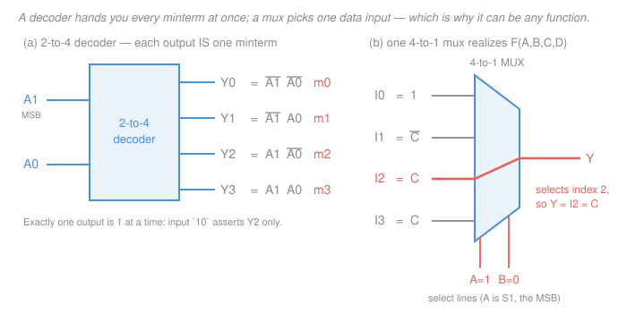

# Digital Logic Design · Lesson 2.4: Decoders, encoders, and multiplexers

> ⏱ ~15 min · Module 2: Combinational logic design · Builds on: [1.3 Boolean algebra and logic gates](01-03-boolean-algebra-logic-gates.md), [1.4 Truth tables and canonical forms](01-04-truth-tables-canonical-forms.md), [2.3 Arithmetic circuits](02-03-arithmetic-circuits.md) · Unlocks: [2.5 Building a simple ALU](02-05-building-a-simple-alu.md), [4.3 Memory and programmable logic](04-03-memory-and-programmable-logic.md), [4.4 Datapaths and a simple CPU](04-04-datapaths-and-a-simple-cpu.md)

## Why this matters

[2.3](02-03-arithmetic-circuits.md) built blocks that **compute** — adders, comparators. This lesson builds the blocks that **route and translate**: they move a value from one of several places to one destination, turn a number into a "select this one" signal, and turn a "this one is asking" signal back into a number. That sounds like plumbing, and it is — but plumbing is most of a processor. When you get to [4.4](04-04-datapaths-and-a-simple-cpu.md), the datapath you trace is almost entirely decoders and multiplexers with an ALU wedged in the middle.

There is also a genuine surprise waiting here. A multiplexer is not just a switch: **a mux with $n$ select lines can realize *any* Boolean function of $n{+}1$ variables, with no other gates at all.** That makes it a universal logic element in the same way NAND is — and a far more practical one.

*Notation for this lesson:* complement is $\overline{A}$ (some books write $A'$); AND is juxtaposition $AB$; OR is $+$; XOR is $\oplus$. Canonical sums are $\Sigma m(\ldots)$ as in [1.4](01-04-truth-tables-canonical-forms.md). **The leftmost variable is always the most significant bit.**

## The idea

Three blocks, one family:

- A **decoder** takes a small binary number and lights up exactly one of many output lines — "the number is 5" becomes "wire number 5 is hot." It is a *number → position* translator.
- An **encoder** does the reverse — "wire 5 is hot" becomes "the number is 5." It is a *position → number* translator.
- A **multiplexer** (mux) is a many-in, one-out selector: give it a number and it forwards that numbered input to the output, ignoring all the others. It is a hardware `if`/`switch`.

The one observation that makes the whole lesson click: a decoder's output lines *are the minterms*. There is no other way to have exactly one line high per input combination — that is the definition of a minterm. So a decoder is a **minterm generator**, and everything you learned about canonical forms in [1.4](01-04-truth-tables-canonical-forms.md) becomes a wiring diagram.

## The formal version

### Binary decoder

An **$n$-to-$2^n$ decoder** takes $n$ input bits and drives $2^n$ output lines $Y_0,\ldots,Y_{2^n-1}$, asserting exactly the one whose index equals the input read as a binary number.

*2-to-4 decoder truth table* ($A_1$ is the MSB):

| $A_1$ | $A_0$ | $Y_3$ | $Y_2$ | $Y_1$ | $Y_0$ |
|---|---|---|---|---|---|
| 0 | 0 | 0 | 0 | 0 | 1 |
| 0 | 1 | 0 | 0 | 1 | 0 |
| 1 | 0 | 0 | 1 | 0 | 0 |
| 1 | 1 | 1 | 0 | 0 | 0 |

Read the columns instead of the rows and each one is a single AND term:

$$Y_0=\overline{A_1}\,\overline{A_0}=m_0,\quad Y_1=\overline{A_1}A_0=m_1,\quad Y_2=A_1\overline{A_0}=m_2,\quad Y_3=A_1A_0=m_3.$$

*In words: output $i$ is exactly minterm $i$ of the inputs.* So an $n$-to-$2^n$ decoder is a bank of all $2^n$ minterms, computed in parallel, for the price of $2^n$ AND gates and $n$ inverters.

$$\boxed{\;F=\Sigma m(i_1,i_2,\ldots)\ \Longrightarrow\ F=Y_{i_1}+Y_{i_2}+\cdots\;}$$

*In words: a decoder plus one OR gate realizes any function, straight off its minterm list — no algebra, no K-map.* It costs more gates than a minimized SOP, but it is instant, and it is free once you need several functions of the same inputs (they share the decoder).

### Enable inputs, and building bigger decoders

Real decoders have an **enable** input $EN$: when $EN=0$ every output is deasserted; when $EN=1$ the decoder behaves normally. Formally $Y_i = EN\cdot m_i$.

Enables let you build a hierarchy. A **3-to-8 decoder from two 2-to-4 decoders**: feed the low bits $A_1A_0$ to both, and use the top bit $A_2$ to pick which one is awake.

- Lower decoder: $EN=\overline{A_2}$ → drives $Y_0\ldots Y_3$ (the cases $A_2=0$).
- Upper decoder: $EN=A_2$ → drives $Y_4\ldots Y_7$ (the cases $A_2=1$).

One inverter buys you the extra address bit. The same trick nests: four 2-to-4 decoders plus a 2-to-4 decoder driving *their* enables gives you 4-to-16.

### Active-low outputs

Many real decoder chips assert the selected output **low**: the chosen line goes to 0 and all the others sit at 1. Such a signal is written with an overbar, $\overline{Y_i}$, and read "Y-i-bar" or "Y-i active low." So $\overline{Y_i} = \overline{m_i}$.

Why? Because of what the transistors underneath are good at. In CMOS, NAND and NOR are the cheap primitives — an AND is literally a NAND followed by an inverter, so building active-high outputs means paying for $2^n$ extra inverters. Older TTL parts had a related asymmetry: their outputs sink current far better than they source it, so "asserted = pulled low" drove loads more reliably. Both stories are in [`electronics` 4.3](../../electronics/lessons/04-03-cmos-inverter-gates.md); take the costing fact and move on. Enables are commonly active-low too, written $\overline{EN}$.

The practical consequence: with active-low outputs you **OR minterms with a NAND gate**, because De Morgan ([1.3](01-03-boolean-algebra-logic-gates.md)) says

$$\overline{\overline{m_{i_1}}\cdot\overline{m_{i_2}}\cdots} = m_{i_1}+m_{i_2}+\cdots$$

*In words: NAND-ing the active-low minterm lines gives you their OR.* Same circuit, different gate.

### Address decoding — what decoders are actually for

Split a memory address into a high part and a low part. Feed the high bits to a decoder; each decoder output becomes the **chip select** for one memory chip, so exactly one chip responds to any given address, and the low bits pick a location inside it. Chip selects are almost always active-low ($\overline{CS}$), which is where the wiring bugs live. Full treatment in [4.3](04-03-memory-and-programmable-logic.md).

### Encoder, and its flaw

An **encoder** is a decoder run backwards: $2^n$ input lines in, $n$ output bits out, and if input $I_k$ is the one asserted, the output is $k$ in binary. For an 8-to-3 encoder, $Y_2 = I_4+I_5+I_6+I_7$, $Y_1=I_2+I_3+I_6+I_7$, $Y_0=I_1+I_3+I_5+I_7$.

State the flaw immediately, because it is not a detail:

1. **Two inputs asserted at once produces garbage.** Assert $I_1$ and $I_2$ together and the OR gates give `011` = 3, an input nobody asked for.
2. **It cannot tell "input 0" from "nothing."** Both produce output `000`.

### Priority encoder

The fix is a **priority encoder**: if several inputs are asserted, the **highest-numbered one wins**, and a separate **valid** output $V$ says whether *any* input was asserted at all.

*4-to-2 priority encoder.* `X` means don't-care in the input pattern — the [2.2](02-02-dont-cares-pos-quine-mccluskey.md) convention, here used on the input side to collapse rows: once a higher input is asserted, the lower ones genuinely do not matter.

| $I_3$ | $I_2$ | $I_1$ | $I_0$ | $Y_1$ | $Y_0$ | $V$ |
|---|---|---|---|---|---|---|
| 0 | 0 | 0 | 0 | X | X | 0 |
| 0 | 0 | 0 | 1 | 0 | 0 | 1 |
| 0 | 0 | 1 | X | 0 | 1 | 1 |
| 0 | 1 | X | X | 1 | 0 | 1 |
| 1 | X | X | X | 1 | 1 | 1 |

Five rows cover all sixteen input combinations, and the outputs are don't-cares in the top row because $V=0$ tells the downstream logic to ignore them — a small, real payoff for don't-care notation. Reading the table:

$$V=I_3+I_2+I_1+I_0,\qquad Y_1=I_3+I_2,\qquad Y_0=I_3+\overline{I_2}I_1.$$

*In words: the high output bit says "it's in the top half"; the low bit says "it's the odd one of that half," with $\overline{I_2}$ enforcing that $I_2$ outranks $I_1$.*

**Where this is used:** interrupt arbitration. Eight devices can raise a request line in the same cycle; the priority encoder tells the CPU which one to service and $V$ tells it whether to interrupt at all.

### Multiplexer

A **$2^n$-to-1 multiplexer** has $2^n$ data inputs $I_0,\ldots,I_{2^n-1}$, $n$ **select** lines, and one output $Y$ equal to the data input whose index the selects spell out.

$$\text{2-to-1:}\quad Y=\overline{S}I_0+SI_1.$$

*In words: when $S=0$ the output is $I_0$; when $S=1$ it is $I_1$.* Generalizing, with selects $S_{n-1}\ldots S_0$ ($S_{n-1}$ the MSB):

$$Y=\sum_{i=0}^{2^n-1} m_i(S_{n-1},\ldots,S_0)\cdot I_i,$$

i.e. minterm $i$ of the *selects* gates data input $i$. Spelled out for 4-to-1:

$$Y=\overline{S_1}\,\overline{S_0}I_0+\overline{S_1}S_0I_1+S_1\overline{S_0}I_2+S_1S_0I_3.$$

Two things fall out. First, that is exactly a decoder (the minterms) whose outputs AND with the data lines and OR together — so a mux *contains* a decoder. Second, the mux is a **software `if` in hardware**: `Y = S ? I1 : I0`. Every place a program branches on which value to use, a datapath puts a mux.

Its inverse is the **demultiplexer**: one data input, $n$ selects, $2^n$ outputs, with the data delivered to the selected output and 0 on the rest. That is structurally *a decoder with the data wired into its enable* — $Y_i = D\cdot m_i$. Decoder and demux are the same silicon with different labels on the pins.

**Cost.** As a two-level AND-OR network a mux of any width is 2 gate delays (after the select inverters), but the AND gates get wide. A tree of 2-to-1 muxes trades that for $\log_2$ of the width in delay with only small gates.

### The mux as a universal logic element

Here is the payoff. Wire a function's variables onto the select lines and the function's own truth-table output column onto the data inputs:

> A $2^n$-to-1 mux realizes **any** $n$-variable function: put the $n$ variables on the selects and set $I_i$ to the constant (0 or 1) that row $i$ of the truth table demands.

That works but is wasteful. The sharper version halves it:

> A $2^{n-1}$-to-1 mux realizes **any** $n$-variable function, using no other gates than one inverter.

**The procedure.** Put $n-1$ of the variables on the selects; call the leftover variable $X$. Each select combination now covers a *pair* of truth-table rows, one with $X=0$ and one with $X=1$. Look at the two output values and read off the data input:

| $F$ at $X=0$ | $F$ at $X=1$ | data input |
|---|---|---|
| 0 | 0 | $0$ |
| 1 | 1 | $1$ |
| 0 | 1 | $X$ |
| 1 | 0 | $\overline{X}$ |

Since $\{0,1,X,\overline{X}\}$ exhausts the functions of one variable, this **always** works.

Going further — $2^{n-2}$-to-1, leaving *two* variables loose — works only when you get lucky: each group of four rows must happen to reduce to something you already have on a wire. Boss problem 2(c) is exactly that lucky case, and Example 2 works it.

## Picture

## Worked examples

### Example 1 — a function straight off its minterm list

Realize $G(A,B,C)=\Sigma m(1,2,4,7)$ with a 3-to-8 decoder ($A$ the MSB).

By the boxed rule, no algebra at all: $G = Y_1+Y_2+Y_4+Y_7$ — a decoder and one 4-input OR gate.

*Check.* The asserted outputs are the input patterns `001`, `010`, `100`, `111` — precisely the rows with an **odd** number of 1s. So $G=A\oplus B\oplus C$, which you met in [2.3](02-03-arithmetic-circuits.md) as the sum bit of a full adder. Two very different-looking circuits, same truth table.

If the decoder had active-low outputs, the OR becomes a 4-input NAND on $\overline{Y_1},\overline{Y_2},\overline{Y_4},\overline{Y_7}$ — same wiring, one gate type swapped.

### Example 2 — boss problem 2(c): one 4-to-1 mux, four variables

Realize $F(A,B,C,D)=\Sigma m(0,1,2,3,4,5,10,11,14,15)$ with a single 4-to-1 mux using $A,B$ as the select lines ($A=S_1$, the MSB).

The select pair $(A,B)$ splits the sixteen rows into four groups of four. Minterm index is $8A+4B+2C+D$, so group $(A,B)$ holds indices $8A+4B$ through $8A+4B+3$, in $(C,D)$ order `00`, `01`, `10`, `11`. Write out each group and mark which indices are in $F$'s list:

| $A$ | $B$ | indices covered | in $F$? (for $CD=$ `00`, `01`, `10`, `11`) | $F$ values | data input |
|---|---|---|---|---|---|
| 0 | 0 | 0, 1, 2, 3 | yes, yes, yes, yes | 1, 1, 1, 1 | $I_0=1$ |
| 0 | 1 | 4, 5, 6, 7 | yes, yes, no, no | 1, 1, 0, 0 | $I_1=\overline{C}$ |
| 1 | 0 | 8, 9, 10, 11 | no, no, yes, yes | 0, 0, 1, 1 | $I_2=C$ |
| 1 | 1 | 12, 13, 14, 15 | no, no, yes, yes | 0, 0, 1, 1 | $I_3=C$ |

Now read each row's four $F$ values as a function of $(C,D)$:

- **$I_0$:** `1,1,1,1` — constant. $I_0=1$.
- **$I_1$:** `1,1,0,0`. The first two are $C=0$, the last two are $C=1$; $D$ changes within each pair and the value doesn't. So $F$ here is 1 exactly when $C=0$: $I_1=\overline{C}$.
- **$I_2$:** `0,0,1,1`. Same reasoning, opposite sense: 1 exactly when $C=1$, so $I_2=C$.
- **$I_3$:** `0,0,1,1` — identical pattern, $I_3=C$.

$$\boxed{\,I_0=1,\quad I_1=\overline{C},\quad I_2=C,\quad I_3=C\,}$$

matching the syllabus. Total hardware: one 4-to-1 mux, one inverter, and $D$ left unconnected — because it turned out never to matter.

*Check, by re-expanding.* The mux output is $Y=\overline{A}\,\overline{B}(1)+\overline{A}B(\overline{C})+A\overline{B}(C)+AB(C)$. Convert each term back to minterms:

- $\overline{A}\,\overline{B}$: all four rows with $A{=}0,B{=}0$ → $\{0,1,2,3\}$. ✓
- $\overline{A}B\,\overline{C}$: $A{=}0,B{=}1,C{=}0$, $D$ free → $\{4,5\}$. ✓
- $A\overline{B}C$: $A{=}1,B{=}0,C{=}1$, $D$ free → $\{10,11\}$. ✓
- $ABC$: $A{=}1,B{=}1,C{=}1$, $D$ free → $\{14,15\}$. ✓

Union: $\{0,1,2,3,4,5,10,11,14,15\}$ — exactly $F$'s list, nothing extra, nothing missing.

*Second check, against part (a).* The syllabus's minimal SOP is $F=\overline{A}\,\overline{C}+\overline{B}C+AC$. Expand: $\overline{A}\,\overline{C}\to\{0,1,4,5\}$, $\overline{B}C\to\{2,3,10,11\}$, $AC\to\{10,11,14,15\}$. Union is the same set. Two independent routes to the same function.

**Cascading.** Need an 8-to-1 but only have 4-to-1s? Feed $I_0\ldots I_3$ to one and $I_4\ldots I_7$ to another (both driven by $S_1S_0$), then pick between their outputs with a 2-to-1 mux driven by $S_2$. The same tree, taken all the way down, builds any width out of nothing but 2-to-1 muxes.

## Watch out

- **You might think a wire that reads 0 is idle.** With active-low signalling it is the *asserted* one. Mixing an active-high output into an active-low input is the classic decoder wiring bug — the circuit does exactly the opposite of what you meant, and looks fine on a schematic. Always write the overbar ($\overline{Y_2}$, $\overline{CS}$, $\overline{EN}$) when a signal is active-low, and check polarity at every junction.
- **You might think an encoder undoes a decoder.** It only does so on the $2^n$ inputs a decoder can actually produce. Feed a plain encoder two simultaneous 1s and it emits the bitwise OR of the two codes, which is a third, wrong answer — not an error flag. Use a priority encoder whenever the inputs aren't guaranteed one-hot.
- **You might think the mux data assignment is independent of which variables you put on the selects.** It isn't. Swap $A$ and $B$ on the selects in Example 2 and the groups become $\{0,1,2,3\},\{8,9,10,11\},\{4,5,6,7\},\{12,13,14,15\}$, giving $I_0=1,\ I_1=C,\ I_2=\overline{C},\ I_3=C$ — a different (here still lucky) assignment. With a worse choice the residues stop being functions of one variable and you need extra gates. Fix the variable order first, then read the table.

## One-liner

> A decoder generates every minterm, an encoder answers "which one," and a mux picks one input — which means a $2^{n-1}$-to-1 mux with the variables on its selects *is* any $n$-variable function.

## Problems

**P1 (🟢)** A 3-to-8 decoder is driven by $A$ (MSB), $B$, $C$. (a) Which output is asserted for input `101`? (b) Realize $H(A,B,C)=\Sigma m(0,3,5,6)$ using this decoder plus one gate. (c) If the decoder's outputs were active-low instead, what single gate replaces the one in (b)?

**P2 (🟡)** Realize $G(A,B,C)=\Sigma m(1,2,4,7)$ with one 4-to-1 mux using $A,B$ as selects ($A=S_1$). Give $I_0,\ldots,I_3$, then verify by checking all eight truth-table rows.

**P3 (🔴)** You have only 2-to-1 muxes. (a) How many do you need to build an 8-to-1 mux, and which select line drives each rank of the tree? (b) How many mux delays does a data value pass through? (c) A colleague proposes building the same 8-to-1 from two 4-to-1s and one 2-to-1 — how does the delay compare?

Solutions

**P1**

**(a)** `101` read as binary is 5, so $Y_5$ is asserted (and only $Y_5$).

**(b)** Each decoder output is a minterm, so $H = Y_0+Y_3+Y_5+Y_6$: the decoder plus a single 4-input **OR** gate.

*Check.* The asserted patterns are `000`, `011`, `101`, `110` — the rows with an **even** number of 1s. So $H=\overline{A\oplus B\oplus C}$, the complement of Example 1's $G$, which is right: $\Sigma m(0,3,5,6)$ and $\Sigma m(1,2,4,7)$ partition all eight minterms. ✓

**(c)** A 4-input **NAND** on $\overline{Y_0},\overline{Y_3},\overline{Y_5},\overline{Y_6}$. By De Morgan,
$$\overline{\overline{m_0}\,\overline{m_3}\,\overline{m_5}\,\overline{m_6}}=m_0+m_3+m_5+m_6=H. \checkmark$$

**P2** With $A=S_1$ and $B=S_0$, minterm index is $4A+2B+C$, so each $(A,B)$ group covers two rows, $C=0$ then $C=1$.

| $A$ | $B$ | indices | in $\Sigma m(1,2,4,7)$? | $F$ at $C{=}0$, $C{=}1$ | data input |
|---|---|---|---|---|---|
| 0 | 0 | 0, 1 | no, yes | 0, 1 | $I_0=C$ |
| 0 | 1 | 2, 3 | yes, no | 1, 0 | $I_1=\overline{C}$ |
| 1 | 0 | 4, 5 | yes, no | 1, 0 | $I_2=\overline{C}$ |
| 1 | 1 | 6, 7 | no, yes | 0, 1 | $I_3=C$ |

So $I_0=C,\ I_1=\overline{C},\ I_2=\overline{C},\ I_3=C$.

*Verification, all eight rows.* The mux outputs the data input selected by $(A,B)$:

| $A$ | $B$ | $C$ | selected | mux $Y$ | $G$ from $\Sigma m(1,2,4,7)$ |
|---|---|---|---|---|---|
| 0 | 0 | 0 | $I_0=C$ | 0 | $m_0$ not listed → 0 ✓ |
| 0 | 0 | 1 | $I_0=C$ | 1 | $m_1$ listed → 1 ✓ |
| 0 | 1 | 0 | $I_1=\overline{C}$ | 1 | $m_2$ listed → 1 ✓ |
| 0 | 1 | 1 | $I_1=\overline{C}$ | 0 | $m_3$ not listed → 0 ✓ |
| 1 | 0 | 0 | $I_2=\overline{C}$ | 1 | $m_4$ listed → 1 ✓ |
| 1 | 0 | 1 | $I_2=\overline{C}$ | 0 | $m_5$ not listed → 0 ✓ |
| 1 | 1 | 0 | $I_3=C$ | 0 | $m_6$ not listed → 0 ✓ |
| 1 | 1 | 1 | $I_3=C$ | 1 | $m_7$ listed → 1 ✓ |

All eight agree.

*Sanity note.* $G=A\oplus B\oplus C$ (Example 1). When $A\oplus B=0$ — the groups $(0,0)$ and $(1,1)$ — the output should be $C$, and it is; when $A\oplus B=1$ — groups $(0,1)$ and $(1,0)$ — it should be $\overline{C}$, and it is. ✓

**P3**

**(a)** Seven, in a tree of ranks $4+2+1$. Rank 1 (four muxes) pairs the data inputs $(I_0,I_1),(I_2,I_3),(I_4,I_5),(I_6,I_7)$ and is driven by $S_0$, the **LSB**. Rank 2 (two muxes) is driven by $S_1$. Rank 3 (one mux) is driven by $S_2$, the MSB.

*Check by tracking the index.* Rank-1 mux $k$ outputs $I_{2k+S_0}$. Rank 2 selects between $k=2j$ and $k=2j+1$ with $S_1$, i.e. $k=2j+S_1$, giving $I_{2(2j+S_1)+S_0}=I_{4j+2S_1+S_0}$. Rank 3 selects $j=S_2$, giving $I_{4S_2+2S_1+S_0}$ — the input whose index is $S_2S_1S_0$ in binary, as required. ✓ (Count check: a binary tree reducing 8 leaves to 1 needs $8-1=7$ two-input nodes.)

**(b)** Three — one per rank, i.e. $\log_2 8$.

**(c)** Two: the 4-to-1s form one rank, the 2-to-1 the next. Faster, because each 4-to-1 does in one mux delay what two ranks of 2-to-1s would do. The cost shows up inside the 4-to-1 as wider AND gates — the usual gate-count-versus-depth trade you also saw in ripple-carry addition in [2.3](02-03-arithmetic-circuits.md).

## Flashback

**From Lesson 1.3 (Boolean algebra and logic gates):** Active-low signalling is De Morgan's law wearing a hard hat, so here is a fresh variant of that machinery. Push the complement all the way in — express $\overline{A(B+\overline{C})}$ as a sum of products, then evaluate both forms at $(A,B,C)=(1,0,1)$ to confirm.

Solution

Apply De Morgan to the outer AND, then to the inner OR:

$$\overline{A(B+\overline{C})}=\overline{A}+\overline{(B+\overline{C})}=\overline{A}+\overline{B}\cdot\overline{\overline{C}}=\overline{A}+\overline{B}C.$$

The last step uses involution, $\overline{\overline{C}}=C$. The result is a sum of products (two terms, no complemented groups).

*Check at $(A,B,C)=(1,0,1)$.* Original: $B+\overline{C}=0+0=0$, so $A(B+\overline{C})=0$, and its complement is 1. New form: $\overline{A}+\overline{B}C=0+1\cdot1=1$. ✓

*Second point, $(A,B,C)=(1,1,0)$.* Original: $B+\overline{C}=1+1=1$, $A\cdot1=1$, complement 0. New form: $0+0\cdot 0=0$. ✓

## Connections

- **Backward:** the decoder-plus-OR construction is [1.4](01-04-truth-tables-canonical-forms.md)'s canonical sum-of-minterms turned into wire; the active-low/NAND swap is [1.3](01-03-boolean-algebra-logic-gates.md)'s De Morgan; the priority-encoder table is [2.2](02-02-dont-cares-pos-quine-mccluskey.md)'s don't-care notation earning its keep. And whether you reach a circuit via K-map minimization or via a mux, [2.1](02-01-karnaugh-maps.md) and this lesson must agree on the truth table — Example 2 checks exactly that.
- **Forward:** [2.5](02-05-building-a-simple-alu.md) builds an ALU as a bank of operation circuits with a mux choosing which result escapes — the function-select lines *are* mux selects. [4.3](04-03-memory-and-programmable-logic.md) uses decoders for address decoding and shows a ROM as a decoder plus a programmable OR plane, which is literally the construction in Example 1. [4.4](04-04-datapaths-and-a-simple-cpu.md) wires the whole datapath from these blocks, and the instruction decoder in [`computer-architecture`](../../computer-architecture/syllabus.md) is this lesson at scale.
- **Sideways:** the mux is the hardware form of a lookup — index in, value out — the same primitive that makes a ROM a function table and a jump table a `switch` statement. Feeding it a *stored* select value rather than a computed one is what turns fixed logic into a programmable machine.
