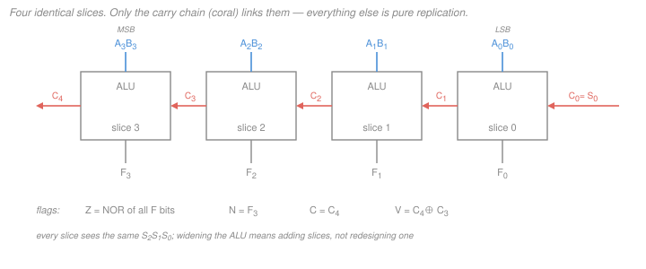

# Digital Logic Design · Lesson 2.5: Building a simple ALU

> ⏱ ~15 min · Module 2: Combinational logic design · Builds on: [2.3 Arithmetic circuits](02-03-arithmetic-circuits.md), [2.4 Decoders, encoders, and multiplexers](02-04-decoders-encoders-multiplexers.md), [1.2 Signed numbers](01-02-signed-numbers-twos-complement.md) · Unlocks: Module 3 (sequential logic) and [4.4 Datapaths and a simple CPU](04-04-datapaths-and-a-simple-cpu.md)

## Why this matters

Everything Module 2 built — adders, inverters, gates, multiplexers — has been a *part*. This lesson bolts them together into the first thing you'd recognize by name from a computer: the **arithmetic logic unit**, the block that actually does the computing in every CPU ever shipped. When [4.4](04-04-datapaths-and-a-simple-cpu.md) draws a datapath, this exact box sits in the middle of it, and the instruction being executed is nothing more than a select code fed to its control lines.

There's a second payoff, and it's the better one. The ALU emits four **status flags** alongside its result, and every conditional branch a program ever takes — every `if`, every loop exit — is a test on those flags. This is where arithmetic hardware and program control flow touch.

## The idea

An ALU is one block with two operand inputs, a bundle of **select lines**, and one result output. Change the select code and the same block does a different job: add, subtract, AND, OR. It is a menu, and the select lines are the order.

At first that sounds like a lot of hardware. It isn't, because of one organizing trick:

> **Bit-slice design.** Design *one bit's worth* of ALU. Then stamp out $n$ copies. The only wire that links neighbouring copies is the carry.

Think of it as an assembly line of $n$ identical workstations. Each one sees its own pair of operand bits, gets told the same instruction as everyone else (the select lines fan out to all of them), and produces its own result bit. The only conversation between stations is the carry passed down the line — exactly the ripple you already built in [2.3](02-03-arithmetic-circuits.md). Widening a 4-bit ALU to 32 bits is not a redesign; it's 28 more copies.

So the whole design problem shrinks to: *what is inside one slice?* Answer: an adder, four logic gates, and a multiplexer to pick which of them gets to speak.

## The formal version

Throughout, $\overline{A}$ means NOT $A$ (some books write $A'$), juxtaposition $AB$ means AND, $+$ means OR, and $\oplus$ means XOR. Bit $i$ of an operand is $A_i$, with bit 0 the least significant.

### Inside one slice

Slice $i$ takes operand bits $A_i, B_i$, a carry in $C_i$, and three select lines $S_2S_1S_0$. It produces a result bit $F_i$ and a carry out $C_{i+1}$.

**The arithmetic unit** is the full adder from [2.3](02-03-arithmetic-circuits.md), fed a *conditioned* version of $B_i$:

$$Y_i = (B_i \oplus S_0)\cdot\overline{S_1}, \qquad C_0 = \overline{S_2}\,S_0.$$

*In words: the XOR is a controlled inverter — pass $B_i$ when $S_0=0$, flip it when $S_0=1$ — and the AND can force the operand to zero.* The subtract trick from [1.2](01-02-signed-numbers-twos-complement.md) falls straight out: with $S_0=1$ the adder computes $A + \overline{B} + 1$, and $\overline{B}+1$ *is* the two's complement of $B$, so the sum is $A - B$. One control bit turns an adder into a subtractor; that is the single cheapest trick in digital design.

**The logic unit** computes $A_iB_i$, $A_i + B_i$, $A_i \oplus B_i$, and $\overline{A_i}$ **in parallel** — all four, all the time. Nothing is gated off, because gates are cheap and the multiplexer will throw away the three you didn't ask for.

**The output mux** ([2.4](02-04-decoders-encoders-multiplexers.md)) picks the winner. A 4-to-1 mux on $S_1S_0$ selects among the four logic results, then a 2-to-1 mux on $S_2$ chooses arithmetic-versus-logic. (You could use a single 8-to-1 mux instead, but four of its eight inputs would be tied to the same adder output — the two-stage version is the same function for fewer transistors.)

### The function-select table

With $k$ select lines you can name up to $2^k$ operations. Here $k=3$, so eight:

| $S_2S_1S_0$ | Operation | How the slice is configured | Result |
|---|---|---|---|
| `000` | ADD | $Y_i = B_i$, $C_0 = 0$, output mux → adder | $F = A + B$ |
| `001` | SUB | $Y_i = \overline{B_i}$, $C_0 = 1$, output mux → adder | $F = A - B$ |
| `010` | PASS A | $Y_i = 0$, $C_0 = 0$, output mux → adder | $F = A$ |
| `011` | INC A | $Y_i = 0$, $C_0 = 1$, output mux → adder | $F = A + 1$ |
| `100` | AND | output mux → logic input 0 | $F_i = A_iB_i$ |
| `101` | OR | output mux → logic input 1 | $F_i = A_i + B_i$ |
| `110` | XOR | output mux → logic input 2 | $F_i = A_i \oplus B_i$ |
| `111` | NOT A | output mux → logic input 3 | $F_i = \overline{A_i}$ |

*Check the table against the control equations.* Take `010`: $Y_i = (B_i\oplus 0)\cdot\overline{1} = 0$ and $C_0 = \overline{0}\cdot 0 = 0$, so the adder computes $A + 0 + 0 = A$ — PASS A, as listed. Take `011`: $Y_i = (B_i\oplus 1)\cdot\overline{1} = 0$ and $C_0 = \overline{0}\cdot 1 = 1$, so the adder computes $A + 0 + 1 = A+1$ — INC. All four arithmetic rows check out this way, and the four logic rows are just the four data inputs of the 4-to-1 mux in order.

### Status flags

The result bits tell the *program* nothing until they're summarized. Four one-bit summaries do that job. For an $n$-bit ALU with result $F_{n-1}\ldots F_0$ and carries $C_n, C_{n-1}$:

| Flag | Computed as | What it's for |
|---|---|---|
| **Z** (zero) | $\overline{F_{n-1} + \cdots + F_0}$, i.e. NOR of all result bits | "the two things were equal" (after SUB) |
| **C** (carry) | $C_n$, the carry out of the MSB | **unsigned** out-of-range, or "no borrow" after SUB |
| **N** (negative) | $F_{n-1}$, the MSB of the result | **signed** sign of the result |
| **V** (overflow) | $C_n \oplus C_{n-1}$ | **signed** out-of-range |

*In words: Z says "all zeros", C and V say "the answer didn't fit", and N says "the answer looks negative".* Note that Z needs an $n$-input NOR — for a 32-bit ALU that's a tree of gates sitting on the critical path *after* the slowest result bit arrives.

**The carry-versus-overflow point from [1.2](01-02-signed-numbers-twos-complement.md), restated where it pays off.** The ALU does not know whether you meant your bits as signed or unsigned. It computes one sum and hands you *both* verdicts: C is the unsigned complaint, V is the signed complaint. The same eight result bits get read two different ways, and the flags let the program pick which reading it cares about.

**And now the punchline.** A conditional branch is just a test on these flags:

- `beq` (branch if equal) — subtract, branch if **Z = 1**.
- `bcs` / branch-if-unsigned-lower — branch on **C**.
- `bmi` (branch if minus) — branch on **N**.
- `blt` (branch if signed less-than) — branch if **N $\oplus$ V = 1**.

That's the whole bridge from arithmetic hardware to control flow. `if (x < y)` compiles to a subtraction whose *result is discarded* — only the flags survive, and a later gate reads them. When [4.4](04-04-datapaths-and-a-simple-cpu.md) puts a control FSM next to this ALU, the flags are the wires the FSM listens to.

### What it costs

Let one gate delay be $t_p$ (counting an XOR as one gate). The logic path is short: gate ($1t_p$) → 4-to-1 mux ($2t_p$) → 2-to-1 mux ($2t_p$) $= 5t_p$. The arithmetic path is not: input conditioning takes $2t_p$, then the ripple carry costs $2t_p$ per slice ([2.3](02-03-arithmetic-circuits.md)), so for $n=8$ the carry out arrives at $2 + 16 = 18t_p$, the MSB sum at about $17t_p$, and $F_7$ after the output mux at $19t_p$ — with Z landing around $21t_p$ once the NOR tree resolves. The carry chain is therefore the ALU's critical path and it, not the logic gates, sets the clock period. That is exactly why carry-lookahead exists: shortening the adder shortens the whole processor.

## Picture

## Worked examples

Both examples use $n=8$. Bits are written MSB first, so `01011010` has $F_7 = 0$.

**Example 1 — a subtraction that comes out zero (select `001`).** Let $A =$ `01011010` (90) and $B =$ `01011010` (90).

Conditioning: $Y = \overline{B} =$ `10100101`, and $C_0 = 1$.

Column by column, from bit 0 upward, each column sums $A_i + Y_i + C_i$:

| bit $i$ | 0 | 1 | 2 | 3 | 4 | 5 | 6 | 7 |
|---|---|---|---|---|---|---|---|---|
| $A_i$ | 0 | 1 | 0 | 1 | 1 | 0 | 1 | 0 |
| $Y_i$ | 1 | 0 | 1 | 0 | 0 | 1 | 0 | 1 |
| $C_i$ | 1 | 1 | 1 | 1 | 1 | 1 | 1 | 1 |
| $F_i$ | 0 | 0 | 0 | 0 | 0 | 0 | 0 | 0 |
| $C_{i+1}$ | 1 | 1 | 1 | 1 | 1 | 1 | 1 | 1 |

Every column is $0+1+1 = 2$ or $1+0+1 = 2$: sum bit 0, carry 1. So $F =$ `00000000` and $C_8 = C_7 = 1$.

Flags: **Z = 1** (all result bits zero), **C** $= C_8 = 1$, **N** $= F_7 = 0$, **V** $= C_8 \oplus C_7 = 1 \oplus 1 = 0$.

Reading them: Z = 1 is the hardware saying "these two operands were equal" — this single bit is `beq`. C = 1 after a subtract means *no borrow*, i.e. $90 \ge 90$ unsigned, correct. V = 0, no signed overflow, correct since $90 - 90 = 0$ fits easily.

**Example 2 — an addition that overflows signed but not unsigned (select `000`).** Let $A =$ `01010000` (80) and $B =$ `01100100` (100). Now $Y = B$ and $C_0 = 0$.

| bit $i$ | 0 | 1 | 2 | 3 | 4 | 5 | 6 | 7 |
|---|---|---|---|---|---|---|---|---|
| $A_i$ | 0 | 0 | 0 | 0 | 1 | 0 | 1 | 0 |
| $Y_i$ | 0 | 0 | 1 | 0 | 0 | 1 | 1 | 0 |
| $C_i$ | 0 | 0 | 0 | 0 | 0 | 0 | 0 | 1 |
| $F_i$ | 0 | 0 | 1 | 0 | 1 | 1 | 0 | 1 |
| $C_{i+1}$ | 0 | 0 | 0 | 0 | 0 | 0 | 1 | 0 |

Result MSB first: $F =$ `10110100`.

*Check.* `10110100` $= 128+32+16+4 = 180$ unsigned, and $80 + 100 = 180$. The unsigned answer is right.

Flags: **Z = 0**, **C** $= C_8 = 0$, **N** $= F_7 = 1$, **V** $= C_8 \oplus C_7 = 0 \oplus 1 = 1$.

Reading them: C = 0 says the *unsigned* answer fits in 8 bits — and it does, 180 < 256. V = 1 says the *signed* answer does not — and it doesn't, since $80+100 = 180 > 127$; read as signed, `10110100` is $180 - 256 = -76$, visibly wrong. N = 1 agrees the pattern *looks* negative. One addition, two verdicts, and the program decides which one to believe. This is the carry-versus-overflow distinction with hardware attached.

## Watch out

- **You might think the ALU "knows" whether the operands are signed.** It doesn't, and it can't. There is exactly one adder and one set of result bits. C and V are computed unconditionally and both are always available; *interpretation* lives in the branch instruction the compiler chose, not in the silicon.
- **You might think a logic operation should set C and V.** There is no carry chain result to report, so real ALUs simply clear C and V for logic ops (and still set Z and N from the result bits). Our slice's adder is still churning away during an AND — the mux just discards it, so any carry it produced is meaningless and must not be latched.
- **You might read V as "the MSB carry".** That's C. Overflow is the *disagreement* between the carry into the sign position and the carry out of it, $C_n \oplus C_{n-1}$ — the sign bit got clobbered by a carry that the magnitude bits generated. In Example 2, $C_7 = 1$ and $C_8 = 0$: they disagree, so V = 1.
- **You might size the ALU's delay from the widest gate.** Wrong axis. It's the *length* of the carry chain, which grows with $n$, while everything else stays fixed.

## One-liner

> An ALU is one bit-slice — adder, logic gates, mux — replicated $n$ times with a carry threaded through, and the four flags it spits out are what turns `if` statements into wires.

## Problems

**P1 (🟢)** The 8-bit ALU above is given $A =$ `11111111` and select code `011`. Give the 8-bit result and all four flags (Z, C, N, V). Then state, in one sentence each, what C and V are telling a program that read $A$ as unsigned and as signed.

**P2 (🟡)** Same ALU, select code `001`, with $A =$ `10000000` and $B =$ `00000001`. Give $Y$, the 8-bit result, and all four flags. Was the signed answer correct? Was the unsigned answer correct?

**P3 (🔴)** Prove that after a subtraction, the signed comparison $A < B$ holds exactly when $N \oplus V = 1$. Then check your proof against P2.

Solutions

**P1** Select `011` is INC A. From the control equations, $Y_i = (B_i \oplus 1)\cdot\overline{1} = 0$ for every $i$, and $C_0 = \overline{0}\cdot 1 = 1$. So the adder computes `11111111` $+$ `00000000` $+ 1$.

Column 0: $1 + 0 + 1 = 2$ → sum 0, carry 1. Every higher column is identical ($A_i = 1$, $Y_i = 0$, $C_i = 1$), so every sum bit is 0 and every carry out is 1.

$$F = \texttt{00000000}, \qquad C_8 = 1,\ C_7 = 1.$$

Flags: **Z = 1** (all bits zero), **C** $= C_8 = 1$, **N** $= F_7 = 0$, **V** $= C_8 \oplus C_7 = 1 \oplus 1 = 0$.

- C = 1 tells an unsigned reader the answer did *not* fit: $255 + 1 = 256$, which needs 9 bits, and what's left in the register is 0.
- V = 0 tells a signed reader the answer *did* fit: $-1 + 1 = 0$, comfortably in range, and the stored 0 is exactly right.

*Check.* Same bits, opposite verdicts — which is the point of having two flags. And Z = 1 is consistent with both: the register really does hold zero.

**P2** Select `001` is SUB. $Y = \overline{B} = $ `11111110`, and $C_0 = \overline{0}\cdot 1 = 1$.

| bit $i$ | 0 | 1 | 2 | 3 | 4 | 5 | 6 | 7 |
|---|---|---|---|---|---|---|---|---|
| $A_i$ | 0 | 0 | 0 | 0 | 0 | 0 | 0 | 1 |
| $Y_i$ | 0 | 1 | 1 | 1 | 1 | 1 | 1 | 1 |
| $C_i$ | 1 | 0 | 0 | 0 | 0 | 0 | 0 | 0 |
| $F_i$ | 1 | 1 | 1 | 1 | 1 | 1 | 1 | 0 |
| $C_{i+1}$ | 0 | 0 | 0 | 0 | 0 | 0 | 0 | 1 |

Bit 0: $0+0+1 = 1$ → sum 1, carry 0. Bits 1 through 6: $0+1+0 = 1$ → sum 1, carry 0. Bit 7: $1+1+0 = 2$ → sum 0, carry 1.

$$F = \texttt{01111111}, \qquad C_8 = 1,\ C_7 = 0.$$

Flags: **Z = 0**, **C** $= 1$, **N** $= F_7 = 0$, **V** $= 1 \oplus 0 = 1$.

- Signed: $A = -128$, $B = +1$, so $A - B = -129$, which is outside the 8-bit range $[-128, +127]$. V = 1 correctly flags it, and the stored `01111111` $= +127$ is wrong — exactly the wraparound you'd expect.
- Unsigned: $A = 128$, $B = 1$, $128 - 1 = 127 =$ `01111111`. Correct, and C = 1 (no borrow) confirms $A \ge B$ unsigned.

*Check.* Re-derive the result independently: $-128 - 1 \equiv 127 \pmod{256}$, and $127 =$ `01111111`. ✓ Note N = 0 even though the true signed answer is negative — that is precisely what V = 1 is warning you about.

**P3** Subtraction computes the 8-bit pattern $F$ that represents $A - B$ modulo $2^n$. Two cases.

*Case V = 0 (no overflow).* By definition of overflow, the true difference $A - B$ is in range, so $F$ *is* $A-B$ in two's complement. Then $A < B \iff A - B < 0 \iff$ the sign bit of $F$ is 1 $\iff N = 1$. With $V = 0$, $N \oplus V = N$, so the test $N \oplus V = 1$ is right.

*Case V = 1 (overflow).* The true difference is out of range, and the stored pattern has wrapped by exactly $2^n$ — which flips the sign bit relative to the truth. So the true difference is negative exactly when $N = 0$: $A < B \iff N = 0$. With $V=1$, $N \oplus V = \overline{N}$, which is 1 exactly when $N = 0$. Right again.

Both cases give $A < B \iff N \oplus V = 1$. $\blacksquare$

*Check against P2.* $A = -128$, $B = +1$, so $A < B$ is true. The flags were $N = 0$, $V = 1$, giving $N \oplus V = 1$. ✓ (And the naive test "$N = 1$" would have answered *false* — wrong. This is why `blt` reads two flags and `bmi` only one.)

## Flashback

**From Lesson 2.4 (Decoders, encoders, and multiplexers)** — a fresh variant of the mux-as-universal-logic-element problem, with a different function than the one worked there:

Realize $F(A,B,C) = \Sigma m(0,2,3,5,7)$ with a single 4-to-1 multiplexer, using $A$ (the most significant variable) and $B$ as the select lines. Give each data input $I_0, I_1, I_2, I_3$ as a function of $C$.

Solution

The select code $AB$ picks the data input, so $I_j$ is the residue of $F$ on the pair of minterms with that $AB$ prefix. With $A$ most significant, minterm index $= 4A + 2B + C$. Group the eight minterms into four pairs and mark which are in $\Sigma m(0,2,3,5,7)$:

| $AB$ | input | $C=0$ (minterm) | $C=1$ (minterm) | residue |
|---|---|---|---|---|
| `00` | $I_0$ | $m_0$ in | $m_1$ out | $\overline{C}$ |
| `01` | $I_1$ | $m_2$ in | $m_3$ in | $1$ |
| `10` | $I_2$ | $m_4$ out | $m_5$ in | $C$ |
| `11` | $I_3$ | $m_6$ out | $m_7$ in | $C$ |

$$\boxed{I_0 = \overline{C},\quad I_1 = 1,\quad I_2 = C,\quad I_3 = C}$$

*Check — expand back to minterms.* $I_0 = \overline{C}$ contributes $\overline{A}\,\overline{B}\,\overline{C} = m_0$. $I_1 = 1$ contributes $\overline{A}B = m_2 + m_3$. $I_2 = C$ contributes $A\overline{B}C = m_5$. $I_3 = C$ contributes $ABC = m_7$. Total: $\{0,2,3,5,7\}$, matching the original. ✓

## Connections

- **Backward:** the arithmetic unit *is* [2.3](02-03-arithmetic-circuits.md)'s ripple-carry adder-subtractor, the output selector *is* [2.4](02-04-decoders-encoders-multiplexers.md)'s multiplexer, and the C-versus-V split is [1.2](01-02-signed-numbers-twos-complement.md)'s two readings of the same bit pattern, now with a wire for each.
- **Forward:** Module 3 gives this block a clock. The flags become inputs to a finite-state machine, and in [4.4](04-04-datapaths-and-a-simple-cpu.md) the ALU sits between a register file and a result bus, with its select lines driven by that machine — that's a datapath. Deeper treatment of what surrounds it (pipelining, caches, instruction sets) is [computer-architecture](../../computer-architecture/syllabus.md).
- **Sideways:** bit-slice replication is the same move as building an $n$-bit anything from one cell plus a chain — it's why the ripple-carry adder, the shift register ([4.1](04-01-registers-and-shift-registers.md)), and a memory row all scale by copy-and-paste rather than redesign. The cost of that simplicity is always the same: the chain becomes the critical path.
