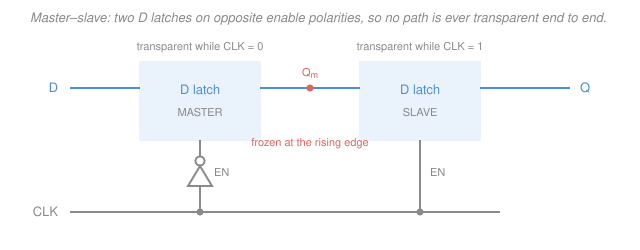

# Digital Logic Design · Lesson 3.2: Flip-flops and clocking

> ⏱ ~15 min · Module 3: Sequential logic and finite-state machines · Builds on: [3.1 Latches and the storage of one bit](03-01-latches-storage-of-one-bit.md), [2.3 Arithmetic circuits](02-03-arithmetic-circuits.md) · Unlocks: [3.3 Analysis of synchronous circuits](03-03-analysis-of-synchronous-circuits.md), [3.4 Design of finite-state machines](03-04-design-of-finite-state-machines.md), [4.2 Counters](04-02-counters.md)

## Why this matters

[3.1](03-01-latches-storage-of-one-bit.md) left you with a broken machine. A gated D latch stores a bit, but while its enable is high it is *transparent* — the new value races around the feedback loop and back to the input, and the circuit can flip two or three times inside a single enable pulse. You cannot build a state machine out of something whose state changes an unknown number of times per tick.

This lesson is the fix, and it is the single most important engineering idea in the course: make the storage element look at its input for an *instant* rather than an *interval*. Everything after this — [3.3](03-03-analysis-of-synchronous-circuits.md), [3.4](03-04-design-of-finite-state-machines.md), every register, counter, and CPU in Module 4 — assumes it. It is also where digital design stops being pure algebra and starts having a clock speed.

## The idea

Here is the whole trick. An **edge-triggered flip-flop** samples its input at the *transition* of the clock — the moment the clock goes from 0 to 1 — and then ignores it completely until the next such transition.

Follow what that buys you. At the edge, the flip-flop grabs a value and drives it onto $Q$. That new $Q$ feeds combinational logic, which computes the next value and delivers it back to the flip-flop's input. In a latch this was a disaster: the input changed while the door was still open, and around it went again. In a flip-flop the door is already shut. The recomputed value just *waits* at the input, doing nothing, until the next edge.

So the race of [3.1](03-01-latches-storage-of-one-bit.md) does not merely get smaller — it is structurally impossible. And you get something better than safety: a **budget**. The logic has one full clock period to churn, glitch, settle, and reach a final answer, because nobody looks at it until the next edge. That single sentence is why synchronous design works. It converts "does this circuit ever settle?" — an unanswerable question about feedback — into "does it settle within $T$?" — an arithmetic question you can answer with a calculator. We answer it below.

Notation for this lesson: $Q$ is the current stored value, $Q^+$ is the value stored *after the next active clock edge* (some books write $Q(t{+}1)$). Complement is $\overline{Q}$ (some books write $Q'$). The clock signal is `CLK`.

## The formal version

### How edge triggering is built: master–slave

Take two D latches in series, and drive their enables with **opposite polarities** of the same clock.

Walk the two phases:

- **`CLK` = 0.** The master is transparent, so its output $Q_m$ tracks whatever $D$ is doing. The slave is opaque, holding the old $Q$. **The outside world sees nothing change.**
- **`CLK` rises (0 → 1).** In the same instant the master goes opaque — freezing whichever value of $D$ was present right then — and the slave goes transparent, passing that frozen value through to $Q$. **$Q$ updates exactly once.**
- **`CLK` = 1.** The master stays opaque, so later wiggles of $D$ get nowhere. The slave is transparent, but its input is a frozen constant. **Nothing changes.**
- **`CLK` falls (1 → 0).** The slave closes on the value it is holding; the master reopens and starts tracking $D$ again. **$Q$ holds.**

The key property: **exactly one latch is transparent at any moment**, so there is never a path from $D$ straight through to $Q$. *In words: the two doors of an airlock are never open together.* Because the slave only opens at the rising edge, $Q$ can only change there — that is edge triggering. Real chips usually use a different, cheaper internal structure (a pair of cross-coupled feedback loops with a pulse generator), but master–slave is the clearest way to see *why* the property holds.

### Symbols and conventions

On a schematic, a **triangle** (the "dynamic indicator") drawn at the clock input means edge-triggered. A **bubble** on the clock input as well means it triggers on the *falling* edge; no bubble means the *rising* edge. **This course uses rising-edge (positive-edge) flip-flops as the default everywhere unless a bubble says otherwise.** A bubble on the *output* is a different thing entirely — that is just $\overline{Q}$.

### The flip-flop family

A **characteristic table** answers: given the inputs and the current state, what is $Q^+$? A **characteristic equation** is the same table written as Boolean algebra — this is what you drop into an analysis in [3.3](03-03-analysis-of-synchronous-circuits.md).

**D flip-flop** — *what it's for:* it just stores. Almost all modern design uses D flip-flops and nothing else.

| $D$ | $Q^+$ | |
|---|---|---|
| 0 | 0 | reset |
| 1 | 1 | set |

$$\boxed{Q^+ = D}$$

**T (toggle) flip-flop** — *what it's for:* counting. A chain of these is a counter ([4.2](04-02-counters.md)).

| $T$ | $Q^+$ | |
|---|---|---|
| 0 | $Q$ | hold |
| 1 | $\overline{Q}$ | toggle |

$$Q^+ = T \oplus Q = T\overline{Q} + \overline{T}Q$$

**JK flip-flop** — *what it's for:* it does everything, including repairing the SR latch. Recall from [3.1](03-01-latches-storage-of-one-bit.md) that $S=R=1$ is *forbidden* on an SR latch — it drives both outputs to the same value and the result on release is a race. JK takes that hole in the table and **defines it as toggle**, so every one of the four input combinations is legal.

| $J$ | $K$ | $Q^+$ | |
|---|---|---|---|
| 0 | 0 | $Q$ | hold |
| 0 | 1 | 0 | reset |
| 1 | 0 | 1 | set |
| 1 | 1 | $\overline{Q}$ | **toggle** |

$$Q^+ = J\overline{Q} + \overline{K}Q$$

*Check the equation against all four rows:* $J{=}K{=}0 \Rightarrow 0 + Q = Q$; $J{=}0,K{=}1 \Rightarrow 0 + 0 = 0$; $J{=}1,K{=}0 \Rightarrow \overline{Q} + Q = 1$; $J{=}K{=}1 \Rightarrow \overline{Q} + 0 = \overline{Q}$. All four match.

JK is rarely produced by modern synthesis tools — silicon is cheap and D is simpler — but it is everywhere in textbooks and problem sets, so know it.

### Excitation tables — and what they are *for*

A characteristic table runs forward (inputs → next state). Design runs *backward*: [3.4](03-04-design-of-finite-state-machines.md) hands you a state diagram, which tells you that state bit $Q$ must go from 0 to 1 on some transition, and asks what to feed the flip-flop to make that happen. **An excitation table is that inverted lookup**, and it is the exact tool that converts a state diagram into next-state logic. `X` denotes a don't-care: *any* value works, so you are free to pick whichever minimizes the K-map ([2.1](02-01-karnaugh-maps.md)).

| $Q \rightarrow Q^+$ | $D$ | $T$ | $J$ | $K$ |
|---|---|---|---|---|
| 0 → 0 | 0 | 0 | 0 | X |
| 0 → 1 | 1 | 1 | 1 | X |
| 1 → 0 | 0 | 1 | X | 1 |
| 1 → 1 | 1 | 0 | X | 0 |

*Derivation of the JK column, from $Q^+ = J\overline{Q} + \overline{K}Q$:* with $Q=0$ the equation collapses to $Q^+ = J$, so $J$ must equal the target and $K$ is irrelevant. With $Q=1$ it collapses to $Q^+ = \overline{K}$, so $K$ must be the complement of the target and $J$ is irrelevant.

Notice the arithmetic: $D$ is trivial ($D = Q^+$), $T$ is trivial ($T = Q \oplus Q^+$), and **JK is half don't-cares**. Those four X's are free minimization slack, which is precisely why classic textbook designs done with JK flip-flops come out with fewer gates than the same design done with D.

### Timing: what a clock period actually has to pay for

Three numbers characterize every real flip-flop, all measured relative to the active clock edge:

- **Setup time** $t_{su}$ — the input must be *stable for at least this long before* the edge.
- **Hold time** $t_h$ — the input must *remain stable for at least this long after* the edge.
- **Clock-to-Q** $t_{cq}$ — the delay from the edge until $Q$ is valid.

Setup and hold together define a small window straddling the edge inside which $D$ must not move. Violate it and the flip-flop can go **metastable** — the same hazard [3.1](03-01-latches-storage-of-one-bit.md) raised for latches: $Q$ hovers at an undefined voltage for an unbounded time before falling to 0 or 1. That is not a slow answer, it is *no* answer, and it is why every clock-domain crossing in real hardware is treated as a hazard.

**The maximum clock frequency.** Follow one signal. At an active edge, flip-flop FF1 launches a value; it is valid at $Q_1$ after $t_{cq}$. It crosses combinational logic whose worst-case delay is $t_{\text{comb,max}}$, arriving at FF2's $D$ input at time $t_{cq} + t_{\text{comb,max}}$. The *next* edge happens at $T_{clk}$, and FF2 demands stability starting $t_{su}$ before it. So the arrival must beat $T_{clk} - t_{su}$:

$$\boxed{\;T_{clk} \;\ge\; t_{cq} + t_{\text{comb,max}} + t_{su}\;}\qquad f_{max} = \frac{1}{T_{clk,\min}}$$

*In words: a clock period must be long enough to get a value out of one flip-flop, through the slowest logic path, and settled at the next flip-flop before the following tick.* The path that maximizes the right-hand side is the **critical path**, and it alone sets the chip's speed. This is literally how a clock rating gets chosen.

**Hold violations are a different animal.** The hold constraint says the new value must not arrive at FF2 *too early* — before FF2 has finished capturing the old one:

$$t_{cq} + t_{\text{comb,min}} \;\ge\; t_h$$

Read that inequality carefully: **$T_{clk}$ does not appear in it.** A hold violation is a fast path racing the clock edge, and **slowing the clock down cannot fix it** — not by any amount. Every instinct says "when in doubt, run it slower," and for setup violations that instinct is right; for hold violations it is useless. The only fixes are to *add* delay to the short path (insert buffers) or to rebalance the logic.

**Clock skew.** The clock does not reach every flip-flop at the same instant — wires have length. If the receiving flip-flop's clock arrives $t_{skew}$ *early*, the period effectively shrinks and the setup constraint becomes $T_{clk} \ge t_{cq} + t_{\text{comb,max}} + t_{su} + t_{skew}$; skew in the other direction eats hold margin instead. Skew therefore attacks both constraints at once, which is why distributing a clock across a large chip with near-zero skew (H-trees, balanced buffer networks) is a serious engineering discipline in its own right, and why a large fraction of a chip's power goes into the clock network.

## Picture

Read it top to bottom, left to right — clock first, then inputs, then outputs:

1. **The clock sets the beat.** Four rising edges, numbered 1–4. Only these instants matter; the falling edges are decoration for a positive-edge design.
2. **At each edge, look straight down at $D$.** The coral dots are the sampled values: `0`, `1`, `0`, `1`.
3. **$Q$ takes those values in order** — and each transition is drawn a hair *to the right* of its edge. That gap is $t_{cq}$; drawing it is the convention that reminds you outputs lag their edge, which is exactly why a value launched at edge $n$ can be safely captured at edge $n{+}1$ rather than immediately re-triggering.
4. **The shaded band at edge 2** is the setup window (before, coral) and hold window (after, blue). $D$ is flat across it, so this capture is clean.
5. **The narrow $D$ pulse between edges 2 and 3 vanishes entirely.** No edge falls inside it, so the flip-flop never sees it. A transparent latch *would* have shown it. Losing short pulses is not a bug — it is the noise immunity you bought by sampling.

## Worked examples

**Example 1 (mechanical — three flip-flops, one waveform).** The same input waveform drives a D, a T, and a JK flip-flop. All start with $Q = 0$. The input value sampled at edges 1 through 5 is `1, 0, 1, 1, 0`. For the JK, tie $J = K = $ that input (which makes it "hold or toggle").

Apply the characteristic equations one edge at a time:

| Edge | input | $Q_D^+ = D$ | $Q_T^+ = T \oplus Q$ | $Q_{JK}^+$ ($J=K$) |
|---|---|---|---|---|
| start | — | 0 | 0 | 0 |
| 1 | 1 | 1 | $1 \oplus 0 = 1$ | toggle → 1 |
| 2 | 0 | 0 | $0 \oplus 1 = 1$ | hold → 1 |
| 3 | 1 | 1 | $1 \oplus 1 = 0$ | toggle → 0 |
| 4 | 1 | 1 | $1 \oplus 0 = 1$ | toggle → 1 |
| 5 | 0 | 0 | $0 \oplus 1 = 1$ | hold → 1 |

*Check:* with $J = K$ the JK table only ever uses its hold row ($J{=}K{=}0$) and its toggle row ($J{=}K{=}1$) — which is the T flip-flop's table exactly. The two columns agree at every edge, confirming the standard fact that **tying $J$ and $K$ together turns a JK into a T**. The D column, meanwhile, simply reprints the input, one edge late.

**Example 2 (why you'd care — setting the clock speed).** A pipeline stage has $t_{cq} = 150$ ps, $t_{su} = 80$ ps, $t_h = 60$ ps. Its critical path is a ripple-carry adder from [2.3](02-03-arithmetic-circuits.md) with $t_{\text{comb,max}} = 1420$ ps; its *shortest* path is a single gate at $t_{\text{comb,min}} = 90$ ps.

Setup:

$$T_{clk} \ge 150 + 1420 + 80 = 1650\ \text{ps} = 1.65\ \text{ns}$$

$$f_{max} = \frac{1}{1.65\ \text{ns}} = \frac{1}{1.65 \times 10^{-9}\ \text{s}} \approx 6.06 \times 10^{8}\ \text{Hz} \approx 606\ \text{MHz}$$

Hold:

$$t_{cq} + t_{\text{comb,min}} = 150 + 90 = 240\ \text{ps} \;\ge\; t_h = 60\ \text{ps}\quad\text{— passes, with 180 ps of margin.}$$

Now suppose marketing wants 800 MHz, i.e. $T_{clk} = 1/(800\times10^6) = 1.25$ ns $= 1250$ ps. The logic budget becomes $1250 - 150 - 80 = 1020$ ps, so the 1420 ps adder must lose 400 ps — replace the ripple-carry with a carry-lookahead, or split the stage in two. Notice you cannot buy this back by touching the hold path; the two constraints are argued separately, always.

*Check:* $606\ \text{MHz} \times 1.65\ \text{ns} = 0.606 \times 1.65 \approx 1.00$, so the period and frequency are consistent. And every term in the setup sum is a delay in ps, so the units are homogeneous.

## Watch out

- **You might think slowing the clock fixes any timing problem, but a hold violation is immune.** $T_{clk}$ appears nowhere in $t_{cq} + t_{\text{comb,min}} \ge t_h$. A board that fails at every frequency you try — including absurdly slow ones — is telling you the failure is a hold violation, not a setup one.
- **You might read `X` in an excitation table as "0", but it means "your choice."** Treating the JK X's as zeros throws away exactly the minimization freedom that makes JK designs cheap. They are don't-cares in the [2.2](02-02-dont-cares-pos-quine-mccluskey.md) sense: circle them into a K-map group when it helps, ignore them when it doesn't.
- **You might think $Q$ changes *at* the clock edge, but it changes $t_{cq}$ *after* it.** This is not pedantry — it is the entire reason a shift register works. Each stage's output arrives too late to be re-captured by the same edge that produced it, so a value moves exactly one stage per tick instead of racing down the whole chain.
- **You might think the triangle and the bubble on a clock input mean the same kind of thing.** The triangle says *edge-triggered rather than level-sensitive*; the bubble says *which edge*. A latch has neither; a falling-edge flip-flop has both.

## One-liner

> A flip-flop is a latch taught to blink — it looks at its input only for an instant at the clock edge, which kills the feedback race and hands the combinational logic a full period, $T_{clk} \ge t_{cq} + t_{\text{comb,max}} + t_{su}$, to settle.

## Problems

**P1 (🟢)** A positive-edge-triggered D flip-flop has rising clock edges at $t = 10, 20, 30, 40, 50, 60, 70$ ns. $Q = 0$ initially. $D$ behaves as follows (times in ns):

| interval | $D$ |
|---|---|
| $0 \le t < 12$ | 0 |
| $12 \le t < 28$ | 1 |
| $28 \le t < 35$ | 0 |
| $35 \le t < 43$ | 1 |
| $43 \le t < 52$ | 0 |
| $52 \le t < 57$ | 1 |
| $57 \le t < 62$ | 0 |
| $62 \le t$ | 1 |

Give the value of $Q$ produced at each of the seven edges. Which $D$ pulse is completely invisible to the flip-flop, and what would a *transparent* D latch have done with it?

**P2 (🟡)** A synchronous block has $t_{cq} = 200$ ps, $t_{su} = 100$ ps, and a critical combinational path of 700 ps. (a) Find the minimum clock period and $f_{max}$. (b) The clock arrives at the capturing flip-flop 60 ps *early* relative to the launching one. Recompute $f_{max}$ under this worst-case skew.

**P3 (🔴)** In a shift register two flip-flops are wired output-to-input with no logic and negligible wire delay. The flip-flops have $t_{cq} = 25$ ps, $t_{su} = 50$ ps, $t_h = 60$ ps. (a) Does the design meet its hold constraint? (b) The lab decides to run the board at half speed to make the problem go away. Will that work? Explain in one sentence. (c) Buffers with 20 ps delay each are available. How many must be inserted in the path, and verify the fix does not break the setup constraint at a 1 GHz clock.

Solutions

**P1** At each edge, read $D$ at that instant.

| edge (ns) | $D$ at that instant | interval used | $Q$ after edge |
|---|---|---|---|
| 10 | 0 | $0\le t<12$ | 0 |
| 20 | 1 | $12\le t<28$ | 1 |
| 30 | 0 | $28\le t<35$ | 0 |
| 40 | 1 | $35\le t<43$ | 1 |
| 50 | 0 | $43\le t<52$ | 0 |
| 60 | 0 | $57\le t<62$ | 0 |
| 70 | 1 | $62\le t$ | 1 |

So $Q$ = `0, 1, 0, 1, 0, 0, 1`.

The pulse $52 \le t < 57$ is invisible: it lies strictly between the edges at 50 and 60 ns, so no sampling instant falls inside it. A gated D latch that happened to be transparent over that stretch would have passed the pulse straight to its output, producing a 5 ns glitch on $Q$ — exactly the transparency problem of [3.1](03-01-latches-storage-of-one-bit.md).

*Check:* each edge time was matched against the interval containing it — 60 ns falls in $57 \le t < 62$ (not in the pulse, which ended at 57), and 70 ns falls in the final $62 \le t$ interval. Note also that $Q$ changes at edges 20, 30, 40, 50 and 70 but not at 60, since it was already 0.

**P2** (a) Setup constraint:

$$T_{clk} \ge t_{cq} + t_{\text{comb,max}} + t_{su} = 200 + 700 + 100 = 1000\ \text{ps} = 1.00\ \text{ns}$$

$$f_{max} = \frac{1}{1.00\ \text{ns}} = 1.00\ \text{GHz}$$

(b) An early-arriving capture clock steals directly from the period, so add the skew:

$$T_{clk} \ge 200 + 700 + 100 + 60 = 1060\ \text{ps} = 1.06\ \text{ns}$$

$$f_{max} = \frac{1}{1.06\ \text{ns}} \approx 0.9434\ \text{GHz} \approx 943\ \text{MHz}$$

*Check:* $943\ \text{MHz} \times 1.06\ \text{ns} \approx 1.00$. A 6 percent stretch in the period gives a 5.7 percent drop in frequency, which is the right order — 60 ps of skew costs about 57 MHz here.

**P3** (a) The hold constraint on a direct flip-flop-to-flip-flop path, with $t_{\text{comb,min}} = 0$:

$$t_{cq} + t_{\text{comb,min}} = 25 + 0 = 25\ \text{ps} \;\not\ge\; t_h = 60\ \text{ps}$$

It **fails**, short by 35 ps. The new value reaches the second flip-flop's input 35 ps before that flip-flop has finished capturing the old one, so the value can race through two stages on a single edge.

(b) **No.** $T_{clk}$ does not appear in the hold inequality at all — the violation is a race between two signals launched by the *same* edge, and stretching the gap to the *next* edge changes nothing. The circuit will fail identically at 1 Hz.

(c) Each buffer adds 20 ps to $t_{\text{comb,min}}$. One buffer gives $25 + 20 = 45 < 60$, still failing. **Two buffers** give

$$25 + 40 = 65\ \text{ps} \;\ge\; 60\ \text{ps}\quad\text{— passes, with 5 ps of margin.}$$

Setup check at 1 GHz ($T_{clk} = 1000$ ps): the buffers are now also on the longest path, so $t_{\text{comb,max}} = 40$ ps and

$$t_{cq} + t_{\text{comb,max}} + t_{su} = 25 + 40 + 50 = 115\ \text{ps} \;\le\; 1000\ \text{ps},$$

leaving 885 ps of setup slack. Fixing the hold violation costs essentially nothing in speed — which is the usual outcome, and why buffer insertion is the standard repair.

## Flashback

**From Lesson 3.1 (Latches and the storage of one bit):** A gated D latch (transparent while $EN = 1$, holding while $EN = 0$) starts with $Q = 0$. The waveforms, in ns: $EN$ is 1 for $20 \le t < 40$ and 0 otherwise; $D$ is 0 for $t < 25$, 1 for $25 \le t < 33$, 0 for $33 \le t < 45$, and 1 for $t \ge 45$. Sketch $Q(t)$, and state the value latched when $EN$ falls.

Solution

- $t < 20$: $EN = 0$, latch opaque. $Q = 0$ (its initial value).
- $20 \le t < 25$: $EN = 1$, transparent, $D = 0$, so $Q = 0$.
- $25 \le t < 33$: transparent and $D$ rises to 1, so $Q$ **follows immediately** to 1.
- $33 \le t < 40$: still transparent, $D$ drops back to 0, so $Q$ follows back down to 0.
- At $t = 40$: $EN$ falls, latch closes on the value present then, namely $Q = 0$.
- $t \ge 40$: opaque. $D$ rises at $t = 45$, but $Q$ **stays 0**.

So $Q$ is 0 everywhere except a pulse of 1 across $25 \le t < 33$, and the latched value is **0**.

*Check:* the answer must be reproducible from the rule "output equals input while enabled, equals its last enabled value while disabled" — it is, and $Q$ changes twice during a single enable pulse, which is precisely the transparency that this lesson's edge-triggered flip-flop eliminates. A positive-edge flip-flop clocked at $t = 30$ would instead have captured a single value (1) and held it flat.

## Connections

- **Backward:** the master and slave are the very gated D latches of [3.1](03-01-latches-storage-of-one-bit.md), unchanged — only the wiring is new. JK's toggle row is the direct repair of the SR latch's forbidden $S = R = 1$ input from that same lesson, and the `X` entries in the excitation tables are the don't-cares of [2.2](02-02-dont-cares-pos-quine-mccluskey.md), to be exploited on a K-map exactly as in [2.1](02-01-karnaugh-maps.md).
- **Forward:** [3.3](03-03-analysis-of-synchronous-circuits.md) uses the characteristic equations to run a clocked circuit *forward* into a state table; [3.4](03-04-design-of-finite-state-machines.md) uses the excitation tables to run a state diagram *backward* into next-state logic. [4.1](04-01-registers-and-shift-registers.md) and [4.2](04-02-counters.md) wire these flip-flops in parallel and in chains, and [4.4](04-04-datapaths-and-a-simple-cpu.md)'s clock rate is set by the very inequality derived here.
- **Sideways:** the gate delays that make up $t_{\text{comb,max}}$ come from transistor-level physics — see [`electronics` 4.3](../../electronics/lessons/04-03-cmos-inverter-gates.md), which also explains why the clock network, switching every gate on the chip twice per period, dominates dynamic power. Sampling a continuous signal only at discrete instants, and thereby losing anything that happens between them, is the same act formalized as the sampling theorem in [`signals-systems` 3.1](../../signals-systems/lessons/03-01-sampling-nyquist-shannon.md) — the lost narrow pulse in the figure is aliasing's digital cousin.
